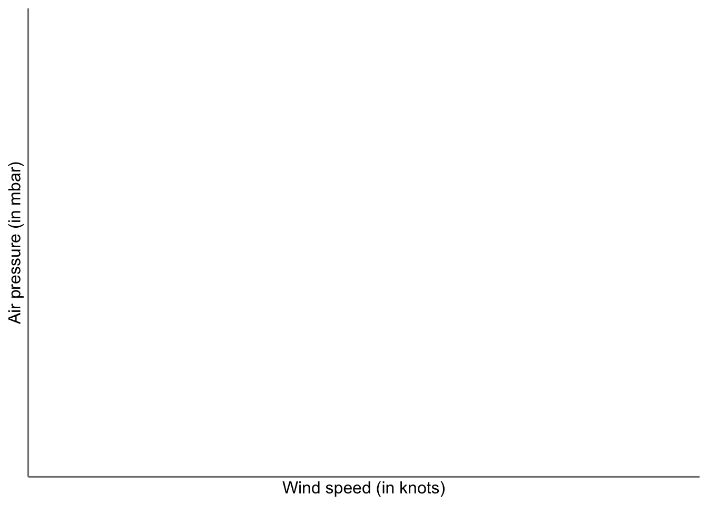
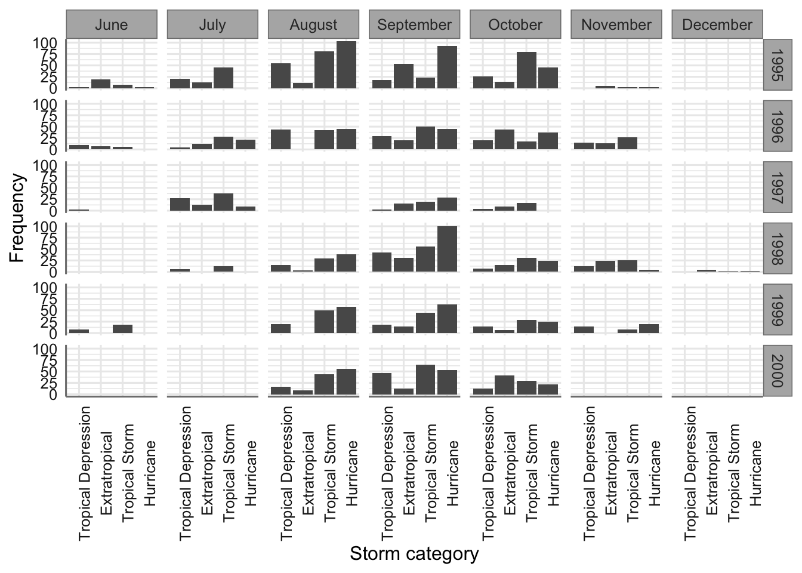

# Análisis exploratorio de datos {#aed}

Esta unidad mostrará cómo utilizar la visualización y la transformación para explorar los datos de un diseño experimental de una manera sistemática, una tarea que los estadísticos llaman análisis exploratorio de datos, o AED (EDA en inglés) para abreviar. Los contenidos para este tema se han obtenido de @HadleyGrolemund16.

EDA es un ciclo iterativo en el que el investigador debe: este caso se irán mezclando los contenidos teóricos con los prácticos para ir mostrando el funcionamiento de las diferentes funciones y procedimientos para el análisis inicial de nuestro banco de datos.

-   Generar preguntas sobre tus datos.
-   Buscar respuestas visualizando, transformando y modelando sus datos.
-   Usar lo que aprende para refinar sus preguntas y / o generar nuevas preguntas.

EDA no es un proceso formal con un conjunto estricto de reglas. Más que nada, EDA es un estado mental. Durante las fases iniciales de EDA, debe sentirse libre de investigar cada idea que se le ocurra. Algunas de estas ideas funcionarán, y algunas serán callejones sin salida. A medida que continúe su exploración, se dirigirá a algunas áreas particularmente productivas que eventualmente escribirá y comunicará a otros.

El EDA es una parte importante de cualquier análisis de datos porque siempre debe investigar la calidad de sus datos. La limpieza de datos es solo una aplicación de EDA: el investigador debe hacer preguntas sobre si sus datos cumplen con sus expectativas o no. Para realizar la limpieza de datos, deberá implementar todas las herramientas de EDA: visualización, transformación y modelado.

## Objetivos

El objetivo durante EDA es desarrollar una comprensión de los datos experimentales recogidos. La forma más fácil de hacerlo es utilizar preguntas como herramientas para guiar su investigación. Cuando se hace una pregunta, la pregunta centra la atención del investigador en una parte específica del conjunto de datos y le ayuda a decidir qué gráficos, modelos o transformaciones realizar.

EDA es fundamentalmente un proceso creativo. Como la mayoría de los procesos creativos, la clave para hacer preguntas de calidad es generar una gran cantidad de preguntas. Es difícil hacer preguntas reveladoras al comienzo del análisis porque el investigador no sabe qué información contiene su conjunto de datos. Por otro lado, cada nueva pregunta que haga le expondrá a un nuevo aspecto de sus datos y aumentará sus posibilidades de hacer un descubrimiento. Se puede profundizar rápidamente en las partes más interesantes de los datos experimentales recogidos y desarrollar una serie de preguntas que invitan a la reflexión, si se realiza un seguimiento de cada pregunta con una nueva pregunta basada en lo que se encuentre.

No hay una regla sobre qué preguntas se deben hacer para guiar la investigación, ya que debe ser el investigador en función de los objetivos del experimento planteado el que desarrolle dichas preguntas. Sin embargo, dos tipos de preguntas siempre serán útiles para hacer descubrimientos dentro de los datos. Estas preguntas son:

-   ¿Qué tipo de variabilidad ocurre dentro de las variables recogidas?
-   ¿Qué tipo de covariación (o variabilidad conjunta entre dos o más variables) ocurre entre las variables recogidas?

## Variabilidad

La variabilidad es la tendencia de los valores de una variable a cambiar de medición a medición. Dicha variabilidad se parecía claramente en la vida real; si se mide cualquier variable continua dos veces, se obtendrán dos resultados diferentes. Esto es cierto incluso si se miden cantidades que son constantes, como la velocidad de la luz. Cada una de sus medidas incluirá una pequeña cantidad de error que varía de una medida a otra. Las variables categóricas también pueden variar si se miden diferentes sujetos (por ejemplo, los colores de los ojos de diferentes personas) o en diferentes momentos (por ejemplo, los niveles de energía de un electrón en diferentes momentos). Cada variable tiene su propio patrón de variación, que puede revelar información interesante. La mejor manera de entender ese patrón es visualizar la distribución de los valores de la variable mediante descriptores numéricos o gráficos.

Si la variación describe el comportamiento dentro de una variable, la covariación describe el comportamiento entre las variables. La covariación es la tendencia de los valores de dos o más variables a variar juntas de una manera relacionada. La mejor forma de detectar la covariación es visualizar la relación entre dos o más variables. Cómo hacer eso nuevamente debería depender del tipo de variables involucradas.

## Procesado inicial

La descripción numérica y la visualización gráfica son las herramientas más importantes en los pasos iniciales para la generación de conocimiento sobre los datos experimentales, pero en ocasiones los datos no son recogidos en la forma más efectiva para realizar dichos análisis. A menudo se necesitara crear algunas variables o resúmenes nuevos, o tal vez solo se quiera cambiar el nombre de las variables o reordenar las observaciones para facilitar el trabajo de los datos. En este tema aprenderemos cómo hacer todo eso. Para ejemplificar los procedimientos utilizaremos el conjunto de datos `flights` contenido en la librería `nycflights13`, que contiene toda la información sobre los vuelos que salieron desde la ciudad de Nueva York en 2013.

Las variables que contiene este banco de datos (336776 observaciones = vuelos) son:

-   **year**: Fecha de salida (año).
-   **month**: Fecha de salida (mes).
-   **year,month,day**: Fecha de salida (día).
-   **dep_time**: Hora real de salida.
-   **arr_time**: Hora real de llegada (en horario de la ciudad de llegada).
-   **sched_dep_time**: Hora programada de salida. (Esta variable debe coincidir con la información de las variables hour y minute)
-   **sched_arr_time**: Hora programada de llegada (en horario de la ciudad de llegada).
-   **dep_delay**: Demora de salida (en minutos). Los tiempos negativos representan salidas tempranas.
-   **arr_delay**: Demora de llegada (en minutos). Los tiempos negativos representan llegadas tempranas.
-   **hour**: Hora de partida programada.
-   **minute**: Minuto de partida programada.
-   **carrier**: Aerolínea encargada del vuelo
-   **tailnum**: Identificador del avión
-   **flight**: Identificador del vuelo
-   **origin**: Origen del vuelo
-   **dest**: Destino del vuelo
-   **air_time**: Tiempo de vuelo (en minutos)
-   **distance**: Distancia entre los dos aeropuertos (en millas)
-   **time_hour**: Fecha y hora programadas del vuelo como una fecha POSIXct. Junto con el origen, se puede usar para unir datos de vuelos a datos meteorológicos.

> Recuerda que debes instalar dicha librería antes de poder reproducir todo los procedimientos que mostramos en las secciones siguientes.

Instalamos la librería (junto con todas las necesarias para la asignatura) y cargamos los datos para poder visualizarlos:


```r
library(nycflights13)
```

Código para cargar y visualizar los datos


```r
# Carga de datos
data(flights)
# Visualización de los 10 primeros casos
head(flights,10)
```

Tambien podemos ver la estructura (tipo de variables) del banco de datos. Los tipos de variables que se admiten en R son: `int` para enteros, `dbl` para números reales, `chr` para vectores de caracteres o cadenas, `dttm` para fechas-tiempos (una fecha + una hora), `lgl` para vectores lógicos que solo contienen VERDADERO o FALSO, `fctr` para factores (que R usa para representar variables categóricas con valores posibles fijos), y `date` para fechas.


```r
# Visualización de la estructura del banco de datos
str(flights)
```

```
## tibble [336,776 × 19] (S3: tbl_df/tbl/data.frame)
##  $ year          : int [1:336776] 2013 2013 2013 2013 2013 2013 2013 2013 2013 2013 ...
##  $ month         : int [1:336776] 1 1 1 1 1 1 1 1 1 1 ...
##  $ day           : int [1:336776] 1 1 1 1 1 1 1 1 1 1 ...
##  $ dep_time      : int [1:336776] 517 533 542 544 554 554 555 557 557 558 ...
##  $ sched_dep_time: int [1:336776] 515 529 540 545 600 558 600 600 600 600 ...
##  $ dep_delay     : num [1:336776] 2 4 2 -1 -6 -4 -5 -3 -3 -2 ...
##  $ arr_time      : int [1:336776] 830 850 923 1004 812 740 913 709 838 753 ...
##  $ sched_arr_time: int [1:336776] 819 830 850 1022 837 728 854 723 846 745 ...
##  $ arr_delay     : num [1:336776] 11 20 33 -18 -25 12 19 -14 -8 8 ...
##  $ carrier       : chr [1:336776] "UA" "UA" "AA" "B6" ...
##  $ flight        : int [1:336776] 1545 1714 1141 725 461 1696 507 5708 79 301 ...
##  $ tailnum       : chr [1:336776] "N14228" "N24211" "N619AA" "N804JB" ...
##  $ origin        : chr [1:336776] "EWR" "LGA" "JFK" "JFK" ...
##  $ dest          : chr [1:336776] "IAH" "IAH" "MIA" "BQN" ...
##  $ air_time      : num [1:336776] 227 227 160 183 116 150 158 53 140 138 ...
##  $ distance      : num [1:336776] 1400 1416 1089 1576 762 ...
##  $ hour          : num [1:336776] 5 5 5 5 6 5 6 6 6 6 ...
##  $ minute        : num [1:336776] 15 29 40 45 0 58 0 0 0 0 ...
##  $ time_hour     : POSIXct[1:336776], format: "2013-01-01 05:00:00" "2013-01-01 05:00:00" "2013-01-01 05:00:00" ...
```

### Operaciones con sujetos

Los procedimientos para el trabajo con los sujetos de nuestra muestra se reducen al filtrado u ordenación, para quedarnos con un subconjunto de sujetos o para organizar su visualización en otra forma.

#### Filtrado

Usamos el filtrado para seleccionar un subconjunto de observaciones del data.frame que contiene nuestros datos. Esto se hace a menudo cuando queremos limitar un análisis a un subconjunto de observaciones. El uso básico del filtro se hace mediante la función `filter()`:


```r
filter(data_set, <expression1>, <expression2>, ...)
```

donde `data_set` es el nombre del objeto que contiene nuestros datos y `<expression1>, <expression2>,...`son uno o más argumentos adicionales, donde cada uno de estos es una expresión de R válida que implica una o más condiciones a aplicar sobre las variables del conjunto de datos. Cada expresión se interpreta como una condición lógica (verdadero o falso).

Para usar el filtrado de manera efectiva, se debe saber cómo seleccionar las observaciones que se desea utilizando los operadores de comparación. R proporciona el paquete estándar: `>` (mayor que), `>=` (mayor o igual que), `<` (menor que), `<=` (menor o igual que), `!=` (no igual a), y `==` (igual a).

Veamos diferentes posibilidades de filtrado sobre el banco de datos `flights`. En primer lugar filtramos todos los vuelos cuya día de origen sea el 1 de enero de 2013. El resultado es un conjunto de datos con 842 observaciones donde aparece la información de dichos vuelos. Almacenamos el resultado eb nuevo objeto y calculamos el tamaño (nñumero de sujetos) con la función `dim`.


```r
jan1 <- dplyr::filter(flights, month == 1, day == 1)
dim(jan1)
```

```
## [1] 842  19
```

Podemos combinar diferentes condiciones de filtrado mediante los operadores lógicos `&` es "y" (condición 1 y condición 2), `|` es "o" (condición 1 o condición 2). Seleccionamos ahora todos los vuelos con mes de origen igual a Noviembre o Diciembre.


```r
nov_dec <- dplyr::filter(flights, month == 11 | month == 12)
dim(nov_dec) # Para saber cuantas observaciones contiene el banco de datos filtrado 
```

```
## [1] 55403    19
```

Los datos filtrados contienen la información completa de 55403 vuelos. Otra forma de conseguir el mismo resultado es con el operador `%in%`


```r
nov_dec <- dplyr::filter(flights, month %in% c(11, 12))
dim(nov_dec)
```

```
## [1] 55403    19
```

A veces se pueden simplificar condiciones de filtrado más complicadas sin más que recordar la ley de De Morgan: `!(x & y) es lo mismo que`!x \| !y`,  y`!(x \| y)`es lo mismo que`!x & !y\`. Por ejemplo, si se desean obtener todos vuelos que no se retrasaron (en llegada o partida) en más de dos horas, se pueden usar cualquiera de los dos filtros siguientes:


```r
db_sel1 <- dplyr::filter(flights, !(arr_delay > 120 | dep_delay > 120))
dim(db_sel1)
```

```
## [1] 316050     19
```

```r
db_sel2 <- dplyr::filter(flights, arr_delay <= 120, dep_delay <= 120)
dim(db_sel2)
```

```
## [1] 316050     19
```

#### Ordenación

Otro procesamiento muy habitual con los sujetos es reordenar las filas de un objeto que contiene nuestros datos. Esto se usa cuando queremos inspeccionar un conjunto de datos para buscar asociaciones entre las diferentes variables, lo que resulta difícil de hacer si no están ordenados. Para realizar la ordenación se utiliza la función `arrange()`. El uso básico de la función es:


```r
arrange(data_set, varname1, varname2, ...)
```

donde `data_set` es el nombre del objeto que contiene nuestros datos y `varname1, varname2,...` son las variables que vamos a utilizar para la ordenación. Por ejemplo deseamos ordenar nuestro datos siguiendo el orden año, mes y día:


```r
dbf_ord1 <- dplyr::arrange(flights, year, month, day)
str(dbf_ord1)
```

```
## tibble [336,776 × 19] (S3: tbl_df/tbl/data.frame)
##  $ year          : int [1:336776] 2013 2013 2013 2013 2013 2013 2013 2013 2013 2013 ...
##  $ month         : int [1:336776] 1 1 1 1 1 1 1 1 1 1 ...
##  $ day           : int [1:336776] 1 1 1 1 1 1 1 1 1 1 ...
##  $ dep_time      : int [1:336776] 517 533 542 544 554 554 555 557 557 558 ...
##  $ sched_dep_time: int [1:336776] 515 529 540 545 600 558 600 600 600 600 ...
##  $ dep_delay     : num [1:336776] 2 4 2 -1 -6 -4 -5 -3 -3 -2 ...
##  $ arr_time      : int [1:336776] 830 850 923 1004 812 740 913 709 838 753 ...
##  $ sched_arr_time: int [1:336776] 819 830 850 1022 837 728 854 723 846 745 ...
##  $ arr_delay     : num [1:336776] 11 20 33 -18 -25 12 19 -14 -8 8 ...
##  $ carrier       : chr [1:336776] "UA" "UA" "AA" "B6" ...
##  $ flight        : int [1:336776] 1545 1714 1141 725 461 1696 507 5708 79 301 ...
##  $ tailnum       : chr [1:336776] "N14228" "N24211" "N619AA" "N804JB" ...
##  $ origin        : chr [1:336776] "EWR" "LGA" "JFK" "JFK" ...
##  $ dest          : chr [1:336776] "IAH" "IAH" "MIA" "BQN" ...
##  $ air_time      : num [1:336776] 227 227 160 183 116 150 158 53 140 138 ...
##  $ distance      : num [1:336776] 1400 1416 1089 1576 762 ...
##  $ hour          : num [1:336776] 5 5 5 5 6 5 6 6 6 6 ...
##  $ minute        : num [1:336776] 15 29 40 45 0 58 0 0 0 0 ...
##  $ time_hour     : POSIXct[1:336776], format: "2013-01-01 05:00:00" "2013-01-01 05:00:00" "2013-01-01 05:00:00" ...
```

Podemos introducir la función `desc()` para ordenar de forma descendente por la variable seleccionada. Ordenamos nuestros datos (de mayor a menor) por la demora en el tiempo de llegada:


```r
dbf_ord2 <- dplyr::arrange(flights, desc(arr_delay))
str(dbf_ord2)
```

```
## tibble [336,776 × 19] (S3: tbl_df/tbl/data.frame)
##  $ year          : int [1:336776] 2013 2013 2013 2013 2013 2013 2013 2013 2013 2013 ...
##  $ month         : int [1:336776] 1 6 1 9 7 4 3 7 12 5 ...
##  $ day           : int [1:336776] 9 15 10 20 22 10 17 22 5 3 ...
##  $ dep_time      : int [1:336776] 641 1432 1121 1139 845 1100 2321 2257 756 1133 ...
##  $ sched_dep_time: int [1:336776] 900 1935 1635 1845 1600 1900 810 759 1700 2055 ...
##  $ dep_delay     : num [1:336776] 1301 1137 1126 1014 1005 ...
##  $ arr_time      : int [1:336776] 1242 1607 1239 1457 1044 1342 135 121 1058 1250 ...
##  $ sched_arr_time: int [1:336776] 1530 2120 1810 2210 1815 2211 1020 1026 2020 2215 ...
##  $ arr_delay     : num [1:336776] 1272 1127 1109 1007 989 ...
##  $ carrier       : chr [1:336776] "HA" "MQ" "MQ" "AA" ...
##  $ flight        : int [1:336776] 51 3535 3695 177 3075 2391 2119 2047 172 3744 ...
##  $ tailnum       : chr [1:336776] "N384HA" "N504MQ" "N517MQ" "N338AA" ...
##  $ origin        : chr [1:336776] "JFK" "JFK" "EWR" "JFK" ...
##  $ dest          : chr [1:336776] "HNL" "CMH" "ORD" "SFO" ...
##  $ air_time      : num [1:336776] 640 74 111 354 96 139 167 109 149 112 ...
##  $ distance      : num [1:336776] 4983 483 719 2586 589 ...
##  $ hour          : num [1:336776] 9 19 16 18 16 19 8 7 17 20 ...
##  $ minute        : num [1:336776] 0 35 35 45 0 0 10 59 0 55 ...
##  $ time_hour     : POSIXct[1:336776], format: "2013-01-09 09:00:00" "2013-06-15 19:00:00" "2013-01-10 16:00:00" ...
```

En el resumen de los datos presentados se pueden apreciar las diferencia entre los datos ordenados de una u otra forma.

### Trabajando con variables

Los procedimientos para el trabajo con las variables de nuestra muestra se reducen a la selección de un subconjunto de variables, la creación de nuevas variables, el renombrado de variables, y la recodificación en nuevas variables.

#### Selección

Usamos la función `select()` para seleccionar un subconjunto de variables de nuestro banco de datos. Esto función se usa cuando tenemos un conjunto de datos con muchas variables, pero solo necesitamos trabajar con un subconjunto de ellas. La función tiene la estructura:


```r
select(data_set, varname1, varname2, ...)
```

El primer argumento, `data_set`, es el nombre del objeto que contiene nuestros datos. A continuación incluimos una serie de uno o más argumentos adicionales, donde cada uno es el nombre de una o más variables en el conjunto de datos. Estas son las variables que aparecerán en el nuevo banco de datos.

Para el conjunto de datos `flights` vamos a seleccionar las variables `year`, `month`, y `day`.


```r
dbf_sel1 <- dplyr::select(flights, year, month, day)
# indicamos la libreria por la coincidencia de la función select()
# en otra libreria cargada
str(dbf_sel1) 
```

```
## tibble [336,776 × 3] (S3: tbl_df/tbl/data.frame)
##  $ year : int [1:336776] 2013 2013 2013 2013 2013 2013 2013 2013 2013 2013 ...
##  $ month: int [1:336776] 1 1 1 1 1 1 1 1 1 1 ...
##  $ day  : int [1:336776] 1 1 1 1 1 1 1 1 1 1 ...
```

A veces es más conveniente establecer la selección especificando aquellas que no necesitamos, en lugar de especificar cuáles guardar. Usamos el operador `-` para indicar que variables deben ser eliminadas.


```r
dbf_sel2 <- dplyr::select(flights, -(year:day)) 
# No seleccionamos las varaibles que se encuentran entre las variables year y day
str(dbf_sel2)
```

```
## tibble [336,776 × 16] (S3: tbl_df/tbl/data.frame)
##  $ dep_time      : int [1:336776] 517 533 542 544 554 554 555 557 557 558 ...
##  $ sched_dep_time: int [1:336776] 515 529 540 545 600 558 600 600 600 600 ...
##  $ dep_delay     : num [1:336776] 2 4 2 -1 -6 -4 -5 -3 -3 -2 ...
##  $ arr_time      : int [1:336776] 830 850 923 1004 812 740 913 709 838 753 ...
##  $ sched_arr_time: int [1:336776] 819 830 850 1022 837 728 854 723 846 745 ...
##  $ arr_delay     : num [1:336776] 11 20 33 -18 -25 12 19 -14 -8 8 ...
##  $ carrier       : chr [1:336776] "UA" "UA" "AA" "B6" ...
##  $ flight        : int [1:336776] 1545 1714 1141 725 461 1696 507 5708 79 301 ...
##  $ tailnum       : chr [1:336776] "N14228" "N24211" "N619AA" "N804JB" ...
##  $ origin        : chr [1:336776] "EWR" "LGA" "JFK" "JFK" ...
##  $ dest          : chr [1:336776] "IAH" "IAH" "MIA" "BQN" ...
##  $ air_time      : num [1:336776] 227 227 160 183 116 150 158 53 140 138 ...
##  $ distance      : num [1:336776] 1400 1416 1089 1576 762 ...
##  $ hour          : num [1:336776] 5 5 5 5 6 5 6 6 6 6 ...
##  $ minute        : num [1:336776] 15 29 40 45 0 58 0 0 0 0 ...
##  $ time_hour     : POSIXct[1:336776], format: "2013-01-01 05:00:00" "2013-01-01 05:00:00" "2013-01-01 05:00:00" ...
```

Cuando las variables que deseamos eliminar no se muestran de forma consecutiva en nuestro banco de datos podemos utilizar una expresión equivalente


```r
dbf_sel3 <- dplyr::select(flights, -c(year,month,day)) 
str(dbf_sel3)
```

```
## tibble [336,776 × 16] (S3: tbl_df/tbl/data.frame)
##  $ dep_time      : int [1:336776] 517 533 542 544 554 554 555 557 557 558 ...
##  $ sched_dep_time: int [1:336776] 515 529 540 545 600 558 600 600 600 600 ...
##  $ dep_delay     : num [1:336776] 2 4 2 -1 -6 -4 -5 -3 -3 -2 ...
##  $ arr_time      : int [1:336776] 830 850 923 1004 812 740 913 709 838 753 ...
##  $ sched_arr_time: int [1:336776] 819 830 850 1022 837 728 854 723 846 745 ...
##  $ arr_delay     : num [1:336776] 11 20 33 -18 -25 12 19 -14 -8 8 ...
##  $ carrier       : chr [1:336776] "UA" "UA" "AA" "B6" ...
##  $ flight        : int [1:336776] 1545 1714 1141 725 461 1696 507 5708 79 301 ...
##  $ tailnum       : chr [1:336776] "N14228" "N24211" "N619AA" "N804JB" ...
##  $ origin        : chr [1:336776] "EWR" "LGA" "JFK" "JFK" ...
##  $ dest          : chr [1:336776] "IAH" "IAH" "MIA" "BQN" ...
##  $ air_time      : num [1:336776] 227 227 160 183 116 150 158 53 140 138 ...
##  $ distance      : num [1:336776] 1400 1416 1089 1576 762 ...
##  $ hour          : num [1:336776] 5 5 5 5 6 5 6 6 6 6 ...
##  $ minute        : num [1:336776] 15 29 40 45 0 58 0 0 0 0 ...
##  $ time_hour     : POSIXct[1:336776], format: "2013-01-01 05:00:00" "2013-01-01 05:00:00" "2013-01-01 05:00:00" ...
```

#### Creación

En la creación de variables a partir de las originales en nuestros datos tenemos dos opciones: i) crear una nueva variable sin eliminar las variables originales, ii) crear una nueva variable eliminando las variables originales.

Usamos la función `mutate()` para crear nuevas variables en nuestro banco de datos sin eliminar las variables que forman parte de la nueva variable. La función tiene la estructura:


```r
mutate(data_set, <expression1>, <expression2>, ...)
```

El primer argumento, `data_set`, es el nombre del objeto que contiene nuestros datos. A continuación incluimos una serie de uno o más argumentos adicionales, donde cada uno es la expresión para la nueva o nuevas variables.

Veamos un ejemplo de uso de la función


```r
dbf_sel4 <- dplyr::select(flights, c(year,month,day,dep_delay,arr_delay,distance,air_time)) 
# Seleccionamos un subconjunto de las variables originales
str(dbf_sel4)
```

```
## tibble [336,776 × 7] (S3: tbl_df/tbl/data.frame)
##  $ year     : int [1:336776] 2013 2013 2013 2013 2013 2013 2013 2013 2013 2013 ...
##  $ month    : int [1:336776] 1 1 1 1 1 1 1 1 1 1 ...
##  $ day      : int [1:336776] 1 1 1 1 1 1 1 1 1 1 ...
##  $ dep_delay: num [1:336776] 2 4 2 -1 -6 -4 -5 -3 -3 -2 ...
##  $ arr_delay: num [1:336776] 11 20 33 -18 -25 12 19 -14 -8 8 ...
##  $ distance : num [1:336776] 1400 1416 1089 1576 762 ...
##  $ air_time : num [1:336776] 227 227 160 183 116 150 158 53 140 138 ...
```

```r
# Creamos una varaible que indica la reducción de demora entre salida y llegada
# Calculamos la velocidad del viaje
dbf_new <- dplyr::mutate(dbf_sel4,
  gain = arr_delay - dep_delay,
  speed = distance / air_time * 60
) 
str(dbf_new)
```

```
## tibble [336,776 × 9] (S3: tbl_df/tbl/data.frame)
##  $ year     : int [1:336776] 2013 2013 2013 2013 2013 2013 2013 2013 2013 2013 ...
##  $ month    : int [1:336776] 1 1 1 1 1 1 1 1 1 1 ...
##  $ day      : int [1:336776] 1 1 1 1 1 1 1 1 1 1 ...
##  $ dep_delay: num [1:336776] 2 4 2 -1 -6 -4 -5 -3 -3 -2 ...
##  $ arr_delay: num [1:336776] 11 20 33 -18 -25 12 19 -14 -8 8 ...
##  $ distance : num [1:336776] 1400 1416 1089 1576 762 ...
##  $ air_time : num [1:336776] 227 227 160 183 116 150 158 53 140 138 ...
##  $ gain     : num [1:336776] 9 16 31 -17 -19 16 24 -11 -5 10 ...
##  $ speed    : num [1:336776] 370 374 408 517 394 ...
```

Podemos ver que se han añadido las dos variables en el nuevo banco de datos que se ha creado. Una ventaja de esta función es que resulta posible crear nuevas variables a partir de las nuevas creadas


```r
dbf_new2 <- dplyr::mutate(dbf_sel4,
  gain = arr_delay - dep_delay,
  hours = air_time / 60,
  gain_per_hour = gain / hours
) 
str(dbf_new2)
```

```
## tibble [336,776 × 10] (S3: tbl_df/tbl/data.frame)
##  $ year         : int [1:336776] 2013 2013 2013 2013 2013 2013 2013 2013 2013 2013 ...
##  $ month        : int [1:336776] 1 1 1 1 1 1 1 1 1 1 ...
##  $ day          : int [1:336776] 1 1 1 1 1 1 1 1 1 1 ...
##  $ dep_delay    : num [1:336776] 2 4 2 -1 -6 -4 -5 -3 -3 -2 ...
##  $ arr_delay    : num [1:336776] 11 20 33 -18 -25 12 19 -14 -8 8 ...
##  $ distance     : num [1:336776] 1400 1416 1089 1576 762 ...
##  $ air_time     : num [1:336776] 227 227 160 183 116 150 158 53 140 138 ...
##  $ gain         : num [1:336776] 9 16 31 -17 -19 16 24 -11 -5 10 ...
##  $ hours        : num [1:336776] 3.78 3.78 2.67 3.05 1.93 ...
##  $ gain_per_hour: num [1:336776] 2.38 4.23 11.62 -5.57 -9.83 ...
```

Usamos la función `transmute()` para crear un banco de datos donde solo aparecen las nuevas variables creadas. La estructura de la función es idéntica a la de la función `mutate()`.


```r
dbf_new3 <- dplyr::transmute(dbf_sel4,
  gain = arr_delay - dep_delay,
  hours = air_time / 60,
  gain_per_hour = gain / hours
) 
str(dbf_new3)
```

```
## tibble [336,776 × 3] (S3: tbl_df/tbl/data.frame)
##  $ gain         : num [1:336776] 9 16 31 -17 -19 16 24 -11 -5 10 ...
##  $ hours        : num [1:336776] 3.78 3.78 2.67 3.05 1.93 ...
##  $ gain_per_hour: num [1:336776] 2.38 4.23 11.62 -5.57 -9.83 ...
```

El listado de funciones que podemos usar con las funciones `mutate()` y `transmute()` son:

-   Operadores aritméticos: `+`, `-`, `*`, `/`, `^`
-   Funciones logaritmo: `log()`, `log2()`, `log10()`
-   Funciones de agregación: `cumsum()` (suma acumulada), `cumprod()` (producto acumulado), `cummin()` (mínimo acumulado), `cummax()` (máximo acumulado), `cummean()` (media acumulada).
-   Comparaciones lógicas: `<`, `<=`, `>`, `>=`, `!=`

#### Creación de factores

La creación de variables tipo factor es un aspecto muy importante en el análisis de datos. Existen tres formas principales de conseguir variables de tipo factor:

1.  A partir de variables tipo carácter
2.  A partir de variables de tipo entero que pueden identificar niveles de una variable
3.  A partir de una variable de tipo numérico.

Por el momento solo mostraremos las opciones 1 y 2. La función utilizada para estas operaciones es `fct_recode()` cuya estructura viene dada por:


```r
fct_recode(varfactor, levelnew1=levelold1, levelnew2=levelold2, ...)
```

donde `varfactor` es la variable factor original, `levelnew` son los niveles del factor recodificados y `levelold` son los niveles del factor en la variable original.

Vamos a ver un ejemplo de su uso sobre el banco de datos NCBIRTH800 que presentamos en la unidad anterior. Cargamos los datos desde el repositorio y vemos su estructura:


```r
NCBIRTH800 = readr::read_csv("https://goo.gl/mB9Jcn", col_types = "dcddcccdccddcc")
```

En esta base de datos hay varias variables que se han recogido como carácter (aunque se les ha asignado un código numérico). A continuación se presentan dichas variables así como la asignación de valor a cada uno de los códigos numéricos:


```r
sex: "male" = 1,"female" = 2
marital: "married" = 1,"not married" = 2
racemom: "other non white" = 0, "White" = 1,"Black" = 2,
         "America indian" = 3,"Chinese" = 4,"Hawaiian" = 5,
         "Filipino" = 6,"Other asian" = 7, "Other" = 8
hispmom: "Cuban" = C, "Mexican" = M, "Non-Hispanic" = N ,
         "Other" = O,"Puerto Rican" = P, "Central/South american" = S,
         "U" = Not classificable
smoke: "Yes"=1, "No" = 0
drink: "Yes" = 1 ,"No" = 0
low: "Yes" = 1, "No" = 0
premie: "Yes"= 1, "No" = 0
```

Realizamos la asignación de los valores


```r
NCBIRTHnew <- dplyr::mutate(NCBIRTH800,      
              sex = forcats::fct_recode(sex,"male" = "1","female" = "2"),
              marital = forcats::fct_recode(marital,"married" = "1","not married" = "2"),
              racemom = forcats::fct_recode(racemom,"other non white" = "0","White" = "1",
                                   "Black" = "2","America  indian" = "3",
                                   "Chinese" = "4","Hawaiian" = "5","Filipino" = "6",
                                   "Other asian" = "7","Other" = "8"),
              hispmom = forcats::fct_recode(hispmom,"Cuban" = "C","Mexican" = "M",
                                   "Non-Hispanic" = "N","Other" = "O",
                                   "Puerto Rican" = "P","Central/South american" = "S",
                                   "U" = "Not classificable"),
              smoke = forcats::fct_recode(smoke,"Yes" = "1","No" = "0"),
              drink = forcats::fct_recode(drink,"Yes" = "1","No" = "0"),
              low = forcats::fct_recode(low,"Yes" = "1","No" = "0"),
              premie = forcats::fct_recode(premie,"Yes" = "1","No" = "0"))
str(NCBIRTHnew)
```

```
## spec_tbl_df [800 × 14] (S3: spec_tbl_df/tbl_df/tbl/data.frame)
##  $ plural : num [1:800] 1 1 1 1 1 1 1 1 1 1 ...
##  $ sex    : Factor w/ 2 levels "male","female": 1 2 1 1 1 1 2 2 2 2 ...
##  $ mage   : num [1:800] 32 32 27 27 25 28 25 15 37 21 ...
##  $ weeks  : num [1:800] 40 37 39 39 39 43 39 42 41 39 ...
##  $ marital: Factor w/ 2 levels "married","not married": 1 1 1 1 1 1 1 2 1 1 ...
##  $ racemom: Factor w/ 6 levels "White","Black",..: 1 1 1 1 1 1 1 1 6 1 ...
##  $ hispmom: Factor w/ 6 levels "Cuban","Mexican",..: 3 3 3 3 3 3 3 3 3 3 ...
##  $ gained : num [1:800] 38 34 12 15 32 32 75 25 31 28 ...
##  $ smoke  : Factor w/ 2 levels "No","Yes": 1 1 1 1 1 1 1 1 1 1 ...
##  $ drink  : Factor w/ 2 levels "No","Yes": 1 1 1 1 1 1 1 1 1 1 ...
##  $ tounces: num [1:800] 111 116 138 136 121 117 143 113 139 120 ...
##  $ tgrams : num [1:800] 3147 3289 3912 3856 3430 ...
##  $ low    : Factor w/ 2 levels "No","Yes": 1 1 1 1 1 1 1 1 1 1 ...
##  $ premie : Factor w/ 2 levels "No","Yes": 1 1 1 1 1 1 1 1 1 1 ...
##  - attr(*, "spec")=
##   .. cols(
##   ..   plural = col_double(),
##   ..   sex = col_character(),
##   ..   mage = col_double(),
##   ..   weeks = col_double(),
##   ..   marital = col_character(),
##   ..   racemom = col_character(),
##   ..   hispmom = col_character(),
##   ..   gained = col_double(),
##   ..   smoke = col_character(),
##   ..   drink = col_character(),
##   ..   tounces = col_double(),
##   ..   tgrams = col_double(),
##   ..   low = col_character(),
##   ..   premie = col_character()
##   .. )
##  - attr(*, "problems")=<externalptr>
```

En el resultado se aprecia la modificación de los diferentes factores.

### Reuniendo los datos

Un problema bastante común que parece en la recogida de datos experimentales es que los nombres de las columnas de la base de datos no es una variable en si, sino los valores de una variable. Si tomamos como ejemplo el banco de datos `PCKDATA`.


```r
PCKDATA = readr::read_csv("https://goo.gl/W8Bfgv", col_types = "idd")
PCKDATA
```

```
## # A tibble: 1,005 × 3
##     SUBJ     A     B
##    <int> <dbl> <dbl>
##  1     1   193   250
##  2     2    90   173
##  3     3   120   135
##  4     4   154    49
##  5     5   149    83
##  6     6   146   123
##  7     7   180   126
##  8     8   128   177
##  9     9   180   164
## 10    10    66   121
## # … with 995 more rows
```

Como se puede ver aparecen dos columnas indicando el tratamiento del sujeto, es decir, cada fila no identifica a un único sujeto. Por ese motivo en cada una de ellas aparece el valor del nivel de creatinina. Para poder trabajar de forma óptima cada fila debe contener la información única de cada sujeto. En este caso cada fila contiene la información de dos sujetos: el identificado como 1 en el tratamiento A y el identificado como 1 en el tratamiento B.

La función `gather()`nos permite reorganizar los datos de un banco de datos de forma muy sencilla. La estructura básica de la función es:


```r
gather(data_set,var, key = "key", value = "value", ...)
```

donde `data_set` es el banco de datos, var es el conjunto de variables que reorganizamos, `key` es el nombre de la variable donde reorganizamos las variables anteriores, y `value` es el nombre de la variable donde almacenamos los valores de respuesta. Para el conjunto de datos anterior tenemos:


```r
gather(PCKDATA,`A`,`B`, key = "Grupo", value = creatine)
```

```
## # A tibble: 2,010 × 3
##     SUBJ Grupo creatine
##    <int> <chr>    <dbl>
##  1     1 A          193
##  2     2 A           90
##  3     3 A          120
##  4     4 A          154
##  5     5 A          149
##  6     6 A          146
##  7     7 A          180
##  8     8 A          128
##  9     9 A          180
## 10    10 A           66
## # … with 2,000 more rows
```

Podemos ver que se han reorganizado las filas de la base de datos. De hecho se han duplicado el número de filas (hemos ampliado dos variables) y ahora cada columna identifica claramente la información de un sujeto.

## Análisis Descriptivo inicial

Esta sección muestra los procedimientos de análisis estadístico descriptivo para el estudio de una o dos variables de tipo numérico y/o categórico. Las situaciones que se plantean son:

-   Una variable de tipo factor.
-   Una variable de tipo numérico.
-   Dos variables categóricas.
-   Dos variables numéricas.
-   Una variable categórica y una variable numérica.

Este es el primer paso del EDA y sirve al investigador para plantear o responder las primeras preguntas de interés sobre sus datos. Para ilustrar los procedimientos utilizaremos el conjunto de datos `storms` de la librería `nasaweather`. Estos datos son un subconjunto de la base de datos de la NASA sobre los huracanes en el Atlántico Norte ([NOAA](http://www.nhc.noaa.gov/data/#hurdat)). Los datos incluyen las posiciones y atributos de 198 tormentas tropicales, medidas cada seis horas durante la vida de la tormenta. Las variables registradas son:

-   `name`: Nombre de la tormenta
-   `year`, `month`, `day`: Año, mes y día del informe de la tormenta
-   `hour`: Hora del informe (en UTC)
-   `lat`, `long`: Latitud y longitud de la tormenta
-   `pressure`: Presión atmosférica en el centro de la tormenta (en milibares)
-   `wind`: Máxima velocidad sostenida de la tormenta (en nudos)
-   `type`: Clasificación de la tormenta (Tropical Depression, Tropical Storm, or Hurricane)
-   `seasday`: día de la temporada de tormentas


```r
library(nasaweather)
# Guardamos los datos en un nuevo objeto
storm <- nasaweather::storms 
# Estructura de los datos
str(storm)
```

Dado que las variables `year` y `month` no vienen definidas como factores, el primer paso es convertirlas en factores. En este caso vamos a utilizar una versión diferente de la vista en el tema anterior para convertir varaibles enteras a factores.


```r
# Primero creamos el factor año
storm$year_f <- factor(storm$year)
# Asignamos los niveles
levels(storm$year_f) <- as.character(1995:2000)
# Ahora el factor mes
storm$month_f <- factor(storm$month)
# Asignamos los niveles
levels(storm$month_f) <- c("June", "July", "August", "September", 
                           "October", "November", "December")
# Veamos como queda el banco de datos
str(storm)
```

```
## tibble [2,747 × 13] (S3: tbl_df/tbl/data.frame)
##  $ name    : chr [1:2747] "Allison" "Allison" "Allison" "Allison" ...
##  $ year    : int [1:2747] 1995 1995 1995 1995 1995 1995 1995 1995 1995 1995 ...
##  $ month   : int [1:2747] 6 6 6 6 6 6 6 6 6 6 ...
##  $ day     : int [1:2747] 3 3 3 3 4 4 4 4 5 5 ...
##  $ hour    : int [1:2747] 0 6 12 18 0 6 12 18 0 6 ...
##  $ lat     : num [1:2747] 17.4 18.3 19.3 20.6 22 23.3 24.7 26.2 27.6 28.5 ...
##  $ long    : num [1:2747] -84.3 -84.9 -85.7 -85.8 -86 -86.3 -86.2 -86.2 -86.1 -85.6 ...
##  $ pressure: int [1:2747] 1005 1004 1003 1001 997 995 987 988 988 990 ...
##  $ wind    : int [1:2747] 30 30 35 40 50 60 65 65 65 60 ...
##  $ type    : chr [1:2747] "Tropical Depression" "Tropical Depression" "Tropical Storm" "Tropical Storm" ...
##  $ seasday : int [1:2747] 3 3 3 3 4 4 4 4 5 5 ...
##  $ year_f  : Factor w/ 6 levels "1995","1996",..: 1 1 1 1 1 1 1 1 1 1 ...
##  $ month_f : Factor w/ 7 levels "June","July",..: 1 1 1 1 1 1 1 1 1 1 ...
```

A lo largo de cada una de las secciones siguientes se irán introduciendo las funciones y procedimientos necesarias para cada análisis en función de la variable o variables que se desean analizar.

### Una variable factor

En esta sección se considera cómo explorar la distribución de una variable categórica. Se presentan las descriptivas básicas y visualizaciones que son apropiadas para las variables categóricas. Para ejemplificar los procedimientos utilizaremos la variable `type` que identifica el tipo de tormenta.

Explorar variables categóricas es generalmente más simple que trabajar con variables numéricas porque tenemos menos respuestas posibles. La primera pregunta que nos debemos plantear es is la variables categórica es de tipo nominal u ordinal. Esto tiene un efecto relevante a la hora de presentar y visualizar la información. La variable `type` es una variable categórica de tipo ordinal debido a que las tormentas son clasificadas según su virulencia.

#### Resúmenes numéricos

Cuando calculamos resúmenes de variables categóricas, intentamos describir la distribución muestral de la variable mediante el recuento de ocurrencias de cada una de las posibles respuestas de la variable. Estos recuentos es lo que denominamos en estadística **frecuencias absolutas**. Necesitamos entender qué categorías son comunes y cuáles son raras. Asociado a dichas frecuencias absolutas podemos obtener las **frecuencias relativas**, o más frecuentemente los **porcentajes** de cada una de las posibles categorías de la variable.

Si $F_i$ es la frecuencia absoluta de la categoría $i$ de la variable y $n$ es el tamaño de la muestra, se define la frecuencia relativa de la categoría $i$ ($f_i$) como:

```{=tex}
\begin{equation} 
  f_i =\frac{F_i}{n}
  (\#eq:freqrel)
\end{equation}
```
El porcentaje de la categoría $i$ es simplemente $100 * f_i$. La forma más sencilla para obtener la tabla de frecuencias absoluta asociada con una variable categórica es la función `table()`.


```r
table(storm$type)
```

```
## 
##       Extratropical           Hurricane Tropical Depression      Tropical Storm 
##                 412                 896                 513                 926
```

Para obtener los porcentajes en lugar de los conteos podemos utilizar le código siguiente


```r
type_counts <- table(storm$type)
round(type_counts / sum(type_counts),2) # Redondeamos a dos decimales
```

```
## 
##       Extratropical           Hurricane Tropical Depression      Tropical Storm 
##                0.15                0.33                0.19                0.34
```

Sin embargo, hay otra opción un poco más compleja pero que nos servirá de utilidad para el resto de esta unidad y que pasamos a mostrar a continuación. Es una combinación del operador de anidamiento `%>%`, de la función de agrupación (`group_by()`), de la función de resumen (`summarise()`), y de la función de conteos (`n()`).


```r
# banco de datos
tabla_tipo <- storm %>%  # agrupamos por la variable factor
  group_by(type) %>%     # resumimos contando el número de casos de cada nivel del factor
  summarise(n=n())       # Para calcular los porcentajes
dplyr::mutate(tabla_tipo,percent=round(100*n/sum(n),2))
```

```
## # A tibble: 4 × 3
##   type                    n percent
##   <chr>               <int>   <dbl>
## 1 Extratropical         412    15  
## 2 Hurricane             896    32.6
## 3 Tropical Depression   513    18.7
## 4 Tropical Storm        926    33.7
```

Aunque esta forma es más costosa cuando tenemos únicamente una variable nos resultará de más utilidad cuando deseemos realizar análisis que involucren un mayor número de variables.

> Podemos ver que mayoritariamente se han producido Tormentas Tropicales (33.71%) y Huracanes (32.62%). Estos dos tipos suman más de dos tercios de los ecentos registrados. Por contra los eventos menos abundantes han sido las Depresiones Tropicales (18.67%) y las Extratropicales (15.00%).

Las funciones más habituales que se utilizan con `summarise()` son:

-   Localización: `mean()` (media), `median()` (mediana)
-   Escala: `sd()` (desviación típica), `IQR()` (rango intercuartílico)
-   Rango: `min()` (mínimo), `max()` (máximo), `quantile()` (cuantil)
-   Posición: `first()` (primero), `last()` (último), `nth()` (posición n-ésima)
-   Conteo: `n()` (número de casos), `n_distinct()` (número de casos distintos)

La mayoría se usan exclusivamente para variables de tipo numérico.

#### Visualización gráfica

En este apartado veremos como representar los datos de los conteos de una variable categórica mediante la función 'ggplot\`. Esta función permite realizar casi cualquier tipo de gráfico que podamos imaginar. En este punto vamos a ir presentando diferentes parámetros de dicha función para ir familiarizándonos con su uso.

##### Gráfico barras

La herramienta gráfica más común utilizada para resumir una variable categórica es un gráfico de barras. Un gráfico de barras (o gráfico de barras) es un gráfico que presenta resúmenes de datos agrupados con barras rectangulares. La longitud de las barras es proporcional a los valores que representan. Al resumir una sola variable categórica, la longitud de las barras debe mostrar los recuentos brutos o las proporciones de cada categoría.

Para realizar este gráfico con la función `ggplot`necesitamos identificar el conjunto de datos sobre el que vamos a trabajar y la variable que queremos representar:


```r
# Configuramos el gráfico identificando los datos y la variable de interés
bar_plt <- ggplot(storm, aes(x = type)) 
bar_plt <- bar_plt + geom_bar() # Seleccionamos el tipo gráfico
bar_plt                         # Representamos el gráfico
```

<div class="figure" style="text-align: center">

<p class="caption">(\#fig:aed006)Gráfico de barras del tipo de tormenta.</p>
</div>

Podemos personalizar este gráfico de barras si es necesario con funciones como xlab y ylab, y configurando varias propiedades dentro de geom_bar. Por ejemplo:


```r
# Retocamos las barras para que aparezcan en azul y con un ancho inferior
# En este caso no almacenamos el gráfico sino que lo ejecutamos directamente
ggplot(storm, aes(x = type)) + 
  geom_bar(fill = "blue", width = 0.7) + 
  xlab("Tipo de Tormenta") + ylab("Número de observaciones")
```

<div class="figure" style="text-align: center">

<p class="caption">(\#fig:aed007)Gráfico de barras del tipo de tormenta (versión 2).</p>
</div>

Como podemos ver tanto en las tablas obtenidas como en los dos gráficos precedentes la escala del tipo de tormenta no está ordenada, es decir, no la tenemos graduada por la relevancia de la tormenta. Veamos como podemos hacer esto e integrarlo en el gráfico:


```r
# Creamos un vector con el orden predefinido
ords <- c("Tropical Depression", "Extratropical", "Tropical Storm", "Hurricane")
# Generamos el gráfico indica que el eje x tiene escala dada por el vector ordenado
ggplot(storm, aes(x = type)) + 
  geom_bar(fill = "blue", width = 0.7) + 
  scale_x_discrete(limits = ords) +
  xlab("Tipo de Tormenta") + ylab("Número de observaciones")
```

<div class="figure" style="text-align: center">

<p class="caption">(\#fig:aed008)Gráfico de barras del tipo de tormenta (versión 3).</p>
</div>

Ahora el gráfico si está ordenado con la escala adecuada y resulta más fácil cuantificar la relevancia de las tormentas más importantes. También podemos intercambiar las filas por las columnas para una mejor visualización de las etiquetas de la variable categórica. Para ello utilizamos el parámetro `coord_flip()`:


```r
ggplot(storm, aes(x = type)) + 
  geom_bar(fill = "blue", width = 0.7) + 
  scale_x_discrete(limits = ords) +
  coord_flip() + 
  xlab("Tipo de Tormenta") + ylab("Número de observaciones")
```

<div class="figure" style="text-align: center">

<p class="caption">(\#fig:aed009)Gráfico de barras del tipo de tormenta (versión 4).</p>
</div>

Por último utilizamos la función `theme_bw()` para configurar un fondo blanco para el gráfico. Otras posibilidades para los temas son `theme_classic()`, `theme_dark()`, `theme_grey()`, `theme_light()`.


```r
ggplot(storm, aes(x = type)) + 
  geom_bar(fill = "blue", width = 0.7) + 
  scale_x_discrete(limits = ords) +
  coord_flip() + 
  xlab("Tipo de Tormenta") + ylab("Número de observaciones")+
  theme_bw() 
```

<div class="figure" style="text-align: center">

<p class="caption">(\#fig:aed010)Gráfico de barras del tipo de tormenta (versión 5).</p>
</div>

En lugar de representar los contesos podemos visualizar los porcentajes asociados a cada categoría en lugar de los conteos haciendo uso de la variable `..prop..` en la configuración de `geom_bar()`. Se debe modificar la escala de la varaible para indicar que estamos representando porcentajes (`labels = scales::percent`):


```r
ggplot(storm, aes(x = type)) + 
  geom_bar(aes(y = ..prop.. , group = 1),fill = "blue", width = 0.7) + 
  scale_y_continuous(labels = scales::percent) +
  coord_flip() + 
  xlab("Tipo de Tormenta") + ylab("Porcentaje")+
  theme_bw() 
```

<div class="figure" style="text-align: center">

<p class="caption">(\#fig:aed011)Gráfico de barras del porcentaje de cada tipo de tormenta.</p>
</div>

### Una variable numérica

En esta sección se considera cómo explorar la distribución de una variable numérica Se presentan las descriptivas básicas y visualizaciones que son apropiadas para las variables de este tipo. Para ejemplificar los procedimientos utilizaremos las variables `wind` y `pressure`.

#### Resúmenes numéricos

Hasta ahora hemos estado describiendo las propiedades de las distribuciones de muestra en términos muy generales, usando frases como "valores más comunes" y "el rango de los datos" sin decir realmente lo que queremos decir. Los estadísticos han ideado términos específicos para describir este tipo de propiedades, así como diferentes estadísticas descriptivas para cuantificarlas. Los dos que más importan son la tendencia central y la dispersión:

-   Una **medida de tendencia central** describe un valor típico ('central') de una distribución de datos. La medida de localización más extendida es la media aritmética de una muestra. Hay muchas medidas diferentes de tendencia central, cada una con sus propios pros y contras. Entre estos, la mediana es la que se usa con mayor frecuencia en los análisis exploratorios ya que es le valor que nos divide la muestra de dos partes iguales situando el 50% de los datos a cada lado de ese valor.
-   Una **medida de dispersión** describe cómo se distribuye una distribución. Las medidas de dispersión cuantifican la variabilidad o dispersión de una variable con respecto al promedio de los datos. Si una distribución está más dispersa que otra, significa que, en cierto sentido, abarca una gama más amplia de valores. Lo que esto significa en la práctica depende del tipo de medida con la que estamos trabajando. Las medidas de dispersión más habituales son la varianza y su raíz cuadrada, la desviación estándar.

##### Medidas de tendencia central

Hay dos estadísticos que se utilizan generalmente para describir la tendencia central de la distribución de los datos muestrales de un variable numérica. De ahora en adelante denotamos por $n$ al tamaño muestral y $x_1, x_2,...,x_n$ los valores muestrales de la variable que deseamos estudiar.

La media muestral es la medida de tendencia muestral por excelencia. La definición matemática de la media muestral viene dada por: \begin{equation} 
  \bar{x} = \frac{\sum_{i=1}^n x_i}{n}
  (\#eq:samplemean)
\end{equation}

Para obtener la media utilizamos la función `mean()`


```r
mean(storm$wind)
```

```
## [1] 54.68329
```

```r
mean(storm$pressure)
```

```
## [1] 989.8238
```

Esto nos dice que la media de la velocidad del viento es de 55 mph y que la media de la presión es de 989.82 milibares. ¿Como podemos interpretar esos resultados?

Una limitación de la media aritmética es que se ve afectada por la forma de la distribución de los datos. Es muy sensible a los extremos de una muestra. Esta es la razón por la cual, por ejemplo, no tiene mucho sentido mirar el ingreso medio de los trabajadores en un país para tener una idea de lo que gana una persona "típica". La distribución del ingreso es muy asimétrica, y los pocos que tienen la suerte de ganar salarios muy buenos tienden a cambiar la media hacia arriba y superar cualquier cosa que sea realmente "típica". La media de la muestra también se ve fuertemente afectada por la presencia de 'valores atípicos' o valores extremos, es decir, valores inusualmente grandes o pequeños en una muestra.

Debido a que la media muestral es sensible a la forma de una distribución y la presencia de valores atípicos, a menudo se prefiere una segunda medida de tendencia central: la mediana de la muestra. La mediana de una muestra es el número que separa los datos en dos subgrupos (la mitad superior de la mitad inferior). Podemos calcular la mediana muestral en R con la función `median()`:


```r
median(storm$wind)
```

```
## [1] 50
```

```r
median(storm$pressure)
```

```
## [1] 995
```

Estos resultados indican que el 50% de de los registros muestran una valor de viento inferior a 50 mph. De la misma forma el 50% de los datos muestran una valor de la presión inferior a 995 milibares.

Otras medidas de localización son el mínimo, el máximo y los percentiles. Los percentiles son los valores que dividen en la muestra según el valor del percentil solicitado. Si solicitamos el percentil 20, se separa la muestra en dos subconjuntos dejando el 20% en un grupo y e 80% en el otro. Los percentiles más habituales son lo denominados primer y tercer cuartil que corresponden a los percentiles 25 y 75 respectivamente. Para obtener el percentil asociado a una variable numérica podemos hacer uso de la función `quantile()`. Para ver como se debe utilizar es útil consultar la ayuda de dicha función `help(quantile)`.

##### Medidas de dispersión

Hay muchas maneras de cuantificar la dispersión de un conjunto de datos muestrales de una variable numérica. Los valores más importantes desde el punto de vista estadístico son la varianza muestral y la desviación estándar. La varianza muestral $s^2$ es "la suma de las desviaciones cuadradas" (es decir, las diferencias) de cada observación con respecto a la media de la muestra, dividida por el tamaño de la muestra menos uno. La desviación típica es la raíz cuadrada de la varianza muestral. Las definiciones matemáticas de ambas cantidades son: \begin{equation} 
  s^2 = \frac{\sum_{i=1}^n (x_i-\bar{x})^2}{n-1}
  (\#eq:var)
\end{equation}

```{=tex}
\begin{equation} 
  s = \sqrt{s^2}
  (\#eq:sd)
\end{equation}
```
Las funciones de R para calcular ambas cantidades son `var()` para la varianza y `sd()` para la desviación típica.


```r
var(storm$wind);sd(storms$wind)
```

```
## [1] 668.1444
```

```
## [1] 25.84849
```

```r
var(storm$pressure);sd(storms$pressure)
```

```
## [1] 349.4912
```

```
## [1] 18.69468
```

¿Qué significa ese número en realidad? Las variaciones son siempre no negativas. Una pequeña varianza indica que las observaciones tienden a ser cercanas a la media (y una a la otra), mientras que una alta varianza indica que las observaciones están muy dispersas. Una varianza de cero solo ocurre si todos los valores son idénticos. Sin embargo, es difícil interpretar si una varianza muestral es realmente "pequeña" o "grande" porque el cálculo involucra desviaciones al cuadrado. Por ejemplo, cambiar la escala de medición de una variable por 10 implica un cambio de 100 veces (102) en la varianza.

La varianza es una cantidad importante en las estadísticas que aparece una y otra vez. Muchas herramientas estadísticas comunes usan cambios en la varianza para comparar formalmente qué tan bien diferentes modelos describen un conjunto de datos. Sin embargo, es muy difícil interpretar las variaciones, por lo que rara vez las utilizamos en el trabajo exploratorio. Para expresar la variabilidad en la misma escala de la variable original utilizamos la desviación típica. En este caso se puede observar una mayor variabilidad en la variable presión atmosférica (desviación típica de 25.84 milibares) que en la variable de viento (18.69 mph).

La desviación estándar de la muestra no está exenta de problemas. Al igual que la media muestral, es sensible a la forma de la distribución de los datos y a la presencia de valores atípicos. Una medida de dispersión más robusta para este tipo de características es el rango intercuartílico, definida como la diferencia entre el percentil 75 (tercer cuartil) y el percentil 25 (primer cuartil):

```{=tex}
\begin{equation} 
 IQR = Q_3 - Q_1
  (\#eq:iqr)
\end{equation}
```
Obviamente, cuanto más dispersos estén los datos, mayor será el IQR. La razón por la que preferimos usar IQR para medir la dispersión es que solo depende de los datos en el "medio" de una distribución de muestra. Esto lo hace robusto a la presencia de valores atípicos. Podemos usar la función `IQR()` para calcular el rango intercuartílico:


```r
IQR(storm$wind)
```

```
## [1] 35
```

```r
IQR(storm$pressure)
```

```
## [1] 24
```

La última medidad de dispersión que veremos es el coeficiente de variación. Esta medida es una de las más habituales y se obtiene a partir de la media y desviación típica muestral como: \begin{equation} 
 CV = \frac{s}{\bar{x}}
  (\#eq:cv)
\end{equation}

Su fórmula expresa la desviación estándar como porcentaje de la media aritmética, mostrando una interpretación relativa del grado de variabilidad, independiente de la escala de la variable, a diferencia de la desviación típica o estándar. De esta forma, valores bajos del coeficiente de variación expresan menor variabilidad, lo que resulta de utilidad cuando deseamos comparar la variabilidad de dos muestras independeintemente de su media. El mayor problema es que sólo puede ser usado cuando la media muestral es positiva.

##### Resúmenes conjuntos

Aunque podemos ir calculando cada una de las medidas de localización y dispersión vistas anteriormente, en la práctica nos resulta más útil obtenerlas todas de una vez. Existen diferentes funciones que nos permiten obterner estos análisis descriptivos. La primera de ellas es la función `summary()` que nos porporciona el mínimo, máximo, media, mediana y los percentiles 25 y 75. Sin embargo, no nos porporciona ninguna de las medidas de varaibilidad usuales. En nuestro ejemplo


```r
summary(storm$wind)
```

```
##    Min. 1st Qu.  Median    Mean 3rd Qu.    Max. 
##   15.00   35.00   50.00   54.68   70.00  155.00
```

```r
summary(storm$pressure)
```

```
##    Min. 1st Qu.  Median    Mean 3rd Qu.    Max. 
##   905.0   980.0   995.0   989.8  1004.0  1019.0
```

Se pude ver que el 25% de las observaciones muestran una valor de viento inferior a 35mph y un 25% un valor de viento superior a 70mph. Con respecto a la presión atmosférica tenemos que el 25% de las observaciones tienen un valor inferior a 980 milibares, y un 25% tienen un valor superior a 1004 milibares.

Otra función que nos porporciona medidas conjuntas es `estat()` de la librería `pubh`. Esta función nos porporciona el número de casos, el mínimo, el máximo, la media, la mediana, la desviación típica, y el coeficiente de variación.


```r
# Etiquetamos las variables
storm = storm %>% 
  var_labels(wind = 'Wind speed (in knots)', 
             pressure = 'Air pressure (in mbar)')
# Análisis descriptivos
estat(~ wind, data = storm)
```

```
##                            N Min. Max.  Mean Median    SD   CV
## 1 Wind speed (in knots) 2747   15  155 54.68     50 25.85 0.47
```

```r
estat(~ pressure, data = storm)
```

```
##                             N Min. Max.   Mean Median    SD   CV
## 1 Air pressure (in mbar) 2747  905 1019 989.82    995 18.69 0.02
```

#### Visualización gráfica

En este apartado veremos como representar los datos de los conteos de una variable categórica mediante la función 'ggplot\`. Esta función permite realizar casi cualquier tipo de gráfico que podamos imaginar. En este punto vamos a ir presentando diferentes parámetros de dicha función para ir familiarizándonos con su uso.

##### Gráfico barras

El gráfico por excelencia para una variable de tipo numérico es el denominado histograma. El histograma es una representación mediante barras de la distribución de los datos. Para construir las barras se divide el rango de la variable numérica en un conjunto fijo de intervalos disjuntos y se contabiliza el número de datos que quedan dentro de cada uno de ellos (altura del gráfico de barras). Es un gráfico muy interesante porque representa de forma bastante precisa, ajustando el número de intervalos, la distribución del conjunto de datos pudiéndose observar su dispersión y/o asimetria.

Para realizar este gráfico utilizamos parámetros específicos dentro de la función `ggplot()` a partir de `geom_histogram()`.


```r
ggplot(storm, aes(x = pressure)) +
   geom_histogram()
```

<div class="figure" style="text-align: center">

<p class="caption">(\#fig:aed018)Histograma de la presión atmosférica.</p>
</div>

Podemos ver que la mayoría de los datos se sitúan por encima de 915 milibares, hay una clara asimetría hacia los valores más grandes y existe una gran dispersión entre en el conjunto de valores observados.

Veamos como introducir diferentes parámetros en el gráfico anterior. el más importante es el que hace referencia a los intervalos asociado con el histograma (parámetro `binwith`)


```r
ggplot(storm, aes(x = pressure)) + 
  geom_histogram(binwidth = 8, fill = "steelblue") + 
  xlab("Air pressure (in mbar)") + ylab("Frequency")
```

<div class="figure" style="text-align: center">

<p class="caption">(\#fig:aed019)Histograma de la presión atmosférica (modificando binwidth).</p>
</div>

Veamos ahora el histograma de la variable `wind`


```r
ggplot(storm, aes(x = wind)) + 
  geom_histogram(binwidth = 8, fill = "steelblue") + 
  xlab("Wind speed (in knots)") + ylab("Frequency")
```

<div class="figure" style="text-align: center">

<p class="caption">(\#fig:aed020)Histograma de la velocidad del viento.</p>
</div>

El otro gráfico habitual para una variable de tipo numérico es el llamado gráfico de cajas. En este gráfico se representa mediante una caja la media (linea central de la caja), el percentil 75 (línea superior de la caja), y el percentil 25 (linea inferior de la caja). También se representan el valor máximo (percentil 75 + 1.5 IQR) y mínimo (percentil 25 - 1.5 IQR), así como los caracterizados como valores extremos (punto fuera de la caja). Veamos como realizar este gráfico mediante el parámetro `geom_boxplot()`.


```r
ggplot(storm, aes(x = factor(1),y = pressure)) +
   geom_boxplot()
```

<div class="figure" style="text-align: center">

<p class="caption">(\#fig:aed021)Gráfico de cajas de la presión atmosférica.</p>
</div>

Añadimos parámetros (título de ejes, color caja, selección de valores extremos, y fondo blanco)


```r
ggplot(storm, aes(x = factor(1), y = pressure)) +
   geom_boxplot(fill = "orange", outlier.colour = "red", outlier.shape = 1) +
   scale_x_discrete(name = " ") + scale_y_continuous(name = "Air pressure (in mbar)") +
   theme_bw()
```

<div class="figure" style="text-align: center">

<p class="caption">(\#fig:aed022)Gráfico de cajas de la presión atmosférica (versión 2).</p>
</div>

Podemos ver que la media se sitúa muy próxima a los 1000 mbar y la gran cantidad de valores extremos en la parte baja de la distribución. Además la caja es muy estrecha indicando la poca variabilidad en los datos, lo que viene corroborado también por la proximidad de los percentiles 25 y 75.

Ahora el gráfico para la variable `wind`


```r
ggplot(storm, aes(x = factor(1),y = wind)) +
   geom_boxplot(fill = "orange",outlier.colour = "red", outlier.shape = 1) +
   scale_x_discrete(name = " ") + scale_y_continuous(name = "Wind speed (in knots)") +
   theme_bw()
```

<div class="figure" style="text-align: center">

<p class="caption">(\#fig:aed023)Gráfico de cajas de la velocidad del viento.</p>
</div>

¿Cómo interpretamos este gráfico?

### Dos variables categóricas

Explorar numéricamente las asociaciones entre pares de variables categóricas no es tan simple como el caso de una variable. La pregunta general que debemos abordar es, "¿las diferentes combinaciones de categorías parecen estar sub o sobre representadas?". Necesitamos entender qué combinaciones son comunes y cuáles son raras. Lo más simple que podemos hacer es construir una tabulación cruzada del número de ocurrencias de cada combinación de niveles de ambas variables. La tabla resultante se llama tabla de contingencia.

En cuanto a la representación gráfica la opción más habitual pasa por representar los conteos mediante gráficos de barras que representan de forma conjunta la información de ambas variables.

Para ejemplificar los cálculos y gráficos utilizaremos las variables `month_f` (mes como factor) y `type`. En primer lugar etiquetamos las variables.


```r
# Etiquetamos las variables
storm = storm %>% 
  var_labels(month_f = 'Month', 
             type = 'Storm category')
```

#### Resúmenes numéricos

El resumen numérico habitual para este tipo de situación es la tabla de contigencia (tabla de doble entrada) que nos porporciona los conteos o coincidencias entre los niveles de cada factor. Obtener la tabla completa (frecuencias y porcentajes) puede ser una faena algo pesada utilizando las funciones habituales. En nuestro caso utilizaremos la función `cross_tab` de la librería `pubh`. Dicha función nos porpociona la tbala de doble entrada con los conteos y los porcentajes marginales por columnas. Veamos su uso en el banco de datos.


```r
table(storm$type, storm$month_f)
```

```
##                      
##                       June July August September October November December
##   Extratropical         27   38     23       149     129       42        4
##   Hurricane              3   31    300       383     152       25        2
##   Tropical Depression   22   59    150       156      84       42        0
##   Tropical Storm        31  123    247       259     204       61        1
```

Esta tabla nos permite analizar las concidencias entres los fatores estudiados (conteos), así como la relevancia de cada tipo de tormenta a los largo de los meses estudiados (porcentajes marginales por columnas). Por ejemplo, podemos ver que el perido más activo de huracanes es el comprendido entre los meses de agosto a octubre.

En este caso los porcentajes marginales nos revelan que tipo de tormenta es más habitual dentro de cada mes de los analizados. Por ejemplo, en el mes de agosto el tipo de tormenta más habitual son los huracanes con un 40.1%, lo que representa casi la mitad de los observado durante ese mes.

#### Visualización gráfica

Los gráficos de barras se pueden usar para resumir la relación entre dos variables categóricas. La idea básica es producir una barra separada para cada combinación de categorías en las dos variables. La longitud de estas barras es proporcional a los valores que representan, que son los recuentos brutos o las proporciones en cada combinación de categorías. Esta es la misma información que se muestra en una tabla de contingencia. El uso de ggplot2 para mostrar esta información no es muy diferente de producir un gráfico de barras para resumir una única variable categórica.

Tomamos las variables `type` y `year_f` para mostrar su funcionamiento. Ordenamos la variable `type` para mostrar los gráficos por orden de importancia de la tormenta. En primer lugar realizamos el gráfico de barras apiladas.


```r
# Creamos un vector con el orden predefinido
ords <- c("Tropical Depression", "Extratropical", "Tropical Storm", "Hurricane")
# Generamos el gráfico indica que el eje x tiene escala dada por el vector ordenado
ggplot(storm, aes(x = type, fill = year_f)) + 
  geom_bar() + 
  scale_x_discrete(limits = ords) +
  xlab("Storm category") + ylab("Frequancy") 
```

<div class="figure" style="text-align: center">

<p class="caption">(\#fig:aed027)Gráfico de barras apiladas para tipo de tormenta versus año.</p>
</div>

En este caso cada tipo de tormenta tiene su propia barra, y cada barra se ha dividido en diferentes segmentos de colores, cuya longitud está determinada por el número de observaciones asociadas con cada año. Podemos apreciar si para un mismo tipo de tormenta la ocurrencia de un tipo de tormenta es similar o no. Por ejemplo, para los huracanes podemos apreciar que los años 1996, 1998, 1999, y 2000 tienen un número similar de ocurrencias.

Un problema con este tipo de gráfico es que puede ser difícil detectar asociaciones entre las dos variables categóricas. Si queremos saber cómo están asociados, a menudo es mejor trazar los recuentos para cada combinación de categorías una al lado de la otra. Este gráfico se denomina gráfico de barras agrupado. Utilizamos la opción `dodge` en la función `geom_bar` para poder realizar esta versión:


```r
ggplot(storm, aes(x = type, fill = year_f)) + 
  geom_bar(position = "dodge") + 
  scale_x_discrete(limits = ords) +
  labs(x = "Storm category", y = "Frequancy", fill = "Storm category")
```

<div class="figure" style="text-align: center">

<p class="caption">(\#fig:aed028)Gráfico de barras agrupado para el tipo de tormenta versus año.</p>
</div>

¿Qué ventajas o desventajas aprecias en este gráfico frente al de barras apiladas?

Alternativamente podríamos realizar el gráfico de porcentahjes en lugar de los conteos. Hacemos uso de la función `..prop..` e indicamos la agrupación por la variable `year_f`:


```r
ggplot(storm, aes(x = type, fill = year_f)) + 
  geom_bar(aes(y = ..prop.. , group = year_f),position = "dodge") + 
  scale_y_continuous(labels = scales::percent) +
  labs(x = "Storm category", y = "Percent", fill = "Storm category")
```

<div class="figure" style="text-align: center">

<p class="caption">(\#fig:aed029)Gráfico de barras agrupado (porcentjes) para el tipo de tormenta versus año.</p>
</div>

Otra opción es realizar un mapa de intensidad de cada una de las combinaciones e ambos factores. Utilizamos la función `geom_tile()` a partir los conteos conjuntos para ambas variables con la opción `count()` que se almacenan en la variable temporal `n`.


```r
storm %>%
    count(type,year_f) %>%
    ggplot(mapping = aes(x = type, y = year_f)) + 
        geom_tile(mapping = aes(fill = n)) + 
        scale_x_discrete(limits = ords) +
        labs(x = "Storm type", y = "Year", fill = "n")
```

<div class="figure" style="text-align: center">

<p class="caption">(\#fig:aed030)Mapa de intensidad para el tipo de tormenta versus año.</p>
</div>

En este caso las casillas en tonos más claros corresponden con las combinaciones de niveles con una mayor ocurrencia. Las más abundantes se concentran en 1995 y los tipos de tormenta más graves. Por otro lado el año 1997 es el que ha registrado menor número de tormentas.

### Categórica vs Numérica

El objetivo en este tipo de situaciones es comparar cada una de las distribuciones de la variable numérica que surgen al segmentar los valores por cada uno de los niveles de la variable categórica. Tenemos tantas conjuntos de datos como niveles del facgor hemos observado.

#### Resúmenes numéricos

Los resúmenes numéricos se pueden construir tomando las diversas ideas que hemos explorado para las variables numéricas (medias, medianas, etc.) y aplicándolas a subconjuntos de datos definidos por los valores de la variable categórica. Sin embargo, podemos hacer uso de la función `estat()` para simplicar este trabajo. para ejemplificar su uso utilizamos la variable `type` como categórica y las variables `wind` y `pressure` como numéricas.


```r
storm$type <- as.factor(storm$type)
# Simplificamos las etiquetas de las variables
storm = storm %>% 
  var_labels(wind = 'Wind', 
             pressure = 'Air pressure')
# Análisis descriptivos
estat(~ wind|type, data = storm)
```

```
##                       type   N Min. Max.  Mean Median    SD   CV
## 1 Wind       Extratropical 412   15   80 40.06     40 13.25 0.33
## 2                Hurricane 896   65  155 84.66     80 18.79 0.22
## 3      Tropical Depression 513   20   30 27.36     30  3.52 0.13
## 4           Tropical Storm 926   35  120 47.32     45 11.09 0.23
```

```r
estat(~ pressure|type, data = storm)
```

```
##                               type   N Min. Max.    Mean Median    SD   CV
## 1 Air pressure       Extratropical 412  950 1019  993.95    996 14.19 0.01
## 2                        Hurricane 896  905 1005  970.44    974 16.95 0.02
## 3              Tropical Depression 513  982 1015 1006.16   1007  3.90 0.00
## 4                   Tropical Storm 926  935 1013  997.70   1000  8.95 0.01
```

Se puede ver como el tipo Huracanes tiene la media más alta de velocidad del viento y la más baja de presión atmosférica. Además en ambos casos la variabilidad observada es la mayor de todos los tipos de tormenta. La depresión tropical es justo el caso contrario. Evidentemente los datos observados corresponden con la clasificación de tormenta establecida desde el inicio. ¿Qué otras conclusiones podemos obtener? ¿qué tipo de tormenta muestra una mayor variabilidad?

#### Visualización gráfica

Para la visualización gráfica de las relaciones entre una variable categórica y una numérica tenemos diferentes opciones: gráfico de densidad, gráfico de cajas, y gráficos comparativos matriciales.

El gráfico de densidad representa la distribución del conjunto de datos muestrales. Con este gráfico se puede apreciar claramente el rango de valores y su concentración (altura de la curva de densidad). Para su obtención utilizamos la opción `geom_density()` donde sólo debemos fijar el parámetro de suavizado, `bw`, que nos indica el grado de información que debemos utilizar para obtener dicha densidad. Valores pequeños dan curvas poco suavizadas y valores grandes dan curva suavizadas. Siempre es necesario un pequeño ajuste para obtener el valor más adecuado. Con este gráfico resulta muy fácil comparar el comportamiento de los diferentes grupos.

Comenzamos con la variable `wind`:


```r
ggplot(storm, aes(x = wind)) + 
  geom_density(aes(colour = type), bw = 3, na.rm = TRUE) + 
  labs(x = "Wind speed (in knots)", y = "Density") 
```

<div class="figure" style="text-align: center">

<p class="caption">(\#fig:aed032)Gráficos de densidades de la velocidad del viento por tipo de tormenta.</p>
</div>

```r
# la opción na.rm elimina los valores pérdidos.
```

El resultado son cuatro curvas de densidad (una por cada top de tormenta) donde los más destacable es que el rango de valores posibles para la velocidad del viento es sólo diferente para el tipo huracanes, ya que su curva de densidad se encuentra desplazada respecto del resto de densidades. También se puede ver que las depresiones tropicales tienen una menor dispersión (menor rango de valores) los que provoca que su curva sea más puntiaguda. Cuanto mayor sea la dispersión mas amplia sera la densidad obtenida. Si la densidad es simétrica la media se sitúa en el punto medio, mientras que el valor asociado con el punto más alto de la densidad es lo que denominamos moda.

Ahora con la variable presión atmosférica:


```r
ggplot(storm, aes(x = pressure)) + 
  geom_density(aes(colour = type), bw = 3, na.rm = TRUE) + 
  labs(x = "Air pressure (in knots)", y = "Density") 
```

<div class="figure" style="text-align: center">

<p class="caption">(\#fig:aed033)Gráficos de densidades de la presión atmosférica por tipo de tormenta.</p>
</div>

El comportamiento de la variable presión atmosférica es muy similar al de la velocidad del viento pero en la parte izquierda del rango de valores. Los huracanes tienen la menor presión atmosférica y se distinguen del resto de tipos de tormenta. También muestra una mayor variabilidad que el resto de tipos.

La visualización más común para explorar las relaciones entre una variable categórica y otra numérica es el diagrama de cajas. Cada diagrama de caja consiste en:

-   Una casilla que se extiende desde el percentil 25 de la distribución hasta el percentil 75, una distancia conocida como rango intercuartílico (IQR). En el medio del recuadro hay una línea que muestra la mediana, es decir, el percentil 50 de la distribución. Estas tres líneas le dan una idea de la extensión de la distribución y si la distribución es simétrica o no respecto a la mediana o sesgada hacia un lado.
-   Puntos visuales que muestran observaciones que caen más de 1,5 veces el IQR desde cualquier borde de la caja. Estos puntos remotos son inusuales, por lo que se representan de forma individual.
-   Una línea (o bigote) que se extiende desde cada extremo de la caja y va al el punto más lejano no atípico en la distribución.

Veamos los ejemplos:


```r
ggplot(storm, aes(x = type, y = wind)) + 
  geom_boxplot() + 
  scale_x_discrete(limits = ords) +
  labs(x = "Storm category", y = "Wind speed (in knots)") 
```

<div class="figure" style="text-align: center">

<p class="caption">(\#fig:aed034)Gráficos de cajas de la velocidad del viento por tipo de tormenta.</p>
</div>

En este tipo de gráficos se esta interesado en dos aspecto fundamentales: \* Estudiar la variabilidad dentro de cada grupo viendo la altura de la caja (IQR). \* Comparar el comportamiento de cada grupo observando si las cajas quedan a alturas superpuestas.

En este caso podemos ver que la variabilidad más grande se produce en el tipo huracanes y la más pequeña en las depresiones tropicales. Se aprecian diferencias entre las variabilidades de los grupos. Por otro lado, las cajas correspondientes a las tormentas extra tropicales y tormentas tropicales quedan a una misma altura indicando que tienen valores similares para la velocidad del viento. Este gráfico nos da unas primeras indicaciones claras para los procedimientos de comparaciones de medias que estudiaremos más adelante.


```r
ggplot(storm, aes(x = type, y = pressure)) + 
  geom_boxplot() + 
  scale_x_discrete(limits = ords) +
  labs(x = "Storm category", y = "Air pressure (in mbar)") 
```

<div class="figure" style="text-align: center">

<p class="caption">(\#fig:aed035)Gráficos de cajas de la presión atmosférica por tipo de tormenta.</p>
</div>

En este caso observamos que los tipos extra tropical y Huracanes muestran variabilidades similares, mientras que los otros dos tipos también muestran variabilidades similares. En cuanto a la comparación de los grupos se observa que el único con un comportamiento diferente son los huracanes. Los otros tres tipos muestran cajas que se podrías solapar mostrando una mayor igualdad en los valores de presión atmosférica.

Los gráficos matriciales o de facetas permiten representar mediante múltiples gráficos la información de una variable numéricas con respecto a los niveles de la variable categórica. Se pretende de esta forma comprobar la forma de la distribución de los datos de forma similar al gráfico de densidad pero realzando un gráfico para cada nivel. Aunque resultan más útiles cuando trabajamos con más de dos variables, se introducen aquí para ir conociendo su funcionamiento en ejemplos sencillos.

Comenzamos realizando un histograma independiente. Para que resulte más fácil visualizar el gráfico introducimos un orden asociado con los valores de la variable numérica, comenzando con el nivel que tiene valores en esa variable más pequeños, y finalizando con la que tiene los valores más grandes.


```r
# Creamos un nuevo factor ordenado de acuerdo a la variable que estamos midiendo
storm$type2 <- reorder(storm$type, storm$wind)
# Creamos el gráfico
ggplot(storm, aes(x = wind))  +
  geom_histogram(binwidth = 5) + 
  xlab("Wind speed (in knots)") +
  ylab("Frequency") +
  facet_wrap(~ type2, ncol = 1)
```

<div class="figure" style="text-align: center">

<p class="caption">(\#fig:aed036)Gráficos matricial de velocidad del viento por tipo de tormenta</p>
</div>

También podríamos realizar el gráfico de densidad


```r
# Creamos el gráfico
ggplot(storm, aes(x = wind))  +
  geom_density(bw = 3) + 
  xlab("Wind speed (in knots)") +
  ylab("Density") +
  facet_wrap(~ type2, ncol = 1)
```

<div class="figure" style="text-align: center">

<p class="caption">(\#fig:aed037)Gráficos matricial de velocidad del viento por tipo de tormenta</p>
</div>

En ambos casos las interpretaciones son similares a las que se hicieron con el gráfico conjunto de densidad.

Podemos cambiar la configuración cambiando el número de columnas:


```r
# Creamos el gráfico
ggplot(storm, aes(x = wind))  +
  geom_density(bw = 3) + 
  xlab("Wind speed (in knots)") +
  ylab("Density") +
  facet_wrap(~ type2, ncol = 2)
```

<div class="figure" style="text-align: center">

<p class="caption">(\#fig:aed038)Gráficos matricial de velocidad del viento por tipo de tormenta</p>
</div>

Aunque el gráfico se visualiza mejor también resulta más difícil la comparación entre todos los niveles.

Si deseamos cambiar la situación de las etiquetas del factor podemos utilizar la opción `facet_grid`.


```r
# Creamos el gráfico
ggplot(storm, aes(x = wind))  +
  geom_density(bw = 3) + 
  xlab("Wind speed (in knots)") +
  ylab("Density") +
  facet_grid(type2 ~ .)
```

<div class="figure" style="text-align: center">

<p class="caption">(\#fig:aed039)Gráficos matricial (grid) de velocidad del viento por tipo de tormenta</p>
</div>

Esta opción nos resultará de mayor utilidad cuando tengamos que representar dos factores ya que se podrá situar en la filas uno de los factores y el otro en las columnas con la opción `facet_grid(factor1 ~ factor2)`.

### Dos variables numéricas

Los estadísticos han ideado varias formas diferentes de cuantificar la asociación entre dos variables numéricas en un banco de datos. Las medidas más comunes medidas buscan calcular algún tipo de coeficiente de asociación Los términos "asociación" y "correlación" están estrechamente relacionados; tanto que a menudo se usan indistintamente. La más habitual es la correlación lineal que cuantifica el grado de asociación lineal entre dos variables de tipo numérico. Para ejemplificar nuestros cálculos y gráficos utilizaremos las variables `wind` y `preassure`.

#### Resúmenes numéricos

La medida de correlación más utilizada es el coeficiente de correlación lineal de Pearson. El coeficiente de correlación de Pearson cuantifica el grado de asociación entre las variables en la escala -1 a 1, donde -1 indica una relación inversa (cuando una variable crece la otra decrece) y 1 indica una relación directa (cuando una crece la otra también lo hace. Valores próximo a cero indican que no hay asociación lineal entre las variables analizadas. Este coeficiente es la base para plantear lo que denominaremos más adelante los modelos de regresión lineal simple.

La definición formal del coeficiente de correlación de Pearson ($\rho$) viene dada por: \begin{equation} 
  \rho = \frac{1}{n-1}\sum_{i=1}^n \frac{(x_i - \bar{x})(y_i - \bar{y})}{s_x s_y}
  (\#eq:coefcorrel)
\end{equation}

donde $x_i$, $y_i$ son las observaciones de la variable $x$ e $y$ respectivamente, $\bar{x}$, $\bar{y}$ son las medias muestrales de cada variable, y $s_x$, $s_y$ son las desviaciones típica de cada variable. El coeficiente trata de valorar la "covaraición" entre ambas variables, es decir, como afectan los cambios de valores en una variable en los valores de la otra, teniendo en cuenta la propia variabilidad de cada una de ellas.

Para obtener el coeficiente de correlación utilizamos la función `cor()`.


```r
cor(storm$wind,storm$pressure)
```

```
## [1] -0.9254911
```

El coeficiente de correlación resulta negativo, lo que indica que la velocidad del viento tiende a disminuir al aumentar la presión. Al estar próximo a -1 se puede intuir que dicha asociación es muy fuerte. Sin embargo, el coeficiente de correlación de Pearson debe interpretarse con cuidado debido a que está diseñado para medir una relación de tipo lineal, lo que implica que dicho coeficiente será engañoso cuando esta relación sea curva, o incluso peor, en forma de joroba.

¿Qué deberíamos hacer si pensamos que la relación entre dos variables no es lineal? No deberíamos usar el coeficiente de correlación de Pearson para medir la asociación en este caso. En cambio, podemos calcular lo que denominamos correlación de rango. La idea es muy simple. En lugar de trabajar con los valores reales de cada variable, los "clasificamos", es decir, ordenamos cada variable de menor a mayor y asignamos las etiquetas "primero", "segundo", "tercero", etc. a diferentes observaciones. Las medidas de correlación de rangos se basan en una comparación de los rangos resultantes. Los dos más populares son Spearman's y Kendall's. Ambos coeficientes se comportan de una manera muy similar al coeficiente de correlación de Pearson. Toman un valor de 0 si los rangos no están correlacionados, y un valor de +1 o -1 si están perfectamente relacionados.

Podemos calcular ambos coeficientes de correlación de rangos en R usando nuevamente la función cor. Esta vez necesitamos establecer el argumento del método en el valor apropiado: `method = "kendall"` o `method = "spearman"`.


```r
cor(storm$wind,storm$pressure,method = "kendall")
```

```
## [1] -0.7627645
```

```r
cor(storm$wind,storm$pressure,method = "spearman")
```

```
## [1] -0.9025831
```

Los resultados obtenidos son compatibles con el del coeficiente de Pearson.

#### Visualización gráfica

Los coeficientes de correlación nos dan una forma simple de resumir las asociaciones entre variables numéricas. Sin embargo, son limitados, porque un solo número nunca puede resumir todos los aspectos de la relación entre dos variables. Es por eso que siempre visualizamos la relación entre dos variables. El gráfico estándar para mostrar asociaciones entre variables numéricas es un diagrama de dispersión, usando ejes horizontales y verticales para trazar dos variables como una serie de puntos. Para realizar este gráfico usamos la opción `geom_point()`


```r
ggplot(storm, aes(x = wind, y = pressure)) + 
  geom_point() + 
  labs(x = "Wind speed (in knots)", y = "Air pressure (in mbar)")
```

<div class="figure" style="text-align: center">

<p class="caption">(\#fig:aed042)Gráfico de dispersión de velocidad del viento vs presión atmosférica</p>
</div>

En el gráfico se puede apreciar la relación de tipo lineal en orden o pendiente decreciente (cuando aumenta el viento disminuye la presión).

El problema de este gráfico es que no podemos apreciar todos los puntos, ya que si tenemos dos observaciones con los mismo valores en ambas variables, estos quedarían superpuestos. Para solucionar esta deficiencia podemos optar por otra versión del gráfico de dispersión que nos permita contabilizar el número de repeticiones cuando estas existan. Este gráfico se obtiene con la opción `geom_hex()`. Para poder realizarlo es necesario instalar la librería `hexbin`:


```r
ggplot(storm, aes(x = wind, y = pressure)) + 
  geom_hex(bins = 25) + 
        labs(x = "Wind speed (in knots)", y = "Air pressure (in mbar)", fill = "n")
```

<div class="figure" style="text-align: center">

<p class="caption">(\#fig:aed043)Gráfico de dispersión de velocidad del viento vs presión atmosférica (versión dos).</p>
</div>

El parámetro `bins` segmenta el rango de cada variable en intervalos disjuntos. Lo que se representa es una gráfico de dispersión por intervalos, de forma que cada casilla representa todos los valores que quedan dentro del intervalo conjunto que obtenemos con ambas variables. Se observa que la tendencia se mantiene pero resulta posible ver que valores muestran una mayor o menor ocurrencia. La combinación de valores bajos de viento (\< 40 mph) con altos de presión (\> 990 mb) son los que más aparecen en el banco de datos.

Otra opción es agrupar una variable continua para que actúe como una variable categórica. Luego se puede usar un gráfico combinado de cajas para representar ambas variables Veamos un ejemplo:


```r
ggplot(data = storm, aes(x = wind, y = pressure)) + 
  geom_boxplot(mapping = aes(group = cut_width(wind, 10))) + 
        labs(x = "Wind speed (in knots)", y = "Air pressure (in mbar)", fill = "n")
```

<div class="figure" style="text-align: center">

<p class="caption">(\#fig:aed044)Gráfico de cajas discretizando la velocidad del viento vs presión atmosférica.</p>
</div>

La interpretación es similar a la que se realizaba cuando trabajamos con una variable factor y otra numérica. Lo que resulta interesante es que podemos observar los intervalos con un mayor volumen de valores extremos o anómalos (valores de viento entre 30 y 90 mph).

## Análisis Descriptivo avanzado

En esta unidad se amplían los procedimientos de análisis descriptivos vistos en el tema anterior para estudiar una o dos variables de tipo numérico o categórico al caso de más de dos variables de este tipo. No se hace un barrido a cualquier situación que pueda aparecer sino que se pretende mostrar los casos más habituales. Dichos casos son:

-   Tres variables categóricas.
-   Dos variables categóricas y una variable numérica.
-   Una variable categórica y dos variables numéricas.
-   Dos variables categóricas y dos variables numéricas.
-   Tres variables categóricas y dos variables numéricas.

De nuevo utilizaremos el conjunto de datos `storms` de la librería `nasaweather`.

### Tres factores

Los procedimientos numéricos se restringen en este caso a la obtención de la tabla de frecuencias conjunta de las tres variables, mientras que los gráficos se basan en gráficos matriciales donde se consideran gráficos de barras.

A modo de ejemplo vamos a realizar el análisis conjunto de las variables `year_f`, `month_f` y `type`. Para poder realizar estos análisis utilizamos la función `mytable` de la librería `moonBook`. Para conocer todas las caracter´siticas de esta función se recomienda ver la ayuda `help(mytable)`. EL problema principal con esta función es que si el número de nivles de los factores es demasiado grande resulta muy complicado visualizar todos los resultados en una única página. De hecho solo se pueden visulaizar resulatdos si el número de niveles del factor es 5 como máximo. Para poder ver los resultados en esta situación procedemos reando un conjunto de datos para cada tipo de tormenta. En este caso seleccionamos los meses centrales y los últimos cinco años para poder visualizar los resultados.

\#`{r aed045,error=FALSE,warning=FALSE,message=FALSE} #stormTD <- dplyr::filter(storm , month %in% c(7,8,9,10,11),  #                         year %in% c(1996,1997,1998,1999,2000)) #mytable(year_f + type ~ month_f, data = stormTD) #`

Para realizar le gráfico combinado de las tres variables categóricas utilizamos un gráfico matricial con dos factores y representamos dentro de cada combinación el gráfico de barras de la otra variable.


```r
ords <- c("Tropical Depression", "Extratropical", "Tropical Storm", "Hurricane")
ggplot(storm, aes(x = type))  +
  geom_bar() + 
  scale_x_discrete(limits = ords) +
  xlab("Storm category") +
  ylab("Frequency") +
  facet_grid(year_f ~ month_f)+
  theme(axis.text.x = element_text(angle = 90)) 
```

<div class="figure" style="text-align: center">

<p class="caption">(\#fig:aed046)Gráfico de barras para tipo de tormenta para los diferentes meses y años.</p>
</div>

¿Qué conclusiones podemos extraer de estos resultados? El gráfico resulta revelador, ya que se aprecian de forma directa las combinaciones de año - mes en al que no hay datos, y en aquellas donde si los hay se puede ver claramente cual es el tipo de tormenta más predominante.

Dado que la mayoría de los datos se producen entre los meses de agosto y octubre vamos a filtrar los datos para estudiar esas combinaciones únicamente.


```r
storm_meses <- storm %>%
  filter(month_f == c("August","September","October"))
ords <- c("Tropical Depression", "Extratropical", "Tropical Storm", "Hurricane")
ggplot(storm_meses, aes(x = type))  +
  geom_bar() + 
  scale_x_discrete(limits = ords) +
  xlab("Storm category") +
  ylab("Frequency") +
  facet_grid(year_f ~ month_f) +
  theme(axis.text.x = element_text(angle = 90)) 
```

<div class="figure" style="text-align: center">

<p class="caption">(\#fig:aed047)Gráfico de barras para tipo de tormenta para los diferentes meses y años (versión 2).</p>
</div>

Este gráfico nos permite estudiar con más detalle los meses que concentran un mayor número de tormentas.

### Dos factores, Una numérica

En este caso generalizamos el cálculo de medidas de localización y dispersión a esta situación, y analizamos los diferentes gráficos que podemos realizar en esta situación. Utilizamos las variables `year_f`, `type`, y `wind`. Mostraremos solo los datos para los años 1999 y 2000.


```r
stormTD <- dplyr::filter(storm , year %in% c(1999,2000))
mytable(year_f + type ~ wind, data = stormTD)
```

```
## 
##                                          Descriptive Statistics stratified by 'year_f' and 'type'                                         
## ——————————————————————————————————————————————————————————————————————————————————————————————————————————————————————————————————————————— 
##                                       1999                                                                2000                                
##       —————————————————————————————————————————————————————————————————— —————————————————————————————————————————————————————————————————— 
##       Extratropical  Hurricane  Tropical Depression Tropical Storm   p   Extratropical  Hurricane  Tropical Depression Tropical Storm   p  
##          (N=22)       (N=164)         (N=75)           (N=150)             (N=63)       (N=130)         (N=76)           (N=138)         
## ——————————————————————————————————————————————————————————————————————————————————————————————————————————————————————————————————————————— 
##  Wind  38.9 ± 20.3  90.5 ± 20.7     27.1 ±  3.9      47.7 ±  8.1   0.000  39.7 ± 13.2  79.5 ± 14.7     27.8 ±  2.6      46.2 ±  8.5   0.000
## ———————————————————————————————————————————————————————————————————————————————————————————————————————————————————————————————————————————
```

Como antes el análisis de estas tablas es más complejo que tratar de representar los datos de forma que se puedan extraer conclusiones de forma más efectiva. Empezamos con el gráfico matricial mezclado con los gráficos de densidad.


```r
# Creamos un nuevo factor ordenado de acurdo a la variable que estamos midiendo
storm$type2 <- reorder(storm$type, storm$wind)
# Creamos el gráfico
ggplot(storm, aes(x = wind, color = type2))  +
  geom_density(bw = 3) + 
  xlab("Wind speed (in knots)") +
  ylab("Density") +
  facet_grid(year_f ~ .)
```

<div class="figure" style="text-align: center">

<p class="caption">(\#fig:aed049)Gráfico de densidad de la velocidad del viento para cada tipo de tormenta y año.</p>
</div>

Ahora realizamos el gráfico de cajas con una estructura similar


```r
# Creamos el gráfico
ggplot(storm, aes(x = type2, y = wind))  +
  geom_boxplot() + 
  xlab("Storm category") +
  ylab("Wind speed (in knots)") +
  facet_grid(. ~ year_f) +
  theme(axis.text.x = element_text(angle = 90))
```

<div class="figure" style="text-align: center">

<p class="caption">(\#fig:aed050)Gráfico de cajas de la velocidad del viento para cada tipo de tormenta y año.</p>
</div>

¿Qué conclusiones podemos extraer de este gráfico?

Otra versión de este gráfico podría ser:


```r
# Creamos el gráfico
ggplot(storm, aes(x = year_f, y = wind, color = type2))  +
  geom_boxplot() + 
  xlab("Year") +
  ylab("Wind speed (in knots)") 
```

<div class="figure" style="text-align: center">

<p class="caption">(\#fig:aed051)Gráfico de cajas de la velocidad del viento para cada tipo de tormenta y año (versión 2).</p>
</div>

### Un factor, Dos numéricas

En este caso generalizamos el análisis de correlación y el gráfico de dispersión con la inclusión del factor. Consideramos las variables `type`, `wind` y `pressure`. En primer lugar realizamos el estudio descriptivo numérico.


```r
storm %>% 
  group_by(type) %>% # Segmentamos por tipo de tormenta
  summarise(cor = cor(wind,pressure)) # Obtenemos coeficientes de correlación
```

```
## # A tibble: 4 × 2
##   type                   cor
##   <fct>                <dbl>
## 1 Extratropical       -0.816
## 2 Hurricane           -0.914
## 3 Tropical Depression -0.157
## 4 Tropical Storm      -0.819
```

El resultado muestra gran asociación entre la velocidad del viento y la presión atmosférica en todas la categorías salvo para las Depresiones tropicales.

Veamos ahora el gráfico de dispersión conjunto. En primer lugar realizamos un único gráfico marcando con colores los tipos de tormenta


```r
ggplot(storm, aes(x = wind, y = pressure, color = type )) + 
  geom_point() + 
  labs(x = "Wind speed (in knots)", y = "Air pressure (in mbar)")
```

<div class="figure" style="text-align: center">

<p class="caption">(\#fig:aed053)Gráfico de dispersion de presión vs velocidad para cada tipo de tormenta.</p>
</div>

Podemos ver como cada punto viene identificado según el tipo de tormenta. Los huracanes en la parte inferior donde se dan las relaciones entre velocidades del viento más altas y presiones atmosféricas más bajas. ¿Qué más podemos decir?

Podemos distinguir cada grupo introduciendo un gráfico matricial


```r
# Creamos el gráfico
ggplot(storm, aes(x = wind, y = pressure))  +
  geom_point() + 
  xlab("Wind speed (in knots)") +
  ylab("Air pressure (in mbar)") +
  facet_grid(. ~ type2) 
```

<div class="figure" style="text-align: center">

<p class="caption">(\#fig:aed054)Gráfico de dispersion de presión vs velocidad para cada tipo de tormenta.</p>
</div>

En este gráfico se aprecia mejor el comportamiento de ambas variables en cada uno de los niveles del factor. Salvo en las depresiones tropicales donde no se aprecia asociación, en el resto de niveles se aprecia un relación de orden inverso. Lo que si podemos ver es que hay observaciones en algunas categorías que podrían corresponder a otras. En la categoría de tormentas tropicales tenemos combinaciones de velocidad y presión que parecen corresponder más a un huracán que a una tormenta tropical. Esto puede ser debido al protocolo de clasificación establecido o a la propia evolución de las tormentas.

### Dos factores, Dos numéricas

Este caso es una generalización directa del caso anterior, ya que únicamente debemos añadir una nueva variable categórica. Consideramos las variables `type`, `year_f`, `wind` y `pressure`. Comenzamos con el análisis numérico:


```r
tabla_cor <- storm %>% 
  group_by(year_f,type) %>% 
  summarise(cor = cor(wind,pressure))
# Visulaizamos la tabla de resultados de forma óptima
tabla_resumen <- dplyr::select(tabla_cor,year_f,type,cor)
# Arreglamos la tabla para una mejor visualización
spread(tabla_resumen, key = type, value = cor)
```

```
## # A tibble: 6 × 5
## # Groups:   year_f [6]
##   year_f Extratropical Hurricane `Tropical Depression` `Tropical Storm`
##   <fct>          <dbl>     <dbl>                 <dbl>            <dbl>
## 1 1995          -0.848    -0.885                 0.113           -0.731
## 2 1996          -0.826    -0.941                -0.290           -0.917
## 3 1997          -0.781    -0.973                -0.455           -0.748
## 4 1998          -0.726    -0.947                -0.271           -0.613
## 5 1999          -0.961    -0.916                -0.170           -0.661
## 6 2000          -0.915    -0.940                -0.127           -0.791
```

En esta tabla aparecen representados los coeficientes de correlación entre viento y presión para las diferentes combinaciones de niveles de las variables tipo y año. Se aprecian valores muy bajos en todas las combinaciones de la depresión tropical, mientras que en el resto hay asociaciones que pueden resultar interesantes de estudiar posteriormente. En el caso de los huracanes esas asociaciones son muy fuertes ya que muestran valores muy próximos a -1.

En cuanto a los procedimientos gráficos optamos por una combinación de los gráficos que utilizamos en la sección anterior. Representamos el gráfico de dispersión coloreando por tipo de tormenta, y usamos un diagrama matricial por año.


```r
# Creamos el gráfico
ggplot(storm, aes(x = wind, y = pressure, color = type2))  +
  geom_point() + 
  xlab("Wind speed (in knots)") +
  ylab("Air pressure (in mbar)") +
  facet_grid(. ~ year_f) 
```

<div class="figure" style="text-align: center">

<p class="caption">(\#fig:aed056)Gráfico de dispersion de presión vs velocidad para cada tipo de tormenta y año.</p>
</div>

En todos los años se observa un comportamiento similar del resto de variables, indicando que el año no es una factor que pueda ser considerado como relevante. Si utilizamos la variable mes en su lugar el gráfico resultante es:


```r
# Creamos el gráfico
ggplot(storm, aes(x = wind, y = pressure, color = type2))  +
  geom_point() + 
  xlab("Wind speed (in knots)") +
  ylab("Air pressure (in mbar)") +
  facet_grid(. ~ month_f) +
  theme(axis.text.x = element_text(angle = 90))
```

<div class="figure" style="text-align: center">

<p class="caption">(\#fig:aed057)Gráfico de dispersion de presión vs velocidad para cada tipo de tormenta y mes</p>
</div>

En este caso el comportamiento de los meses no es tan parecido. Si bien es cierto que en todas las combinaciones se aprecia una tendencia negativa (sube viento - baja presión), también se puede ver que los huracanes aparecen mayoritariamente en los meses de agosto a octubre. ¿Qué otra información podemos extraer de este gráfico?

### Tres factores, Dos numéricas

Es una generalización directa de los dos casos anteriores. Se presenta únicamente el código para obtener los resultados. Añadimos la variable `month_f` a las del caso anterior.


```r
tabla_cor <- storm %>% 
  group_by(year_f,month_f,type) %>% 
  summarise(cor = cor(wind,pressure))
# Visulaizamos la tabla de resultados de forma óptima
tabla_resumen <- dplyr::select(tabla_cor,year_f,month_f,type,cor)
spread(tabla_resumen, key = type, value = cor)
```

```
## # A tibble: 30 × 6
## # Groups:   year_f, month_f [30]
##    year_f month_f   Extratropical Hurricane `Tropical Depression` `Tropical Storm`
##    <fct>  <fct>             <dbl>     <dbl>                 <dbl>            <dbl>
##  1 1995   June             -0.688    NA                   NA                -0.849
##  2 1995   July             -0.816    NA                    0.121            -0.701
##  3 1995   August           -0.926    -0.750                0.294            -0.805
##  4 1995   September        -0.881    -0.931               -0.203            -0.937
##  5 1995   October          -0.954    -0.918               -0.0585           -0.727
##  6 1995   November         -0.968    NA                   NA                 1    
##  7 1996   June             -0.591    NA                   -0.828             0    
##  8 1996   July             -0.165    -0.779               -0.612            -0.955
##  9 1996   August           NA        -0.976               -0.0301           -0.830
## 10 1996   September        -0.887    -0.852                0.0622           -0.927
## # … with 20 more rows
```

¿Qué podemos decir de los resultados obtenidos?

Veamos ahora el gráfico matricial. Seleccionamos los meses de agosto a octubre para poder visualizarlo mejor.


```r
storm_meses <- storm %>%
  filter(month_f == c("August","September","October"))
# Creamos un nuevo factor ordenado de acurdo a la variable que estamos midiendo
storm_meses$type2 <- reorder(storm_meses$type, storm_meses$wind)
# Creamos el gráfico
ggplot(storm_meses, aes(x = wind, y = pressure, color = type2))  +
  geom_point() + 
  xlab("Wind speed (in knots)") +
  ylab("Air pressure (in mbar)") +
  facet_grid(year_f ~ month_f) +
  theme(axis.text.x = element_text(angle = 90))
```

<div class="figure" style="text-align: center">

<p class="caption">(\#fig:aed059)Gráfico de dispersion de presión vs velocidad para cada tipo de tormenta, año y mes.</p>
</div>

¿Qué podemos decir de este gráfico?

## Librería de interés

La libreria `ggplotgui` a través de la función `ggplot_shiny` nos permite generar una aplicación con la que se puede obtener el código correspondiente a un gráfico. Para utilizar dicha función basta con escribir `ggplot_shiny(dataframe)`.
