# Regresión Lineal Simple (RLS) {#rls}

Nos preocupamos en este tema del **Modelo de Regresión Lineal Simple** (RLS), que podemos catalogar como el modelo lineal más sencillo, a través del cual pretendemos explicar (predecir) una variable respuesta continua $Y$ a partir de una variable *predictora* también continua $X$. Tal modelo vendrá justificado por unos buenos resultados previos en el análisis de correlación (lineal) entre las dos variables en cuestión.

En el experimento o estudio del que obtenemos los datos, los valores de $Y$ se han observado y los de $X$, bien se han observado, bien se han prefijado por parte del investigador. En cualquier caso, asumimos que la aleatoriedad (incertidumbre) está contenida sólo en la variable $Y$, mientras que la $X$ carece de aleatoriedad y simplemente informa de lo que ocurre en los valores observados. La variable explicativa puede ser, tanto una causa de la respuesta, como un mero testigo que informa sobre cómo varía la respuesta.

De ahora en adelante denotamos por $(x_1, x_2,...,x_n)$ e $(y_1, y_2,...,y_n)$ a los valores observados de las variables $X$ e $Y$ en un experimento dado.

## Bancos de datos

Presentamos a continuación los bancos de datos con los que trabajamos a lo largo de esta unidad.

**Ejemplo 1. Datos de Corrosión.** Treinta aleaciones del tipo 90/10 Cu-Ni, cada una con un contenido específico de hierro son estudiadas bajo un proceso de corrosión. Tras un período de 60 días se obtiene la pérdida de peso (en miligramos al cuadrado por decímetro y día) de cada una de las aleaciones debido al proceso de corrosión. El objetivo es estudiar el nivel de corrosión en función del contenido de hierro. A continuación se presenta el banco de datos y se realiza la primera inspección gráfica.


```r
hierro <- c(0.01, 0.48, 0.71, 0.95, 1.19, 0.01, 0.48, 1.44, 0.71, 
            1.96, 0.01, 1.44, 1.96)
peso <- c(127.6, 124, 110.8, 103.9, 101.5, 130.1, 122, 92.3, 113.1, 
          83.7, 128, 91.4, 86.2)
corrosion <- data.frame(hierro,peso)
ggplot(corrosion, aes(x = hierro, y = peso)) +
  geom_point() +
  labs(x = "Contenido en hierro", y = "Pérdida de peso") 
```

<div class="figure" style="text-align: center">
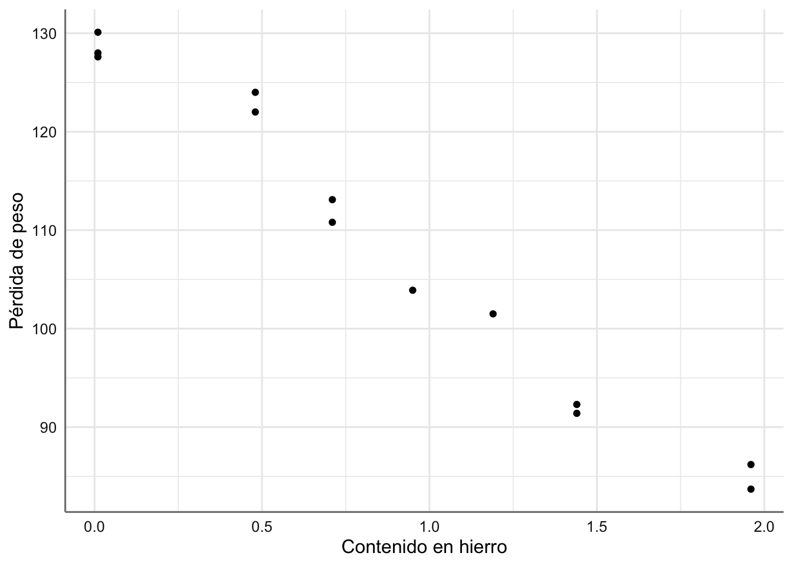
<p class="caption">(\#fig:rls001)Gráfico de dispersión de pérdida de peso vs contenido en hierro.</p>
</div>

En la figura \@ref(fig:rls001) se observa cómo al ir aumentando el contenido en hierro de la aleación disminuye linealmente la pérdida de peso. El modelo estadístico que propongamos deberá ser capaz de explicar dicho comportamiento.

**Ejemplo 2. Datos de Papel** Queremos estudiar la relación existente entre la concentración de madera contenida en la pulpa a partir de la que se elabora papel (madera), y la resistencia (tension, en términos de tensión que soporta) del papel resultante. El objetivo del análisis es describir la tendencia observada. A continuación se presenta el banco de datos y se realiza la primera inspección gráfica.


```r
madera <- c(1, 1.5, 2, 3, 4, 4.5, 5, 5.5, 6, 6.5, 7, 8, 9, 10, 11, 
            12, 13, 14, 15)
tension <- c(6.3, 11.1, 20.0, 24, 26.1, 30, 33.8, 34, 38.1, 39.9, 42,
             46.1, 53.1, 52, 52.5, 48, 42.8, 27.8, 21.9)
papel <- data.frame(madera, tension)
ggplot(papel, aes(x = madera, y = tension)) +
  geom_point() +
  labs(x = "Concentración de madera", y = "Resistencia del papel") 
```

<div class="figure" style="text-align: center">
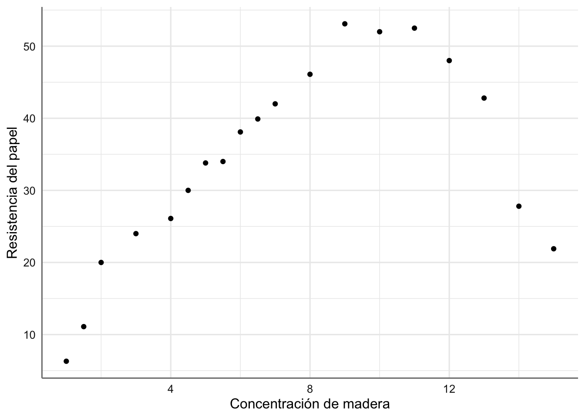
<p class="caption">(\#fig:rls002)Gráfico de dispersión de resistencia del papel vs concentración de madera.</p>
</div>

En la figura \@ref(fig:rls002) podemos ver cómo la resistencia del papel crece al aumentar la concentración de madera hasta llegar a valores de 9 y disminuye a partir de ese valor. En este caso la relación apreciada es de tipo parabólico (descrita por una parábola). Este hecho se debe tener en cuenta en la propuesta de un modelo preliminar.

**Ejemplo 3. Datos de Viscosidad.** Se ha realizado un experimento para tratar de conocer la viscosidad de cierto compuesto en función de la cantidad de un tipo der aceite que se usa en su fabricación. Se asume una relación de tipo lineal entre la viscosidad y la cantidad de aceite utilizada.


```r
aceite <- c(0, 12, 24, 36, 48, 60, 0, 12, 24, 36, 48, 60, 0, 12, 24,
            36, 48, 60, 12, 24, 36, 48, 60)
viscosidad <- c(26, 38, 50, 76, 108, 157, 17, 26, 37, 53, 83, 124, 13,
                20, 27, 37, 57, 87, 15, 22, 27, 41, 63)
aceites<-data.frame(aceite, viscosidad)
ggplot(aceites, aes(x = aceite, y = viscosidad)) +
  geom_point() +
  labs(x = "Cantidad de aceite", y = "Viscosidad") 
```

<div class="figure" style="text-align: center">
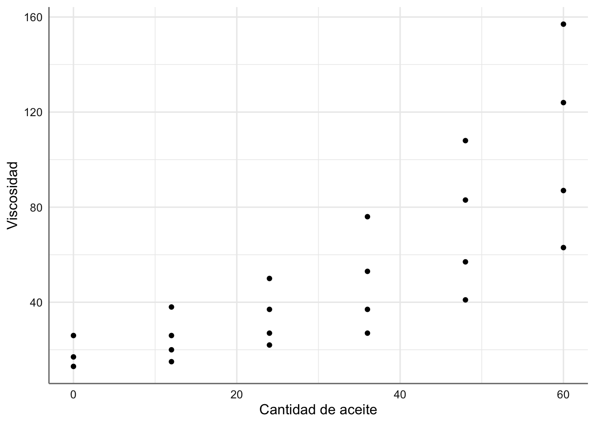
<p class="caption">(\#fig:rls002-1)Gráfico de dispersión de viscosidad vs cantidad de aceite.</p>
</div>

## El modelo RLS {#modelorls}

El modelo de Regresión lineal Simple (RLS) de la variable respuesta ($Y$) sobre la variable predictora ($X$) se formula prediciendo la respuesta media para un valor observado de $X = x$, con una recta de regresión:

```{=tex}
\begin{equation}
  E(y\mid x=x) = \beta_{0} + \beta_{1}x. 
  (\#eq:expectedRLS)
\end{equation}
```
Es de esperar cierta desviación 'aleatoria' entre la respuesta observada y la respuesta media. Dicha desviación es denominada **error aleatorio** y denotada habitualmente por $\epsilon$. Así, el modelo completo de regresión simple se formula según:

```{=tex}
\begin{equation}
  Y = \beta_{0} + \beta_{1}X + \epsilon. 
  (\#eq:RLS)
\end{equation}
```
Los coeficientes de la regresión, esto es, los parámetros que hemos de estimar para ajustar el modelo RLS son:

-   $\beta_{0}$.- la *interceptación* de la recta, esto es, la altura de la recta cuando $x = 0$.

-   $\beta_{1}$.- la *pendiente* de la recta, que refleja cuánto varía la respuesta media $E$(y) cuando pasamos de observar x = $x$ a x = $x$ + 1.

Dada una muestra de valores observados $\{{(x_{i},y_{i})}_{i=1}^{n}\}$, el modelo propuesto implica que todas las observaciones responden a la ecuación \@ref(eq:RLS), de forma que:

```{=tex}
\begin{equation}
  y_{i} = \beta_{0} + \beta_{1}x_{i}+\epsilon_{i}, \ \ \ \ i=1,\ldots,n, 
  (\#eq:RLSobs)
\end{equation}
```
donde $\epsilon_{i}$ son errores aleatorios, que además se consideran incorrelados, con media cero y varianza constante $\sigma^{2}$. Estas características constituyen las **hipótesis básicas del modelo RLS**, que formulamos con más detalle a continuación sobre los errores aleatorios $\epsilon_{i}$:

-   **Incorrelación:** $Corr(\epsilon_{i},\epsilon_{j}) = 0$. Significa que las observaciones de la respuesta **y**, $y_{1},y_{2},\ldots,y_{n}$ están incorreladas entre sí, esto es, los valores de unas no afectan a los de otras.
-   **Media cero:** $E(\epsilon_{i}) = 0$. Lo que implica que la respuesta esperada según el modelo RLS depende linealmente de los coeficientes de regresión $\beta_{0}$ y $\beta_{1}$.
-   **Varianza constante:** $Var(\epsilon_{i} = \sigma^{2})$. Lo que significa que las observaciones $\{y_{i},i=1,\ldots,n\}$ provienen de una misma población cuya variabilidad respecto de su media, $\{\beta_{0} + \beta_{1}x_{i}, i=1,\ldots,n\}$, viene dada por $\sigma^{2}$.

## Estimación del modelo {#estimacionrls}

Estimar la recta de regresión consiste en estimar los coeficientes de la regresión $\beta_{0}$ y $\beta_{1}$ para obtener la recta:

```{=tex}
\begin{equation}
  \hat{Y} = \hat{\beta_{0}} + \hat{\beta_{1}}X, 
  (\#eq:predRLS)
\end{equation}
```
donde $\hat{Y}$ denota el valor de **Y** predicho por la recta para el valor observado de $X = x$.

Disponemos de dos criterios básicos de estimación, que proporcionan la misma solución. Utilizar uno u otro depende de nuestros intereses estadísticos. Si tan sólo queremos determinar la recta, basta con considerar el criterio de *Mínimos Cuadrados*. Si además pretendemos utilizarla con fines inferenciales o predictivos, hablaremos de que nuestra solución es la *máximo-verosímil*, pero a su vez habremos de ser más exigentes con las hipótesis del modelo, como veremos a continuación.

### Estimación Mínimos Cuadrados {#mincuadrls}

El criterio de **mínimos cuadrados** o minimización del error cuadrático medio, consiste en minimizar las distancias entre los puntos observados y los predichos por la recta de ajuste. El error cuadrático medio de la recta se define como:

```{=tex}
\begin{equation}
  S(\beta) = \sum_{i=1}^{n} (y_{i}-\hat{y_{i}}(\beta))^2 = \sum_{i=1}^{n} [y_{i}-(\beta_{0}+\beta_{1}x_{i})]^2
  (\#eq:mincuadRLS)
\end{equation}
```
La solución de mínimos cuadrados $\hat{\beta} = (\hat{\beta_{0}},\hat{\beta_{1}})$ se obtiene minimizando $S(\beta)$. El mínimo se consigue derivando $S(\beta)$ respecto de $\beta_{0}$ y $\beta_{1}$ e igualando a cero:

$$
\frac{\partial S(\beta)}{\partial \beta_{0}} \mid_{\hat{\beta_{0}},\hat{\beta_{1}}} = -2 \sum_{i=1}^{n} (y_{i} - \hat{\beta_{0}}-\hat{\beta_{1}}x_{i}) = 0
$$

$$
\frac{\partial S(\beta)}{\partial \beta_{1}} \mid_{\hat{\beta_{0}},\hat{\beta_{1}}} = -2 \sum_{i=1}^{n} (y_{i} - \hat{\beta_{0}}-\hat{\beta_{1}}x_{i})x_{i} = 0.
$$

De ahí se obtienen las *ecuaciones normales*:

$$
n\hat{\beta_{0}}+\hat{\beta_{1}}\sum_{i=1}^{n} x_{i}= \sum_{i=1}^{n} y_{i}
$$

$$
\hat{\beta_{0}}\sum_{i=1}^{n} x_{i} + \hat{\beta_{1}} \sum_{i=1}^{n} x_{i}^{2} = \sum_{i=1}^{n} y_{i}x_{i}
$$

de donde las estimaciones para $\beta_{0}$ y $\beta_{1}$ resultan:

$$
\hat{\beta_{0}}=\bar{y}-\hat{\beta_{1}}\bar{x}
$$

$$
\hat{\beta_{1}}=\frac{S_{xy}}{S_{xx}},
$$

con:

$$
\bar{y} = \frac{\sum_{i=1}^{n} y_{i}}{n}
$$

$$
\bar{x} = \frac{\sum_{i=1}^{n} x_{i}}{n}
$$

$$
S_{xx} = \sum_{i=1}^{n} (x_{i}-\bar{x})^2
$$

$$
S_{xy} = \sum_{i=1}^{n} (x_{i}-\bar{x})(y_{i}-\bar{y}).
$$

### Estimación Máximo Verosímil {#emvrls}

Habitualmente el objetivo de un análisis de regresión no consiste únicamente en estimar la recta, sino en *inferir* con ella, esto es, asociar un error a las estimaciones obtenidas, contrastar un determinado valor de los parámetros, y/o incluso predecir la respuesta, junto con una banda de confianza, para un $X = x$ dado. En ese caso, precisamos de distribuciones de probabilidad para controlar la incertidumbre y el error. Añadimos pues, una hipótesis más sobre la distribución de la variable respuesta, o lo que es lo mismo, sobre el error aleatorio $\epsilon$. Dicha hipótesis es la de **normalidad de los errores**.

Así, el total de hipótesis básicas del modelo de regresión con fines inferenciales, viene resumido en la siguiente expresión:

```{=tex}
\begin{equation}
  \epsilon_{i} \overset{iid}{\sim} N(0,\sigma^{2}), \qquad i=1,\ldots,n.
  (\#eq:hiprls)
\end{equation}
```
esto es, hablamos de errores aleatorios independientes e idénticamente distribuidos (iid) según una distribución Normal con media cero y varianza $\sigma^{2}$, lo que implica directamente que la distribución para la variable respuesta será:

```{=tex}
\begin{equation}
  y_{i} \overset{iid}{\sim} N(\beta_{0} + \beta_{1}x_{i}, \sigma^{2}), \qquad i=1,\ldots,n.
  (\#eq:modelhiprls)
\end{equation}
```
Desde este momento, los datos proporcionan información sobre los parámetros del modelo, $\beta = (\beta_{0},\beta_{1})$, a través de la verosimilitud conjunta:

```{=tex}
\begin{equation}
  L(\beta;y)=exp\left\{-\frac{\sum_{i=1}^n (y_i-\beta_0-\beta_1 x_i)^2}{2 \sigma^2}\right\}.
  (\#eq:likelihoodrls)
\end{equation}
```
Por tanto, obtener la solución más factible a la vista de los datos observados $\{(x_i,y_i), i=1,\ldots, n\}$ equivale a obtener la solución máximo-verosímil, esto es, la que maximiza la verosimilitud \@ref(eq:likelihoodrls). Maximizar la verosimilitud es equivalente a maximizar la log-verosimilitud $l(\beta,y)$, que tiene una expresión más sencilla sin exponenciales. La solución máximo-verosímil se obtiene derivando e igualando a cero $l(\beta,y)$, lo que da lugar, de nuevo, a las ecuaciones normales. Así pues, la solución máximo-verosímil coincide con la de mínimos cuadrados.

### Estimación con R {#emR}

Para obtener el ajuste máximo verosímil con `R` utilizamos la función `lm()` que permite el ajuste de cualquier modelo lineal. Su expresión más básica viene dada por:

$$model <- lm(y \sim x, data = ´´data´´)$$ donde $y$ es la respuesta y $x$ es la predictora.

Para obtener las estimaciones del modelo podemos hacer uso de diferentes funciones:

-   `tidy(model)` de la librería `tidymodels` que nos proporciona el modelo estimado, los errores en la estimación y la soluciones del contraste sobre cada parámetro del modelo que veremos en el apartado de inferencia sobre los coeficientes del modelo.
-   `glm_coef(model)` de la librería `pubh` que nos proporciona las estimaciones del modelo, los intervalos de confianza al 95% de cada parámetro, y el p-valor asociado a los contrastes sobre cada uno de los parámetros del modelo.
-   `summary(model)` que proporciona un resumen completo del modelo (inferencia sobre los parámetros del modelo y bondad de ajuste).

Por el momento utilizamos las dos primeras para mostrar los resultados del ajuste. Además utilizaremos la función `plot_model` para representar gráficamente el modelo obtenido como alternativa a la función `ggplot()` que hemos utilizado en la figura \@ref(fig:rls005).

### Ejemplos

Para los datos de Corrosión se propone un modelo de regresión lineal simple para estudiar la relación entre la pérdida de peso debida a la corrosión y el contenido de hierro de la forma siguiente:

$$
\text{peso} = \beta_{0} + \beta_{1}*\text{hierro} + \epsilon
$$


```r
# Ajuste del modelo
fit <- lm(peso ~ hierro, data = corrosion)
# Solución con tidy
tidy(fit)
```

```
## # A tibble: 2 × 5
##   term        estimate std.error statistic  p.value
##   <chr>          <dbl>     <dbl>     <dbl>    <dbl>
## 1 (Intercept)    130.       1.40      92.5 2.93e-17
## 2 hierro         -24.0      1.28     -18.8 1.06e- 9
```

```r
# Solución con glm_coef
glm_coef(fit)
```

```
##     Parameter            Coefficient Pr(>|t|)
## 1 (Intercept) 129.79 (126.7, 132.87)  < 0.001
## 2      hierro -24.02 (-26.84, -21.2)  < 0.001
```

de forma que el modelo estimado viene dado por: $$
\widehat{\text{peso}} = 129.79 - 24.02*\text{hierro}
$$

esto es, un aumento de una unidad del contenido de hierro reporta una pérdida de peso de 24.02 unidades. Representamos gráficamente la recta del ajuste obtenida:


```r
# Gráfico del ajuste
plot_model(fit,"pred", terms = ~hierro, 
                ci.lvl = NA, 
                show.data = TRUE, 
                axis.title = c("Contenido en hierro", "Peso"),
                title = " ")
```

<div class="figure" style="text-align: center">
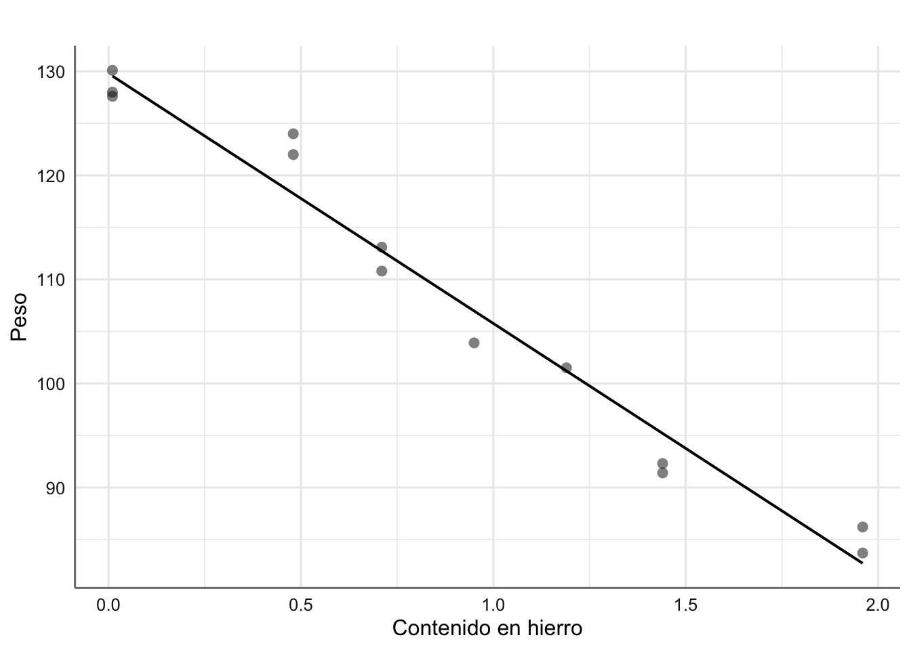
<p class="caption">(\#fig:rls005)Ajuste de mínimos cuadrados para los datos de corrosión.</p>
</div>

### Propiedades de la recta de regresión.

Las propiedades más relevantes y básicas del ajuste de la recta de regresión son las siguientes:

1.  La estimación de la respuesta para un valor de x=$x$ concreto según el modelo de regresión lineal simple se obtiene de la recta de regresión ajustada:

$$
\hat{y}=\hat{\beta_0}+\hat{\beta_1} x.
$$

2.  La suma de los residuos de una recta de regresión con término de interceptación $\beta_0$ es cero,

$$
e_i=y_i-\hat{y} \rightsquigarrow \sum_i e_i=0.
$$

3.  La media de los valores observados $y_i$ coincide con la media de los valores predichos $\hat{y_i}$,

$$
\frac{1}{n}\,\sum_i y_i=\frac{1}{n} \,\sum_i \hat{y}_i.
$$

4.  La recta de regresión pasa por el centroide de medias $(\bar{x},\bar{y})$.

5.  La suma de los residuos ponderados por el valor correspondiente de la variable predictora $x$ es cero,

$$
\sum_i x_i e_i=0.
$$

6.  La suma de los residuos ponderados por el valor ajustado por la recta $\hat{y}$ es cero,

$$
\sum_i \hat{y}_i e_i=0.
$$

### Estimación varianza del modelo. {#rls_varmodel}

La varianza $\sigma^2$ de los errores es una medida de la variabilidad (heterogeneidad) entre los individuos respecto a la media cuando el modelo RLS describe adecuadamente la tendencia entre las variables $y$ y $x$, o lo que es lo mismo, de la dispersión de las observaciones respecto de la recta de regresión. Así pues, da una medida de bondad de ajuste del modelo de regresión a los datos observados. Cuando el modelo de regresión ajustado es bueno para nuestros datos, es posible conseguir una estimación de la varianza $\sigma^2$ a partir de la *suma de cuadrados residual* $SSE$, también llamada *suma de cuadrados debida al error*:

$$
SSE=\sum_i (y_i-\hat{y}_i)^2=S_{yy}-\hat{\beta}_1 S_{xy}.
$$

$SSE$ da una medida de la desviación entre las observaciones $y_i$ y las estimaciones que proporciona la recta de regresión, $\hat{y}_i$. Puesto que en el modelo de regresión lineal simple se estiman $2$ parámetros, los grados de libertad asociados a $SSE$ son $n-2$. Se define pues el *cuadrado medio residual*, $MSE$, como un estimador de $\sigma^2$, que además resulta ser insesgado (esto es, su valor esperado es $\sigma^2$):

$$
s^2=MSE=\frac{SSE}{n-2}.
$$

El *error estándar residual* viene dado por $s=\sqrt{MSE}$.

### Inferencia sobre los coeficientes del modelo

Los estimadores de mínimos cuadrados $\hat{\beta}_0$ y $\hat{\beta}_1$ son insesgados y de mínima varianza de entre todos los estimadores insesgados. El hecho de especificar una distribución normal sobre los errores para la estimación máximo-verosímil, permite derivar de forma directa la distribución de dichos estimadores, que resulta también normal:

$$
\hat{\beta}_0 \sim N\left( \beta_0, \frac{\sum_{i=1}^n x_{i}^2}{nS_{xx}} \sigma^2 \right)
$$

$$
\hat{\beta}_1 \sim N\left( \beta_1, \frac{\sigma^2}{S_{xx}}\right),
$$

Cuando el modelo de regresión es adecuado, podemos estimar las varianzas de dichas distribuciones sustituyendo $\sigma^2$ por $s^2$ . De ahí podemos construir los estadísticos $t$ para inferir sobre los parámetros:

$$
t_0 = \frac{\hat{\beta}_0-\beta_0}{s \ \sqrt{\sum_i x_i^2/n S_{xx}}}
$$

$$
t_1 = \frac{\hat{\beta}_1-\beta_1}{s/\sqrt{S_{xx}}}
$$

Ambos estadísticos se distribuyen según una distribución $t$-Student con $n-2$ grados de libertad, que nos permite inferir (estimar y resolver contrastes de hipótesis) sobre los coeficientes del modelo, y en particular contestar a preguntas sobre la relación entre las variables respuesta y explicativa.

#### Procedimientos de estimación

Las estimaciones puntuales de $\beta_0$ y $\beta_1$ las obtenemos directamente de las ecuaciones normales.

Los **intervalos de confianza** al nivel de confianza $(1-\alpha)100\%$ para $\beta_0$ y $\beta_1$ se construyen a partir de los estadísticos $t$ y resultan:

$$
IC( \beta_0;1-\alpha) = \hat{\beta}_0 \pm t_{\left(n-2,1-\frac{\alpha}{2}\right)} \sqrt{\frac{\sum_{i=1}^n x_i^2}{n S_{xx}} \ s^2}
$$

$$
IC(\beta_1;1-\alpha) = \hat{\beta}_1 \pm t_{\left(n-2,1-\frac{\alpha}{2}\right)} \ \sqrt{\frac{s^2}{S_{xx}}},
$$

donde $t_{\left(n-2,1-\frac{\alpha}{2}\right)}$ es el cuantil $1-\alpha/2$ de una distribución $t$-Student con $n-2$ grados de libertad (los correspondientes a $s^2$).

#### Procedimientos de Contrastes de Hipótesis

Si queremos **contrastar Hipótesis** sobre los coeficientes de la regresión: $$\left\{\begin{array}{ll} 
H_{0}:& \beta_{i} = \beta^{*} \\ 
H_{1}:& \beta_{i} \neq \beta^{*}, i=0,1\\
\end{array}
\right.$$

basta con considerar los estadísticos $t$ anteriores, y sustituir el valor $\beta_i$ por el que se pretende contrastar, $\beta^*$. Estos estadísticos, bajo $H_0$, tienen una distribución $t$-Student con $n-2$ grados de libertad. La resolución del contraste consiste en calcular el p-valor asociado al valor absoluto de la estimación, $|t_0|$ o $|t_1|$, según el caso, esto es, $p-valor=Pr[t_{n-2}>|t_i|]$, donde $t_{n-2}$ representa una variable t-Student con $n-2$ grados de libertad, y $t_i$ es el valor observado para el estadístico correspondiente. Dicho contraste se resuelve de la forma habitual:

-   se rechaza $H_{0}$ a nivel de confianza $1-\alpha$ cuando $p-valor \leq \alpha$,
-   si $p-valor > \alpha$, se dice que los datos no proporcionan suficientes evidencias en contra de la hipótesis nula y ésta no se puede rechazar.

Cuando el contraste propuesto sobre $\beta_0$ o $\beta_1$ tiene $\beta^*=0$, en realidad se está contrastando, respectivamente, si la recta de regresión tiene interceptación o pendiente nula. Contrastar $\beta_1=0$ es equivalente a contrastar correlación nula entre las variables $X$ e $Y$, esto es, ausencia de relación lineal. Si conseguimos rechazar esta hipótesis con significatividad, concluiremos que la variable $X$ está relacionada linealmente con $Y$ y por lo tanto se puede utilizar para predecir $Y$ a través de la recta de regresión ajustada.

### Ejemplo

Realizamos el proceso de inferencia para el modelo para los datos de corrosión e interpretamos los resultados obtenidos. Concretamente:

-   Construir intervalos de confianza al 95% para $\beta_0$ y $\beta_1$. ¿Qué podemos decir de la relación entre dichas variables?
-   Concluir sobre los contrastes $\beta_0=0$ y $\beta_1=0$. Comprobar también que el último contraste $\beta_1=0$ es equivalente al contraste de correlación nula entre las variables del modelo.

Recapturamos el resumen del modelo obtenido con la función `glm_coef()`-


```r
# Ajuste del modelo
fit <- lm(peso ~ hierro, data = corrosion)
glm_coef(fit)
```

```
##     Parameter            Coefficient Pr(>|t|)
## 1 (Intercept) 129.79 (126.7, 132.87)  < 0.001
## 2      hierro -24.02 (-26.84, -21.2)  < 0.001
```

Como se puede observar en los resultados ninguno de los intervalos de confianza incluye al cero, lo que habla positivamente de su significatividad estadística, esto es, tenemos evidencias para predecir la pérdida de peso con el contenido de hierro inicial a través de una recta con interceptación y pendientes (significativamente) distintas de cero. De esta forma podemos ver que el efecto asociado con un incremento en una unidad de hierro produce una pérdida de peso de entre 22.01 y 26.03 unidades.

Puestos a resolver el contraste $H_0^i:\beta_i=0$, para $i=0,1$, observamos los p-valores obtenidos en el proceso de estimación que resultan ambos significativos (\<0.001 para $\beta_0$ y \<0.001 para $\beta_1$), lo que concluye contundentemente sobre la significatividad de ambos a favor de que son distintos de cero (se rechazan $H_0^0$ y $H_0^1$), como ya habíamos comentado a partir de los intervalos de confianza. En particular, el contenido en hierro explica significativamente la pérdida de peso a través del modelo lineal ajustado.

## Bondad del Ajuste

Cuando hemos realizado el ajuste de un modelo de regresión lineal, hemos de verificar que efectivamente dicho modelo proporciona un buen ajuste a la hora de explicar (predecir) la variable respuesta. Básicamente la bondad del ajuste la cuantificamos con el tanto por ciento de variabilidad de la respuesta, que consigue ser explicada por el modelo ajustado. Para ello contamos con varios tipos de medidas que cuantifican esta variabilidad de diversos modos. Como medidas fundamentales de bondad de ajuste contamos con:

-   el error residual estimado $s = \hat{\sigma}$;
-   el test $F$ de bondad de ajuste que se obtiene de la Tabla de Anova;
-   el coeficiente de determinación $R^2$.

Todas estas medidas las desglosamos a continuación. Para obtenerlas con `R` utilizaremos las funciones `glance()`, `anova()` y `summary()`.

### Error residual {#rls_errorresidual}

Es una medida de bondad del ajuste relativa a la escala de medida utilizada. En general, se prefieren modelos con menor error residual estimado $s$, donde $s^2$ denota la estimación de la varianza $\sigma^2$ del modelo, dada en el apartado \@ref(rls_varmodel).

### Tabla Anova {#rls_tablaanova}

Una medida de lo bueno que resulta un modelo para ajustar unos datos pasa por cuantificar cuánta de la variabilidad contenida en éstos ha conseguido ser explicada por dicho modelo. Un modelo es bueno si la variabilidad explicada es mucha, o lo que es lo mismo, si las diferencias entre los datos y las predicciones según el modelo son pequeñas.

Construir la tabla de ANOVA o Análisis de la Varianza consiste en:

-   descomponer la variabilidad de los datos en la parte que es explicada por el modelo y la parte que se deja sin explicar, es decir, la variabilidad de los residuos,
-   compararlas y valorar estadísticamente si la variabilidad explicada por el modelo ajustado es suficientemente grande.

Si partimos de la identidad:

```{=tex}
\begin{equation}
y_i - \bar{y} = (y_i - \hat{y}_i) + (\hat{y}_i - \bar{y})  
(\#eq:descomprespu)
\end{equation}
```
y el hecho de que $\sum_{i} (y_i - \hat{y}_i)(\hat{y}_i - \bar{y}) = 0$, podemos escribir:

```{=tex}
\begin{equation}
\underbrace{\sum_{i=1}^n (y_i-\bar{y})^2}_{SST} = 
\underbrace{\sum_{i=1}^n (y_i-\hat{y}_i)^2}_{SSE} +
\underbrace{\sum_{i=1}^n(\hat{y}_i-\bar{y})^2}_{SSR}
(\#eq:descompvar)
\end{equation}
```
Las abreviaturas $SST$, $SSE$ y $SSR$ provienen del inglés para suma de cuadrados (*Sum of Squares*): Total, debida al Error (o residual) y debida a la Regresión, respectivamente. A partir de ellas es posible calcular la variabilidad total, la variabilidad explicada por el modelo obtenido, y la variabilidad que queda por explicar o variabilidad residual, sin más que dividir las sumas de cuadrados por sus respectivos grados de libertad. Obtenemos así los cuadrados medios asociados, $MST=SST/(n-1)$, $MSE=SSE/(n-2)$ y $MSR=SSR/1$.

Contrastar la bondad del ajuste de la recta de regresión significa resolver el contraste:

$$\begin{array}{cc}
H_0:& \mbox{ el modelo lineal NO explica bien la respuesta} \\
H_1:& \mbox{ el modelo lineal explica bien la respuesta},
(\#eq:contrastemodel)
\end{array}$$

que, en el modelo RLS, resulta equivalente a contrastar $H_0:\beta_1=0, \ vs. \ H_1:\beta_1 \neq 0$, esto es, si la variable predictora $X$ explica suficientemente bien la variable respuesta $Y$ a través del modelo lineal propuesto. El estadístico de bondad de ajuste de la regresión está basado en comparar la variabilidad explicada por el modelo con la que queda sin explicar, esto es, en el cociente de las sumas de cuadrados medias $MSR$ y $MSE$, que resulta tener una distribución $F$ con $1$ y $n-2$ grados de libertad cuando el modelo es correcto:

```{=tex}
\begin{equation}
F=\frac{SSR/\sigma^2}{\frac{SSE/\sigma^2}{n-2}}=\frac{MSR}{MSE} \sim F_{1,n-2}.
(\#eq:estatFRLS)
\end{equation}
```
En el modelo RLS, el estadístico $F$ es igual al estadístico $t$ asociado a $\beta_1$, elevado al cuadrado. Ya hemos dicho antes que el contraste de bondad de ajuste es equivalente al de $\beta_1=0$.

Concluiremos que la recta de regresión es significativa para predecir la respuesta $Y$ al nivel de confianza $(1-\alpha)100\%$, cuando el valor que obtenemos para el estadístico $F$ supera el valor crítico que se corresponde con el cuantil $1-\alpha$ de una distribución $F$ con $1$ y $n-2$ grados de libertad. Esto es equivalente a que el p-valor asociado al contraste resulte inferior a $\alpha$. En otro caso, diremos que no hemos obtenido evidencias suficientes para rechazar que el modelo lineal no es útil para predecir la variable $Y$ a través de $X$.

Todas estas sumas de cuadrados y estadísticos se suelen presentar en una tabla de análisis de la variabilidad o tabla ANOVA, cuya apariencia es:

| Fuente    | gl    | SS       | MS                    | estadístico $F$     | p-valor           |
|-----------|-------|----------|-----------------------|---------------------|-------------------|
| Regresión | 1     | $SSR$    | $MSR=\frac{SSR}{1}$   | $F=\frac{MSR}{MSE}$ | $Pr(F_{1,n-2}>F)$ |
| Error     | $n-2$ | $SSE$    | $MSE=\frac{SSE}{n-2}$ |                     |                   |
| Total     | $n-2$ | $S_{yy}$ |                       |                     |                   |

En `R` la $SSR$ se descompone a su vez para cada uno de los efectos o variables predictoras en el modelo.

### Coeficiente de determinación

Otro estadístico útil para chequear la bondad del ajuste de la recta de regresión es el *coeficiente de determinación* $R^2$. Éste se define como la proporción de la varianza que es explicada por la recta de regresión y se obtiene a partir de la descomposición \@ref(eq:descompvar) como:

```{=tex}
\begin{equation}
R^2=\frac{SSR}{SST}.
(\#eq:Rsquad)
\end{equation}
```
De hecho, en el modelo RLS, $R^2$ es el cuadrado del coeficiente de regresión lineal entre la respuesta $Y$ y el predictor $X$.

Puesto que $0\leq R^2 \leq 1$ (al tratarse del coeficiente de correlación al cuadrado), un valor cercano a $1$ (entre 0.6 y 1) implicará que buena parte de la varianza es explicada por la recta de regresión, y $R^2\approx 0$ significará que prácticamente toda la variabilidad de los datos queda sin explicar por la recta. Sin embargo, $R^2$ no sirve para medir la idoneidad del modelo de regresión para describir los datos. De hecho, $R^2$ puede resultar grande a pesar de que la relación entre $X$ e $Y$ no sea lineal (de hecho tiene la misma interpretación que un coeficiente de correlación, válido para cuantificar la relación lineal sólo cuando ésta existe). Siempre ha de ser utilizado con cautela. Así por ejemplo, la magnitud de $R^2$ depende del rango de variabilidad de la variable explicativa. Cuando el modelo de regresión es adecuado, la magnitud de $R^2$ aumenta (o disminuye) cuando lo hace la dispersión de $X$. Por otro lado, podemos obtener un valor muy pequeño de $R^2$ debido a que el rango de variación de $X$ es demasiado pequeño, y entonces impedirá que se detecte su relación con $Y$.

### Ejemplo

Analizamos la bondad del ajuste obtenido para los datos de corrosión.


```r
# Medidas de bondad del ajuste
glance(fit)
```

```
## # A tibble: 1 × 12
##   r.squared adj.r.squared sigma statistic      p.value    df logLik   AIC   BIC deviance df.residual
##       <dbl>         <dbl> <dbl>     <dbl>        <dbl> <dbl>  <dbl> <dbl> <dbl>    <dbl>       <int>
## 1     0.970         0.967  3.06      352.      1.06e-9     1  -31.9  69.8  71.5     103.          11
## # … with 1 more variable: nobs <int>
```

Esta función proporciona diferentes medidas de bondad de ajuste, algunas de ellas las utilizaremos en las unidades siguientes, pero en este caso nos centramos en las que hace referencia al modelo de RLS:

-   `r.squared`: $R^2$ del modelo ajustado,
-   `sigma`: error residual,
-   `statistic`: valor del estadístico de contraste \@ref(eq:estatFRLS) asociado a la tabla ANOVA,
-   `p.value`: p-valor del contraste \@ref(eq:estatFRLS),
-   `df`: grados de libertad asociados con $MSR$,
-   `df.residual`: grados de libertad asociados con $MSE$.

Para este modelo el error residual tiene una magnitud de 3.05778, pero dado que no podemos comparar con otro modelo resulta difícil interpretar este valor como una medida de bondad de ajuste al no tener una escala de medida que nos indique si este valor es lo suficientemente pequeño.

El valor del estadístico F (352.27) y su p-valor (1.055e-09) nos permiten concluir que podemos rechazar la hipótesis $H_0:\beta_1=0$, o lo que es lo mismo, $H_0$: el modelo no explica los datos, a favor de que el contenido en hierro resulta útil para predecir el la pérdida de peso debido a la corrosión a través de un modelo de regresión lineal. Veamos la descomposición de la tabla ANOVA.


```r
anova(fit)
```

```
## Analysis of Variance Table
## 
## Response: peso
##           Df Sum Sq Mean Sq F value    Pr(>F)    
## hierro     1 3293.8  3293.8  352.27 1.055e-09 ***
## Residuals 11  102.9     9.4                      
## ---
## Signif. codes:  0 '***' 0.001 '**' 0.01 '*' 0.05 '.' 0.1 ' ' 1
```

Simplemente observando la Tabla de Anova, vemos que la variabilidad explicada por la recta (en términos de sumas de cuadrados), $SSR = 3293.8$, es superior a la que queda por explicar, $SSE = 102.9$ (casi tres veces superior). En este caso, al tener una única variable en el modelo la $SSR$ coincide con la correspondiente a la variable `hierro` tal y como aparece en la tabla anterior.

A la vista de estos resultados podemos concluir que efectivamente el modelo obtenido resulta útil para explicar la mayor parte de la variabilidad existente en la respuesta a partir de la variabilidad explicada por dicho modelo.

Por último, el valor del coeficiente de determinación es $R^2= 0.9697198$, lo que implica que alrededor del $97\%$ de la variabilidad de la pérdida de peso es explicada por la recta ajustada. Es un valor especialmente alto que refleja el gran poder predictivo del contenido de hierro para tratar de conocer la pérdida de peso final del compuesto.

Una versión resumida de las características del modelo ajustado se puede obtener con la función `summary()`. Con ella podemos obtener la ecuación del modelo, contrastes individuales sobre cada coeficiente, la varianza residual y el test F asociado.

Los criterios utilizados nos permiten concluir que el modelo obtenido es adecuado desde el punto de vista de su capacidad explicativa, es decir, a la hora de medir la asociación entre la respuesta y la predictora. Sin embargo, es importante tener presente los pasos que hemos de dar a la hora de aceptar finalmente un modelo como bueno. No sólo es preciso superar la bondad del ajuste. Una vez superada esta prueba, hay que llevar a cabo el diagnóstico y validación del modelo, o verificación de las hipótesis del modelo RLS y de la capacidad predictiva del mismo. De entre todos los modelos propuestos para predecir una respuesta $Y$ que hayan superado la bondad del ajuste, el diagnóstico y la validación, podremos optar por el mejor según algún criterio preferido de comparación y selección de modelos. En los modelos de RLS esta tarea es sencilla ya que el modelo ajustado es único, pero se complicará cuando se añadan más variables predictoras como veremos en las unidades siguientes.

## Diagnóstico del Modelo {#rls_diag}

Una vez ajustado un modelo y habiendo superado las pruebas de bondad de ajuste pertinentes (fundamentalmente el test $F$ de Anova), hemos de proceder con el diagnóstico del modelo, que consiste en verificar si éste satisface las hipótesis básicas del modelo de regresión, que son:

-   linealidad entre las variables $X$ e $Y$

$$\begin{array}{ll}
H_{0}: & Linealidad\\
H_{1}: & No\ linealidad
(\#eq:hipolinealidad)
\end{array}$$

-   para los errores del modelo, $\epsilon_{i}$:

    1.  media cero

    2.  varianza constante u homocedasticidad

$$\begin{array}{ll}
H_{0}: & Varianza\ constante\\
H_{1}: & Varianza\ no\ constante
(\#eq:hipohomocedasticidad)
\end{array}$$

-   Si rechazamos la hipótesis nula estaremos concluyendo que nuestro modelo incumple la hipótesis de varianza constante.

    3.  incorrelación

$$\begin{array}{ll}
H_{0}: & Residuos\ no\ correlados \\
H_{1}: & Residuos\ correlados
(\#eq:hipoincorrelacion)
\end{array}$$

4.  normalidad

$$\begin{array}{ll}
H_{0}: & Residuos\ normales\\
H_{1}: & Residuos\ no\ normales
(\#eq:hiponormalidad)
\end{array}$$

El análisis de los residuos del modelo nos permitirá detectar deficiencias en la verificación de estas hipótesis, así como descubrir observaciones anómalas o especialmente influyentes en el ajuste. Una vez encontradas las deficiencias, si existen, cabrá considerar el replanteamiento del modelo, bien empleando transformaciones de las variables, bien proponiendo modelos alternativos al de RLS, que trataremos con detalle en las unidades siguientes.

El diagnóstico del modelo se lleva a cabo fundamentalmente a partir de la inspección de los residuos del modelo. Éstos sólo son buenos estimadores de los errores cuando el modelo ajustado es bueno. Aun así, es lo más aproximado con lo que contamos para indagar qué ocurre con los errores y si éstos satisfacen las hipótesis del modelo. El análisis de los residuos habitual es básicamente gráfico, si bien existen varios tests estadísticos útiles para detectar inadecuaciones del modelo, que presentaremos brevemente.

Definimos los **residuos** de un modelo lineal como las desviaciones entre las observaciones y los valores ajustados:

$$
r_i = y_i - \hat{y}_i, \qquad i=1,\ldots,n.
$$

En ocasiones, es preferible trabajar con los **residuos estandarizados**, que tienen media cero y varianza aproximadamente unidad, y facilitan la visualización de las hipótesis:

$$
d_i = \frac{r_i}{\sqrt{MSE}}, \qquad i=1,\ldots,n.
$$

Los residuos asociados a un modelo ajustado se pueden obtener con la función `fortify()`. Esta función proporciona además las medidas de influencia para detectar observaciones anómalas, es decir, observaciones con residuos excesivamente grandes.

### Linealidad y homocedasticidad.

Los gráficos de residuos estandarizados frente a valores ajustados nos permiten detectar varios tipos de deficiencias del modelo ajustado. Si los residuos están distribuidos alrededor del cero y el gráfico no presenta ninguna tendencia entonces el modelo se considera adecuado. Cuando aparece alguna tendencia como una forma de embudo o un abombamiento, etc., podemos tener algún problema con la hipótesis de varianza constante para los errores (heterocedasticidad). Cuando se aprecia alguna tendencia hablamos de violación de la hipótesis de linealidad: el modelo lineal ha sido incapaz de capturar una tendencia no lineal apreciada en los residuos, posiblemente debido a que existen otras variables explicativas adicionales no consideradas en el modelo, o a que la variable predictora explica la respuesta de un modo más complejo (quizás polinómico, etc.) al considerado en el modelo lineal.

Para verificar la hipótesis de homocedasticidad podemos usar el test de Breusch-Pagan para variables predictoras de tipo numérico, y el de Bartlett para variables predictoras de tipo categórico (ver unidades siguientes). Para realizar el test de Breusch-Pagan utilizamos la función `bptest()` de la librería `lmtest`, mientras que para realizar el test de Bartlett utilizamos la función `bartlett.test()`.

### Ejemplo

Analizamos la hipótesis de homocedasticidad para el modelo obtenido para los datos de corrosión. En primer lugar obtenemos los residuos del modelo.


```r
# Residuos y medidas de diagnóstico
diagnostico <- fortify(fit)
# Gráfico de residuos estandarizados vs ajustados
ggplot(diagnostico, aes(x = .fitted, y = .stdresid)) + 
  geom_point() + 
  stat_smooth(method = "lm", se = FALSE) +
  theme_bw()
```

<div class="figure" style="text-align: center">
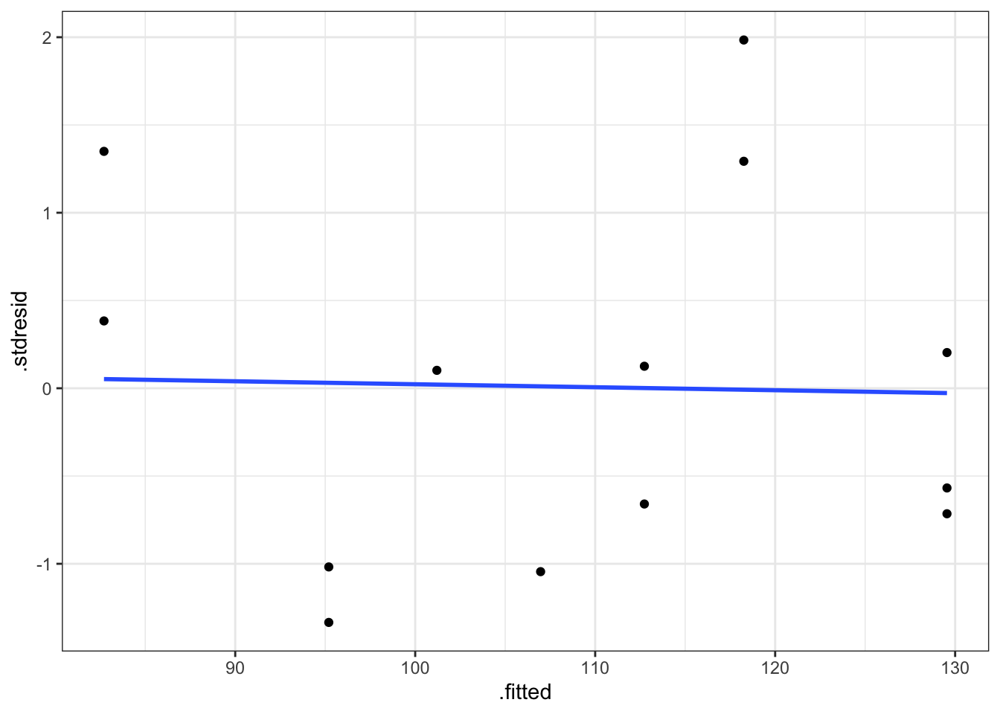
<p class="caption">(\#fig:rls009)Gráfico de residuos estandarizados vs valores ajustados.</p>
</div>

Se puede concluir que se verifica la hipótesis de linealidad (recta horizontal), ya que no existen tendencias en los residuos. Además con los residuos se comportan de forma aleatoria sin agrupaciones ni tendencias podemos concluir que se cumple la hipótesis de homogeneidad de varianzas. Hay que tener mucho cuidad con la interpretación de estos gráficos, ya que cuando el tamaño de muestra es pequeño, resulta difícil apreciar tenencias o agrupaciones en los residuos. Por este motivo realizamos el test de diagnóstico.


```r
# Test de diagnóstico
bptest(fit)
```

```
## 
## 	studentized Breusch-Pagan test
## 
## data:  fit
## BP = 0.024539, df = 1, p-value = 0.8755
```

Dado que el p-valor del contraste es superior a 0.05 no podemos rechazar la hipótesis nula dada en \@ref(eq:hipohomocedasticidad), y por tanto podemos concluir que se verifica la hipótesis de homogeneidad o varianza constante.

### Normalidad

Para verificar la normalidad de los errores, disponemos de gráficos qq-plot de normalidad, en los que se representan los residuos ordenados $r_{[i]}$ (cuantiles empíricos) versus los cuantiles correspondientes a una normal estándar, $\Phi^{-1}[(i-1)/n]$. Si es cierta la normalidad de los residuos, los puntos han de estar alineados con la diagonal. Desviaciones de la diagonal más o menos severas en las colas, e incluso en el centro de la distribución, dan indicios de desviaciones de normalidad. La hipótesis de normalidad se puede chequear también con histogramas de los residuos cuando el tamaño muestral es grande.

Los residuos estandarizados también son útiles para detectar desviaciones de la normalidad. Si los errores se distribuyen según una normal, entonces aproximadamente el $68\%$ de los residuos estandarizados quedarán entre $-1$ y $+1$, y el $95\%$ entre $-2$ y $+2$.

Para diagnosticar la hipótesis de normalidad se utiliza el test de Shapiro-Wilks, donde rechazar la hipótesis nula implica el rechazo de la hipótesis de normalidad. Para realizar dicho contraste utilizamos la función `shapiro.test()`.


```r
# grafico qq
ggplot(diagnostico, aes(sample = .stdresid)) + 
  stat_qq() + 
  geom_abline() +
  theme_bw()
```

<div class="figure" style="text-align: center">

<p class="caption">(\#fig:rls011, )Gráfico de normalidad de los residuos estandarizados.</p>
</div>

El gráfico de normalidad muestra un comportamiento correcto ya que los punto se distribuyen a lo largo de la recta de normalidad. No se realiza el histograma ya que el tamaño muestral es demasiado pequeño. Pasamos al test de diagnóstico.


```r
# Test de diagnóstico
shapiro.test(diagnostico$.stdresid)
```

```
## 
## 	Shapiro-Wilk normality test
## 
## data:  diagnostico$.stdresid
## W = 0.92905, p-value = 0.3312
```

Dado que el p-valor del contraste es superior a 0.05 no podemos rechazar la hipótesis nula dada en \@ref(eq:hiponormalidad), y por tanto podemos considerar que los residuos se distribuyen normalmente.

### Independencia.

La correlación entre los datos es un proceso intrínseco al muestreo; saber cómo se ha llevado a cabo éste da información, generalmente suficiente, para poder hablar de correlación o incorrelación. En todo caso, los gráficos secuenciales de residuos sirven para detectar problemas de correlación de éstos (*autocorrelación*), o de inestabilidad de la varianza a lo largo del tiempo. También son útiles para esto los gráficos en que se representa un residuo versus el anterior en la secuencia en que han sido observados; si hay correlación se apreciará tendencia. Detectar autocorrelación llevará a considerar otro tipo de modelos distintos (autocorrelados: modelos de series temporales).

Aparte de los métodos gráficos, para resolver dicho contraste se utiliza el test de Durbin-Watson, cuya función es `dwtest()`. Rechazar la hipótesis nula implica el rechazo de la hipótesis de incorrelación.


```r
# grafico función autocorrelación
acf(diagnostico$.stdresid)
```

<div class="figure" style="text-align: center">

<p class="caption">(\#fig:rls013, )Gráfico de autocorrelación de los residuos estandarizados.</p>
</div>

El gráfico de la función de autocorrelación muestra la independencia de las observaciones. Todos los lags quedan dentro del rango de independencia.


```r
# Test de diagnóstico
dwtest(fit, alternative = "two.sided")
```

```
## 
## 	Durbin-Watson test
## 
## data:  fit
## DW = 2.5348, p-value = 0.2952
## alternative hypothesis: true autocorrelation is not 0
```

Dado que el p-valor del contraste es superior a 0.05 no podemos rechazar la hipótesis nula dada en \@ref(eq:hipoincorrelacion), y por tanto podemos considerar que los residuos se distribuyen de froma independiente.

### Otros gráficos de diagnóstico

Los gráficos de residuos versus valores de la variable predictora son útiles para apreciar tendencias en los residuos que han quedado sin explicar por el modelo ajustado. Básicamente se interpretan como los gráficos de residuos versus valores ajustados $\hat{y}_i$. Es deseable que los residuos aparezcan representados en una banda horizontal sin tendencias alrededor del cero. Por ejemplo, si hay tendencias de tipo cuadrático, posiblemente hayamos de incorporar la variable $x^2$ en el modelo, o bien abordar algún tipo de transformación que permita una relación de tipo lineal entre predictor y respuesta.

### Incumplimiento de hipótesis

Una vez identificado el incumplimiento de alguna de las hipótesis del modelo, hay que tratar de identificar porque se produce dicho incumplimiento. Se estudia si el incumplimiento es debido a:

-   Subconjunto de los datos que influye desproporcionadamente en el ajuste del modelo propuesto, con lo cual las estimaciones y predicciones dependen mucho de él. En primer lugar, el objetivo es identificar dichas observaciones. Una vez detectadas la forma de proceder es la siguiente:

    -   Comprobar si la influencia se debe a un error en la toma de observaciones, si es así se corrigen los defectos encontrados y se comienza de nuevo.
    -   Si los datos son correctos y el subconjunto de influyentes es pequeño se opta casi siempre por su eliminación del banco de datos. En otras ocasiones se puede optar por estudiar de forma separada a dichas observaciones.

-   Comportamiento sistemático del modelo. Este caso es más complicado y requiere de procedimientos más sofisticados para corregir los defectos que aparezcan en el modelo.

De la primera parte se encarga de analizarla los diagnósticos de influencia, mientras que en el segundo caso se trata principalmente de realizar transformaciones de las variables involucradas en el modelo.

### Análisis de influencia

El análisis de influencia pretende detectar aquellas observaciones cuya inclusión/exclusión en el ajuste altera sustancialmente los resultados. Es interesante siempre, localizar este tipo de datos, si existen, y evaluar su impacto en el modelo. Si estos datos influyentes son "malos" (provienen de errores en la medición, o de condiciones de experimentación diferentes, etc.) habrían de ser excluidos del ajuste; si son "buenos", contendrán información sobre ciertas características relevantes a considerar en el ajuste.

A primera vista, observaciones que dan lugar a un residuo grande, pueden influir notablemente en el ajuste. Las denominaremos *OBSERVACIONES ALEJADAS*. Su existencia puede indicar también la inadecuación del modelo asumido a la realidad experimental. Si dicha observación tiene un residuo exageradamente grande la denominamos ANÓMALA (outlier en inglés). Por otra parte, observaciones que adoptan valores extremos de alguna o varias variables explicativas pueden tener más influencia que las usuales. Las denominaremos *OBSERVACIONES ATÍPICAS*.

Sin embargo, las dos características no siempre suponen que las observaciones que las manifiestan sean también influyentes. Generalmente se dice que una observación es alejada si el valor absoluto del residuo es mayor que 2. Se considera anómala si el valor absoluto del residuo es mayor que 3.

Un criterio para valora la influencia de una observación sobre los coeficientes del modelo es el cálculo de la distancia de CooK. Se consideran como observaciones influyentes todas aquellas cuyo valor de la distancia sea mayor que 1. Dicha distancia se obtiene directamente con la función `fortify(modelo)` en al columna denominada `.cooksd`. Existen otro tipo de medidas de influencia (se pueden obtener con la función `influence.measures(ajuste)`) pero las estudiaremos en las unidades siguientes.

Si el incumplimiento de las hipótesis no es debido a la presencia de observaciones influyentes, sino más bien a un comportamiento sistemático del modelo, los remedios para corregir estas deficiencias pasan principalmente por:

-   Propuesta de otros modelos adecuados a la distribución de la respuesta y su relación con los predictores. Este punto o trataremos ampliamente más adelante
-   Transformar la variable respuesta (si es de tipo continuo), o las variables predictoras (si son de tipo continuo).

### Transformaciones

El tipo de transformaciones que podemos realizar se pueden dividir en tres apartados:

-   Transformaciones debidas al modelo teórico. Existen situaciones experimentales donde ya partimos de un tipo de modelo de carácter no lineal pero que se podría convertir en lineal con una sencilla transformación de la respuesta o la predictora, o de ambas. Ejemplos de estos modelos teóricos que se pueden convertir en modelos de RLS son:

| Modelo Teórico                      | Transformación y modelo a plantear |
|-------------------------------------|------------------------------------|
| $Y = \beta_0 X^{\beta_1}$           | $log(Y) \sim log(X)$               |
| $Y = \beta_0 exp^{\beta_1 X}$       | $log(Y) \sim X$                    |
| $Y = \beta_0 + \beta_1 log(X)$      | $Y \sim log(X)$                    |
| $Y = \frac{X}{\beta_0 + \beta_1 X}$ | $1/Y \sim 1/X$                     |
| $Y = \frac{1}{\beta_0 + \beta_1 X}$ | $1/Y \sim X$                       |
| $Y = \beta_0 + \beta_1 \frac{1}{X}$ | $Y \sim 1/X$                       |

-   Transformaciones sobre la predictora. Se utilizan principalmente ante la falta de linealidad, y se basan principalmente en la construcción de modelos de predicción polinómicos. Estos modelos los estudiaremos con más detalle en la unidad siguiente.

-   Transformaciones sobre la respuesta. Esta suele ser la opción más habitual. Obtener una transformación adecuada de la respuesta sin alterar las variables predictoras. Se suelen utilizar ante el incumplimiento de las hipótesis de normalidad o varianza constante. Como buscar una transformación adecuada es un tema que puede resulta costoso, se utilizar un procedimiento automático que nos da una transformación rápida. Dicho procedimiento se conoce con el nombre de transformaciones de Box-Cox, y sde puede obtener en `R` con la función `boxcox()`. Dicho procedimiento consiste en obtener un intervalo de confianza para un parámetro ($\lambda$) que refleja la transformación de la respuesta a utilizar. Las transformaciones más habituales son:

| $\lambda$ | Transformación |
|-----------|----------------|
| -2        | $1/Y^2$        |
| -1        | $1/Y$          |
| -1/2      | $1/\sqrt{Y}$   |
| 0         | $log(Y)$       |
| 1/2       | $\sqrt{Y}$     |
| 1         | $Y$            |
| 2         | $Y^2$          |

Una vez realizado el estudio de influencia la forma de proceder consiste en eliminar las observaciones influyentes y obtener un nuevo modelo sin ellas, o bien realizar alguna de las transformaciones planteadas y ajustar el nuevo modelo. Una vez construido deberemos ajustar el nuevo modelo y realizar un nuevo diagnóstico para verificar que se cumple las hipótesis. Se trata pues de un proceso circular donde a cada modificación debemos obtener un nuevo modelo y analizarlo completamente hasta llegar a un modelo que cumpla con todas las especificaciones. Sin embargo, en ocasiones puede ocurrir que no seamos capaces de encontrar un modelo que cumpla las hipótesis y deberemos buscar entre modelos más complejos de los planteados aquí.

### Ejemplos

Procedemos con el análisis de los bancos de datos de Papel y Viscosidad presentados al inicio de esta unidad para estudiar los posibles problemas de diagnóstico que hemos venido trabajando.

#### Papel

Planteamos y ajustamos el modelo correspondiente a los datos de Papel.


```r
# Ajuste del modelo
fit.papel <- lm(tension ~ madera, data = papel)
# Solución con glm_coef
glm_coef(fit.papel)
```

```
##     Parameter         Coefficient Pr(>|t|)
## 1 (Intercept) 21.32 (9.86, 32.78)    0.001
## 2      madera    1.77 (0.4, 3.14)    0.014
```

```r
# Gráfico del ajuste
plot_model(fit.papel, "pred", terms = ~madera, 
                ci.lvl = NA, 
                show.data = TRUE, 
                axis.title = c("Concentración de madera", "Tensión del papel"),
                title = " ")
```

<div class="figure" style="text-align: center">
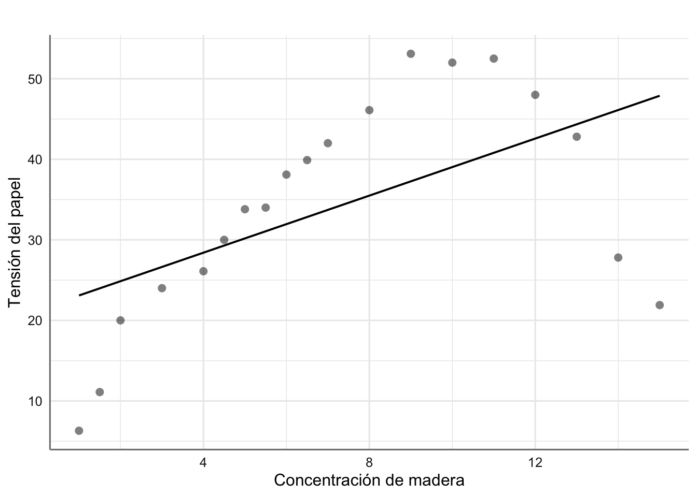
<p class="caption">(\#fig:rls015)Ajuste para los datos de resitencia del papel</p>
</div>

Parece obvio que el modelo planteado no es adecuado, ya que no captura de forma adecuada la tendencia de los datos observados. De hecho, el coeficiente asociado con madera resulta no significativo, lo que daría a entender que la concentración de madera no es relevante para explicar la tensión del papel. Esta afirmación es claramente falsa ya que se aprecia claramente una tendencia de tipo cuadrático. Realizamos los gráficos de diagnóstico para corroborar este hecho.


```r
# Obtenemos los residuos del modelo
diganostico.papel <- fortify(fit.papel)
# Gráfico de residuos vs ajustados
ggplot(diganostico.papel, aes(x = .fitted, y = .stdresid)) + 
  geom_point() + 
  theme_bw()
```

<div class="figure" style="text-align: center">
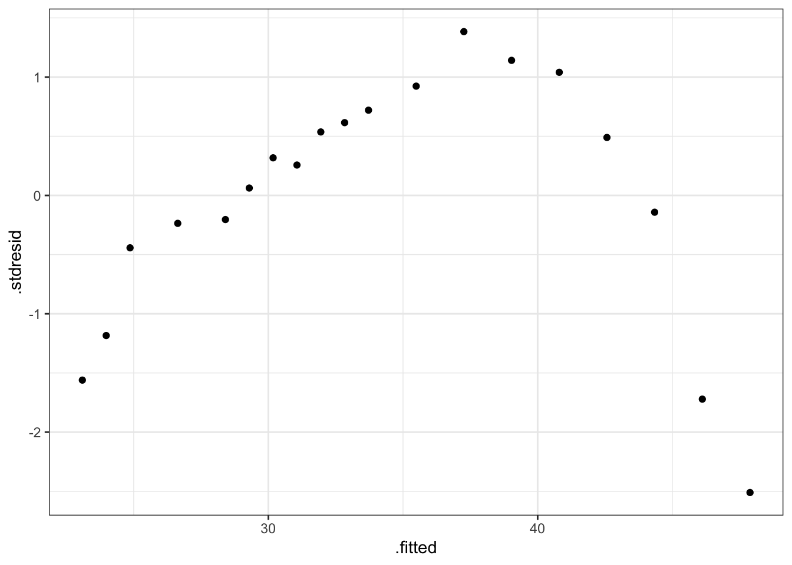
<p class="caption">(\#fig:rls016)Gráfico de residuos vs ajustados para el modelo de papel</p>
</div>

Se observa claramente una tendencia de tipo cuadrática en los residuos lo que indica que un modelo más adecuado para estos datos sería: $$tension \sim madera + madera^2$$ Realizamos el análisis de influencia para completar el diagnóstico, a pesar de que la introducción de la nueva pedictora proporcionará un modelo más adecuado.


```r
# Valoramos si hay alguna observación con distancia mayor que 1
abs(diganostico.papel$.cooksd) > 1
```

```
##  [1] FALSE FALSE FALSE FALSE FALSE FALSE FALSE FALSE FALSE FALSE FALSE FALSE FALSE FALSE FALSE FALSE
## [17] FALSE FALSE FALSE
```

No se observa ninguna observación influyente por lo que el problema de ajuste se debe a la falta de tendencia del modelo propuesto.

#### Viscosidad

Planteamos y ajustamos el modelo correspondiente a los datos de Viscosidad.


```r
# Ajuste del modelo
fit.aceite <- lm(viscosidad ~ aceite, data = aceites)
# Solución con glm_coef
glm_coef(fit.aceite)
```

```
##     Parameter         Coefficient Pr(>|t|)
## 1 (Intercept) 6.32 (-12.9, 25.53)    0.502
## 2      aceite   1.47 (0.95, 1.99)  < 0.001
```

```r
# Gráfico del ajuste
plot_model(fit.aceite,"pred", terms = ~aceite, 
                ci.lvl = NA, 
                show.data = TRUE, 
                axis.title = c("Cantidad de aceite", "Viscosidad"),
                title = " ")
```

<div class="figure" style="text-align: center">
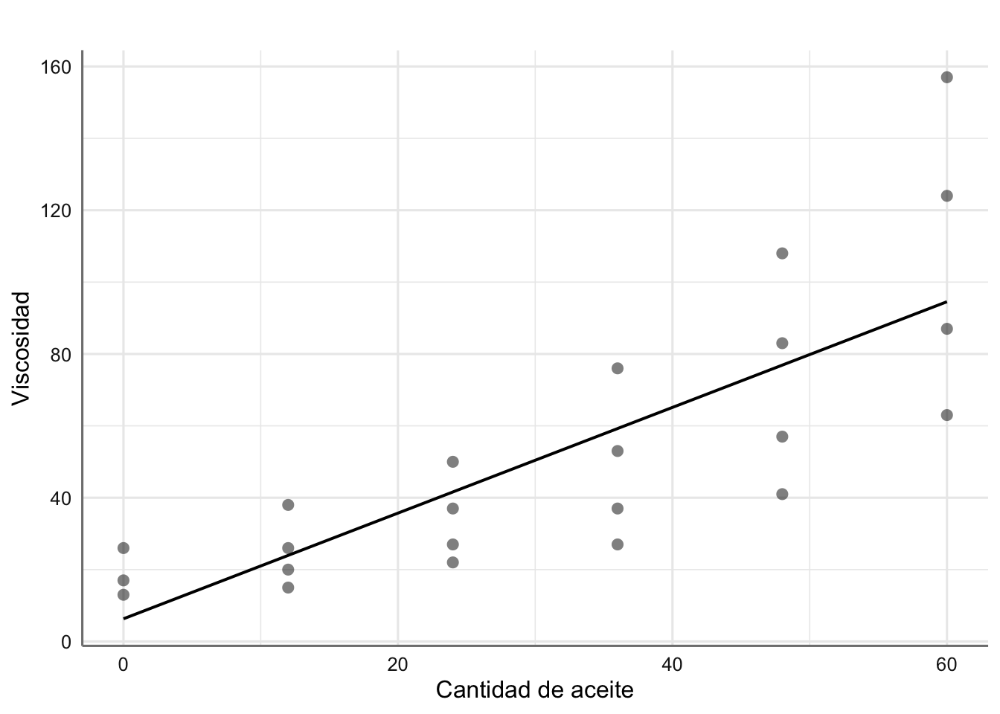
<p class="caption">(\#fig:rls018)Ajuste para los datos de viscosidad</p>
</div>

El modelo ajustado indica que la cantidad de aceite puede explicar la viscosidad final (p-valor significativo), de forma que por cada unidad que aumentamos la cantidad de aceite la viscosidad aumenta en 1.47 unidades. El modelo obtenido viene dado por:

$$
\widehat{\text{viscosidad}} = 6.32 + 1.47*\text{aceite}
$$

Estudiamos la capacidad explicativa del modelo:


```r
glance(fit.aceite)
```

```
## # A tibble: 1 × 12
##   r.squared adj.r.squared sigma statistic    p.value    df logLik   AIC   BIC deviance df.residual
##       <dbl>         <dbl> <dbl>     <dbl>      <dbl> <dbl>  <dbl> <dbl> <dbl>    <dbl>       <int>
## 1     0.624         0.606  23.8      34.9 0.00000731     1  -104.  215.  218.   11898.          21
## # … with 1 more variable: nobs <int>
```

El $R^2$ nos indica que el 62.4% de la variabilidad viene explicada por el modelo. Además el p-valor asociado a la tabla ANOVA resulta significativo indicando que el modelo tiene capacidad explicativa, es decir, podemos utilizar la cantidad de aceite para conocer el grado de viscosidad. Pasamos al diagnóstico del modelo.


```r
diagnostico.aceite <- fortify(fit.aceite)
```

En este cao utilizamos los tests estadísticos en lugar de los gráficos para concluir sobre el diagnóstico:


```r
# Varianza constante
bptest(fit.aceite)  
```

```
## 
## 	studentized Breusch-Pagan test
## 
## data:  fit.aceite
## BP = 6.0786, df = 1, p-value = 0.01368
```

```r
# Normalidad
shapiro.test(diagnostico.aceite$.stdresid)
```

```
## 
## 	Shapiro-Wilk normality test
## 
## data:  diagnostico.aceite$.stdresid
## W = 0.95818, p-value = 0.4276
```

```r
# Independencia
dwtest(fit.aceite)
```

```
## 
## 	Durbin-Watson test
## 
## data:  fit.aceite
## DW = 0.51202, p-value = 5.084e-06
## alternative hypothesis: true autocorrelation is greater than 0
```

Como se puede ver debemos rechazar las hipótesis de varianza constante y de independencia (p-valores inferiores a 0.05). Planteamos la familia de transformaciones de Box-Cox para tratar de corregir los problemas con las hipótesis del modelo:


```r
boxcox(fit.aceite)
```

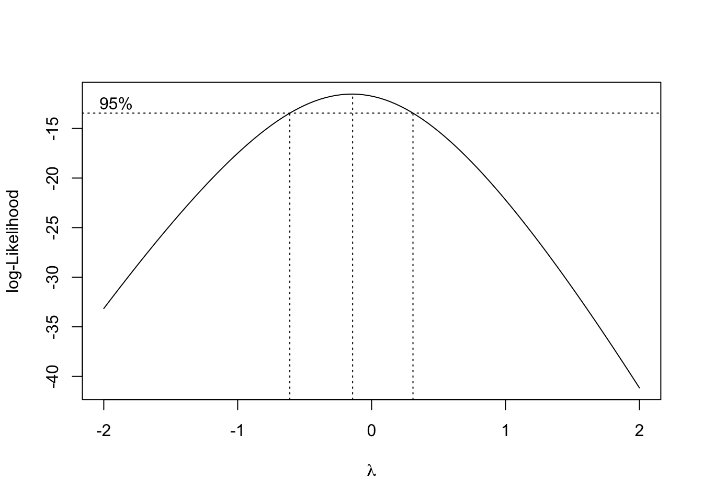

El intervalo de confianza al 95% para $\lambda$ incluye el valor de $\lambda = 0$, de forma que podríamos utilizar la transformación logaritmo para tratar de corregir los defectos encontrados en el modelo propuesto inicialmente.


```r
# Calculamos la nueva variable
aceites <- aceites %>% mutate(lviscosidad = log(viscosidad))
# Ajuste el nuevo modelo
fit.aceite2 <- lm(lviscosidad ~ aceite, data = aceites)
# Solución con glm_coef
glm_coef(fit.aceite2)
```

```
##     Parameter       Coefficient Pr(>|t|)
## 1 (Intercept)  2.81 (2.52, 3.1)  < 0.001
## 2      aceite 0.03 (0.02, 0.04)  < 0.001
```

```r
# Gráfico del ajuste
plot_model(fit.aceite2,"pred", terms = ~aceite, 
                ci.lvl = NA, 
                show.data = TRUE, 
                axis.title = c("Cantidad de aceite", "log(Viscosidad)"),
                title = " ")
```

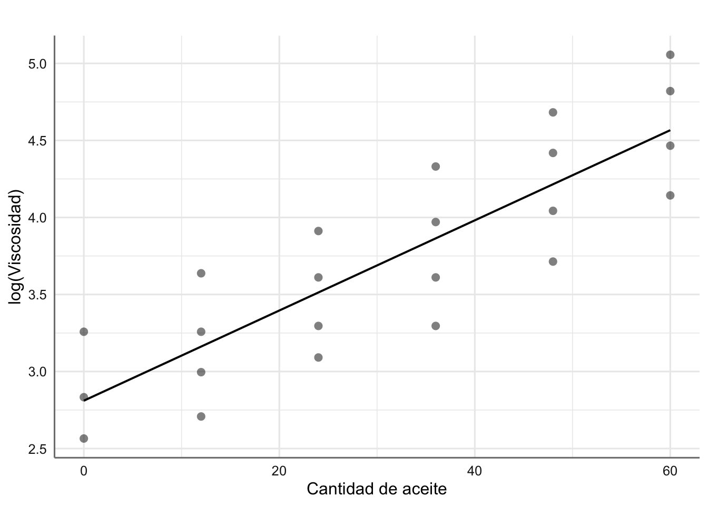

El modelo resulta significativo con ecuación dada por: $$
\widehat{\text{lviscosidad}} = 2.81 + 0.03*\text{aceite}
$$

La bondad del ajuste


```r
glance(fit.aceite2)
```

```
## # A tibble: 1 × 12
##   r.squared adj.r.squared sigma statistic     p.value    df logLik   AIC   BIC deviance df.residual
##       <dbl>         <dbl> <dbl>     <dbl>       <dbl> <dbl>  <dbl> <dbl> <dbl>    <dbl>       <int>
## 1     0.738         0.726 0.363      59.3 0.000000152     1  -8.31  22.6  26.0     2.77          21
## # … with 1 more variable: nobs <int>
```

nos da una capacidad explicativa del 73.8%. Hemos mejorado nuestra capacidad explicativa al transformar la respuesta. Por último realizamos el diagnóstico del nuevo modelo:


```r
diagnostico.aceite2 <- fortify(fit.aceite2)
# Varianza constante
bptest(fit.aceite2)  
```

```
## 
## 	studentized Breusch-Pagan test
## 
## data:  fit.aceite2
## BP = 0.39756, df = 1, p-value = 0.5284
```

```r
# Normalidad
shapiro.test(diagnostico.aceite2$.stdresid)
```

```
## 
## 	Shapiro-Wilk normality test
## 
## data:  diagnostico.aceite2$.stdresid
## W = 0.92282, p-value = 0.07659
```

```r
# Independencia
dwtest(fit.aceite2)
```

```
## 
## 	Durbin-Watson test
## 
## data:  fit.aceite2
## DW = 0.24384, p-value = 6.044e-10
## alternative hypothesis: true autocorrelation is greater than 0
```

El modelo verifica las hipótesis de varianza constante y normalidad. la hipótesis de independencia resulta significativa debido a la propia estructura de los datos, y más concretamente de la variable predictora, ya que como se puede ver solo se dan ciertos valores específicos (como si se tratara de una variable categórica más que una numérica). Podemos verificar este hecho con el gráfico de autocorrelación:


```r
# gráfico función autocorrelación
acf(diagnostico.aceite2$.stdresid)
```

<div class="figure" style="text-align: center">
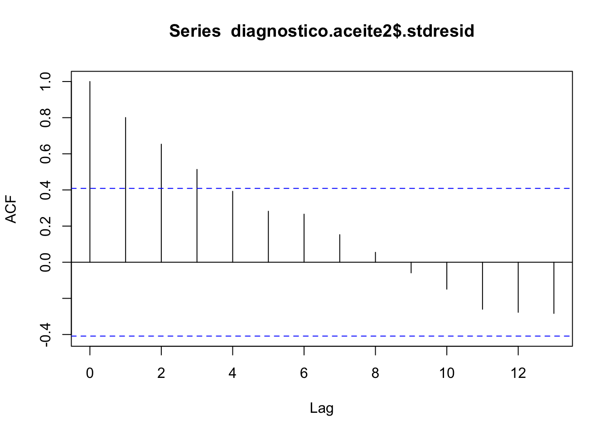
<p class="caption">(\#fig:rls028)Gráfico de autocorrelación de los residuos estandarizados.</p>
</div>

En esta situación este incumplimiento no resulta concluyente y podemos utilizar el modelo construido para establecer una relación entre la cantidad de aceite y el logaritmo de la viscosidad.

## Predicción del modelo {#rls_pred}

Una vez obtenido un modelo definitivo, la última fase de la modelización consiste en la predicción de la respuesta a partir de un nuevo conjunto de valores de la predictora o predictoras. Básicamente se trata de utilizar valores dentro del rango de la variable predictora para conocer el valor de la respuesta sin necesidad de realizar el diseño experimental. Una vez ajustado el modelo si consideramos una observación $X = x_0$ dentro del rango de valores de $X$ la predicción de la respuesta se puede obtener a través del modelo ajustado mediante:

$$y_0 = \widehat{\beta_0} + \widehat{\beta_1} x_0.$$

Esto nos proporciona una estimación puntual del valor predicho, pero sin embargo es necesario proporcionar un intervalo de confianza para dicho valor para tener en cuenta la variabilidad observada en el modelo propuesto. Existen dos posibilidades de predicción en este sentido:

-   **Predicción del valor medio de la respuesta.** Se trata de predecir el valor medio de la respuesta para un valor especifico de la variable predictora ($X = x_0$). Esta es la herramienta de predicción habitual ya que tiene una menor variabilidad. La idea es que para un mismo valor de $X = x_0$ obtendremos diferentes valores predichos de la respuesta, y por tanto, más que interesarnos la predicción de la respuesta, nos centramos en predecir la media de todos esos posibles valores de la respuesta.

-   **Predicción del valor de la respuesta.** Se trata de predecir el valor de la respuesta para un valor especifico de la variable predictora ($X = x_0$). Dado que estamos intentando predecir un único valor y no la media de un conjunto de valores el intervalo de confianza de predicción es mayor que en el caso anterior. Tenemos más variabilidad cuando queremos predecir un valor que cuando queremos predecir la media de un conjunto de valores.

Utilizaremos la función `predict()` para construir la predicción para un modelo dado. Veremos su aplicación en los diferentes ejemplos.

### Respuesta media

Como ya hemos indicado resulta posible obtener una estimación puntual del valor de la respuesta media a través de: \begin{equation}
\hat{y}_{x_0} = \hat{\beta}_0 + \hat{\beta}_1 x_0.
 (\#eq:RLSpredmean)
\end{equation} para un $X = x_0$ dado.

Un intervalo de confianza para la estimación del valor esperado de la respuesta para un $X = x_0$ dado es:

```{=tex}
\begin{equation}
IC(E(\bar{y}_n \mid x_0);1-\alpha) = \hat{y}_{x_0} \pm t_{(n-2,1-\frac{\alpha}{2})} \ s \sqrt{\frac{1}{n} + \frac{(x_0 - \bar{x})^2}{S_{xx}}}.
(\#eq:RLSbandaspredmean)
\end{equation}
```
### Nueva observación

Predeciremos una futura observación de la variable $Y$ para cierto valor de $X = x_0$, con

```{=tex}
\begin{equation}
\hat{y}_{x_0}=\hat{\beta}_0 + \hat{\beta}_1 x_0 = \bar{y} + \hat{\beta}_1 (x_0 - \bar{x}),
 (\#eq:RLSpredone)
\end{equation}
```
y el intervalo de confianza vendrá dado por:

```{=tex}
\begin{equation}
IC(y_{x_0};1-\alpha) = \hat{y}_{x_0} \pm t_{\left(n-2,1-\frac{\alpha}{2}\right)} \ s \ \sqrt{1+\frac{1}{n} + \frac{(x_0-\bar{x})^2}{S_{xx}}} (\#eq:RLSpredone1)
\end{equation}
```
Notar que tanto la estimación de la respuesta media como la predicción coinciden, aunque difieren en cuanto al grado de incertidumbre de la misma. Como es de esperar, predecir un hecho puntual en el futuro conlleva más incertidumbre que estimar en términos medios qué va a a ocurrir. Por último, comentar que cuando hemos utilizado alguna transformación (monótona) sobre la respuesta y queremos recuperar la estimación o predicción de ésta en su escala original, basta con utilizar la transformación recíproca sobre el valor predicho para obtener la predicción en la escala original.

### Ejemplos

Dado que la estimación puntual de la predicción coincide con el modelo ajustado, ya hemos mostrado anteriormente como representar gráficamente la ecuación del modelo o predicción de la respuesta en diferentes ejemplos. En este punto nos limitamos a mostrar como obtener y representar los intervalos de confianza asociados, y como obtener la predicción para un conjunto determinado de valores de la variable predictora.

#### Corrosión

En primer lugar recuperamos los datos y modelo obtenido para los datos de corrosión.

Estamos interesados en conocer la pérdida de peso medio (estimación de la media) y la pérdida de peso específica (predicción de una futura observación) para una barra en particular cuando el contenido en hierro es de 0.5, 1, y 1.5.


```r
# cargamos datos de predicción
newpred <- data.frame(hierro = c(0.5, 1, 0.5))
# Predicción para la media de la respuesta
# Opción interval = "confidence" 
newdata <- data.frame(newpred, 
                      predict(fit, 
                              newpred, 
                              interval = "confidence")) 
round(newdata, 2)
```

```
##   hierro    fit    lwr    upr
## 1    0.5 117.78 115.63 119.92
## 2    1.0 105.77 103.87 107.67
## 3    0.5 117.78 115.63 119.92
```

Hemos obtenido la estimación (`fit`) e intervalo de confianza (`(lwr,upr)`) al 95% de la predicción de la pérdida de peso medio para valores específicos de contenido de hierro.


```r
# cargamos datos de predicción
newpred <- data.frame(hierro = c(0.5, 1, 0.5))
# Predicción de un único valor
# Opción interval = "prediction" 
newdata <- data.frame(newpred, 
                      predict(fit, 
                              newpred, 
                              interval = "prediction")) 
round(newdata, 2)
```

```
##   hierro    fit    lwr    upr
## 1    0.5 117.78 110.71 124.84
## 2    1.0 105.77  98.77 112.76
## 3    0.5 117.78 110.71 124.84
```

Como ya habíamos comentado la estimación que obtenemos es la misma pero los intervalos de confianza son más amplios.

A continuación se muestra como representar gráficamente la predicción de la respuesta media y los intervalos de predicción al 95% de confianza para todo el rango de valores de la predictora.


```r
# Gráfico del ajuste
plot_model(fit, "pred", terms = ~hierro, 
                ci.lvl = 0.95, 
                show.data = TRUE, 
                axis.title = c("Contenido en hierro", "Peso"),
                title = " ")
```

<div class="figure" style="text-align: center">
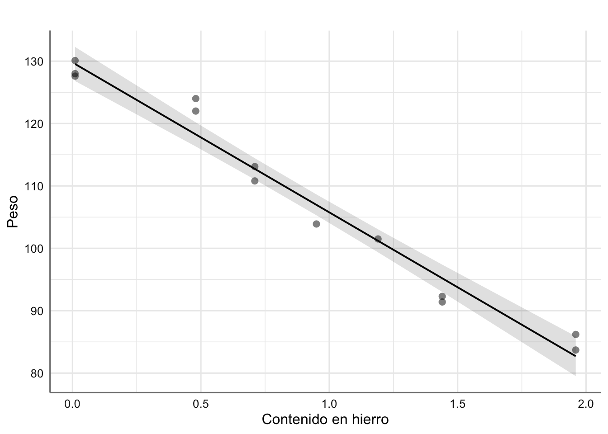
<p class="caption">(\#fig:rls031)Predicción para los datos de corrosión (media e IC95%).</p>
</div>

#### Viscosidad

Vamos a realizar la predicción para el modelo ajustado a los datos de viscosidad. Recordemos que en este caso hemos transformado la respuesta con la función logaritmo para asegurar que se cumple las hipótesis del modelo, y por tanto nuestra predicción inicial es sobre dicha variable y no sobre la viscosidad. Resulta necesario deshacer la transformación logaritmo para poder obtener la predicción en la escala original de la viscosidad.

Estamos interesados en conocer la viscosidad media (estimación de la media) del producto final cuando el contenido de aceite es de 10, 20, 30, 40, y 50.


```r
# cargamos datos de predicción
newpred <- data.frame(aceite = c(10, 20, 30, 40, 50))
# Predicción para la media de la respuesta
# Opción interval = "confidence" 
newdata <- data.frame(newpred, 
                      predict(fit.aceite2, 
                              newpred, 
                              interval = "confidence")) 
round(newdata, 2)
```

```
##   aceite  fit  lwr  upr
## 1     10 3.10 2.87 3.33
## 2     20 3.40 3.21 3.58
## 3     30 3.69 3.53 3.85
## 4     40 3.98 3.81 4.15
## 5     50 4.27 4.06 4.49
```


```r
# Deshacemos la transformación para volver a la escala de viscosidad
newdata[,2:4] <- exp(newdata[,2:4])
round(newdata,2)
```

```
##   aceite   fit   lwr   upr
## 1     10 22.27 17.68 28.05
## 2     20 29.84 24.90 35.77
## 3     30 39.99 34.15 46.83
## 4     40 53.59 45.12 63.64
## 5     50 71.80 57.85 89.12
```

De esta forma obtenemos las predicciones en la escala original de la variable viscosidad. ¿Cómo interpretamos los valores de predicción obtenidos?

Realizamos ahora los gráficos de predicción para `log(viscosidad)` y `viscosidad`. Para este último introducimos el código necesario para deshacer la transformación.


```r
# Gráfico del ajuste
plot_model(fit.aceite2, "pred", terms = ~aceite, 
                ci.lvl = 0.95, 
                show.data = TRUE, 
                axis.title = c("Contenido de aceite", "log(Viscosidad)"),
                title = " ")
```

<div class="figure" style="text-align: center">
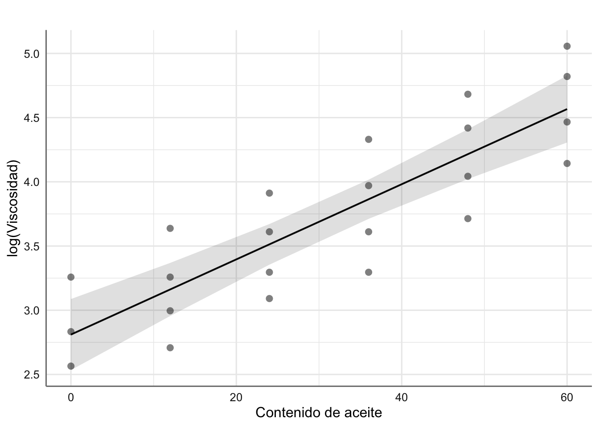
<p class="caption">(\#fig:rls034)Predicción para los datos de log(viscosidad) (media e IC95%).</p>
</div>


```r
# Construímos una secuencia de predicción
newdata <- data.frame(aceite = seq(min(aceites$aceite),
                                   max(aceites$aceite), 
                                   length = 50))
# Predicción para la media de la respuesta
newdata <- data.frame(newdata, predict(fit.aceite2, 
                                       newdata, 
                                       interval = "confidence"))
# Deshacemos la transformación para volver a la escala de viscosidad
newdata[,2:4] <- exp(newdata[,2:4])
# Gráfico del ajuste
ggplot(newdata, aes(x = aceite, y = fit)) +
  geom_line() + 
  geom_ribbon(aes(ymax = upr, ymin = lwr), alpha = 1/5) +
  geom_point(data = aceites, aes(x = aceite, y = viscosidad)) +
  labs(x = "Cantidad de aceite", y = "Viscosidad") +
  theme_bw()
```

<div class="figure" style="text-align: center">
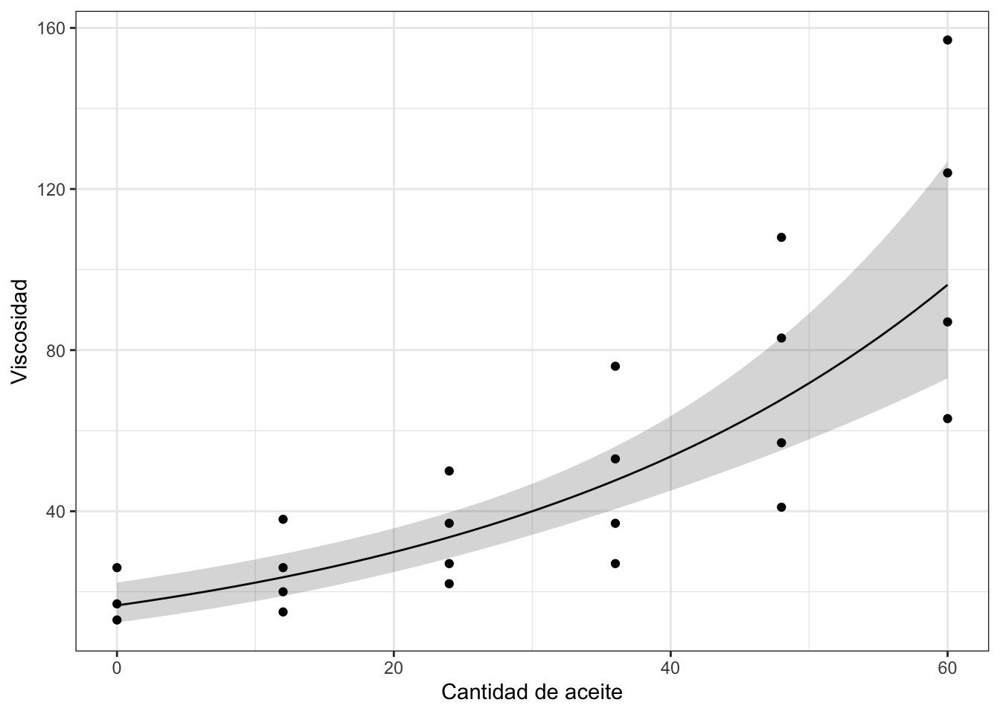
<p class="caption">(\#fig:rls035)Predicción para los datos de viscosidad (media e IC95%).</p>
</div>

En este segundo gráfico se puede ver el efecto de la transformación propuesta. De hecho, la predicción obtenida captura la tendencia observada en los datos originales.
