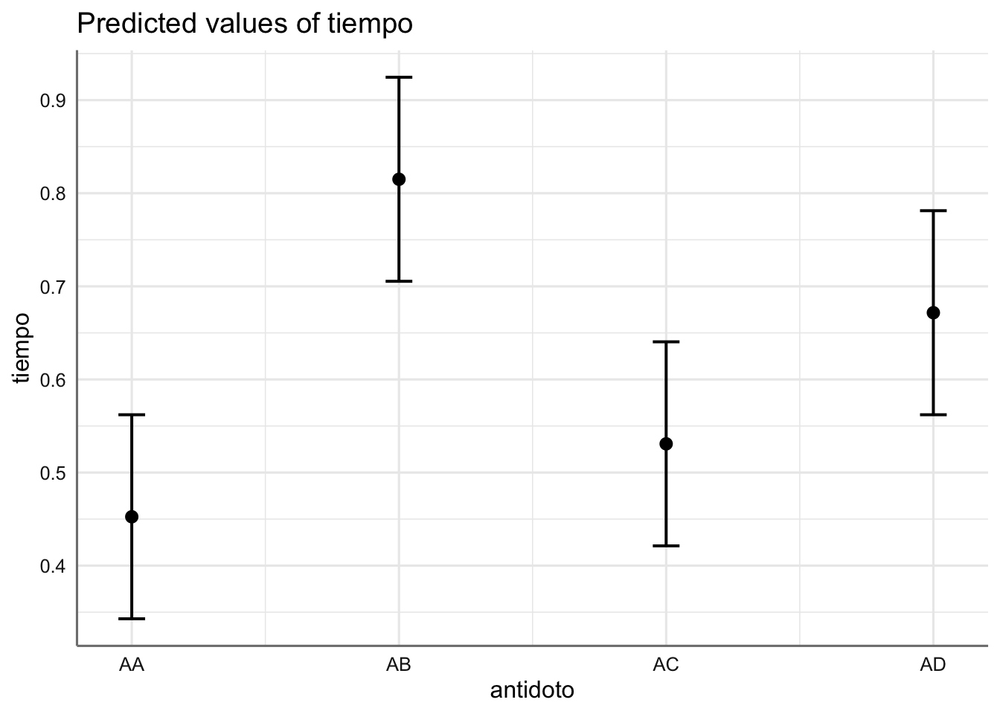

# Modelos ANOVA {#anova}

Los modelos ANOVA surgen cuando la variable o variables predictoras son de tipo categórico, es decir, factores con diferentes niveles de clasificación, de forma que cada sujeto es medido (respecto de la respuesta) para una combinación específica de los factores considerados. La variable respuesta sigue siendo de tipo numérico y el objetivo principal es el estudio de la media para los diferentes niveles del factor o combinaciones de los factores. No solo se está interesado en comparar los diferentes grupos, sino además en cuantificar numéricamente esas diferencias.

La principal diferencia con los modelos de regresión es que en este caso no modelizamos toda la respuesta observada sino la media observada del conjunto de observaciones para cada nivel del factor. Además, veremos como estos modelos pueden ser descritos en términos de un modelo lineal de regresión lo que nos permite utilizar parte de los procesos de descripción, análisis y diagnóstico utilizamos en los capítulos anteriores. En cada punto de este capítulo estudiaremos las similitudes y diferencias con los modelos de regresión.

## Bancos de datos

Si las variables explicativas son de tipo factor, el análisis preliminar se realiza mediante gráficos de cajas. Estos gráficos sirven para visualizar relaciones entre una variable continua y un factor. En estos casos, hablar de relación / asociación equivale a hablar de diferencias en la variable continua respecto de los niveles (categorías) del factor. Tales diferencias se detectan cuando los diagramas de cajas no muestran solapamientos en la escala de la variable respuesta. En los modelos de dos vías podremos realizar además un gráfico de interacción, que es un gráfico de líneas donde se representan las medias de las diferentes combinaciones de niveles del factor, y que nos permite establecer una primera conclusión sobre el comportamiento conjunto de ambos factores.

Veamos los diferentes bancos de datos que iremos analizando a lo largo de la unidad.

**Ejemplo 1. Datos de Insecticidas.** Este ejemplo contiene los datos de un experimento agronómico para conocer el efecto de diferentes insecticidas (`spray`) sobre el número de insectos vivos (`count`) tras un periodo de tratamiento.

Cargamos los datos y realizamos el gráfico descriptivo:

```r
data(InsectSprays)
insecticidas <- InsectSprays
ggplot(insecticidas,aes(x = spray, y = count)) + 
   geom_boxplot()
```


Se aprecia como el número de insectos vivos es superior cuando usamos los sprays A, B, y F (con medias muy similares). El resto de sprays muestran (medias) una supervivencia inferior. Se observan como dos grupos de sprays, uno con medias altas y otro con medias bajas.

**Ejemplo 2. Datos de Envasado.** Se desea estudiar la fabricación de cuatro tipos de máquinas automáticas (`maquina`) en el cortado de piezas de embutido para envasado. Para ello se toman datos del número de envases sin defecto (`produccion`) que produce cada máquina durante periodos de una hora.

Cargamos los datos y realizamos el gráfico descriptivo:

```r
maquina <- c(rep("M1", 4),rep("M2", 4),rep("M3", 4),rep("M4", 4))
produccion <- c(103, 115, 101, 105, 109, 106, 116, 124, 104, 98, 117, 
                99, 128, 117, 121, 130)
envasado <- data.frame(maquina, produccion)
ggplot(envasado,aes(x = maquina, y = produccion)) + 
   geom_boxplot()
```


Cada máquina muestra un nivel de envases sin defecto diferente. La máquina M4 es la que muestra mejores resultados y la M3 los peores.

**Ejemplo 3. Datos de venenos.** Se ha realizado un experimento para comprobar la efectividad de diferentes antídotos (AA, AB, AC y AD) frente a diferentes venenos (VA, VB y VC). Para ello se recoge el tiempo de reacción (tiempo) que cada antídoto tarda en hacer efecto para cada veneno.

Cargamos los datos y realizamos el gráfico descriptivo:

```r
tiempo <- c(0.31, 0.45, 0.46, 0.43, 0.36, 0.29, 0.4, 0.23, 
          0.22, 0.21, 0.18, 0.23, 0.82, 1.1, 0.88, 0.72, 0.92, 0.61, 0.49, 
          1.24, 0.3, 0.37, 0.38, 0.29, 0.43, 0.45, 0.63, 0.76, 0.44, 0.35, 
          0.31, 0.4, 0.23, 0.25, 0.24, 0.22, 0.45, 0.71, 0.66, 0.62, 0.56, 
          1.02, 0.71, 0.38, 0.3, 0.35, 0.31, 0.33)
antidoto <- factor(c(1, 1, 1, 1, 1, 1, 1, 1, 1, 1, 1, 1, 2, 2, 2, 2, 
                     2, 2, 2, 2, 2, 2, 2, 2, 3, 3, 3, 3, 3, 3, 3, 3, 
                     3, 3, 3, 3, 4, 4, 4, 4, 4, 4, 4, 4, 4, 4, 4, 4), 
                   labels=c("AA", "AB", "AC", "AD"))
veneno <- factor(c(1, 1, 1, 1, 2, 2, 2, 2, 3, 3, 3, 3, 1, 1, 1, 1, 2, 
                   2, 2, 2, 3, 3, 3, 3, 1, 1, 1, 1, 2, 2, 2, 2, 3, 3, 
                   3, 3, 1, 1, 1, 1, 2, 2, 2, 2, 3, 3, 3, 3), 
                 labels=c("VA", "VB", "VC"))
venenos <- data.frame(tiempo, antidoto, veneno)
# Diagrama de cajas
ggplot(venenos,aes(x = antidoto, y = tiempo, color = veneno)) + 
  geom_boxplot() 
```


```r
# Gráfico de interacción de medias
ggplot(venenos, 
  aes(x = antidoto, y = tiempo, group = veneno, color = veneno)) +
  stat_summary(fun = mean, geom = "point") +
  stat_summary(fun = mean, geom = "line") 
```


En el gráfico de interacción se puede apreciar que antídoto es más efectivo para cada tipo de veneno. demás se puede ver que las curvas del tiempo de reacción (líneas de colores) no tiene el mismo comportamiento lo que indica habitualmente que hay cierto efecto de interacción entre los factores considerados, es decir, existe dos combinaciones antídoto - veneno que presentan resultados significativos (medias distintas). 

## Modelos ANOVA 1 vía

El modelo ANOVA de una vía se plantea cuando tenemos una única variable predictora de tipo categórico y una respuesta de tipo numérico. Dicho modelo se puede describir de forma general, para una muestra de tamaño $n$, como:

* Una variable respuesta, $Y$, de tipo numérico con observaciones $y_1, \ldots ,y_n$.
* Una variable predictora, $F$, de tipo categórico con $I$ grupos o niveles distintos de tamaños muestrales $n_1, n_2, \ldots , n_I$, de forma que $n = n_1 + n_2 + \ldots + n_I$, y el vector de observaciones de la respuesta se puede escribir como:

$$
y_{11},\ldots,y_{1n_1},y_{21},\ldots,y_{2n_2},\ldots,y_{I1},\ldots,y_{In_I}
$$
donde el primer subíndice indica el nivel del factor y el segundo la posición dentro del conjunto de datos de dicho nivel del factor.

* Conjunto $\mu_i$ de medias de todas las observaciones de la respuesta asociadas con el nivel $i$ del factor, es decir:

$$
\mu_i = \frac{\sum_{j = 1}^{n_j} y_{ij}}{n_i}; \text{ i = 1, 2,..., I}
$$

* Media global de la respuesta, $\mu$, que se puede obtener como:

$$
\mu = \frac{\sum_{j = 1}^{I} \mu_{j}}{I}
$$

* Incrementos, $\alpha_i$, de cada una de las medias de cada grupo con respecto a la media global, es decir:

$$
\alpha_i= \mu - \mu_i; \text{ i = 1, 2,..., I}
$$

El objetivo básico en este tipo de modelos es la comparación de las medias $\mu_i$ para detectar posibles diferencias entre os niveles del factor, es decir, plateamos el contraste de comparación de medias:
$$
\left\{ 
\begin{array}{ll}
H_0: & \mu_1 = \mu_2 = \ldots = \mu_I\\
H_a: & \mbox{Existen dos grupos al menos con medias distintas}
\end{array}
\right.
$$

Este contraste es equivalente al que se puede escribir en términos de los incrementos de las medias:
$$
\left\{ 
\begin{array}{ll}
H_0: & \alpha_1 = \alpha_2 = \ldots = \alpha_I = 0\\
H_a: & \mbox{Al menos hay un incremento distinto de cero}
\end{array}
\right.
$$

que tiene una estructura similar al test $F$ de la regresión, donde queremos contrastar si existe algún coeficiente distinto de cero. Esto implica que el modelo ANOVA se puede escribir en términos de un modelo lineal sin más que considerar un conjunto de variables ficticias $X_1,...,X_{I}$ que toman los valores siguientes:

$$
X_i= 
\left\{ 
\begin{array}{ll}
1 & \mbox{si la respuesta pertenece al grupo i}\\
0 & \mbox{en otro caso}
\end{array}
\right.
$$

y un efecto común para todos los niveles del factor que viene dado por $\mu$ que denotamos por $\alpha_0$. La única diferencia entre ambas estructuras de comparación es que la referida a las medias $\mu_i$ tiene $I$ parámetros, mientras que la de los incrementos tiene $I+1$ parámetros. Para hacer equivalentes ambas estructuras añadimos la conocida como restricción de identificabilidad que establece de partida que uno de los incrementos debe ser igual a cero, es decir, que una media de un grupo coincide con la media global. Este es el nivel de referencia que utilizamos como base de comparación con el resto de niveles o grupos del factor. 

En esta situación si consideramos $Y_i = \{y_{i1},...,y_{in_i}\}$, $1_{n_i} = \{1,...,1\}$ un vector de $n_i$ unos,  $0_{n_i} = \{0,...,0\}$ un vector de $n_i$ ceros, para cada uno de los niveles $i$ del factor, $\mu = \alpha_0$, y la restricción de identificabilidad $\alpha_I = 0$ (podríamos elegir cualquier otro $\alpha_j =0$ y obtendríamos el mismo modelo), podemos escribir el modelo ANOVA como:

$$
Y = \left( 
\begin{array}{c}
   Y_1 \\
   Y_2 \\
   \ldots \\
   Y_I \\
\end{array}
\right)
=
\left( 
\begin{array}{ccccc}
   1_{n_1} & 1_{n_1} & 0_{n_1} & \ldots & 0_{n_1} \\
   1_{n_2} & 0_{n_2} & 1_{n_2} & \ldots & 0_{n_2} \\
   \ldots & \ldots & \ldots & \ldots & \ldots \\
   1_{n_I} & 0_{n_I} & 0_{n_I} &\ldots & 1_{n_I} \\
\end{array}
\right)
\left( 
\begin{array}{c}
   \alpha_0 \\
   \alpha_1 \\
  \alpha_2 \\
 \ldots \\
   \alpha_{I_1} \\
\end{array}
\right)
+
\left( 
\begin{array}{c}
   e_1 \\
   e_2 \\
   \ldots \\
   e_n \\
\end{array}
\right) = X\beta + \epsilon
$$
o equivalentemente en términos de las medias como:

\begin{equation}
\mu_i = \alpha_0 + \alpha_i + \epsilon_i, \text{ para } i = 1, 2,...,k, \text{ con } \alpha_k = 0
(\#eq:aovonefac)
\end{equation}

Las hipótesis de este modelo es que los errores se distribuyen de forma independiente mediante una distribución Normal de media cero y varianza constante $\sigma^2$ para cada uno de los grupos que determina la variable predictora. En esta situación el contraste sobre los incrementos es equivalente al test $F$ de regresión de los modelos RLM.

### Especificacion del modelo en `R`

A continuación se presenta la especificación en `R` de los modelos anteriores y de todos los anidados que pueden surgir a partir de ellos, así como su interpretación en términos de contraste de hipótesis o coeficientes asociados a cada efecto presente en el modelo. La especificación en `R` del modelo dado en la ecuación \@ref{eq:aovonefac} para su estimación se realiza a través de la expresión reducida del modelo dada por:
$$
Y \sim F
$$

En este tipo de modelos se plantean varias situaciones de modelos anidados que deberemos estudiar:

* Modelo con efecto de $F$:

\begin{equation}
Y \sim F,
(\#eq:modesatoneway)
\end{equation}

Si $F$ resulta significativo, tenemos que se detectan diferencias entre al menos dos medias para los niveles del factor $F$.

* Modelo sin efectos:

\begin{equation}
Y \sim 1
(\#eq:modelredoneway)
\end{equation}

En este caso $F$ no resulta significativo y podmeos conluir que las medias de todos los niveles del factor se pueden considerar iguales.

En la práctica el ajuste de este tipo de modelos se puede plantear como una comparación entre los modelos \@ref(eq:modesatoneway) y \@ref(eq:modelredoneway), dado que están anidados, de forma similar al proceso de comparación de modelos planteado en los modelos RLM y MP.


## Modelos ANOVA dos vías

El modelo ANOVA de dos vías se presenta cuando consideramos dos variables predictoras de tipo categórico. Si tenemos dos factores $F_1$ y $F_2$ con $I$ y $J$ niveles respectivamente (y utilizando lo visto en el punto anterior), el modelo expresado en términos de las medias de las combinaciones de los diferentes niveles de los factores considerados viene dado por:

\begin{equation}
\mu_{ij} = \alpha_0 + \alpha_i + \beta_j + \alpha\beta_{ij} + \epsilon_{ij}, \ \mbox{para} \ i = 1,\ldots,I; \ j = 1,\ldots,J \ \mbox{con} \ \alpha_1 = \beta_1 = \alpha\beta_{11} = 0
(\#eq:aovtwofac)
\end{equation}

donde:

* $\mu_{ij}$ es la media de la respuesta para el nivel $i$ de $F_1$ y el nivel $j$ de $F_2$.
* $\alpha_0$ es el efecto común a todas las combinaciones de niveles para ambos factores.
* $\alpha_i$ son los incrementos asociados a cada uno de los niveles del factor $F_1$.
* $\beta_j$ son los incrementos asociados a cada uno de los niveles del factor $F_2$.
* $\alpha\beta_{ij}$ son los incrementos asociados a la combinación de los niveles $i$ de $F_1$ y $j$ de $F_2$. Es lo que se denomina efecto de interacción que valora los cambios en las combinaciones de las medias para ambos factores. Si este efecto no es significativo, la media para una combinación de niveles de los factores se construye sumando los incrementos de cada nivel de forma independiente.

Dado que tenemos dos factores se hace necesario añadir más restricciones de identificabildiad. Añadimos una por cada factor y la que aparece de forma inmediata en la interacción de los dos efectos que estamos tomando como cero. 

En este caso no escribimos la matriz de diseño del modelo pero se puede escribir considerado la matriz de coeficientes de dimensiones $IJ \times IJ$ que surge para el modelo \@ref(eq:aovtwofac). Bastará con sustituir los unos y ceros por vectores de unos y ceros de dimensiones adecuadas en función de los tamaños de cada uno de los niveles de los dos factores considerados. Dicha matriz de coeficientes se puede extraer a partir de las ecuaciones completas del modelo \@ref(eq:aovtwofac) (teniendo en cuenta las restricciones de identificabilidad) dadas por:

$$\begin{array}{lll} 
\mu_{11} & = \alpha_0 + \alpha_{1} + \beta_{1} + \alpha\beta_{11} + \epsilon_{11}& = \alpha_0 + \epsilon_{11}\\
\mu_{12} & = \alpha_0 + \alpha_{1} + \beta_{2} + \alpha\beta_{12} + \epsilon_{12}& = \alpha_0 + \beta_{2} + \alpha\beta_{12} + \epsilon_{12}\\
\ldots & \ldots &\ldots\\
\mu_{1J} & = \alpha_0 + \alpha_{1} + \beta_{J} + \alpha\beta_{1J} + \epsilon_{1J}& = \alpha_0 + \beta_{J} + \alpha\beta_{1J} + \epsilon_{1J}\\
\mu_{21} & = \alpha_0 + \alpha_{2} + \beta_{1} + \alpha\beta_{21} + \epsilon_{21}& = \alpha_0 + \alpha_{2} + \alpha\beta_{21} +\epsilon_{11}\\
\mu_{22} & = \alpha_0 + \alpha_{2} + \beta_{2} + \alpha\beta_{22} + \epsilon_{22}& = \alpha_0 +  \alpha_{2} + \beta_{2} + \alpha\beta_{22} + \epsilon_{22}\\
\ldots & \ldots &\ldots\\
\mu_{2J} & = \alpha_0 + \alpha_{2} + \beta_{J} + \alpha\beta_{2J} + \epsilon_{2J}& = \alpha_0 +  \alpha_{2} + \beta_{J} + \alpha\beta_{2J} + \epsilon_{2J}\\
\ldots & \ldots &\ldots\\
\ldots & \ldots &\ldots\\
\ldots & \ldots &\ldots\\
\mu_{I1} & = \alpha_0 + \alpha_{I} + \beta_{1} + \alpha\beta_{I1} + \epsilon_{I1}& = \alpha_0 +  \alpha_{I} +  \alpha\beta_{I1} + \epsilon_{I1}\\
\mu_{I2} & = \alpha_0 + \alpha_{I} + \beta_{2} + \alpha\beta_{I2} + \epsilon_{I2}& = \alpha_0 +  \alpha_{I} + \beta_{2} + \alpha\beta_{I2} + \epsilon_{I2}\\
\ldots & \ldots &\ldots\\
\mu_{IJ} & = \alpha_0 + \alpha_{I} + \beta_{J} + \alpha\beta_{IJ} + \epsilon_{IJ}& = \alpha_0 +  \alpha_{I} + \beta_{J} + \alpha\beta_{IJ} + \epsilon_{IJ}\\
\end{array}$$

En este caso el objetivo vuelve a ser la comparación de medias pero el contraste a resolver depende de la especificación del modelo considerado. Hay que tener en cuenta que en este caso no tenemos una única variable predictora, y además hay que valorar la posibilidad de la interacción entre ambos factores.

### Especificacion del modelo en `R`

La especificación en `R` del modelo dado en la ecuación \@ref{eq:aovtwofac} para su estimación se realiza a través de la expresión reducida del modelo dada por:

\begin{equation}
Y \sim F_1 + F_2 + F_1 : F_2,
(\#eq:modesattwoway)
\end{equation}

donde $F_1 : F_2$ representa el efecto de interacción, y $F_1$ y $F_2$ son los denominados efectos principales asociados con los factores considerados. En este tipo de modelos se plantean varias situaciones de modelos anidados que deberemos estudiar para establecer cual es el tipo de contraste sobre las medias que estamos resolviendo. Alternativamente ese modelo se puede escribir de forma más reducida como $Y \sim F_1*F_2$, que es un modelo con los efectos principales de cada factor y con la interacción.

* Modelo saturado o modelo con todos los factores y la interacción dado por:

\begin{equation}
Y \sim F_1 + F_2 + F_1 : F_2
(\#eq:modeltwoway)
\end{equation}

Si la interacción está presente en el modelo el contraste planteado es:
$$
\left\{ 
\begin{array}{ll}
H_0: & \mbox{No hay diferencias entre las medias conjuntas de ambos niveles del factor}\\
H_a: & \mbox{Al menos hay dos combinaciones de ambos factores con medias distintas}
\end{array}
\right.
$$

que nos permite concluir sobre si el efecto de interacción es necesario para explicar el comportamiento de la respuesta. En caso de que dicho contraste resulte no significativo podemos plantear el modelo con ambos efectos principales.

* Modelo con ambos efectos principales:

$$
Y \sim F_1 + F_2
$$

donde se parte de que la interacción es no significativa y se plantean dos contrastes (uno por cada factor)

$$
\left\{ 
\begin{array}{ll}
H_0: & \mbox{No hay diferencias entre las medias de } F_1\\
H_a: & \mbox{Al menos hay dos medias  de } F_1 \mbox{ distintas}
\end{array}
\right.
$$
Si no rechazamos este contraste deberemos considerar que no hay diferencias en las medias de los niveles establecidos en $F_1$ y debemos considerar un modelo con efecto principal de $F_2$.


$$
\left\{ 
\begin{array}{ll}
H_0: & \mbox{No hay diferencias entre las medias de } F_2\\
H_a: & \mbox{Al menos hay dos medias  de } F_2 \mbox{ distintas}
\end{array}
\right.
$$
Si no rechazamos este contraste deberemos considerar que no hay diferencias en las medias de los niveles establecidos en $F_2$ y debemos considerar un modelo con efecto principal de $F_1$.

Estos contrastes nos permiten concluir sobre cada factor de forma independiente (no hay interacción entre ellos).

* Modelo con efecto principal de $F_1$:

$$
Y \sim F_1
$$

donde se parte de que la interacción y el efecto principal de $F_2$ son no significativos y se plantea el contraste

$$
\left\{ 
\begin{array}{ll}
H_0: & \mbox{No hay diferencias entre las medias de } F_1\\
H_a: & \mbox{Al menos hay dos medias  de } F_1 \mbox{ distintas}
\end{array}
\right.
$$

Si no rechazamos este contraste deberemos considerar que no hay diferencias en las medias de los niveles establecidos en $F_1$ y nuestro modelo final no contiene ningún tipo de efecto predictivo.

* Modelo con efecto principal de $F_2$:

$$
Y \sim F_2
$$

donde se parte de que la interacción y el efecto principal de $F_1$ son no significativos y se plantea el contraste

$$
\left\{ 
\begin{array}{ll}
H_0: & \mbox{No hay diferencias entre las medias de } F_2\\
H_a: & \mbox{Al menos hay dos medias  de } F_2 \mbox{ distintas}
\end{array}
\right.
$$
Si no rechazamos este contraste deberemos considerar que no hay diferencias en las medias de los niveles establecidos en $F_2$ y nuestro modelo final no contiene ningún tipo de efecto predictivo.

* Modelo sin efectos:

$$
Y \sim 1
$$

donde concluimos que todas las medias consideradas son iguales, es decir, los niveles de los factores considerados no tienen efecto sobre la respuesta.

Esta combinación de modelos nos da una estructura secuencial de modelización (modelos alternativos) que deberemos estudiar para elegir el modelo con una mayor capacidad predictiva. Dicha estructura viene dada por:

$$\begin{array}{lll} 
M1: & Y \sim F_1 + F_2 + F_1:F_2\\
M2: & Y \sim F_1 + F_2 \\
M3.1: & Y \sim F_1 \\
M3.2: & Y \sim F_2 \\
M4: & Y \sim 1\\
\end{array}$$

Más adelante veremos como llevar a cabo esta comparación secuencial y como interpretarla para determinar los efectos que finalmente están presentes en el modelo y los que no.

## Estimación y bondad de ajuste del modelo

Dado que los modelos ANOVA se pueden escribir como modelos lineales de regresión con una matriz de diseño que solo contiene unos y ceros, se pueden utilizar los procedimientos de estimación vistos en el capitulo anterior para estimar los par??metros del modelo. Podemos utilizar las ecuaciones normales para obtener los coeficientes del modelo que en este caso representarán los incrementos de cada nivel con respecto al de referencia (que hemos tomado como cero en la restricción de identificabilidad), que nos permiten obtener las estimaciones de las medias asociadas a cada nivel o niveles del factor o factores. Además, podemos obtener los intervalos de confianza de dichos coeficientes.

Sin embargo, en este caso no se pueden interpretar de forma directa las significatividades de cada coeficiente en el modelo, ya que al contrario de los que ocurría en los modelos de regresión, donde cada coeficiente representaba el efecto de una predictora, en los modelos ANOVA el efecto de la predictora va asociado con todos los coeficientes estimados con el factor o interacción de factores. Por eso es necesario proporcionar una medida de bondad de ajuste con dichas estimaciones que en este caso es el test F ANOVA que se obtiene como el test F de la regresión de los modelos de unidades anteriores. Este test nos permite extraer conclusiones directas sobre los efectos presentes en el modelo y no sobre los coeficientes estimados. En el punto siguiente veremos como utilizar el test F ANOVA para obtener el mejor modelo. En este caso no utilizaremos el $R^2$ como medida de bondad de ajusta ya que se encuentra diseñada para modelos de regresión donde las predictoras son de tipo numérico.

Para resolver la estimación y la bondad de ajuste en este tipo de modelos utilizaremos las funciones utilizadas en la unidad anterior. En algunos casos modificaremos la sintaxis para adaptarnos a las variables predictoras de tipo factor.

### Ejemplos

Pasamos a estudiar cada uno de los ejemplos ajustando el modelo saturado, es decir, aquel que contiene todos los efectos posibles en el modelo. Por defecto el programa `R` utiliza como restricción de identificabilidad que el incremento asociado con la primera categoría (por orden numérico o texto de los niveles del factor) es igual a cero, es decir, que la estimación de dicho incremento corresponde con la interceptación o efecto común del modelo.

En las tablas de estimaciones eliminamos el p-valor individual asociado a cada incremento, dado que en este caso esos efectos no deben interpretarse de forma individual. 

#### Datos de Insecticidas

Obtenemos el ajuste del modelo de ANOVA de un factor para el banco de datos de Insecticidas. La expresión del modelo viene dado por:

$$\mu_{spray,i}=\alpha_0+\alpha_{spray,i}+\epsilon_{spray,i}, \text{para }i=A,B,C,D,E ,F$$

donde la restricción de identificabilidad es fijar el incremento del spray A igual a cero, es decir, $\alpha_{spray,A} = 0$. 


```r
# Ajuste del modelo
fit.insecticidas <- lm(count ~ spray, data = insecticidas)
# Inferencia sobre los parámetros del modelo
tab_model(fit.insecticidas, 
          show.r2 = FALSE, 
          show.p = FALSE)
```

<table style="border-collapse:collapse; border:none;">
<tr>
<th style="border-top: double; text-align:center; font-style:normal; font-weight:bold; padding:0.2cm;  text-align:left; ">&nbsp;</th>
<th colspan="2" style="border-top: double; text-align:center; font-style:normal; font-weight:bold; padding:0.2cm; ">count</th>
</tr>
<tr>
<td style=" text-align:center; border-bottom:1px solid; font-style:italic; font-weight:normal;  text-align:left; ">Predictors</td>
<td style=" text-align:center; border-bottom:1px solid; font-style:italic; font-weight:normal;  ">Estimates</td>
<td style=" text-align:center; border-bottom:1px solid; font-style:italic; font-weight:normal;  ">CI</td>
</tr>
<tr>
<td style=" padding:0.2cm; text-align:left; vertical-align:top; text-align:left; ">(Intercept)</td>
<td style=" padding:0.2cm; text-align:left; vertical-align:top; text-align:center;  ">14.50</td>
<td style=" padding:0.2cm; text-align:left; vertical-align:top; text-align:center;  ">12.24&nbsp;&ndash;&nbsp;16.76</td>
</tr>
<tr>
<td style=" padding:0.2cm; text-align:left; vertical-align:top; text-align:left; ">spray [B]</td>
<td style=" padding:0.2cm; text-align:left; vertical-align:top; text-align:center;  ">0.83</td>
<td style=" padding:0.2cm; text-align:left; vertical-align:top; text-align:center;  ">&#45;2.36&nbsp;&ndash;&nbsp;4.03</td>
</tr>
<tr>
<td style=" padding:0.2cm; text-align:left; vertical-align:top; text-align:left; ">spray [C]</td>
<td style=" padding:0.2cm; text-align:left; vertical-align:top; text-align:center;  ">&#45;12.42</td>
<td style=" padding:0.2cm; text-align:left; vertical-align:top; text-align:center;  ">&#45;15.61&nbsp;&ndash;&nbsp;-9.22</td>
</tr>
<tr>
<td style=" padding:0.2cm; text-align:left; vertical-align:top; text-align:left; ">spray [D]</td>
<td style=" padding:0.2cm; text-align:left; vertical-align:top; text-align:center;  ">&#45;9.58</td>
<td style=" padding:0.2cm; text-align:left; vertical-align:top; text-align:center;  ">&#45;12.78&nbsp;&ndash;&nbsp;-6.39</td>
</tr>
<tr>
<td style=" padding:0.2cm; text-align:left; vertical-align:top; text-align:left; ">spray [E]</td>
<td style=" padding:0.2cm; text-align:left; vertical-align:top; text-align:center;  ">&#45;11.00</td>
<td style=" padding:0.2cm; text-align:left; vertical-align:top; text-align:center;  ">&#45;14.20&nbsp;&ndash;&nbsp;-7.80</td>
</tr>
<tr>
<td style=" padding:0.2cm; text-align:left; vertical-align:top; text-align:left; ">spray [F]</td>
<td style=" padding:0.2cm; text-align:left; vertical-align:top; text-align:center;  ">2.17</td>
<td style=" padding:0.2cm; text-align:left; vertical-align:top; text-align:center;  ">&#45;1.03&nbsp;&ndash;&nbsp;5.36</td>
</tr>
<tr>
<td style=" padding:0.2cm; text-align:left; vertical-align:top; text-align:left; padding-top:0.1cm; padding-bottom:0.1cm; border-top:1px solid;">Observations</td>
<td style=" padding:0.2cm; text-align:left; vertical-align:top; padding-top:0.1cm; padding-bottom:0.1cm; text-align:left; border-top:1px solid;" colspan="2">72</td>
</tr>

</table>

Las ecuaciones de estimación de las medias del número de insectos vivos se pueden extraer a partir de la tabla de coeficientes estimados. Sin embargo, podemos obtener las estimaciones y representar las medias de todos los sprays haciendo uso de la función `update()` quitando el término de interceptación del modelo. De esta forma se prescinde de la restricción de identificabilidad y se obtienen las medias directamente. 


```r
# Modelo sin interceptación
m1 <- update(fit.insecticidas, . ~ spray - 1)
# Inferencia sin identificabilidad
tab_model(m1, show.r2 = FALSE, show.p = FALSE)
```

<table style="border-collapse:collapse; border:none;">
<tr>
<th style="border-top: double; text-align:center; font-style:normal; font-weight:bold; padding:0.2cm;  text-align:left; ">&nbsp;</th>
<th colspan="2" style="border-top: double; text-align:center; font-style:normal; font-weight:bold; padding:0.2cm; ">count</th>
</tr>
<tr>
<td style=" text-align:center; border-bottom:1px solid; font-style:italic; font-weight:normal;  text-align:left; ">Predictors</td>
<td style=" text-align:center; border-bottom:1px solid; font-style:italic; font-weight:normal;  ">Estimates</td>
<td style=" text-align:center; border-bottom:1px solid; font-style:italic; font-weight:normal;  ">CI</td>
</tr>
<tr>
<td style=" padding:0.2cm; text-align:left; vertical-align:top; text-align:left; ">spray [A]</td>
<td style=" padding:0.2cm; text-align:left; vertical-align:top; text-align:center;  ">14.50</td>
<td style=" padding:0.2cm; text-align:left; vertical-align:top; text-align:center;  ">12.24&nbsp;&ndash;&nbsp;16.76</td>
</tr>
<tr>
<td style=" padding:0.2cm; text-align:left; vertical-align:top; text-align:left; ">spray [B]</td>
<td style=" padding:0.2cm; text-align:left; vertical-align:top; text-align:center;  ">15.33</td>
<td style=" padding:0.2cm; text-align:left; vertical-align:top; text-align:center;  ">13.07&nbsp;&ndash;&nbsp;17.59</td>
</tr>
<tr>
<td style=" padding:0.2cm; text-align:left; vertical-align:top; text-align:left; ">spray [C]</td>
<td style=" padding:0.2cm; text-align:left; vertical-align:top; text-align:center;  ">2.08</td>
<td style=" padding:0.2cm; text-align:left; vertical-align:top; text-align:center;  ">&#45;0.18&nbsp;&ndash;&nbsp;4.34</td>
</tr>
<tr>
<td style=" padding:0.2cm; text-align:left; vertical-align:top; text-align:left; ">spray [D]</td>
<td style=" padding:0.2cm; text-align:left; vertical-align:top; text-align:center;  ">4.92</td>
<td style=" padding:0.2cm; text-align:left; vertical-align:top; text-align:center;  ">2.66&nbsp;&ndash;&nbsp;7.18</td>
</tr>
<tr>
<td style=" padding:0.2cm; text-align:left; vertical-align:top; text-align:left; ">spray [E]</td>
<td style=" padding:0.2cm; text-align:left; vertical-align:top; text-align:center;  ">3.50</td>
<td style=" padding:0.2cm; text-align:left; vertical-align:top; text-align:center;  ">1.24&nbsp;&ndash;&nbsp;5.76</td>
</tr>
<tr>
<td style=" padding:0.2cm; text-align:left; vertical-align:top; text-align:left; ">spray [F]</td>
<td style=" padding:0.2cm; text-align:left; vertical-align:top; text-align:center;  ">16.67</td>
<td style=" padding:0.2cm; text-align:left; vertical-align:top; text-align:center;  ">14.41&nbsp;&ndash;&nbsp;18.93</td>
</tr>
<tr>
<td style=" padding:0.2cm; text-align:left; vertical-align:top; text-align:left; padding-top:0.1cm; padding-bottom:0.1cm; border-top:1px solid;">Observations</td>
<td style=" padding:0.2cm; text-align:left; vertical-align:top; padding-top:0.1cm; padding-bottom:0.1cm; text-align:left; border-top:1px solid;" colspan="2">72</td>
</tr>

</table>

En esta tabla podemos ver tanto el valor estimado con el intervalo de confianza al 95% del número de insectos vivos con cada uno de los sprays. De esta forma os sprays A, B, y F son los menos efectivos (medias de insectos vivos más altas), mientras que los otros tres tienen medias significativamente más bajas. El spray C es el que se muestra más efectivo con una media de insectos vivos de 2 (redondeando a entero). Podemos ver gráficamente la solución obtenida mediante:


```r
# Gráfico de medias estimadas
plot_model(m1, show.values = TRUE, vline.color = "yellow")
```


En cuanto a las medidas de bondad de ajuste utilizaremos le test F de igual de medias para establecer si los diferentes sprays considerados tienen un comportamiento similar o al menos hay dos de ellos que se comportan de forma distinta.

```r
glance(fit.insecticidas)
```

```
## # A tibble: 1 × 12
##   r.squared adj.r.squared sigma statistic  p.value    df logLik   AIC   BIC deviance df.residual
##       <dbl>         <dbl> <dbl>     <dbl>    <dbl> <dbl>  <dbl> <dbl> <dbl>    <dbl>       <int>
## 1     0.724         0.704  3.92      34.7 3.18e-17     5  -197.  409.  425.    1015.          66
## # … with 1 more variable: nobs <int>
```

Podemos ver que el test F resulta significativo indicando que al menos hay dos medias distintas (algún incremento distinto de cero), lo que implica que al menos hay dos tipos de spray que se comportan de forma diferente con respecto al número de insectos vivos que quedan finalmente. 

Dado que el factor considerado es significativo resulta necesario conocer que medias son realmente distintas y cuales podemos considerar iguales. Para realizar esta tarea utilizaremos los denominados tests de comparaciones múltiples que nos permiten comparar dos a dos todas las combinaciones del factor para determinar las que son significativamente distintas o no. En R podemos utilizar la función TukeyHSD que realiza el test de comparaciones múltiples de Tukey. La salida proporciona la diferencia estimada entre cada para de niveles del factor considerado, así como el p-valor asociado con dicha comparación.


```r
# Test de comparaciones múltiples
TukeyHSD(fit.insecticidas) 
```

```
##   Tukey multiple comparisons of means
##     95% family-wise confidence level
## 
## Fit: aov(formula = x)
## 
## $spray
##            diff        lwr       upr     p adj
## B-A   0.8333333  -3.866075  5.532742 0.9951810
## C-A -12.4166667 -17.116075 -7.717258 0.0000000
## D-A  -9.5833333 -14.282742 -4.883925 0.0000014
## E-A -11.0000000 -15.699409 -6.300591 0.0000000
## F-A   2.1666667  -2.532742  6.866075 0.7542147
## C-B -13.2500000 -17.949409 -8.550591 0.0000000
## D-B -10.4166667 -15.116075 -5.717258 0.0000002
## E-B -11.8333333 -16.532742 -7.133925 0.0000000
## F-B   1.3333333  -3.366075  6.032742 0.9603075
## D-C   2.8333333  -1.866075  7.532742 0.4920707
## E-C   1.4166667  -3.282742  6.116075 0.9488669
## F-C  14.5833333   9.883925 19.282742 0.0000000
## E-D  -1.4166667  -6.116075  3.282742 0.9488669
## F-D  11.7500000   7.050591 16.449409 0.0000000
## F-E  13.1666667   8.467258 17.866075 0.0000000
```

Para interpretar la tabla resultante nos debemos fijar en la columna p adj. Todos aquellos inferiores a 0.05 indican que las medias son distintas. Analizando todos los p-valores podemos establecer dos grupos de sprays, el formado por los tipos A, B y F y el formado por los tipos C, D, y E. Dentro de cada grupo no hay diferencias pero sin entres los sprays de grupos distintos.

También podemos representar gráficamente las comparaciones realizadas para que resulte más fácil su interpretación:


```r
plot(TukeyHSD(fit.insecticidas), las=1, tcl = -.3)
```


Los intervalos de confianza que contienen al cero muestran aquellos pares de sprays que pueden considerarse iguales. Los intervalos de confianza a la izquierda de cero muestran las combinaciones de sprays donde el primer spray tiene un efecto menor que el segundo (media negativa), mientras que en la parte derecha tenemos las combinaciones donde el primer spray es superior al segundo. Por ejemplo, podemos concluir: los sprays A y B tienen comportamiento similar; los sprays A y C tienen comportamientos distintos con la media del número de supervivientes en A superior que en con el spray C; los sprays F y E tienen comportamientos distintos con la media del número de supervivientes en F superior que en con el spray E. ¿Qué otras conclusiones podemos extraer?


#### Datos de Envasado

Ajustamos un modelo ANOVA de una vía para el conjunto de datos de envasado. En este caso la restricción de identificabilidad es fijar el incremento de Máquina M1 igual a cero, es decir, $\alpha_{maquina,M1} = 0$. 

$$\mu_{maquina,i}=\alpha_0+\alpha_{maquina,i}+\epsilon_{maquina,i}, \text{para }i=M1, M2, M3, M4$$
donde la restricción de identificabilidad es fijar el incremento de Máquina M1 igual a cero, es decir, $\alpha_{maquina,M1} = 0$. 


```r
# Ajuste del modelo
fit.envasado <- lm( produccion ~ maquina, data = envasado)
# Inferencia sobre los parámetros del modelo
tab_model(fit.envasado, 
          show.r2 = FALSE, 
          show.p = FALSE)
```

<table style="border-collapse:collapse; border:none;">
<tr>
<th style="border-top: double; text-align:center; font-style:normal; font-weight:bold; padding:0.2cm;  text-align:left; ">&nbsp;</th>
<th colspan="2" style="border-top: double; text-align:center; font-style:normal; font-weight:bold; padding:0.2cm; ">produccion</th>
</tr>
<tr>
<td style=" text-align:center; border-bottom:1px solid; font-style:italic; font-weight:normal;  text-align:left; ">Predictors</td>
<td style=" text-align:center; border-bottom:1px solid; font-style:italic; font-weight:normal;  ">Estimates</td>
<td style=" text-align:center; border-bottom:1px solid; font-style:italic; font-weight:normal;  ">CI</td>
</tr>
<tr>
<td style=" padding:0.2cm; text-align:left; vertical-align:top; text-align:left; ">(Intercept)</td>
<td style=" padding:0.2cm; text-align:left; vertical-align:top; text-align:center;  ">106.00</td>
<td style=" padding:0.2cm; text-align:left; vertical-align:top; text-align:center;  ">98.00&nbsp;&ndash;&nbsp;114.00</td>
</tr>
<tr>
<td style=" padding:0.2cm; text-align:left; vertical-align:top; text-align:left; ">maquina [M2]</td>
<td style=" padding:0.2cm; text-align:left; vertical-align:top; text-align:center;  ">7.75</td>
<td style=" padding:0.2cm; text-align:left; vertical-align:top; text-align:center;  ">&#45;3.57&nbsp;&ndash;&nbsp;19.07</td>
</tr>
<tr>
<td style=" padding:0.2cm; text-align:left; vertical-align:top; text-align:left; ">maquina [M3]</td>
<td style=" padding:0.2cm; text-align:left; vertical-align:top; text-align:center;  ">&#45;1.50</td>
<td style=" padding:0.2cm; text-align:left; vertical-align:top; text-align:center;  ">&#45;12.82&nbsp;&ndash;&nbsp;9.82</td>
</tr>
<tr>
<td style=" padding:0.2cm; text-align:left; vertical-align:top; text-align:left; ">maquina [M4]</td>
<td style=" padding:0.2cm; text-align:left; vertical-align:top; text-align:center;  ">18.00</td>
<td style=" padding:0.2cm; text-align:left; vertical-align:top; text-align:center;  ">6.68&nbsp;&ndash;&nbsp;29.32</td>
</tr>
<tr>
<td style=" padding:0.2cm; text-align:left; vertical-align:top; text-align:left; padding-top:0.1cm; padding-bottom:0.1cm; border-top:1px solid;">Observations</td>
<td style=" padding:0.2cm; text-align:left; vertical-align:top; padding-top:0.1cm; padding-bottom:0.1cm; text-align:left; border-top:1px solid;" colspan="2">16</td>
</tr>

</table>

A la vista de los coeficientes la máquina el orden de las máquinas (de mejor a peor, es decir, de mayor número de envases sin defecto a menor) es $M4 > M2 > M1 > M3$, con media estimadas dadas por:

```r
# Modelo sin interceptación
m1 <- update(fit.envasado, . ~ maquina - 1)
# Inferencia sin identificabilidad
tab_model(m1, show.r2 = FALSE, show.p = FALSE)
```

<table style="border-collapse:collapse; border:none;">
<tr>
<th style="border-top: double; text-align:center; font-style:normal; font-weight:bold; padding:0.2cm;  text-align:left; ">&nbsp;</th>
<th colspan="2" style="border-top: double; text-align:center; font-style:normal; font-weight:bold; padding:0.2cm; ">produccion</th>
</tr>
<tr>
<td style=" text-align:center; border-bottom:1px solid; font-style:italic; font-weight:normal;  text-align:left; ">Predictors</td>
<td style=" text-align:center; border-bottom:1px solid; font-style:italic; font-weight:normal;  ">Estimates</td>
<td style=" text-align:center; border-bottom:1px solid; font-style:italic; font-weight:normal;  ">CI</td>
</tr>
<tr>
<td style=" padding:0.2cm; text-align:left; vertical-align:top; text-align:left; ">maquina [M1]</td>
<td style=" padding:0.2cm; text-align:left; vertical-align:top; text-align:center;  ">106.00</td>
<td style=" padding:0.2cm; text-align:left; vertical-align:top; text-align:center;  ">98.00&nbsp;&ndash;&nbsp;114.00</td>
</tr>
<tr>
<td style=" padding:0.2cm; text-align:left; vertical-align:top; text-align:left; ">maquina [M2]</td>
<td style=" padding:0.2cm; text-align:left; vertical-align:top; text-align:center;  ">113.75</td>
<td style=" padding:0.2cm; text-align:left; vertical-align:top; text-align:center;  ">105.75&nbsp;&ndash;&nbsp;121.75</td>
</tr>
<tr>
<td style=" padding:0.2cm; text-align:left; vertical-align:top; text-align:left; ">maquina [M3]</td>
<td style=" padding:0.2cm; text-align:left; vertical-align:top; text-align:center;  ">104.50</td>
<td style=" padding:0.2cm; text-align:left; vertical-align:top; text-align:center;  ">96.50&nbsp;&ndash;&nbsp;112.50</td>
</tr>
<tr>
<td style=" padding:0.2cm; text-align:left; vertical-align:top; text-align:left; ">maquina [M4]</td>
<td style=" padding:0.2cm; text-align:left; vertical-align:top; text-align:center;  ">124.00</td>
<td style=" padding:0.2cm; text-align:left; vertical-align:top; text-align:center;  ">116.00&nbsp;&ndash;&nbsp;132.00</td>
</tr>
<tr>
<td style=" padding:0.2cm; text-align:left; vertical-align:top; text-align:left; padding-top:0.1cm; padding-bottom:0.1cm; border-top:1px solid;">Observations</td>
<td style=" padding:0.2cm; text-align:left; vertical-align:top; padding-top:0.1cm; padding-bottom:0.1cm; text-align:left; border-top:1px solid;" colspan="2">16</td>
</tr>

</table>

Vemos la solución gráfica donde se aprecian comportamientos muy diferenciados entre las diferentes máquinas. 

```r
plot_model(m1, show.values = TRUE, vline.color = "yellow")
```


Con respecto a la bondad del ajuste podemos ver que el test $F$ resulta significativo indicando que al menos alguna de las medias es distinta del resto (algún incremento distinto de cero). Por tanto, existe un efecto del tipo de máquina en el número de envases sin defecto.

```r
glance(fit.envasado)
```

```
## # A tibble: 1 × 12
##   r.squared adj.r.squared sigma statistic p.value    df logLik   AIC   BIC deviance df.residual
##       <dbl>         <dbl> <dbl>     <dbl>   <dbl> <dbl>  <dbl> <dbl> <dbl>    <dbl>       <int>
## 1     0.596         0.496  7.35      5.91  0.0102     3  -52.3  115.  118.     648.          12
## # … with 1 more variable: nobs <int>
```

Realizamos las comparaciones múltiples para comparar todas las máquinas dos a dos.


```r
TukeyHSD(fit.envasado) 
```

```
##   Tukey multiple comparisons of means
##     95% family-wise confidence level
## 
## Fit: aov(formula = x)
## 
## $maquina
##        diff        lwr       upr     p adj
## M2-M1  7.75  -7.673887 23.173887 0.4716327
## M3-M1 -1.50 -16.923887 13.923887 0.9911761
## M4-M1 18.00   2.576113 33.423887 0.0210561
## M3-M2 -9.25 -24.673887  6.173887 0.3283778
## M4-M2 10.25  -5.173887 25.673887 0.2508228
## M4-M3 19.50   4.076113 34.923887 0.0126965
```

Tan sólo las combinaciones M4-M1 y M4-M3 muestran resultados significativos indicando que la máquina M4 es comparable con la M2, es decir, la media de envases sin defecto es igual para dichas máquinas, pero distintas de la M1 y M3 que también puede considerarse iguales. Veamos los resultados gráficamente:


```r
plot(TukeyHSD(fit.envasado), las=1, tcl = -.3)
```


#### Datos de Venenos

Ajustamos un modelo ANOVA de dos vías con interacción entre veneno y antídoto para el conjunto de datos de venenos cuya expresión viene dada por (el índice i hace referencia al antídoto, y el j a los venenos):

$$\mu_{Antidoto:i,Veneno:j} = \alpha_0 + \alpha_{Antidoto:i} +\alpha_{Veneno:j} + \alpha\beta_{Antidoto:i,Veneno:j} + \epsilon_{Antidoto:i,Veneno:j}$$
para $i=AA,AB,AC,AD$, $j=VA,VB,VC$ con las restricciones de identificabilidad: 

* $\alpha_{antidoto,AA} = 0$,
* $\beta_{veneno,VA} = 0$,
* $\alpha\beta_{Antidoto,AA; Veneno,VA} = 0$,

de forma que el ajuste para este modelo viene  dado por:

```r
# Ajuste del modelo
fit.venenos <- lm( tiempo ~ antidoto*veneno, data = venenos)
# Inferencia sobre los parámetros del modelo
tab_model(fit.venenos,
          show.r2 = FALSE, 
          show.p = FALSE)
```

<table style="border-collapse:collapse; border:none;">
<tr>
<th style="border-top: double; text-align:center; font-style:normal; font-weight:bold; padding:0.2cm;  text-align:left; ">&nbsp;</th>
<th colspan="2" style="border-top: double; text-align:center; font-style:normal; font-weight:bold; padding:0.2cm; ">tiempo</th>
</tr>
<tr>
<td style=" text-align:center; border-bottom:1px solid; font-style:italic; font-weight:normal;  text-align:left; ">Predictors</td>
<td style=" text-align:center; border-bottom:1px solid; font-style:italic; font-weight:normal;  ">Estimates</td>
<td style=" text-align:center; border-bottom:1px solid; font-style:italic; font-weight:normal;  ">CI</td>
</tr>
<tr>
<td style=" padding:0.2cm; text-align:left; vertical-align:top; text-align:left; ">(Intercept)</td>
<td style=" padding:0.2cm; text-align:left; vertical-align:top; text-align:center;  ">0.41</td>
<td style=" padding:0.2cm; text-align:left; vertical-align:top; text-align:center;  ">0.26&nbsp;&ndash;&nbsp;0.56</td>
</tr>
<tr>
<td style=" padding:0.2cm; text-align:left; vertical-align:top; text-align:left; ">antidoto [AB]</td>
<td style=" padding:0.2cm; text-align:left; vertical-align:top; text-align:center;  ">0.47</td>
<td style=" padding:0.2cm; text-align:left; vertical-align:top; text-align:center;  ">0.25&nbsp;&ndash;&nbsp;0.68</td>
</tr>
<tr>
<td style=" padding:0.2cm; text-align:left; vertical-align:top; text-align:left; ">antidoto [AC]</td>
<td style=" padding:0.2cm; text-align:left; vertical-align:top; text-align:center;  ">0.15</td>
<td style=" padding:0.2cm; text-align:left; vertical-align:top; text-align:center;  ">&#45;0.06&nbsp;&ndash;&nbsp;0.37</td>
</tr>
<tr>
<td style=" padding:0.2cm; text-align:left; vertical-align:top; text-align:left; ">antidoto [AD]</td>
<td style=" padding:0.2cm; text-align:left; vertical-align:top; text-align:center;  ">0.20</td>
<td style=" padding:0.2cm; text-align:left; vertical-align:top; text-align:center;  ">&#45;0.02&nbsp;&ndash;&nbsp;0.41</td>
</tr>
<tr>
<td style=" padding:0.2cm; text-align:left; vertical-align:top; text-align:left; ">veneno [VB]</td>
<td style=" padding:0.2cm; text-align:left; vertical-align:top; text-align:center;  ">&#45;0.09</td>
<td style=" padding:0.2cm; text-align:left; vertical-align:top; text-align:center;  ">&#45;0.31&nbsp;&ndash;&nbsp;0.12</td>
</tr>
<tr>
<td style=" padding:0.2cm; text-align:left; vertical-align:top; text-align:left; ">veneno [VC]</td>
<td style=" padding:0.2cm; text-align:left; vertical-align:top; text-align:center;  ">&#45;0.20</td>
<td style=" padding:0.2cm; text-align:left; vertical-align:top; text-align:center;  ">&#45;0.42&nbsp;&ndash;&nbsp;0.01</td>
</tr>
<tr>
<td style=" padding:0.2cm; text-align:left; vertical-align:top; text-align:left; ">antidoto [AB] * veneno<br>[VB]</td>
<td style=" padding:0.2cm; text-align:left; vertical-align:top; text-align:center;  ">0.03</td>
<td style=" padding:0.2cm; text-align:left; vertical-align:top; text-align:center;  ">&#45;0.27&nbsp;&ndash;&nbsp;0.33</td>
</tr>
<tr>
<td style=" padding:0.2cm; text-align:left; vertical-align:top; text-align:left; ">antidoto [AC] * veneno<br>[VB]</td>
<td style=" padding:0.2cm; text-align:left; vertical-align:top; text-align:center;  ">&#45;0.10</td>
<td style=" padding:0.2cm; text-align:left; vertical-align:top; text-align:center;  ">&#45;0.40&nbsp;&ndash;&nbsp;0.20</td>
</tr>
<tr>
<td style=" padding:0.2cm; text-align:left; vertical-align:top; text-align:left; ">antidoto [AD] * veneno<br>[VB]</td>
<td style=" padding:0.2cm; text-align:left; vertical-align:top; text-align:center;  ">0.15</td>
<td style=" padding:0.2cm; text-align:left; vertical-align:top; text-align:center;  ">&#45;0.15&nbsp;&ndash;&nbsp;0.45</td>
</tr>
<tr>
<td style=" padding:0.2cm; text-align:left; vertical-align:top; text-align:left; ">antidoto [AB] * veneno<br>[VC]</td>
<td style=" padding:0.2cm; text-align:left; vertical-align:top; text-align:center;  ">&#45;0.34</td>
<td style=" padding:0.2cm; text-align:left; vertical-align:top; text-align:center;  ">&#45;0.64&nbsp;&ndash;&nbsp;-0.04</td>
</tr>
<tr>
<td style=" padding:0.2cm; text-align:left; vertical-align:top; text-align:left; ">antidoto [AC] * veneno<br>[VC]</td>
<td style=" padding:0.2cm; text-align:left; vertical-align:top; text-align:center;  ">&#45;0.13</td>
<td style=" padding:0.2cm; text-align:left; vertical-align:top; text-align:center;  ">&#45;0.43&nbsp;&ndash;&nbsp;0.17</td>
</tr>
<tr>
<td style=" padding:0.2cm; text-align:left; vertical-align:top; text-align:left; ">antidoto [AD] * veneno<br>[VC]</td>
<td style=" padding:0.2cm; text-align:left; vertical-align:top; text-align:center;  ">&#45;0.08</td>
<td style=" padding:0.2cm; text-align:left; vertical-align:top; text-align:center;  ">&#45;0.39&nbsp;&ndash;&nbsp;0.22</td>
</tr>
<tr>
<td style=" padding:0.2cm; text-align:left; vertical-align:top; text-align:left; padding-top:0.1cm; padding-bottom:0.1cm; border-top:1px solid;">Observations</td>
<td style=" padding:0.2cm; text-align:left; vertical-align:top; padding-top:0.1cm; padding-bottom:0.1cm; text-align:left; border-top:1px solid;" colspan="2">48</td>
</tr>

</table>

Desde luego interpretar la tabla de coeficientes en este caso es más complicado, dada la gran cantidad de parámetros involucrados, por lo que resulta más fácil obtener las medias y el gráfico asociado. En este caso no podemos actualizar el modelo eliminando la interceptación dado que tenemos tres restricciones y no una. Modificamos la tabla de estimaciones y el gráfico para obtener todo el conjunto de medias. Además, como no hemos descartado el efecto de interacción, en el gráfico sólo representaremos las medias asociadas con dicho efecto. Para representar el efecto de interacción añadimos el parámetro `"int"` a la función `plot_model`.


```r
# Objeto gráfico
p <- plot_model(fit.venenos, "int", 
           show.stat = TRUE, 
           title ="")
# Tabla de estimaciones
p$data
```

```
## # Predicted values of tiempo
## 
## # veneno = VA
## 
## antidoto | Predicted | group_col |       95% CI
## -----------------------------------------------
##        1 |      0.41 |        VA | [0.27, 0.56]
##        2 |      0.88 |        VA | [0.73, 1.03]
##        3 |      0.57 |        VA | [0.42, 0.71]
##        4 |      0.61 |        VA | [0.46, 0.76]
## 
## # veneno = VB
## 
## antidoto | Predicted | group_col |       95% CI
## -----------------------------------------------
##        1 |      0.32 |        VB | [0.17, 0.47]
##        2 |      0.81 |        VB | [0.67, 0.96]
##        3 |      0.38 |        VB | [0.23, 0.52]
##        4 |      0.67 |        VB | [0.52, 0.81]
## 
## # veneno = VC
## 
## antidoto | Predicted | group_col |       95% CI
## -----------------------------------------------
##        1 |      0.21 |        VC | [0.06, 0.36]
##        2 |      0.33 |        VC | [0.19, 0.48]
##        3 |      0.24 |        VC | [0.09, 0.38]
##        4 |      0.32 |        VC | [0.18, 0.47]
```

```r
# Gráfico de interacción estimado
p
```


A la vista de la tabla de estimaciones podemos concluir que:

* El antídoto AA es el menos tiempo tarda en hacer efecto sobre el veneno VA.
* El antídoto AA es el menos tiempo tarda en hacer efecto sobre el veneno VB.
* El antídoto AA es el menos tiempo tarda en hacer efecto sobre el veneno VC.

De esta forma parece que el antídoto AA es el mejor funciona con cualquiera de los venenos pero será necesario estudiar la bondad de ajuste y realizar el proceso de selección para determinar que efectos deben aparecer el modelo, para poder concluir más precisamente sobre el comportamiento de los diferentes antídotos. En el gráfico de estimación del efecto de interacción podemos apreciar de forma más sencillo la relación entre ambos factores. Aunque el antídoto AA muestra los tiempos más bajos, también es cierto que los intervalos de confianza no son muy diferentes de los obtenidos para AC y AD.

Con respecto a la bondad del ajuste podemos ver que el test $F$ resulta significativo indicando que al menos alguna de las medias es distinta del resto (algún incremento distinto de cero). Por tanto, existe un efecto de interacción entre venenos y antídoto que proporciona un tiempo de reacción distinto.


```r
glance(fit.venenos)
```

```
## # A tibble: 1 × 12
##   r.squared adj.r.squared sigma statistic     p.value    df logLik   AIC   BIC deviance df.residual
##       <dbl>         <dbl> <dbl>     <dbl>       <dbl> <dbl>  <dbl> <dbl> <dbl>    <dbl>       <int>
## 1     0.734         0.653 0.149      9.03 0.000000193    11   30.2 -34.3 -9.98    0.800          36
## # … with 1 more variable: nobs <int>
```

El p-valor asociado con la interacción resulta no significativo, indicando que dicho efecto puede ser considerado nulo y no se debería considerarse en el modelo. Vemos aquí la diferencia entre la interpretación del test F para el modelo ANOVA de una vía y el ANOVA de dos vías. En este último caso es necesario el estudio de la tabla ANOVA para determinar los efectos significativos y no basta solo con la bondad del ajuste. En el punto siguiente vemos como realizar la selección del mejor modelo en este tipo de situaciones.

## Comparación y selección de modelos

La comparación de modelos se basa en determinar la capacidad explicativa de cada uno de los efectos presentes en el modelo. Mientras que en los modelos de regresión esos efectos van asociados con un único coeficiente del modelo (pendiente asociada a la predictora), en los modelos ANOVA el efecto de un factor va asociado con todos los incrementos establecidos. En realidad, tendremos un efecto significativo cuando detectemos diferencias entre al menos dos medias de la respuesta para los diferentes niveles del factor. Dado que el número de modelos que podemos construir en estas situaciones es limitado, podríamos construirlos todos ellos y compararlos de golpe para decidir el mejor modelo. Esto se puede hacer con el test F de comparación de modelos que es una versión del test F para un contraste especifico, o bien utilizar el criterio del AIC o BIC y quedarnos con aquel modelo que de un valor más pequeño. En modelos más complejos optaremos por un procedimiento automático por pasos empezando por el modelo saturado. 

En los modelos ANOVA de una vía la selección del modelo se basa únicamente en el análisis de bondad de ajuste, ya que el test F que obtenemos es realmente la comparación entre los modelos que contienen el factor y el que no lo contiene, mientras que los modelos de más de una vía es necesario realizar el proceso de selección de efectos para determinar el modelo final.

A continuación presentamos las diferentes opciones con el banco de datos de venenos ya que en los otros dos casos ya hemos resulto la selección mediante el análisis de la bondad del ajuste.

### Ejemplos

Realizamos la selección le mejor modelo par el banco de datos de venenos. En primer lugar procederemos de forma manual considerando todos los posibles modelos con las combinaciones de los factores considerados: 

* $tiempo ∼veneno∗antidoto$: Modelo con interacción, donde hay al menos una combinación de veneno y antídoto con tiempo de reacción medio distinto de otras combinaciones.
* $tiempo∼veneno+antidoto$: Modelo sin interacción con efectos principales, donde el efecto del veneno y el antídoto tiene un efecto aditivo en e tiempo medio de reacción.
* $tiempo∼veneno$: Modelo con efecto principal marginal del veneno, donde hay almenos un tipo de veneno con un tiempo medio de reacción distinto pero los antidotos no tienen efecto.
* $tiempo∼antidoto$: Modelo con efecto principal marginal del antídoto, donde hay al menos un tipo de antídoto con un tiempo medio de reacción distinto pero los venenos no tienen efecto.
* $tiempo∼1$: Modelo sin efectos, donde el tiempo de reacción no cambia con el antídoto y el tipo de veneno.


En este caso la especificación de todos los posibles modelos así como su comparación resulta más costosa ya que están involucrados dos factores de clasificación. Los posibles modelos son:

* $tiempo \sim veneno * antidoto$: Modelo con interacción, donde hay al menos una combinación de veneno y antídoto con tiempo de reacción medio distinto de otras combinaciones.
* $tiempo \sim veneno + antidoto$: Modelo sin interacción con efectos principales, donde el efecto del veneno y el antídoto tiene un efecto aditivo en e tiempo medio de reacción.
* $tiempo \sim veneno$: Modelo con efecto principal marginal del veneno, donde hay almenos un tipo de veneno con un tiempo medio de reacción distinto pero los antidotos no tienen efecto.
* $tiempo \sim antidoto$: Modelo con efecto principal marginal del antídoto, donde hay al menos un tipo de antídoto con un tiempo medio de reacción distinto pero los venenos no tienen efecto.
* $tiempo \sim 1$: Modelo sin efectos, donde el tiempo de reacción no cambia con el antídoto y el tipo de veneno.

Consideramos en primer lugar la comparación entre los modelos con y sin interacción para determinar si dicho efecto es relevante o no para explicar el comportamiento del tiempo medio de reacción. Obtenemos el contraste F parcial mediante:


```r
# Ajuste del modelo con interacción
fit1 <- lm(tiempo ~ antidoto + veneno + antidoto:veneno, data = venenos)
# Ajuste del modelo sin interacción
fit2 <- lm(tiempo ~ antidoto + veneno, data = venenos) 
# Comparación entre modelos
anova(fit2, fit1)
```

```
## Analysis of Variance Table
## 
## Model 1: tiempo ~ antidoto + veneno
## Model 2: tiempo ~ antidoto + veneno + antidoto:veneno
##   Res.Df    RSS Df Sum of Sq      F Pr(>F)
## 1     42 1.0504                           
## 2     36 0.8001  6   0.25027 1.8768 0.1118
```

Dado que el p-valor no es significativo (p-valor > 0.05) podemos concluir que ambos modelos pueden ser considerarse como iguales, es decir, el efecto de interacción no resulta significativo. Vamos a comparar las estimaciones de ambos modelos y representamos gráficamente el modelo sin interacción. En este caso obtendremos un gráfico por cada factor dado que no actúan de forma conjunta sino de forma aditiva. Utilizamos el parámetro "pred" para obtener las estimaciones de las medias asociadas a cada factor.


```r
# Estimaciones de ambos modelos
tab_model(fit1, fit2, show.r2 = FALSE) 
```

<table style="border-collapse:collapse; border:none;">
<tr>
<th style="border-top: double; text-align:center; font-style:normal; font-weight:bold; padding:0.2cm;  text-align:left; ">&nbsp;</th>
<th colspan="3" style="border-top: double; text-align:center; font-style:normal; font-weight:bold; padding:0.2cm; ">tiempo</th>
<th colspan="3" style="border-top: double; text-align:center; font-style:normal; font-weight:bold; padding:0.2cm; ">tiempo</th>
</tr>
<tr>
<td style=" text-align:center; border-bottom:1px solid; font-style:italic; font-weight:normal;  text-align:left; ">Predictors</td>
<td style=" text-align:center; border-bottom:1px solid; font-style:italic; font-weight:normal;  ">Estimates</td>
<td style=" text-align:center; border-bottom:1px solid; font-style:italic; font-weight:normal;  ">CI</td>
<td style=" text-align:center; border-bottom:1px solid; font-style:italic; font-weight:normal;  ">p</td>
<td style=" text-align:center; border-bottom:1px solid; font-style:italic; font-weight:normal;  ">Estimates</td>
<td style=" text-align:center; border-bottom:1px solid; font-style:italic; font-weight:normal;  ">CI</td>
<td style=" text-align:center; border-bottom:1px solid; font-style:italic; font-weight:normal;  col7">p</td>
</tr>
<tr>
<td style=" padding:0.2cm; text-align:left; vertical-align:top; text-align:left; ">(Intercept)</td>
<td style=" padding:0.2cm; text-align:left; vertical-align:top; text-align:center;  ">0.41</td>
<td style=" padding:0.2cm; text-align:left; vertical-align:top; text-align:center;  ">0.26&nbsp;&ndash;&nbsp;0.56</td>
<td style=" padding:0.2cm; text-align:left; vertical-align:top; text-align:center;  "><strong>&lt;0.001</strong></td>
<td style=" padding:0.2cm; text-align:left; vertical-align:top; text-align:center;  ">0.45</td>
<td style=" padding:0.2cm; text-align:left; vertical-align:top; text-align:center;  ">0.34&nbsp;&ndash;&nbsp;0.57</td>
<td style=" padding:0.2cm; text-align:left; vertical-align:top; text-align:center;  col7"><strong>&lt;0.001</strong></td>
</tr>
<tr>
<td style=" padding:0.2cm; text-align:left; vertical-align:top; text-align:left; ">antidoto [AB]</td>
<td style=" padding:0.2cm; text-align:left; vertical-align:top; text-align:center;  ">0.47</td>
<td style=" padding:0.2cm; text-align:left; vertical-align:top; text-align:center;  ">0.25&nbsp;&ndash;&nbsp;0.68</td>
<td style=" padding:0.2cm; text-align:left; vertical-align:top; text-align:center;  "><strong>&lt;0.001</strong></td>
<td style=" padding:0.2cm; text-align:left; vertical-align:top; text-align:center;  ">0.36</td>
<td style=" padding:0.2cm; text-align:left; vertical-align:top; text-align:center;  ">0.23&nbsp;&ndash;&nbsp;0.49</td>
<td style=" padding:0.2cm; text-align:left; vertical-align:top; text-align:center;  col7"><strong>&lt;0.001</strong></td>
</tr>
<tr>
<td style=" padding:0.2cm; text-align:left; vertical-align:top; text-align:left; ">antidoto [AC]</td>
<td style=" padding:0.2cm; text-align:left; vertical-align:top; text-align:center;  ">0.15</td>
<td style=" padding:0.2cm; text-align:left; vertical-align:top; text-align:center;  ">&#45;0.06&nbsp;&ndash;&nbsp;0.37</td>
<td style=" padding:0.2cm; text-align:left; vertical-align:top; text-align:center;  ">0.150</td>
<td style=" padding:0.2cm; text-align:left; vertical-align:top; text-align:center;  ">0.08</td>
<td style=" padding:0.2cm; text-align:left; vertical-align:top; text-align:center;  ">&#45;0.05&nbsp;&ndash;&nbsp;0.21</td>
<td style=" padding:0.2cm; text-align:left; vertical-align:top; text-align:center;  col7">0.232</td>
</tr>
<tr>
<td style=" padding:0.2cm; text-align:left; vertical-align:top; text-align:left; ">antidoto [AD]</td>
<td style=" padding:0.2cm; text-align:left; vertical-align:top; text-align:center;  ">0.20</td>
<td style=" padding:0.2cm; text-align:left; vertical-align:top; text-align:center;  ">&#45;0.02&nbsp;&ndash;&nbsp;0.41</td>
<td style=" padding:0.2cm; text-align:left; vertical-align:top; text-align:center;  ">0.069</td>
<td style=" padding:0.2cm; text-align:left; vertical-align:top; text-align:center;  ">0.22</td>
<td style=" padding:0.2cm; text-align:left; vertical-align:top; text-align:center;  ">0.09&nbsp;&ndash;&nbsp;0.35</td>
<td style=" padding:0.2cm; text-align:left; vertical-align:top; text-align:center;  col7"><strong>0.002</strong></td>
</tr>
<tr>
<td style=" padding:0.2cm; text-align:left; vertical-align:top; text-align:left; ">veneno [VB]</td>
<td style=" padding:0.2cm; text-align:left; vertical-align:top; text-align:center;  ">&#45;0.09</td>
<td style=" padding:0.2cm; text-align:left; vertical-align:top; text-align:center;  ">&#45;0.31&nbsp;&ndash;&nbsp;0.12</td>
<td style=" padding:0.2cm; text-align:left; vertical-align:top; text-align:center;  ">0.386</td>
<td style=" padding:0.2cm; text-align:left; vertical-align:top; text-align:center;  ">&#45;0.07</td>
<td style=" padding:0.2cm; text-align:left; vertical-align:top; text-align:center;  ">&#45;0.19&nbsp;&ndash;&nbsp;0.04</td>
<td style=" padding:0.2cm; text-align:left; vertical-align:top; text-align:center;  col7">0.198</td>
</tr>
<tr>
<td style=" padding:0.2cm; text-align:left; vertical-align:top; text-align:left; ">veneno [VC]</td>
<td style=" padding:0.2cm; text-align:left; vertical-align:top; text-align:center;  ">&#45;0.20</td>
<td style=" padding:0.2cm; text-align:left; vertical-align:top; text-align:center;  ">&#45;0.42&nbsp;&ndash;&nbsp;0.01</td>
<td style=" padding:0.2cm; text-align:left; vertical-align:top; text-align:center;  ">0.063</td>
<td style=" padding:0.2cm; text-align:left; vertical-align:top; text-align:center;  ">&#45;0.34</td>
<td style=" padding:0.2cm; text-align:left; vertical-align:top; text-align:center;  ">&#45;0.45&nbsp;&ndash;&nbsp;-0.23</td>
<td style=" padding:0.2cm; text-align:left; vertical-align:top; text-align:center;  col7"><strong>&lt;0.001</strong></td>
</tr>
<tr>
<td style=" padding:0.2cm; text-align:left; vertical-align:top; text-align:left; ">antidoto [AB] * veneno<br>[VB]</td>
<td style=" padding:0.2cm; text-align:left; vertical-align:top; text-align:center;  ">0.03</td>
<td style=" padding:0.2cm; text-align:left; vertical-align:top; text-align:center;  ">&#45;0.27&nbsp;&ndash;&nbsp;0.33</td>
<td style=" padding:0.2cm; text-align:left; vertical-align:top; text-align:center;  ">0.855</td>
<td style=" padding:0.2cm; text-align:left; vertical-align:top; text-align:center;  "></td>
<td style=" padding:0.2cm; text-align:left; vertical-align:top; text-align:center;  "></td>
<td style=" padding:0.2cm; text-align:left; vertical-align:top; text-align:center;  col7"></td>
</tr>
<tr>
<td style=" padding:0.2cm; text-align:left; vertical-align:top; text-align:left; ">antidoto [AC] * veneno<br>[VB]</td>
<td style=" padding:0.2cm; text-align:left; vertical-align:top; text-align:center;  ">&#45;0.10</td>
<td style=" padding:0.2cm; text-align:left; vertical-align:top; text-align:center;  ">&#45;0.40&nbsp;&ndash;&nbsp;0.20</td>
<td style=" padding:0.2cm; text-align:left; vertical-align:top; text-align:center;  ">0.507</td>
<td style=" padding:0.2cm; text-align:left; vertical-align:top; text-align:center;  "></td>
<td style=" padding:0.2cm; text-align:left; vertical-align:top; text-align:center;  "></td>
<td style=" padding:0.2cm; text-align:left; vertical-align:top; text-align:center;  col7"></td>
</tr>
<tr>
<td style=" padding:0.2cm; text-align:left; vertical-align:top; text-align:left; ">antidoto [AD] * veneno<br>[VB]</td>
<td style=" padding:0.2cm; text-align:left; vertical-align:top; text-align:center;  ">0.15</td>
<td style=" padding:0.2cm; text-align:left; vertical-align:top; text-align:center;  ">&#45;0.15&nbsp;&ndash;&nbsp;0.45</td>
<td style=" padding:0.2cm; text-align:left; vertical-align:top; text-align:center;  ">0.321</td>
<td style=" padding:0.2cm; text-align:left; vertical-align:top; text-align:center;  "></td>
<td style=" padding:0.2cm; text-align:left; vertical-align:top; text-align:center;  "></td>
<td style=" padding:0.2cm; text-align:left; vertical-align:top; text-align:center;  col7"></td>
</tr>
<tr>
<td style=" padding:0.2cm; text-align:left; vertical-align:top; text-align:left; ">antidoto [AB] * veneno<br>[VC]</td>
<td style=" padding:0.2cm; text-align:left; vertical-align:top; text-align:center;  ">&#45;0.34</td>
<td style=" padding:0.2cm; text-align:left; vertical-align:top; text-align:center;  ">&#45;0.64&nbsp;&ndash;&nbsp;-0.04</td>
<td style=" padding:0.2cm; text-align:left; vertical-align:top; text-align:center;  "><strong>0.028</strong></td>
<td style=" padding:0.2cm; text-align:left; vertical-align:top; text-align:center;  "></td>
<td style=" padding:0.2cm; text-align:left; vertical-align:top; text-align:center;  "></td>
<td style=" padding:0.2cm; text-align:left; vertical-align:top; text-align:center;  col7"></td>
</tr>
<tr>
<td style=" padding:0.2cm; text-align:left; vertical-align:top; text-align:left; ">antidoto [AC] * veneno<br>[VC]</td>
<td style=" padding:0.2cm; text-align:left; vertical-align:top; text-align:center;  ">&#45;0.13</td>
<td style=" padding:0.2cm; text-align:left; vertical-align:top; text-align:center;  ">&#45;0.43&nbsp;&ndash;&nbsp;0.17</td>
<td style=" padding:0.2cm; text-align:left; vertical-align:top; text-align:center;  ">0.389</td>
<td style=" padding:0.2cm; text-align:left; vertical-align:top; text-align:center;  "></td>
<td style=" padding:0.2cm; text-align:left; vertical-align:top; text-align:center;  "></td>
<td style=" padding:0.2cm; text-align:left; vertical-align:top; text-align:center;  col7"></td>
</tr>
<tr>
<td style=" padding:0.2cm; text-align:left; vertical-align:top; text-align:left; ">antidoto [AD] * veneno<br>[VC]</td>
<td style=" padding:0.2cm; text-align:left; vertical-align:top; text-align:center;  ">&#45;0.08</td>
<td style=" padding:0.2cm; text-align:left; vertical-align:top; text-align:center;  ">&#45;0.39&nbsp;&ndash;&nbsp;0.22</td>
<td style=" padding:0.2cm; text-align:left; vertical-align:top; text-align:center;  ">0.572</td>
<td style=" padding:0.2cm; text-align:left; vertical-align:top; text-align:center;  "></td>
<td style=" padding:0.2cm; text-align:left; vertical-align:top; text-align:center;  "></td>
<td style=" padding:0.2cm; text-align:left; vertical-align:top; text-align:center;  col7"></td>
</tr>
<tr>
<td style=" padding:0.2cm; text-align:left; vertical-align:top; text-align:left; padding-top:0.1cm; padding-bottom:0.1cm; border-top:1px solid;">Observations</td>
<td style=" padding:0.2cm; text-align:left; vertical-align:top; padding-top:0.1cm; padding-bottom:0.1cm; text-align:left; border-top:1px solid;" colspan="3">48</td>
<td style=" padding:0.2cm; text-align:left; vertical-align:top; padding-top:0.1cm; padding-bottom:0.1cm; text-align:left; border-top:1px solid;" colspan="3">48</td>
</tr>

</table>

```r
# Gráfico del modelo sin interacción
plot_model(fit2, "pred")
```

```
## $antidoto
```



```
## 
## $veneno
```


Como era de esperar, dado que la interacción no es significativa, los coeficientes estimados (incrementos respecto de las medias de referencia dadas por el antídoto AA y el veneno VA) no varían sustancialmente entre ambos modelos. En el gráfico podemos ver que el veneno con un tiempo de reacción más pequeño es el asociado con el veneno VC, mientras que si nos fijamos en el antídoto, el menor tiempo de reacción se da para el AA. Dado que no hay interacción el modelo sugiere que independientemente del veneno utilizado, el antídoto más efectivo es el AA, seguido por el AC, AD, y por último el AB. Se pueden obtener las estimaciones asociadas con el modelo sin interacción para verificar este hecho.

Este proceso manual resulta complicado de llevar a cabo cuando tenemos modelos más complejos (con más de dos vías de clasificación), por lo que es necesario utilizar procedimientos secuenciales automáticos para alcanzar el mejor modelo. A continuación se muestra como realizar esta selección:


```r
# Selección basada en test F
ols_step_backward_p(fit.venenos, prem = 0.05)
```

```
## 
## 
##                               Elimination Summary                               
## -------------------------------------------------------------------------------
##         Variable                         Adj.                                      
## Step        Removed        R-Square    R-Square     C(p)       AIC        RMSE     
## -------------------------------------------------------------------------------
##    1    antidoto:veneno      0.6508      0.6092    5.2608    -33.2407    0.1581    
## -------------------------------------------------------------------------------
```

Como era de esperar el proceso determina que podemos prescindir del efecto de interacción.

Para utilizar el criterio AIC utilizamos la función `step()` porque la función `ols_step_backward_aic` esta diseñada específicamente para trabajar con preditores numéricos y no con interacciones de factores lo que puede llevar a soluciones erróneas. Por tanto, la única opción pasa por evaluar todos los modelos con la función `ols_step_all_possible` y elegir el mejor de ellos teniendo en cuenta la construcción del modelo. Sin embargo, esta forma de proceder no será práctica en modelos más complejos.


```r
# Selección con función step y AIC
stats::step(fit.venenos, direction = "backward")
```

```
## Start:  AIC=-172.52
## tiempo ~ antidoto * veneno
## 
##                   Df Sum of Sq    RSS     AIC
## <none>                         0.8001 -172.52
## - antidoto:veneno  6   0.25027 1.0504 -171.46
```

```
## 
## Call:
## lm(formula = tiempo ~ antidoto * veneno, data = venenos)
## 
## Coefficients:
##         (Intercept)           antidotoAB           antidotoAC           antidotoAD  
##              0.4125               0.4675               0.1550               0.1975  
##            venenoVB             venenoVC  antidotoAB:venenoVB  antidotoAC:venenoVB  
##             -0.0925              -0.2025               0.0275              -0.1000  
## antidotoAD:venenoVB  antidotoAB:venenoVC  antidotoAC:venenoVC  antidotoAD:venenoVC  
##              0.1500              -0.3425              -0.1300              -0.0850
```
 
El proceso indica que no podemos descartar el efecto de interacción contradiciendo los resultados obtenidos con el test F, aunque la diferencia entre los valores de AIC es muy pequeña. Habitualmente para este tipo de modelos se suele utilizar el criterio basado en el test F, dado que ambos pueden llevar a soluciones distintas como ocurre en este caso.

## Diagnóstico

Los procedimientos de diagnóstico son los mismos que en los modelos de regresión salvo por el hecho de que la igualdad de varianzas de los residuos se debe cumplir para cada uno de los grupos determinados por los niveles de los factores, es decir, varianzas residuales iguales. Para este tipo de modelos utilizaremos el test de Kolmogorov-Smirnov para el test de normalidad y el de Levene para la homogeneidad de varianzas

También se pueden realizar los diagnósticos gráficos de residuos para cada hipótesis pero en estos modelos sólo tiene sentido realizar los diagramas de cajas de residuos versus niveles del factor para valorar linealidad y varianza constante, dado que en este tipo de modelos tenemos un único valor ajustado (media) para todos los sujetos de un mismo nivel del factor, y por tanto un mismo residuo para todos los sujetos de un mismo grupo. En cuanto al estudio de influencia, nos centraremos principalmente en la distancia de Cook dado que no tiene sentido considerar la influencia sobre los coeficientes del modelo ni sobre los valores ajustados dada la estructura agrupada del banco de datos a analizar, es decir, cada coeficiente no representa una variable sino que debemos considerar el conjunto de ellos que representan el efecto de un factor.

Para realizar el diagnóstico partiremos del modelo ajustado en el apartado anterior para cada banco de datos.

### Ejemplos

Para realizar el diagnóstico partiremos del modelo ajustado en el apartado anterior para cada banco de datos. En caso de detectar algún problema con las hipótesis del modelo deberemos ajustar un nuevo modelo y verificar que cumple las hipótesis.

#### Datos de insecticidas

Obtenemos los valores de diagnóstico y realizamos los correspondientes tests de hipótesis y análisis de influencia para el banco de datos de insecticidas. En primer lugar realizamos el gráfico cajas de residuos versus niveles del factor para valorar la hipótesis de linealidad y varianza constante.


```r
# Valores de diagnóstico
diagnostico <- fortify(fit.insecticidas)
# Gráfico de residuos vs factor
ggplot(diagnostico,aes(x = spray, y = .stdresid)) + 
   geom_boxplot() +
   geom_hline(yintercept = 0, col = "red")
```


En el gráfico se observa como la variabilidad dentro de cada nivel del factor parece diferente, aunque los residuos parecen tener un comportamiento lineal alrededor del cero.


```r
# Tests de normalidad
ols_test_normality(fit.insecticidas) 
```

```
## -----------------------------------------------
##        Test             Statistic       pvalue  
## -----------------------------------------------
## Shapiro-Wilk              0.9601         0.0223 
## Kolmogorov-Smirnov        0.1301         0.1747 
## Cramer-von Mises          6.6076         0.0000 
## Anderson-Darling          1.2015         0.0037 
## -----------------------------------------------
```

El test de Kolmogorov-Smirnov resulta no significativo indicando el cumplimiento de la hipótesis de Normalidad de los residuos.


```r
# Tests de homogeneidad de varianzas
leveneTest(.stdresid ~ spray, data = diagnostico) 
```

```
## Levene's Test for Homogeneity of Variance (center = median)
##       Df F value   Pr(>F)   
## group  5  3.8214 0.004223 **
##       66                    
## ---
## Signif. codes:  0 '***' 0.001 '**' 0.01 '*' 0.05 '.' 0.1 ' ' 1
```

El test resulta significativo (p-valor inferior a 0.05) indicando que no se verifica la hipótesis de varianza constante, como ya sospechábamos del gráfico de los residuos. Podemos ver si el incumplimiento es debido a algún valor influyente, pero sino es así deberemos plantear alguna transformación de la respuesta para tratar de corregir los problemas de diagnóstico. Se puede verificar que el análisis de la distancia de Cook no presenta ninguna observación influyente, por lo que lo ideal sería plantear la transformación de Box-Cox para encontrar una solución a esta situación pero dado que tenemos valores de cero en la respuesta esto no resulta posible. Sin embargo puesto que la respuesta son datos de conteos podemos utilizar la función logaritmo añadiendo un uno a los valores de la respuesta para evitar problemas en la transformación.


```r
# Calculamos la nueva variable
insecticidas <- insecticidas %>% mutate(lcount = log(count+1))
```

¿qué ajuste tenemos con esa nueva variable? ¿Cómo es la bondad del ajuste?¿se verifican ahora las hipótesis del modelo?

#### Datos de envasado

Obtenemos los valores de diagnóstico y realizamos los correspondientes tests de hipótesis y análisis de influencia. 

```r
# Valores de diagnóstico
diagnostico <- fortify(fit.envasado)
# Gráfico
ggplot(diagnostico,aes(x = maquina, y = .stdresid)) + 
   geom_boxplot() +
   geom_hline(yintercept = 0, col = "red")
```


```r
# Tests de hipótesis
ols_test_normality(fit.envasado)
```

```
## -----------------------------------------------
##        Test             Statistic       pvalue  
## -----------------------------------------------
## Shapiro-Wilk              0.9074         0.1058 
## Kolmogorov-Smirnov        0.176          0.6420 
## Cramer-von Mises          1.5833         0.0000 
## Anderson-Darling          0.5552         0.1269 
## -----------------------------------------------
```

```r
leveneTest(.stdresid ~ maquina, data = diagnostico)
```

```
## Levene's Test for Homogeneity of Variance (center = median)
##       Df F value Pr(>F)
## group  3  0.2091 0.8882
##       12
```

```r
# Análisis de influencia
ols_plot_cooksd_chart(fit.envasado)
```


Los tests de hipótesis resultan no significativos indicando que el modelo propuesto verifica dichas hipótesis. No se detectan además observaciones influyentes, con lo que el modelo propuesto y que fue analizado en la sección de estimación es el modelo final para este banco de datos.

#### Datos de venenos

Utilizamos el modelo sin interacción que hemos obtenido tras el proceso de selección de efectos tratada en la sección anterior. 


```r
# Modelo
fit.venenos <- lm (tiempo ~ veneno + antidoto, data = venenos)
# Valores de diagnóstico
diagnostico <- fortify(fit.venenos)
# Tests de hipótesis
ols_test_normality(fit.venenos)
```

```
## -----------------------------------------------
##        Test             Statistic       pvalue  
## -----------------------------------------------
## Shapiro-Wilk              0.9221         0.0035 
## Kolmogorov-Smirnov        0.113          0.5353 
## Cramer-von Mises         12.0813         0.0000 
## Anderson-Darling          0.8952         0.0205 
## -----------------------------------------------
```

El test de Kolmogorov-Smirnov resulta no significativo indicando el cumplimiento de la hipótesis de normalidad.


```r
leveneTest(.stdresid ~ veneno*antidoto, data = diagnostico)
```

```
## Levene's Test for Homogeneity of Variance (center = median)
##       Df F value    Pr(>F)    
## group 11  4.1582 0.0005539 ***
##       36                      
## ---
## Signif. codes:  0 '***' 0.001 '**' 0.01 '*' 0.05 '.' 0.1 ' ' 1
```

El test de Leven resulta significativo indicando que no se cumple la hipótesis de varianza constante. Se plantea utilizar Box-Cox para obtener una posible transformación de la respuesta que permita verificar las hipótesis del modelo.


```r
MASS::boxcox(fit.venenos) 
```


Se puede ver que el intervalo de confianza para la transformación contiene el valor de -1. Esto nos da indicios de que podríamos utilizar la transformación inversa para corregir los problemas detectados de homogeneidad de varianzas. En ese caso habrá que tener en cuenta que todas nuestras conclusiones se basarán en dicha transformación. Comenzamos de nuevo con la construcción del modelo.


```r
# Creamos la variable transformada
venenos <- venenos %>% mutate(tiempoinv = 1/tiempo)
# Ajustamos el modelo de nuevo
fit.venenos.inv <- lm(tiempoinv ~ antidoto*veneno, data = venenos)
# Selección utilizando el test F
ols_step_backward_p(fit.venenos.inv, prem = 0.05)
```

```
## 
## 
##                              Elimination Summary                               
## ------------------------------------------------------------------------------
##         Variable                         Adj.                                     
## Step        Removed        R-Square    R-Square     C(p)       AIC       RMSE     
## ------------------------------------------------------------------------------
##    1    antidoto:veneno      0.8454       0.827    0.4181    75.5483    0.4911    
## ------------------------------------------------------------------------------
```

El modelo resultante es aquel que no contiene la interacción. Obtenemos los coeficientes de ese modelo, así como las medias estimadas para la combinación de veneno-antídoto. Expresamos las medias con la transformación propuesta.


```r
# Modelo sin interacción
fit.venenos.inv <- lm(tiempoinv ~ antidoto + veneno, data = venenos)
# Estimaciones de ambos modelos
tab_model(fit.venenos.inv, show.r2 = FALSE)
```

<table style="border-collapse:collapse; border:none;">
<tr>
<th style="border-top: double; text-align:center; font-style:normal; font-weight:bold; padding:0.2cm;  text-align:left; ">&nbsp;</th>
<th colspan="3" style="border-top: double; text-align:center; font-style:normal; font-weight:bold; padding:0.2cm; ">tiempoinv</th>
</tr>
<tr>
<td style=" text-align:center; border-bottom:1px solid; font-style:italic; font-weight:normal;  text-align:left; ">Predictors</td>
<td style=" text-align:center; border-bottom:1px solid; font-style:italic; font-weight:normal;  ">Estimates</td>
<td style=" text-align:center; border-bottom:1px solid; font-style:italic; font-weight:normal;  ">CI</td>
<td style=" text-align:center; border-bottom:1px solid; font-style:italic; font-weight:normal;  ">p</td>
</tr>
<tr>
<td style=" padding:0.2cm; text-align:left; vertical-align:top; text-align:left; ">(Intercept)</td>
<td style=" padding:0.2cm; text-align:left; vertical-align:top; text-align:center;  ">2.70</td>
<td style=" padding:0.2cm; text-align:left; vertical-align:top; text-align:center;  ">2.35&nbsp;&ndash;&nbsp;3.05</td>
<td style=" padding:0.2cm; text-align:left; vertical-align:top; text-align:center;  "><strong>&lt;0.001</strong></td>
</tr>
<tr>
<td style=" padding:0.2cm; text-align:left; vertical-align:top; text-align:left; ">antidoto [AB]</td>
<td style=" padding:0.2cm; text-align:left; vertical-align:top; text-align:center;  ">&#45;1.66</td>
<td style=" padding:0.2cm; text-align:left; vertical-align:top; text-align:center;  ">&#45;2.06&nbsp;&ndash;&nbsp;-1.25</td>
<td style=" padding:0.2cm; text-align:left; vertical-align:top; text-align:center;  "><strong>&lt;0.001</strong></td>
</tr>
<tr>
<td style=" padding:0.2cm; text-align:left; vertical-align:top; text-align:left; ">antidoto [AC]</td>
<td style=" padding:0.2cm; text-align:left; vertical-align:top; text-align:center;  ">&#45;0.57</td>
<td style=" padding:0.2cm; text-align:left; vertical-align:top; text-align:center;  ">&#45;0.98&nbsp;&ndash;&nbsp;-0.17</td>
<td style=" padding:0.2cm; text-align:left; vertical-align:top; text-align:center;  "><strong>0.007</strong></td>
</tr>
<tr>
<td style=" padding:0.2cm; text-align:left; vertical-align:top; text-align:left; ">antidoto [AD]</td>
<td style=" padding:0.2cm; text-align:left; vertical-align:top; text-align:center;  ">&#45;1.35</td>
<td style=" padding:0.2cm; text-align:left; vertical-align:top; text-align:center;  ">&#45;1.76&nbsp;&ndash;&nbsp;-0.95</td>
<td style=" padding:0.2cm; text-align:left; vertical-align:top; text-align:center;  "><strong>&lt;0.001</strong></td>
</tr>
<tr>
<td style=" padding:0.2cm; text-align:left; vertical-align:top; text-align:left; ">veneno [VB]</td>
<td style=" padding:0.2cm; text-align:left; vertical-align:top; text-align:center;  ">0.47</td>
<td style=" padding:0.2cm; text-align:left; vertical-align:top; text-align:center;  ">0.12&nbsp;&ndash;&nbsp;0.82</td>
<td style=" padding:0.2cm; text-align:left; vertical-align:top; text-align:center;  "><strong>0.010</strong></td>
</tr>
<tr>
<td style=" padding:0.2cm; text-align:left; vertical-align:top; text-align:left; ">veneno [VC]</td>
<td style=" padding:0.2cm; text-align:left; vertical-align:top; text-align:center;  ">2.00</td>
<td style=" padding:0.2cm; text-align:left; vertical-align:top; text-align:center;  ">1.65&nbsp;&ndash;&nbsp;2.35</td>
<td style=" padding:0.2cm; text-align:left; vertical-align:top; text-align:center;  "><strong>&lt;0.001</strong></td>
</tr>
<tr>
<td style=" padding:0.2cm; text-align:left; vertical-align:top; text-align:left; padding-top:0.1cm; padding-bottom:0.1cm; border-top:1px solid;">Observations</td>
<td style=" padding:0.2cm; text-align:left; vertical-align:top; padding-top:0.1cm; padding-bottom:0.1cm; text-align:left; border-top:1px solid;" colspan="3">48</td>
</tr>

</table>

Las ecuaciones de estimación son:

$$\begin{array}{lll} 
1/\mu_{AA,VA} & = \alpha_0 + \alpha_{AA} + \beta_{VA} & = 2.70 + 0 + 0 = 2.70\\
1/\mu_{AA,VB} & = \alpha_0 + \alpha_{AA} + \beta_{VB} & = 2.70 + 0 + 0.47 = 3.17\\
1/\mu_{AA,VC} & = \alpha_0 + \alpha_{AA} + \beta_{VC} & = 2.70 + 0 + 2.00 = 4.70\\
1/\mu_{AB,VA} & = \alpha_0 + \alpha_{AB} + \beta_{VA} & = 2.70 - 1.66 + 0 = 1.04\\
1/\mu_{AB,VB} & = \alpha_0 + \alpha_{AB} + \beta_{VB} & = 2.70 - 1.66 + 0.47 = 1.51\\
1/\mu_{AB,VC} & = \alpha_0 + \alpha_{AB} + \beta_{VC} & = 2.70 - 1.66 + 2.00 = 3.04\\
1/\mu_{AC,VA} & = \alpha_0 + \alpha_{AC} + \beta_{VA} & = 2.70 - 0.57 + 0 = 2.13\\
1/\mu_{AC,VB} & = \alpha_0 + \alpha_{AC} + \beta_{VB} & = 2.70 - 0.57 + 0.47 = 2.60\\
1/\mu_{AC,VC} & = \alpha_0 + \alpha_{AC} + \beta_{VC} & = 2.70 - 0.57 + 2.00 = 4.13\\
1/\mu_{AD,VA} & = \alpha_0 + \alpha_{AD} + \beta_{VA} & = 2.70 - 1.35 + 0 = 1.35\\
1/\mu_{AD,VB} & = \alpha_0 + \alpha_{AD} + \beta_{VB} & = 2.70 - 1.35 + 0.47 = 1.82\\
1/\mu_{AD,VC} & = \alpha_0 + \alpha_{AD} + \beta_{VC} & = 2.70 - 1.35 + 2.00 = 3.35\\
\end{array}$$

Veamos si se verifican las hipótesis del modelo:


```r
# Valores de diagnóstico
diagnostico <- fortify(fit.venenos.inv)
# Tests de hipótesis
ols_test_normality(fit.venenos.inv)
```

```
## -----------------------------------------------
##        Test             Statistic       pvalue  
## -----------------------------------------------
## Shapiro-Wilk              0.9789         0.5339 
## Kolmogorov-Smirnov        0.1057         0.6192 
## Cramer-von Mises          6.0617         0.0000 
## Anderson-Darling          0.2948         0.5834 
## -----------------------------------------------
```

```r
leveneTest(.stdresid ~ veneno*antidoto, data = diagnostico)
```

```
## Levene's Test for Homogeneity of Variance (center = median)
##       Df F value Pr(>F)
## group 11  1.1672 0.3429
##       36
```

```r
# Análisis de influencia
ols_plot_cooksd_chart(fit.venenos.inv)
```


Se verifican las hipótesis del modelo. La transformación planteada permite obtener un modelo válido para la fase de predicción, y nos permite extraer conclusiones sobre la relación entre veneno y antídoto con el tiempo de reacción.

##  Predicción

El proceso de predicción en este tipo de modelos es muy simple ya que los posibles valores de las predictoras coincide con las medias de los posibles niveles o combinación de los niveles del factor o factores que aparezcan en el modelo final. En este caso solo tiene sentido predecir los valores de la media ya que nuestro objetivo es el estudio de dichas medias. Veremos además como representar gráficamente los resultados de la predicción.

### Ejemplos

Obtenemos las tablas de medias estimadas para cada uno de los ejemplos tratados en esta unidad.

#### Datos de insecticidas

Estamos interesados en predcir el número de insectos muertos en función del tipo de insecticida utilizado. Podemos obtener la tabla de predicción y el gráfico asociado con el código siguiente: 


```r
# Objeto gráfico
p <- plot_model(fit.insecticidas, "pred", terms = "spray",
           show.stat = TRUE)
# Tabla de estimaciones
p$data
```

```
## # Predicted values of count
## 
## spray | Predicted | group_col |         95% CI
## ----------------------------------------------
##     1 |     14.50 |         1 | [12.28, 16.72]
##     2 |     15.33 |         1 | [13.11, 17.55]
##     3 |      2.08 |         1 | [-0.14,  4.30]
##     4 |      4.92 |         1 | [ 2.70,  7.14]
##     5 |      3.50 |         1 | [ 1.28,  5.72]
##     6 |     16.67 |         1 | [14.45, 18.89]
```

Para obtener el verdadero valor de la media debemos deshacer la transformación utilizada para el ajuste del modelo. Representamos la media predicha así como un intervalo de predicción para ella. Ordenamos los valores obtenidos de mayor a menor predicción para una mejor visualización.


```r
# Secuencia de valores de predicción
newdata <- data.frame(spray = unique(insecticidas$spray))
# Predicción para la media de la respuesta
newdata <- data.frame(newdata, 
            predict(fit.insecticidas, newdata, interval = "confidence"))
# Deshacemos la transformación
newdata <- newdata %>% mutate(prediccion = exp(fit) - 1,
                              lower = exp(lwr) - 1, 
                              upper = exp(upr) - 1)
# Gráfico ordenado del menor al mayor valor en función del tipo de spray
ggplot(newdata, aes(x = fct_reorder(spray, prediccion), y = prediccion)) + 
    geom_errorbar(aes(ymin = lower, ymax = upper), width = .1) +
    geom_line() +
    geom_point() +
    labs(x = "Spray", y = "Conteo") +
    coord_flip() 
```


¿Qué podemos decir del gráfico de predicción de medias obtenido? ¿ Qué insecticida es más efectivo y cual menos?

#### Datos de envasado

Podemos obtener la tabla de predicción y el gráfico asociado con el código siguiente:


```r
# Objeto gráfico
p <- plot_model(fit.envasado, "pred", terms = "maquina",
           show.stat = TRUE, 
           title = " ")
# Tabla de estimaciones
p$data
```

```
## # Predicted values of produccion
## 
## maquina | Predicted | group_col |           95% CI
## --------------------------------------------------
##       1 |    106.00 |         1 | [ 98.80, 113.20]
##       2 |    113.75 |         1 | [106.55, 120.95]
##       3 |    104.50 |         1 | [ 97.30, 111.70]
##       4 |    124.00 |         1 | [116.80, 131.20]
```

```r
# Gráfico
p
```


Podemos ver como la predicción para la máquina 4 es diferente de las predicciones para las máquinas 1 y 3 (sus intervalos de confianza no se solapan). No hay diferencia entre la M4 y la M2, ni entre la M2 y la M1 o M3. La máquina que podemos indicar como más efectiva es la M4 ya que es la que produce un mayor número de envases sin defectos.

#### Datos de venenos

Comenzaremos obteniendo la predicción para el modelo estimado y posteriormente lo haremos para la variable respuesta en la escala original.


```r
# Objeto gráfico
p <- plot_model(fit.venenos.inv, "pred", terms = c("veneno","antidoto"),
           show.stat = TRUE, 
           title ="")
# Tabla de estimaciones en términos de la inversa
p$data
```

```
## # Predicted values of tiempoinv
## 
## # antidoto = AA
## 
## veneno | Predicted | group_col |       95% CI
## ---------------------------------------------
##      1 |      2.70 |        AA | [2.36, 3.04]
##      2 |      3.16 |        AA | [2.82, 3.50]
##      3 |      4.70 |        AA | [4.36, 5.04]
## 
## # antidoto = AB
## 
## veneno | Predicted | group_col |       95% CI
## ---------------------------------------------
##      1 |      1.04 |        AB | [0.70, 1.38]
##      2 |      1.51 |        AB | [1.17, 1.85]
##      3 |      3.04 |        AB | [2.70, 3.38]
## 
## # antidoto = AC
## 
## veneno | Predicted | group_col |       95% CI
## ---------------------------------------------
##      1 |      2.12 |        AC | [1.78, 2.46]
##      2 |      2.59 |        AC | [2.25, 2.93]
##      3 |      4.13 |        AC | [3.78, 4.47]
## 
## # antidoto = AD
## 
## veneno | Predicted | group_col |       95% CI
## ---------------------------------------------
##      1 |      1.34 |        AD | [1.00, 1.68]
##      2 |      1.81 |        AD | [1.47, 2.15]
##      3 |      3.35 |        AD | [3.01, 3.69]
```

```r
# Gráfico de interacción estimado
p
```


Dado que hemos utilizado la transformación inversa para encontrar el antídoto que mejor funciona para cada veneno debemos buscar el valor más alto de valor predicho. El antídoto AA es que le muestra valores predichos más altos para cualquier tipo de venenos por lo que resulta el más efectivo. Podemos ver el resultado gráficamente:


```r
# Gráfico de interacción estimado
p
```


¿Cómo podemos interpretar los intervalos de confianza para la predicción que hemos obtenido? ¿Cómo se comportan los antídotos con cada veneno? ¿Este resultado es esperable en función del modelo ajustado?

Obtenemos y representamos los valores de predicción en la escala original de la variable respuesta. 


```r
# Creamos la combinación de grupos con ambos factores
f1 <- unique(venenos$antidoto)
f2 <- unique(venenos$veneno)
# Generamos todas las posibles combinaciones de niveles
newdata <- data.frame(expand.grid(f1, f2))
colnames(newdata) <- c("antidoto", "veneno")
# Predicción para la media de la respuesta
newdata <- data.frame(newdata, predict(fit.venenos.inv, 
                               newdata, 
                               interval="confidence")) 
# Deshacemos la transformación inversa
newdata <- newdata %>% 
             mutate(prediccion = 1/fit,
                    lower = 1/lwr, 
                    upper = 1/upr)
# Presentamos los datos en la escala transformada y la original
newdata
```

```
##    antidoto veneno      fit       lwr      upr prediccion     lower     upper
## 1        AA     VA 2.696003 2.3455815 3.046425  0.3709194 0.4263335 0.3282536
## 2        AB     VA 1.038601 0.6881791 1.389022  0.9628339 1.4531102 0.7199308
## 3        AC     VA 2.123868 1.7734460 2.474289  0.4708391 0.5638739 0.4041564
## 4        AD     VA 1.344279 0.9938569 1.694700  0.7438934 1.0061810 0.5900748
## 5        AA     VB 3.164644 2.8142227 3.515066  0.3159913 0.3553379 0.2844897
## 6        AB     VB 1.507242 1.1568203 1.857664  0.6634635 0.8644385 0.5383106
## 7        AC     VB 2.592509 2.2420873 2.942931  0.3857267 0.4460130 0.3397973
## 8        AD     VB 1.812920 1.4624982 2.163342  0.5515964 0.6837615 0.4622479
## 9        AA     VC 4.697388 4.3469667 5.047810  0.2128842 0.2300455 0.1981057
## 10       AB     VC 3.039986 2.6895643 3.390408  0.3289489 0.3718074 0.2949498
## 11       AC     VC 4.125253 3.7748312 4.475675  0.2424094 0.2649125 0.2234300
## 12       AD     VC 3.345664 2.9952422 3.696086  0.2988943 0.3338628 0.2705565
```

Realizamos el gráfico de predicción en la escala original de la variable respuesta ordenando los intervalos de confianza desde el tiempo de reacción más pequeño al más grande, para así determinar las combinaciones antídoto-veneno más efectivas.


```r
# Variable de combinaciones de factores
newdata <- newdata %>% mutate(grupo = paste(antidoto,veneno))
# Gráfico
ggplot(newdata, aes(x = fct_reorder(grupo,fit), y = fit, colour = veneno)) + 
    geom_errorbar(aes(ymin = lwr, ymax = upr), width=.1) +
    geom_line() +
    geom_point() +
    coord_flip() +
    labs(y = "Tiempo", x = "Antidoto-Veneno")
```


Las conclusiones que podemos extraer son:

* Para el veneno VA los mejores antídotos son el AA y el AC con tiempos de reacción similares (intervalos de predicción no disjuntos), y distintos de los que proporcionan el antídoto AD y el AB.
* Para el veneno VB los mejores antídotos son el AA y el AC con tiempos de reacción similares, y distintos de los que proporcionan el antídoto AD y el AB.
* Para el veneno VC los mejores antídotos son el AA y el AC con tiempos de reacción similares, y distintos de los que proporcionan el antídoto AD y el AB.

A la hora de elegir deberíamos hacerlo entre AA y AC para cualquiera de los venenos. Además, podemos ver que el veneno VC es el más resistente a los antídotos ya que tiene mayores tiempos de reacción (sitúa más intervalos de predicción en la zona alta). El menos resistente sería el veneno VA (mayor número de intervalos de predicción en la parte inferior).

## Ejercicios

**Ejercicio 1.** Se realiza una investigación para conocer los niveles de fosfato inorgánico en plasma (mg / dl) una hora después de una prueba de tolerancia a la glucosa estándar para sujetos obesos, con o sin hiperinsulinemia, y controles. Los datos corresponden con la tabla 6.18 de Dobson (2002).


```r
# Lectura de datos
ejer01 <- read_csv("https://goo.gl/3L4EtK", col_types = "cd")
```

**Ejercicio 2.** Se lleva a cabo un estudio sobre el contenido promedio de grasa (en porcentaje) en la leche del ganado de cinco razas distintas canadienses. Para ello se consideran veinte ejemplares de pura raza (diez de dos años y diez maduras de más de cuatro años de cada una de cinco razas.

```r
# Lectura de datos
ejer02 <- read_csv("https://goo.gl/J2ZKWK", col_types = "dcc")
```

**Ejercicio 3.** Los datos que se presentan a continuación  [@Dobson02] corresponden a un estudio en el que semillas genéticamente iguales son asignadas aleatoriamente, bien a un entorno enriquecido nutricionalmente (tratamiento), bien a condiciones estándar (control). Una vez han crecido todas las plantas, se recolectan, secan y pesan. El interés es investigar el efecto del tratamiento utilizado sobre le peso seco (en gramos) de las plantas en cuestión. 

```r
peso <- c(4.17, 5.58, 5.18, 6.11, 4.50, 4.61, 5.17, 4.53, 5.33, 5.14, 4.81, 4.17, 
          4.41, 3.59, 5.87, 3.83, 6.03, 4.89, 4.32, 4.69)
entorno <- c(rep("tratamiento",10),rep("control",10))
ejercicio03 <- data.frame(peso,entorno)
```

**Ejercicio 4.** Se realiza un estudio experimental para estudiar el rendimiento de un proceso químico en función de la concentración del compuesto base (A, B, C y D), el catalizador usado (C1, C2, y C3), y la temperatura usada en el proceso (T1, T2). Se quiere estudiar como afectan estos factores en el rendimiento del proceso. 

```r
ejercicio04 <- read_csv("https://bit.ly/2GhFsl7", col_types = "dccc")
ejercicio04 <- ejercicio04 %>% 
   mutate_if(sapply(ejercicio04,is.character),as.factor)
```

**Ejercicio 5.** Se quiere evaluar la eficacia de distintas dosis de un fármaco contra la hipertensión arterial, comparándola con la de una dieta sin sal. Para ello se seleccionan al azar 25 hipertensos y se distribuyen aleatoriamente en 5 grupos. Al primero de ellos no se le suministra ningún tratamiento (`T1`), al segundo una dieta con un contenido pobre en sal (`T2`), al tercero una dieta sin sal (`T3`), al cuarto el fármaco a una dosis determinada (`T4`) y al quinto el mismo fármaco a otra dosis (`T5`). Las presiones arteriales (`Presion`) sistólicas de los 25 sujetos al finalizar los tratamientos son: 


```r
presion <- c(180, 173, 175, 182, 181, 172, 158, 167, 160,
             175, 163, 170, 158, 162, 170, 158, 146, 160,
             171, 155, 147, 152, 143, 155, 160)
tratamiento <- c(rep("T1",5),rep("T2",5),rep("T3",5),
                 rep("T4",5),rep("T5",5))
ejercicio05 <- data.frame(presion, tratamiento)
```

**Ejercicio 6.** La convección es una forma de transferencia de calor por los fluidos debido a sus variaciones de densidad por la temperatura; las partes calientes ascienden y las frías descienden formando las corrientes de convección que hacen uniforme la temperatura del fluido. Se ha realizado un experimento para determinar las modificaciones de la densidad de fluido al elevar la temperatura en una determinada zona. Los resultados obtenidos han sido los siguientes:  


```r
densidad <- c(21.8, 21.9, 21.7, 21.6, 21.7, 21.7, 21.4, 21.5, 21.4,
              21.9, 21.8, 21.8, 21.6, 21.5, 21.9, 22.1, 21.85, 21.9)
temperatura <- c(rep("T100",5),rep("T125",4),rep("T150",5),
                 rep("T175",4))
ejercicio06 <- data.frame(densidad, temperatura)
```

**Ejercicio 7.** Un laboratorio de reciclaje controla la calidad de los plásticos utilizados en bolsas. Se desea contrastar si existe variabilidad en la calidad de los plásticos que hay en el mercado. Para ello, se eligen al azar cuatro plásticos y se les somete a una prueba para medir el grado de resistencia a la degradación ambiental. De cada plástico elegido se han seleccionado ocho muestras y los resultados de la variable que mide la resistencia son los de la tabla adjunta.  


```r
resistencia <- c(135, 175, 97, 169, 213, 171, 115, 143,
                 275, 170, 154, 133, 219, 187, 220, 185,
                 169, 239, 184, 222, 253, 179, 280, 193,
                 115, 105, 93, 85, 120, 74, 87, 63)
plastico <- c(rep("PA",8),rep("PB",8),rep("PC",8),
                 rep("PD",8))
ejercicio07 <- data.frame(resistencia, plastico)
```

**Ejercicio 8.** Se realiza un estudio sobre el efecto que produce la descarga de aguas residuales de un planta sobre la ecología del agua natural de un río. En el estudio se utilizaron dos lugares de muestreo. Un lugar está aguas arriba del punto en el que la planta introduce aguas residuales en la corriente; el otro está aguas abajo. Se tomaron muestras durante un periodo de cuatro semanas y se obtuvieron los datos sobre el número de diatomeas halladas. Los datos se muestran en la tabla adjunta:  


```r
diatomeas <- c(78, 94, 43, 58, 620, 760, 420, 913, 204, 333, 98, 89,
               890, 655, 763, 562, 79, 87, 145, 522, 546, 652, 76, 94,
               45, 69, 59, 62, 254, 86, 789, 267)
semana <- c(rep("S1",4), rep("S2",4), rep("S3",4), rep("S4",4),
            rep("S1",4), rep("S2",4), rep("S3",4), rep("S4",4))
lugar <- c(rep("Aguas arriba",16), rep("Aguas abajo",16))
ejercicio08 <- data.frame(diatomeas, semana, lugar)
```


**Ejercicio 9.** (Estos datos corresponden a modelos ANOVA) Un fabricante de ropa que suministra uniformes militares debe cortar chaquetas, camisas, pantalones (variable `Prenda`) y otros complementos (en muchas tallas diferentes), de rollos de tela. La tela es cara, de modo que el desperdicio (`Desperdicio`) tiene un efecto muy grande en los beneficios. El fabricante tiene que elegir entre tres máquinas (`Maquina`) cortadoras asistidas por computadora: A, B y C. El fabricante decide experimentar haciendo que cada máquina corte varios lotes de chaquetas, varios más de camisas otros más de pantalones y complementos para determinar que máquina es más eficiente en cada caso, es decir, tratamos de conocer el desperdicio que se producirá para cada prenda y máquina.


```r
# Lectura de datos
ejer09 <- read_csv("https://bit.ly/2GcVn3R", col_types = "ccd")
ejer09 <- ejer09 %>% 
  mutate_if(sapply(ejer09,is.character),as.factor)
```

