# Modelos ANCOVA {#ancova}

En este tema se presentan los modelos ANCOVA o modelos de análisis de la covarianza. Esto modelos surgen cuando entre las posibles variables predictoras de la respuesta (de tipo numérico) consideramos tanto variables numéricas como factores. El objetivo principal de este tipo de modelos es estudiar si la relación entre las predictoras numéricas y la respuesta viene condicionada por el factor o factores de clasificación considerados, es decir, si debemos construir:

* un único modelo entre la respuesta y las predictoras de tipo numérico, 
* un único modelo entre la respuesta y las predictoras de tipo categórico (factores),
* un modelo diferente entre la respuesta y las predictoras numéricas para cada nivel o combinaciones de niveles de los factores.

Este tipo de modelos permiten una versatilidad que nos posibilita el estudio de situaciones experimentales más complejas. Sin embargo, no están exentos de dificultades sobre todo en lo que tiene que ver con el cumplimiento de las hipótesis del modelo. En función del modelo final las hipótesis de normalidad y homogeneidad varían en su aplicación. Además, el proceso de selección del mejor modelo requiere de un proceso de análisis más profundo debido a la inclusión de diferentes tipos de variables en el conjunto de posibles predictoras. 

Para introducir los conceptos básicos de este tipo de modelos y mostrar todas sus posibilidades de análisis comenzaremos con el modelo ANCOVA más sencillo donde únicamente consideramos dos variables predictoras, una de tipo numérico y la otra un factor. La formulación presentada se puede generalizar rápidamente a situaciones más complejas donde el número de predictoras sea mayor.

## Bancos de datos

Veamos los diferentes bancos de datos que iremos analizando a lo largo de la unidad. 

**Ejemplo 1. Datos de tiempo de vida.** Se desea estudiar el tiempo de vida de una pieza (`vida`) cortadora de dos tipos, A y B (`herramienta`), en función de la velocidad del torno (`velocidad`) en el que está integrada (en revoluciones por segundo). El objetivo del análisis es describir la relación entre el tiempo de vida de la pieza y la velocidad del torno, teniendo en cuenta de qué tipo es la pieza.

Cargamos los datos y realizamos el gráfico descriptivo:

```r
# Carga de datos
velocidad <- c(610, 950, 720, 840, 980, 530, 680, 540, 980, 730, 670, 
             770, 880, 1000, 760, 590, 910, 650, 810, 500)
vida <- c(18.73, 14.52, 17.43, 14.54, 13.44, 25.39, 13.34, 22.71, 
          12.68, 19.32, 30.16, 27.09, 25.40, 26.05, 33.49, 35.62, 
          26.07, 36.78, 34.95, 43.67)
herramienta <- gl(2, 10, 20, labels=c("A", "B"))
tiempovida <- data.frame(velocidad, vida, herramienta)
# Gráfico
ggplot(tiempovida,  aes(x = velocidad,  y = vida,  color = herramienta)) + 
  geom_point() 
```

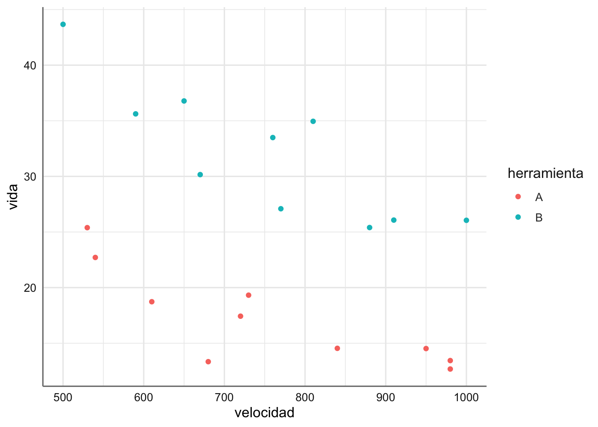

A la vista de la Figura anterior se puede apreciar que el comportamiento del tiempo de vida con respecto a la velocidad disminuye al aumentar esta última, y además ese descenso es distinto en función de la herramienta utilizada. A la misma velocidad la herramienta A proporciona un tiempo de vida inferior que la herramienta B. Para ambas máquinas se aprecia una tendencia lineal bastante clara que deberá ser objeto de estudio. Esto implicaría que nuestro modelo se desdoblaría en dos rectas de regresión lineal simple en función de la herramienta utilizada.

**Ejemplo 2. Datos de longevidad.**  Partridge y Farquhar realizan un experimento para relacionar la vida útil (`longevidad`) de las moscas de la fruta con su actividad sexual (`actividad`). La información recogida es la longevidad en días de 125 moscas macho, divididas en cinco grupos bajo diferentes condiciones ambientales para medir su actividad sexual. Asimismo, se recoge la longitud del tórax (`thorax`) ya que se sospecha que afecta directamente a la longevidad de las moscas.

Cargamos los datos y realizamos el gráfico descriptivo:

```r
# Carga de datos
thorax <- c(0.68, 0.68, 0.72, 0.72, 0.76, 0.76, 
            0.76, 0.76, 0.76, 0.8, 0.8, 0.8, 0.84, 0.84, 
            0.84, 0.84, 0.84, 0.84, 0.88, 0.88, 0.92, 0.92, 
            0.92, 0.94, 0.64, 0.7, 0.72, 0.72, 0.72, 0.76, 
            0.78, 0.8, 0.84, 0.84, 0.84, 0.84, 0.84, 0.88, 
            0.88, 0.88, 0.88, 0.88, 0.92, 0.92, 0.92, 0.92, 
            0.92, 0.92, 0.94, 0.64, 0.68, 0.72, 0.76, 0.76, 
            0.8, 0.8, 0.8, 0.82, 0.82, 0.84, 0.84, 0.84, 0.84, 
            0.84, 0.84, 0.88, 0.88, 0.88, 0.88, 0.88, 0.88, 
            0.88, 0.92, 0.92, 0.68, 0.68, 0.72, 0.76, 0.78, 
            0.8, 0.8, 0.8, 0.84,  0.84, 0.84, 0.84, 0.84, 
            0.84, 0.88, 0.88, 0.88, 0.9, 0.9, 0.9, 0.9, 0.9, 
            0.9, 0.92, 0.92, 0.64, 0.64, 0.68, 0.72, 0.72, 
            0.74, 0.76, 0.76, 0.76, 0.78, 0.8, 0.8, 0.82, 
            0.82, 0.84, 0.84, 0.84, 0.84, 0.88, 0.88, 0.88, 
            0.88, 0.88, 0.88, 0.92)
longevidad <- c(37, 49,  46,  63,  39,  46,  56,  63,  65,  
                56,  65,  70,  63,  65, 70,  77,  81,  86,  
                70,  70,  77,  77,  81,  77,  40,  37,  44, 
                47,  47,  47,  68,  47,  54,  61,  71,  75,  
                89,  58,  59,  62, 79,  96,  58,  62,  70,  
                72,  75,  96,  75,  46,  42,  65,  46, 58,  
                42,  48,  58,  50,  80,  63,  65,  70,  70,  
                72,  97,  46, 56,  70,  70,  72,  76,  90,  
                76,  92,  21,  40,  44,  54,  36, 40,  56,  
                60,  48,  53,  60,  60,  65,  68,  60,  81,  
                81,  48, 48,  56,  68,  75,  81,  48,  68,  
                16,  19,  19,  32,  33,  33, 30,  42,  42,  
                33,  26,  30,  40,  54,  34,  34,  47,  47, 
                42, 47,  54,  54,  56,  60,  44)
actividad <- c(rep("G1",24),rep("G2",25),rep("G3",25),rep("G4",25),rep("G5",25))
longevidad <- data.frame(thorax,longevidad,actividad)
# Gráfico
ggplot(longevidad, aes(x = thorax, y = longevidad, color = actividad)) + 
  geom_point() 
```

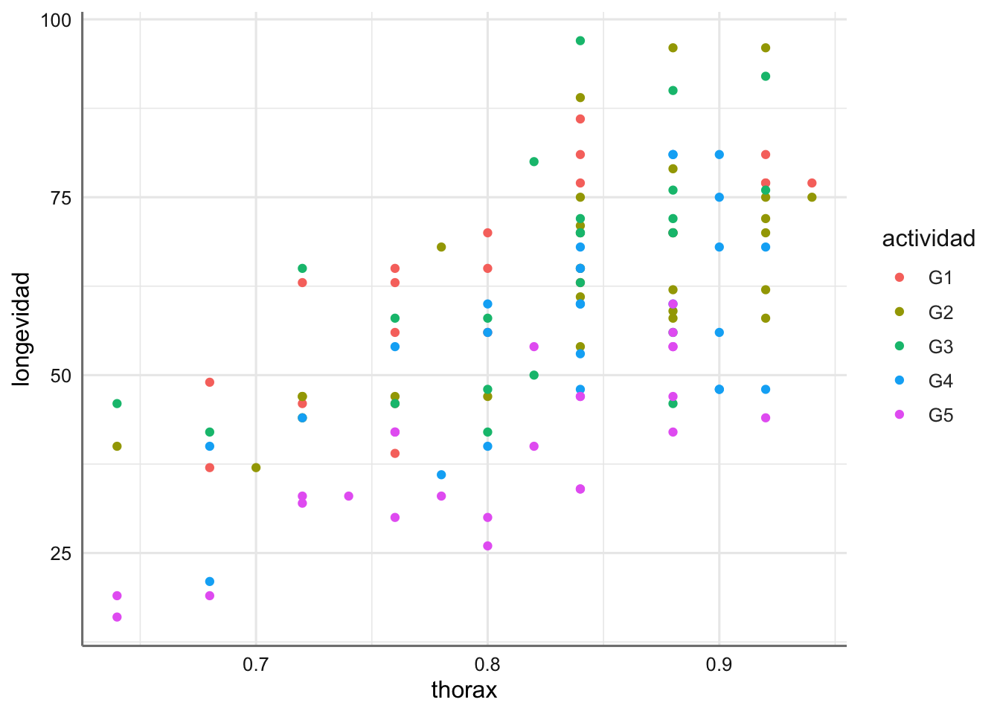

Se puede ver como la longevidad aumenta cuando aumenta la longitud del thorax pero ese crecimiento no parece distinto según actividad, dado que las nubes de puntos están bastante mezcladas. En este caso no parece adecuado un modelo lineal para cada grupo de actividad. 

## Modelo ANCOVA básico

Consideramos el modelo ANCOVA más sencillo donde consideramos dos variables predictoras: una numérica y otra un factor. Consideramos una muestra de tamaño $n$ donde tenemos:

* Una variable respuesta, $Y$, de tipo numérico con observaciones $y_1,...,y_n$.
* Una variable predictora, $X$, de tipo numérico con observaciones $x_1,...,x_n$.
* Una variable predictora, $F$, de tipo categórico con $I$ grupos o niveles distintos de tamaños muestrales $n_1,n_2,...,n_I$, de forma que $n = n_1 + n_2 + ... + n_I$, de forma que el vector de observaciones de la respuesta y de la predictora numérica se pueden escribir como:

$$(Y_1, Y_2,...,Y_I) = y_{11},\ldots,y_{1n_1},y_{21},\ldots,y_{2n_2},\ldots,
y_{I1},\ldots,y_{In_I}$$


$$
(X_1, X_2,...,X_I) = x_{11},\ldots,x_{1n_1},x_{21},\ldots,x_{2n_2},\ldots,x_{I1},\ldots,x_{In_I}
$$

donde el primer subíndice indica el nivel del factor y el segundo la posición dentro del conjunto de datos de dicho nivel del factor.
* Conjunto $\mu_i$ de medias de todas las observaciones de la respuesta asociadas con el nivel $i$ del factor, es decir:

$$
\mu_i = \frac{\sum_{j = 1}^{n_j} y_{ij}}{n_i}; \text{ i = 1, 2,..., I}
$$

* Media global de la respuesta, $\mu$, que se puede obtener como:

$$
\mu = \frac{\sum_{j = 1}^{I} \mu_{j}}{I}
$$

* Incrementos, $\alpha_i$, de cada una de las medias de cada grupo con respecto a la media global, es decir:

$$
\alpha_i= \mu - \mu_i; \text{ i = 1, 2,..., I}
$$

* Pendiente común, $\beta$, que representa la posible relación entre las variables de tipo numérico.

* Pendientes diferentes entre las predictoras numéricas asociadas a cada nivel del factor, $\gamma_i$ con $i = 1,...,I$. 

En esta situación el modelo que describe la posible relación entre respuesta y predictoras se puede escribir como:
\begin{equation}
y_{ij} = \alpha_0 + \alpha_i + \beta x_{ij} + \gamma_i x_{ij} + \epsilon_{ij};\quad  i=1,...,I \quad \text{con} \quad \alpha_I = 0
(\#eq:ancova)
\end{equation}

que en forma matricial se puede escribir fácilmente (de forma análoga al ANOVA de un vía) sin más que considerar $1_(n_i )={1,...,1}$ un vector de $n_i$ unos, $0_(n_i )={0,...,0}$ un vector de $n_i$ ceros, para cada uno de los niveles i del factor la matriz de diseño viene dada por:
$$
Y = \left( 
\begin{array}{c}
   Y_1 \\
   Y_2 \\
   \ldots \\
   Y_I \\
\end{array}
\right)
=
\left( 
\begin{array}{ccccccccc}
   1_{n_1} & 1_{n_1} & 0_{n_1} & \ldots & 0_{n_1} & X_1 & X_1 & \ldots & 0_{n_1}\\
   1_{n_2} & 0_{n_2} & 1_{n_2} & \ldots & 0_{n_2} & X_2 & 0_{n_2} & \ldots & 0_{n_2}\\
   \ldots & \ldots & \ldots & \ldots & \ldots & \ldots & \ldots & \ldots & 0_{n_3}\\
   1_{n_I} & 0_{n_I} & 0_{n_I} &\ldots & 1_{n_I} & X_I & 0_{n_I} & \ldots & X_I\\
\end{array}
\right)
\left( 
\begin{array}{c}
   \alpha_0 \\
   \alpha_1 \\
  \alpha_2 \\
 \ldots \\
   \alpha_{I_1} \\
   \beta \\
   \gamma_1\\
   \ldots\\
   \gamma_I\\
\end{array}
\right)
+
\left( 
\begin{array}{c}
   e_1 \\
   e_2 \\
   \ldots \\
   e_n \\
\end{array}
\right) = X\beta + \epsilon
$$

donde las primeras $I$ columnas representan el efecto del factor (ANOVA de una vía), la siguiente columna representa el efecto común entre predictoras numéricas (Regresión lineal simple), y las últimas $I$ columnas representan el efecto distinto de la predictora numérica para cada nivel del factor. Estas columnas se obtienen fácilmente multiplicando la columna de $X$ por cada de las columnas desde la $2$ a la $I$.

Las posibles modelos anidados que se pueden obtener a partir de la ecuación \@ref(eq:ancova), así como sus interpretaciones se presentan a continuación. Además, se ofrece la interpretación de dichos modelos en términos de los coeficientes que resulten significativos. 

### I rectas de regresión perpendiculares 

Este modelo es el más general y considera una pendiente distinta para la predictora numérica en función de los niveles del factor, que resulta equivalente a plantear el contraste

\begin{equation}
\left\{ 
\begin{array}{ll}
H_0: & \gamma_1 = \gamma_2 = \ldots = \gamma_I = 0\\
H_a: & \mbox{Al menos hay una pendiente distinto de cero}\\
\end{array}
\right.
(\#eq:contraste1)
\end{equation}
 
Si rechazamos el contraste \@ref(eq:contraste1) tendremos un modelo de regresión entre la respuesta y la predictora numérica para cada nivel del factor, es decir, I rectas de regresión distintas con ecuaciones:

\begin{equation}
\begin{array}{ll}
y_{1j} &= (\alpha_0 + \alpha_1) + (\beta + \gamma_1) x_{1j} + \epsilon_{1j}\\
y_{2j} &= (\alpha_0 + \alpha_2) + (\beta + \gamma_2) x_{2j} + \epsilon_{2j}\\
\ldots &= \ldots \\
y_{Ij} &= (\alpha_0 + \alpha_I) + (\beta + \gamma_I) x_{Ij} + \epsilon_{Ij}\\
\end{array}
(\#eq:modeloancovaconinteraccion)
\end{equation}

con interceptaciones $\alpha_0 + \alpha_i$ y pendientes $\beta + \gamma_i$ para cada uno de los $I$ niveles del factor. Tenemos I modelos de regresión distintos (uno por cada nivel del factor), es decir, tenemos I rectas perpendiculares o que se cortan.

**Ejemplo.** Para el banco de datos de tiempo de vida podemos representar gráficamente el modelo asumiendo dos rectas de regresión perpendiculares de vida versus velocidad del torno en función de la herramienta utilizada. 

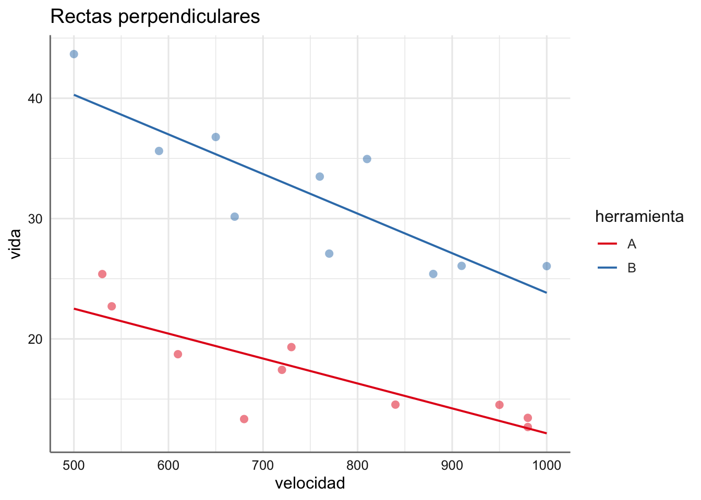

Se puede ver como las rectas tienen interceptaciones distintas y pendientes algo diferentes. Las tendencias no son perpendiculares en el sentido estricto sino que existe algún punto de corte entre ellas. La resolución del contraste nos indicara si el modelo es adecuado o si deberíamos optar por un modelo más sencillo.


**Ejemplo.** Para el banco de datos de longevidad representamos gráficamente el modelo que asume  5 rectas de regresión perpendiculares de longevidad versus longitud del thorax en función del grupo de actividad. 

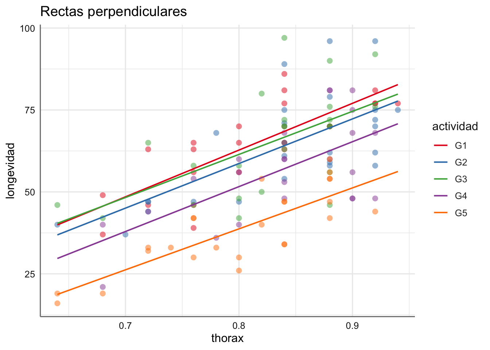

Se puede ver como las rectas tienen interceptaciones distintas y pendientes muy similares lo que puede ser un indicativo de que este modelo de rectas perpendiculares no es adecuado.

### I rectas de regresión paralelas 

Si no rechazamos el contraste \@ref(eq:contraste1) tendremos un único modelo de regresión entre la respuesta y la predictora pero con diferentes interceptaciones (la pendiente es la misma), es decir, I rectas paralelas cuyas ecuaciones vienen dadas por:

\begin{equation}
\begin{array}{ll}
y_{1j} &= (\alpha_0 + \alpha_1) + \beta  x_{1j} + \epsilon_{1j}\\
y_{2j} &= (\alpha_0 + \alpha_2) + \beta  x_{2j} + \epsilon_{2j}\\
\ldots &= \ldots \\
y_{Ij} &= (\alpha_0 + \alpha_I) + \beta  x_{Ij} + \epsilon_{Ij}\\
\end{array}
(\#eq:modeloancovasininteraccion)
\end{equation}

**Ejemplo.** Modelo de rectas paralelas para el banco de datos de tiempo de vida. E

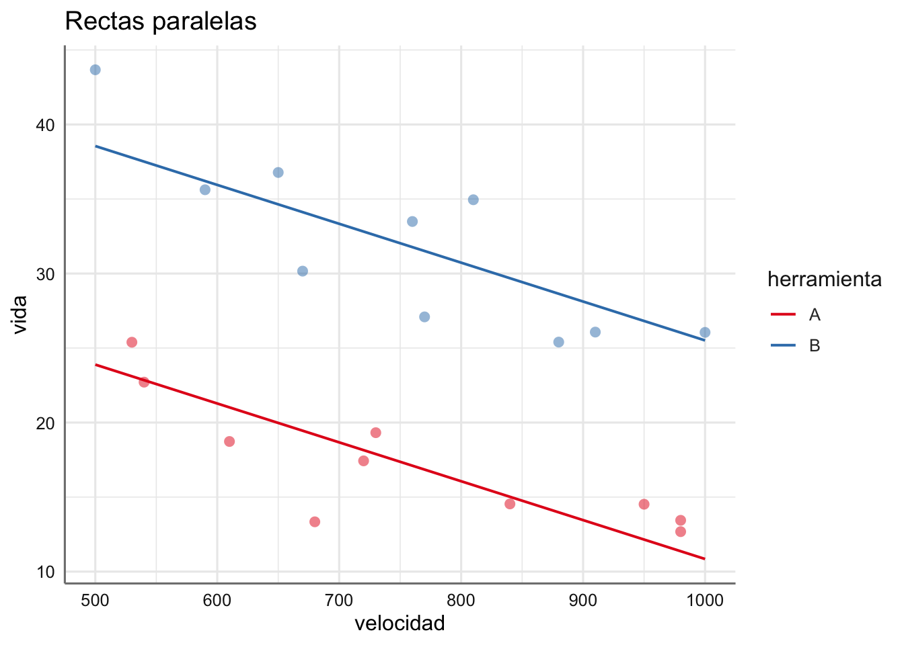

¿Se diferencia mucho este gráfico del de rectas perpendiculares visto antes? 

**Ejemplo.** Modelos de rectas paralelas para el banco de datos de longevidad.

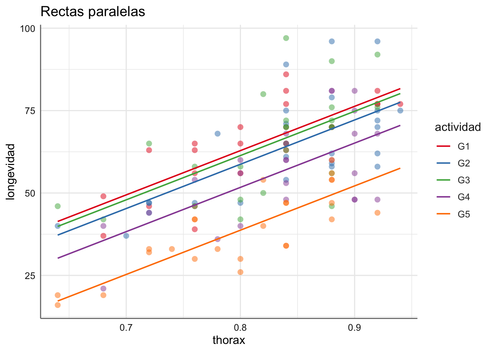

En este caso el gráfico es prácticamente idéntico indicando que para estos datos el modelo de rectas paralelas tiene la misma capacidad explicativa que el de rectas perpendiculares.


En la situación donde el contraste \@ref(eq:contraste1) es no significativo podemos definir diferentes modelos anidados en función de los incrementos del factor (\alpha`s) y  la pendiente $\beta$. Los contrastes son:

\begin{equation}
\left\{ 
\begin{array}{ll}
H_0: & \alpha_1 = \alpha_2 = \ldots = \alpha_I = 0\\
H_a: & \mbox{Al menos hay un incremento distinto de cero}\\
\end{array}
\right.
(\#eq:contraste2)
\end{equation}
y
\begin{equation}
\left\{ 
\begin{array}{ll}
H_0: & \beta = 0\\
H_a: & \beta \neq 0
\end{array}
\right.
(\#eq:contraste3)
\end{equation}

La resolución de estos contrastes nos lleva a nuevos modelos que pasamos a describir.

### Una recta de regresión 

Si no rechazamos la hipótesis nula de \@ref(eq:contraste2) pero si rechazamos la hipótesis nula de \@ref(eq:contraste3) diríamos que no hay efecto del factor pero si que podemos establecer un modelo de regresión entre la respuesta y la predictora numérica (Modelo de Regresión Lineal Simple).

**Ejemplo.** Modelo de recta de regresión para el banco de datos de tiempo de vida. 

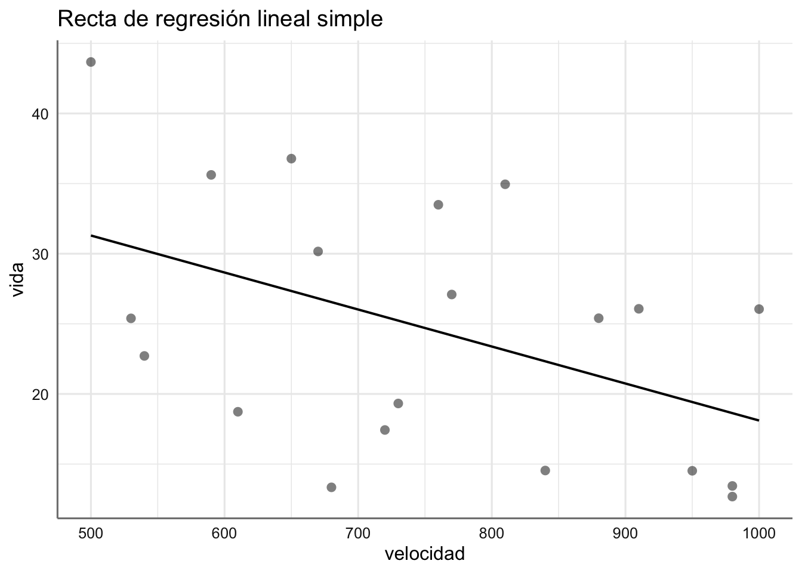

¿Qué podemos decir de este modelo frente a los anteriores?

**Ejemplo.** Modelo de recta de regresión para el banco de datos de longevidad.

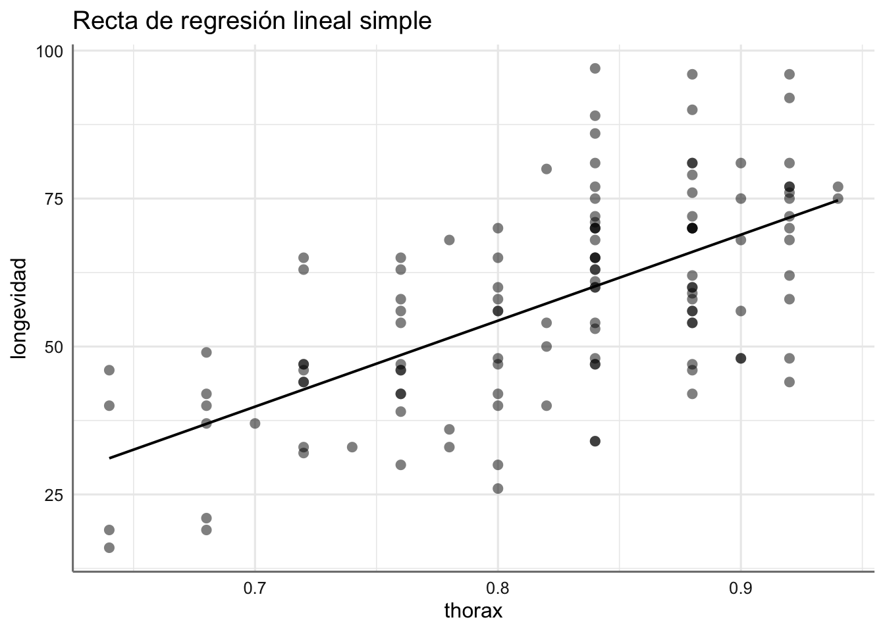

¿Podríamos considerar este modelo como válido frente a los considerados antes? Recuerda que siempre buscamos modelos con capacidades explicativas similares pero con menos efectos o variables.


### ANOVA de una vía 

Si rechazamos la hipótesis nula de \@ref(eq:contraste2) pero no rechazamos la hipótesis nula de \@ref(eq:contraste3) diríamos que no hay efecto de la predictora numérica pero que si podemos establecer diferencias entre las medias de la respuesta dadas por los diferentes niveles del factor. Nos encontramos ante un modelo ANOVA de una vía. En esta situación asumimos que no existe rectas de regresión que relacionen el comportamiento de la respuesta con la predictora numérica, es decir, ya no tendremos una nube de puntos sino datos agrupados por el factor. 

**Ejemplo.** Modelo ANOVA de una vía para el banco de datos de tiempo de vida. 

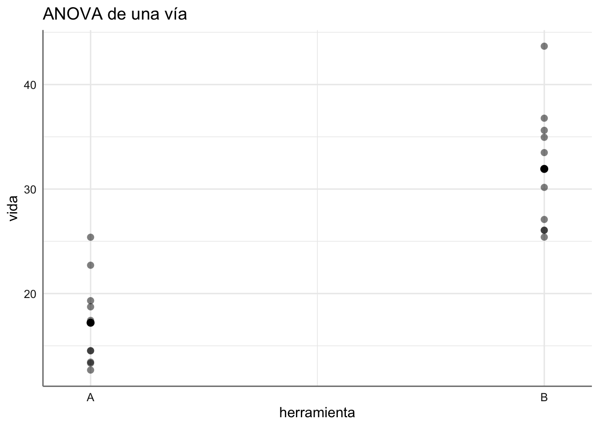

Se observa claramente como la herramienta de tipo B produce un tiempo de vida superior al del tipo A. Al menos el efecto del factor parece relevante para explicar el comportamiento del tiempo de vida.

**Ejemplo.** Modelo ANOVA de una vía para el banco de datos de longevidad.

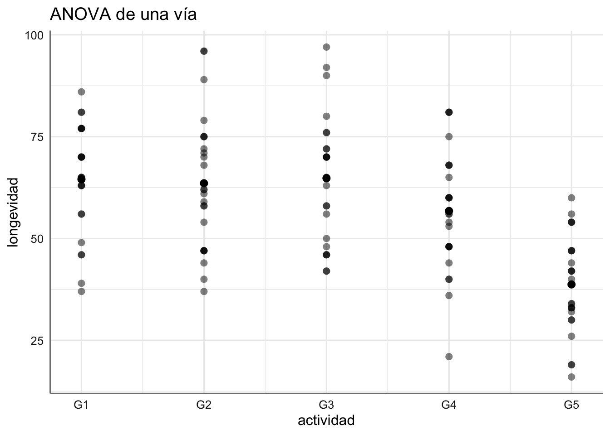

El gráfico de cajas asociado con el factor muestra que los primeros cuatro grupos tienen un comportamiento muy similar, y tan sólo el grupo cinco parecer tener una longevidad inferior al resto.

### Modelos sin efectos 

Si no rechazamos la hipótesis nula de \@ref(eq:contraste2) y no rechazamos la hipótesis nula de \@ref(eq:contraste3) estaríamos ante un modelo nulo donde el comportamiento de la respuesta no viene explicado por las predictoras consideradas.
 
### Especificación del modelo en `R` 

El modelo ANCOVA planteado para un factor $F$ y una variable predictora numérica $X$, se puede escribir en R en su formato reducido como:

$$Y \sim F + X + F:X$$

donde:

* $F$ representa el efecto del factor, es decir, comparamos si las medias de la respuesta para cada grupo pueden considerarse iguales.
* $X$ representa el efecto de regresión asociado con la variable numérica, es decir, la respuesta y X están relacionadas mediante una única pendiente que deberemos estimar.
* $F:X$ representa el efecto de interacción entre predictoras, es decir, que la respuesta se relaciona con la predictora numérica mediante tantas curvas (generalmente líneas) como niveles tenga el factor $F$.

A continuación, se presentan los modelos reducidos para diferentes situaciones experimentales en el número y tipo de variables predictoras:

* Modelo para dos factores ($F_1$ y $F_2$) y una numérica ($X$)

$$Y \sim F_1 + F_2 + F_1:F_2 + X + F_1:X + F_2:X + F_1:F_2:X$$
o en forma más simplificada $Y \sim F_1*F_2*X$

* Modelo para un factor ($F$) y dos numéricas ($X_1$ y $X_2$)

$$Y \sim F + X_1 + X_2 + F:X_1 + F:X_2$$
o en forma más simplificada $Y \sim F*(X_1 + X_2)$

* Modelo para dos factores ($F_1$ y $F_2$) y dos numéricas ($X_1$ y $X_2$)

$$Y \sim F_1*F_2*(X_1 + X_2)$$

Como se puede ver la complejidad del modelo aumenta sustancialmente con la consideración de más variables predictoras. La forma de expresar el modelo saturado debe contemplar tanto los efectos principales asociados a cada predictora, como los efectos de interacción entre factores y entre factores y numéricas.

## Análisis preliminar

En este tipo de modelos el análisis preliminar pasa por una representación de los diferentes modelos que pueden surgir desde el modelo saturado. En este caso se muestra como especificar los diferentes modelos y como obtener los gráficos correspondientes.

**Ejemplo.** (Tiempo de vida). El objetivo del análisis es describir la relación entre el tiempo de vida de la pieza y la velocidad del torno, teniendo en cuenta de qué tipo es la pieza. Tenemos entonces los posibles modelos que involucran a la velocidad: 

$$
\left\{ 
\begin{array}{ll}
\mbox{M0}:& Vida \sim velocidad\\
\mbox{M1}:& Vida \sim velocidad + herramienta\\
\mbox{M2}:& Vida \sim velocidad + herramienta + velocidad:herramienta\\
\end{array}
\right.
$$

A continuación se presenta el código para poder representar todos estos modleos en un único gráfico.


```r
# Comenzamos con el modelo más sencillo

# Modelo con una única recta
M0 <- lm(vida ~ velocidad, data = tiempovida)

# M1: modelo con rectas paralelas
M1 <- lm(vida ~ herramienta + velocidad, data = tiempovida)

# M2: modelo con rectas no paralelas
M2 <- lm(vida ~ herramienta + velocidad + herramienta:velocidad, data = tiempovida)

# grid de valores para construir los modelos
grid <- tiempovida %>% data_grid(herramienta, velocidad) %>% 
   gather_predictions(M0, M1, M2)

# Gráfico
ggplot(tiempovida,aes(velocidad, vida, colour = herramienta)) + 
  geom_point() + 
  geom_line(data = grid, aes(y = pred)) +
  facet_wrap(~ model) +
  labs(x = "Velocidad del torno", y = "Tiempo de vida") 
```

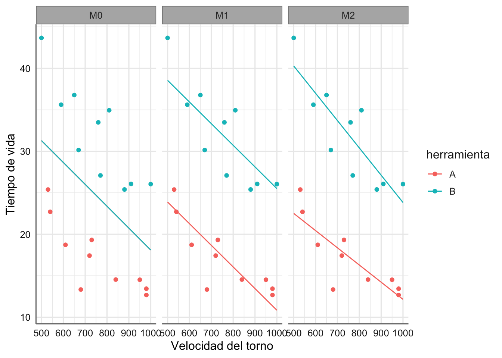

También representamos el modelo donde únicamente tenemos el factor (diagrama de cajas):

$$
\begin{array}{ll}
\mbox{M}:& Vida \sim herramienta\\
\end{array}
$$


```r
ggplot(tiempovida, aes(x = herramienta, y = vida)) + 
   geom_boxplot() 
```

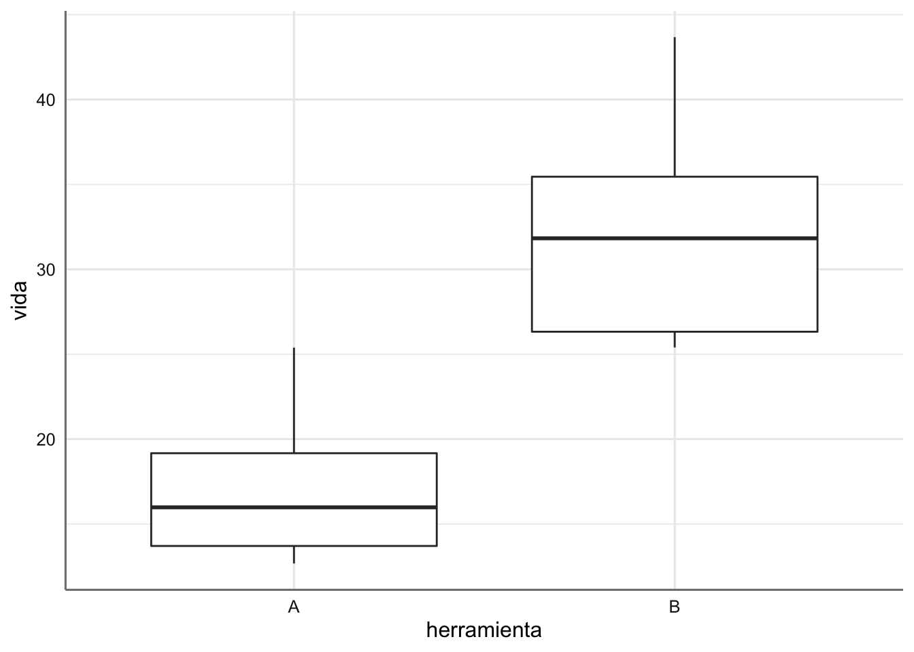


**Ejemplo.** Planterasmos los diferentes modelos para los datos de longevidad y los representamos gráficamente.

$$
\left\{ 
\begin{array}{ll}
\mbox{M0}:& longevidad \sim thorax\\
\mbox{M1}:& longevidad \sim thorax + actividad\\
\mbox{M2}:& longevidad \sim thorax + herramienta + thorax:actividad\\
\end{array}
\right.
$$


```r
# Comenzamos con el modelo más sencillo

# Modelo con una única recta
M0 <- lm(longevidad ~ thorax, data = longevidad)

# M1: modelo con rectas paralelas
M1 <- lm(longevidad ~ actividad + thorax, data = longevidad)

# M2: modelo con rectas no paralelas
M2 <- lm(longevidad ~ actividad + thorax + actividad:thorax, data = longevidad)

# grid de valores para construir los modelos
grid <- longevidad %>% data_grid(actividad, thorax) %>% 
   gather_predictions(M0, M1, M2)

# Gráfico
ggplot(longevidad,aes(thorax, longevidad, colour = actividad)) + 
  geom_point() + 
  geom_line(data = grid, aes(y = pred)) +
  facet_wrap(~ model) +
  labs(x = "Longitud del tórax", y = "Longevidad") 
```

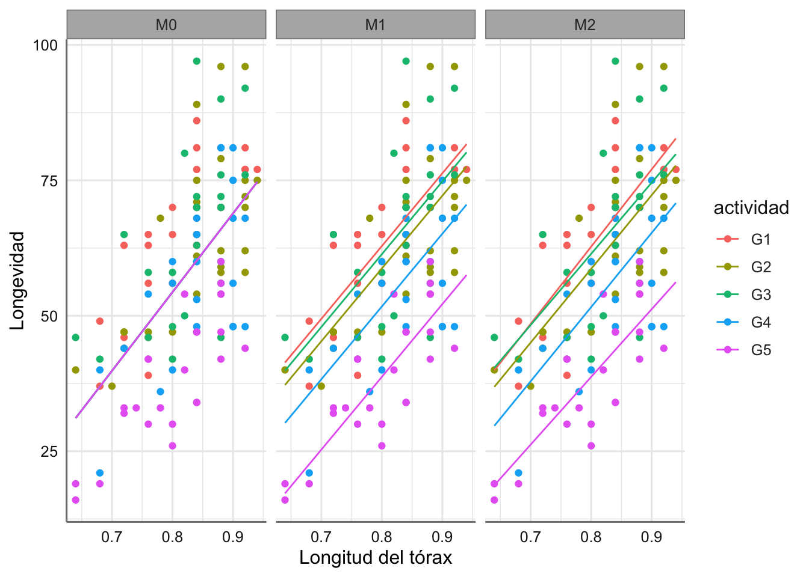

También representamos el modelo donde únicamente tenemos el factor (diagrama de cajas):

$$
\begin{array}{ll}
\mbox{M}:& longevidad \sim actividad\\
\end{array}
$$


```r
ggplot(longevidad, aes(x = actividad, y = longevidad)) + 
   geom_boxplot() 
```

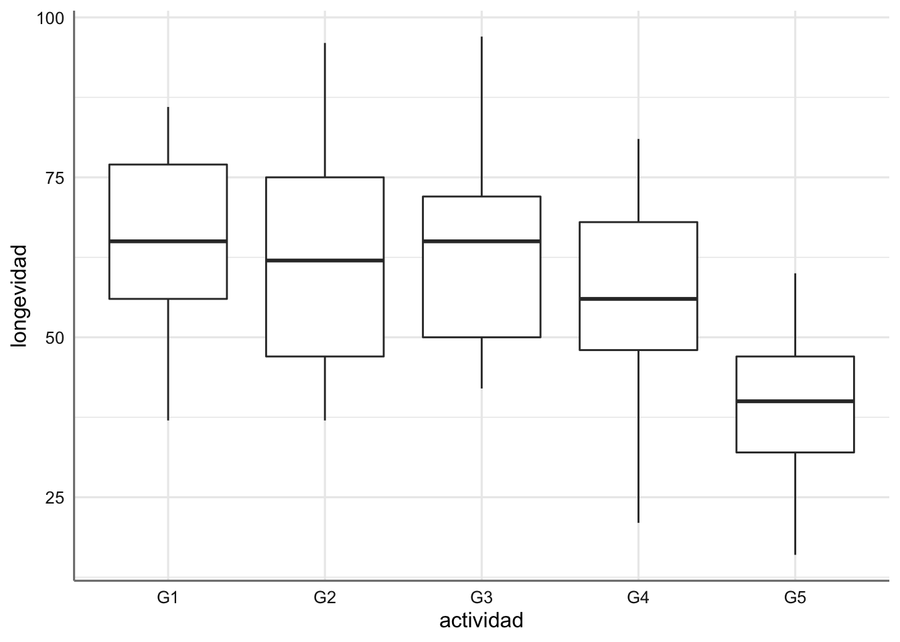

## Ajuste y Selección del modelo

Las hipótesis del modelo ANCOVA son que los errores se distribuyen de forma independiente mediante una distribución Normal de media cero y varianza constante σ^2 para cada uno de los grupos que determina la variable predictora de tipo factor. Estas hipótesis se adaptarán en función del tipo de modelo que finalmente alcancemos en el proceso de selección (I rectas, una recta, o un ANOVA de una vía). 

Dado que hemos expresado el modelo ANCOVA como un modelo de tipo lineal con una ecuación similar a los modelos de regresión múltiple, la estimación de los parámetros del modelo se puede realizar utilizando las ecuaciones normales. En el proceso de selección del mejor modelo actuaremos como en los modelos ANOVA, es decir partiremos del modelo saturado y veremos que efectos puede ser considerados como irrelevantes, y por tanto deben desaparecer del modelo. Esta selección nos permitirá elegir el modelo final resultante. En este caso más sencillo podemos escribir todos los modelos posibles y elegir el mejor de ellos, bien mediante la comparación con el test F o con el AIC, pero en la práctica se recurre a los procedimientos secuenciales automáticos que son los que presentaremos aquí. 

**Ejemplo.** Realizamos la selección del mejor modleo apra el conjunto de datos de tiempo de vida. Para ello construimos el modelo saturado y utilizamos el procedimiento automático basado en el test F parcial.


```r
# Modelo saturado
fit.vida <- lm(vida ~ velocidad * herramienta, data = tiempovida)
# Selección del modelo
ols_step_backward_p(fit.vida, prem = 0.05)
```

```
## 
## 
##                                  Elimination Summary                                  
## -------------------------------------------------------------------------------------
##         Variable                               Adj.                                      
## Step           Removed           R-Square    R-Square     C(p)       AIC        RMSE     
## -------------------------------------------------------------------------------------
##    1    velocidad:herramienta      0.8969      0.8847    3.9652    106.6591    3.0919    
## -------------------------------------------------------------------------------------
```

El proceso de selección identifica el efecto de interacción entre `velocidad` y `herramienta` como no significativo, de forma que el modelo final viene dado por:
$$vida \sim velocidad + herramienta$$
Ajustamos el modelo con rectas paralelas, es decir, la pendiente de la recta entre el tiempo de vida y la velocidad stiene la misma pendiente, variando únicamenyte la interceptación en función del tipo de herramienta utilizada. Tenemos por tanto un modelo con dos rectas paralelas (una por cada tipo de herramienta).


```r
# Modelo saturado
fit.vida <- lm(vida ~ velocidad + herramienta, data = tiempovida)
# Parámetros estimados
tab_model(fit.vida,
          show.r2 = FALSE, 
          show.p = FALSE)
```

<table style="border-collapse:collapse; border:none;">
<tr>
<th style="border-top: double; text-align:center; font-style:normal; font-weight:bold; padding:0.2cm;  text-align:left; ">&nbsp;</th>
<th colspan="2" style="border-top: double; text-align:center; font-style:normal; font-weight:bold; padding:0.2cm; ">vida</th>
</tr>
<tr>
<td style=" text-align:center; border-bottom:1px solid; font-style:italic; font-weight:normal;  text-align:left; ">Predictors</td>
<td style=" text-align:center; border-bottom:1px solid; font-style:italic; font-weight:normal;  ">Estimates</td>
<td style=" text-align:center; border-bottom:1px solid; font-style:italic; font-weight:normal;  ">CI</td>
</tr>
<tr>
<td style=" padding:0.2cm; text-align:left; vertical-align:top; text-align:left; ">(Intercept)</td>
<td style=" padding:0.2cm; text-align:left; vertical-align:top; text-align:center;  ">36.93</td>
<td style=" padding:0.2cm; text-align:left; vertical-align:top; text-align:center;  ">29.56&nbsp;&ndash;&nbsp;44.30</td>
</tr>
<tr>
<td style=" padding:0.2cm; text-align:left; vertical-align:top; text-align:left; ">velocidad</td>
<td style=" padding:0.2cm; text-align:left; vertical-align:top; text-align:center;  ">&#45;0.03</td>
<td style=" padding:0.2cm; text-align:left; vertical-align:top; text-align:center;  ">&#45;0.04&nbsp;&ndash;&nbsp;-0.02</td>
</tr>
<tr>
<td style=" padding:0.2cm; text-align:left; vertical-align:top; text-align:left; ">herramienta [B]</td>
<td style=" padding:0.2cm; text-align:left; vertical-align:top; text-align:center;  ">14.67</td>
<td style=" padding:0.2cm; text-align:left; vertical-align:top; text-align:center;  ">11.75&nbsp;&ndash;&nbsp;17.58</td>
</tr>
<tr>
<td style=" padding:0.2cm; text-align:left; vertical-align:top; text-align:left; padding-top:0.1cm; padding-bottom:0.1cm; border-top:1px solid;">Observations</td>
<td style=" padding:0.2cm; text-align:left; vertical-align:top; padding-top:0.1cm; padding-bottom:0.1cm; text-align:left; border-top:1px solid;" colspan="2">20</td>
</tr>

</table>

Las ecuaciones de estimación para este modelo vienen dadas por:

$$
\left\{ 
\begin{array}{lll}
\mbox{Herramienta A}:& \widehat{Vida_{A}} = 36.93 + 0  - 0.03*velocidad &= 36.93 -0.03*velocidad\\
\mbox{Herramienta B}:& \widehat{Vida_{B}} = 36.93 + 14.67 - 0.03*velocidad &= 51.60 - 0.03*velocidad \\
\end{array}
\right.
$$

Tenemos una interceptación mayor para la herramienta B indicando que la recta asociada con dicha herramienta está por encima de la de la herramienta A, lo que en térinos prácticos nos indica que el tiempo de vida con la herramienta B siempre será superior al del tipo A para cualquier velocidad considerada. Además, la pendiente negativa asociada con la velocidad indica que conforme aumenta esta disminuye el tiempo de vida. 

**Ejemplo.** Analizamos ahora los datos de longevidad. Construimos el modelo saturado y seleccionamos mediante el test $F$.


```r
# Modelos
fit.longevidad <- lm(longevidad ~ thorax * actividad, data = longevidad)
# Selección del modelo
ols_step_backward_p(fit.longevidad, prem = 0.05)
```

```
## 
## 
##                                Elimination Summary                                 
## ----------------------------------------------------------------------------------
##         Variable                          Adj.                                        
## Step        Removed         R-Square    R-Square     C(p)        AIC        RMSE      
## ----------------------------------------------------------------------------------
##    1    thorax:actividad      0.6527       0.638    -3.7881    943.8165    10.5394    
## ----------------------------------------------------------------------------------
```

El proceso de selección identifica el efecto de interacción entre `thorax` y `actividad` como no significativo, de forma que el modelo final viene dado por:
$$longevidad \sim thorax + actividad$$
Ajustamos el modelo y estudiamos los parámetros obtenidos:


```r
# Modelos
fit.longevidad <- lm(longevidad ~ thorax + actividad, data = longevidad)
# Parámetros estimados
tab_model(fit.longevidad,
          show.r2 = FALSE, 
          show.p = FALSE)
```

<table style="border-collapse:collapse; border:none;">
<tr>
<th style="border-top: double; text-align:center; font-style:normal; font-weight:bold; padding:0.2cm;  text-align:left; ">&nbsp;</th>
<th colspan="2" style="border-top: double; text-align:center; font-style:normal; font-weight:bold; padding:0.2cm; ">longevidad</th>
</tr>
<tr>
<td style=" text-align:center; border-bottom:1px solid; font-style:italic; font-weight:normal;  text-align:left; ">Predictors</td>
<td style=" text-align:center; border-bottom:1px solid; font-style:italic; font-weight:normal;  ">Estimates</td>
<td style=" text-align:center; border-bottom:1px solid; font-style:italic; font-weight:normal;  ">CI</td>
</tr>
<tr>
<td style=" padding:0.2cm; text-align:left; vertical-align:top; text-align:left; ">(Intercept)</td>
<td style=" padding:0.2cm; text-align:left; vertical-align:top; text-align:center;  ">&#45;44.61</td>
<td style=" padding:0.2cm; text-align:left; vertical-align:top; text-align:center;  ">&#45;65.53&nbsp;&ndash;&nbsp;-23.69</td>
</tr>
<tr>
<td style=" padding:0.2cm; text-align:left; vertical-align:top; text-align:left; ">thorax</td>
<td style=" padding:0.2cm; text-align:left; vertical-align:top; text-align:center;  ">134.34</td>
<td style=" padding:0.2cm; text-align:left; vertical-align:top; text-align:center;  ">109.13&nbsp;&ndash;&nbsp;159.55</td>
</tr>
<tr>
<td style=" padding:0.2cm; text-align:left; vertical-align:top; text-align:left; ">actividad [G2]</td>
<td style=" padding:0.2cm; text-align:left; vertical-align:top; text-align:center;  ">&#45;4.14</td>
<td style=" padding:0.2cm; text-align:left; vertical-align:top; text-align:center;  ">&#45;10.13&nbsp;&ndash;&nbsp;1.86</td>
</tr>
<tr>
<td style=" padding:0.2cm; text-align:left; vertical-align:top; text-align:left; ">actividad [G3]</td>
<td style=" padding:0.2cm; text-align:left; vertical-align:top; text-align:center;  ">&#45;1.50</td>
<td style=" padding:0.2cm; text-align:left; vertical-align:top; text-align:center;  ">&#45;7.48&nbsp;&ndash;&nbsp;4.47</td>
</tr>
<tr>
<td style=" padding:0.2cm; text-align:left; vertical-align:top; text-align:left; ">actividad [G4]</td>
<td style=" padding:0.2cm; text-align:left; vertical-align:top; text-align:center;  ">&#45;11.15</td>
<td style=" padding:0.2cm; text-align:left; vertical-align:top; text-align:center;  ">&#45;17.15&nbsp;&ndash;&nbsp;-5.16</td>
</tr>
<tr>
<td style=" padding:0.2cm; text-align:left; vertical-align:top; text-align:left; ">actividad [G5]</td>
<td style=" padding:0.2cm; text-align:left; vertical-align:top; text-align:center;  ">&#45;24.14</td>
<td style=" padding:0.2cm; text-align:left; vertical-align:top; text-align:center;  ">&#45;30.12&nbsp;&ndash;&nbsp;-18.17</td>
</tr>
<tr>
<td style=" padding:0.2cm; text-align:left; vertical-align:top; text-align:left; padding-top:0.1cm; padding-bottom:0.1cm; border-top:1px solid;">Observations</td>
<td style=" padding:0.2cm; text-align:left; vertical-align:top; padding-top:0.1cm; padding-bottom:0.1cm; text-align:left; border-top:1px solid;" colspan="2">124</td>
</tr>

</table>

Todas las rectas tienen la misma pendiente (coeficiente asociado a tórax) pero con distinto punto de origen debido al tratamiento al que son sometidos los sujetos. La pendiente positiva indica que la longevidad aumenta cuando lo hace la longitud del tórax, mientras que podemos ver que el grupo G1 es el de mayor longevidad por tener la interceptación más grande. Las ecuaciones para cada uno de los grupos viene dada por:

$$
\left\{ 
\begin{array}{ll}
\mbox{G1}:& \widehat{logevidad_{G1}} = - 44.61 + 134.34*thorax\\
\mbox{G2}:& \widehat{logevidad_{G2}} = - 48.75 + 134.34*thorax \\
\mbox{G3}:& \widehat{logevidad_{G3}} = - 46.11 + 134.34*thorax \\
\mbox{G4}:& \widehat{logevidad_{G4}} = - 55.76 + 134.34*thorax \\
\mbox{G5}:& \widehat{logevidad_{G5}} = - 68.75 + 134.34*thorax \\
\end{array}
\right.
$$

El grupo con mayor longevidad es el G1, ya que tiene la interceptación más grande, mientras que el que tiene menor longevidad es G5. El orden vendría dado por $G1 > G3 > G2 > G4 > G5$.

## Diagnóstico del modelo

En este caso el diagnóstico es similar al de los modelos de regresión pero teniendo en cuenta que las hipótesis se deben verificar para los residuos asociados a cada nivel del factor (si este está presente en el modelo). Las hipótesis son linealidad, normalidad y varianza constante. Para verificar la hipótesis de linealidad utilizamos el gráfico de residuos vs ajustados y residuos vs predictora numérica, mientras que usamos los tests de normalidad y homogeneidad para el resto de hipótesis. Utilizamos los mismos ejemplos de los puntos anteriores para mostrar como realizar el diagnóstico en este tipo de modelos.

**Ejemplo** A continuación, se presenta el diagnóstico para el modelo de tiempos de vida. Para realizar el diagnóstico partimos del modelo obtenido en la sección anterior. 


```r
# Valores de diagnóstico
diagnostico <- fortify(fit.vida)
# Gráfico
ggplot(diagnostico,aes(x = velocidad, y = .stdresid, colour = herramienta)) + 
   geom_point() +
   geom_hline(yintercept = 0, col = "red") +
   facet_wrap(. ~ herramienta)
```

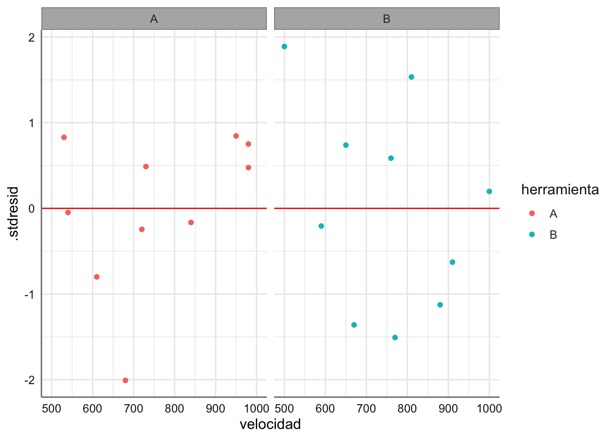

En la figura no se observan problemas con los residuos, aunque sí se puede ver que para el tipo A la variabilidad de los residuos aumenta cuando aumenta el valor ajustado, indicando posibles problemas con la homogeneidad de varianzas. Además, no se observa ningún tipo de tendencia que pueda indicar falta de linealidad. Procedemos con los tests de hipótesis.


```r
# Tests de hipótesis
ols_test_normality(fit.vida)
```

```
## -----------------------------------------------
##        Test             Statistic       pvalue  
## -----------------------------------------------
## Shapiro-Wilk              0.9715         0.7858 
## Kolmogorov-Smirnov        0.1232         0.8859 
## Cramer-von Mises          1.4412          2e-04 
## Anderson-Darling          0.2652         0.6555 
## -----------------------------------------------
```

```r
leveneTest(.stdresid ~ herramienta, data = diagnostico)
```

```
## Levene's Test for Homogeneity of Variance (center = median)
##       Df F value Pr(>F)
## group  1  1.3888  0.254
##       18
```

Puesto que ambos tests resultan no significativo se verifican las hipótesis del modelo, por lo que estamos en condiciones de afirmar que el modelo resultante es adecuado para explicar el comportamiento del tiempo de vida en función del tipo de pieza y de la velocidad considerada.


```r
# Análisis de influencia
ols_plot_cooksd_chart(fit.vida)
```

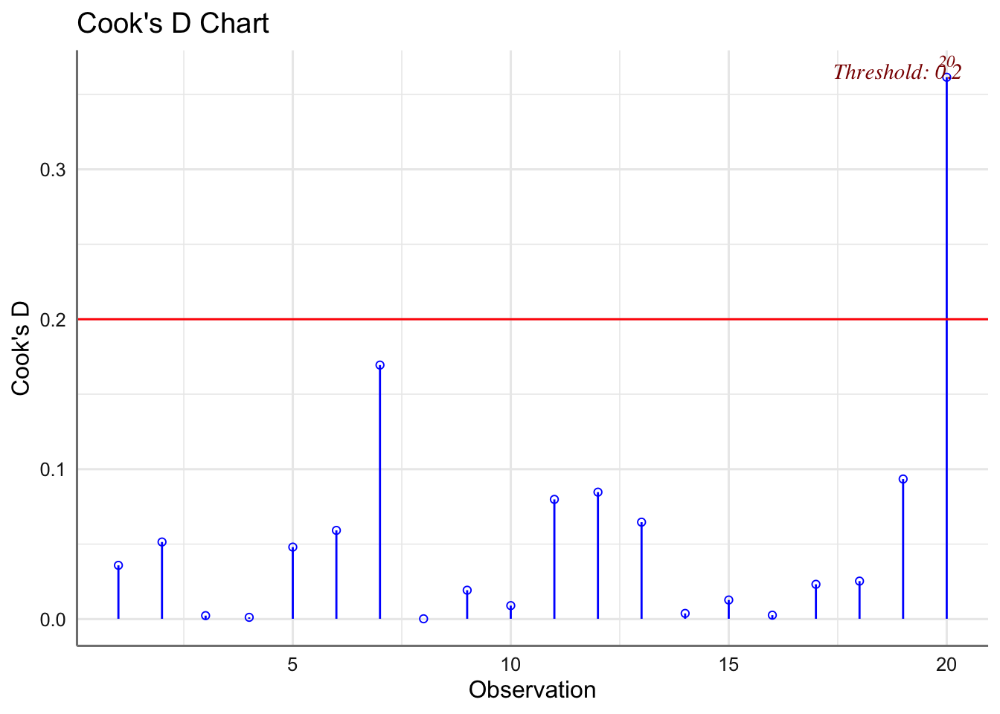

La distancia de Cook no muestra ninguna observación influyente (valor mayor que 1). Dado que se verifican las hipótesis el modelo obtenido parece adecuado para estudiar el tiempo de vida en función de la velocidad y la herramienta utilizada.

**Ejemplo.** Analizamos ahora el modelo correspondiente a los datos de longevidad. En primer lugar, realizamos el análisis gráfico de los residuos. En este caso no hay interacción presente en el modelo y todos los gráficos deben identificar cada uno de los niveles de actividad.


```r
# Valores de diagnóstico
diagnostico <- fortify(fit.longevidad)
# Gráfico
ggplot(diagnostico,aes(x = thorax, y = .stdresid, colour = actividad)) + 
   geom_point() +
   geom_hline(yintercept = 0, col = "red")+
   facet_wrap(. ~ actividad)
```

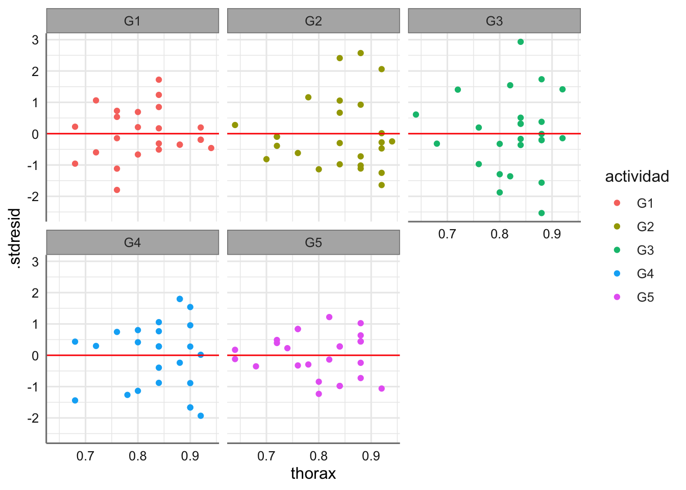

En la figura se puede observar que para algún nivel del factor los residuos aumentan o disminuyen en función del valor ajustado, por ejemplo para el grupo G3 (mayor variabilidad en el centro que en los extremos) indicando posibles problemas con la homogeneidad de varianzas. Pasamos a valorar las hipótesis del modelo.


```r
# Tests de hipótesis
ols_test_normality(fit.longevidad)
```

```
## -----------------------------------------------
##        Test             Statistic       pvalue  
## -----------------------------------------------
## Shapiro-Wilk              0.9916         0.6607 
## Kolmogorov-Smirnov        0.0538         0.8654 
## Cramer-von Mises         10.2413         0.0000 
## Anderson-Darling          0.3224         0.5241 
## -----------------------------------------------
```

```r
leveneTest(.stdresid ~ actividad, data = diagnostico)
```

```
## Levene's Test for Homogeneity of Variance (center = median)
##        Df F value Pr(>F)
## group   4  1.2925 0.2769
##       119
```

```r
# Análisis de influencia
ols_plot_cooksd_chart(fit.longevidad)
```

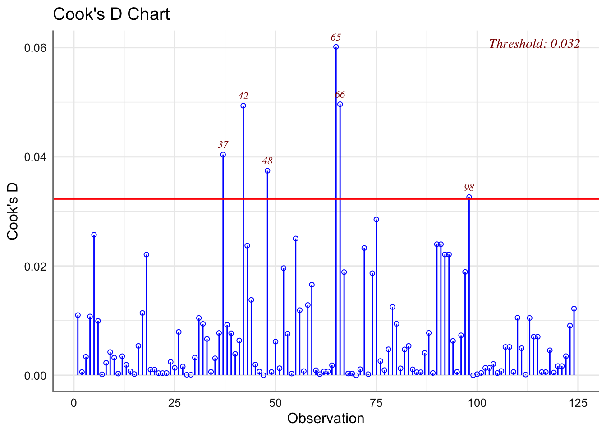

Aunque se verifican las hipótesis del modelo y no se detectan observaciones influyentes, si que es cierto que los gráficos de residuos muestran cierto comportamiento de embudo con variabilidades más pequeñas en valores más pequeños de thorax, y mayor dispersión al aumentar la longitud del thorax. Sería recomendable probar Box-Cox para tratar de obtener una transformación de la respuesta que nos permita obtener gráficos sin esos efectos indeseables.


```r
MASS::boxcox(fit.longevidad)
```

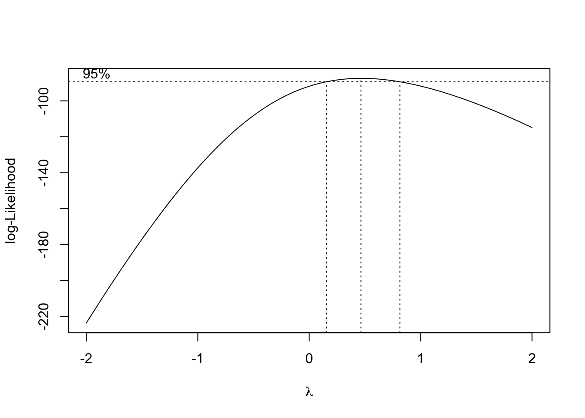

La transformación raíz cuadrada parece adecuada en esta situación. Obtenemos la nueva variable y ajustamos de nuevo el modelo.


```r
# Transformación
longevidad <- longevidad %>% mutate(rlongevidad = sqrt(longevidad)) 
# Modelo saturado
fit.longevidad <- lm(rlongevidad ~ thorax * actividad, data = longevidad)
# Selección del modelo
ols_step_backward_p(fit.longevidad, prem = 0.05)
```

```
## 
## 
##                                Elimination Summary                                
## ---------------------------------------------------------------------------------
##         Variable                          Adj.                                       
## Step        Removed         R-Square    R-Square     C(p)        AIC        RMSE     
## ---------------------------------------------------------------------------------
##    1    thorax:actividad      0.6868      0.6736    -3.0694    267.2943    0.6888    
## ---------------------------------------------------------------------------------
```

De nuevo el modelo seleccionado prescinde del efecto de interacción. Ajustamos y estudiamos el nuevo modelo.


```r
# Modelos
fit.longevidad <- lm(rlongevidad ~ thorax + actividad, data = longevidad)
# Parámetros estimados
tab_model(fit.longevidad,
          show.r2 = FALSE, 
          show.p = FALSE)
```

<table style="border-collapse:collapse; border:none;">
<tr>
<th style="border-top: double; text-align:center; font-style:normal; font-weight:bold; padding:0.2cm;  text-align:left; ">&nbsp;</th>
<th colspan="2" style="border-top: double; text-align:center; font-style:normal; font-weight:bold; padding:0.2cm; ">rlongevidad</th>
</tr>
<tr>
<td style=" text-align:center; border-bottom:1px solid; font-style:italic; font-weight:normal;  text-align:left; ">Predictors</td>
<td style=" text-align:center; border-bottom:1px solid; font-style:italic; font-weight:normal;  ">Estimates</td>
<td style=" text-align:center; border-bottom:1px solid; font-style:italic; font-weight:normal;  ">CI</td>
</tr>
<tr>
<td style=" padding:0.2cm; text-align:left; vertical-align:top; text-align:left; ">(Intercept)</td>
<td style=" padding:0.2cm; text-align:left; vertical-align:top; text-align:center;  ">0.34</td>
<td style=" padding:0.2cm; text-align:left; vertical-align:top; text-align:center;  ">&#45;1.03&nbsp;&ndash;&nbsp;1.71</td>
</tr>
<tr>
<td style=" padding:0.2cm; text-align:left; vertical-align:top; text-align:left; ">thorax</td>
<td style=" padding:0.2cm; text-align:left; vertical-align:top; text-align:center;  ">9.41</td>
<td style=" padding:0.2cm; text-align:left; vertical-align:top; text-align:center;  ">7.77&nbsp;&ndash;&nbsp;11.06</td>
</tr>
<tr>
<td style=" padding:0.2cm; text-align:left; vertical-align:top; text-align:left; ">actividad [G2]</td>
<td style=" padding:0.2cm; text-align:left; vertical-align:top; text-align:center;  ">&#45;0.30</td>
<td style=" padding:0.2cm; text-align:left; vertical-align:top; text-align:center;  ">&#45;0.69&nbsp;&ndash;&nbsp;0.09</td>
</tr>
<tr>
<td style=" padding:0.2cm; text-align:left; vertical-align:top; text-align:left; ">actividad [G3]</td>
<td style=" padding:0.2cm; text-align:left; vertical-align:top; text-align:center;  ">&#45;0.12</td>
<td style=" padding:0.2cm; text-align:left; vertical-align:top; text-align:center;  ">&#45;0.51&nbsp;&ndash;&nbsp;0.27</td>
</tr>
<tr>
<td style=" padding:0.2cm; text-align:left; vertical-align:top; text-align:left; ">actividad [G4]</td>
<td style=" padding:0.2cm; text-align:left; vertical-align:top; text-align:center;  ">&#45;0.76</td>
<td style=" padding:0.2cm; text-align:left; vertical-align:top; text-align:center;  ">&#45;1.15&nbsp;&ndash;&nbsp;-0.37</td>
</tr>
<tr>
<td style=" padding:0.2cm; text-align:left; vertical-align:top; text-align:left; ">actividad [G5]</td>
<td style=" padding:0.2cm; text-align:left; vertical-align:top; text-align:center;  ">&#45;1.73</td>
<td style=" padding:0.2cm; text-align:left; vertical-align:top; text-align:center;  ">&#45;2.12&nbsp;&ndash;&nbsp;-1.34</td>
</tr>
<tr>
<td style=" padding:0.2cm; text-align:left; vertical-align:top; text-align:left; padding-top:0.1cm; padding-bottom:0.1cm; border-top:1px solid;">Observations</td>
<td style=" padding:0.2cm; text-align:left; vertical-align:top; padding-top:0.1cm; padding-bottom:0.1cm; text-align:left; border-top:1px solid;" colspan="2">124</td>
</tr>

</table>

¿Cuáles son las ecuaciones de estimación en este caso?

El proceso de diagnóstico para el nuevo modelo permite verificar el cumplimiento de las hipótesis y la leve mejora de los gráficos de residuos. 


```r
# Valores de diagnóstico
diagnostico <- fortify(fit.longevidad)
# Gráfico
ggplot(diagnostico,aes(x = thorax, y = .stdresid, colour = actividad)) + 
   geom_point() +
   geom_hline(yintercept = 0, col = "red")+
   facet_wrap(. ~ actividad)
```

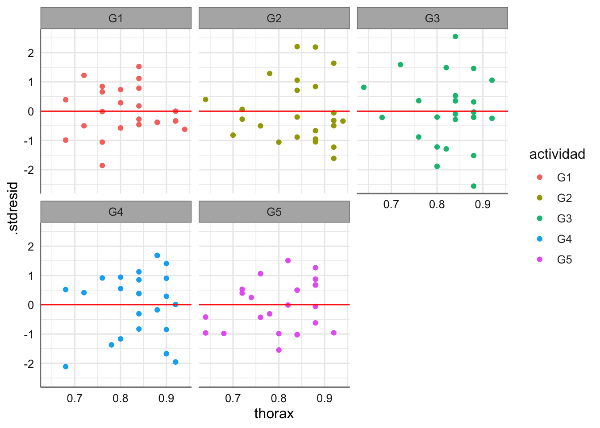

```r
# Tests de hipótesis
ols_test_normality(fit.longevidad)
```

```
## -----------------------------------------------
##        Test             Statistic       pvalue  
## -----------------------------------------------
## Shapiro-Wilk              0.9951         0.9465 
## Kolmogorov-Smirnov        0.0474         0.9432 
## Cramer-von Mises         10.7431         0.0000 
## Anderson-Darling          0.2137         0.8484 
## -----------------------------------------------
```

```r
leveneTest(.stdresid ~ actividad, data = diagnostico)
```

```
## Levene's Test for Homogeneity of Variance (center = median)
##        Df F value Pr(>F)
## group   4  0.6856 0.6033
##       119
```

```r
# Análisis de influencia
ols_plot_cooksd_chart(fit.longevidad)
```

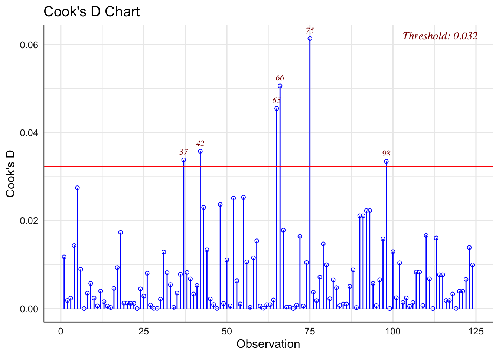

## Predicción

El proceso de predicción en este tipo de modelos es muy simple a partir de las ecuaciones de los modelos obtenidos. De hecho, en las secciones anteriores ya hemos visto gráficamente la predicción para todos estos modelos en los ejemplos que hemos ido trabajando. Básicamente, si queremos obtener una predicción especifica deberemos dar un valor del factor y otro de la predictora numérica para calcular el valor de predicción y su correspondiente intervalo. En este caso nos imitamos a representar las bandas de predicción que podemos obtener para cada modelo.

**Ejemplo.** A continuación, se presentan las rectas de predicción para el modelo ajustado en el banco de datos de tiempo de vida. 


```r
plot_model(fit.vida, "pred", terms = c("velocidad", "herramienta"),
           title ="Predicción de la media del tiempo de vida")
```

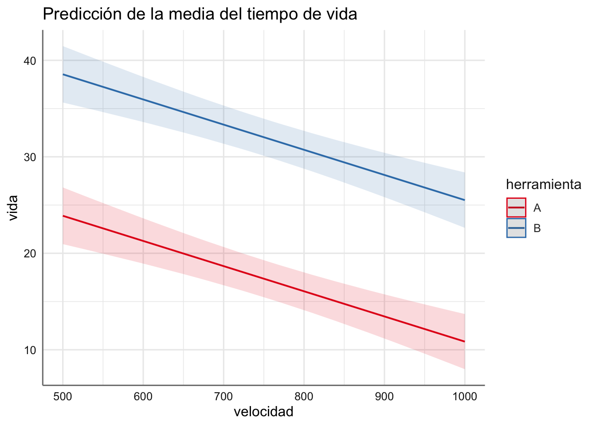

En la figura se presentan los resultados obtenidos donde queda patente el comportamiento distinto para tipo de herramienta, mostrando que la de tipo B tiene un tiempo de vida superior, pero que se va reduciendo cuando aumentamos la velocidad.

**Ejemplo.** A continuación, se presentan las rectas de predicción para el modelo ajustado en el banco de datos de longevidad. En la figura se presentan los resultados obtenidos donde queda patente el comportamiento paralelo para cada tipo de actividad, mostrando que el grupo G1 es el que muestra una mayor longevidad que aumenta además con la longitud del tórax. Además, podemos ver como el único grupo que muestra un comportamiento distinto es el del grupo G5, mientras que los otros grupos muestran predicciones muy similares.


```r
plot_model(fit.longevidad, "pred", terms = c("thorax", "actividad"),
           title ="Predicción de la raíz cuadrada de la media de longevidad")
```

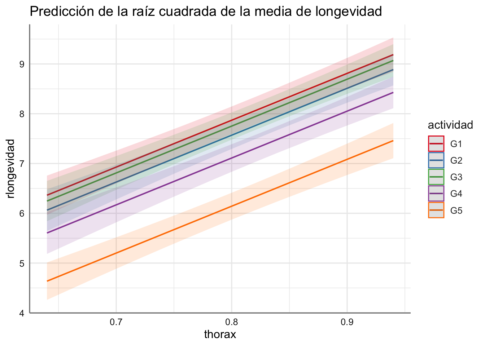

Obtenemos ahora el gráfico de predicción en la escala original. Deshacemos el cambio de raíz cuadrada y representamos de nuevo las bandas de confianza.


```r
# Creamos grid de predicción
newdata <- data.frame(thorax = rep(seq(min(longevidad$thorax), 
                                       max(longevidad$thorax), 
                                       .01),
                                   each=5), 
actividad = factor(c("G1", "G2", "G3", "G4", "G5")))
# Obtenemos la predicción para el modelo ajusatdo
newdata <- data.frame(newdata, 
             predict(fit.longevidad, newdata, interval="confidence"))
# Eliminamos la raíz cuadrada de las predicciones 
newdata$fit <- newdata$fit^2
newdata$lwr <- newdata$lwr^2
newdata$upr <- newdata$upr^2
# Gráfico de la predicción
ggplot(newdata, aes(x = thorax, y = fit, color = actividad)) +
  geom_line() +
  geom_ribbon(aes(ymax = upr, ymin = lwr, fill = actividad), alpha = 1/5) +
  labs(x = "Longitud del thorax", y = "Longevidad", title = "Bandas de predicción")
```

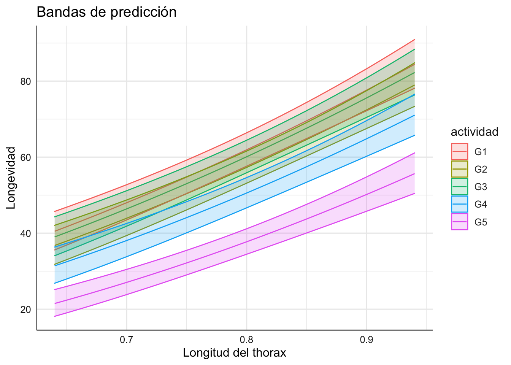

En la figura siguiente se presentan los resultados obtenidos donde se aprecia cierta curvatura en las bandas de predicción debida al cambio en la escala de la raíz cuadrada a la escala original de la variable. 

## Ejercicios modelos ANCOVA

A continuación se presenta la colección de ejercicios de esta unidad.

**Ejercicio 1.** Disponemos de los datos de peso de 24 niños recién nacidos (`peso`), su sexo (`sexo`; “H” = Hombres y “M” = Mujeres) y la edad de sus madres (`edad`). Nos gustaría ser capaces de determinar un modelo que explique el peso de los niños recién nacidos en función de su sexo y de la edad de sus madres.


```r
# Lectura de datos
edad <- c(40, 38, 40, 35, 36, 37, 41, 40, 37, 38, 40, 38,
          40, 36, 40, 38, 42, 39, 40, 37, 36, 38, 39, 40)
peso <- c(2968, 2795, 3163, 2925, 2625, 2847, 3292, 3473, 
          2628, 3176, 3421, 2975, 3317, 2729, 2935, 2754, 
          3210, 2817, 3126, 2539, 2412, 2991, 2875, 3231)
sexo <- gl(2,12, labels=c("H", "M"))
ejer01 <- data.frame(edad, peso, sexo)
```

**Ejercicio 2.** Se lleva a cabo una investigación sobre diversas malformaciones del sistema nervioso central registradas en nacidos vivos en Gales del Sur, Reino Unido. El estudio fue diseñado para determinar el efecto de la dureza del agua sobre la incidencia de tales malformaciones. La información registrada son: `NoCNS` = recuento de nacimientos sin problema CNS; `An` = conteo de nacimientos de Anencephalus; `Sp` = conteo de nacimientos de espina bífida; `Otro` = recuento de otros nacimientos del SNC; `Agua` = endurecimiento del agua; `Trabajo` = un factor con niveles Manual no manual en función del tipo de trabajo realizado por los padres Se está interesado en predecir el número total de malformaciones en función de la calidad del agua y el trabajo realizado por los padres.


```r
# Lectura de datos
previo <- read_csv("https://goo.gl/bNOSxt", col_types = "cdddddc")
# Calculamos el número total de malformaciones
ejer02 <- previo %>% mutate(CNS = An + Sp + Other)
```

**Ejercicio 3.** Se ha realizado un estudio para establecer la calidad de los vinos de la variedad Pino Noir en función de un conjunto de características analizadas. Las características analizadas son `claridad`, `aroma`, `cuerpo`, `olor` y `matiz`. Para medir la `calidad` se organiza una cata ciega a un conjunto de expertos y se calcula la puntuación final de cada vino a partir de la información de todos ellos. Además se registra la región (`region`) de procedencia del vino por si puede influir en la calidad del vino.


```r
# Lectura de datos
ejer03 <- read_csv("https://goo.gl/OX9wgM", col_types = "ddddddc")
```

**Ejercicio 4.** Una empresa recibe cargamentos de material para procesar en sus almacenes. El objetivo básico del estudio es determinar el tiempo de procesado de los cargamentos recibidos como función del tamaño del cargamento y el tipo de almacén. 


```r
# Carga de datos 
ejer04 <- read.table("https://goo.gl/kuMNpD", header = TRUE)
ejer04 <- as_tibble(ejer04)
```

**Ejercicio 5.** Una empresa dedicada a la fabricación de aislantes térmicos y acústicos establece un experimento que mide la pérdida de calor (`Calor`) a través de cuatro tipos diferentes de cristal para ventanas (`Cristal`) utilizando cinco graduaciones diferentes de temperatura exterior (`TempExt`). Se prueban tres hojas de cristal en cada graduación de temperatura, y se registra la pérdida de calor para cada hoja.


```r
# Lectura de datos
ejer05 <- read_csv("https://goo.gl/V6hyVW", col_types = "ddc") 
ejer05 <- ejer05 %>%
  mutate_if(sapply(ejer05,is.character),as.factor) 
```

**Ejercicio 6.** El grupo de asesores LearnStatistics ha realizado un estudio para comprobar si las empresas destinan parte de los beneficios de sus ventas en la formación de sus empleados para mejorar su competitividad. Para ellos se recoge la información sobre ventas (`Ventas`) en miles de euros, capital invertido en formación (`Capital`) en miles de euros, y el nivel de productividad de la empresa establecido por un asesor externo (`Productividad`). 


```r
# Lectura de datos
ejer06 <- read_csv("https://bit.ly/2rCATaO", col_types = "dcd")
ejer06 <- ejer06 %>%  
  mutate_if(sapply(ejer06,is.character),as.factor) 
```


