# Modelos aditivos lineales {#smooth}

En esta unidad se presentan los **modelos aditivos lineales**. Esto modelos surgen cuando la relación entre la predictora y la respuesta (en el caso de variables numéricas) no se puede escribir de forma lineal, sino más bien a través de una función desconocida. En unidades anteriores utilizamos los modelos polinómicos para poder capturar comportamientos no lineales entre predictora y respuesta, pero en este caso utilizaremos funciones de suavizado que permiten capturar todo tipo de comportamiento entre ambas.

La mayor dificultad en este tipo de modelos es que no tenemos una forma explícita para la función de suavizado, y por tanto es necesario utilizar las funciones específicas de predicción proporcionadas por la librería de ajuste para obtener el modelo resultante.

En este tema sólo se pretende dar una versión introductoria de los modelos de suavizado por o que se recomienda la lectura de textos más avanzados para completar lo visto en esta unidad.

El modelo aditivo más básico con una variable predictora y una respuesta Normal viene dado por:

$$Y = f(X) + \epsilon$$ donde $f()$ se denomina función suave o de suavizado para la variable $X$.

Las ventajas de este tipo de modelos es que son muy flexibles ya que permiten modelizar, a través de dichas funciones suaves, relaciones de tipo no lineal entre la variable respuesta y las predictoras. Sin embargo, no todo son ventajas ya que el proceso de selección del mejor modelo se complica al añadir la elección de la función de suavizado a utilizar.

En situaciones con dos variables predictoras, $X_1$ y $X_2$, de tipo numérico se podrían plantear los modelos saturados siguientes:

$$
\begin{array}{ll}
M0: & Y \sim X_1 + X_2\\
M1: & Y \sim f(X_1) + X_2\\
M2: & Y \sim f(X_1) + f(X_2)\\
\end{array}
$$

También resulta posible plantear este tipo de modelos donde se incluyen variables predictoras de tipo factor. En este caso debemos plantear una ecuación de suavizado para cada uno de los grupos determinados por el factor al igual que ocurría con el efecto de interacción en los modelos ANCOVA.

Para modelizar este tipo de datos es necesario instalar y cargar la librería `mgcv`.

## Bancos de datos

Veamos los diferentes ejemplos con los que vamos a trabajar. Muchos de ellos ya los hemos utilizado en modelos anteriores.

**Ejemplo 1. Datos de calidad del aire.** Este diseño experimental contiene la información recogida sobre el estudio de calidad del aire que ya presentamos en la Unidad 2. El objetivo de este estudio era tratar de predecir la calidad del aire, medida en términos del nivel de ozono (`Ozone`), en función de la radiación solar (`Solar.R`), velocidad del viento (`Wind`), y temperatura (`Temp`). Además, se recogen las variables mes (`Month`) y día (`Day`) de la recogida de datos. En base a las variables experimentales recogidas cabría pensar que un modelo de regresión lineal múltiple de la forma

$$Ozone \sim Solar.R + Wind + Temp$$

A continuación, se presenta el código para la carga de datos y el gráfico de la respuesta versus cada predictora. En la figura se pueden ver los modelos lineales ajustados, y la aparente falta de ajuste de estos. Tan solo la relación entre Ozono y Wind parece de tipo lineal, mientras que en los otros dos parece necesario realizar algún tipo de transformación para linealizar la relación. Podemos intentar encontrar dicha transformación de respuesta o predictoras pero podemos ver que los métodos de suavizado nos proporcionan una solución rápida a esta situación sin necesidad de perder el tiempo buscando transformaciones adecuadas.


```r
# Carga de datos
data("airquality")
# Seleccionamos variables de interés
datos <- airquality[,c("Ozone", "Solar.R", "Wind", "Temp")]
datacomp = melt(datos, id.vars='Ozone')
# Representamos respuesta vs predictoras
ggplot(datacomp) +
  geom_jitter(aes(value,Ozone, colour=variable),) +
  facet_wrap(~variable, scales="free_x") +
  labs(x = "", y = "Ozono")
```

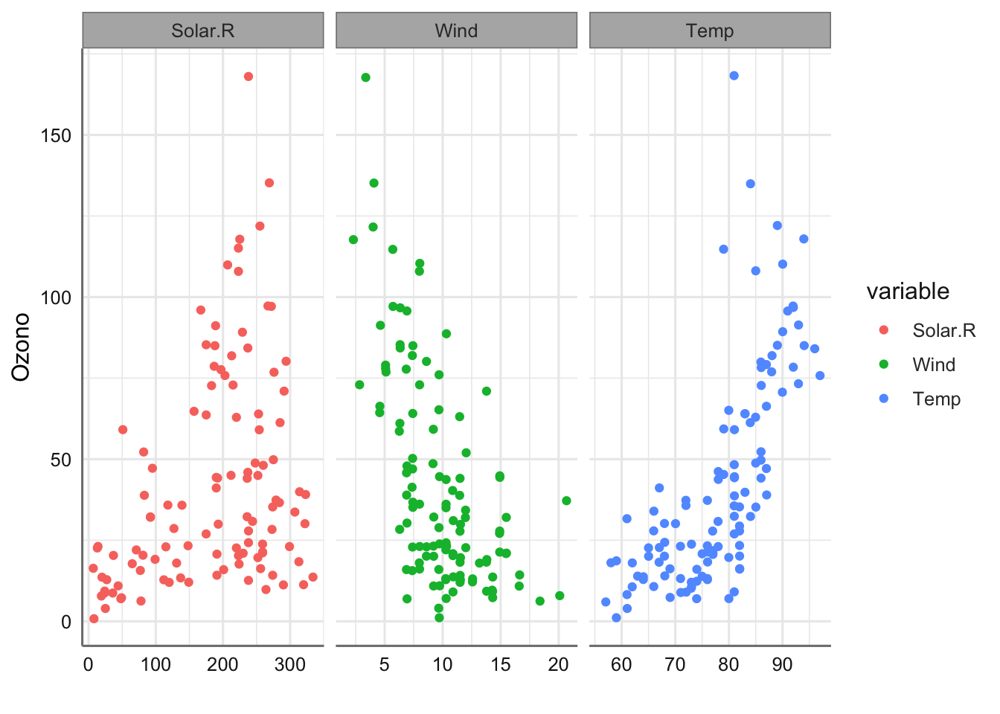

Como veremos más adelante la solución en términos de modelo de suavizado se puede apreciar en el gráfico siguiente:


```r
ggplot(datacomp) +
  geom_jitter(aes(value,Ozone, colour=variable),) + 
  geom_smooth(aes(value,Ozone, colour=variable), 
              method=loess, se=FALSE) +
  facet_wrap(~variable, scales="free_x") +
  labs(x = "", y = "Ozono") 
```

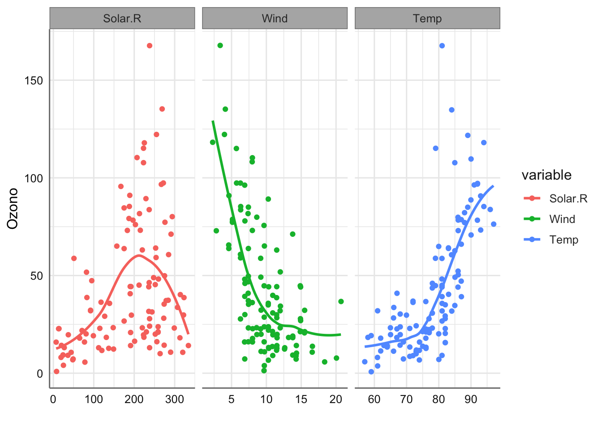

donde podemos ver el cambio en la asociación entre las diferentes predictoras y el nivel de ozono. Las tendencias de suavizado obtenidas reflejan el comportamiento a gran escala de la predictora versus cada respuesta. ¿Qué conclusiones podemos extraer de cada uno de los suavizados obtenidos?

**Ejemplo 2. Datos de producción.** Se realiza un ensayo agrícola para estudiar la producción de cierto tipo de planta en dos localidades en función de la densidad de plantas en la parcela de producción. Las variables recogidas en el experimento son la densidad de plantas (`Densidad`), la producción global obtenida (`Produccion`), y la localidad donde se encuentra la parcela de producción (`Localidad`). El banco de datos obtenido se presenta a continuación:


```r
Densidad <- c(23.48, 26.22, 27.79, 32.88, 33.27, 36.79, 
              37.58, 37.58, 41.49, 42.66, 44.23, 44.23, 
              51.67, 55.58, 55.58, 57.93, 58.71, 59.5, 
              60.67, 62.63, 67.71, 70.06, 70.45, 73.98, 
              73.98, 78.67, 95.9, 96.68, 96.68,101.38, 
              103.72, 104.51, 105.68, 108.03,117.82, 127.21, 
              134.26, 137.39, 151.87, 163.61, 166.35, 184.75, 
              18.78, 21.25, 23.23, 27.18, 30.15, 31.63, 32.12, 
              32.62, 32.62, 33.61, 37.07, 38.55, 39.54, 39.54, 
              41.02, 42.5, 43.98, 45.47, 49.92, 50.9, 53.87, 
              57.82, 61.78, 61.78, 63.75, 67.71, 71.66, 77.59, 
              80.56, 86.49, 88.46, 89.45, 90.93, 92.91, 101.81, 
              103.78, 115.15, 123.06, 144.31, 155.68, 158.15, 
              180.39)
Produccion <- c(5.41, 5.46, 5.4, 5.4, 5.29, 5.25, 5.35, 5.25, 
                5.05, 5.12, 5.29, 5.04, 5.03, 4.96, 4.84, 5.12, 
                4.97, 5.02, 4.87, 4.83, 4.74, 4.76, 4.79, 4.9, 
                4.74, 4.51, 4.62, 4.58, 4.62, 4.58, 4.47, 4.4, 
                4.34, 4.47, 4.44, 4.24, 4.17, 4.2, 4.14, 4.02, 
                4.14, 4, 5.61, 5.46, 5.2, 5.18, 4.95, 5.13, 
                4.93, 5.15, 4.72, 5.05, 4.92, 5.04, 4.82, 4.99, 
                4.66, 4.94, 5, 4.7, 4.51, 4.63, 4.68, 4.53, 4.57, 
                4.55, 4.6, 4.54, 4.5, 4.24, 4.3, 4.32, 4.29, 4.38, 
                4.37, 4.26, 4.11, 4.31, 3.9, 4.04, 3.87, 3.69, 3.66, 
                3.37) 
Localidad <- as.factor(c(rep("A", 42), rep("B", 42)))
plantas <- data.frame(Densidad, Produccion, Localidad)
```

A la vista de la información recogida se podría plantear un modelo ANCOVA, por lo que realizamos un gráfico de dispersión identificando cada punto según la localidad de procedencia.


```r
ggplot(plantas, aes(x = Densidad, y = Produccion, colour = Localidad)) +
  geom_point() +
  labs(x = "Densidad", y = "Producción")
```


Se puede ver como la producción en la localidad A queda por encima de la de la localidad B, con un descenso asociado con el aumento de la densidad de plantas. La única diferencia con los modelos ANCOVA clásicos es que el descenso no parece ajustarse a un modelo lineal, sino más bien a un modelo con una caída curvilínea. Aunque existe la posibilidad de plantear una transformación de la respuesta y/o predictora, o incluso un modelo polinómico, resulta difícil plantear un modelo tan rígido dado que ambas localidades parecen comportarse de forma distinta.

Vemos el resultado del modelo de suavizado (asumiendo que cada localidad puede tener un comportamiento distinto)

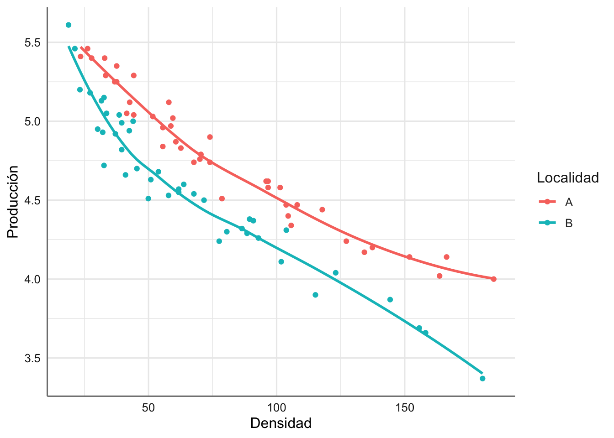

El gráfico muestra las tendencias ajustadas para cada localidad reflejando una curva distinta para cada localidad, lo que permite obtener un modelo muy flexible que se adapta al comportamiento global de la producción versus la densidad de plantas en función de la localidad de procedencia. Más tarde presentaremos todas las posibilidades de modelización para este conjunto de datos.

**Ejemplo 3. Datos de infiltración.** Se conoce como infiltración el proceso por el cual el agua (riego o lluvia) se va introduciendo bajo la superficie de un terreno cultivado. Este proceso es vital para determinar las cantidades de agua de riego necesarias, para mantener el terreno en condiciones óptimas. Un parámetro habitual que sirve para estudiar dicho proceso es la carga hidráulica. Este depende tanto de la profundidad de la infiltración (`profundidad`) como del procedimiento de riego usado. Se diseña un experimento para estudiar la carga hidráulica (`cargahid`) de un terreno bajo diferentes condiciones de riego (denominados `tratamiento`). Los datos recogidos en el experimento se presentan a continuación:


```r
tratamiento <- as.factor(c(rep("A", 15), rep("B", 15), rep("C", 15)))
profundidad <-c(10, 20, 30, 40, 50, 60, 70, 80, 90, 100, 110, 120, 130, 
                140, 150, 10, 20, 30, 40, 50, 60, 70, 80, 90, 100, 110, 
                120, 130, 140, 150, 10, 20, 30, 40, 50, 60, 70, 80, 90, 
                100, 110, 120, 130, 140, 150)
cargahid <- c(-406.90, -345.70, -335.50, -315.10, -304.90, -315.10, 
              -323.26, -335.50, -345.70, -362.02, -374.26, -386.50, 
              -421.18, -435.46, -447.70, -896.50, -737.38, -653.74, 
              -470.14, -406.90, -388.54, -396.70, -396.70, -396.70, 
              -406.90, -419.14, -437.50, -468.10, -466.06, -492.58, 
              -896.50, -855.70, -818.98, -788.38, -678.22, -590.50, 
              -545.62, -515.02, -498.70, -496.66, -517.06, -555.82, 
              -619.06, -623.14, -623.14)
infiltracion <- data.frame(tratamiento, profundidad, cargahid)
```

Representamos los datos mediante un gráfico de dispersión identificando cada uno de los tratamientos:


```r
ggplot(infiltracion, aes(x = profundidad, y = cargahid, colour = tratamiento)) +
  geom_point() +
  labs(x = "Profundidad", y = "Carga Hidráulica")
```

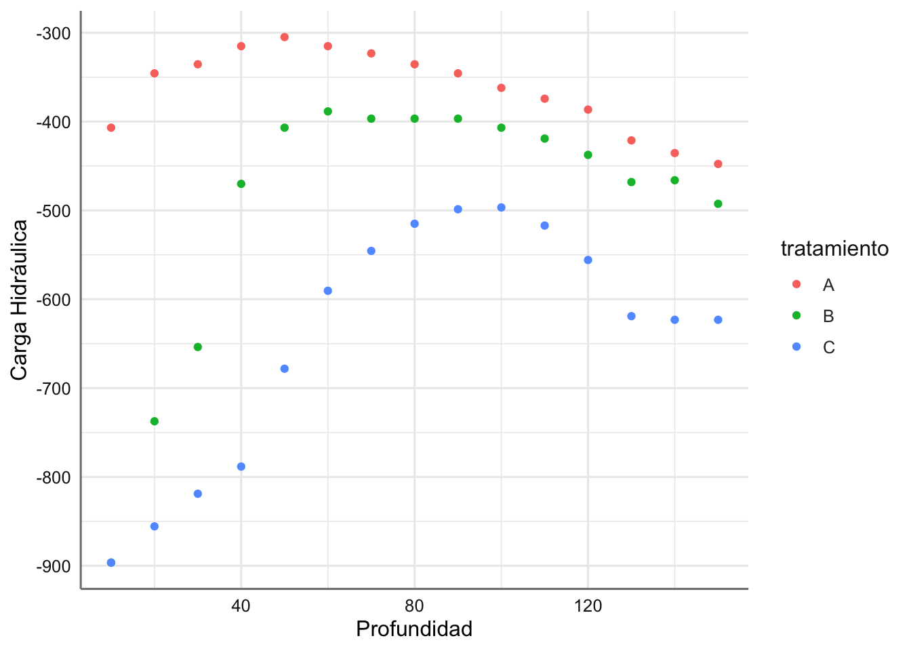

En este caso las tendencias observadas son bastante diferentes entre tratamientos y claramente no lineales. Un posible modelo de suavizado para este conjunto de datos vendría dado por:

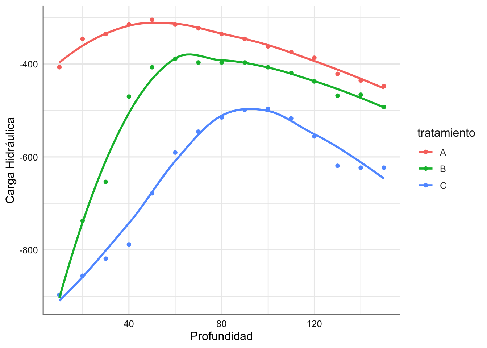

En este caso los ajustes de suavizado se asemejan a modelos polinómicos de grado 3 o 4, de forma que se podrían plantear ambas modelizaciones y compararlas para determinar el modelo que mejor ajusta la tendencia observada en los datos.

## Funciones de suavizado

Las funciones de suavizado son los denominados `splines` que consisten en funciones definidas sobre bases de polinomios. En nuestro caso utilizaremos los denominados splines penalizados o p-splines. Para el ajuste de este tipo de mosdelos utilizaremos la función `gam` de la libreria `mgcv`.

La función de suavizado tiene la estructura siguiente:

$$s(variable, k = , m = , bs =  , by = factor)$$

donde $k$ es el tamaño de la base de polinomios, $m$ es el orden de los polinomios, $bs$ es el tipo de la base de splines utilizados y $by$ identifica un factor para el ajuste de las curvas de suavizado (efecto de interacción).

### Splines de regresión

Las funciones de suavizado con las que se empieza a trabajar asumen que la función de suavizado $f(X)$ se puede escribir como:

$$
f(X) = \sum_{i=1}^q \beta_j b_j(X)
$$

siendo $\beta_j$ parámetros desconocidos y $b_1(X),\ldots,b_q(X)$ una base de funciones de polinomios de dimensión $q$ (modelo polinómico de orden $q$), de forma que el modelo lineal para la respuesta $Y$ se podría expresar como:

$$
y_i = \beta_0 + \beta_1 x_i + \beta_2 x_i^2 + \ldots + \beta_q x_i^q + \epsilon_i, \quad i=1,...,n
$$

El problema principal con esta propuesta es que la base de polinomios nos llevaría a modelos donde aparecían problemas de multicolinealidad, y que exigen un grado bastante alto para poder adaptarse a los cambios entre respuesta y predictora.

Una generalización de estos modelos son los denominados "splines de regresión" que son curvas definidas a trozos mediante polinomios, es decir, dividimos el rango de $X$ en trozos y sobre cada trozo ajustamos un modelo polinómico con la única restricción que loas funciones obtenidas en cada trozo deben unirse formando una curva suave. La ventaja principal es que podemos ajustar utilizando polinomios de grado bajo en cada trozo, consiguiendo representar curvas con formas complicadas, evitando grandes oscilaciones en la tendencia que aparecen cuando utilizamos polinomios de grados muy altos.

La desventaja principal es que debemos elegir el número de trozos o `knots` y el orden de la base de polinomios que debemos utilizar.

### Splines cúbicos

Un "spline cúbico" es una curva construida a partir de trozos de polinomios de grado 3 que se ensamblan perfectamente de forma que la curva que forma es continua hasta la segunda derivada.

Son los más utilizados dentro de los splines de regresión porque utilizan polinomios muy sencillos que se adaptan perfectamente a cambios en el comportamiento entre respuesta y predictora en los diferentes trozos en que se divide el rango de $X$.

### Splines penalizados

La elección del grado de suavización de la función que ajusta la tendencia entre respuesta y predictora es un tema muy importante, y está asociado al grado de la base de polinomios utilizada. Las posibilidades que tenemos a la hora de elegir el grado de suavizado pasan por utilizar los denominados "splines penalizados" que son splines de regresión en los que se introduce una penalización al realizar el ajuste del modelo. Dicha penalización viene controlada por el parámetro de suavizado $\lambda$.

Si $\lambda = 0$ estamos en el caso particular en el que no hay penalización y a medida que $\lambda$ aumenta, aumentamos la intensidad de la penalización. Cuando$\lambda$ tiende a 1 el modelo se convierte prácticamente en un modelo de regresión lineal simple. Se recomienda la lectura de la bibliografía recomendada para completar la información sobre el parámetro de suavizado y la penalización utilizada.

Para ajustar este tipo de modelos en `R` utilizaremos la función anterior donde se toman valores:

-   $k = 10$ cuando nuestra muestra es pequeña y $k = 20$ cuando nuestra muestra es grande (aunque se puede variar en función de los datos analizados).
-   $m = 2$ como el orden de los polinomios.
-   Se toma como base de splines los splines penalizados ($bs = ps$).

## Bondad del ajuste y selección del modelo

La bondad del ajuste de este tipo de modelos se basa en los estadísticos AIC y GCV. El segundo de estos es específico de este tipo de modelos ya que se utiliza para estimar la curva de suavizado asociada con la variable predictora. En ambos casos cuanto menor es el valor mejor será el modelo obtenido. En la mayoría de situaciones se utilizan ambos criterios para comparar el modelo lineal con el suavizado y determinar cual es el mejor de los dos. Para este tipo de modelos se puede obtener además la capacidad explicativa del modelo construido a través de la desvianza explicada, que representa el porcentaje de variabilidad de la respuesta que viene explicada por el modelo, de forma similar al $R^2$ en los modelos de regresión.

En cuanto a la selección del modelo, la principal diferencia con respecto a los modelos tratados hasta ahora es que no existen procedimientos automáticos, con lo que la construcción y validación de los modelos requiere la construcción de todos los que consideremos que pueden ser adecuados.

Las posibilidades más habituales de modelización y comparación consisten en:

-   Comparar diferentes tipos de modelos lineales (RLS, RLM, o MP) con el modelo suavizado.
-   Comparar las componentes del modelo aditivo, es decir, comprobar si podemos eliminar algunos de los efectos presentes en el modelo. En este sentido, cuando tenemos más de dos variables predictoras se pueden trabajar con todos los modelos que presentamos al inicio de esta unidad.

Para la selección del mejor modelo se usan como referencia el AIC. El criterio basado en GCV se utiliza para seleccionar la función de suavizado (en cuanto a los parámetros que se usan para su construcción).

Pasamos a realizar un análisis completo de los tres ejemplos presentados al inicio de la unidad. En este tipo de modelos utilizaremos la función `summary` en lugar de `tab_model` para obtener la información del modelo ajustado.

**Ejemplo.** Estudaimos las diferentes posibilidades de modelización para el banco de datos de calidad del aire. Para construir el mejor modelo para este banco de datos vamos a proceder ajustando individualmente cada posible predictora para proceder posteriormente con modelos más complejos. Para cada modelo individual probaremos un modelo polinómico (MP) de orden 3 (para poder captar los cambios de tendencia) y el correspondiente modelo de suavizado. Los ajustaremos todos y valoraremos la capacidad explicativa de cada uno.

Se proponen los modelos siguientes para la asociación entre calidad del aire y la radiación solar:

$$
\begin{array}{ll}
Ozone & \sim Solar.R + Solar.R^2 + Solar.R^3\\
Ozone & \sim f(Solar.R)\\
\end{array}
$$

con $f()$ una función de suavidado basada en p-splines penalizdos con $k = 10$ nodos y polinomios de orden $2$.

Realizamos el ajuste de ambos modelos utilizando la función `gam()`, y comparamos ambos modelos con el estadístico `AIC`.


```r
# M1: modelo polinómico
fit1.solarr <- gam(Ozone ~ Solar.R + I(Solar.R^2) + I(Solar.R^3) , 
                   data = airquality)
# M1: modelo suavizado
fit2.solarr <- gam(Ozone ~ s(Solar.R, k = 10, m = 2, bs = "ps"), 
                   data = airquality)
```

Resultados para el modelo polinómico


```r
summary(fit1.solarr)
```

```
## 
## Family: gaussian 
## Link function: identity 
## 
## Formula:
## Ozone ~ Solar.R + I(Solar.R^2) + I(Solar.R^3)
## 
## Parametric coefficients:
##                Estimate Std. Error t value Pr(>|t|)  
## (Intercept)   1.432e+01  1.244e+01   1.151   0.2522  
## Solar.R      -1.245e-01  3.265e-01  -0.381   0.7038  
## I(Solar.R^2)  3.594e-03  2.212e-03   1.625   0.1072  
## I(Solar.R^3) -9.661e-06  4.292e-06  -2.251   0.0264 *
## ---
## Signif. codes:  0 '***' 0.001 '**' 0.01 '*' 0.05 '.' 0.1 ' ' 1
## 
## 
## R-sq.(adj) =  0.225   Deviance explained = 24.6%
## GCV = 890.23  Scale est. = 858.15    n = 111
```

La tabla de coeficientes muestra que el grado 3 del polinomio es necesario (p-valor asociado significativo), aunque la capacidad explicativa (`Deviance explained`) es muy baja (24.6%). En cuanto al modelo suavizado tendríamos:


```r
summary(fit2.solarr)
```

```
## 
## Family: gaussian 
## Link function: identity 
## 
## Formula:
## Ozone ~ s(Solar.R, k = 10, m = 2, bs = "ps")
## 
## Parametric coefficients:
##             Estimate Std. Error t value Pr(>|t|)    
## (Intercept)   42.099      2.783   15.13   <2e-16 ***
## ---
## Signif. codes:  0 '***' 0.001 '**' 0.01 '*' 0.05 '.' 0.1 ' ' 1
## 
## Approximate significance of smooth terms:
##              edf Ref.df     F  p-value    
## s(Solar.R) 2.943  3.569 9.074 9.74e-06 ***
## ---
## Signif. codes:  0 '***' 0.001 '**' 0.01 '*' 0.05 '.' 0.1 ' ' 1
## 
## R-sq.(adj) =  0.224   Deviance explained = 24.4%
## GCV = 891.28  Scale est. = 859.62    n = 111
```

La función de suavizado es relevante (p-valor de s(Solar.R) significativo), pero la capacidad explicativa también es muy baja (24.6%), aunque del mismo orden que la obtenida con el modelo polinómico. Realizamos la comparación de ambos modelos mediante `AIC`:


```r
# Bondad de ajuste de cada modelo (AIC)
g1 <- glance(fit1.solarr)
g2 <- glance(fit2.solarr)
as_tibble(rbind(g1, g2))
```

```
## # A tibble: 2 × 7
##      df logLik   AIC   BIC deviance df.residual  nobs
##   <dbl>  <dbl> <dbl> <dbl>    <dbl>       <dbl> <int>
## 1  4.00  -530. 1071. 1084.   91822.        107    111
## 2  3.94  -530. 1071. 1084.   92029.        107.   111
```

Ambos modelos tienen un AIC del mismo orden por lo que resulta difícil establecer cual de ellos resultaría más conveniente. Veamos gráficamente los ajustes obtenidos donde se aprecia el comportamiento de ambos modelos.


```
## $Solar.R
```

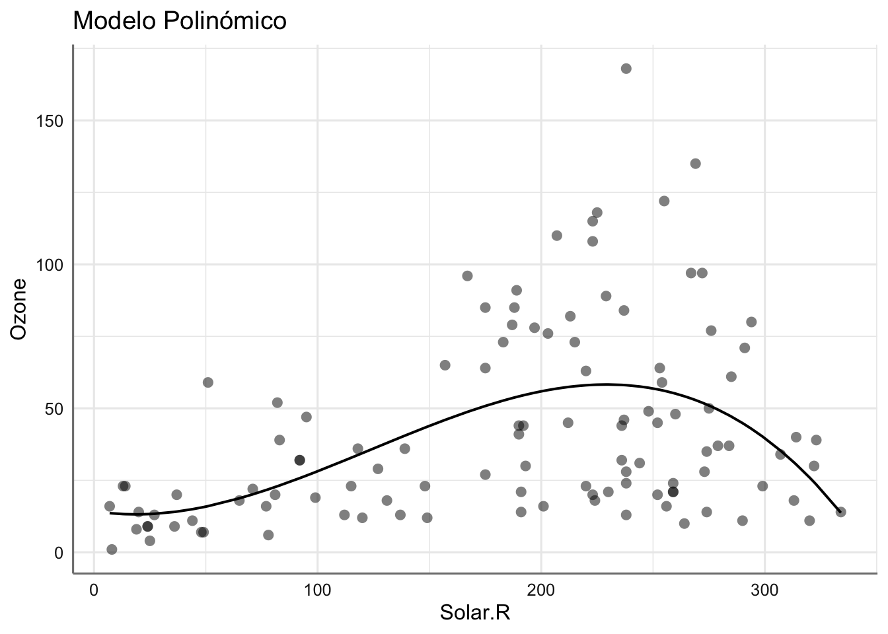

```
## $Solar.R
```

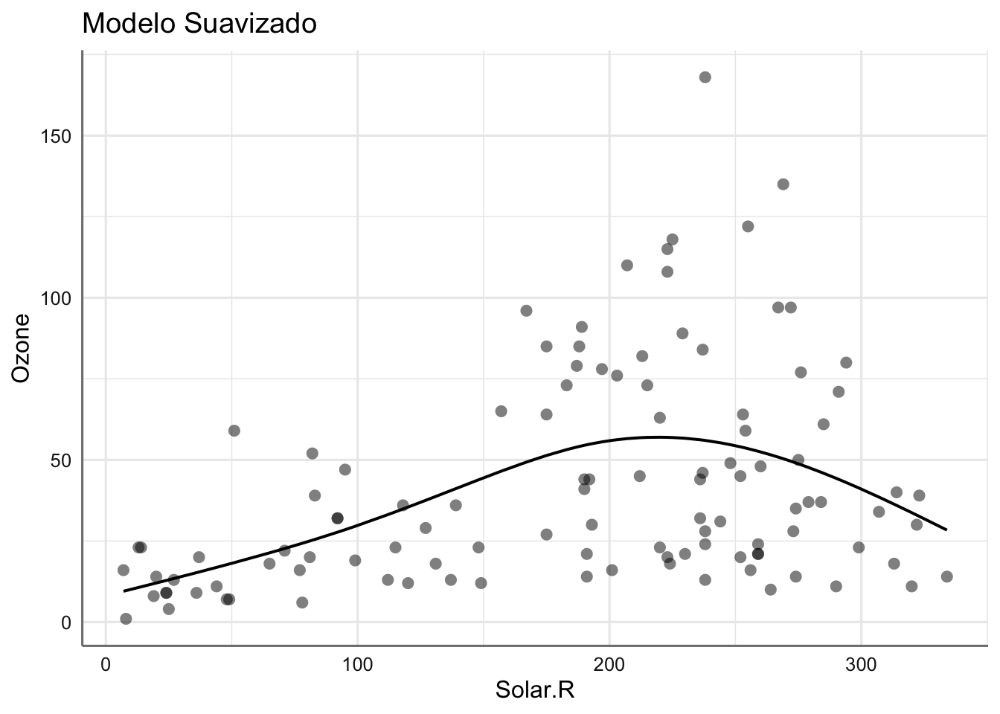

Analizamos ahora el efecto de la velocidad del viento en el nivel de ozono. Se proponen los modelos siguientes:

$$
\begin{array}{ll}
Ozone & \sim Wind + Wind^2 + Wind^3\\
Ozone & \sim f(Wind)\\
\end{array}
$$

Ajustamos ambos modelos


```r
# M1: modelo polinómico
fit1.wind <- gam(Ozone ~ Wind + I(Wind^2) + I(Wind^3) , 
                 data = airquality)
# M1: modelo suavizado
fit2.wind <- gam(Ozone ~ s(Wind, k = 10, m = 2, bs = "ps"), 
                 data = airquality)
```

Resultados para el modelo polinómico


```r
summary(fit1.wind)
```

```
## 
## Family: gaussian 
## Link function: identity 
## 
## Formula:
## Ozone ~ Wind + I(Wind^2) + I(Wind^3)
## 
## Parametric coefficients:
##              Estimate Std. Error t value Pr(>|t|)    
## (Intercept) 200.28778   27.01403   7.414  2.5e-11 ***
## Wind        -32.26471    8.29374  -3.890  0.00017 ***
## I(Wind^2)     1.92084    0.78733   2.440  0.01627 *  
## I(Wind^3)    -0.03771    0.02305  -1.636  0.10465    
## ---
## Signif. codes:  0 '***' 0.001 '**' 0.01 '*' 0.05 '.' 0.1 ' ' 1
## 
## 
## R-sq.(adj) =  0.484   Deviance explained = 49.8%
## GCV = 581.27  Scale est. = 561.23    n = 116
```

La tabla de coeficientes muestra que es suficiente con considera el grado 2 en el polinomio. La capacidad explicativa de este modelo se sitúa casi en el 50% (49.8%), indicando que individualmente está variable contribuye más a la explicación del nivel de ozono. En cuanto al modelo de suavizado:


```r
summary(fit2.wind)
```

```
## 
## Family: gaussian 
## Link function: identity 
## 
## Formula:
## Ozone ~ s(Wind, k = 10, m = 2, bs = "ps")
## 
## Parametric coefficients:
##             Estimate Std. Error t value Pr(>|t|)    
## (Intercept)   42.129      2.193   19.21   <2e-16 ***
## ---
## Signif. codes:  0 '***' 0.001 '**' 0.01 '*' 0.05 '.' 0.1 ' ' 1
## 
## Approximate significance of smooth terms:
##           edf Ref.df     F p-value    
## s(Wind) 2.889  3.534 30.77  <2e-16 ***
## ---
## Signif. codes:  0 '***' 0.001 '**' 0.01 '*' 0.05 '.' 0.1 ' ' 1
## 
## R-sq.(adj) =  0.487   Deviance explained =   50%
## GCV = 577.41  Scale est. = 558.05    n = 116
```

La función se suavizado es relevante (p-valor significativo), y la capacidad explicativa también es del 50%. Si comparamos con el `AIC` podemos ver que ambos modelos son muy similares. En realidad deberíamos ajustar de nuevo el modelo polinómico considerando el grado 2, pero los resultados son muy similares.


```r
# Bondad de ajuste de cada modelo (AIC)
g1 <- glance(fit1.wind)
g2 <- glance(fit2.wind)
as_tibble(rbind(g1,g2))
```

```
## # A tibble: 2 × 7
##      df logLik   AIC   BIC deviance df.residual  nobs
##   <dbl>  <dbl> <dbl> <dbl>    <dbl>       <dbl> <int>
## 1  4.00  -530. 1069. 1083.   62858.        112.   116
## 2  3.89  -529. 1069. 1082.   62564.        112.   116
```

En cuanto a los ajustes obtenidos con cada modelo podemos ver lo que se parecen las dos soluciones propuestas.


```
## $Wind
```

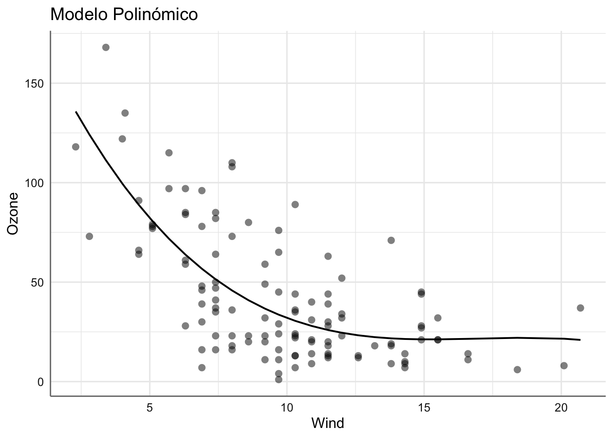

```
## $Wind
```

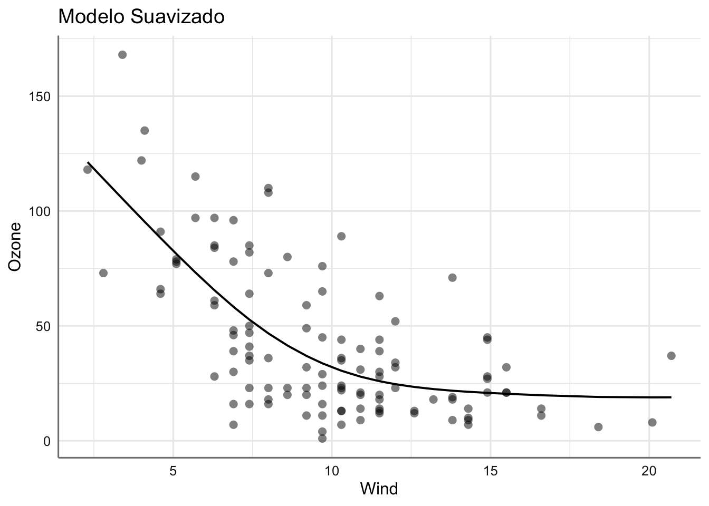

Analizamos ahora el efecto de la tempreratura sobre el nivel de ozono. Proponemos los modelos:

$$
\begin{array}{ll}
Ozone & \sim Temp + Temp^2 + Temp^3\\
Ozone & \sim f(Temp)\\
\end{array}
$$

Ajustamos ambos modelos


```r
# M1: modelo polinómico
fit1.temp <- gam(Ozone ~ Temp + I(Temp^2) + I(Temp^3) , 
                 data = airquality)
# M1: modelo suavizado
fit2.temp <- gam(Ozone ~ s(Temp, k = 10, m = 2, bs = "ps"), 
                 data = airquality)
```

Resultados para el modelo polinómico


```r
summary(fit1.temp)
```

```
## 
## Family: gaussian 
## Link function: identity 
## 
## Formula:
## Ozone ~ Temp + I(Temp^2) + I(Temp^3)
## 
## Parametric coefficients:
##               Estimate Std. Error t value Pr(>|t|)  
## (Intercept)  0.0910285  0.0663384   1.372   0.1727  
## Temp         2.2972754  1.6743100   1.372   0.1728  
## I(Temp^2)   -0.0732824  0.0430854  -1.701   0.0917 .
## I(Temp^3)    0.0006372  0.0002747   2.319   0.0222 *
## ---
## Signif. codes:  0 '***' 0.001 '**' 0.01 '*' 0.05 '.' 0.1 ' ' 1
## 
## 
## Rank: 3/4
## R-sq.(adj) =  0.533   Deviance explained = 54.1%
## GCV = 522.02  Scale est. = 508.52    n = 116
```

La tabla de coeficientes muestra que es necesario el grado 3 en el polinomio. La capacidad explicativa de este modelo se sitúa casi en 54.1% (la más alta de forma individual). En cuanto al modelo de suavizado:


```r
summary(fit2.temp)
```

```
## 
## Family: gaussian 
## Link function: identity 
## 
## Formula:
## Ozone ~ s(Temp, k = 10, m = 2, bs = "ps")
## 
## Parametric coefficients:
##             Estimate Std. Error t value Pr(>|t|)    
## (Intercept)   42.129      2.043   20.62   <2e-16 ***
## ---
## Signif. codes:  0 '***' 0.001 '**' 0.01 '*' 0.05 '.' 0.1 ' ' 1
## 
## Approximate significance of smooth terms:
##           edf Ref.df     F p-value    
## s(Temp) 3.771  4.524 32.04  <2e-16 ***
## ---
## Signif. codes:  0 '***' 0.001 '**' 0.01 '*' 0.05 '.' 0.1 ' ' 1
## 
## R-sq.(adj) =  0.555   Deviance explained =   57%
## GCV = 505.06  Scale est. = 484.29    n = 116
```

La función se suavizado es relevante (p-valor significativo), y la capacidad explicativa también es algo superior que en el modelo polinómico al alcanzar el 57%. En este caso el `AIC` para el modelo de suavizado es algo inferior al polinómico pero ambos proporcionan soluciones muy similares.


```r
# Bondad de ajuste de cada modelo (AIC)
g1 <- glance(fit1.temp)
g2 <- glance(fit2.temp)
as_tibble(rbind(g1,g2))
```

```
## # A tibble: 2 × 7
##      df logLik   AIC   BIC deviance df.residual  nobs
##   <dbl>  <dbl> <dbl> <dbl>    <dbl>       <dbl> <int>
## 1  3.00  -525. 1057. 1068.   57462.        113.   116
## 2  4.77  -521. 1053. 1069.   53867.        111.   116
```

La solución con cada modelo es:


```
## $Temp
```

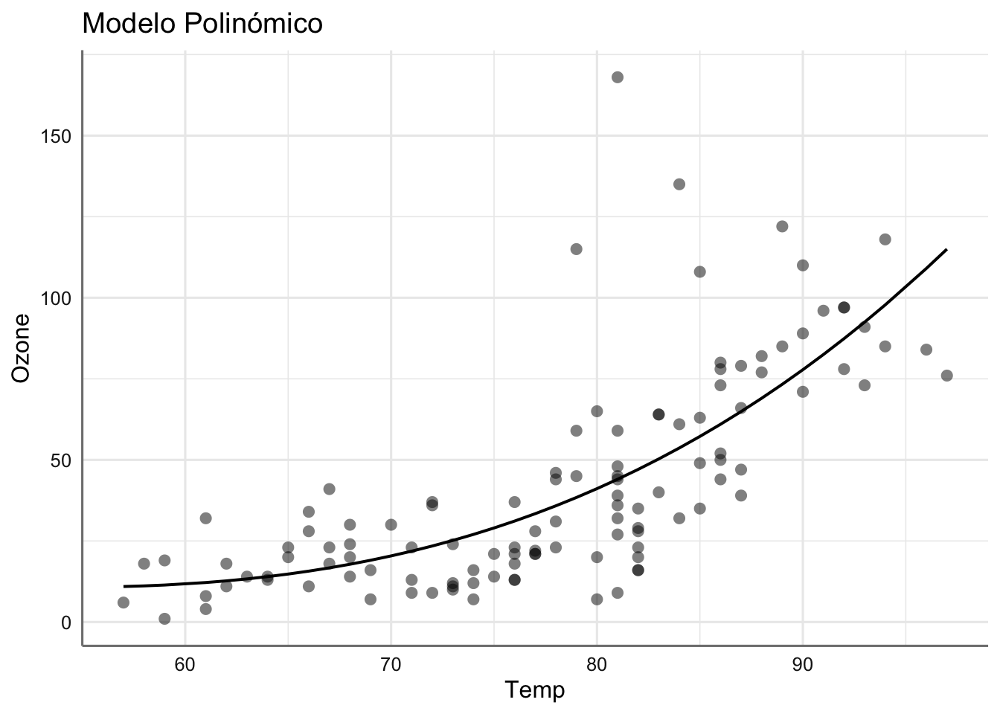

```
## $Temp
```

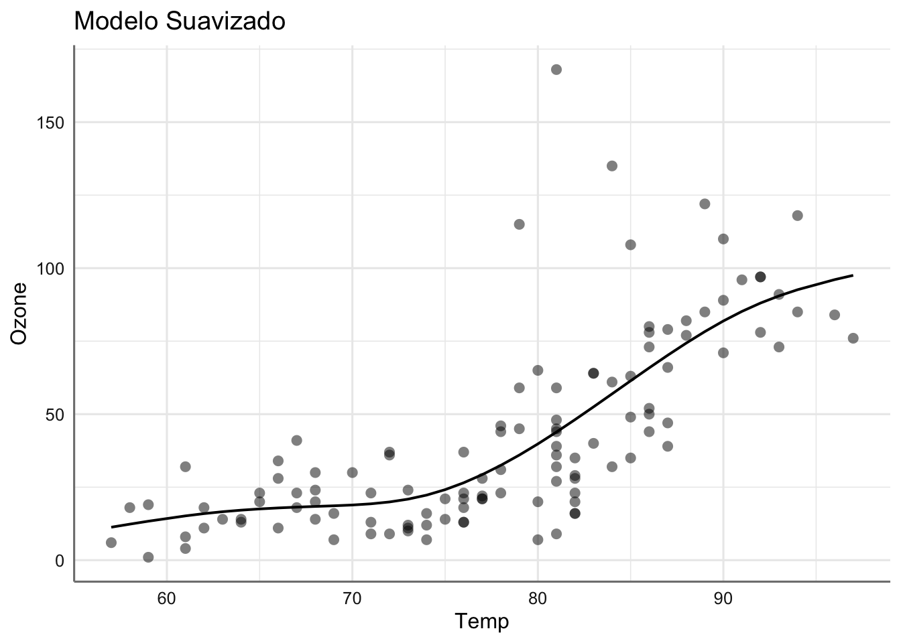

A la vista de los análisis individuales las variables predictoras más relvantes por orden de importancia serían temperatura, velocidad del viento, y por último la radiación solar. En cuanto a la elección de modelos polinómicos o suavizados los resultados son muy similares en los tres casos ya que únicamente se observa cierta preferencia del suavizado con la variable temperatura.

Pasamos a analizar los modelos más complejos con dos o tres predictoras. En primer lugar comparamos modelos con estructuras polinómicas frente a modelos de suavizado. Veamos todos los modelos:

$$
\begin{array}{lll}
M1:& Ozone & \sim Solar.R + Solar.R^2 + Solar.R^3 + Wind + Wind^2\\
M2:& Ozone & \sim Solar.R + Solar.R^2 + Solar.R^3 + Temp + Temp^2 + Temp^3\\
M3:& Ozone & \sim Wind + Wind^2 + Temp + Temp^2 + Temp^3\\
M4:& Ozone & \sim Solar.R + Solar.R^2 + Solar.R^3 + Wind + Wind^2 + Temp + Temp^2 + Temp^3\\
M5:& Ozone & \sim f(Solar.R) + f(Wind)\\
M6:& Ozone & \sim f(Solar.R) + f(Temp)\\
M7:& Ozone & \sim f(Wind) + f(Temp)\\
M8:& Ozone & \sim f(Solar.R) + f(Wind) + f(Temp)\\
\end{array}
$$

En primer lugar ajustamos todos los modelos (con el indicador de la tabla anterior):


```r
fit.M1 <- gam(Ozone ~ Solar.R + I(Solar.R^2) + I(Solar.R^3) + 
                Wind +I(Wind^2), 
              data = airquality)
fit.M2 <- gam(Ozone ~ Solar.R + I(Solar.R^2) + I(Solar.R^3) + 
                Temp +I(Temp^2) + I(Temp^3), 
              data = airquality)
fit.M3 <- gam(Ozone ~ Wind +I(Wind^2) + 
                Temp +I(Temp^2) + I(Temp^3), 
              data = airquality)
fit.M4 <- gam(Ozone ~ Solar.R + I(Solar.R^2) + I(Solar.R^3) + 
                Wind +I(Wind^2) + 
                Temp +I(Temp^2) + I(Temp^3), 
              data = airquality)
fit.M5 <- gam(Ozone ~ s(Solar.R, k = 10, m = 2, bs = "ps") + 
                s(Wind, k = 10, m = 2, bs = "ps"), 
              data = airquality)
fit.M6 <- gam(Ozone ~ s(Solar.R, k = 10, m = 2, bs = "ps") + 
                s(Temp, k = 10, m = 2, bs = "ps"), 
              data = airquality)
fit.M7 <- gam(Ozone ~ s(Wind, k = 10, m = 2, bs = "ps") + 
                s(Temp, k = 10, m = 2, bs = "ps"), 
              data = airquality)
fit.M8 <- gam(Ozone ~ s(Solar.R, k = 10, m = 2, bs = "ps") +
                s(Wind, k = 10, m = 2, bs = "ps") + 
                s(Temp, k = 10, m = 2, bs = "ps"), 
              data = airquality)
```

En lugar de estudiar con detalle todos los modelos propuestos, utilizamos el `AIC` para ordenarlos (de mejor a peor) y analizamos los dos más relevantes.


```r
# Bondad de ajuste de cada modelo (AIC)
g1 <- glance(fit.M1)
g2 <- glance(fit.M2)
g3 <- glance(fit.M3)
g4 <- glance(fit.M4)
g5 <- glance(fit.M5)
g6 <- glance(fit.M6)
g7 <- glance(fit.M7)
g8 <- glance(fit.M8)
as_tibble(rbind(g1, g2, g3, g4, g5, g6, g7, g8))
```

```
## # A tibble: 8 × 7
##      df logLik   AIC   BIC deviance df.residual  nobs
##   <dbl>  <dbl> <dbl> <dbl>    <dbl>       <dbl> <int>
## 1  5.00  -523. 1057. 1074.   79944.        106.   111
## 2  6.00  -497. 1008. 1027.   50331.        105.   111
## 3  5.00  -506. 1024. 1041.   41853.        111.   116
## 4  8.00  -477.  971.  996.   34858.        103.   111
## 5  6.06  -495. 1003. 1022.   48176.        105.   111
## 6  7.51  -493. 1003. 1026.   46669.        103.   111
## 7  7.69  -501. 1018. 1042.   38028.        108.   116
## 8  9.97  -470.  963.  992.   31176.        101.   111
```

Los dos mejores modelos (menor valor del `AIC`) son el M4 y el M8 que corresponden con los modelos que incorporan las tres predictoras. El M4 expresado como modelo polinómico y el M8 como modelo aditivo. De hecho, el modelo aditivo con las tres predictoras es el mejor de todos. Dado que individualmente tanto para la variable `Solar.R` y `Wind` el modelo polinómico se comportaba al mismo nivel que el suavizado, se propone una última alternativa de modelización que consiste en asumir polinomios en estas dos variables y suavizado en `Temp`:

$$
\begin{array}{lll}
M9:& Ozone & \sim Solar.R + Solar.R^2 + Solar.R^3 + Wind + Wind^2 + f(Temp)\\
\end{array}
$$


```r
fit.M9 <- gam(Ozone ~ Solar.R + I(Solar.R^2) + I(Solar.R^3) + 
                Wind +I(Wind^2) + 
                s(Temp, k = 10, m = 2, bs = "ps"), 
              data = airquality)
```

En lugar de estudiar con detalle todos los modelos propuestos, utilizamos el `AIC` para ordenarlos (de mejor a peor) y analizamos los dos más relevantes.


```r
# Bondad de ajuste de cada modelo (AIC)
glance(fit.M9)
```

```
## # A tibble: 1 × 7
##      df logLik   AIC   BIC deviance df.residual  nobs
##   <dbl>  <dbl> <dbl> <dbl>    <dbl>       <dbl> <int>
## 1  8.30  -495. 1008. 1033.   48296.        103.   111
```

El `AIC` para este modelo es superior al obtenido para los modelos M4 y M8, de forma que el modelo preferido sería el M8. En primer lugar estudiamos el modelo obtenido:


```r
summary(fit.M8)
```

```
## 
## Family: gaussian 
## Link function: identity 
## 
## Formula:
## Ozone ~ s(Solar.R, k = 10, m = 2, bs = "ps") + s(Wind, k = 10, 
##     m = 2, bs = "ps") + s(Temp, k = 10, m = 2, bs = "ps")
## 
## Parametric coefficients:
##             Estimate Std. Error t value Pr(>|t|)    
## (Intercept)   42.099      1.667   25.25   <2e-16 ***
## ---
## Signif. codes:  0 '***' 0.001 '**' 0.01 '*' 0.05 '.' 0.1 ' ' 1
## 
## Approximate significance of smooth terms:
##              edf Ref.df      F p-value    
## s(Solar.R) 2.622  3.209  4.142 0.00672 ** 
## s(Wind)    2.747  3.374 14.773 < 2e-16 ***
## s(Temp)    3.600  4.327 12.738 < 2e-16 ***
## ---
## Signif. codes:  0 '***' 0.001 '**' 0.01 '*' 0.05 '.' 0.1 ' ' 1
## 
## R-sq.(adj) =  0.721   Deviance explained = 74.4%
## GCV = 339.03  Scale est. = 308.58    n = 111
```

Los tres suavizados resultan significativos y la capacidad explicativa del modelo alcanza el 74.4%. Como alternativa a este modelo podríamos considerar modelos aditivos donde aumentamos el número de nodos. Probamos este nuevo modelo duplicando el número de nodos (pasamos de 10 a 20). En este caso dado que se trata de comparar diferentes opciones de suavizado utilizaremos el criterio `GCV` para decidirnos entre los dos.


```r
fit.M10 <- gam(Ozone ~ s(Solar.R, k = 20, m = 2, bs = "ps") +
                 s(Wind, k = 20, m = 2, bs = "ps") + 
                 s(Temp, k = 20, m = 2, bs = "ps"), 
               data = airquality)
summary(fit.M10)
```

```
## 
## Family: gaussian 
## Link function: identity 
## 
## Formula:
## Ozone ~ s(Solar.R, k = 20, m = 2, bs = "ps") + s(Wind, k = 20, 
##     m = 2, bs = "ps") + s(Temp, k = 20, m = 2, bs = "ps")
## 
## Parametric coefficients:
##             Estimate Std. Error t value Pr(>|t|)    
## (Intercept)   42.099      1.445   29.13   <2e-16 ***
## ---
## Signif. codes:  0 '***' 0.001 '**' 0.01 '*' 0.05 '.' 0.1 ' ' 1
## 
## Approximate significance of smooth terms:
##               edf Ref.df      F p-value    
## s(Solar.R)  1.068  1.132 10.118 0.00175 ** 
## s(Wind)     3.588  4.416 20.900 < 2e-16 ***
## s(Temp)    16.392 17.430  7.082 < 2e-16 ***
## ---
## Signif. codes:  0 '***' 0.001 '**' 0.01 '*' 0.05 '.' 0.1 ' ' 1
## 
## R-sq.(adj) =  0.791   Deviance explained = 83.1%
## GCV = 289.38  Scale est. = 231.9     n = 111
```

El valor de GCV con 10 nodos es 339.03 mientras que con 20 nodos dicho estadístico es 289.38. Por tanto, el modelo con 20 nodos es preferido. De hecho, la capacidad explicada ha crecido hasta el 83.1% (un 10% superior). El valor de `AIC` para este modelo es 941 mostrando ser mejor que el modelo polinómico. El modelo final es un suavizado independiente para cada una de las predictoras consideradas.

**Ejemplo.** Analizamos ahora el banco de datos de producción. La estructura de este banco de datos nos hace pensar que un modelo ANCOVA podría ser adecuado pero el gráfico descriptivo no deja muy claro si el comportamiento es de tipo lineal o si hay que considerar efectos de interacción entre localidad y densidad de plantas de tipo no lineal.


```r
ggplot(plantas, aes(x = Densidad, y = Produccion, colour = Localidad)) +
  geom_point() +
  labs(x = "Densidad", y = "Producción")
```


El conjunto de modelos que se pueden plantear son:

-   M1: Modelo lineal sin efecto de interacción.
-   M2: Modelo lineal sin efecto de interacción.
-   M3: Modelo polinómico de grado 2 sin interacción.
-   M4: Modelo polinómico de grado 2 con interacción.
-   M5: Modelo suavizado sin interacción.
-   M6: Modelo suavizado con interacción.

La representación gráfica de estos modelos se puede obteenr mediante:

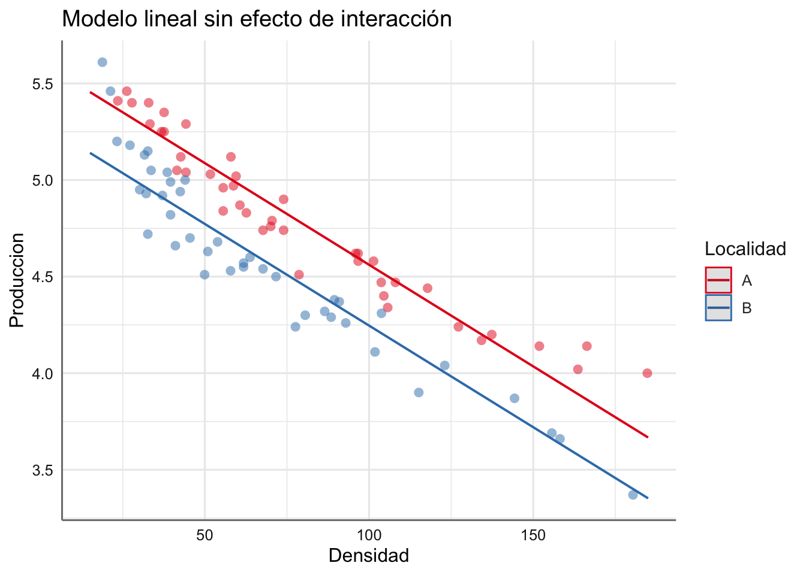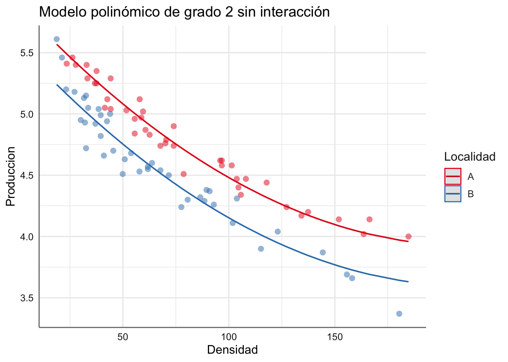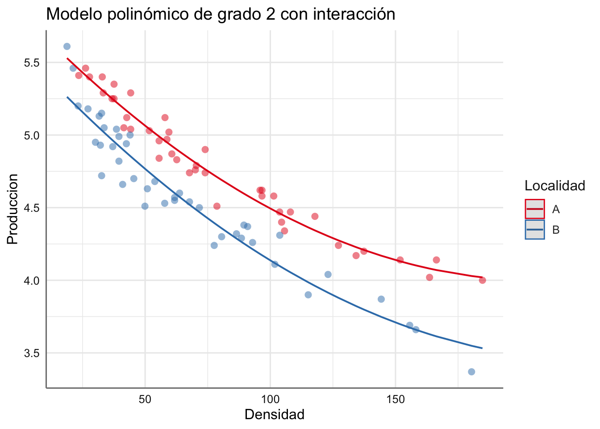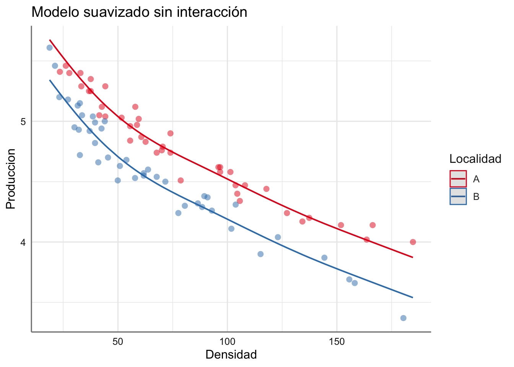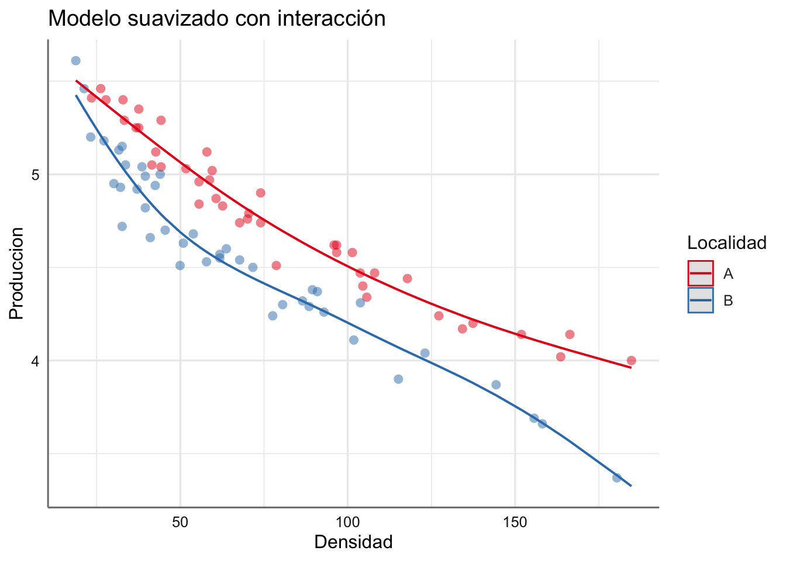

Veamos el código necesario para ajustar cada uno de los modelos propuestos y valoremos el `AIC` y el `GCV` para seleccionar el mejor modelo.


```r
fit.plantas.M1 <- gam(Produccion ~ Localidad + Densidad, 
                      data = plantas)
fit.plantas.M2 <- gam(Produccion ~ Localidad * Densidad, 
                      data = plantas)
fit.plantas.M3 <- gam(Produccion ~ Localidad + Densidad + I(Densidad^2), 
                      data = plantas)
fit.plantas.M4 <- gam(Produccion ~ Localidad * (Densidad + I(Densidad^2)), 
                      data = plantas)
fit.plantas.M5 <- gam(Produccion ~ Localidad + s(Densidad, k = 10, m = 2, bs = "ps"),
                      data = plantas)
fit.plantas.M6 <- gam(Produccion ~ Localidad + 
                        s(Densidad, k = 10, m = 2, bs = "ps", by = Localidad),
                      data = plantas)
### Valores de AIC
rbind(glance(fit.plantas.M1),glance(fit.plantas.M2),glance(fit.plantas.M3),
      glance(fit.plantas.M4),glance(fit.plantas.M5),glance(fit.plantas.M6))
```

```
## # A tibble: 6 × 7
##      df logLik    AIC    BIC deviance df.residual  nobs
##   <dbl>  <dbl>  <dbl>  <dbl>    <dbl>       <dbl> <int>
## 1  3      46.6  -85.2  -75.4    1.62         81      84
## 2  4      49.5  -89.0  -76.9    1.51         80      84
## 3  4.00   63.7 -117.  -105.     1.08         80      84
## 4  6.00   66.0 -118.  -101.     1.02         78      84
## 5  6.34   70.9 -127.  -109.     0.909        77.7    84
## 6  9.09   77.0 -134.  -109.     0.786        74.9    84
```

```r
### Valores de GCV
cbind(fit.plantas.M1$gcv.ubre, fit.plantas.M2$gcv.ubre, fit.plantas.M3$gcv.ubre,
      fit.plantas.M4$gcv.ubre, fit.plantas.M5$gcv.ubre, fit.plantas.M6$gcv.ubre)
```

```
##              [,1]       [,2]       [,3]       [,4]       [,5]       [,6]
## GCV.Cp 0.02077199 0.01985587 0.01415785 0.01410118 0.01266822 0.01177339
```

Con ambos criterios de selección el modelo preferido es el M6, es decir, el modelo de suavizado con interacción con el factor localidad. Estudiamos con más detalle dicho modelo:


```r
summary(fit.plantas.M6)
```

```
## 
## Family: gaussian 
## Link function: identity 
## 
## Formula:
## Produccion ~ Localidad + s(Densidad, k = 10, m = 2, bs = "ps", 
##     by = Localidad)
## 
## Parametric coefficients:
##             Estimate Std. Error t value Pr(>|t|)    
## (Intercept)  4.84394    0.01605  301.88   <2e-16 ***
## LocalidadB  -0.32929    0.02272  -14.49   <2e-16 ***
## ---
## Signif. codes:  0 '***' 0.001 '**' 0.01 '*' 0.05 '.' 0.1 ' ' 1
## 
## Approximate significance of smooth terms:
##                          edf Ref.df     F p-value    
## s(Densidad):LocalidadA 2.541  3.101 216.4  <2e-16 ***
## s(Densidad):LocalidadB 4.550  5.333 165.3  <2e-16 ***
## ---
## Signif. codes:  0 '***' 0.001 '**' 0.01 '*' 0.05 '.' 0.1 ' ' 1
## 
## R-sq.(adj) =  0.951   Deviance explained = 95.6%
## GCV = 0.011773  Scale est. = 0.010499  n = 84
```

Todos los efectos del modelo resultan significativos y la capacidad explicativa alcanza el 95%, indicando que el modelo obtenido es muy adecuado para estudiar la producción en las dos localidades.

**Ejemplo.** Análisis de los datos de infoltración. El gráfico descriptivo de este conjunto de datos muestra relaciones no lineales distintas entre carga hidráulica y profundidad en función del tratamiento, por lo que un modelo ANCOVA con interacción podría resultar demasiado rígido. Utilizamos un modelo suavizado para estos datos.


```r
fit.cargahid <- gam(cargahid ~ tratamiento + s(profundidad, k = 10, m = 2, 
                                               bs = "ps", 
                                               by = tratamiento), data = infiltracion)
summary(fit.cargahid)
```

```
## 
## Family: gaussian 
## Link function: identity 
## 
## Formula:
## cargahid ~ tratamiento + s(profundidad, k = 10, m = 2, bs = "ps", 
##     by = tratamiento)
## 
## Parametric coefficients:
##              Estimate Std. Error t value Pr(>|t|)    
## (Intercept)  -363.652      3.238 -112.32   <2e-16 ***
## tratamientoB -131.920      4.579  -28.81   <2e-16 ***
## tratamientoC -277.848      4.579  -60.68   <2e-16 ***
## ---
## Signif. codes:  0 '***' 0.001 '**' 0.01 '*' 0.05 '.' 0.1 ' ' 1
## 
## Approximate significance of smooth terms:
##                               edf Ref.df      F p-value    
## s(profundidad):tratamientoA 4.031  4.797  38.27  <2e-16 ***
## s(profundidad):tratamientoB 7.224  7.928 248.40  <2e-16 ***
## s(profundidad):tratamientoC 6.862  7.584 215.45  <2e-16 ***
## ---
## Signif. codes:  0 '***' 0.001 '**' 0.01 '*' 0.05 '.' 0.1 ' ' 1
## 
## R-sq.(adj) =  0.994   Deviance explained = 99.7%
## GCV = 296.27  Scale est. = 157.24    n = 45
```

Los suavizados para cada tratamiento resultan significativos y la capacidad explicativa alcanza el 99%, indicando que el modelo a parece capturar adecuadamente la tendencia observada en los datos.

## Diagnóstico

Una vez ajustado un modelo el estudio de los residuos nos permite realizar su diagnóstico en las mismas condiciones que los modelos lineales habituales. Las hipótesis de este modelo son las mismas que las del modelo de regresión, y por tanto, el diagnóstico se centra en los mismos procedimientos gráficos. Recordemos que debemos verificar la normalidad y varianza constante de los residuos del modelo. Sin embargo, en este tipo de modelos se añade el diagnóstico sobre el grado de suavizado del modelo considerado para saber si es necesario modificarlo.

Para este tipo de modelos resulta posible obtener todos los gráficos de interés con la función `gam.check()`. Esta función ofrece dos tipos de salidas:

-   Una tabla que permite contrastar los parámetros del suavizado utilizado. Los p-valores obtenidos deben resultar no significativos.
-   gráficos de diagnóstico (qq, residuos versus ajustados, histograma de los residuos, valores observados versus valores ajustados). El gráfico qq y el histograma nos permiten verificar la hipótesis de normalidad, mientras que los residuos versus ajustados nos permite verificar la hipótesis de varianza constante. El último gráfico nos permite conocer lo bueno que es el ajuste realizado, ya que si los punto se distribuyen a lo largo de la diagonal significará que el modelo predice adecuadamente la respuesta.

**Ejemplo.** Realizamos el diagnóstico el modelo ajustado para los datos de calidad del aire.


```r
gam.check(fit.M10)
```

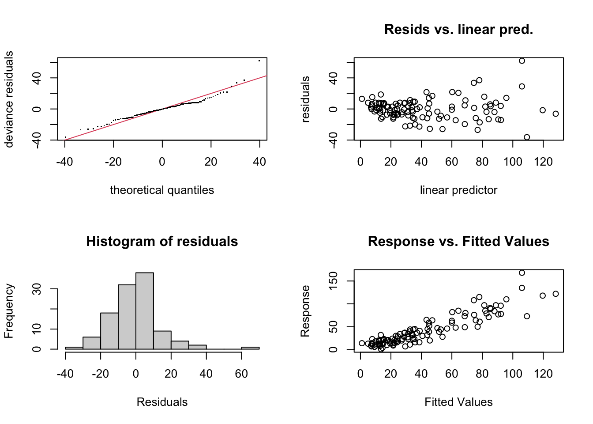

```
## 
## Method: GCV   Optimizer: magic
## Smoothing parameter selection converged after 17 iterations.
## The RMS GCV score gradient at convergence was 5.831016e-05 .
## The Hessian was positive definite.
## Model rank =  58 / 58 
## 
## Basis dimension (k) checking results. Low p-value (k-index<1) may
## indicate that k is too low, especially if edf is close to k'.
## 
##               k'   edf k-index p-value
## s(Solar.R) 19.00  1.07    1.06    0.72
## s(Wind)    19.00  3.59    1.22    0.99
## s(Temp)    19.00 16.39    1.09    0.81
```

Los test de suavizado indican que el modelo es adecuado, pero mientras que los gráficos para validar normalidad parecen indicar que no hay problema con dicha hipótesis, si parece haberlo con la de homogeneidad de varianzas. Se aprecia un efecto de embudo (aumenta la variabilidad cuando aumenta el valor ajustado) en el gráfico de residuos versus ajustados. En este caso no podemos utilizar las transformaciones de Box-Cox que están diseñadas para los modelos estudiados en unidades anteriores, pero si podemos probar alguna transformación habitual para ver si corregimos ese defecto observado. Probamos con la raíz cuadrada. Dado que vamos a modificar la escala de la respuesta es necesario reajustar el número de nodos (ya que hemos comprimido la escala). Asumimos 10 nodos y verificamos dicho modelo.


```r
# Modelo
fit.M11 <- gam(sqrt(Ozone) ~ s(Solar.R, k = 10, m = 2, bs = "ps") + 
                 s(Wind, k = 10, m = 2, bs = "ps") +
                 s(Temp, k = 10, m = 2, bs = "ps"), data = airquality)
# Bondad del ajuste
summary(fit.M11)
```

```
## 
## Family: gaussian 
## Link function: identity 
## 
## Formula:
## sqrt(Ozone) ~ s(Solar.R, k = 10, m = 2, bs = "ps") + s(Wind, 
##     k = 10, m = 2, bs = "ps") + s(Temp, k = 10, m = 2, bs = "ps")
## 
## Parametric coefficients:
##             Estimate Std. Error t value Pr(>|t|)    
## (Intercept)   6.0165     0.1165   51.62   <2e-16 ***
## ---
## Signif. codes:  0 '***' 0.001 '**' 0.01 '*' 0.05 '.' 0.1 ' ' 1
## 
## Approximate significance of smooth terms:
##              edf Ref.df      F  p-value    
## s(Solar.R) 2.145  2.655  7.684 0.000295 ***
## s(Wind)    2.461  3.049 12.871 5.32e-07 ***
## s(Temp)    3.862  4.622 15.929  < 2e-16 ***
## ---
## Signif. codes:  0 '***' 0.001 '**' 0.01 '*' 0.05 '.' 0.1 ' ' 1
## 
## R-sq.(adj) =  0.747   Deviance explained = 76.6%
## GCV = 1.6482  Scale est. = 1.5076    n = 111
```

```r
# Diagnóstico
gam.check(fit.M11)
```

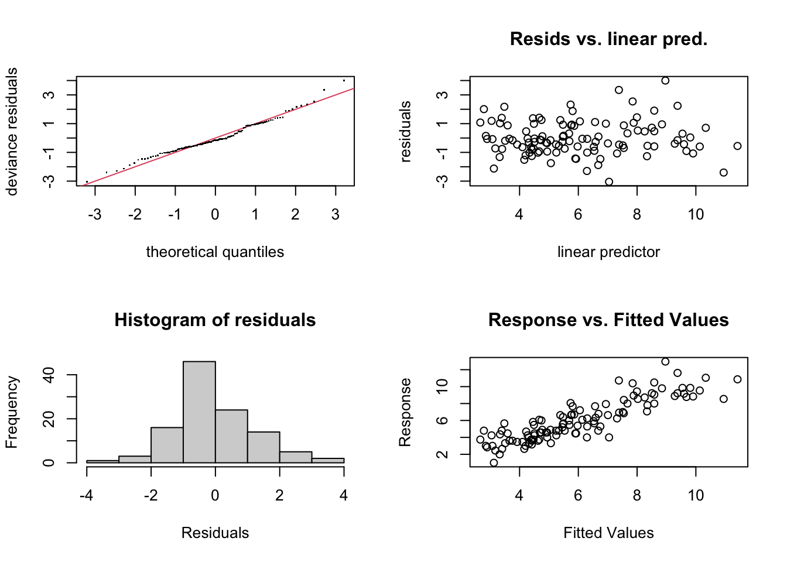

```
## 
## Method: GCV   Optimizer: magic
## Smoothing parameter selection converged after 7 iterations.
## The RMS GCV score gradient at convergence was 1.329944e-06 .
## The Hessian was positive definite.
## Model rank =  28 / 28 
## 
## Basis dimension (k) checking results. Low p-value (k-index<1) may
## indicate that k is too low, especially if edf is close to k'.
## 
##              k'  edf k-index p-value  
## s(Solar.R) 9.00 2.15    0.97    0.35  
## s(Wind)    9.00 2.46    0.98    0.35  
## s(Temp)    9.00 3.86    0.84    0.03 *
## ---
## Signif. codes:  0 '***' 0.001 '**' 0.01 '*' 0.05 '.' 0.1 ' ' 1
```

El modelo ajustado resulta significativo con una capacidad explicativa del 76.6%. En cuanto a las hipótesis del modelo podemos ver como se ha corregido el efecto de embudo obteniendo un modelo que verifica las hipótesis de partida.

**Ejemplo.** Realizamos el diagnóstico del modelo obtenido para los datos de producción.


```r
gam.check(fit.plantas.M6)
```

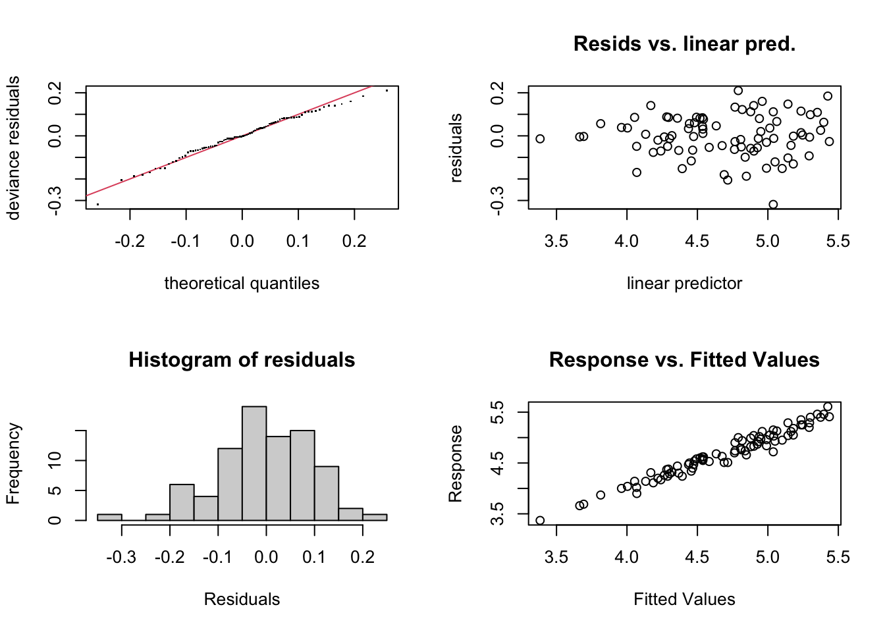

```
## 
## Method: GCV   Optimizer: magic
## Smoothing parameter selection converged after 5 iterations.
## The RMS GCV score gradient at convergence was 3.261881e-07 .
## The Hessian was positive definite.
## Model rank =  20 / 20 
## 
## Basis dimension (k) checking results. Low p-value (k-index<1) may
## indicate that k is too low, especially if edf is close to k'.
## 
##                          k'  edf k-index p-value
## s(Densidad):LocalidadA 9.00 2.54    1.08    0.75
## s(Densidad):LocalidadB 9.00 4.55    1.08    0.73
```

No se detecta ningún problema con las hipótesis del modelo y podemos pasar a establecer la predicción para el modelo ajustado.

**Ejemplo.** Realizamos el diagnóstico del modelo para los datos de infiltración.


```r
gam.check(fit.cargahid)
```

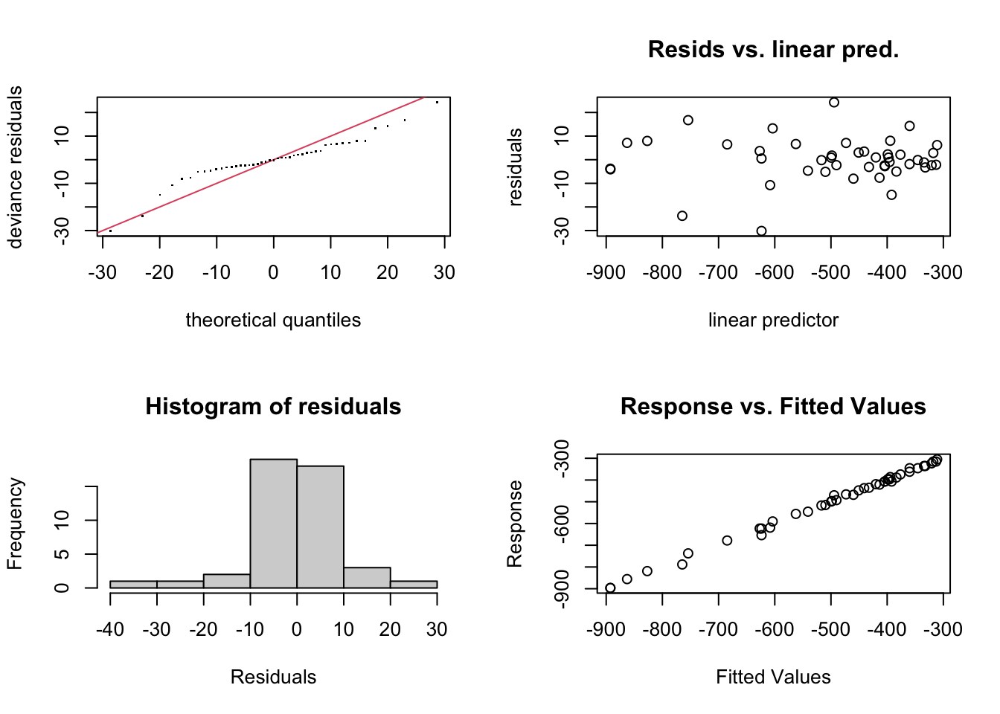

```
## 
## Method: GCV   Optimizer: magic
## Smoothing parameter selection converged after 7 iterations by steepest
## descent step failure.
## The RMS GCV score gradient at convergence was 1.786612e-05 .
## The Hessian was positive definite.
## Model rank =  30 / 30 
## 
## Basis dimension (k) checking results. Low p-value (k-index<1) may
## indicate that k is too low, especially if edf is close to k'.
## 
##                               k'  edf k-index p-value
## s(profundidad):tratamientoA 9.00 4.03     1.1    0.78
## s(profundidad):tratamientoB 9.00 7.22     1.1    0.70
## s(profundidad):tratamientoC 9.00 6.86     1.1    0.70
```

Todos los gráficos de diagnóstico parecen indicar que los residuos cumplen con las hipótesis del modelo (qq-plot, Resids vs linear pred., histogram of residuals, Response vs. ftted values). Por otro lado, el análisis del parámetro de suavizado indica que el ajuste obtenido es adecuado, no encontrando problemas importantes.

## Predicción

Una vez analizados y elegido el mejor modelo nos resta la fase de predicción. En este caso al no disponer de una función paramétrica que relaciona la respuesta con las predictoras no podemos obtener las ecauciones de predicción mediante una ecuación específica. Utilizamos las herramientas gráficas para ver los diferentes tipos de predicciones posibles.

**Ejemplo.** Obtenemos la predicción para el modelo de calidad del aire. En primer lugar obtenemos las predicciones marginales asociadas a cada una de las predictoras presentes en el modelo.


```r
plot_model(fit.M11, "pred",
           title ="Predicción de la media de la raiz cuadarada de ozono")
```

```
## $Solar.R
```

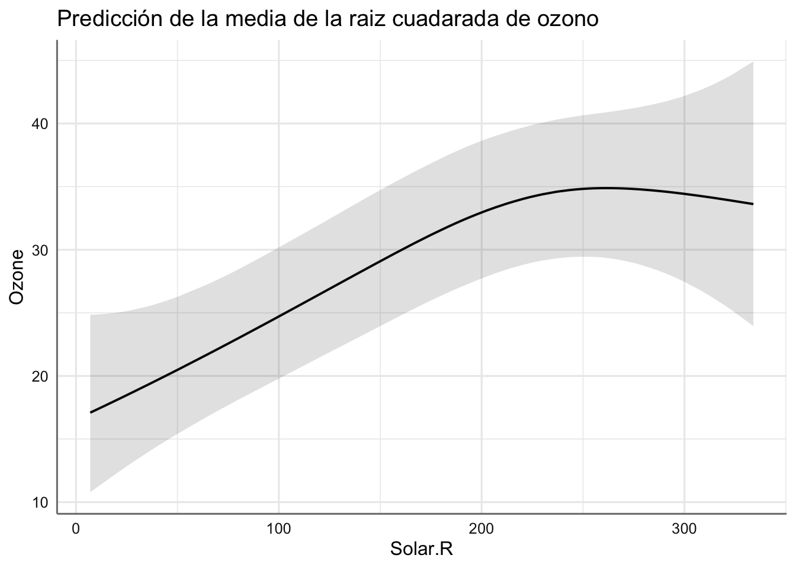

```
## 
## $Wind
```

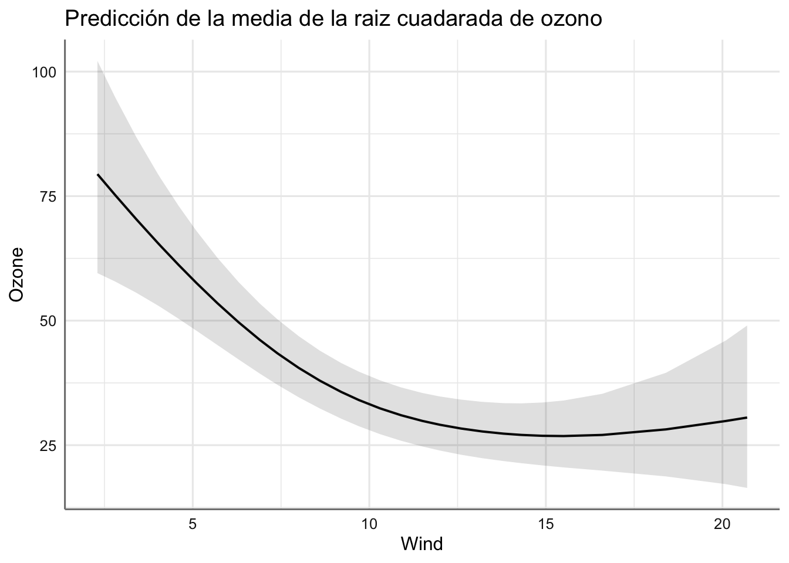

```
## 
## $Temp
```

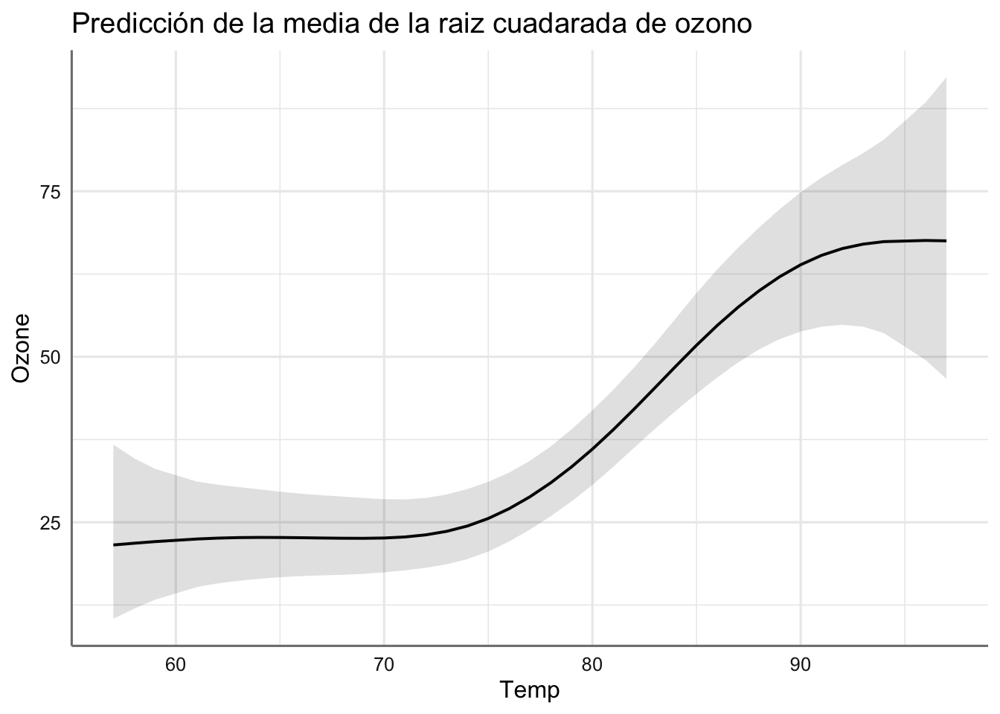

En estos gráficos podemos ver el efecto de cada predictora con respecto a la respuesta a partir del suavizado estimado. En ellos podemos ver:

-   el nivel de ozono aumenta con la radiación solar (hasta el valor de 250 aproximadamente), y luego empieza a caer lentamente.
-   El nivel de ozon disminuye con el aumento de la velocidad del viento hasta casi hacerse constante.
-   El nivel de ozono se mantiene casi constante hasta una temperatura de 70, momento en el que empieza a crecer hasta la temperatura de 90, caundo comienza a ser casi constante de nuevo.

Además, de los gráficos marginales podemos obtener gráficos conjuntos para dos variables sin más que estudiar los efectos combinados de ambas variables. En estos gráficos se crean escenarios con respecto a una de las variables numéricas (valor bajo, valor intermedio, y valor alto) y se representa la evolución de la otra predictora.


```r
plot_model(fit.M11, "pred", terms = c("Solar.R", "Wind"),
           title ="Predicción de la media de la raiz cuadarada de ozono")
```

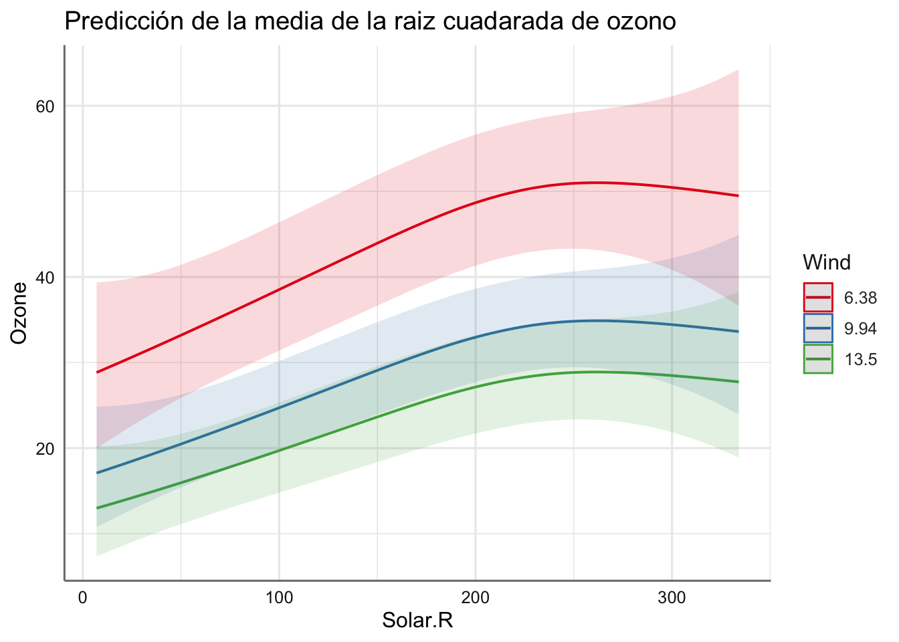

```r
plot_model(fit.M11, "pred", terms = c("Solar.R", "Temp"),
           title ="Predicción de la media de la raiz cuadarada de ozono")
```

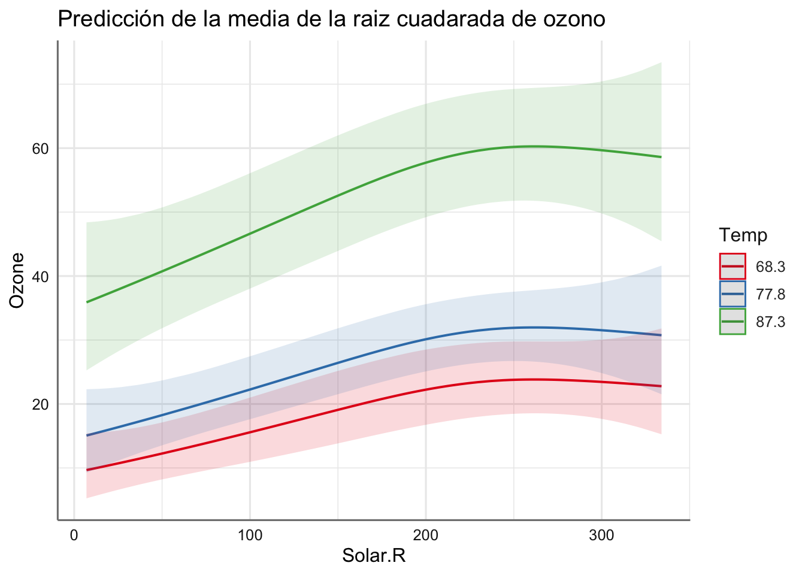

```r
plot_model(fit.M11, "pred", terms = c("Wind", "Temp"),
           title ="Predicción de la media de la raiz cuadarada de ozono")
```

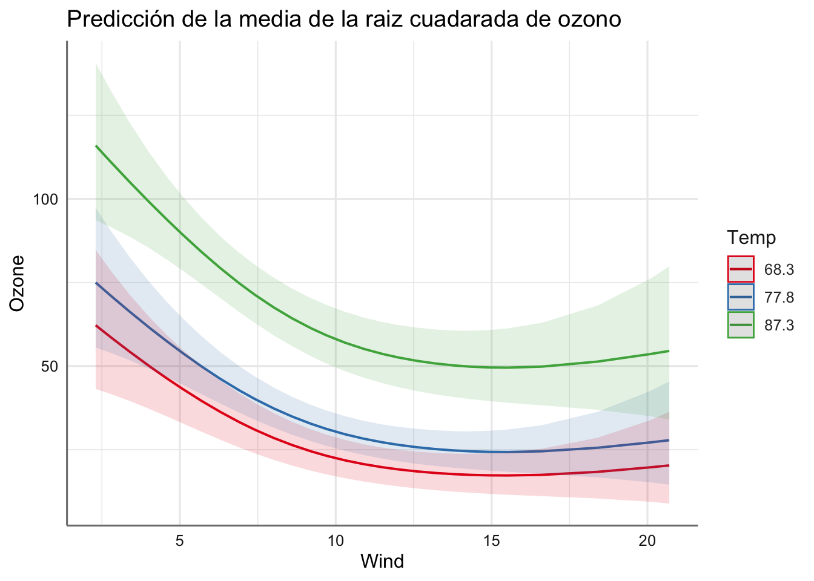

Podemos ver cada uno de los escenarios obtenidos lo que nos permite estudiar claramente el comportamiento de la respuesta. En realidad se reproducen los resultados independientes pero para diferentes valores (escenarios) de una de las predictoras numéricas consideradas. ¿Qué información obtenemos de dichos gráficos?

**Ejemplo.** Para los datos de producciónos nos limitamos a representar gráficamente la predicción del modelo ajustado, junto con sus intervalos de confianza.

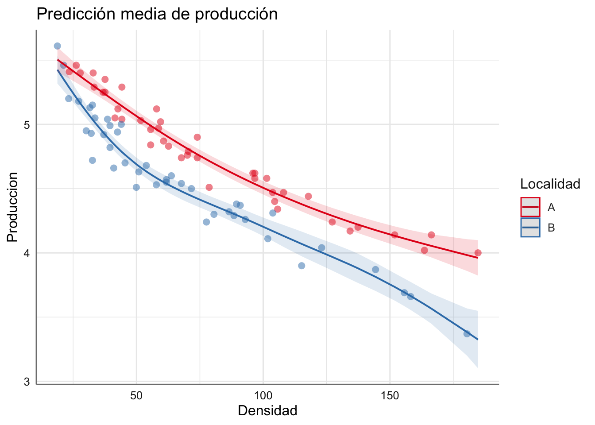

Se puede ver como la producción disminuye conforme aumenta la densidad de plantas, siendo el comportamiento no lineal y distinto en cada localidad. De hecho, la producción siempre es inferior en la localidad B frente a la A en todo el rango de densidades de plantas.

**Ejemplo.** Obtenemos y analizamos las funciones de predicción para los datos de infiltración.

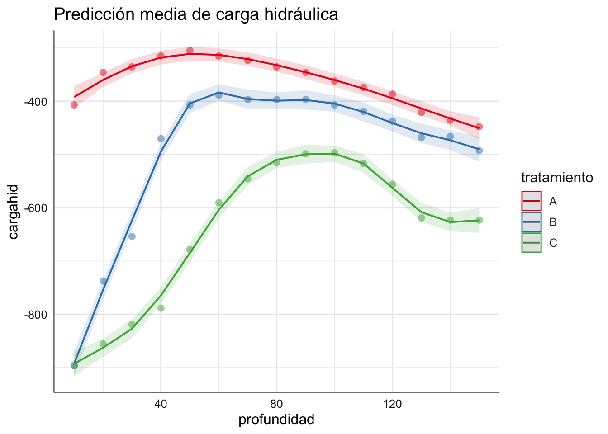

Los suavizados obtenidos se comportan adecuadamente al reproducir la tendencia observada. Se pueden ver las diferentes curvas de predicción en función del tratamiento utilizado.

## Ejercicios

En todos los ejercicios se debe proponer un modelo alterantivo basado en modelos de suavizado frente al modelo que sería de uso habitual. Se deberan comaparar ambos modelos para establecer si el modelo de suavizado es necesario.

**Ejercicio 1.** Una empresa dedicada a la fabricación de aislantes térmicos y acústicos establece un experimento que mide la pérdida de calor (`Calor`) a través de cuatro tipos diferentes de cristal para ventanas (`Cristal`) utilizando cinco graduaciones diferentes de temperatura exterior (`TempExt`). Se prueban tres hojas de cristal en cada graduación de temperatura, y se registra la pérdida de calor para cada hoja.


```r
# Lectura de datos
ejer01 <- read_csv("https://goo.gl/V6hyVW", col_types = "ddc") 
ejer01 <- ejer01 %>%
  mutate_if(sapply(ejer01,is.character),as.factor) 
```

**Ejercicio 2.** Treinta aleaciones del tipo 90/10 Cu-Ni, cada una con un contenido específico de hierro son estudiadas bajo un proceso de corrosión. Tras un período de 60 días se obtiene la pérdida de peso (en miligramos al cuadrado por decímetro y día) de cada una de las aleaciones debido al proceso de corrosión. El objetivo es estudiar el nivel de corrosión en función del contenido de hierro. A continuación se presenta el banco de datos y se realiza la primera inspección gráfica.


```r
hierro <- c(0.01, 0.48, 0.71, 0.95, 1.19, 0.01, 0.48, 1.44, 0.71, 
            1.96, 0.01, 1.44, 1.96)
peso <- c(127.6, 124, 110.8, 103.9, 101.5, 130.1, 122, 92.3, 113.1, 
          83.7, 128, 91.4, 86.2)
ejer02 <- data.frame(hierro,peso)
```

**Ejercicio 3.** Se ha realizado un experimento para tratar de conocer la viscosidad de cierto compuesto en función de la cantidad de un tipo der aceite que se usa en su fabricación. Se asume una relación de tipo lineal entre la viscosidad y la cantidad de aceite utilizada.


```r
aceite <- c(0, 12, 24, 36, 48, 60, 0, 12, 24, 36, 48, 60, 0, 12, 24, 
            36, 48, 60, 12, 24, 36, 48, 60)
viscosidad <- c(26, 38, 50, 76, 108, 157, 17, 26, 37, 53, 83, 124, 
                13, 20, 27, 37, 57, 87, 15, 22, 27, 41, 63)
ejer03 <- data.frame(aceite, viscosidad)
```

**Ejercicio 4.** Se realiza un estudio de campo para conocer el desarrollo de cierta especie de pez del lago lakemary en EEUU. Para medir el desarrollo se establece la edad de cada pez capturado mediante un procedimiento proporcionado por los biólogos. Además se mide la longitud del pez para tratar de establecer el estado de maduración de cada ejemplar. La investigación trata de relacionar la edad el pez a partir de su longitud para determinar el número de capturas permitidas. Las variables recogidas son: "Age" (edad del pez), y "Length" (longitud del pez en mm).


```r
data("lakemary")
ejer04 <-lakemary
```

**Ejercicio 5.** Es bien sabido que la concentración de colesterol en el suero sanguíneo aumenta con la edad, pero es menos claro si el nivel de colesterol también está asociado con el peso corporal. Los datos muestran para una treinta de mujeres el colesterol sérico (milimoles por litro), la edad (años) y el índice de masa corporal (peso dividido por la altura al cuadrado, donde el peso se midió en kilogramos y la altura en metros). Se trata de construir un modelo que explique el nivel de colesterol en función de la edad y del índice de masas corporal. Los datos corresponden con la tabla 6.17 de Dobson (2002).


```r
ejer05 <- read_csv("https://goo.gl/EKXWRc", col_types = "ddd")
```

**Ejercicio 6.** Los datos muestran el porcentaje de calorías totales obtenidas de carbohidratos complejos, para veinte diabéticos dependientes de insulina que habían seguido una dieta alta en carbohidratos durante seis meses. Se consideró que el cumplimiento del régimen estaba relacionado con la edad (en años), age, el peso corporal (relativo al peso "ideal" para la altura), weight, y otros componentes de la dieta como el porcentaje de proteínas ingeridas. Los datos corresponden con la tabla 6.3 de Dobson (2002).


```r
ejer06 <- read_csv("https://goo.gl/Grm8xM", col_types = "dddd")
```
