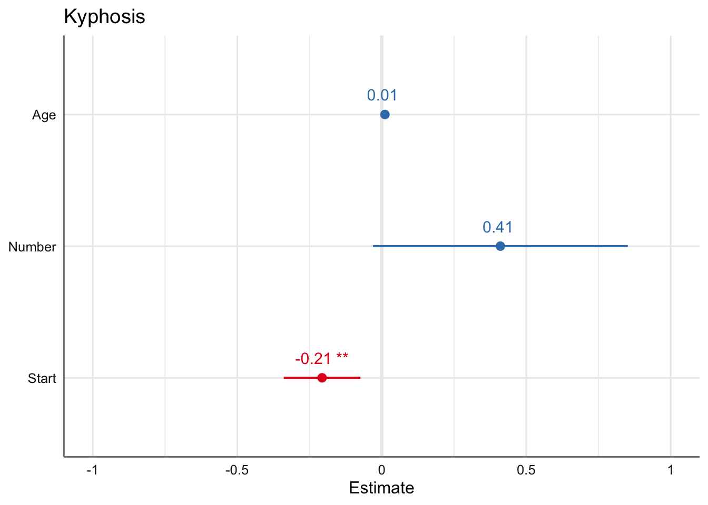
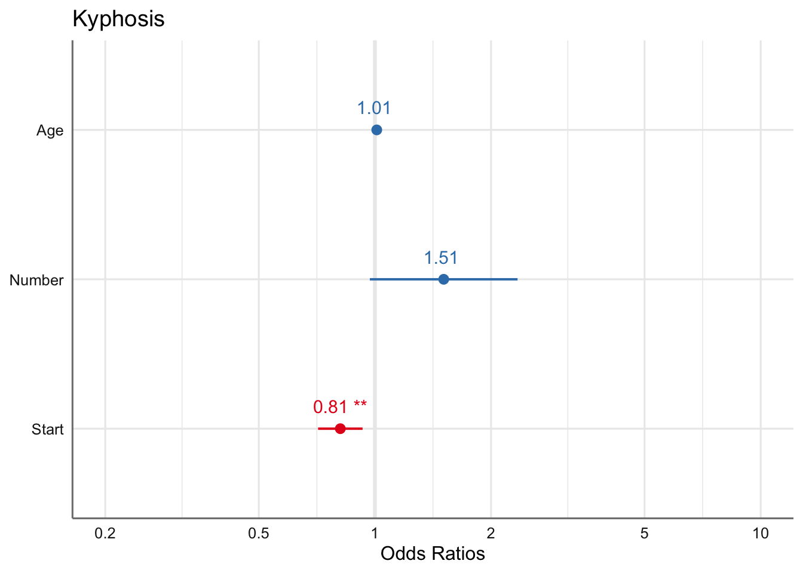
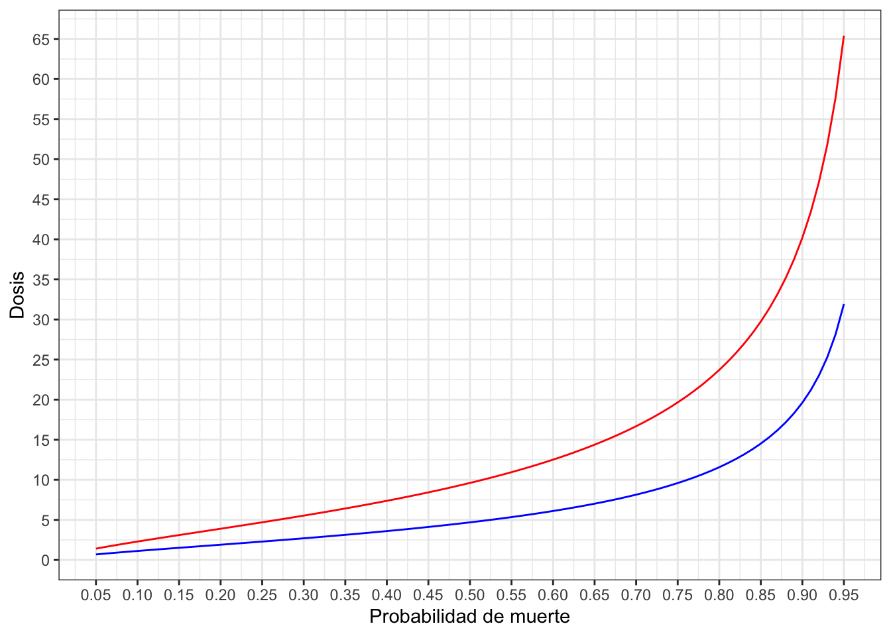
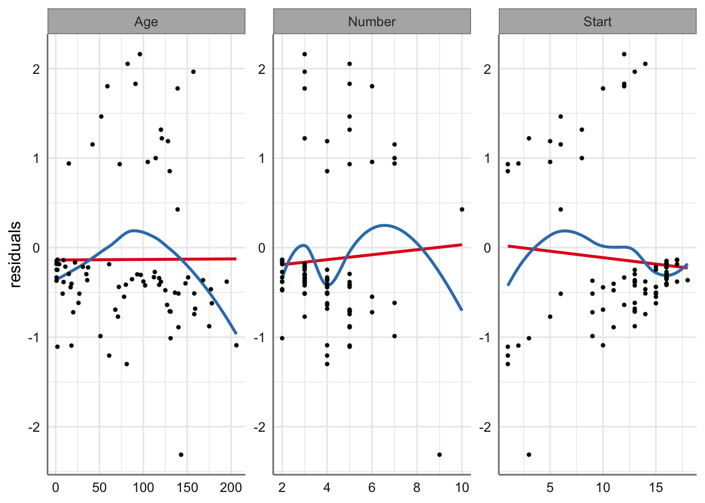
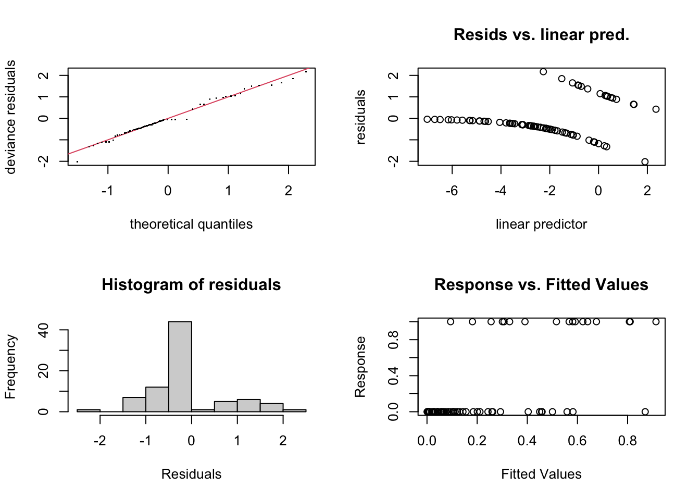
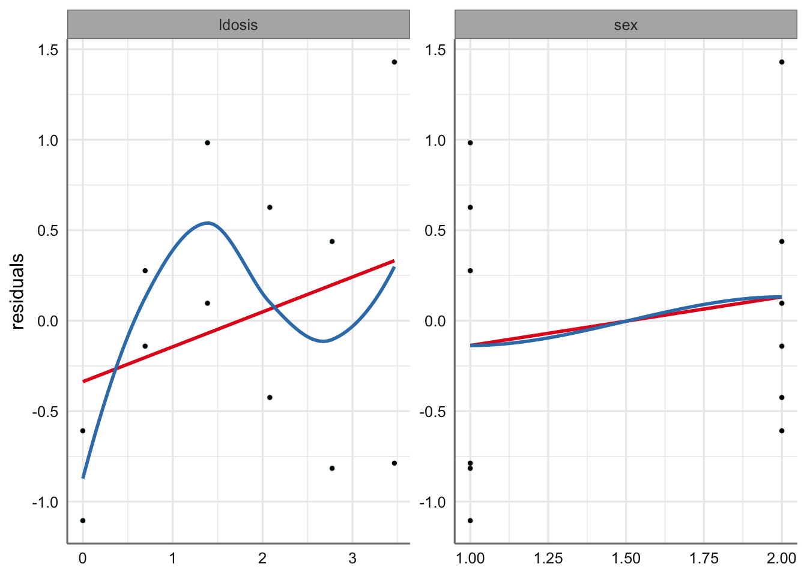
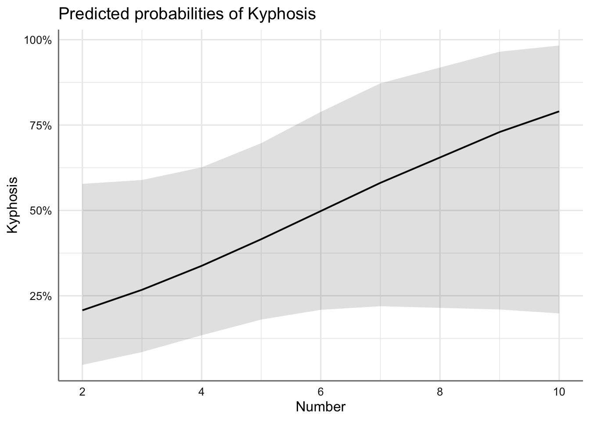
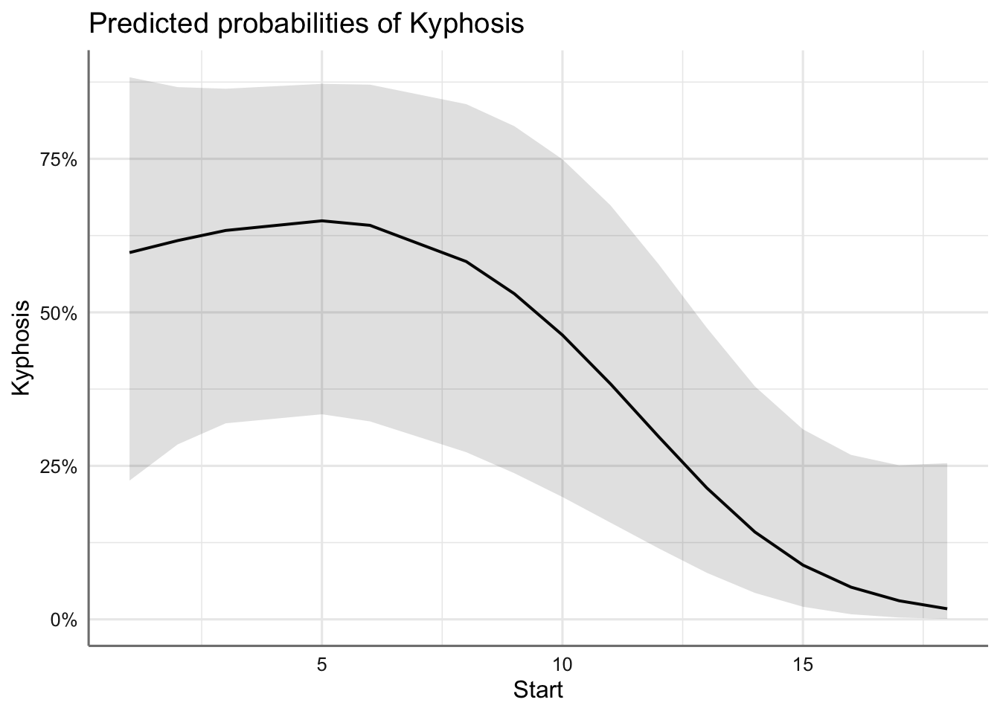
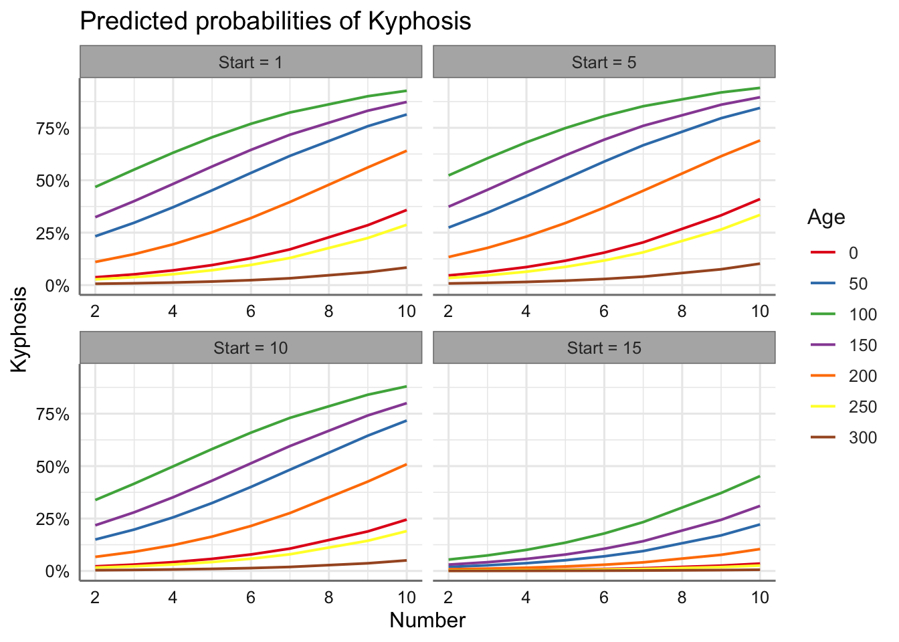

# GLM respuesta binomial {#glmbinomial}

Consideramos en este tema la modelización de variables respuesta de tipo binario, es decir, para cada individuo, la variable respuesta para cada uno de los sujetos puede tomar únicamente dos posibles valores, que denotaremos por 0 (fracaso) y 1 (éxito),

$$Pr(Y_i = 0) = 1 - \pi_i; \text{ } Pr(Y_i = 1) = \pi_i$$

Si además se han observado una serie de covariables continuas o de tipo factor, el objetivo del análisis con el modelo lineal generalizado será predecir la probabilidad asociada al éxito, $\widehat{\pi_i}$, (o equivalentemente el fracaso), en función de dichas covariables.

## Tipos de datos binomiales

Existen dos formas habituales en las que se presenta o se recoge la información experimental sobre variables que miden éxito o fracaso. A continuación detallamos dichas situaciones experimentales y vemos un ejemplo de cada una de ellas.

### Información individualizada por sujeto 

En este caso el banco de datos recoge la información de cada sujeto de la muestra con una variable que indica el éxito o el fracaso. Dicha variable se suele codificar 1 (éxito) y 0 (fracaso). Asociada con esta variable binaria se pueden recoger variables predictoras, en cada uno de los sujetos, para tratar de explicar el comportamiento de la respuesta.

#### Datos de Kifosis

En este banco de datos aparecen los datos de 81 niños que fueron intervenidos quirúrgicamente para corregirles problemas en la columna vertebral. La variable binaria `kifosis` indica la presencia o ausencia de una deformidad postoperatoria en la columna, denominada kifosis. Las otras tres variables son `Age`, edad del niñoo en meses, `Number`, número de vértebras intervenidas en la operación, y `Start`, que define la primera vértebra involucrada en la operación. Es de interés en el análisis investigar cómo están relacionadas dichas variables a la hora de predecir la incidencia de la kifosis en el postoperatorio. En este caso todas las variables predictoras son de tipo numérico.

En este caso la variable respuesta se puede representar mediante el modelo $Y_i \sim Bi(n = 1, \pi_i)$, dado que cada observación corresponde a un único sujeto con $\pi_i$ la probabilidad de sufrir una deformidad postoperatoria para el sujeto $i$.

Cargamos los datos a partir de la librería `rpart` y los representamos gráficamente. En este caso realizamos diagramas de caja para cada variable predictora. La variable respuesta viene codificada con las opciones `absent` y `present`, por lo que al cargar los datos codificaremos dichos valores como 0 y 1. En este caso el éxito viene marcado por tener la enfermedad.  


```r
Kyphosis <- factor(c(1, 1, 2L, 1, 1, 1,  1, 1, 1, 2, 
                     2, 1, 1, 1, 1, 1, 1, 1, 1, 1, 1, 
                     2, 2, 1, 2, 1, 1, 1, 1, 1, 1, 1, 
                     1, 1, 1, 1, 1, 2, 1, 2, 2, 1, 1, 
                     1, 1, 2, 1, 1, 2, 1, 1, 1, 2, 1, 
                     1, 1, 1, 2, 1, 1, 2, 2, 1, 1, 1, 
                     1, 1, 1, 1, 1, 1, 1, 1, 1, 1, 1, 
                     2, 1, 1, 2, 1), labels = c("absent", "present"))
Age <- c(71, 158, 128, 2, 1, 1, 61, 37, 113, 59, 82, 148, 
         18, 1, 168, 1, 78, 175, 80, 27, 22, 105, 96, 131, 
         15, 9, 8, 100, 4, 151, 31, 125, 130, 112, 140, 93, 
         1, 52, 20, 91, 73, 35, 143, 61, 97, 139, 136, 131, 
         121, 177, 68, 9, 139, 2, 140, 72, 2, 120, 51, 102, 
         130, 114, 81, 118, 118, 17, 195, 159, 18, 15, 158, 
         127, 87, 206, 11, 178, 157, 26, 120, 42, 36) 
Number <- c(3, 3, 4, 5, 4, 2, 2, 3, 2, 6, 5, 3, 5, 4, 3, 3, 6, 
            5, 5, 4, 2, 6, 3, 2, 7, 5, 3, 3, 3, 2, 3, 2, 5, 3, 
            5, 3, 3, 5, 6, 5, 5, 3, 9, 4, 3, 3, 4, 5, 3, 2, 5, 
            2, 10, 2, 4, 5, 3, 5, 7, 3, 4, 7, 4, 3, 4, 4, 2, 4, 
            4, 5, 5, 4, 4, 4, 3, 4, 3, 7, 2, 7, 4) 
Start <- c(5, 14, 5, 1, 15, 16, 17, 16, 16, 12, 14, 16, 2, 12, 
           18, 16, 15, 13, 16, 9, 16, 5, 12, 3, 2, 13, 6, 14, 
           16, 16, 16, 11, 13, 16, 11, 16, 9, 6, 9, 12, 1, 13, 
           3, 1, 16, 10, 15, 13, 3, 14, 10, 17, 6, 17, 15, 15, 
           13, 8, 9, 13, 1, 8, 1, 16, 16, 10, 17, 13, 11, 16, 
           14, 12, 16, 10, 15, 15, 13, 13, 13, 6, 13)
kyphosis <- data.frame(Kyphosis, Age, Number, Start)
# Recodificación a 0 - 1
kyphosisb = kyphosis %>% mutate(Kyphosis = 1*(Kyphosis=="present"))
# Gráficos de predictoras y variable
datacomp = melt(kyphosis, id.vars='Kyphosis')
ggplot(datacomp) +
  geom_boxplot(aes(Kyphosis,value, colour=variable)) + 
  facet_wrap(~variable, scales ="free_y") +
  labs(x = "", y = "Kyphosis") 
```


En dichos gráficos podemos ver como hay más incidencia de la enfermedad para los bebes más grandes y cuando el número de vértebras intervenidas es inferior, mientras que disminuye cuando la primera vértebra involucrada en la operación tiene un valor más bajo, es decir, se sitúa más arriba en la columna vertebral.

### Información agrupada por sujetos 

Los bancos de datos de este tipo suelen identificar por fila el "tratamiento" al que se ven sometidos un grupo de sujetos, registrándose el número total de sujetos en esa combinación y el número de éxitos (en algunos casos se recogen los éxitos y fracasos para dicha combinación). El "tratamiento" puede ser la combinación de una o más predictoras. Estos bancos de datos son muy habituales en ensayos de dosis-repuesta donde únicamente queremos valorar eficacia, ya que no es necesario recoger una información exhaustiva sobre los sujetos bajo estudio. En estos casos no estimamos la probabilidad de éxito individual sino del grupo de sujetos que se ven sometidos al mismo tratamiento. La información muestral debe recoger la probabilidad de éxito asociada a cada combinación.

#### Datos dosis-respuesta

Collet (1991) presenta un experimento sobre la toxicidad de distintas dosis (en microgramos) del piretroide trnas-cipemetrín en los capullos de gusano del tabaco. Se había comenzado a detectar resistencia de esas polillas a dicho tóxico. El experimento consistía en exponer, durante tres días y a distintas dosis de tóxico, a series de 20 polillas de cada sexo (`total`). Se anotaron el número de polillas muertas en cada serie (`dead`). Es de interés en el análisis investigar si efectivamente se demostraba tal resistencia al tóxico en función del sexo de la polilla (`sex`) y a partir de qué dosis (`dosis`). También se desea determinar la dosis a la cual es posible garantizar el exterminio del 50% de los insectos.

En este caso tenemos un modelo $Y_i \sim Bi(n = 20, \pi_i)$, con $\pi_i$ la probabilidad de morir para una polilla en la combinación dosis-sexo.

Veamos los datos para este experimento y la representación gráfica. Utilizamos la variable `log(dosis)` como es habitual en este tipo de experimentos para linealizar la relación entre probabilidad de éxito y dosis .


```r
Dosis = read_csv("https://goo.gl/w23RGz", col_types = "cdii")
Dosis
```

```
## # A tibble: 12 × 4
##    sex   dosis total  dead
##    <chr> <dbl> <int> <int>
##  1 M         1    20     1
##  2 M         2    20     4
##  3 M         4    20     9
##  4 M         8    20    13
##  5 M        16    20    18
##  6 M        32    20    20
##  7 F         1    20     0
##  8 F         2    20     2
##  9 F         4    20     6
## 10 F         8    20    10
## 11 F        16    20    12
## 12 F        32    20    16
```

```r
# Calculamos los vivos, la probabilidad de morir, y el 
# logaritmo de dosis que es la forma habitual de medir 
# en este tipo de situaciones
Dosis = Dosis %>%  
  mutate(alive = total - dead, probabilidad = dead/total, ldosis = log(dosis))
Dosis
```

```
## # A tibble: 12 × 7
##    sex   dosis total  dead alive probabilidad ldosis
##    <chr> <dbl> <int> <int> <int>        <dbl>  <dbl>
##  1 M         1    20     1    19         0.05  0    
##  2 M         2    20     4    16         0.2   0.693
##  3 M         4    20     9    11         0.45  1.39 
##  4 M         8    20    13     7         0.65  2.08 
##  5 M        16    20    18     2         0.9   2.77 
##  6 M        32    20    20     0         1     3.47 
##  7 F         1    20     0    20         0     0    
##  8 F         2    20     2    18         0.1   0.693
##  9 F         4    20     6    14         0.3   1.39 
## 10 F         8    20    10    10         0.5   2.08 
## 11 F        16    20    12     8         0.6   2.77 
## 12 F        32    20    16     4         0.8   3.47
```

```r
# Representamos la probabilidad de morir en función de 
# las covariables sex y ldosis
ggplot(Dosis,aes(x = ldosis, y = probabilidad, color = sex)) + 
  geom_point() +
  labs(x = "Logaritmo Dosis", y = "Probabilidad de morir") 
```


Se observa que para la misma dosis la probabilidad de morir en las hembras es menor que en los machos. Además, hay una tendencia creciente con la dosis, es decir, cuanto aumenta la dosis aumenta la probabilidad de morir.

## Especificación e hipótesis de modelo

Las hipótesis que debe verificar los modelos de este tipo son:

* independencia entre las observaciones 
* linealidad entre transformaciones de la proporción de éxitos y de las variables explicativas continuas (función link)
* consistencia entre la modelización y la interpretación física.

Si $\pi_i$ es la probabilidad de éxito asociado al i-ésimo experimento binomial con respuesta $Y_i$, y condiciones de experimentación observadas en las variables predictoras $X_1;X_2,...,X_p$, la formulación del GLM viene dada por:

$$g(\pi_i) = \eta_i = \beta_0 + \beta_1 x_{i1} + \beta_2 x_{21} + ... + \beta_p x_{ip}$$

donde $g()$ es la función link asociada con este tipo de datos. En este tipo de modelos los coeficientes $\beta_i$ representan el incremento o decremento sobre la función de enlace que nos permite linealizar la relación entre la probabilidad de éxito y las variables predictora o predictor lineal.

A continuación, presentamos las diferentes posibilidades de funciones link para este tipo de datos.

### Funciones link

En este tipo de modelos se contemplan diferentes funciones link. De forma habitual se suelen ajustar los modelos obtenidos para función de enlace, y nos quedamos con aquel modelo, y por tanto función de enlace, con mejor capacidad explicativa.

#### link logit

El link logit proporciona los comúnmente conocidos como modelos de regresión logística y su expresión viene dada por:

$$g(\pi_i) = log\left( \frac{\pi_i}{1-\pi_i}\right) = \beta_0 + \beta_1 x_{i1} + \beta_2 x_{21} + ... + \beta_p x_{ip}$$

En esta situación la probabilidad de éxito se puede escribir en términos de las variables predictoras (despejando de la ecuación anterior) como:

$$\pi_i = \frac{exp(\beta_0 + \beta_1 x_{i1} + \beta_2 x_{21} + ... + \beta_p x_{ip})}{1+exp(\beta_0 + \beta_1 x_{i1} + \beta_2 x_{21} + ... + \beta_p x_{ip})} $$

Si $\pi_i (x_1)$ y $\pi_i (x_2)$ denotan las probabilidades de éxito para dos valores de la predictora ($x_1$ y $x_2$), el cociente $(\pi_i (x_1)/(1-\pi_i (x_1))) / (\pi_i (x_2)/(1-\pi_i (x_2)))$ se denomina odds ratio y valora la relación entre probabilidad de éxito y fracaso para dos valores de la covaraible, de forma que:

* un valor mayor que 1 indica un aumento de la probabilidad de éxito en $x_1$ con respecto a $x_2$, 
* un valor menor que 1 indica un decremento de la probabilidad de éxito en $x_1$ con respecto a $x_2$.

En términos del modelo ajustado se puede valorar el incremento o decremento del odds ratio con el valor de $exp(\beta_i)$, para cada uno de los efectos (variables numéricas o niveles de un factor) presentes en el modelo. Valores negativos de $\beta_i$ dan lugar a odds ratios menores que 1, mientras que valores de $\beta_i$ positivos dan odds ratios positivos.


De hecho, esta propiedad es la que motiva que esta función de enlace sea la más utilizada en este tipo de modelos. 

En `R` podemos obtener el valor de la función enlace para cualquier probabilidad con la sentencia

```r
binomial(link = logit)$linlfun(probabilidad)
```

y el valor de la probabilidad de éxito a partir del valor del predictor lineal con

```r
binomial(link = logit)$linlinv(predictor)
```

#### link probit

El link probit proporciona los comúnmente conocidos como modelos de regresión probit y su expresión viene dada por:

$$g(\pi_i) = \Phi^{-1}(\pi_i) = \beta_0 + \beta_1 x_{i1} + \beta_2 x_{21} + ... + \beta_p x_{ip}$$
donde $\Phi^{-1}$ es la función inversa de la función de distribución Normal estándar. En esta situación la probabilidad de éxito se puede escribir en términos de las variables predictoras (despejando de la ecuación anterior) como:

$$\pi_i = \Phi(\beta_0 + \beta_1 x_{i1} + \beta_2 x_{21} + ... + \beta_p x_{ip})$$
donde $\Phi$ es la función de distribución Normal estándar.

#### link cloglog

El link cloglog es el menos habitual en la práctica y su expresión viene dada por:

$$g(\pi_i) = log(-log(1-\pi_i)) = \beta_0 + \beta_1 x_{i1} + \beta_2 x_{21} +...+\beta_p x_{ip}$$
¿Cuál es la probabilidad de éxito en este caso?


La diferencia entre un link y otro hace referencia a como modelizamos las probabilidades más extremas, es decir, las muy bajas o muy altas, pero en la práctica proporcionan resultados muy similares. Por eso casi siempre el modelo utilizado es el de regresión logística.

### Representación de las funciones link

Para poder comparar los diferentes links presentados veamos cual es su comportamiento en función de la probabilidad de éxito, lo que se denomina en los modelos de dosis-respuesta función de tolerancia. Respectivamente se representan el link logit (línea continua), link probit (línea discontinua), link cloglog (puntos):


En este gráfico se puede apreciar las pequeñas diferencias entre las funciones de enlace. Podemos ver que para un valor del predictor lineal de 2.5 la probabilidad de éxito en los modelos probit y cloglog es 1 mientras que para el modelo logit está próxima a 0.9. La elección de un tipo de enlace u otro dependerá por tanto del comportamiento de los datos observados.

Representamos a continuación las diferentes funciones link para los datos de dosis-respuesta. Este gráfico sólo se puede hacer para datos en formato agrupado.


Se aprecia como las tres funciones de enlace tienen un comportamiento muy similar. En el resto de esta unidad mostraremos los resultados correspondientes al modelo de regresión logística (link logit), e indicaremos como obtener los modelos para el resto de funciones link.

## Estimación y bondad de ajuste

Para la estimación utilizamos la función `glm` con las especificaciones siguientes:

```r
# Modelo de regresión logística
glm(modelo,family = binomial(link = logit),data_set)
# Modelo de regresión probit
glm(modelo,family = binomial(link = probit),data_set)
# Modelo cloglog
glm(modelo,family = binomial(link = cloglog),data_set)
```

Sin embargo, la especificación del modelo varía en función del tipo de datos (individualizados o conteos). En el caso de nuestro banco de datos contenga información individualizada para cada sujeto la variable respuesta se debe codificar con un 1 para el éxito y 0 para el fracaso, y el modelo se especifica como:

```r
respuesta ~ predictoras
```

En el caso de disponer del número de éxitos y fracasos el modelo se especifica e la forma siguiente:

```r
cbind(exitos,fracasos) ~ predictoras
```

### Ejemplos

Estudiamos ahora el proceso de estimación del modelo completo (con todos los efectos posibles) para cada uno de los ejemplos. Utilizamos la función `tab_model()` con diferentes especificaciones para obtener las estimaciones de los parámetros del modelo (predictor lineal) y de los odds ratios.

#### Kyphosis

En este caso ya hemos creado un variable para identificar el éxito (tener malformación postoperatoria) o el fracaso (no tener malformación) para cada sujeto de la muestra. El banco de datos es `kyphosisb` con variable respuesta `Kyphosis` y con tres posibles variables predictoras de tipo numérico: `Age`, `Number`, `Start`. 
Para ajustar el modelo de regresión logística escribimos:


```r
fit.kyphosis <- glm(Kyphosis  ~ Age + Number + Start,
          family = binomial(link = logit),
          data = kyphosisb)
```

Veamos las estimaciones del modelo ajustado:


```r
# Resumen del predictor lineal
tab_model(fit.kyphosis, 
          transform = NULL, 
          string.est = "Estimate",
          show.r2 = FALSE)
```

<table style="border-collapse:collapse; border:none;">
<tr>
<th style="border-top: double; text-align:center; font-style:normal; font-weight:bold; padding:0.2cm;  text-align:left; ">&nbsp;</th>
<th colspan="3" style="border-top: double; text-align:center; font-style:normal; font-weight:bold; padding:0.2cm; ">Kyphosis</th>
</tr>
<tr>
<td style=" text-align:center; border-bottom:1px solid; font-style:italic; font-weight:normal;  text-align:left; ">Predictors</td>
<td style=" text-align:center; border-bottom:1px solid; font-style:italic; font-weight:normal;  ">Estimate</td>
<td style=" text-align:center; border-bottom:1px solid; font-style:italic; font-weight:normal;  ">CI</td>
<td style=" text-align:center; border-bottom:1px solid; font-style:italic; font-weight:normal;  ">p</td>
</tr>
<tr>
<td style=" padding:0.2cm; text-align:left; vertical-align:top; text-align:left; ">(Intercept)</td>
<td style=" padding:0.2cm; text-align:left; vertical-align:top; text-align:center;  ">&#45;2.04</td>
<td style=" padding:0.2cm; text-align:left; vertical-align:top; text-align:center;  ">&#45;5.11&nbsp;&ndash;&nbsp;0.67</td>
<td style=" padding:0.2cm; text-align:left; vertical-align:top; text-align:center;  ">0.160</td>
</tr>
<tr>
<td style=" padding:0.2cm; text-align:left; vertical-align:top; text-align:left; ">Age</td>
<td style=" padding:0.2cm; text-align:left; vertical-align:top; text-align:center;  ">0.01</td>
<td style=" padding:0.2cm; text-align:left; vertical-align:top; text-align:center;  ">&#45;0.00&nbsp;&ndash;&nbsp;0.02</td>
<td style=" padding:0.2cm; text-align:left; vertical-align:top; text-align:center;  ">0.090</td>
</tr>
<tr>
<td style=" padding:0.2cm; text-align:left; vertical-align:top; text-align:left; ">Number</td>
<td style=" padding:0.2cm; text-align:left; vertical-align:top; text-align:center;  ">0.41</td>
<td style=" padding:0.2cm; text-align:left; vertical-align:top; text-align:center;  ">0.00&nbsp;&ndash;&nbsp;0.90</td>
<td style=" padding:0.2cm; text-align:left; vertical-align:top; text-align:center;  ">0.068</td>
</tr>
<tr>
<td style=" padding:0.2cm; text-align:left; vertical-align:top; text-align:left; ">Start</td>
<td style=" padding:0.2cm; text-align:left; vertical-align:top; text-align:center;  ">&#45;0.21</td>
<td style=" padding:0.2cm; text-align:left; vertical-align:top; text-align:center;  ">&#45;0.35&nbsp;&ndash;&nbsp;-0.08</td>
<td style=" padding:0.2cm; text-align:left; vertical-align:top; text-align:center;  "><strong>0.002</strong></td>
</tr>
<tr>
<td style=" padding:0.2cm; text-align:left; vertical-align:top; text-align:left; padding-top:0.1cm; padding-bottom:0.1cm; border-top:1px solid;">Observations</td>
<td style=" padding:0.2cm; text-align:left; vertical-align:top; padding-top:0.1cm; padding-bottom:0.1cm; text-align:left; border-top:1px solid;" colspan="3">81</td>
</tr>

</table>

```r
# Gráfico
plot_model(fit.kyphosis, 
           transform = NULL, 
           axis.title = c("Estimate",""),
           show.values = TRUE)
```



A la vista de los coeficientes estimados se desprende que la única preditora que parece tener influencia en la probabilidad de observar una malformación es la variable `Start`. Dado que el coeficiente es negativo dicha probabilidad disminuye cuando aumenta dicha variable. La ecuación del modelo viene dada por:

$$log\left( \frac{\hat{\pi}_i}{1-\hat{\pi}_i}\right) = -2.04 + 0.01 *Age_{i} + 0.41 *Number_{1} - 0.21 *Start_{i}$$

donde la probabilidad de éxito es:

$$\pi_i = \frac{exp(-2.04 + 0.01 * Age_{i} + 0.41* Number_{i} - 0.21* Start_{i})}{1 -exp(2.04 + 0.01* Age_{i} + 0.41* Number_{i} - 0.21* Start_{i})}$$

Los odds ratios asociados a cada variable presente en el modelo vienen dados por

$$
\begin{array}{ll}
odds(Age) = & exp(0.01) = 1.01\\
odds(Number) = & exp(0.41) = 1.51\\
odds(Start) = & exp(-0.21) = 0.81\\
\end{array}
$$

En términos de los odds ratios podemos ver que la probabilidad de sufrir una malformación aumenta 1.01 y 1.51 al aumentar respectivamente las variables `Age` y `Number`, es decir, la probabilidad de sufrir una malformación al incrementar en una unidad el número de vértebras intervenidas es 1.5 (odds ratio) veces superior que de no padecerla. Con la variable `Start` podemos ver que la relación entre sufrir la malformación es 0.81 veces la probabilidad de no sufrirla, es decir, disminuye al aumentar la vértebra de inicio.

Con la formulación siguiente podemos obtener y representar de forma directa los odds ratios asociados al modelo analizado:

```r
# Resumen del predictor lineal
tab_model(fit.kyphosis, 
          show.r2 = FALSE)
```

<table style="border-collapse:collapse; border:none;">
<tr>
<th style="border-top: double; text-align:center; font-style:normal; font-weight:bold; padding:0.2cm;  text-align:left; ">&nbsp;</th>
<th colspan="3" style="border-top: double; text-align:center; font-style:normal; font-weight:bold; padding:0.2cm; ">Kyphosis</th>
</tr>
<tr>
<td style=" text-align:center; border-bottom:1px solid; font-style:italic; font-weight:normal;  text-align:left; ">Predictors</td>
<td style=" text-align:center; border-bottom:1px solid; font-style:italic; font-weight:normal;  ">Odds Ratios</td>
<td style=" text-align:center; border-bottom:1px solid; font-style:italic; font-weight:normal;  ">CI</td>
<td style=" text-align:center; border-bottom:1px solid; font-style:italic; font-weight:normal;  ">p</td>
</tr>
<tr>
<td style=" padding:0.2cm; text-align:left; vertical-align:top; text-align:left; ">(Intercept)</td>
<td style=" padding:0.2cm; text-align:left; vertical-align:top; text-align:center;  ">0.13</td>
<td style=" padding:0.2cm; text-align:left; vertical-align:top; text-align:center;  ">0.01&nbsp;&ndash;&nbsp;1.95</td>
<td style=" padding:0.2cm; text-align:left; vertical-align:top; text-align:center;  ">0.160</td>
</tr>
<tr>
<td style=" padding:0.2cm; text-align:left; vertical-align:top; text-align:left; ">Age</td>
<td style=" padding:0.2cm; text-align:left; vertical-align:top; text-align:center;  ">1.01</td>
<td style=" padding:0.2cm; text-align:left; vertical-align:top; text-align:center;  ">1.00&nbsp;&ndash;&nbsp;1.02</td>
<td style=" padding:0.2cm; text-align:left; vertical-align:top; text-align:center;  ">0.090</td>
</tr>
<tr>
<td style=" padding:0.2cm; text-align:left; vertical-align:top; text-align:left; ">Number</td>
<td style=" padding:0.2cm; text-align:left; vertical-align:top; text-align:center;  ">1.51</td>
<td style=" padding:0.2cm; text-align:left; vertical-align:top; text-align:center;  ">1.00&nbsp;&ndash;&nbsp;2.45</td>
<td style=" padding:0.2cm; text-align:left; vertical-align:top; text-align:center;  ">0.068</td>
</tr>
<tr>
<td style=" padding:0.2cm; text-align:left; vertical-align:top; text-align:left; ">Start</td>
<td style=" padding:0.2cm; text-align:left; vertical-align:top; text-align:center;  ">0.81</td>
<td style=" padding:0.2cm; text-align:left; vertical-align:top; text-align:center;  ">0.71&nbsp;&ndash;&nbsp;0.92</td>
<td style=" padding:0.2cm; text-align:left; vertical-align:top; text-align:center;  "><strong>0.002</strong></td>
</tr>
<tr>
<td style=" padding:0.2cm; text-align:left; vertical-align:top; text-align:left; padding-top:0.1cm; padding-bottom:0.1cm; border-top:1px solid;">Observations</td>
<td style=" padding:0.2cm; text-align:left; vertical-align:top; padding-top:0.1cm; padding-bottom:0.1cm; text-align:left; border-top:1px solid;" colspan="3">81</td>
</tr>

</table>

```r
# Gráfico
plot_model(fit.kyphosis, 
           show.values = TRUE)
```



De todas formas hay que ser cautelosos en la interpretación dado que todavía no hemos validado el modelo ni hemos realizado el proceso de selección de efectos relevantes en el modelo.

Para realizar la bondad de ajuste del modelo obtenemos los estadísticos asociados (función `glance`) y el contraste de bondad de ajuste utilizando la deviance explicada y sus grados de libertad asociados utilizando el test $\chi^2$.


```r
# P-valor del contraste
1-pchisq(fit.kyphosis$deviance,fit.kyphosis$df.residual)
```

```
## [1] 0.9033442
```

```r
# Bondad del ajuste
glance(fit.kyphosis)
```

```
## # A tibble: 1 × 8
##   null.deviance df.null logLik   AIC   BIC deviance df.residual  nobs
##           <dbl>   <int>  <dbl> <dbl> <dbl>    <dbl>       <int> <int>
## 1          83.2      80  -30.7  69.4  79.0     61.4          77    81
```

El p-valor obtenido es superior a 0.05 indicando que el modelo considerado tiene una buena capacidad explicativa. En el punto siguiente estudiaremos la selección de variables para quedarnos con el mejor modelo posible.

#### Dosis-Respuesta

En este caso trabajamos con datos agrupados que contabilizan los éxitos (número de polillas muertas) y los fracasos (número de polillas vivas) para cada combinación considerada en el diseño experimental. Se consideran las variables predictoras `sex` (categórica) y `dosis` (numérica). 

El banco de datos es `Dosis` y contiene además las polillas totales, muertas y vivas (calculadas como muertas - vivas), y el logaritmo de la dosis suministrada, ya que de forma habitual en este tipo de modelos se suele trabajar en dicha escala logarítmica. Para ajustar el modelo de regresión logística consideramos los efectos asociados con cada predictora, así como la posible interacción entre ambos:


```r
Yres <- cbind(Dosis$dead,Dosis$alive)
fit.dosis <- glm(Yres  ~ sex * ldosis,
          family = binomial(link = logit),
          data = Dosis)
```

Analizamos el modelo obtenido:


```r
# Resumen del predictor lineal
tab_model(fit.dosis, 
          transform = NULL,
          string.est = "Estimate",
          show.r2 = FALSE)
```

<table style="border-collapse:collapse; border:none;">
<tr>
<th style="border-top: double; text-align:center; font-style:normal; font-weight:bold; padding:0.2cm;  text-align:left; ">&nbsp;</th>
<th colspan="3" style="border-top: double; text-align:center; font-style:normal; font-weight:bold; padding:0.2cm; ">Yres</th>
</tr>
<tr>
<td style=" text-align:center; border-bottom:1px solid; font-style:italic; font-weight:normal;  text-align:left; ">Predictors</td>
<td style=" text-align:center; border-bottom:1px solid; font-style:italic; font-weight:normal;  ">Estimate</td>
<td style=" text-align:center; border-bottom:1px solid; font-style:italic; font-weight:normal;  ">CI</td>
<td style=" text-align:center; border-bottom:1px solid; font-style:italic; font-weight:normal;  ">p</td>
</tr>
<tr>
<td style=" padding:0.2cm; text-align:left; vertical-align:top; text-align:left; ">(Intercept)</td>
<td style=" padding:0.2cm; text-align:left; vertical-align:top; text-align:center;  ">&#45;2.99</td>
<td style=" padding:0.2cm; text-align:left; vertical-align:top; text-align:center;  ">&#45;4.19&nbsp;&ndash;&nbsp;-2.00</td>
<td style=" padding:0.2cm; text-align:left; vertical-align:top; text-align:center;  "><strong>&lt;0.001</strong></td>
</tr>
<tr>
<td style=" padding:0.2cm; text-align:left; vertical-align:top; text-align:left; ">sex [M]</td>
<td style=" padding:0.2cm; text-align:left; vertical-align:top; text-align:center;  ">0.17</td>
<td style=" padding:0.2cm; text-align:left; vertical-align:top; text-align:center;  ">&#45;1.37&nbsp;&ndash;&nbsp;1.72</td>
<td style=" padding:0.2cm; text-align:left; vertical-align:top; text-align:center;  ">0.822</td>
</tr>
<tr>
<td style=" padding:0.2cm; text-align:left; vertical-align:top; text-align:left; ">ldosis</td>
<td style=" padding:0.2cm; text-align:left; vertical-align:top; text-align:center;  ">1.31</td>
<td style=" padding:0.2cm; text-align:left; vertical-align:top; text-align:center;  ">0.87&nbsp;&ndash;&nbsp;1.82</td>
<td style=" padding:0.2cm; text-align:left; vertical-align:top; text-align:center;  "><strong>&lt;0.001</strong></td>
</tr>
<tr>
<td style=" padding:0.2cm; text-align:left; vertical-align:top; text-align:left; ">sex [M] * ldosis</td>
<td style=" padding:0.2cm; text-align:left; vertical-align:top; text-align:center;  ">0.51</td>
<td style=" padding:0.2cm; text-align:left; vertical-align:top; text-align:center;  ">&#45;0.24&nbsp;&ndash;&nbsp;1.31</td>
<td style=" padding:0.2cm; text-align:left; vertical-align:top; text-align:center;  ">0.191</td>
</tr>
<tr>
<td style=" padding:0.2cm; text-align:left; vertical-align:top; text-align:left; padding-top:0.1cm; padding-bottom:0.1cm; border-top:1px solid;">Observations</td>
<td style=" padding:0.2cm; text-align:left; vertical-align:top; padding-top:0.1cm; padding-bottom:0.1cm; text-align:left; border-top:1px solid;" colspan="3">12</td>
</tr>

</table>

```r
# Gráfico
plot_model(fit.dosis, 
           transform = NULL, 
           axis.title = c("Estimate",""),
           show.values = TRUE)
```


De los resultados obtenidos parece desprenderse que no existe efecto de interacción entre sexo y dosis. Antes de tratar de explicar el resto de efectos deberemos estudiar la posibilidad de eliminar dicho efecto del modelo. Las ecuaciones de este modelo vienen dadas por:

$$
log\left(\frac{\widehat{\pi_i}}{1-\widehat{\pi_i}}\right)_{Machos} = -2.82 + 1.82 * ldosis_{i} 
$$

$$
log\left(\frac{\widehat{\pi_i}}{1-\widehat{\pi_i}}\right)_{Hembras} = -2.99 + 1.31 * ldosis_{i}
$$

En el punto siguiente seleccionaremos el mejor modelo e interpretaremos con detalle los coeficientes y los odds-ratios estimados. 

Por otro lado, el p-valor para valorar la bondad del ajuste:

```r
1-pchisq(fit.dosis$deviance,fit.dosis$df.residual)
```

```
## [1] 0.7582464
```
parece indicar que el ajuste obtenido es bueno, dado que es superior a 0.05.

## Selección del modelo

Para la construcción del mejor modelo utilizaremos los mismos procedimientos secuenciales de selección de efectos que vimos en unidades anteriores. En este caso disponemos del criterio Deviance, del AIC y del test $\chi^2$ (p-valor significativo o no) para valorar los efectos del modelo. En este caso utilizaremos el AIC dado que los p-valores son aproximados en este tipo de modelos, y tienen que ser interpretados con mucha cautela.

Para realizar la selección del modelo utilizaremos el procedimiento:

```r
modelo.final <- step(modelo)
```

### Ejemplos

Estudiamos a continuación cada uno de los ejemplos.

#### Kyphosis

Realizamos la selección del modelo:

```r
stats::step(fit.kyphosis)
```

```
## Start:  AIC=69.38
## Kyphosis ~ Age + Number + Start
## 
##          Df Deviance    AIC
## <none>        61.380 69.380
## - Age     1   64.536 70.536
## - Number  1   65.299 71.299
## - Start   1   71.627 77.627
```

```
## 
## Call:  glm(formula = Kyphosis ~ Age + Number + Start, family = binomial(link = logit), 
##     data = kyphosisb)
## 
## Coefficients:
## (Intercept)          Age       Number        Start  
##    -2.03693      0.01093      0.41060     -0.20651  
## 
## Degrees of Freedom: 80 Total (i.e. Null);  77 Residual
## Null Deviance:	    83.23 
## Residual Deviance: 61.38 	AIC: 69.38
```

El proceso de selección de efectos indica que no podemos eliminar ninguna variable del modelo (todos los AIC asociados con las predictoras aumentan al eliminarlas). Los valores de Deviance siempre aumentan (deviance asociada a cada variable) cuando eliminamos cualquiera de las variables con respecto a la del modelo que se queda con todas ellas (`<none>`). Lo mismo ocurre con el estadístico AIC. 

Por tanto, el modelo final es el obtenido en el punto anterior. Todo el análisis de los coeficientes y de los odds ratios ya fue detallado y no se repite aquí.

#### Dosis-respuesta

Realizamos la selección para el modelo de dosis-respuesta:
  

```r
stats::step(fit.dosis)
```

```
## Start:  AIC=43.1
## Yres ~ sex * ldosis
## 
##              Df Deviance    AIC
## - sex:ldosis  1   6.7571 42.867
## <none>            4.9937 43.104
## 
## Step:  AIC=42.87
## Yres ~ sex + ldosis
## 
##          Df Deviance     AIC
## <none>         6.757  42.867
## - sex     1   16.984  51.094
## - ldosis  1  118.799 152.909
```

```
## 
## Call:  glm(formula = Yres ~ sex + ldosis, family = binomial(link = logit), 
##     data = Dosis)
## 
## Coefficients:
## (Intercept)         sexM       ldosis  
##      -3.473        1.101        1.535  
## 
## Degrees of Freedom: 11 Total (i.e. Null);  9 Residual
## Null Deviance:	    124.9 
## Residual Deviance: 6.757 	AIC: 42.87
```

El proceso de selección indica que no debemos considerar el efecto de interacción ya que el valor de deviance es inferior cuando está presente que cuando lo eliminamos, el AIC aumenta al eliminarlo. El resto de efectos del modelo no pueden ser eliminados. Esto implica que al no haber efecto de interacción la probabilidad de morir se puede obtener mediante comportamientos paralelos para machos y hembras. 

Ajustamos el modelo sin interacción y realizamos el análisis de dicho modelo:

```r
fit.dosis <- glm(Yres ~ sex + ldosis,
                 family = binomial(link = logit),
                 data = Dosis)
```

La inferencia sobre el modelo viene dada por:

```r
# Resumen del predictor lineal
tab_model(fit.dosis, 
          transform = NULL,
          string.est = "Estimate",
          show.r2 = FALSE)
```

<table style="border-collapse:collapse; border:none;">
<tr>
<th style="border-top: double; text-align:center; font-style:normal; font-weight:bold; padding:0.2cm;  text-align:left; ">&nbsp;</th>
<th colspan="3" style="border-top: double; text-align:center; font-style:normal; font-weight:bold; padding:0.2cm; ">Yres</th>
</tr>
<tr>
<td style=" text-align:center; border-bottom:1px solid; font-style:italic; font-weight:normal;  text-align:left; ">Predictors</td>
<td style=" text-align:center; border-bottom:1px solid; font-style:italic; font-weight:normal;  ">Estimate</td>
<td style=" text-align:center; border-bottom:1px solid; font-style:italic; font-weight:normal;  ">CI</td>
<td style=" text-align:center; border-bottom:1px solid; font-style:italic; font-weight:normal;  ">p</td>
</tr>
<tr>
<td style=" padding:0.2cm; text-align:left; vertical-align:top; text-align:left; ">(Intercept)</td>
<td style=" padding:0.2cm; text-align:left; vertical-align:top; text-align:center;  ">&#45;3.47</td>
<td style=" padding:0.2cm; text-align:left; vertical-align:top; text-align:center;  ">&#45;4.46&nbsp;&ndash;&nbsp;-2.61</td>
<td style=" padding:0.2cm; text-align:left; vertical-align:top; text-align:center;  "><strong>&lt;0.001</strong></td>
</tr>
<tr>
<td style=" padding:0.2cm; text-align:left; vertical-align:top; text-align:left; ">sex [M]</td>
<td style=" padding:0.2cm; text-align:left; vertical-align:top; text-align:center;  ">1.10</td>
<td style=" padding:0.2cm; text-align:left; vertical-align:top; text-align:center;  ">0.42&nbsp;&ndash;&nbsp;1.82</td>
<td style=" padding:0.2cm; text-align:left; vertical-align:top; text-align:center;  "><strong>0.002</strong></td>
</tr>
<tr>
<td style=" padding:0.2cm; text-align:left; vertical-align:top; text-align:left; ">ldosis</td>
<td style=" padding:0.2cm; text-align:left; vertical-align:top; text-align:center;  ">1.54</td>
<td style=" padding:0.2cm; text-align:left; vertical-align:top; text-align:center;  ">1.19&nbsp;&ndash;&nbsp;1.93</td>
<td style=" padding:0.2cm; text-align:left; vertical-align:top; text-align:center;  "><strong>&lt;0.001</strong></td>
</tr>
<tr>
<td style=" padding:0.2cm; text-align:left; vertical-align:top; text-align:left; padding-top:0.1cm; padding-bottom:0.1cm; border-top:1px solid;">Observations</td>
<td style=" padding:0.2cm; text-align:left; vertical-align:top; padding-top:0.1cm; padding-bottom:0.1cm; text-align:left; border-top:1px solid;" colspan="3">12</td>
</tr>

</table>

de forma que podemos escribir el predictor lineal mediante las expresiones siguientes (atendiendo a los diferentes valores de `sex`):
  
$$
log\left(\frac{\widehat{\pi_i}}{1-\widehat{\pi_i}}\right)_{Machos} = -2.37 + 1,54* ldosis_{i}
$$

$$
log\left(\frac{\widehat{\pi_i}}{1-\widehat{\pi_i}}\right)_{Hembras} = -3.47 + 1.54* ldosis_{i}
$$

donde $\pi_i$ es la probabilidad de muerte de la polilla. Dado que la interceptación es más pequeña para las hembras que para los machos tenemos un indicador de que las hembras son más resistentes que los machos. La pendiente positiva refleja que la probabilidad de muerte aumenta cuando lo hace la dosis.

En términos de los odds ratios:

```r
# Resumen del predictor lineal
tab_model(fit.dosis, 
          show.r2 = FALSE)
```

<table style="border-collapse:collapse; border:none;">
<tr>
<th style="border-top: double; text-align:center; font-style:normal; font-weight:bold; padding:0.2cm;  text-align:left; ">&nbsp;</th>
<th colspan="3" style="border-top: double; text-align:center; font-style:normal; font-weight:bold; padding:0.2cm; ">Yres</th>
</tr>
<tr>
<td style=" text-align:center; border-bottom:1px solid; font-style:italic; font-weight:normal;  text-align:left; ">Predictors</td>
<td style=" text-align:center; border-bottom:1px solid; font-style:italic; font-weight:normal;  ">Odds Ratios</td>
<td style=" text-align:center; border-bottom:1px solid; font-style:italic; font-weight:normal;  ">CI</td>
<td style=" text-align:center; border-bottom:1px solid; font-style:italic; font-weight:normal;  ">p</td>
</tr>
<tr>
<td style=" padding:0.2cm; text-align:left; vertical-align:top; text-align:left; ">(Intercept)</td>
<td style=" padding:0.2cm; text-align:left; vertical-align:top; text-align:center;  ">0.03</td>
<td style=" padding:0.2cm; text-align:left; vertical-align:top; text-align:center;  ">0.01&nbsp;&ndash;&nbsp;0.07</td>
<td style=" padding:0.2cm; text-align:left; vertical-align:top; text-align:center;  "><strong>&lt;0.001</strong></td>
</tr>
<tr>
<td style=" padding:0.2cm; text-align:left; vertical-align:top; text-align:left; ">sex [M]</td>
<td style=" padding:0.2cm; text-align:left; vertical-align:top; text-align:center;  ">3.01</td>
<td style=" padding:0.2cm; text-align:left; vertical-align:top; text-align:center;  ">1.52&nbsp;&ndash;&nbsp;6.17</td>
<td style=" padding:0.2cm; text-align:left; vertical-align:top; text-align:center;  "><strong>0.002</strong></td>
</tr>
<tr>
<td style=" padding:0.2cm; text-align:left; vertical-align:top; text-align:left; ">ldosis</td>
<td style=" padding:0.2cm; text-align:left; vertical-align:top; text-align:center;  ">4.64</td>
<td style=" padding:0.2cm; text-align:left; vertical-align:top; text-align:center;  ">3.28&nbsp;&ndash;&nbsp;6.90</td>
<td style=" padding:0.2cm; text-align:left; vertical-align:top; text-align:center;  "><strong>&lt;0.001</strong></td>
</tr>
<tr>
<td style=" padding:0.2cm; text-align:left; vertical-align:top; text-align:left; padding-top:0.1cm; padding-bottom:0.1cm; border-top:1px solid;">Observations</td>
<td style=" padding:0.2cm; text-align:left; vertical-align:top; padding-top:0.1cm; padding-bottom:0.1cm; text-align:left; border-top:1px solid;" colspan="3">12</td>
</tr>

</table>

podemos ver que el odds ratio de los machos frente a las hembras es 3.01 veces (coeficiente de sexo) superior, y es 4.64 veces mayor (coeficiente de log(dosis)) cuando aumentamos en una unidad el logaritmo de la dosis.

El odds ratio por sexo se obtiene como:
$$
\frac{\left(\widehat{\pi_i}/(1-\widehat{\pi_i})\right)_{Machos}}{\left(\widehat{\pi_i}/(1-\widehat{\pi_i})\right)_{Hembras}} = \frac{exp(-2.37 + 1,54 * ldosis_{i})}{exp(-3.47 + 1.54 * ldosis_{i})} = exp(3.47 - 2.37) = exp(1.1)
$$

mientras que el odds ratio por ldosis, tanto para machos como para hembras, se obtiene como (tomamos los machos):
$$
\frac{\left(\widehat{\pi_i}/(1-\widehat{\pi_i})\right)_{Machos}}{\left(\widehat{\pi_i}/(1-\widehat{\pi_i})\right)_{Machos}} = \frac{exp(-2.37 + 1,54 * (ldosis_{i}+1))}{exp(-2.37 + 1.54 * ldosis_{i})} = exp(1.54) 
$$

La bondad de ajuste de este modelo:

```r
1-pchisq(fit.dosis$deviance,fit.dosis$df.residual)
```

```
## [1] 0.6623957
```
muestra que el ajuste obtenido puede considerarse como bueno dado que el p-valor resulta no significativo. 

Para verificar el efecto de la dosis por sexo podemos calcular cuál es la dosis necesaria aplicar a cada sexo para conseguir una probabilidad de muerte del 50%, o como habitualmente se conoce con el nombre de dosis letal al 50% (LD50). Para ello basta con sustituir en las ecuaciones anteriores el valor de $\pi_i$ por 0.5 y despejar el valor de ldosis:
  
$$ldosis50_{Machos} = \frac{2.372}{1.535} = 1.54277 \to dosis50_{Machos} = exp(1.54277) = 4.69 $$
$$ldosis50_{Hembras} = \frac{3.473}{1.535} = 2.262541 \to dosis50_{Hembras} = exp(1.54277) = 9.61 $$
  
De los resultados obtenidos podemos ver que hay que aplicar el doble de dosis en las hembras para conseguir la misma probabilidad de muerte del 50%.

Para conseguir cualquier otra dosis letal basta con sustituir $\pi_i$ por la correspondiente probabilidad y despejar en las ecuaciones obtenidas, o utilizar el código siguiente para obtener la dosis letal a una probabilidad "prob":

```r
# prob = Probabilidad buscada
predictor <- binomial(link = logit)$linkfun(prob)
machos <-exp((predictor+2.372)/1.535)
hembras <- exp((predictor+3.473)/1.535)
```

Utilizamos el código anterior para representar y estudiar las curvas de dosis letales para ambos sexos (machos = azul, hembras = rojo):
  

```r
prob <- seq(0.05,0.95,0.01)
# Trabajamos con dosis 
predictor <- binomial(link = logit)$linkfun(prob)
machos <-exp((predictor + 2.372) / 1.535)
hembras <- exp((predictor + 3.473) / 1.535)
dosis <- data.frame(prob, machos, hembras)
ggplot(dosis) + 
  geom_line(aes(x = prob, y = machos), color = "blue") + 
  geom_line(aes(x = prob, y = hembras), color = "red") + 
  scale_x_continuous(breaks = seq(0,1,0.05)) +
  scale_y_continuous(breaks = seq(0,70,5)) +
  labs(x = "Probabilidad de muerte", y = "Dosis") + 
  theme_bw() 
```



## Diagnóstico

Antes de comenzar el proceso de diagnóstico hay que recordar que en este tipo de modelos tenemos dos tipos de valores ajustados y dos tipos de residuos:
  
  * Los correspondientes al predictor lineal obtenidos con las estimaciones de los parámetros del modelo.
* Los correspondientes a los valores originales que se obtienen al deshacer la transformación de la función de enlace.

El diagnóstico de los GLM se basa en los procedimientos gráficos, que vimos en temas anteriores, aplicado a los residuos deviance obtenidos a partir del predictor lineal considerado ($X\widehat{\beta}$). Tanto para obtener los valores ajustados y residuos del predictor lineal utilizaremos la función `fortify`. Al resultado de dicha función podemos añadir sin muchos problemas los residuos entre valores originales de la respuesta y predichos. En el caso del modelo de regresión logística el código necesario viene dado por:
  

```r
# Sólo hay que sustituir "modelo" por el modelo ajustado a nuestros datos
diagnostico <- fortify("modelo")
diagnostico$fitoriginal <- predict.glm("modelo", type = "response")
diagnostico$residoriginal <- residuals.glm("modelo", type = "response")
```

Los gráficos de diagnóstico que vamos a utilizar son:
  
* Residuos vs Ajustados (predictor lineal)
* Residuos vs variables en el modelo (predictor lineal)
* Valores influyentes

### Ejemplos

Pasamos a analizar cada uno de los ejemplos.

#### Kyphosis

Obtenemos todas las cantidades de interés del modelo

```r
# Obtención de valores para el diagnóstico
diagnostico <- fortify(fit.kyphosis)
diagnostico$fitoriginal <- predict.glm(fit.kyphosis, type = "response")
diagnostico$residoriginal <- residuals.glm(fit.kyphosis, type = "response")
```

Realizamos los gráficos de diagnóstico

```r
#Gráfico de residuos vs ajustados (predictor lineal)
ggplot(diagnostico, aes(x = .fitted, y = .stdresid)) +
  geom_point() + 
  geom_smooth(method=loess, se=FALSE) +
  labs(x = "Ajustados", y = "Residuos")
```


Como se puede observar en el gráfico de ajustados versus residuos la interpretación en este tipo de modelos se hace bastante complicada. Esto es debido a que la variable respuesta sólo toma valores 0 y 1, lo que motiva que el gráfico tenga esa pinta tan extraña. Si valoraros las distancias de Cook obtenidas (`diagnostico$.cooksd`) podemos ver que no hay ninguna superior a 1, y por tanto no tenemos ninguna observación influyente. 


```r
# Gráficos de residuos vs predictoras (preditor lineal)
plot_model(fit.kyphosis, type = "resid",
           show.data = TRUE,
           ci.lvl = NA) + 
  geom_point(color = "black", size = 0.8)
```



En cuanto a los gráficos con respecto a las variables predictoras parece apreciarse ciertas tendencias con respecto a ellas. Este comportamiento parece más evidente con la variable edad donde se ve una parábola indicando la posible existencia de un efecto polinómico de grado 2 con respecto a ella. En las otras dos predictoras el efecto es menos apreciable.

Para solucionar este problema la opción más habitual sería ajustar un nuevo modelo indicando dicha tendencia de grado 2 (modelo polinómico con `Age`), pero se podría optar también por la inclusión de efectos de suavizado sobre cada una de ellas para evitar esas tendencias observadas. Utilizamos esta última opción y optamos por incluir efectos de suavizado para `Age`  y `Start` (ambos con tendencias parabólicas) y comparamos con en el modelo sin suavizado. 

A pesar de que la respuesta no es numérica pode os utilizar la función `gam` sin más que identificar el tipo de respuesta y la función de enlace a utilizar. Veamos el ajuste y la comparación entre ambos modelos:
  

```r
# Modelo con suavizado en edad y start
fit.kyphosis.gam <- gam(Kyphosis  ~ s(Age, k = 10, m = 2, bs = "ps")  + 
                          Number + 
                          s(Start, k = 10, m = 2, bs = "ps"),
                        family = binomial(link = logit),kyphosisb)
# Comparamos utilizando el estadístico AIC
AIC(fit.kyphosis,fit.kyphosis.gam)
```

```
##                        df      AIC
## fit.kyphosis     4.000000 69.37993
## fit.kyphosis.gam 6.107437 62.71679
```

El menor valor de AIC indica que el modelo con efectos de suavizado es preferible al que no los tiene. Estudiamos con un poco más detalle dicho modelo:
  

```r
# Resumen del predictor lineal
summary(fit.kyphosis.gam)
```

```
## 
## Family: binomial 
## Link function: logit 
## 
## Formula:
## Kyphosis ~ s(Age, k = 10, m = 2, bs = "ps") + Number + s(Start, 
##     k = 10, m = 2, bs = "ps")
## 
## Parametric coefficients:
##             Estimate Std. Error z value Pr(>|z|)   
## (Intercept)  -3.6011     1.1482  -3.136  0.00171 **
## Number        0.3333     0.2324   1.434  0.15160   
## ---
## Signif. codes:  0 '***' 0.001 '**' 0.01 '*' 0.05 '.' 0.1 ' ' 1
## 
## Approximate significance of smooth terms:
##            edf Ref.df Chi.sq p-value  
## s(Age)   2.151  2.671  6.345  0.0699 .
## s(Start) 1.956  2.409  9.747  0.0130 *
## ---
## Signif. codes:  0 '***' 0.001 '**' 0.01 '*' 0.05 '.' 0.1 ' ' 1
## 
## R-sq.(adj) =  0.354   Deviance explained = 39.3%
## UBRE = -0.22572  Scale est. = 1         n = 81
```

En los efectos paramétricos se comprueba que el efecto asociado con `Number` no resulta significativo, mientras que en los no paramétricos vemos que el suavizado con edad no resulta significativo al 95%. Construimos todos los posibles modelos y valoramos cual de ellos es el mejor:
  

```r
# Modelo con suavizados y number
M1 <- gam(Kyphosis  ~ s(Age, k = 10, m = 2, bs = "ps")  + 
            Number + 
            s(Start, k = 10, m = 2, bs = "ps"),
          family = binomial(link = logit),kyphosisb)
# Modelo con suavizados y sin number
M2 <- gam(Kyphosis  ~ s(Age, k = 10, m = 2, bs = "ps") + 
            s(Start, k = 10, m = 2, bs = "ps"),
          family = binomial(link = logit),kyphosisb)
# Modelo con suavizados con Start unicamente
M3 <- gam(Kyphosis  ~ s(Start, k = 10, m = 2, bs = "ps"),
          family = binomial(link = logit),kyphosisb)
# Valores de AIC
AIC(M1,M2,M3)
```

```
##          df      AIC
## M1 6.107437 62.71679
## M2 5.237969 62.98679
## M3 3.066073 68.34242
```

```r
# Valores de GCV
c(M1$gcv.ubre,M2$gcv.ubre,M3$gcv.ubre)
```

```
##     GCV.Cp     GCV.Cp     GCV.Cp 
## -0.2257187 -0.2223853 -0.1562664
```

El menor valor de AIC corresponde al modelo con los dos suavizados y la variable `Number`. Hay que tener en cuenta que las significatividades que parecen en las tablas son aproximaciones asintóticas, y por tanto siempre se deben tomar con cautela y proceder con otro tipo de comparación. El estadístico GCV también proporciona la misma conclusión. 

Por tanto, el modelo final ajustado viene dado por:
  
$$log\left(\frac{\pi_i}{1-\pi_i}\right) = -3.60 + 0.33 * Number_i + s(Age_i) + s(Start_i)$$
  
Realizamos el diagnóstico del modelo de suavizado utilizando los procedimientos vistos en dicha unidad.


```r
# Gráficos de diagnóstico
gam.check(fit.kyphosis.gam)
```



```
## 
## Method: UBRE   Optimizer: outer newton
## full convergence after 4 iterations.
## Gradient range [-5.641377e-09,6.154328e-08]
## (score -0.2257187 & scale 1).
## Hessian positive definite, eigenvalue range [0.007746516,0.01021528].
## Model rank =  20 / 20 
## 
## Basis dimension (k) checking results. Low p-value (k-index<1) may
## indicate that k is too low, especially if edf is close to k'.
## 
##            k'  edf k-index p-value
## s(Age)   9.00 2.15    1.11    0.83
## s(Start) 9.00 1.96    1.14    0.90
```

Ningún p-valor resulta significativo indicando que el suavizado utilizado es adecuado. Además, los gráficos de diagnóstico no reportan ninguna incidencia.

#### Dosis - respuesta

Realizamos ahora el diagnóstico para el modelo de dosis-respuesta a partir del modelo sin interacción obtenido en el apartado de selección del modelo. Obtenemos las cantidades de interés y realizamos los gráficos correspondientes.

Obtenemos todas las cantidades de interés del modelo

```r
# Obtención de valores para el diagnóstico
diagnostico <- fortify(fit.dosis)
diagnostico$fitoriginal <- predict.glm(fit.dosis, type = "response")
diagnostico$residoriginal <- residuals.glm(fit.dosis, type = "response")
```

Realizamos el gráfico de residuos versus ajustados identificando por el factor: 

```r
#Gráfico de residuos vs ajustados (predictor lineal)
ggplot(diagnostico, aes(x = .fitted, y = .stdresid, color = sex)) +
  geom_point() + 
  labs(x = "Ajustados", y = "Residuos")
```


En este caso no hemos ajustado las tendencias, ya que dado el tamaño de muestra tan pequeño en cada uno de los grupos, los resultados podrían mostrar tendencias ficticias que nos podrían hacer dudar de la validez del modelo. En este caso no se puede afirmar que exista ningún tipo de tendencia destacable. Tampoco se registra ninguna observación influyente.

En los gráficos de residuos versus predictoras ocurre algo similar, ya que el número de observaciones es tan bajo que las posibles tendencias observadas no implican una modificación del modelo planteado. Dado el número tan bajo de observaciones el planteamiento de modelos con suavizado sobre dosis no resulta una opción. 


```r
# Gráficos de residuos vs predictoras (preditor lineal)
plot_model(fit.dosis, type = "resid",
           show.data = TRUE,
           ci.lvl = NA) + 
  geom_point(color = "black", size = 0.8)
```



## Predicción

La predicción en este tipo de modelos se divide en dos fases: i) predicción del predictor lineal, y ii) predicción de la respuesta, aunque evidentemente la más interesante es la correspondiente a la respuesta.

Sin embargo, cuando la respuesta viene individualizada, la predicción obtenida es un valor comprendido entre 0 y 1, con lo que hay que definir una regla para clasificar finalmente al sujeto con un 1 o un 0, identificando el éxito o el fracaso. En esta situación se toma la regla:
  
* si la predicción es mayor o igual a 0.5 asignamos un éxito como resultado de la predicción
* si la predicción es menor a 0.5 asignamos un fracaso como resultado de la predicción

El resultado de la predicción es una tabla de doble entrada donde comparamos los valores observados frente a los predichos calculados con la regla anterior. En esta situación estamos interesados en el porcentaje de observaciones que son correctamente clasificadas como éxitos o fracasos.

Este problema no aparece cuando tenemos datos agrupados ya que la variable respuesta ya es un valor entre 0 y 1, ya que modelizamos directamente la probabilidad de éxito. 

En los modelos de suavizado utilizaremos la función `gam.predict` para conseguir las predicciones.


### Ejemplos

A continuación, presentamos los procedimientos para obtener y representar la predicción de los modelos obtenidos en apartados anteriores.

#### Kyphosis

Dado que en este caso tenemos datos individualizamos, en primer lugar calculamos la predicción de la respuesta y utilizamos la regla de clasificación presentada anteriormente, para obtener el porcentaje de clasificación correcta.        


```r
# Obtención de predicción de la respuesta
prediccion <- predict.gam(fit.kyphosis.gam, type = "response")
# Clasificacmos a cada sujeto como éxito o fracaso
clasificado <- 1*(prediccion>=0.5)
tabla <- table(kyphosis$Kyphosis,clasificado)
tabla
```

```
##          clasificado
##            0  1
##   absent  60  4
##   present  7 10
```

```r
# Porcentaje de clasificación correcta
round(100*sum(diag(tabla))/sum(tabla),2)
```

```
## [1] 86.42
```

Tenemos un 86.42% de clasificar correctamente a un individuo como éxito o fracaso en función de las variables predictoras consideradas. El modelo construido tiene alta capacidad predictiva ya que identifica bastante bien a los sujetos clasificados como éxitos y como fracasos.

Estudiamos ahora los efectos marginales individuales de cada efecto presente en el modelo para valorar como influyen en la probabilidad de éxito, es decir, probabilidad de sufrir una malformación.


```r
# Gráficos marginales
plot_model(fit.kyphosis.gam, "pred")
```

```
## $Age
```


```
## 
## $Number
```



```
## 
## $Start
```



Se observa la parábola que describe la variable `Age`, la función creciente con `Number` y la función decreciente con `Start`. En conclusión, la probabilidad de malformación:
  
* es más alta en valores de `Age` próximos a los 100 meses (probabilidad superior a 0.2).
* crece conforme aumenta el número de vértebras involucradas hasta superar el 0.6 con 10 vértebras.
* disminuye con la primera vértebra operada (si es a partir de la quinta) hasta hacerse prácticamente cero si empezamos en la vértebra 20.

Construimos ahora los gráficos conjuntos para las tres predictoras mediante la creación de escenarios. Concretamente seleccionamos valores para `Start` y `Age`:
  
* Valores Start: 1, 5, 10, 15.
* Valores Age: 0, 50, 100, 150, 200, 250, 300


```r
# Gráficos marginales
plot_model(fit.kyphosis.gam, "pred", 
           terms =c("Number", "Age [0, 50, 100, 150, 200, 250, 300]", "Start [1,5,10,15]"),
           ci.lvl = NA)
```



Podemos ver el efecto de los escenarios con `Number` para predecir la probabilidad de malformación. No se aprecian muchas diferencias entre los perfiles de predicción para `Start` en los tres primeros niveles considerados, donde la probabilidad de malformación es muy similar, pero si se aprecian cambios cuando `Start = 15`. Esto implica directamente que cuando dicha variable toma valores más grandes la probabilidad de malformación disminuye drásticamente.

#### Dosis-respuesta

Dado que los datos están en formato agrupado obtenemos los gráficos de predicción asociados a los efectos del modelo:


```r
plot_model(fit.dosis,"pred",
           terms = c("ldosis","sex"),
           title = "Porcentaje de insectos muertos",
           axis.title  = c("Log(dosis)",""))
```


En los perfiles obtenidos se aprecia claramente el paralelismo entre ambos sexos, mostrando que las hembras son más resistentes (probabilidad de morir más baja) para todos los niveles de dosis considerados, y que la probabilidad de morir aumenta con la dosis suministrada.

## Ejercicios

**Ejercicio 1.** En un experimento se sometió a cierto número de cucarachas (`number`) a cinco horas de exposición a disulfato de carbono gaseoso a varias concentraciones. Se pretendía investigar la relación existente entre la dosis (`dose`) de disulfato administrada y la resistencia de los insectos (`dead`); si existe tal relación, determinar la dosis a la cual es posible garantizar el exterminio del 50% de los insectos.


```r
ejercicio01 = read_csv("https://goo.gl/E2MlSZ", col_types = "dii")
# Calculamos los vivos para el ajuste de modelos
ejercicio01 = ejercicio01 %>% 
  mutate(alive = number - dead)
```

**Ejercicio 2.** Se realiza un experimento in vitro para estimar el número de anteras embriogénicas de las especies de plantas Datura innoxia Mill bajo dos condiciones experimentales. El primer tratamiento consiste en almacenar a 3° C durante 48 horas, y el segundo consiste en un control donde no se aplica ningún tratamiento. Además se considera una variable que representa los tres valores de fuerza de centrifugación. Las variables registradas son `total`, `embryogenic`, `storage`, `centrifuge`. Es de interés en el análisis investigar si efectivamente se demostraba un mayor número de anteras para las diferentes condiciones experimentales.


```r
ejercicio02 = read_csv("https://goo.gl/6P3zRr", col_types = "iici")
# Recodificación del factor y variable de no embryogenic
ejercicio02 = ejercicio02 %>%
  mutate(storage=fct_recode(storage,"Control" = "1","treatment" = "2"),
         nembrig = total - embryogenic)
```

**Ejercicio 3.** Se realiza un ensayo clínico para determinar en un grupo de personas mayores su estado psiquiátrico. Para cada sujeto se realiza un análisis completo y se clasifica cada uno en función de si muestra rasgos de senilidad (`senility`) (calificados como 1) o no (calificados como 0). Por otro lado se les pasa el test de escala de inteligencia de adultos (`score`) para saber si la puntuación obtenida puede ser un indicador de si la persona tiene rasgos de senilidad o no.


```r
ejercicio03 = read_csv("https://goo.gl/6E8fhd", col_types = "ic")
# Convertimos la respuesta para el ajuste de modelos
ejercicio03 = ejercicio03 %>% 
  mutate(senility = 1*(senility==1))
```

**Ejercicio 4.** Se realiza un estudio para conocer que el impacto de la bomba de hiroshima en al aparición de caso de leucemia. Para ello se registro para todos los sujetos que presentaron algún tipo de cáncer el grado de radiación al que fue sometida la persona. Las variables que aparecen son los conteos del número de casos de leucemia (`leukemia`) y de otros tipos de cáncer (`other`) para los diferentes niveles de radiación (`radiation`). Se contabilizan también el número total de casos de cáncer registrados (`total`). Es de interés en el análisis investigar la influencia del grado de radiación en la aparición de un mayor número de casos de leucemia.


```r
ejercicio04 = read_csv("https://goo.gl/ZDIWVC", col_types = "ciii")
```

**Ejercicio 5.** La Oficina Europea de Patentes puede proteger una patente de la competencia durante un cierto período de tiempo. La Oficina de Patentes tiene la tarea de examinar las invenciones y declarar patentes si se cumplen ciertos requisitos previos. El requisito más importante es que la invención sea algo realmente nuevo. Con el fin de analizar las objeciones contra las patentes, se recopiló un conjunto de datos con 4,866 patentes de los sectores biotecnología / farmacia y semiconductor / computadora. Las variables inclinadas son: `opp` = oposición de patente; `biopharm` = Patente del sector biotecnológico / farmacéutico; `ustwin` = existe la patente gemela estadounidense; `patus` = titular de la patente de los Estados Unidos; `patgsgr` = titular de la patente de Alemania, Suiza o Gran Bretaña; año = Año de concesión; `ncit` = Número de citas de la patente; `ncountry` = Número de estados designados para la patente; `nclaims` = Número de declaraciones. ¿Cómo afecta cada una de las variables consideradas en la posible objeción a una patente?


```r
ejercicio05 = read_csv("https://goo.gl/2EygLk", col_types = "ccccciiii")
# Recodificación de factores
ejercicio05 = ejercicio05 %>% 
  mutate(opp = fct_recode(opp,"yes" = "1","no" = "0"), 
         biopharm=fct_recode(biopharm,"yes" = "1","no" ="0"),
         ustwin=fct_recode(ustwin,"yes" = "1","no" = "0"),
         patus=fct_recode(patus,"yes" = "1","no" = "0"),
         patgsgr=fct_recode(patgsgr,"yes" = "1","no" = "0"))
```

**Ejercicio 6.** Los datos siguientes describen los patrones de comportamiento en el consumo de drogas psicotrópicas en una muestra de individuos del Oeste de Londres. Los investigadores se plantean las preguntas siguientes:

* ¿Hay diferencias por `sexo` en el consumo de drogas? ¿Cómo influye la `edad` para explicar el consumo de psicotrópicos? ¿La edad influye igual en hombres y en mujeres?
* Obtén la expresión y el valor de las predicciones sobre el consumo de psicotrópicos en hombres y en mujeres de 17 y 52 años con el modelo ajustado.

Las variables `usa` y `nousa` contienen la información sobre el uso de drogas psicotrópicas.


```r
sexo <- c(rep("H",4),rep("M",4))
edad <- c("16-29","30-44","45-64","65-74","16-29","30-44","45-64","65-74")
usa <- c(21,32,70,43,46,89,169,51)
nousa <- c(683,596,705,295,738,700,847,196)
ejercicio06 = data.frame(sexo, edad, usa, nousa)
```

**Ejercicio 7.** Se desea estudiar la sensibilidad de un test basado en el diagnóstico de la tuberculosis a través de una prueba basada en rayos X. la información registrdas viene agrupada para las variables `tuberculosis`, `total` y `rayosx`. En las dos primeras se registran los positivos y negativos detectados por rayox para los enfermos de tuberculosis y para todos los que se realziaron las pruebas.


```r
tuberculosis <- c(22,8)
total <- c(51,1739)
rayosx <- c("Positivo","Negativo")
ejercicio07 = data.frame(tuberculosis, total, rayosx)
```

**Ejercicio 8.** En el Hospital de Yale-New Heaven, en Connecticut, se llevó a cabo un estudio para investigar la relación entre los nacimientos prematuros (el niño nazca antes de 37 semanas de gestación o su peso sea inferior a 2500 g.) y la edad de la madre. La población de estudio consistió en 175 madres de niños nacidos únicos y prematuros, y 303 madres de niños no prematuros. Los datos agrupados en función de la edad de la madre se presentan a continuación. ¿Hay alguna relación entre la edad de la madre y el hecho de que un niño nazca prematuro? ¿Cuál es el grupo de edad con mayor riesgo?


```r
edad <- c("14-17","18-19","20-24","25-29","+30")
casos <- c(15,22,47,56,35)
controles <- c(16,25,62,122,18)
ejercicio08 = data.frame(edad, casos, controles)
```

**Ejercicio 9.** En el banco de datos siguiente se presentan los resultados de una encuesta realizada en 1998. A cada sujeto de una muestra de 300 adultos se le pidió que opinara sobre qué política consideraba adecuada implantar respecto al uso de tabaco en lugares públicos. Las opciones planteadas son:

* Opción 1: Sin restricciones
* Opción 2: Fumar sólo en áreas exclusivas
* Opción 3: No fumar nunca
* Opción 4: No opina

¿Hay alguna relación entre la actitud frente al tabaco y el nivel de estudios?


```r
nivel <- c("Est. Superiores", "Secundaria", "Primaria")
opt1 <- c(5,15,15)
opt2 <- c(44,100,40)
opt3 <- c(23,30,10)
opt4 <- c(3,5,10)
total <- c(75,150,75)
ejercicio09 = data.frame(nivel, opt1, opt2, opt3, opt4, total)
```


