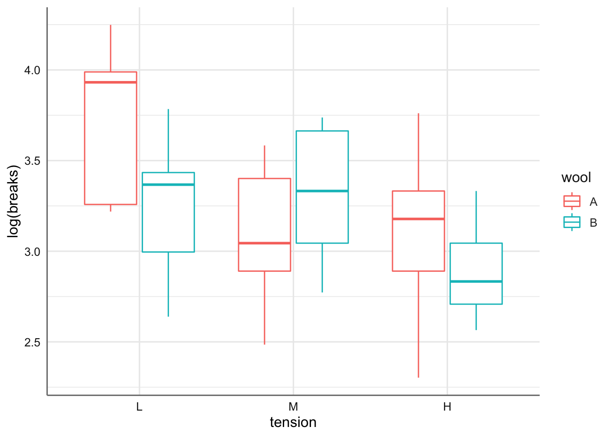
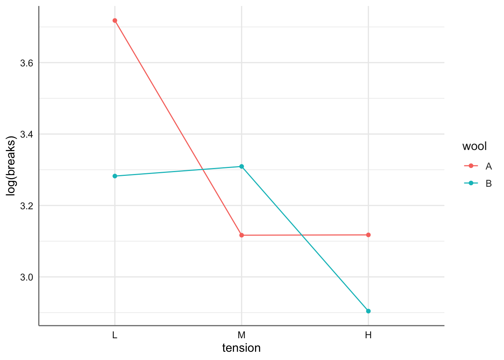
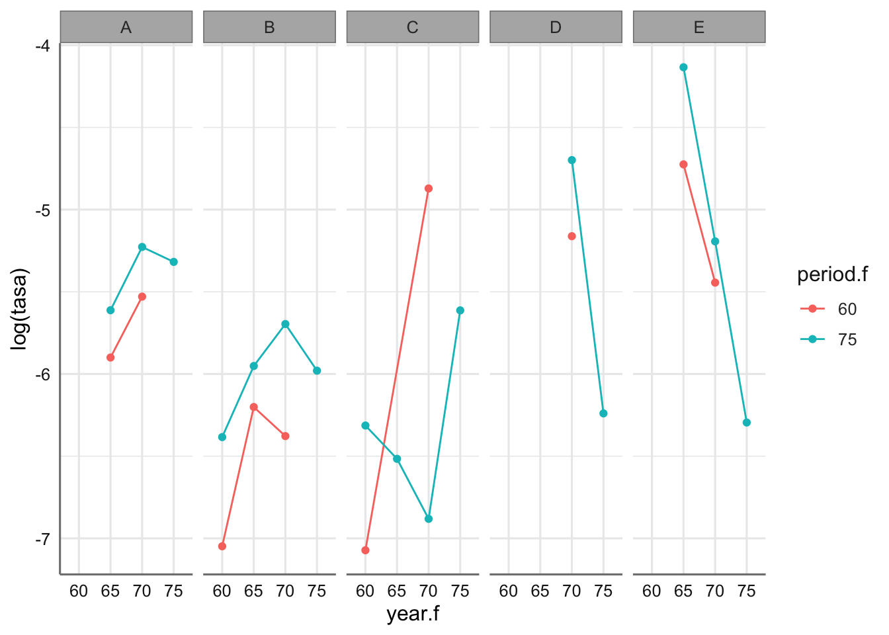
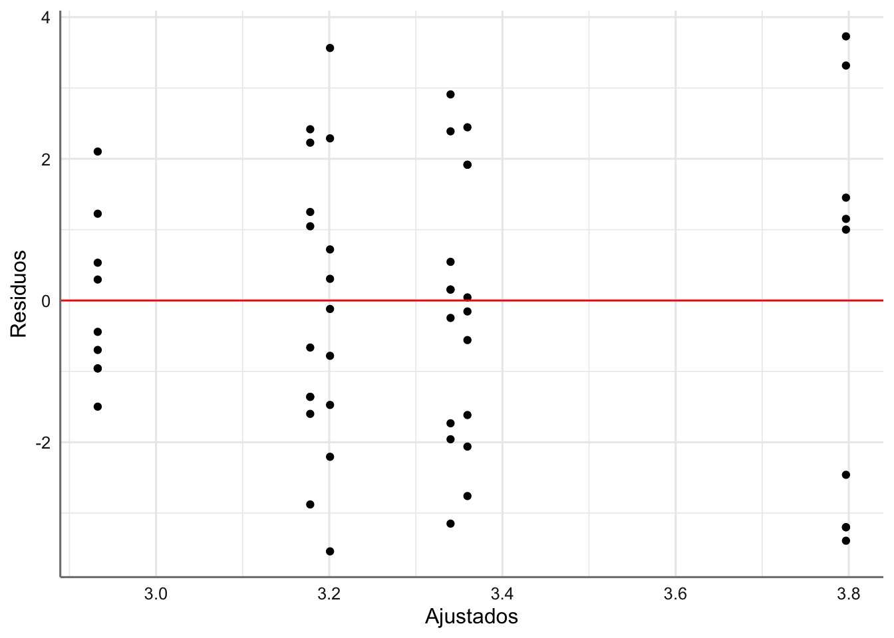
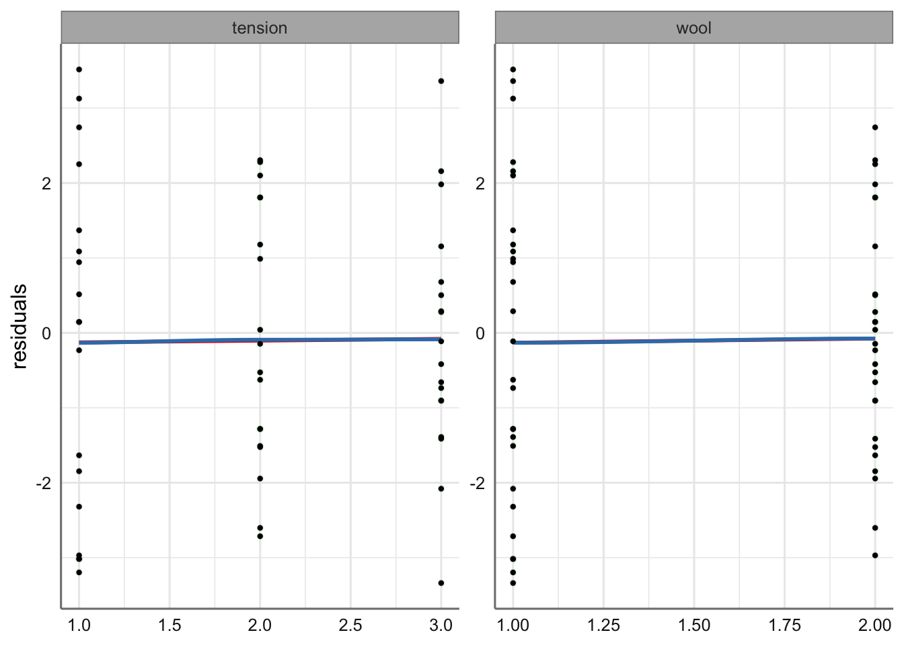
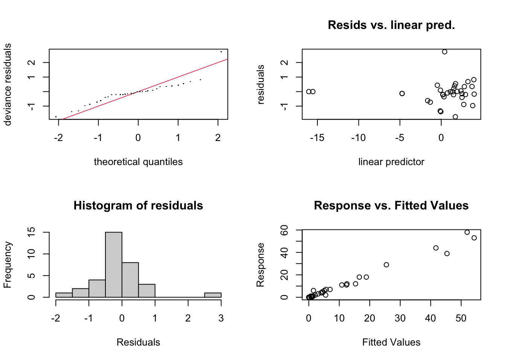
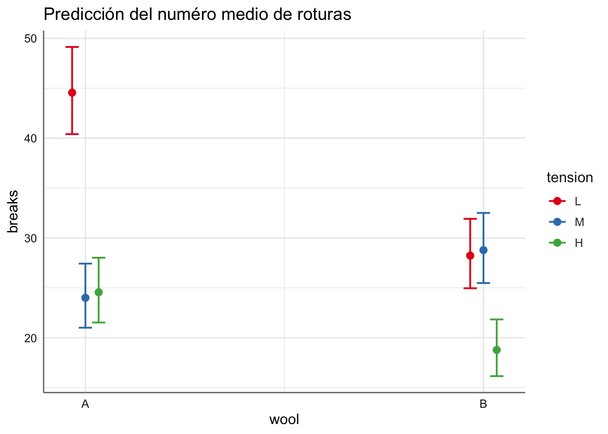
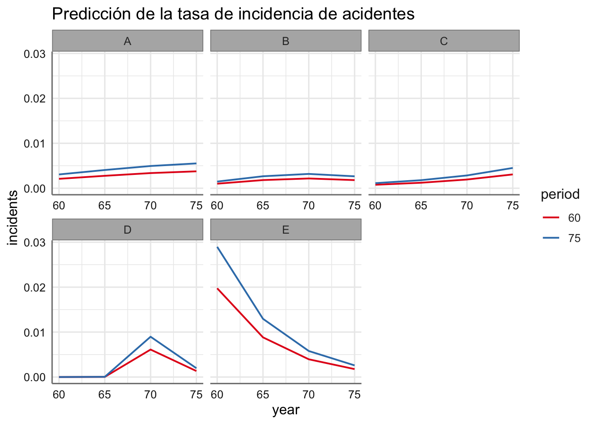

# GLM Poisson {#glmpoisson}

Son frecuentes los datos discretos que provienen de conteos de sucesos que se producen por azar con cierta frecuencia y son modelizables en términos de tasas de incidencia que dependen de ciertas variables predictoras. Para modelizar este tipo de datos se utiliza la distribución de Poisson, $X \sim Po(\mu)$, donde $\mu$ representa el número medio de ocurrencias, de forma que:

$$E(X) = \mu \quad \text{ y } \quad  V(X) = \mu.$$ 

El parámetro $\mu$ requiere una definición cuidadosa. A menudo es necesario describirlo como una tasa; por ejemplo, el número promedio de clientes que compran un particular producto de cada 100 clientes que ingresan a la tienda. De manera más general, la tasa se especifica en términos de unidades de "exposición" o en términos de años-persona 'en riesgo', por ejemplo, el número de personas que sufren cierta enfermedad sobre el total de personas para un instante de tiempo determinado. El efecto de las variables predictoras sobre la respuesta se modeliza valorando su efecto sobre $\mu$.

Sea $Y_1, Y_2,..., Y_n$ un conjunto de variables aleatorias Poisson, donde $Y_i$ representa el número de eventos observados a partir de la exposición $n_i$ para el i-ésimo patrón de covariables. En esta situación el valor esperado de $Y_i$ se puede escribir como:

$$E(Y_i) = \mu_i = n_i \lambda_i,$$
donde $\lambda_i$ representa la tasa de incidencia para el patrón i-ésimo.

En este tipo de modelos es muy habitual trabajar con variables categóricas de tipo ordinal. Dichas variables pueden ser incorporadas en el modelo como factores pero en ocasiones interesa introducirlas como numéricas para captar las posibles tendencias de la respuesta conforme aumenta la relevancia del factor. Recordemos que una variable categórica ordinal se puede obtener siempre a partir de una variable de tipo numérico. Para poder hacer esto introducimos un código numérico artificial asociado con cada categoría. Disponemos de dos alternativas:

* Asignar un código continuo: 1, 2, 3,... donde los valores más bajos se asocian con los niveles más bajos de la variable categórica.
* Cuando la variable categórica viene dada en términos de un intervalo se puede usar el punto medio de dicho intervalo para establecer el código numérico.

De hecho, en el análisis descriptivo inicial de los datos (sobre todo en los gráficos) esta forma de proceder permite analizar con más detalle la evolución del factor ordinal en la respuesta.

## Bancos de datos

A continuación se epresentan los ancos de datos con los que iremos trabajando.

### Telas 

Se recogen los resultados de un experimento para determinar el efecto del tipo de lana (A o B) y la tensión (baja, media o alta) en el número de roturas de deformación en la fabricación de telas. Se recopilaron datos de nueve telares para cada combinación de configuraciones. Las variables consideradas son:

* `breaks` (número de roturas), 
* `wool` (tipo de lana),  
* `tension` (tensión de la lana). 

La pregunta de interés es si resulta posible predecir el número de roturas en función del tipo de lana y de la tensión.

En este caso la exposición a riesgo es constante ($n_i =1$) de forma que $log(n_i) = 0$ desapareciendo de la especificación del modelo. Por tanto, se considera que las posibles predictoras influyen directamente sobre $\mu_i = breaks_i$.

En primer lugar cargamos los datos de la librería `datasets` 


```r
roturas <- warpbreaks
str(roturas)
```

```
## 'data.frame':	54 obs. of  3 variables:
##  $ breaks : num  26 30 54 25 70 52 51 26 67 18 ...
##  $ wool   : Factor w/ 2 levels "A","B": 1 1 1 1 1 1 1 1 1 1 ...
##  $ tension: Factor w/ 3 levels "L","M","H": 1 1 1 1 1 1 1 1 1 2 ...
```

Para la representación gráfica y análisis de este banco de datos introducimos una variable codificada para el factor ordinal `tension` mediante un código continuo:


```r
# Creamos código asociado a cada nivel del factor y la variable asociada
roturas <- roturas %>% 
  mutate(t1 = ifelse(tension == "L", 1, 0)) %>%
  mutate(t2 = ifelse(tension == "M", 2, 0)) %>%
  mutate(t3 = ifelse(tension == "H", 3, 0)) %>%
  mutate(tension.num = t1 + t2 + t3) 
# Nos quedamos con las variables de interés
roturas <- dplyr::select(roturas,c("breaks", "wool", "tension", "tension.num"))
```

Representamos la incidencia (en este caso $n_i = 1$) que corresponde con la variable `breaks`, es decir, representamos el logaritmo de la incidencia con respecto a las predictoras, para valorar la linealidad del efecto.


```r
# Utilizamos las dos variables categóricas
ggplot(roturas,aes(x = tension, y = log(breaks), color = wool)) + 
  geom_boxplot()
```



En el gráfico se aprecia cierta tendencia con la tensión, pero no tanto con el tipo de lana. Realizamos el gráfico de interacción con las medias para las combinaciones de ambos factores. 


```r
ggplot(roturas, aes(x = tension, y = log(breaks), group = wool, color = wool)) +
  stat_summary(fun = mean, geom = "point") +
  stat_summary(fun = mean, geom = "line")
```



Se puede ver un efecto conjunto entre `tension` y `wool`. Parece bastante claro que deberemos considerar un efecto de interacción para este modelo. De hecho, se aprecian curvas descendientes con `tension` (indicando que las telas sufren menos roturas a mayor tensión) no apreciándose efecto lineal lo que puede provocar que no se verifiquen las hipótesis del modelo, y que sea necesario introducir ciertas tendencias en las variables predictoras. En el tipo de lana resulta imposible hacer esto porque es una variable categórica nominal, pero si podríamos hacerlo con `tension` si consideramos la variable numérica construida a partir de ella. 

### Barcos 

En este banco de datos se analizan lo datos proporcionados por la aseguradora Lloyd's con respecto al número de incidentes causados por las olas en cierto componente de los buques cargueros. El banco de datos contiene información sobre: 

* `type` (el tipo de barco, codificado de A hasta E), 
* `year` (el año de construcción del barco en los periodos 1960-64, 65-69, 70-74, 75-79 codificados como 60, 65, 70, 75), 
* `period` (período de operación del barco 1960-74, 75-79 codificados como 60, 75), 
* `service` (meses de servicio),  
* `incidents` (número de incidentes sufridos).

La pregunta de interés es si resulta posible predecir el número de incidentes en función de las predictoras consideradas. 

En este caso la exposición a riesgo no es constante, ya que cuanto mayor sea el tiempo de servicio de un barco parece más probable que sufra un incidente. En este caso $n_i = service_i$ de forma que $log(n_i) = log(service_i)$ remarcando el hecho de que el riesgo aumenta cuando lo hace el tiempo de servicio. El offset no se puede estimar ya que es fijo, y modelizamos la tasa de riesgo $\lambda_i$ con la información de las variables predictoras. En la práctica dicha tasa debe aproximarse a $\lambda_i = incidents_i/service_i$, por lo que representamos dicha variable con respecto a las predictoras para el planteamiento del modelo.

Comenzamos con la lectura del banco de datos creando factores a partir de los códigos numéricos de las variables `year` y `period`.


```r
barcos <- ships
# Generamos factores a partir de los códigos numéricos
barcos$year.f <- as.factor(barcos$year)
barcos$period.f <- as.factor(barcos$period)
```

Un análisis descriptivo inicial del banco de datos muestra que hay barcos que tienen 0 meses de servicio. Estos barcos deben ser eliminados del análisis, ya que al tratar de ajustar la tasa de incidentes dividiríamos por un valor de 0, lo que provocaría la imposibilidad de un ajuste adecuado. Seleccionamos todos los barcos con tiempo de servicio mayor que cero y obtenemos la tasa de incidencia a partir de la relación entre el número de incidentes y las horas de servicio de cada barco.


```r
barcos <- barcos %>% 
  filter(service>0) %>%
  mutate(tasa = incidents/service)
```

Realizamos el gráfico de la media del logaritmo de la tasa para `type`, `year` y `period`. En realidad trabajamos con los factores para representar adecuadamente el gráfico de interacción. 


```r
ggplot(barcos, aes(x = year.f, y = log(tasa), group = period.f, color = period.f)) +
  stat_summary(fun = mean, geom = "point") +
  stat_summary(fun = mean, geom = "line") +
  facet_grid(~type) 
```



Se observa que los tipos de barco se comportan de forma diferente en cuanto a la tasa de incidentes. Los barcos del tipo "E" son los que tienen tasas más altas. En cuanto al año de fabricación y el periodo de funcionamiento varían con el tipo de barco. Mientras que para los tipos "A" y "B" se observan comportamientos muy similares no ocurre los mismo para el tipo "C". De nuevo habrá que vigilar el efecto para asegurar la linealidad del predictor lineal asociado al GLM considerado.

En este caso nos podemos plantear un modelo con tres predictoras de tipo factor y considerar sus posibles interacciones (lo que nos da un modelo bastante complejo), u optar por un modelo más sencillo donde consideramos `year` y `period` como numéricas. Obtenemos la tabla cruzada de ambos factores para ver si hay alguna combinación que no se da, y por tanto desechar el modelo de interacción al que darían lugar.


```r
table(barcos$year.f, barcos$period.f)
```

```
##     
##      60 75
##   60  5  4
##   65  5  5
##   70  5  5
##   75  0  5
```

Se observa que la combinación `year_f = 75` y `period_f = 60` no tiene ningún dato. Si consideráramos un modelo con dicha interacción resultaría imposible obtener la estimación de dicho modelo. Para evitar ese problema, y dado el carácter ordinal de los factores, consideramos sus versiones numéricas para la estimación del modelo correspondiente.

## Modelo Teórico

El modelo lineal generalizado para variables aleatorias Poisson o más conocido como regresión de Poisson se puede especificar siguiendo la definición establecida en el punto anterior como:

* La distribución de cada variable aleatoria $Y_i$ viene dada por
$$Y_i \sim Po(\mu_i)$$
* El valor medio de cada variable viene dado por:
$$E(Y_i) = \mu_i = n_i\lambda_i$$
* Si consideramos un conjunto $x_{i1}, x_{i2},...,x_{ip}$ de $p$ variables predictoras que pueden afectar el comportamiento de $Y_i$ asumimos que:
$$\lambda_i = exp(\beta_0 + \beta_1 x_{i1} + \beta_2 x_{i2} + ...+ \beta_p x_{ip}),$$
donde cada $\beta$ representa el efecto de la correspondiente variable predictora.

En esta situación y tomando como función de enlace el logaritmo tenemos que:

$$log(E(Y_i)) = log(\mu_i) = log(n_i\lambda_i) = log(n_i) + log(\lambda_i)= log(n_i) + \beta_0 + \beta_1 x_{i1} + \beta_2 x_{i2} + ...+ \beta_p x_{ip}$$

donde tenemos la expresión del modelo lineal generalizado. La única diferencia de este modelo con los vistos hasta ahora es la inclusión de un término fijo en el modelo ($log(n_i)$) que actúa como "offset" y hace referencia al logaritmo de sujetos en riesgo para la combinación de predictoras correspondiente al índice $i$. Este término se debe incorporar en la estimación del modelo como una constante para cada $i$. 

Respecto de la interpretación de dichos coeficientes se puede demostrar que $exp(\beta_j)$ representa el riesgo relativo ($RR$) sobre la tasa de incidencia de los sucesos asociado a un incremento de una unidad en la covariable $x_j$. Es similar a la interpretación que hacíamos en los modelos lineales, salvo el cambio de escala debido a la transformación logaritmo sobre la media de la respuesta. 

Para una variable de tipo numérico se define el riesgo relativo al incrementar una unidad el valor de la variable predictora $X$ como:

$$RR(X) = \frac{\lambda(X = x+1)}{\lambda(X = x+1)} = exp(\beta_x)$$

mientras que el riesgo relativo para valorar el cambio entre dos niveles de una variable categórica (A y B) se define como:

$$RR(X_{AB}) = \frac{\lambda(X = B)}{\lambda(X = A)} = exp(\text{coeficiente asociado a B} - \text{coeficiente asociado a A})$$

En ambos casos, el riesgo relativo aumenta cuando $RR > 1$ y disminuye cuando $RR < 1$. Tenemos el mismo riesgo cuando $RR = 1$. De esta forma tenemos un indicador de cuanto aumenta la respuesta en función de las predictoras consideradas.


## Estimación y bondad de ajuste del modelo

Como hemos hecho hasta ahora, en un primer momento estimamos el modelo más complejo posible para proceder posteriormente con la selección de aquellos efectos que de verdad resultan significativos. Para la estimación utilizamos la función `glm` con las especificaciones siguientes:


```r
glm(modelo,family = poisson(), offset = value, data_set)
```

La diferencia principal con los modelos de regresión logística es la introducción de los offsets en el ajuste del modelo. Si no disponemos de offsets no se especificarán en el ajuste del modelo.

Para el estudio de bondad de ajuste utilizamos el test $\chi^2$ basado en la deviance del modelo. En este caso dejamos los calculo para el lector. También podemos saber la capacidad explicativa (`explained deviance`) del modelo que se puede obtener con la función `summary(m)` donde `m` es el modelo que deseamos estudiar.

### Ejemplos

Procedemos con el análisis de cada uno de los ejemplos.

#### Telas

Para este banco de datos ajustamos dos modelos completos considerando la tensión como factor (`tension`) o como variable numérica (`tension.num`). 

##### Modelo con tension

Para este banco de datos ajustamos dos modelos completos considerando la tensión como factor o como variable numérica. Comenzamos con el modelo considerando todas las predictoras como factores. Consideramos tanto los efectos asociados a cada factor como la posible interacción entre ellos. En este caso no hay offsets. El modelo propuesto es:

$$breaks \sim wool*tension$$

que se puede ajustar mediante


```r
fit.telas.cat <-glm(breaks ~ wool*tension,
                    family = poisson(), 
                    data = roturas)
```

Al igual que ocurría con los modelos de regresión logística hacemos uso de la función `tab_model` para obtener las estimaciones del predictor lineal y de la tasa de incidencia. Analizamos en primer lugar el predictor lineal.


```r
tab_model(fit.telas.cat, 
          transform = NULL, 
          show.r2 = FALSE)
```

<table style="border-collapse:collapse; border:none;">
<tr>
<th style="border-top: double; text-align:center; font-style:normal; font-weight:bold; padding:0.2cm;  text-align:left; ">&nbsp;</th>
<th colspan="3" style="border-top: double; text-align:center; font-style:normal; font-weight:bold; padding:0.2cm; ">breaks</th>
</tr>
<tr>
<td style=" text-align:center; border-bottom:1px solid; font-style:italic; font-weight:normal;  text-align:left; ">Predictors</td>
<td style=" text-align:center; border-bottom:1px solid; font-style:italic; font-weight:normal;  ">Log-Mean</td>
<td style=" text-align:center; border-bottom:1px solid; font-style:italic; font-weight:normal;  ">CI</td>
<td style=" text-align:center; border-bottom:1px solid; font-style:italic; font-weight:normal;  ">p</td>
</tr>
<tr>
<td style=" padding:0.2cm; text-align:left; vertical-align:top; text-align:left; ">(Intercept)</td>
<td style=" padding:0.2cm; text-align:left; vertical-align:top; text-align:center;  ">3.80</td>
<td style=" padding:0.2cm; text-align:left; vertical-align:top; text-align:center;  ">3.70&nbsp;&ndash;&nbsp;3.89</td>
<td style=" padding:0.2cm; text-align:left; vertical-align:top; text-align:center;  "><strong>&lt;0.001</strong></td>
</tr>
<tr>
<td style=" padding:0.2cm; text-align:left; vertical-align:top; text-align:left; ">wool [B]</td>
<td style=" padding:0.2cm; text-align:left; vertical-align:top; text-align:center;  ">&#45;0.46</td>
<td style=" padding:0.2cm; text-align:left; vertical-align:top; text-align:center;  ">&#45;0.61&nbsp;&ndash;&nbsp;-0.30</td>
<td style=" padding:0.2cm; text-align:left; vertical-align:top; text-align:center;  "><strong>&lt;0.001</strong></td>
</tr>
<tr>
<td style=" padding:0.2cm; text-align:left; vertical-align:top; text-align:left; ">tension [M]</td>
<td style=" padding:0.2cm; text-align:left; vertical-align:top; text-align:center;  ">&#45;0.62</td>
<td style=" padding:0.2cm; text-align:left; vertical-align:top; text-align:center;  ">&#45;0.79&nbsp;&ndash;&nbsp;-0.45</td>
<td style=" padding:0.2cm; text-align:left; vertical-align:top; text-align:center;  "><strong>&lt;0.001</strong></td>
</tr>
<tr>
<td style=" padding:0.2cm; text-align:left; vertical-align:top; text-align:left; ">tension [H]</td>
<td style=" padding:0.2cm; text-align:left; vertical-align:top; text-align:center;  ">&#45;0.60</td>
<td style=" padding:0.2cm; text-align:left; vertical-align:top; text-align:center;  ">&#45;0.76&nbsp;&ndash;&nbsp;-0.43</td>
<td style=" padding:0.2cm; text-align:left; vertical-align:top; text-align:center;  "><strong>&lt;0.001</strong></td>
</tr>
<tr>
<td style=" padding:0.2cm; text-align:left; vertical-align:top; text-align:left; ">wool [B] * tension [M]</td>
<td style=" padding:0.2cm; text-align:left; vertical-align:top; text-align:center;  ">0.64</td>
<td style=" padding:0.2cm; text-align:left; vertical-align:top; text-align:center;  ">0.40&nbsp;&ndash;&nbsp;0.88</td>
<td style=" padding:0.2cm; text-align:left; vertical-align:top; text-align:center;  "><strong>&lt;0.001</strong></td>
</tr>
<tr>
<td style=" padding:0.2cm; text-align:left; vertical-align:top; text-align:left; ">wool [B] * tension [H]</td>
<td style=" padding:0.2cm; text-align:left; vertical-align:top; text-align:center;  ">0.19</td>
<td style=" padding:0.2cm; text-align:left; vertical-align:top; text-align:center;  ">&#45;0.07&nbsp;&ndash;&nbsp;0.44</td>
<td style=" padding:0.2cm; text-align:left; vertical-align:top; text-align:center;  ">0.147</td>
</tr>
<tr>
<td style=" padding:0.2cm; text-align:left; vertical-align:top; text-align:left; padding-top:0.1cm; padding-bottom:0.1cm; border-top:1px solid;">Observations</td>
<td style=" padding:0.2cm; text-align:left; vertical-align:top; padding-top:0.1cm; padding-bottom:0.1cm; text-align:left; border-top:1px solid;" colspan="3">54</td>
</tr>

</table>

Los coeficientes del modelo resultan significativos salvo en la combinación `wool B` y `tension H`. Ajustamos el modelo sin interacción de forma que las ecuaciones del predictor lineal para este nuevo modelo son:

$$\left\{\begin{array}{ll} 
log(breaks)_{woolA;tensionL} & = 3.80 \\ 
log(breaks)_{woolA;tensionM} & = 3.80 - 0.62 = 3.18 \\
log(breaks)_{woolA;tensionH} & = 3.80 - 0.60 = 3.20 \\
log(breaks)_{woolB;tensionL} & = 3.80 - 0.46 = 3.34 \\ 
log(breaks)_{woolB;tensionM} & = 3.80 - 0.46 - 0.62 + 0.64 = 3.36 \\
log(breaks)_{woolB;tensionH} & = 3.80 - 0.46 - 0.60 + 0.19 = 2.93 \\
\end{array}\right.$$

El proceso de estimación nos proporciona que el mayor número de roturas se produce para la combinación `wool = A` y `tension = L`, mientras que el menor número se estima para la combinación `wool = B` y `tension = H`. 

Obtenemos ahora las tasas de incidencia de rotura asociados con este modelo: 


```r
tab_model(fit.telas.cat, 
          show.r2 = FALSE)
```

<table style="border-collapse:collapse; border:none;">
<tr>
<th style="border-top: double; text-align:center; font-style:normal; font-weight:bold; padding:0.2cm;  text-align:left; ">&nbsp;</th>
<th colspan="3" style="border-top: double; text-align:center; font-style:normal; font-weight:bold; padding:0.2cm; ">breaks</th>
</tr>
<tr>
<td style=" text-align:center; border-bottom:1px solid; font-style:italic; font-weight:normal;  text-align:left; ">Predictors</td>
<td style=" text-align:center; border-bottom:1px solid; font-style:italic; font-weight:normal;  ">Incidence Rate Ratios</td>
<td style=" text-align:center; border-bottom:1px solid; font-style:italic; font-weight:normal;  ">CI</td>
<td style=" text-align:center; border-bottom:1px solid; font-style:italic; font-weight:normal;  ">p</td>
</tr>
<tr>
<td style=" padding:0.2cm; text-align:left; vertical-align:top; text-align:left; ">(Intercept)</td>
<td style=" padding:0.2cm; text-align:left; vertical-align:top; text-align:center;  ">44.56</td>
<td style=" padding:0.2cm; text-align:left; vertical-align:top; text-align:center;  ">40.34&nbsp;&ndash;&nbsp;49.06</td>
<td style=" padding:0.2cm; text-align:left; vertical-align:top; text-align:center;  "><strong>&lt;0.001</strong></td>
</tr>
<tr>
<td style=" padding:0.2cm; text-align:left; vertical-align:top; text-align:left; ">wool [B]</td>
<td style=" padding:0.2cm; text-align:left; vertical-align:top; text-align:center;  ">0.63</td>
<td style=" padding:0.2cm; text-align:left; vertical-align:top; text-align:center;  ">0.54&nbsp;&ndash;&nbsp;0.74</td>
<td style=" padding:0.2cm; text-align:left; vertical-align:top; text-align:center;  "><strong>&lt;0.001</strong></td>
</tr>
<tr>
<td style=" padding:0.2cm; text-align:left; vertical-align:top; text-align:left; ">tension [M]</td>
<td style=" padding:0.2cm; text-align:left; vertical-align:top; text-align:center;  ">0.54</td>
<td style=" padding:0.2cm; text-align:left; vertical-align:top; text-align:center;  ">0.46&nbsp;&ndash;&nbsp;0.63</td>
<td style=" padding:0.2cm; text-align:left; vertical-align:top; text-align:center;  "><strong>&lt;0.001</strong></td>
</tr>
<tr>
<td style=" padding:0.2cm; text-align:left; vertical-align:top; text-align:left; ">tension [H]</td>
<td style=" padding:0.2cm; text-align:left; vertical-align:top; text-align:center;  ">0.55</td>
<td style=" padding:0.2cm; text-align:left; vertical-align:top; text-align:center;  ">0.47&nbsp;&ndash;&nbsp;0.65</td>
<td style=" padding:0.2cm; text-align:left; vertical-align:top; text-align:center;  "><strong>&lt;0.001</strong></td>
</tr>
<tr>
<td style=" padding:0.2cm; text-align:left; vertical-align:top; text-align:left; ">wool [B] * tension [M]</td>
<td style=" padding:0.2cm; text-align:left; vertical-align:top; text-align:center;  ">1.89</td>
<td style=" padding:0.2cm; text-align:left; vertical-align:top; text-align:center;  ">1.49&nbsp;&ndash;&nbsp;2.41</td>
<td style=" padding:0.2cm; text-align:left; vertical-align:top; text-align:center;  "><strong>&lt;0.001</strong></td>
</tr>
<tr>
<td style=" padding:0.2cm; text-align:left; vertical-align:top; text-align:left; ">wool [B] * tension [H]</td>
<td style=" padding:0.2cm; text-align:left; vertical-align:top; text-align:center;  ">1.21</td>
<td style=" padding:0.2cm; text-align:left; vertical-align:top; text-align:center;  ">0.94&nbsp;&ndash;&nbsp;1.56</td>
<td style=" padding:0.2cm; text-align:left; vertical-align:top; text-align:center;  ">0.147</td>
</tr>
<tr>
<td style=" padding:0.2cm; text-align:left; vertical-align:top; text-align:left; padding-top:0.1cm; padding-bottom:0.1cm; border-top:1px solid;">Observations</td>
<td style=" padding:0.2cm; text-align:left; vertical-align:top; padding-top:0.1cm; padding-bottom:0.1cm; text-align:left; border-top:1px solid;" colspan="3">54</td>
</tr>

</table>

Identificamos de esta forma los efectos del modelo que producen un mayor riesgo relativo (valores mayores que 1) con respecto a la combinación que se utiliza como referencia en el modelo que es `wool = A` y `tension = L`. En realidad la tabla presenta los valores de $exp(\beta)$ para cada uno de los efectos del modelo con las que podemos obtener las tasas de incidencia:

$$\left\{\begin{array}{ll} 
breaks_{woolA;tensionL} & = 44.56 \\ 
breaks_{woolA;tensionM} & = 44.56 * 0.54 = 24.06 \\
breaks_{woolA;tensionH} & = 44.56 * 0.55 = 24.51 \\
breaks_{woolB;tensionL} & = 44.56 * 0.63 =28.07\\ 
breaks_{woolB;tensionM} & = 44.56 * 0.63 * 0.54 * 1.89 = 28.65 \\
breaks_{woolB;tensionH} & = 44.56 * 0.63 * 0.55 * 1.21 = 18.68 \\
\end{array}\right.$$

A partir de las tasas de incidencia es posible estimar los riesgos relativos para la combinación de los dos factores. Comparamos las combinaciones `{woolA;tensionL}` y  `{woolA;tensionH}` de forma que el riesgo relativo es:

$$
RR_{(A-L; A-H)} = \frac{44.56}{24.51} = 1.81
$$

Se concluye que el riesgo de rotura de la combinación `{woolA;tensionL}` es casi el doble que el de la combinación `{woolA;tensionH}`. 

##### Modelo con tension.num

Ajustamos ahora el modelo asumiendo la variable `tensión` con su código numérico (para valorar el efecto ordinal del factor). El modelo propuesto es:

$$breaks \sim wool*tension.num$$

Ajustamos el modelo y estudíamos las ecuaciones de estimación obtenidas


```r
fit.telas.num <-glm(breaks ~ wool*tension.num,
                family = poisson(), 
                data = roturas)
tab_model(fit.telas.num, 
          transform = NULL, 
          show.r2 = FALSE)                
```

<table style="border-collapse:collapse; border:none;">
<tr>
<th style="border-top: double; text-align:center; font-style:normal; font-weight:bold; padding:0.2cm;  text-align:left; ">&nbsp;</th>
<th colspan="3" style="border-top: double; text-align:center; font-style:normal; font-weight:bold; padding:0.2cm; ">breaks</th>
</tr>
<tr>
<td style=" text-align:center; border-bottom:1px solid; font-style:italic; font-weight:normal;  text-align:left; ">Predictors</td>
<td style=" text-align:center; border-bottom:1px solid; font-style:italic; font-weight:normal;  ">Log-Mean</td>
<td style=" text-align:center; border-bottom:1px solid; font-style:italic; font-weight:normal;  ">CI</td>
<td style=" text-align:center; border-bottom:1px solid; font-style:italic; font-weight:normal;  ">p</td>
</tr>
<tr>
<td style=" padding:0.2cm; text-align:left; vertical-align:top; text-align:left; ">(Intercept)</td>
<td style=" padding:0.2cm; text-align:left; vertical-align:top; text-align:center;  ">4.06</td>
<td style=" padding:0.2cm; text-align:left; vertical-align:top; text-align:center;  ">3.89&nbsp;&ndash;&nbsp;4.22</td>
<td style=" padding:0.2cm; text-align:left; vertical-align:top; text-align:center;  "><strong>&lt;0.001</strong></td>
</tr>
<tr>
<td style=" padding:0.2cm; text-align:left; vertical-align:top; text-align:left; ">wool [B]</td>
<td style=" padding:0.2cm; text-align:left; vertical-align:top; text-align:center;  ">&#45;0.46</td>
<td style=" padding:0.2cm; text-align:left; vertical-align:top; text-align:center;  ">&#45;0.71&nbsp;&ndash;&nbsp;-0.21</td>
<td style=" padding:0.2cm; text-align:left; vertical-align:top; text-align:center;  "><strong>&lt;0.001</strong></td>
</tr>
<tr>
<td style=" padding:0.2cm; text-align:left; vertical-align:top; text-align:left; ">tension num</td>
<td style=" padding:0.2cm; text-align:left; vertical-align:top; text-align:center;  ">&#45;0.33</td>
<td style=" padding:0.2cm; text-align:left; vertical-align:top; text-align:center;  ">&#45;0.41&nbsp;&ndash;&nbsp;-0.24</td>
<td style=" padding:0.2cm; text-align:left; vertical-align:top; text-align:center;  "><strong>&lt;0.001</strong></td>
</tr>
<tr>
<td style=" padding:0.2cm; text-align:left; vertical-align:top; text-align:left; ">wool [B] * tension num</td>
<td style=" padding:0.2cm; text-align:left; vertical-align:top; text-align:center;  ">0.14</td>
<td style=" padding:0.2cm; text-align:left; vertical-align:top; text-align:center;  ">0.01&nbsp;&ndash;&nbsp;0.27</td>
<td style=" padding:0.2cm; text-align:left; vertical-align:top; text-align:center;  "><strong>0.029</strong></td>
</tr>
<tr>
<td style=" padding:0.2cm; text-align:left; vertical-align:top; text-align:left; padding-top:0.1cm; padding-bottom:0.1cm; border-top:1px solid;">Observations</td>
<td style=" padding:0.2cm; text-align:left; vertical-align:top; padding-top:0.1cm; padding-bottom:0.1cm; text-align:left; border-top:1px solid;" colspan="3">54</td>
</tr>

</table>

Todos los coeficientes estimados resultan significativos y las ecuaciones de estimación vienen dadas por:

$$\left\{\begin{array}{ll} 
log(breaks_{woolA}) & = 4.06 - 0.33*tension.num \\ 
log(breaks_{woolB}) & = 3.60 - 0.19*tension.num\\ 
\end{array}\right.$$

Dado que los coeficientes asociados a `tension.num` son negativos, el efecto de la tensión es menos relevante para `wool = A` que para `wool = B`, de forma que el nivel de roturas disminuye al aumentar la tensión.

Obtenemos las incidencias asociadas con el modelo

```r
tab_model(fit.telas.num, 
          show.r2 = FALSE)                
```

<table style="border-collapse:collapse; border:none;">
<tr>
<th style="border-top: double; text-align:center; font-style:normal; font-weight:bold; padding:0.2cm;  text-align:left; ">&nbsp;</th>
<th colspan="3" style="border-top: double; text-align:center; font-style:normal; font-weight:bold; padding:0.2cm; ">breaks</th>
</tr>
<tr>
<td style=" text-align:center; border-bottom:1px solid; font-style:italic; font-weight:normal;  text-align:left; ">Predictors</td>
<td style=" text-align:center; border-bottom:1px solid; font-style:italic; font-weight:normal;  ">Incidence Rate Ratios</td>
<td style=" text-align:center; border-bottom:1px solid; font-style:italic; font-weight:normal;  ">CI</td>
<td style=" text-align:center; border-bottom:1px solid; font-style:italic; font-weight:normal;  ">p</td>
</tr>
<tr>
<td style=" padding:0.2cm; text-align:left; vertical-align:top; text-align:left; ">(Intercept)</td>
<td style=" padding:0.2cm; text-align:left; vertical-align:top; text-align:center;  ">57.72</td>
<td style=" padding:0.2cm; text-align:left; vertical-align:top; text-align:center;  ">48.79&nbsp;&ndash;&nbsp;68.07</td>
<td style=" padding:0.2cm; text-align:left; vertical-align:top; text-align:center;  "><strong>&lt;0.001</strong></td>
</tr>
<tr>
<td style=" padding:0.2cm; text-align:left; vertical-align:top; text-align:left; ">wool [B]</td>
<td style=" padding:0.2cm; text-align:left; vertical-align:top; text-align:center;  ">0.63</td>
<td style=" padding:0.2cm; text-align:left; vertical-align:top; text-align:center;  ">0.49&nbsp;&ndash;&nbsp;0.81</td>
<td style=" padding:0.2cm; text-align:left; vertical-align:top; text-align:center;  "><strong>&lt;0.001</strong></td>
</tr>
<tr>
<td style=" padding:0.2cm; text-align:left; vertical-align:top; text-align:left; ">tension num</td>
<td style=" padding:0.2cm; text-align:left; vertical-align:top; text-align:center;  ">0.72</td>
<td style=" padding:0.2cm; text-align:left; vertical-align:top; text-align:center;  ">0.66&nbsp;&ndash;&nbsp;0.78</td>
<td style=" padding:0.2cm; text-align:left; vertical-align:top; text-align:center;  "><strong>&lt;0.001</strong></td>
</tr>
<tr>
<td style=" padding:0.2cm; text-align:left; vertical-align:top; text-align:left; ">wool [B] * tension num</td>
<td style=" padding:0.2cm; text-align:left; vertical-align:top; text-align:center;  ">1.15</td>
<td style=" padding:0.2cm; text-align:left; vertical-align:top; text-align:center;  ">1.01&nbsp;&ndash;&nbsp;1.30</td>
<td style=" padding:0.2cm; text-align:left; vertical-align:top; text-align:center;  "><strong>0.029</strong></td>
</tr>
<tr>
<td style=" padding:0.2cm; text-align:left; vertical-align:top; text-align:left; padding-top:0.1cm; padding-bottom:0.1cm; border-top:1px solid;">Observations</td>
<td style=" padding:0.2cm; text-align:left; vertical-align:top; padding-top:0.1cm; padding-bottom:0.1cm; text-align:left; border-top:1px solid;" colspan="3">54</td>
</tr>

</table>

con estimaciones para cada nivel de `wool`: 

$$\left\{\begin{array}{ll} 
breaks_{woolA} & = 57.72 *0.72^{tension.num} \\ 
breaks_{woolB} & = (57.72*0.63) *(0.72*1.15)^{tension.num} = 36.36*0.83^{tension.num}\\
\end{array}\right.$$

de forma que el riesgo relativo entre los dos tipos de `wool` viene dado por:

$$
RR_{(A;B)} = \frac{57.72*0.72^{tension.num}}{36.36*0.83^{tension.num}} = 1.59*0.87^{tension.num}
$$

cuyos valores son 1.38, 1.20 y 1.05 para los valores de tension 1, 2, y 3 respectivamente. Esto implica que el riesgo de rotura entre `wool = A` y `wool = B` se iguala (tiende a 1) cuando aumenta la tensión, aunque siempre es superior en `A` que en `B`.

Otras alternativas a este modelo serían considerar un modelo polinómico con `tension.num` para capturar la curvas observadas en los gráficos de medias o planteara un modelo de suavizado con ella y con interacción con `wool`. En estos materiales no exploramos estas posibilidades.

En el apartado de selección del modelo valoraremos los dos modelos construidos para determinar cual de ellos es mejor.

#### Barcos

Ajustamos el modelo utilizando las variables con los códigos numéricos en lugar de los factores. En este caso si disponemos de offset y el modelo planteado viene dado por:

$$incidents \sim offset(service) + type *(year + period)$$
En realidad la estimación de este modelo nos proporciona las tasas de incidentes $\lambda_i = incidents_i/service_i$. Realizamos el ajuste del modelo a partir del cual podemos obtener las ecuaciones de estimación por los diferentes niveles de `type`:


```r
fit.barcos.num <-glm(incidents ~ type *(year + period),
                 family = poisson(), 
                 offset = log(service), 
                 data = barcos)
tab_model(fit.barcos.num, 
          transform = NULL, 
          show.r2 = FALSE)   
```

<table style="border-collapse:collapse; border:none;">
<tr>
<th style="border-top: double; text-align:center; font-style:normal; font-weight:bold; padding:0.2cm;  text-align:left; ">&nbsp;</th>
<th colspan="3" style="border-top: double; text-align:center; font-style:normal; font-weight:bold; padding:0.2cm; ">incidents</th>
</tr>
<tr>
<td style=" text-align:center; border-bottom:1px solid; font-style:italic; font-weight:normal;  text-align:left; ">Predictors</td>
<td style=" text-align:center; border-bottom:1px solid; font-style:italic; font-weight:normal;  ">Log-Mean</td>
<td style=" text-align:center; border-bottom:1px solid; font-style:italic; font-weight:normal;  ">CI</td>
<td style=" text-align:center; border-bottom:1px solid; font-style:italic; font-weight:normal;  ">p</td>
</tr>
<tr>
<td style=" padding:0.2cm; text-align:left; vertical-align:top; text-align:left; ">(Intercept)</td>
<td style=" padding:0.2cm; text-align:left; vertical-align:top; text-align:center;  ">&#45;9.24</td>
<td style=" padding:0.2cm; text-align:left; vertical-align:top; text-align:center;  ">&#45;15.48&nbsp;&ndash;&nbsp;-3.32</td>
<td style=" padding:0.2cm; text-align:left; vertical-align:top; text-align:center;  "><strong>0.003</strong></td>
</tr>
<tr>
<td style=" padding:0.2cm; text-align:left; vertical-align:top; text-align:left; ">type [B]</td>
<td style=" padding:0.2cm; text-align:left; vertical-align:top; text-align:center;  ">&#45;2.27</td>
<td style=" padding:0.2cm; text-align:left; vertical-align:top; text-align:center;  ">&#45;8.44&nbsp;&ndash;&nbsp;4.20</td>
<td style=" padding:0.2cm; text-align:left; vertical-align:top; text-align:center;  ">0.480</td>
</tr>
<tr>
<td style=" padding:0.2cm; text-align:left; vertical-align:top; text-align:left; ">type [C]</td>
<td style=" padding:0.2cm; text-align:left; vertical-align:top; text-align:center;  ">&#45;2.94</td>
<td style=" padding:0.2cm; text-align:left; vertical-align:top; text-align:center;  ">&#45;15.11&nbsp;&ndash;&nbsp;8.30</td>
<td style=" padding:0.2cm; text-align:left; vertical-align:top; text-align:center;  ">0.620</td>
</tr>
<tr>
<td style=" padding:0.2cm; text-align:left; vertical-align:top; text-align:left; ">type [D]</td>
<td style=" padding:0.2cm; text-align:left; vertical-align:top; text-align:center;  ">1.54</td>
<td style=" padding:0.2cm; text-align:left; vertical-align:top; text-align:center;  ">&#45;10.03&nbsp;&ndash;&nbsp;11.47</td>
<td style=" padding:0.2cm; text-align:left; vertical-align:top; text-align:center;  ">0.773</td>
</tr>
<tr>
<td style=" padding:0.2cm; text-align:left; vertical-align:top; text-align:left; ">type [E]</td>
<td style=" padding:0.2cm; text-align:left; vertical-align:top; text-align:center;  ">13.40</td>
<td style=" padding:0.2cm; text-align:left; vertical-align:top; text-align:center;  ">3.63&nbsp;&ndash;&nbsp;23.14</td>
<td style=" padding:0.2cm; text-align:left; vertical-align:top; text-align:center;  "><strong>0.007</strong></td>
</tr>
<tr>
<td style=" padding:0.2cm; text-align:left; vertical-align:top; text-align:left; ">year</td>
<td style=" padding:0.2cm; text-align:left; vertical-align:top; text-align:center;  ">0.04</td>
<td style=" padding:0.2cm; text-align:left; vertical-align:top; text-align:center;  ">&#45;0.05&nbsp;&ndash;&nbsp;0.13</td>
<td style=" padding:0.2cm; text-align:left; vertical-align:top; text-align:center;  ">0.440</td>
</tr>
<tr>
<td style=" padding:0.2cm; text-align:left; vertical-align:top; text-align:left; ">period</td>
<td style=" padding:0.2cm; text-align:left; vertical-align:top; text-align:center;  ">0.02</td>
<td style=" padding:0.2cm; text-align:left; vertical-align:top; text-align:center;  ">&#45;0.03&nbsp;&ndash;&nbsp;0.08</td>
<td style=" padding:0.2cm; text-align:left; vertical-align:top; text-align:center;  ">0.496</td>
</tr>
<tr>
<td style=" padding:0.2cm; text-align:left; vertical-align:top; text-align:left; ">type [B] * year</td>
<td style=" padding:0.2cm; text-align:left; vertical-align:top; text-align:center;  ">0.01</td>
<td style=" padding:0.2cm; text-align:left; vertical-align:top; text-align:center;  ">&#45;0.08&nbsp;&ndash;&nbsp;0.11</td>
<td style=" padding:0.2cm; text-align:left; vertical-align:top; text-align:center;  ">0.756</td>
</tr>
<tr>
<td style=" padding:0.2cm; text-align:left; vertical-align:top; text-align:left; ">type [C] * year</td>
<td style=" padding:0.2cm; text-align:left; vertical-align:top; text-align:center;  ">0.13</td>
<td style=" padding:0.2cm; text-align:left; vertical-align:top; text-align:center;  ">&#45;0.05&nbsp;&ndash;&nbsp;0.32</td>
<td style=" padding:0.2cm; text-align:left; vertical-align:top; text-align:center;  ">0.167</td>
</tr>
<tr>
<td style=" padding:0.2cm; text-align:left; vertical-align:top; text-align:left; ">type [D] * year</td>
<td style=" padding:0.2cm; text-align:left; vertical-align:top; text-align:center;  ">&#45;0.06</td>
<td style=" padding:0.2cm; text-align:left; vertical-align:top; text-align:center;  ">&#45;0.21&nbsp;&ndash;&nbsp;0.10</td>
<td style=" padding:0.2cm; text-align:left; vertical-align:top; text-align:center;  ">0.442</td>
</tr>
<tr>
<td style=" padding:0.2cm; text-align:left; vertical-align:top; text-align:left; ">type [E] * year</td>
<td style=" padding:0.2cm; text-align:left; vertical-align:top; text-align:center;  ">&#45;0.20</td>
<td style=" padding:0.2cm; text-align:left; vertical-align:top; text-align:center;  ">&#45;0.35&nbsp;&ndash;&nbsp;-0.05</td>
<td style=" padding:0.2cm; text-align:left; vertical-align:top; text-align:center;  "><strong>0.009</strong></td>
</tr>
<tr>
<td style=" padding:0.2cm; text-align:left; vertical-align:top; text-align:left; ">type [B] * period</td>
<td style=" padding:0.2cm; text-align:left; vertical-align:top; text-align:center;  ">0.01</td>
<td style=" padding:0.2cm; text-align:left; vertical-align:top; text-align:center;  ">&#45;0.05&nbsp;&ndash;&nbsp;0.06</td>
<td style=" padding:0.2cm; text-align:left; vertical-align:top; text-align:center;  ">0.723</td>
</tr>
<tr>
<td style=" padding:0.2cm; text-align:left; vertical-align:top; text-align:left; ">type [C] * period</td>
<td style=" padding:0.2cm; text-align:left; vertical-align:top; text-align:center;  ">&#45;0.09</td>
<td style=" padding:0.2cm; text-align:left; vertical-align:top; text-align:center;  ">&#45;0.20&nbsp;&ndash;&nbsp;0.00</td>
<td style=" padding:0.2cm; text-align:left; vertical-align:top; text-align:center;  ">0.065</td>
</tr>
<tr>
<td style=" padding:0.2cm; text-align:left; vertical-align:top; text-align:left; ">type [D] * period</td>
<td style=" padding:0.2cm; text-align:left; vertical-align:top; text-align:center;  ">0.03</td>
<td style=" padding:0.2cm; text-align:left; vertical-align:top; text-align:center;  ">&#45;0.08&nbsp;&ndash;&nbsp;0.17</td>
<td style=" padding:0.2cm; text-align:left; vertical-align:top; text-align:center;  ">0.591</td>
</tr>
<tr>
<td style=" padding:0.2cm; text-align:left; vertical-align:top; text-align:left; ">type [E] * period</td>
<td style=" padding:0.2cm; text-align:left; vertical-align:top; text-align:center;  ">0.01</td>
<td style=" padding:0.2cm; text-align:left; vertical-align:top; text-align:center;  ">&#45;0.06&nbsp;&ndash;&nbsp;0.09</td>
<td style=" padding:0.2cm; text-align:left; vertical-align:top; text-align:center;  ">0.762</td>
</tr>
<tr>
<td style=" padding:0.2cm; text-align:left; vertical-align:top; text-align:left; padding-top:0.1cm; padding-bottom:0.1cm; border-top:1px solid;">Observations</td>
<td style=" padding:0.2cm; text-align:left; vertical-align:top; padding-top:0.1cm; padding-bottom:0.1cm; text-align:left; border-top:1px solid;" colspan="3">34</td>
</tr>

</table>

Las ecuaciones para las diferentes tasas son:

$$\left\{\begin{array}{ll} 
log(\lambda_{typeA}) & = - 9.24  + 0.04*year + 0.02*period \\ 
log(\lambda_{typeB}) & = - 11.51 + 0.05*year + 0.03*period \\ 
log(\lambda_{typeC}) & = - 12.18 + 0.17*year - 0.07*period \\ 
log(\lambda_{typeD}) & = - 7.70  - 0.02*year + 0.05*period \\ 
log(\lambda_{typeE}) & =  4.16   - 0.16*year + 0.03*period \\ 
\end{array}\right.$$

Sin embargo, dado que el modelo presenta muchos coeficientes que parecen no significativos, dejaremos la interpretación de este modelo hasta la selección del modelo definitivo.

## Selección del modelo

Para la construcción del mejor modelo utilizaremos los mismos procedimientos que presentamos en la unidad anterior basados en los procedimientos secuenciales con el estadístico `AIC`. 

### Ejemplos

Estudiamos a continuación cada uno de los ejemplos.

#### Datos de telas

En este caso realizamos la selección tanto en el modelo con la variable tensión como factor y como numérica, y elegimos como mejor modelo el que tenga un menor valor de `AIC`.

Comenzamos con la selección del modelo con factor


```r
# Selección del modelo
stats::step(fit.telas.cat)
```

```
## Start:  AIC=468.97
## breaks ~ wool * tension
## 
##                Df Deviance    AIC
## <none>              182.31 468.97
## - wool:tension  2   210.39 493.06
```

```
## 
## Call:  glm(formula = breaks ~ wool * tension, family = poisson(), data = roturas)
## 
## Coefficients:
##    (Intercept)           woolB        tensionM        tensionH  woolB:tensionM  woolB:tensionH  
##         3.7967         -0.4566         -0.6187         -0.5958          0.6382          0.1884  
## 
## Degrees of Freedom: 53 Total (i.e. Null);  48 Residual
## Null Deviance:	    297.4 
## Residual Deviance: 182.3 	AIC: 469
```

No se elimina ningún efecto del modelo y el `AIC` correspondiente es de 468.97. Procedemos ahora con el modelo con tensión como variable numérica.


```r
# Selección del modelo
stats::step(fit.telas.num)
```

```
## Start:  AIC=489.55
## breaks ~ wool * tension.num
## 
##                    Df Deviance    AIC
## <none>                  206.89 489.55
## - wool:tension.num  1   211.63 492.30
```

```
## 
## Call:  glm(formula = breaks ~ wool * tension.num, family = poisson(), 
##     data = roturas)
## 
## Coefficients:
##       (Intercept)              woolB        tension.num  woolB:tension.num  
##            4.0555            -0.4620            -0.3279             0.1399  
## 
## Degrees of Freedom: 53 Total (i.e. Null);  50 Residual
## Null Deviance:	    297.4 
## Residual Deviance: 206.9 	AIC: 489.6
```

De nuevo no se elimina ningún efecto pero el `AIC` es de 489.55, de forma que entre los dos modelos nos quedaríamos con el que toma la variable `tension` como factor.

Recordamos las ecuaciones de estimación del número de roturas obtenidas en el apartado anterior, que venían dadas para cada combinación por:

$$\left\{\begin{array}{ll} 
breaks_{woolA;tensionL} & = 44.56 \\ 
breaks_{woolA;tensionM} & = 24.06 \\
breaks_{woolA;tensionH} & = 24.51 \\
breaks_{woolB;tensionL} & = 28.07\\ 
breaks_{woolB;tensionM} & = 28.65 \\
breaks_{woolB;tensionH} & = 18.68 \\
\end{array}\right.$$

En la tabla siguiente se presentan los riesgos relativos asociados a la comparación entra `wool = A` y `wool = B`.

$$\left\{\begin{array}{ll} 
RR\left(\frac{wool A; tension L}{wool B; tension L}\right) = 44.56/28.07 = 1.59\\
RR\left(\frac{wool A; tension L}{wool B; tension M}\right) = 44.56/28.65 = 1.56\\
RR\left(\frac{wool A; tension L}{wool B; tension H}\right) = 44.56/18.68 = 2.39\\
RR\left(\frac{wool A; tension M}{wool B; tension L}\right) = 24.06/28.07 = 0.86\\
RR\left(\frac{wool A; tension M}{wool B; tension M}\right) = 24.06/28.65 = 0.84\\
RR\left(\frac{wool A; tension M}{wool B; tension H}\right) = 24.06/18.68 = 1.29\\
RR\left(\frac{wool A; tension H}{wool B; tension L}\right) = 24.51/28.07 = 0.87\\
RR\left(\frac{wool A; tension H}{wool B; tension M}\right) = 24.51/28.65 = 0.86\\
RR\left(\frac{wool A; tension H}{wool B; tension H}\right) = 24.51/18.68 = 1.31\\
\end{array}\right.$$

¿Cómo interpretamos los valores obtenidos? 

Comparamos ahora para un mismo valor de `wool` atendiendo al orden del factor:
$$\left\{\begin{array}{ll} 
RR\left(\frac{wool A; tension H}{wool A; tension M}\right) = 24.51/24.06 = 1.02\\
RR\left(\frac{wool A; tension M}{wool A; tension L}\right) = 24.06/44.56 = 0.54\\
\end{array}\right.$$

Mientras que el riesgo de sufrir una rotura para `wool = A` es prácticamente el mismo para los valores `H` y `M` de `tensión`, este se duplica cuando comparamos los valores `M` y `L`. ¿Qué podemos decir si utilizamos `wool = B`?


#### Datos de barcos

Comenzamos con la selección del modelo

```r
# Selección del modelo
stats::step(fit.barcos.num)
```

```
## Start:  AIC=167
## incidents ~ type * (year + period)
## 
##               Df Deviance    AIC
## - type:period  4   45.138 165.00
## <none>             39.136 167.00
## - type:year    4   54.046 173.91
## 
## Step:  AIC=165
## incidents ~ type + year + period + type:year
## 
##             Df Deviance    AIC
## <none>           45.138 165.00
## - type:year  4   59.375 171.24
## - period     1   54.589 172.46
```

```
## 
## Call:  glm(formula = incidents ~ type + year + period + type:year, family = poisson(), 
##     data = barcos, offset = log(service))
## 
## Coefficients:
## (Intercept)        typeB        typeC        typeD        typeE         year       period  
##    -9.40739     -1.99170     -4.80174      2.57742     13.61537      0.03166      0.02474  
##  typeB:year   typeC:year   typeD:year   typeE:year  
##     0.02134      0.06103     -0.03907     -0.19193  
## 
## Degrees of Freedom: 33 Total (i.e. Null);  23 Residual
## Null Deviance:	    146.3 
## Residual Deviance: 45.14 	AIC: 165
```

El proceso de selección elimina únicamente la interacción entre tipo y periodo, de forma que el modelo final viene dado por:


```r
fit.barcos.num <-glm(incidents ~ type + year + period + type:year,
                 family = poisson(), 
                 offset = log(service), 
                 data = barcos)
```

Las estimaciones del predictor lineal vienen dadas por:


```r
tab_model(fit.barcos.num, 
          transform = NULL, 
          show.r2 = FALSE)   
```

<table style="border-collapse:collapse; border:none;">
<tr>
<th style="border-top: double; text-align:center; font-style:normal; font-weight:bold; padding:0.2cm;  text-align:left; ">&nbsp;</th>
<th colspan="3" style="border-top: double; text-align:center; font-style:normal; font-weight:bold; padding:0.2cm; ">incidents</th>
</tr>
<tr>
<td style=" text-align:center; border-bottom:1px solid; font-style:italic; font-weight:normal;  text-align:left; ">Predictors</td>
<td style=" text-align:center; border-bottom:1px solid; font-style:italic; font-weight:normal;  ">Log-Mean</td>
<td style=" text-align:center; border-bottom:1px solid; font-style:italic; font-weight:normal;  ">CI</td>
<td style=" text-align:center; border-bottom:1px solid; font-style:italic; font-weight:normal;  ">p</td>
</tr>
<tr>
<td style=" padding:0.2cm; text-align:left; vertical-align:top; text-align:left; ">(Intercept)</td>
<td style=" padding:0.2cm; text-align:left; vertical-align:top; text-align:center;  ">&#45;9.41</td>
<td style=" padding:0.2cm; text-align:left; vertical-align:top; text-align:center;  ">&#45;15.48&nbsp;&ndash;&nbsp;-3.63</td>
<td style=" padding:0.2cm; text-align:left; vertical-align:top; text-align:center;  "><strong>0.002</strong></td>
</tr>
<tr>
<td style=" padding:0.2cm; text-align:left; vertical-align:top; text-align:left; ">type [B]</td>
<td style=" padding:0.2cm; text-align:left; vertical-align:top; text-align:center;  ">&#45;1.99</td>
<td style=" padding:0.2cm; text-align:left; vertical-align:top; text-align:center;  ">&#45;7.99&nbsp;&ndash;&nbsp;4.28</td>
<td style=" padding:0.2cm; text-align:left; vertical-align:top; text-align:center;  ">0.524</td>
</tr>
<tr>
<td style=" padding:0.2cm; text-align:left; vertical-align:top; text-align:left; ">type [C]</td>
<td style=" padding:0.2cm; text-align:left; vertical-align:top; text-align:center;  ">&#45;4.80</td>
<td style=" padding:0.2cm; text-align:left; vertical-align:top; text-align:center;  ">&#45;16.45&nbsp;&ndash;&nbsp;5.87</td>
<td style=" padding:0.2cm; text-align:left; vertical-align:top; text-align:center;  ">0.395</td>
</tr>
<tr>
<td style=" padding:0.2cm; text-align:left; vertical-align:top; text-align:left; ">type [D]</td>
<td style=" padding:0.2cm; text-align:left; vertical-align:top; text-align:center;  ">2.58</td>
<td style=" padding:0.2cm; text-align:left; vertical-align:top; text-align:center;  ">&#45;7.50&nbsp;&ndash;&nbsp;11.82</td>
<td style=" padding:0.2cm; text-align:left; vertical-align:top; text-align:center;  ">0.597</td>
</tr>
<tr>
<td style=" padding:0.2cm; text-align:left; vertical-align:top; text-align:left; ">type [E]</td>
<td style=" padding:0.2cm; text-align:left; vertical-align:top; text-align:center;  ">13.62</td>
<td style=" padding:0.2cm; text-align:left; vertical-align:top; text-align:center;  ">3.95&nbsp;&ndash;&nbsp;23.23</td>
<td style=" padding:0.2cm; text-align:left; vertical-align:top; text-align:center;  "><strong>0.006</strong></td>
</tr>
<tr>
<td style=" padding:0.2cm; text-align:left; vertical-align:top; text-align:left; ">year</td>
<td style=" padding:0.2cm; text-align:left; vertical-align:top; text-align:center;  ">0.03</td>
<td style=" padding:0.2cm; text-align:left; vertical-align:top; text-align:center;  ">&#45;0.05&nbsp;&ndash;&nbsp;0.12</td>
<td style=" padding:0.2cm; text-align:left; vertical-align:top; text-align:center;  ">0.461</td>
</tr>
<tr>
<td style=" padding:0.2cm; text-align:left; vertical-align:top; text-align:left; ">period</td>
<td style=" padding:0.2cm; text-align:left; vertical-align:top; text-align:center;  ">0.02</td>
<td style=" padding:0.2cm; text-align:left; vertical-align:top; text-align:center;  ">0.01&nbsp;&ndash;&nbsp;0.04</td>
<td style=" padding:0.2cm; text-align:left; vertical-align:top; text-align:center;  "><strong>0.002</strong></td>
</tr>
<tr>
<td style=" padding:0.2cm; text-align:left; vertical-align:top; text-align:left; ">type [B] * year</td>
<td style=" padding:0.2cm; text-align:left; vertical-align:top; text-align:center;  ">0.02</td>
<td style=" padding:0.2cm; text-align:left; vertical-align:top; text-align:center;  ">&#45;0.07&nbsp;&ndash;&nbsp;0.11</td>
<td style=" padding:0.2cm; text-align:left; vertical-align:top; text-align:center;  ">0.632</td>
</tr>
<tr>
<td style=" padding:0.2cm; text-align:left; vertical-align:top; text-align:left; ">type [C] * year</td>
<td style=" padding:0.2cm; text-align:left; vertical-align:top; text-align:center;  ">0.06</td>
<td style=" padding:0.2cm; text-align:left; vertical-align:top; text-align:center;  ">&#45;0.09&nbsp;&ndash;&nbsp;0.23</td>
<td style=" padding:0.2cm; text-align:left; vertical-align:top; text-align:center;  ">0.456</td>
</tr>
<tr>
<td style=" padding:0.2cm; text-align:left; vertical-align:top; text-align:left; ">type [D] * year</td>
<td style=" padding:0.2cm; text-align:left; vertical-align:top; text-align:center;  ">&#45;0.04</td>
<td style=" padding:0.2cm; text-align:left; vertical-align:top; text-align:center;  ">&#45;0.17&nbsp;&ndash;&nbsp;0.10</td>
<td style=" padding:0.2cm; text-align:left; vertical-align:top; text-align:center;  ">0.569</td>
</tr>
<tr>
<td style=" padding:0.2cm; text-align:left; vertical-align:top; text-align:left; ">type [E] * year</td>
<td style=" padding:0.2cm; text-align:left; vertical-align:top; text-align:center;  ">&#45;0.19</td>
<td style=" padding:0.2cm; text-align:left; vertical-align:top; text-align:center;  ">&#45;0.33&nbsp;&ndash;&nbsp;-0.05</td>
<td style=" padding:0.2cm; text-align:left; vertical-align:top; text-align:center;  "><strong>0.007</strong></td>
</tr>
<tr>
<td style=" padding:0.2cm; text-align:left; vertical-align:top; text-align:left; padding-top:0.1cm; padding-bottom:0.1cm; border-top:1px solid;">Observations</td>
<td style=" padding:0.2cm; text-align:left; vertical-align:top; padding-top:0.1cm; padding-bottom:0.1cm; text-align:left; border-top:1px solid;" colspan="3">34</td>
</tr>

</table>

de forma que las ecuaciones de estimación del logaritmo de la tasa de incidencia para cada combinación de tipo de barco vienen dadas por:

$$\left\{\begin{array}{ll} 
log(\lambda_{typeA}) & = - 9.41  + 0.03*year + 0.02*period \\ 
log(\lambda_{typeB}) & = - 11.40 + 0.05*year + 0.02*period \\ 
log(\lambda_{typeC}) & = - 14.21 + 0.09*year + 0.02*period \\ 
log(\lambda_{typeD}) & = - 6.83  - 0.01*year + 0.02*period \\ 
log(\lambda_{typeE}) & =  4.21   - 0.16*year + 0.02*period \\ 
\end{array}\right.$$

Dado que el coeficiente asociado a `period` es el mismo para todos los tipos de barco (efecto de interacción eliminado del modelo), el riesgo entre dos tipos de barco se asocia directamente con el año de fabricación y la interceptación (donde se incluye el tipo de barco también). 

Podemos obtener los riesgos a partir de las ecuaciones anteriores. Por ejemplo, vamos a obtener el riesgo relativo para los tipos `C` y `E`:

$$
RR\left(\frac{type C}{type E}\right) = \frac{exp(- 14.21 + 0.09*year + 0.02*period)}{exp(4.21 - 0.16*year + 0.02*period)} = exp(-18.42 + 0.27*year)
$$

que podemos representar gráficamente:


```r
# Asignamos valores al año
secyear <- 60:75
# Calculamos el riesgo entre C y E como el cociente de tasas estimadas
rr <- exp(-14.21 + 0.09*secyear)/exp(4.21 -0.16*secyear)
riesgos <- data.frame(secyear,rr)
# Gráfico
ggplot(riesgos,aes(x = secyear, y = rr)) +
  geom_line() +
  geom_hline(yintercept = 1, color = "red") +
  labs(x ="Año", y = "Riesgo relativo")
```


Se aprecia como el riesgo relativo entre los tipos de barco `C` y `E` aumenta con el año de fabricación del barco, pero mientras que hasta el año 73 o 74 hay un mayor riesgo en los barcos de tipo `E` que en los de tipo `C`, en los años anteriores es al contrario. Se ha utilizado un línea horizontal en el 1 para identificar la igualdad de riesgo relativo.

En el apartado de predicción representaremos la incidencia correspondiente a todas las posibles combinaciones de predictoras.

## Diagnóstico

Las herramientas de diagnóstico para este tipo de modelos son las mismas que el caso de los GLM con respuesta binaria. Los gráficos que vamos a utilizar son:

* Residuos vs Ajustados (predictor lineal)
* Residuos vs variables en el modelo (predictor lineal)
* Valores influyentes

### Ejemplos

Procedemos con el diagnóstico de los modelos obtenidos hasta el momento. En caso de encontrar problemas con alguno de ellos, procederemos como en casos anteriores.

#### Datos de telas

Obtenemos las cantidades de interés y realizamos los gráficos correspondientes.

Obtenemos todas las cantidades de interés del modelo


```r
# Obtención de valores para el diagnóstico
diagnostico <- fortify(fit.telas.cat)
```

Realizamos el gráfico de residuos versus ajustados:


```r
#Gráfico de residuos vs ajustados (predictor lineal)
ggplot(diagnostico, aes(x = .fitted, y = .stdresid)) +
  geom_point() + 
  geom_hline(yintercept = 0, color = "red") +
  labs(x = "Ajustados", y = "Residuos")
```



Dado que las dos predictoras son factores el gráfico que aparece es bastante natural ya que solo resulta predecir cuatro valores posibles, que corresponden con las cuatro combinaciones de los dos factores. No se aprecian comportamientos extraño en cuanto a la tendencia o la homocedasticidad.

Realizamos ahora los gráficos versus predictoras.


```r
# Gráficos de residuos vs predictoras (preditor lineal)
plot_model(fit.telas.cat, type = "resid",
           show.data = TRUE,
           ci.lvl = NA) + 
  geom_point(color = "black", size = 0.8)
```



No se aprecian comportamientos que hagan dudar del incumplimiento de las hipótesis. El modelo obtenido es adecuado y puede ser usado para predecir el número de roturas debido a los factores considerados.

#### Datos de barcos

Obtenemos las cantidades de interés y realizamos los gráficos correspondientes.


```r
# Obtención de valores para el diagnóstico
diagnostico <- fortify(fit.barcos.num)
```

Realizamos el gráfico de residuos versus ajustados: 


```r
#Gráfico de residuos vs ajustados (predictor lineal)
ggplot(diagnostico, aes(x = .fitted, y = .stdresid)) +
  geom_point() + 
  geom_hline(yintercept = 0, color = "red") +
  labs(x = "Ajustados", y = "Residuos")
```


Los residuos se reparten aleatoriamente pero parece apreciarse cierto efecto de embudo con los valores ajustados. Realizamos los gráficos con respecto a las predictoras:


```r
# Gráficos de residuos vs predictoras (preditor lineal)
plot_model(fit.barcos.num, type = "resid",
           show.data = TRUE,
           ci.lvl = NA) + 
  geom_point(color = "black", size = 0.8)
```


Mientras que respecto de `period` y `type` no se aprecia ningún problema, si existe cierta tendencia con respecto a `year`. Se podría optar por un modelo polinómico o plantear directamente un suavizado con es variable. Se propone utiliza el modelo de suavizado, pero dado que tenemos pocos datos para tipo de barco, rebajamos el valor del número de nodos a 5 para conseguir el ajuste. 

Consideramos un modelo con interacción `type:period` y otro sin interacción para valorar cual de ellos se comporta mejor mediante el estadístico `AIC`:


```r
# Modelo con interacción type:period
M1 <- gam(incidents ~ type + period + 
            s(year, k = 5, m = 2, bs = "ps", by = type) + 
            type:period,
          family = poisson(),
          offset = log(service), 
          data = barcos)
# Modelo sin interacción type:period
M2 <- gam(incidents ~ type + period + 
            s(year, k = 5, m = 2, bs = "ps", by = type),
          family = poisson(), 
          offset = log(service), 
          data = barcos)
# Comparamos ambos modelos
AIC(M1, M2)
```

```
##          df      AIC
## M1 16.98855 145.4310
## M2 13.00991 143.3748
```

El modelo seleccionado es el que no tiene la interacción. Empezamos el diagnóstico de dicho modelo asignando el modelo obtenido y realizamos el diagnóstico.


```r
# Asignamos el modelo 
fit.barcos.num <- M2
# Gráficos de diagnóstico
gam.check(fit.barcos.num)
```



```
## 
## Method: UBRE   Optimizer: outer newton
## full convergence after 10 iterations.
## Gradient range [-2.348054e-07,1.788437e-12]
## (score 0.3384798 & scale 1).
## Hessian positive definite, eigenvalue range [1.827615e-07,0.02021138].
## Model rank =  26 / 26 
## 
## Basis dimension (k) checking results. Low p-value (k-index<1) may
## indicate that k is too low, especially if edf is close to k'.
## 
##                 k'  edf k-index p-value
## s(year):typeA 4.00 1.17    1.17    0.81
## s(year):typeB 4.00 1.97    1.17    0.89
## s(year):typeC 4.00 1.00    1.17    0.83
## s(year):typeD 4.00 1.87    1.17    0.83
## s(year):typeE 4.00 1.00    1.17    0.86
```

Se observan dos observaciones alejadas del resto por lo que se podría considerar su eliminación. Sin embargo, dado que el banco de datos contiene pocas observaciones podríamos tener problemas para ajustar el modelo si las eliminamos. Puesto que el test del suavizado no presenta ningún problema, utilizaremos el modelo obtenido como base para la predicción. 

El problema con las funciones de suavizado es que resulta más complicado la evaluación de los riesgos relativos, ya que al no disponer de una forma específica para las predictoras que forman parte del suavizado, no podemos obtener directamente dicho riesgo. En el apartado de predicción veremos como estimar dichos riesgos.

## Predicción

A continuación se presentan los resultados de predicción para los bancos de datos que hemos venido trabajando. Antes de proceder con la predicción para este tipo de modelos es necesario realizar la siguiente anotación. La inclusión de offset altera en cierta forma el proceso de predicción. En esta situación solo es posible predecir las tasas asociadas al modelo propuesto y no la predicción de la variable original. Podemos obtener el valor estimado en la escala de la variable original sin más que multiplicar las tasas predichas por un valor del offset prefijado.

### Bancos de datos

Detallamos el procedimiento de predicción en cada ejemplo.

#### Datos de telas

En este caso no tenemos offset y podemos realizar la predicción sin problemas. Obtenemos tanto el gráfico como la tabla de predicción.


```r
# Obtenemos el objeto de predicción
gpred <- plot_model(fit.telas.cat,"pred",
                    terms=c("wool","tension"),
                    axis.labels = c("Wool", "Número de roturas"),
                    title = "Predicción del numéro medio de roturas")
gpred$data
```

```
## # Predicted counts of breaks
## 
## # tension = L
## 
## wool | Predicted | group_col |         95% CI
## ---------------------------------------------
##    1 |     44.56 |         L | [40.40, 49.14]
##    2 |     28.22 |         L | [24.96, 31.92]
## 
## # tension = M
## 
## wool | Predicted | group_col |         95% CI
## ---------------------------------------------
##    1 |     24.00 |         M | [21.00, 27.42]
##    2 |     28.78 |         M | [25.48, 32.50]
## 
## # tension = H
## 
## wool | Predicted | group_col |         95% CI
## ---------------------------------------------
##    1 |     24.56 |         H | [21.52, 28.02]
##    2 |     18.78 |         H | [16.15, 21.83]
```

```r
gpred
```



El cociente entre los valores predichos de la tabla nos permite realizar una evaluación del riesgo de dos combinaciones de los factores. El gráfico nos permite realizar una comparación aproximada del riesgo, y una evaluación de la combinación que produce un mayor número de roturas (`wool = A` y `tension = L`), y la que menos (`wool = B` y `tension = H`).

#### Datos de barcos

En este caso la predicción hace referencia a las tasas de incidencia del número de incidentes y no sobre el número de incidentes.


```r
# Obtenemos el objeto de predicción
gpred <- plot_model(fit.barcos.num,"pred",
                    terms=c("year","period","type"),
                    ci.lvl = NA,
                    axis.labels = c("", "Tasa de incidentes"),
                    title = "Predicción de la tasa de incidencia de acidentes")
gpred$data
```

```
## # Predicted counts of incidents
## 
## # period = 60
## #   type = A
## 
## year | Predicted | group_col
## ----------------------------
##   60 |         0 |        60
##   65 |         0 |        60
##   70 |         0 |        60
##   75 |         0 |        60
## 
## # period = 75
## #   type = A
## 
## year | Predicted | group_col
## ----------------------------
##   60 |      0.00 |        75
##   65 |      0.00 |        75
##   70 |      0.00 |        75
##   75 |      0.01 |        75
## 
## # period = 60
## #   type = B
## 
## year | Predicted | group_col
## ----------------------------
##   60 |         0 |        60
##   65 |         0 |        60
##   70 |         0 |        60
##   75 |         0 |        60
## 
## # period = 75
## #   type = B
## 
## year | Predicted | group_col
## ----------------------------
##   60 |         0 |        75
##   65 |         0 |        75
##   70 |         0 |        75
##   75 |         0 |        75
## 
## # period = 60
## #   type = C
## 
## year | Predicted | group_col
## ----------------------------
##   60 |         0 |        60
##   65 |         0 |        60
##   70 |         0 |        60
##   75 |         0 |        60
## 
## # period = 75
## #   type = C
## 
## year | Predicted | group_col
## ----------------------------
##   60 |         0 |        75
##   65 |         0 |        75
##   70 |         0 |        75
##   75 |         0 |        75
## 
## # period = 60
## #   type = D
## 
## year | Predicted | group_col
## ----------------------------
##   60 |      0.00 |        60
##   65 |      0.00 |        60
##   70 |      0.01 |        60
##   75 |      0.00 |        60
## 
## # period = 75
## #   type = D
## 
## year | Predicted | group_col
## ----------------------------
##   60 |      0.00 |        75
##   65 |      0.00 |        75
##   70 |      0.01 |        75
##   75 |      0.00 |        75
## 
## # period = 60
## #   type = E
## 
## year | Predicted | group_col
## ----------------------------
##   60 |      0.02 |        60
##   65 |      0.01 |        60
##   70 |      0.00 |        60
##   75 |      0.00 |        60
## 
## # period = 75
## #   type = E
## 
## year | Predicted | group_col
## ----------------------------
##   60 |      0.03 |        75
##   65 |      0.01 |        75
##   70 |      0.01 |        75
##   75 |      0.00 |        75
## 
## Adjusted for:
## * service = 7.05
```

```r
gpred
```



El gráfico de predicción nos permite apreciar los cambios en la tasa de incidencia para la combinación de las predictoras consideradas (incluso con el suavizado introducido). Los tipos de barco tienen perfiles similares al comparar por periodo, pero su evolución es diferente en cuanto al año de fabricación. En casi todos los tipos de barco hay una evolución ligeramente creciente, salvo en el tipo `D` donde hay un descenso en los últimos años, y en el tipo `E` que hay un descenso.

Para obtener el número de incidentes podemos fijar un valor de tiempo de servicio y multiplicarlo por los valores predichos obtenidos en la tabla.

## Ejercicios

**Ejercicio 1.** En el banco de datos siguiente aparecen los datos correspondientes a un pequeño experimento (`grupo`) en el que 7 de un total de 16 ratones fueron aleatoriamente seleccionados para recibir un nuevo tratamiento médico. Los 9 ratones restantes fueron asignados a un grupo control en el que no se administró ningún tipo de tratamiento. El objetivo del tratamiento era prolongar el tiempo de supervivencia (`tiempo`) después de una operación quirúrgica. La tabla muestra los tiempos de supervivencia (en días) tras la operación para los 16 ratones. El tratamiento, ¿prolongaba la vida de los ratones tras la operación? 


```r
grupo <- c(rep("T",7),rep("C",9)) 
tiempo <- c(94,38,23,197,99,16,141,52,104,146,10,51,30,40,27,46) 
ejercicio01 <- data.frame(grupo,tiempo) 
```


**Ejercicio 2.** Los datos siguientes contienen el tiempo de supervivencia, que es el tiempo (`tiempo`) hasta la muerte (en semanas) desde el diagnóstico de leucemia, y el número inicial de células blancas en sangre (`lcelulas` en escala log10), para un grupo de 17 sujetos que fueron diagnosticados de leucemia. ¿Cuáles son tus conclusiones sobre la utilidad de saber el número de células blancas en la sangre para predecir el tiempo de supervivencia? ¿Cuál es la probabilidad de sobrevivir de un paciente con 5000 células blancas en la sangre? 


```r
lcelulas <- c(3.36,2.88,3.63,3.41,3.78,4.02,4.00,4.72,5.00,4.23,
              3.73,3.85,3.97,4.51, 4.54,5.00,5.00) 
tiempo <- c(65,156,100,134,16,108,121,5,65,4,39,143,56,26,22,1,1) 
ejercicio02 <- data.frame(lcelulas,tiempo) 
```

**Ejercicio 3.** Los datos de este ejercicio provienen de un famoso estudio realizado por Sir Richard Doll y colegas. En 1951, a todos los médicos británicos se les envió un breve cuestionario sobre si fumaban o no. Desde entonces, la información sobre la causa de la muerte ha sido recogida desde entonces. El conjunto de datos muestra el número de muertes por enfermedad coronaria (`deaths`), si eran o no fumadores (`smoking`), el grupo de edad al fallecimiento (`age`), y el número total de personas-años de observación en el momento del análisis (`person-years`). Para aprovechar el carácter ordinal de la variable `age` se sugiere utilizar una codificación numérica que identifique con un 1 al grupo de menor edad y con un 5 al grupo de mayor edad (otra opción sería utilizar el punto medio del intervalo). Representa la tasa de muertes por 100000 habitantes-año para el grupo de edad identificando si eran o no fumadores y ajusta el modelo que consideres más oportuno atendiendo a ese comportamiento. Los datos aparecen en Breslow and Day (1987). 


```r
require(dobson) 
```

```
## Loading required package: dobson
```

```
## 
## Attaching package: 'dobson'
```

```
## The following object is masked from 'package:survival':
## 
##     leukemia
```

```
## The following object is masked from 'package:lattice':
## 
##     melanoma
```

```
## The following object is masked from 'package:MASS':
## 
##     housing
```

```r
ejercicio03 <- doctors 
# Construimos el vector numérico de edad 
ejercicio03$age_num <- c(1,2,3,4,5,1,2,3,4,5) 
ejercicio03$age_num2 <- c(40,50,60,70,80,40,50,60,70,80) 
```

**Ejercicio 4.** Los datos de este ejercicio contienen el número de pólizas de seguros de coches (`n`) y el número de reclamaciones o partes recibidos (`y`). Se registra además:

* el distrito donde se contrato la póliza (`district`), que toma valor 1 para las contratadas en la ciudad de Londres y 0 para el resto de ciudades, 
* el nivel de la póliza contratada (`car`), registrada con un valor numérico donde 1 representa la categoría más baja y 4 la más alta, 
* el grupo de edad del conductor (`age`), registrada con un valor numérico donde 1 indica los conductores de menor edad y 4 los de mayor edad. 

Estas dos últimas variables son categóricas ordinales que se codifican numéricamente para indicar el carácter ordinal de dicho factor. Analiza los datos teniendo en cuenta: 

* Debes calcular el ratio entre pólizas y asegurados para cada categoría de las variables predictoras y representar sus posibles efectos. 
* Ajusta un modelo adecuado a la información recogida y explica las conclusiones obtenidas. 

Los datos provienen de Baxter, Coutts, and Ross (1980). 


```r
require(dobson) 
ejercicio04 <- insurance 
ejercicio04$car_f <- as.factor(ejercicio04$car) 
ejercicio04$age_f <- as.factor(ejercicio04$age) 
```

**Ejercicio 5.** En este ejemplo están recogidos los datos de un estudio sobre 44 médicos que trabajaban en el servicio de urgencias de un hospital Le (1998). El objetivo del estudio era determinar qué variables estaban relacionadas con el número de quejas que recibían los médicos a lo largo de un año. Para ello se controló. para cada médico el número de consultas que realizó a lo largo del año (`consultas`) y el número de quejas recibidas (`quejas`). Se tuvieron en cuanta además otras posibles características que podrían influir como: 

* el salario anual del médico (en dólares por hora) (`ingresos`) 
* la carga de trabajo (en horas) en el servicio de urgencias (`horas`) 
* el sexo del médico (H = hombre y M = Mujer) (`sexo`) 
* si el médico recibió o no entrenamiento como residente en el servicio de urgencias 

Representa la tasa de quejas para cada posible variable predictora y obtén el modelo correspondiente a estos datos que te permita responde sobre la influencia de cada una de las características recogidas en el número de quejas recibidas. 


```r
consultas <- c(2014, 3091, 879, 1780, 3646, 2690, 1864, 2782, 
               3071, 1502, 2438, 2278, 2458, 2269, 2431, 3010, 
               2234, 2906, 2043, 3022, 2123, 1029, 3003, 2178, 
               2504, 2211, 2338, 3060, 2302, 1486, 1863, 1661, 
               2008, 2138, 2556, 1451, 3328, 2927, 2701, 2046, 
               2548, 2592, 2741, 3763) 
quejas <- c(2, 3, 1, 1, 11, 1, 2, 6, 9, 3, 2, 2, 5, 2, 7, 2, 5, 
            4, 2, 7, 5, 1, 3, 2, 1, 1, 6, 2, 1, 1, 1, 0, 2, 2, 
            5, 3, 3, 8, 8, 1, 2, 1, 1, 10) 
residente <- c("Si", "No", "Si", "No", "No", "No", "Si", "No", 
               "No", "Si", "No", "No", "No", "No", "No", "Si", 
               "Si", "No", "Si", "No", "No", "Si", "Si", "No", 
               "Si", "No", "Si", "Si", "No", "Si", "Si", "No", 
               "No", "No", "No", "Si", "Si", "No", "No", "Si", 
               "Si", "No", "Si", "Si") 
sexo <- c("M", "H", "H", "H", "H", "H", "H", "H", "M", "H", "M", 
          "H", "H", "M", "H", "H", "H", "H", "H", "H", "M", "M", 
          "M", "H", "M", "M", "H", "H", "H", "M", "H", "H", "H", 
          "H", "H", "M", "H", "H", "H", "H", "H", "H", "M", "H") 
ingresos <-c(263.03, 334.94, 206.42, 226.32, 288.91, 275.94, 295.71, 
             224.91, 249.32, 269, 225.61, 212.43, 211.05, 213.23, 
             257.3, 326.49, 290.53, 268.73, 231.61, 241.04, 238.65, 
             287.76, 280.52, 237.31, 218.7, 250.01, 251.54, 270.52, 
             247.31, 277.78, 259.68, 260.92, 240.22, 217.49, 250.31, 
             229.43, 313.48, 293.47, 275.4, 289.56, 305.67, 252.35, 
             276.86, 308.84) 
horas <- c(1287.25, 1588, 705.25, 1005.5, 1667.25, 1517.75, 967, 
           1609.25, 1747.75, 906.25, 1787.75, 1480.5, 1733.5, 1847.25, 
           1433, 1520, 1404.75, 1608.5, 1220, 1917.25, 1506.25, 589, 
           1552.75, 1518, 1793.75, 1548, 1446, 1858.25, 1486.25, 933.75, 
           1168.25, 877.25, 1387.25, 1312, 1551.5, 973.75, 1638.25, 
           1668.25, 1652.75, 1029.75, 1127, 1547.25, 1499.25, 1747.5) 
ejercicio05 <- data.frame(consultas,quejas,residente,sexo,ingresos,horas)
```

**Ejercicio 6.** Disponemos de los pesos (`g`) de dos pikas afganas preñadas, a lo largo de 14 periodos de tiempo igualmente espaciados entre sí desde la concepción al parto. Ajusta una curva de crecimiento para describir estos datos ¿Puedes detectar alguna diferencia entre los dos animales?  


```r
animal <- c(rep("Pika1",14),rep("Pika2",14)) 
peso <-c(251, 254, 267, 267, 274, 286, 298, 295, 307, 318, 341,
         342, 367, 370, 258, 263, 269, 266, 282, 289, 295, 308, 
         338, 350, 359, 382, 390, 400) 
semana <- c(1:14,1:14) 
ejercicio06 <- data.frame(animal,peso,semana) 
```

**Ejercicio 7.** Este problema se refiere a datos de un estudio de cangrejos herradura anidados. Cada cangrejo de herradura hembra en el estudio tenía un cangrejo macho unido a ella en su nido. El estudio investigó los factores que afectan si el cangrejo hembra tenía otros machos, llamados satélites, que residían cerca de ella. La característica que se cree que afecta el ancho del caparazón de la hembra. Se recogió información sobre las hembras y los machos, y estas se agruparon en grupos según su anchura. Cada grupo se caracterizo con la anchura media. Además, se registro el número de hembras correspondientes a cada anchura y el número de satélites alrededor de ellas. Representa la tasa media de satélites por hembra en función de la anchura y construye un modelo que represente la información contenida en estos datos. Extrae todas las conclusiones derivadas de el. 


```r
anchura <- c(22.69, 23.84, 24.77, 25.84, 26.79, 27.74, 
             28.67, 30.41) 
hembras <- c(14, 14, 28, 39, 22, 24, 18, 14) 
satel <- c(14, 20, 67, 105, 63, 93, 71, 72) 
ejercicio07 <- data.frame(anchura,hembras,satel) 
```
