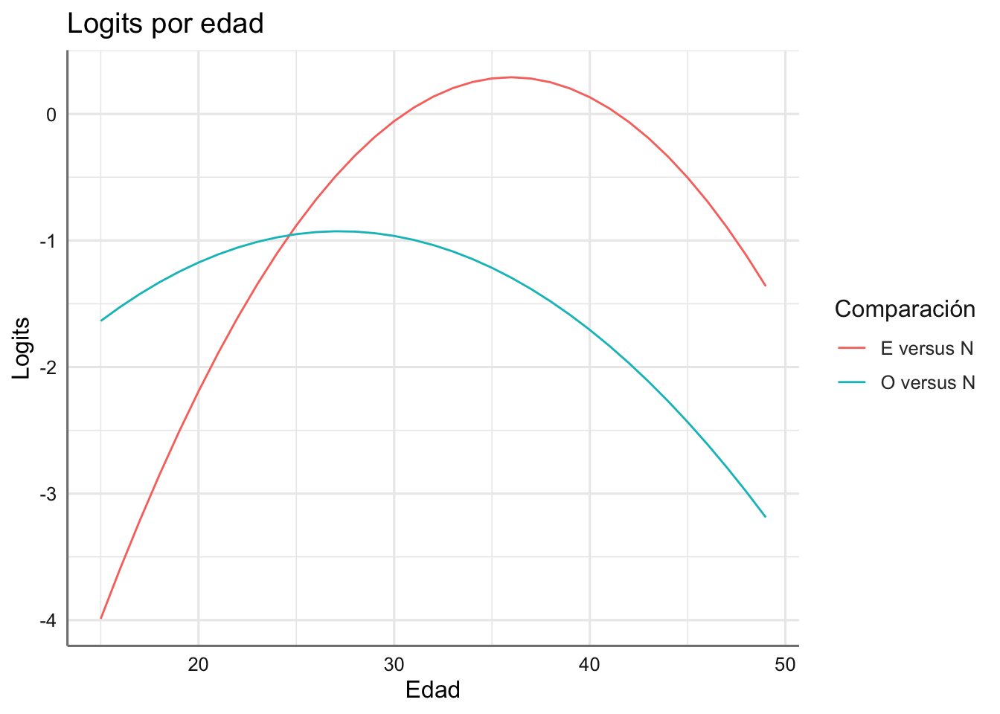
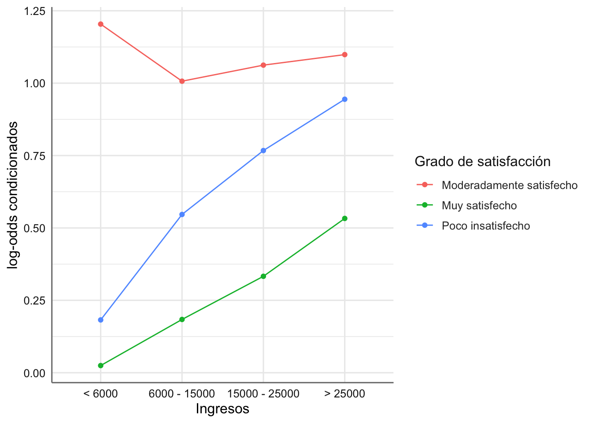

# GLM para tablas de contingencia {#glmtablascont}

Un tabla de contingencia se usa para estudiar una tabla de clasificación de un conjunto de factores donde se recogen el número de casos de cada una de las combinaciones de dichos factores. 

En este tipo de modelos las variables respuestas y predictoras son todas categóricas, medidas en una escala nominal u ordinal, aunque como veremos las construcción de este tipo de modelos se centran en estudiar las frecuencias de ocurrencia de cada combinación de los factores. El objetivo básico en el análisis de tablas de contingencia es estudiar si existe alguna relación/asociación entre los factores de clasificación considerados. posteriormente, si dicha relación existe, habrá que describir cómo es para tratar de predecirla. Para cuantificar el grado de asociación entre los factores de clasificación, los modelos log-lineales proporcionarán predicciones de las frecuencias observadas en las celdas y las probabilidades asociadas, en función de dichos factores y la interacción entre ellos. 

Para el análisis de estipo de datos es necesario que los datos vengan en un formato específico de forma que cada fila representa una combinación de los factores presentes en la tabla de contingencia y debe haber una columna que recoja los conteos o frecuencias de esa combinación. En ocasiones los datos deben ser trasnformados a partir de la tabla de contingencia para conseguir el fromato adecaudo para el análisis. En este último caso utilizaremos la función `gather()` que nosa permite modificar de forma sencilla la configuración del banco de datos.

Como ocurría en los modelos de regresión de Poisson, en el caso de trabajar con factores ordinales se debderna considerar sus versiones numéwricas utilizando el método de codificación presentado en esa unidad.

## Bancos de datos

A continuación se presentan diferentes ejemplos de tablas de contingencia que iremos analizando a lo largo de la unidad. Realizamos una primera aproximación gráfica a la tabla de contingencia obtenida.

### Melanoma

Los datos siguientes provienen de un estudio de pacientes con una forma de cáncer de piel llamado melanoma maligno. En una muestra de 400 pacientes se recogió información sobre la localización del tumor y su tipo histológico. Los datos son el número de pacientes (`frecuency`) en cada combinación de tipo de tumor (`type`) y localización (`site`). El objetivo básico del análisis es investigar si determinados tipos de tumor están asociados a ciertas localizaciones. La tabla de conteos o contingencia recogida es:

|Tipo / Localización|Cabeza-Cuello|Tronco|Extremidades|
|---|---|---|---|
|Melanoma de Hutchinson|22|2|10|
|Melanoma Superficial|16|54|115|
|Nodular|19|33|73|
|Indeterminado|11|17|28|

EL código para cargar estos datos se presenta a continaución. En este caso cada línea representa una combinación de factores. También representamos los datos:

```r
# Carga de datos
Melanoma <- read_csv("https://goo.gl/yeCXsv", col_types = "cci")
# Gráfico
ggplot(Melanoma, aes(x = site, y = frequency, fill = type)) + 
  stat_identity(geom = "bar", position = "dodge") 
```


Podemos ver claramente que hay ciertos tumores que tienen una mayor predisposición a aparecer en una parte del cuerpo que en otra.

### Gripe

En un estudio prospectivo sobre una nueva vacuna para la gripe, los pacientes fueron asignados aleatoriamente a dos grupos. A los pacientes de uno de los grupos se les trató con la nueva vacuna y a los otros se les dio un placebo salino. Las respuestas fueron los niveles de anticuerpos inhibidores de hemoglutinina (HIA) encontrados en la sangre seis semanas después de la vacunación. Los datos se encuentran en el banco de datos siguiente. El objetivo del estudio es investigar el efecto de la nueva vacuna, esto es, comprobar si el hecho de dar placebo o vacuna provoca diferente respuesta HIA. Así, la variable HIA es la variable a explicar (`response`) en función del tipo de tratamiento (`treatment`) que ha recibido el paciente y las frecuencias de las celdas (`frequency`).
 
La tabla de contingencia obtenida es:

|Tratamiento / Respuesta|Pequeño|Moderado|Grande|
|---|---|---|---|
|Placebo|25|8|5|
|Vacuna|6|18|11|

Podemos cargar los datos y representarlos gráficamente 

```r
# Lectura de datos
Gripe <- read_csv("https://goo.gl/jPcz7x", col_types = "cci")
# Gráfico
ggplot(Gripe, aes(x = treatment, y = frequency, fill = response)) + 
  stat_identity(geom = "bar", position = "dodge") 
```


Se puede ver un comportamiento distinto entre el placebo y el tratamiento.

### Aspirina

En un estudio retrospectivo de casos-controles, se reunió a un grupo de pacientes con úlcera y se buscó a otro grupo de individuos de similares características a los anteriores en edad, sexo y estatus socio económico, sobre los que no se sabía que tuvieran úlcera péptica. Los pacientes con úlcera fueron clasificados de acuerdo a la localización de la úlcera: gástrica o duodenal. Se les preguntó a todos si consumían aspirina. El objetivo del análisis es averiguar si existe alguna relación entre el consumo de aspirina y la existencia de algún tipo de úlcera. Si existe tal asociación, querríamos comprobar si el consumo de aspirina (`aspirina`) es más habitual en los pacientes con úlcera gástrica que en los de úlcera duodenal (`locali`). Interesa predecir el consumo de aspirina (variable a explicar) en función de si un individuo tiene úlcera o no (`ulcera`). y si la tiene, de qué tipo es. La variable `frecuencia` contiene los conteos de las combinaciones de tratamientos.
 
La tabla de contingencia obtenida es:

|Tipo Úlcera| Úlcera / Consumo de aspirina|No|Si|
|---|---|---|---|
|Gástrica|Si|39|25|
||No|62|6|
|Duodenal|Si|49|8|
||No|53|8|

Podemos cargar los datos y representarlos gráficamente
 

```r
# Carga de datos
locali <- gl(2, 2, 8, labels = c("Gástrica", "Duodenal"))
ulcera <- gl(2, 1, 8, labels = c("Si", "No"))
aspirina <- gl(2, 4, 8, labels = c("No", "Si"))
frecuencia <- c(39, 62, 49, 53, 25, 6, 8, 8)
Aspirina <- data.frame(locali, ulcera, aspirina, frecuencia)
# Gráfico
ggplot(Aspirina, aes(x = aspirina, y = frecuencia, fill = locali)) + 
  stat_identity(geom = "bar", position = "dodge") +
  facet_wrap(~ ulcera) +
  labs(xlab ="Consumo de aspirina", 
       title = "Desarrollo de úlcera", fill = "Localización")
```


De nuevo se observan comportamientos distintos para la combinación de los factores considerados.

### Aspiraciones

En la tabla se muestran una parte de los resultados de un estudio en los Estados Unidos con el que se pretendía investigar el grado de asociación entre las aspiraciones de los estudiantes de bachillerato por proseguir con estudios universitarios (`aspiraciones`) y su entorno social, medido en términos del estatus socio-económico de su familia (`estatus`) y el hecho de que recibieron motivación en su familia para continuar estudiando (`motivacion`). La variable `frecuencia` contiene los conteos para todas las combinaciones. La tabla de contingencia original es:

|Estatus| Motivación familiar / Aspiraciones Universitarias|No|Si|
|---|---|---|---|
|Baja|Baja|749|35|
||Alta|233|133|
|Media-Baja|Baja|627|38|
||Alta|330|303|
|Media-Alta|Baja|420|37|
||Alta|374|467|
|Alta|Baja|153|26|
||Alta|266|800|

Dado que Estatus y Motivación personal son factores ordinales se debe considerar su codificación como variables numéricas. A continuación se presenta la lectura del banco de datos y su representación gráfica.  
 

```r
estatus <- gl(4, 2, 16, labels = c("Baja", "Media-Baja",
                                   "Media-Alta", "Alta"))
motivacion <- gl(2, 1, 16, labels = c("Baja", "Alta"))
aspiraciones <- gl(2, 8, 16, labels = c("No", "Si"))
frecuencia <- c(749, 233, 627, 330, 420, 374, 153, 266, 
                35, 133, 38, 303, 37, 467, 26, 800)
Aspiraciones <- data.frame(estatus, motivacion, aspiraciones, frecuencia)
# Código numérico para factores ordinales
Aspiraciones <- Aspiraciones %>% 
  mutate(estatus.num = as.numeric(gl(4, 2, 16)), 
         motivacion.num = as.numeric(gl(2, 1, 16)))
# Represenatción gráfica
ggplot(Aspiraciones, aes(x = aspiraciones, y = frecuencia, fill = motivacion)) + 
  stat_identity(geom = "bar", position = "dodge") +
  facet_wrap(~ estatus) +
  labs(xlab ="Conusmo de aspirina", 
    title = "Estatus social", fill = "Motivación")
```


¿Qué podemos comentar del gráfico obtenido?

### Contraceptivos

En la tabla aparecen los datos de un estudio sobre distintos usos contraceptivos en diferentes grupos generacionales. Entendiendo la variable método contraceptivo (`metodo`) como variable respuesta y la variable edad (`edad`) como predictiva, una cuestión de interés puede ser predecir el uso anticonceptivo de una mujer en función de su edad. La variable `frecuencia` contiene los conteos para todas las combinaciones.

|Edad / Método contraceptivo| Esterilización|Otros|Ninguno|
|---|---|---|---|
|15-19|3|61|232|
|20-24|80|137|400|
|25-29|216|131|301|
|30-34|268|76|203|
|35-39|197|50|188|
|40-44|150|24|164|
|45-49|91|10|183|

El código de lectura de datos (incluyendo la codificación del factor ordinal como el punto medio del intervalo) y el gráfico se muestran a continuación:


```r
edad <- gl(7, 1, 21, labels = c("15-19", "20-24", "25-29", 
                                "30-34", "35-39", "40-44", "45-49"))
metodo <- gl(3, 7, 21, labels = c ("Esterilización", "Otros", "Ninguno"))
frecuencia <- c(3, 80, 216, 268, 197, 150, 91, 61, 137, 131, 76, 
                50, 24, 10, 232, 400, 301, 203, 188, 164, 183)
Contraceptivos <- data.frame(edad, metodo, frecuencia)
# Código numérico para factor ordinales
Contraceptivos <- Contraceptivos %>% 
  mutate(edad.num = rep(c(17, 22, 27, 32, 37, 42, 47),3))
# Gráfico
ggplot(Contraceptivos, aes(x = metodo, y = frecuencia, fill = edad)) + 
  stat_identity(geom = "bar", position = "dodge") 
```


¿Qué conclusiones podemos obtener de este gráfico?

### Satisfacción laboral

Los datos que se presentan corresponden a un estudio en el que se pretendía concluir sobre la relación entre el grado de satisfacción en el trabajo (`Estado`) y los ingresos percibidos (`Ingresos`). El objetivo es predecir el grado de satisfacción en el trabajo en función de los ingresos percibidos (en dólares). Construimos la variable `frecuencia` que contiene los conteos para todas las combinaciones.

|Ingresos / Satisfacción| Muy Insatisfecho|Poco Insatisfecho|Moderadamente Satisfecho|Muy Satisfecho|
|---|---|---|---|---|
|< 6000|20|24|80|82|
|6000 - 15000|22|38|104|125|
|15000 - 25000|13|28|81|113|
|> 25000|7|18|54|92|

Cargamos los datos que vienen en formato de tabla, con lo que es necesario transformarlos adecuadamente. También se calculan las variables numéricas asociadas con los factores ordinales.


```r
Satisfaccion <- read_csv("https://goo.gl/5T0nh0", col_types = "ciiii")
# Construimos la tabla donde cada fila recoge la frecuencia observada para combinación de las variables
Satisfaccion <- Satisfaccion %>% 
  gather(`Muy insatisfecho`, `Poco insatisfecho`,
         `Moderadamente satisfecho`, `Muy satisfecho`,
         key = "Estado", value = frecuencia)
# Código numérico para factores ordinales
Satisfaccion <- Satisfaccion %>% 
  mutate(Ingresos.num = as.numeric(gl(4, 1, 16)), 
         Estado.num = as.numeric(gl(4, 4, 16)))
# Gráfico
# Creamos un vector con el orden predefinido
ords <- c("< 6000", "6000 - 15000", "15000 - 25000", "> 25000")
ggplot(Satisfaccion, aes(x = Ingresos, y = frecuencia, fill = Estado)) + 
  stat_identity(geom = "bar", position = "dodge") + 
  scale_x_discrete(limits = ords)
```


¿Qué conclusiones podemos obtener de este gráfico? 

## Modelos Log-Lineales

Las cuestiones básicas de interés en el análisis de tablas de contingencia son detectar asociación entre los factores de clasificación y predecir las frecuencias medias observadas. Dichas cuestiones se pueden resolver a partir de la modelización log-lineal de las frecuencias esperadas. 
Consideramos, para presentar estos modelos, únicamente dos vías de clasificación, F1 y F2. Si los factores se consideran independientes el número de individuos que esperamos clasificar en la celda $(i, j)$ (nivel $i$ de F1 y nivel $j$ de F2) se puede calcular a través del producto de los sucesos independientes  "número esperado de individuos clasificados en el nivel i de F1 ", $\mu_{i+}$, y "número esperado de individuos clasificados en el nivel j de F2", $\mu_{+j}$ esto es,  

$$E(Y_{ij}) = \mu_{ij} = \mu_{i+}*\mu_{+j}$$

El efecto multiplicativo de los factores para predecir la frecuencia observada da lugar, de modo natural, a modelos logarítmicos aditivos (modelos log-lineales) de la forma:

$$log(E(Y_{ij})) = \mu + \alpha_i + \beta_j + (\alpha\beta)_{ij}$$

donde $\alpha_i$ representa el efecto principal del factor fila F1 , $\beta_j$ el correspondiente al factor columna F2 y  el $(\alpha\beta)_{ij}$ efecto de interacción entre ambos. Este modelo se denomina modelo saturado, ya que tiene tantos parámetros como celdas estamos considerando en la combinación de los factores, y tiene poco interés desde el punto de vista estadístico ya que cada parámetro del modelo se estima con un único valor en la muestra de datos. Contrastar independencia versus asociación será equivalente a contrastar interacción nula versus no nula en el modelo log-lineal, es decir debemos estudiar los modelos:

* El modelo saturado dado por $Frecuencias \sim F1 * F2$
* El modelo sin interacción dado por $Frecuencias \sim F1 + F2$

dados por las expresiones

$$\begin{array}{ll}
M_0: log(E(Y_{ij})) &= \mu + \alpha_i + \beta_j\\ 
M_1: log(E(Y_{ij})) &= \mu + \alpha_i + \beta_j + (\alpha\beta)_{ij}\\ 
\end{array}$$

En la práctica para contrastar independencia ajustamos un modelo con únicamente los efectos principales y valoramos la bondad del ajuste conseguido mediante el test $\chi^2$. En conclusión, reconocer asociación entre los factores de clasificación de una tabla de contingencia es equivalente a rechazar interacción nula entre ellos en el modelo log-lineal con el que se predicen las frecuencias observadas en las celdas.

Cuando consideramos la tabla de contingencia asociada con tres factores el modelo saturado vendrá dado por:

$$Frecuencias \sim F1 + F2 + F3 + F1:F2 + F1:F3 + F2:F3 + F1:F2:F3$$
donde el efecto de interacción triple $F1:F2:F3$ nos permite estudiar si existe asociación entre los tres factores conjuntamente. En caso de que el contraste de bondad de ajuste del modelo reducido

$$M_0: Frecuencias \sim F1 + F2 + F3 + F1:F2 + F1:F3 + F2:F3$$
no resulte significativo, podremos abordar el estudio de las interacciones dobles de la siguiente forma:

* la interacción $F1:F2$ nos permite estudiar la asociación entre ambos factores dado F3
* la interacción $F1:F3$ nos permite estudiar la asociación entre ambos factores dado F2
* la interacción $F2:F3$ nos permite estudiar la asociación entre ambos factores dado F1

Por tanto, debemos estudiar la bondad de ajuste de los modelos
$$\begin{array}{ll}
M_1:& Frecuencias \sim F1 + F2 + F3 + F1:F3 + F2:F3\\ 
M_2:& Frecuencias \sim F1 + F2 + F3 + F1:F2 + F2:F3\\
M_3:& Frecuencias \sim F1 + F2 + F3 + F1:F2 + F1:F3\\
\end{array}$$

para detectar las posibles asociaciones. En la pra´ctica siempre se fija un factor como varaible respuesta y los otros dos como predictoras, de forma que, si el factor F1 actúa como respuesta y los otros dos factores como predictoras, el modelo M3 no tiene sentido práctico, ya que en realidad nuestro interés radica en la asociación entre respuesta y predictoras.

Así podemos seguir aumentando el número de factores en el modelo y estudiando las posibles asociaciones entre ellos. Se trata pues de un procedimiento de comparación de efectos o modelos de tipo manual y no automático como habíamos hecho en otro tipo de modelos.

Para escribir de forma reducida lo modelos anteriores usamos la siguiente notación (que también nos vale para el ajuste de los modelos en `R`).
$$\begin{array}{ll}
M_0:& Frecuencias \sim (F1+F2+F3)^2\\ 
M_1:& Frecuencias \sim F2*F3 + F1 + F1:F3\\ 
M_2:& Frecuencias \sim F2*F3 + F1 + F1:F2\\
M_3:& Frecuencias \sim F1*F3 + F2 + F1:F2\\
\end{array}$$

### Especificación en R

Para el ajuste de estos modelos utilizamos la función `glm()` con las especificaciones siguientes:

$$glm(modelo, family = poisson(), data_set)$$

donde $modelo$ se establece según las notaciones reducidas que hemos presentado tanto para dos como para tres factores.

### Ejemplos

A continuación estudiamos de forma inicial la independencia o dependencia en los ejemplos del inicio. Para el análisis de independencia utilizamos el test $\chi^2$ de bondad de ajuste y concluímos en función del p-valor obtenido.

#### Melanoma

En este caso la pregunta de interés es si ¿existe asociación entre el tipo de tumor y su localización?, que equivale a estudiar si el efecto de interacción entre tipo de tumor y su localización resulta significativo, es decir, estudiar la bondad de ajuste del modelo sin interacción entre ambos.


```r
# Ajuste del modelo sin interacción
fit.melanoma <- glm(frequency ~ type + site, 
                    family = poisson(), 
                    data = Melanoma)
# Bondad del asjute del modelo
1-pchisq(fit.melanoma$deviance, fit.melanoma$df.residual)
```

```
## [1] 2.050453e-09
```

Dado que el valor es inferior a 0.05 podemos concluir que hay evidencias estadísticas a favor de la asociación entre los factores tipo de tumor y localización, es decir, determinados tipos de tumor se presentan en ciertas localizaciones con más frecuencia que en otras.

#### Aspirina

En el estudio se controlaron las variables úlcera y localización. A los pacientes clasificados en cada una de las combinaciones de estas dos variables se les preguntó sobre el consumo de aspirina, que es la variable aleatoria y por tanto la variable a explicar en función de las otras dos. Las cuestiones que nos planteamos son:

* En el grupo gástrico ¿la úlcera está asociada con el consumo de aspirina? ¿y en el grupo duodenal?. Para ambas cuestiones estamos planteando si, dado un grupo especifico (`locali`), el consumo de aspirina (`aspirina`) está relacionado con la existencia de úlcera (`ulcera`). Ambas preguntas se pueden contestar estudiando el efecto de interacción entre el consumo de aspirina y el desarrollo de una úlcera (`aspirina:ulcera`). 

* Si dicha asociación existe, cabe preguntarse si dicha relación es similar en los dos grupos de pacientes.

En este caso el estudio de la independencia total nos llevaría a analizar un modelo donde eliminamos la interacción de orden tres. Dicho modelo se puede obtener y analizar con:

```r
# Ajuste del modelo sin interacción
fit.aspirina <- glm(frecuencia ~ (locali + ulcera + aspirina)^2, 
                    family = poisson(), 
                    data = Aspirina)
# Bondad del asjute del modelo
1-pchisq(fit.aspirina$deviance, fit.aspirina$df.residual)
```

```
## [1] 0.01219027
```

Dado que el p-valor resulta significativo podemos concluir que existe asociación entre los factores considerados. Pasamos ahora a estudiar cada una de las cuestiones planteadas ahora que sabemos que los factores están relacionados. Para saber si la existencia del desarrollo de una úlcera está asociado con el consumo de aspirina para cada tipo de úlcera, ajustamos un modelo sin la interacción `aspirina:ulcera`


```r
# Ajuste del modelo sin interacción
fit.aspirina <- glm(frecuencia ~ locali*ulcera + aspirina + aspirina:locali, 
                    family = poisson(), 
                    data = Aspirina)
# Bondad del asjute del modelo
1-pchisq(fit.aspirina$deviance, fit.aspirina$df.residual)
```

```
## [1] 0.000143616
```

Se rechaza claramente independencia entre el consumo de aspirina y la existencia de úlcera para ambos tipos de úlcera.

Pasamos ahora a la segunda cuestión, es decir, tratamos de averiguar si existe asociación entre el consumo de aspirina y el tipo de úlcera desarrollada. Para ello debemos analizar la interacción entre `aspirina:locali` cuando sabemos que se ha desarrollado una úlcera


```r
# Ajuste del modelo sin interacción
fit.aspirina <- glm(frecuencia ~ locali*ulcera + aspirina + aspirina:ulcera, 
                    family = poisson(), 
                    data = Aspirina)
# Bondad del asjute del modelo
1-pchisq(fit.aspirina$deviance, fit.aspirina$df.residual)
```

```
## [1] 0.005147627
```

Rechazamos la hipótesis de independencia a favor de que el consumo de aspirina es diferente en pacientes con distinto tipo de úlcera. 

#### Gripe

Estudiamos la posible asociación entre la respuesta tars la vacunación y si el sujeto eras tratado o no.

Podemos cargar los datos y representarlos gráficamente 

```r
# Ajuste del modelo sin interacción
fit.gripe <- glm(frequency ~ treatment + response, 
                    family = poisson(), 
                    data = Gripe)
# Bondad del asjute del modelo
1-pchisq(fit.gripe$deviance, fit.gripe$df.residual)
```

```
## [1] 8.95007e-05
```

puesto que el p-valor obtenido es significativo podemos concluir que hay asociación entre los factores considerados, es decir, la respuesta tras la vacunación se asocia con el grupo de tratamiento.

#### Aspiraciones

Estamso interesados en conocer si existe asociación entre el estatus, la motivacion familiar y las aspiraciones universitarias. En este caso la variable que actuaría como respuesta son las aspiraciones universitarias, mientras que las otras dos se utilizan como varaible clasificadoras. Ajustamos el modelo sin interacción triple para establecer la posible asociación.


```r
# Ajuste del modelo sin interacción
fit.aspiraciones <- glm(frecuencia ~ (estatus + motivacion + aspiraciones)^2, 
                    family = poisson(), 
                    data = Aspiraciones)
# Bondad del asjute del modelo
1-pchisq(fit.aspiraciones$deviance, fit.aspiraciones$df.residual)
```

```
## [1] 0.664965
```
 en este caso no parece existir uan asociación entre los tres factores, pero ¿podría alguno de ellos estar asociado con las aspiraciones? ¿Cómo interpretamos los modelos siguientes?


```r
# Modelo 1
fit.aspiraciones <- glm(frecuencia ~ estatus*motivacion + aspiraciones + aspiraciones:motivacion, 
                        family = poisson(), 
                        data = Aspiraciones)
# Modelo 2
fit.aspiraciones <- glm(frecuencia ~ estatus*motivacion + aspiraciones + aspiraciones:estatus, 
                        family = poisson(),  
                        data = Aspiraciones)
```

**Ejercicio.** Realiza el análisis de independencia apra los bancos de datos `Contraceptivos` y `Salud Laboral`.

## Modelos Logit-Multinomial

El objetivo principal al analizar las tablas de contingenia no es sólo determinar la posible asociación entre los factores, sino tratar de predecir el comportamiento de uno de los factores (que actúa como variable respuesta) en función del resto de factores (que actúan como predictoras) cuando se detecta esta. En esta situación interesará modelizar los datos para predecir la probabilidad de que se dé una u otra respuesta en la variable respuesta en función de las distintas combinaciones en las variables predictoras. 

Para modelizar este tipo de situación se establece una variante de los modelos log-lineales, que además de resultar útiles para investigar asociación, son equivalentes a los modelos logit para respuesta Binomial, conocidos como modelos logit-multinomial. 

Para estudiar la especificación de este tipo de modleos nos planteamos la situacoçpn más sencilla donde consideremos una tabla de contingencia en la que están involucradas como variables de clasificación, una variable respuesta $R$ con $I$ niveles de clasificación, y una variable respuesta $A$ con $J$ niveles de clasificación. Además, denotamos por $\pi_{i|j}$ las probabilidades de respuesta $R = i$ dada cierta clasificación en la variable predictora, $(A = j)$, esto es,

$$\pi_{i|j} = P(R = i | A = j).$$

Los modelos logit-multinomial vienen definidos en términos de los log-odds (logaritmo del cociente) de las probabilidades condicionadas de dos niveles de respuesta de $R$, dadas las diferentes combinaciones de niveles de las variables predictoras. En esta situación, y de forma similar a lo que ocurre con los modelos ANOVA, se suele elegir uno de los niveles de $R$ como nivel de referencia, generalmente el primero o el último, para predecir el cociente de probabilidades condicionadas. Si se toma como categoría  de referencia la última de $R$ (en este caso I), los log-odds a predecir serán:

$$log\left(\frac{\pi_{i|j}}{\pi_{I|j}}\right), \quad \text{para cada nivel } i \text{ de } R$$

El ajuste de estos modelos logit-multinomiales se realiza a través de modelos log-lineales equivalentes con los que se predicen las frecuencias observadas $Y_{ij}$ en la tabla de contingencia. Es preciso puntualizar que la equivalencia entre estos modelos logit y los log-lineales es cierta asumiendo que los totales marginales correspondientes a las variables predictivas son fijos. Básicamente es decir que las variables predictoras han sido controladas en el estudio con el fin principal de predecir la variable respuesta $R$. Al asumir esto, obligamos a que los efectos asociados a dichas variables predictoras hayan de aparecer siempre (junto con sus interacciones) en cualquier modelo log-lineal que ajustemos. 

El cociente de log-odds (o logit entre las categorías $i$ e $I$) se puede expresar como:

$$log\left(\frac{\pi_{i|j}}{\pi_{I|j}}\right) = log\left(\frac{E(Y_{ij})}{E(Y_{Ij})}\right) = log\{E(Y_{ij})\} - log\{E(Y_{Ij})\}$$

donde los $E(Y_{ij})$ para ca $i$ son los valores predichos del modelo log-lineal para cada combinación de los niveles de todas las variables involucradas. En realidad, esto significa que a la hora de estimar el log-odds sólo debemos tener en cuenta los coeficientes del modelo que hagan referencia a los niveles considerados de la variable respuesta, y a la interacción (si está presente en el modelo) entre respuesta y predictora, es decir:

$$log\left(\frac{\pi_{i|j}}{\pi_{I|j}}\right) = (\alpha_i -\alpha_I) + (\alpha\beta_{ij} - \alpha\beta_{Ij})$$

donde los $\alpha$ son los efectos asociados con los niveles de las categorías de la respuesta y los $\alpha\beta$ son los efectos asociados con la interacción entre respuesta y predictora. Esta relación tiene implicaciones importantes ya que para estimar los logits debemos tener en cuenta únicamente los coeficientes del modelo que están relacionados con la respuesta, a través de sus efectos principales o de sus interacciones con las predictoras. Este principio nos sirve para todas las situaciones de análisis que planteamos a continuación en función de las características de la variable respuesta y la predictora o predictoras.

Antes de comenzar, al igual que ocurria en modelizaciones anteriores, la utilización de variables ficticias numéricas para sustituir una variable categórica de tipo ordinal es una forma de proceder es muy habitual. Dichos valores numéricos se denominan en los modelos log-lineales como `scores` o valores numéricos asociados a variables de carácter ordinal. Existen dos posibilidades de asignación de estos scores:

* Cuando la variable ordinal viene dada en intervalos se elige el punto medio como score asociado.
* Cuando la varaible ordinal viene dada en categorías nonuméricas se suele asociar un código numérico con el valor más bajo de 1 indicando la categoría más baja, y vamos aumentando de 1 en 1 hasta acabar con todos los niveles del factor. 

## Estimación

A continuación se presenta el proceso de estimación de los diferentes modelos logit-multinomial que pueden surgir en función de las características de la varaible respuesta y las predictoras. Se detalla cada caso siguiendo las pautas del punto anterior y se analizan los ejemplos correspondientes.

### Respuesta binaria nominal y predictora nominal

Imaginemos que la variable respuesta esta compuesta por dos categorías de carácter nominal ($i=1, 2$=. Con la estructura de estimación  definida en el punto anterior si la respuesta tiene únicamente dos categorías tendríamos que $\pi_{1|j} = 1 - \pi_{2|j}$, de forma que tendríamos un único log-odds que se puede expresar como:

$$log\left(\frac{\pi_{2|j}}{\pi_{1|j}}\right) = log\left(\frac{\pi_{2|j}}{1-\pi_{2|j}}\right) = (\alpha_2 -\alpha_1) + (\alpha\beta_{2j} - \alpha\beta_{1j})$$

donde los $\alpha$ y los $\alpha\beta$ son los definidos en el punto anterior. Si denotamos por $\eta_{2|j}$ al $log\left(\pi_{2|j}/\pi_{1|j}\right)$, a partir de la expresión anterior resulta posible obtener la probabilidad de cada nivel de la respuesta mediante la ecuación:

$$\pi_{2|j} = \frac{exp(\eta_{2|j})}{1+exp(\eta_{2|j})}$$

#### Datos Aspirina

En primer lugar calculamos y evaluamos los logits empíricos asociados y más tarde realizamos el ajuste y estimación delm modelo. Tomamos como variable respuesta el consumo de aspirina, y usamos como referencia la categroria `No` podemos obtener los log-odds como:


```r
# Creamos variable con valores de referencia y obtenemos los log-odds asociados
referencia.val <- unlist(dplyr::select(filter(Aspirina, aspirina == "No"),
                                       frecuencia))
# Log-odds
Aspirina <- Aspirina %>% 
  mutate(referencia = rep(referencia.val, 2),
         lodds = log(frecuencia / referencia))
# Gráfico
# Seleccionamos las categorías a representar eliminando la de referencia
# Como la respuesta sólo tiene una categoría no hace falta utilizarla en el gráfico
datos <- filter(Aspirina, aspirina != "No")
ggplot(datos,aes(x = locali, y = lodds, group = ulcera, color = ulcera)) +
  geom_point() + 
  geom_line()  +
  labs(x = "Localización",
       y = "log-odds (Aspirina == Si/No)",
       col = "Desarrollo de úlcera") 
```


Ajustamos un modelo con todas las interacciones dobles, ya que en este caso resulta imposible plantear el modelo con las interacción triple. Este modelo el que ya se planteo en el estudio de independencia.


```r
# Ajuste del modelo sin interacción
fit.aspirina <- glm(frecuencia ~ (locali + ulcera + aspirina)^2, 
              family = poisson(), 
              data = Aspirina)
```

Para obtener los logits y probabilidades asociadas a cada categoría de la respuesta extraemos los coeficientes del modelo ajustado. Dado que solo nos interesan los efectos que están relaciondos directamente con la variable respuesta vamos a presentar únicamente dichos valores. Para saber los nombres de los coeficientes del modelo podemos utilizar el código siguiente identificando todos los efectos que están realcionados con la respuesta (efecto principal e interacciones).

En estos modelos utilizamos la función La función `tidy` para presentar la estimación del modelo selecionando las columnas necesarias.


```r
tabla <- tidy(fit.aspirina)[,c("term", "estimate")]
tabla
```

```
## # A tibble: 7 × 2
##   term                      estimate
##   <chr>                        <dbl>
## 1 (Intercept)                 3.75  
## 2 localiDuodenal              0.0698
## 3 ulceraNo                    0.321 
## 4 aspirinaSi                 -0.679 
## 5 localiDuodenal:ulceraNo    -0.106 
## 6 localiDuodenal:aspirinaSi  -0.700 
## 7 ulceraNo:aspirinaSi        -1.14
```

Seleccionamos los efectos necesarios para el ajuste de los logits y la estimación de probabilidades. Estos efectos son los relacionados (principales e interacciones) con la variable `aspirina`.


```r
# Filas de la tabla de estimaciones relacionados con metodo
selefect<- c(4, 6, 7)
tabla[selefect,]
```

```
## # A tibble: 3 × 2
##   term                      estimate
##   <chr>                        <dbl>
## 1 aspirinaSi                  -0.679
## 2 localiDuodenal:aspirinaSi   -0.700
## 3 ulceraNo:aspirinaSi         -1.14
```

Dado que ambas variables son de tipo nominal y tomando como referencia la categoría "No" de consumo de aspirina, podemos obtener el logit del consumo de aspirina versus la categoria de referencia para cualquier combinación der categorias de las predictoras mediante:

$$log\left(\frac{\pi_{SI|jk}}{\pi_{No|jk}}\right) = (\alpha_{Si} - \alpha_{No}) + (\theta_{Si,jk} - \theta_{No,jk})$$

donde $\alpha$ hace referencia al efecto principal asociado con la respuesta (`aspirina`), y $\theta$ hace referencia al coeficiente de interacción entre la respuesta y los niveles $j$ y $k$ de localización de la úlcera (`locali`) y tener úlcera (`ulcera`) respectivamente. Si denotamos por $A$ al consumo de aspirina, $L$ la localización de la úlcera, y $U$ tener o no tener úlcera, para obtener el logit para un sujeto con $U = No$ y $L = Duodenal$ tendríamos que:

$$\eta_\text{Si| U = NO; L = Duodenal} = (\alpha_{Si} - \alpha_{No}) + (\theta_{Si,No,Duodenal} - \theta_{No,No,Duodenal})$$

donde $\alpha_{Si} = -0.679$, $\alpha_{No} = 0$, y $\theta_{Si,No,Duodenal}$, $\theta_{No,No,Duodenal}$ representan las interacciones de la respuesta y predictoras para dicha combinación que vienen dadas por:

$$\begin{array}{ll}
\theta_{Si,No,Duodenal} &= \theta_{Si,No} + \theta_{Si,Duodenal} = - 1.14 - 0.70 = - 1.84\\
\theta_{No,No,Duodenal} &= \theta_{No,No} + \theta_{No,Duodenal} = 0 + 0 = 0\\
\end{array}$$

Para la estimación de los logits hya que tener en cuenta las restricciones de identificabilidad $\alpha_{No} = 0$ y $\theta_{No,jk} = 0$ para cualquier combinación de $j$ y $k$, de forma que:

$$\begin{array}{ll}
\eta_\text{[Si| U = No; L = Duodenal]} &= \alpha_{Si} + \theta_{Si,No} + \theta_{Si,Duodenal} = - 0.679 - 1.84 = -2.519\\
\eta_\text{[Si| U = No; L = Gástrica]} & = \alpha_{Si} + \theta_{Si,No} + \theta_{Si,Gástrica} = - 0.679 - 1.14 + 0 = -1.819\\
\eta_\text{[Si| U = Si; L = Duodenal]} & = \alpha_{Si} + \theta_{Si,Si} + \theta_{Si,Duodenal} = - 0.679 + 0 - 0.70 = -1.379\\
\eta_\text{[Si| U = Si; L = Gástrica]} & = \alpha_{Si} + \theta_{Si,Si} + \theta_{Si,Gástrica} = - 0.679 + 0 + 0 = - 0.679\\
\end{array}$$

Podemos obtener ahora las probabilidades de consumo de aspirina para cada combinación de las predictoras:

$$\begin{array}{ll}
\pi_\text{[Si| U = NO; L = Duodenal]} & =  exp(-2.519)/(1+exp(-2.519)) = 0.0745\\
\pi_\text{[Si| U = NO; L = Gástrica]} & =  exp(-1.819)/(1+exp(-1.819)) = 0.1396\\
\pi_\text{[Si| U = Si; L = Duodenal]} & =  exp(-1.379)/(1+exp(-1.379)) = 0.2012\\
\pi_\text{[Si| U = Si; L = Gástrica]} & =  exp(-0.679)/(1+exp(-0.679)) = 0.3365\\
\end{array}$$

A la vista de estos resultados podemos concluir que la probabilidad de consumir aspirina dado un enfermo de úlcera duodenal es de 0.2012, mientras que para un enfermo de úlcera gástrica dicha probabilidad es de 0.3365. Podemos concluir que la probabilidad del consumo de aspirina es superior en los enfermos con úlcera gástrica que en la duodenal, y mayor en los sujetos enfermos que en los controles.

Las probabilidades anteriores se puden obtener de forma un poco más directa a partir de los valores predichos del modelo.


```r
# Calculamos los conteos predichos del modelo
conteos <- predict(fit.aspirina, type = "response")
# Combinamos los datos originales con los predichos
newdata <- cbind(Aspirina, conteos)
# Calculamos el conteo total por las predictoras
newdata.sum <- newdata %>% group_by(locali, ulcera) %>% 
  summarise(suma = sum(conteos))
# Calculamos las probabilidades asociadas a cada combinación
newdata <- newdata %>% 
  left_join(newdata.sum, by = c("locali","ulcera")) %>%
  mutate(prob = round(conteos/suma,4))
# Vemos las probabiliddes obtenidas
dplyr::select(newdata,c(locali, ulcera, aspirina, prob))
```

```
##     locali ulcera aspirina   prob
## 1 Gástrica     Si       No 0.6635
## 2 Gástrica     No       No 0.8608
## 3 Duodenal     Si       No 0.7988
## 4 Duodenal     No       No 0.9257
## 5 Gástrica     Si       Si 0.3365
## 6 Gástrica     No       Si 0.1392
## 7 Duodenal     Si       Si 0.2012
## 8 Duodenal     No       Si 0.0743
```

Podemos representar las probabilidades obtenidas para ver los efectos de la combinacion de predictoras en la respuesta.


```r
ggplot(newdata, aes(x = locali, y = prob, group = ulcera, color = ulcera)) +
  geom_point() + 
  geom_line()  +
  facet_wrap(~ aspirina) +
  labs(title = "Consumo de aspirina",
       x = "Localización de la úlcera",
       y = "Probabilidad",
       col = "Úlcera") +
  scale_y_continuous(breaks = seq(0, 1, by = 0.1), limits = c(0, 1))
```


### Respuesta multinomial nominal y predictora nominal

Cuando tenemos más de dos categorías el procedimiento es bastante similar. En este caso tomamos la última categoria $I$ como referencia, de forma que los log-odds se pueden expresar como:

$$log\left(\frac{\pi_{i|j}}{\pi_{I|j}}\right) = \eta_{i|j} = (\alpha_i -\alpha_I) + (\alpha\beta_{ij} - \alpha\beta_{Ij})$$


A partir del logit anterior para cada categoría $i$,podemos obtener la probabilidad condicionada de dicha categoría $i$ como:

$$\pi_{i|j} = \frac{exp(\eta_{i|j})}{\sum_{l=1}^I exp(\eta_{l|j})}$$

Puesto que $exp(\eta_{I|j}) = 1$ dicha probabilidad se puede expresar como:

$$\pi_{i|j} = \frac{exp(\eta_{i|j})}{1 + \sum_{l \neq I} exp(\eta_{l|j})}$$

Esta expresión es similar a la de dos categorías salvo por la modificación del denominador, donde se incluyen los predictores, $\eta$, asociados a todas las categorías de la respuesta.

### Respuesta nominal, predictora ordinal

Esta situación es miliar a la anterior salvo por el carácter ordinal de la predictora. Para estimar dichos modelos debemos incluir una variable ficticia ($S$) que contendrá los scores asociados con las categorías de la predictora. Si $v_1=1, v_2=2,...,v_J=J$ denota a los scores asociados con la varaible ordinal, el logit asociado a esta situación se puede expresar mediante:

$$log\left(\frac{\pi_{i|j}}{\pi_{I|j}}\right) = \eta_{i|j} = (\alpha_i -\alpha_I) + (\alpha\beta_{ij} - \alpha\beta_{Ij})v_j$$

donde las interacciones entre la respuesta y la predictora se modifican a través del score definido, para introducir el efecto ordinal entre las comninaciones, de forma que los cocientes de probabilidades se obtienen como 

$$\frac{\pi_{i|j}}{\pi_{I|j}} = exp(\eta_{i|j}) = exp\{(\alpha_i -\alpha_I) + (\alpha\beta_{ij} - \alpha\beta_{Ij})v_j\}$$

de forma que la probabilidad de una categoría $i$ viene dada por:

$$\pi_{i|j} = \frac{exp(\eta_{i|j})}{1 + \sum_{l \neq I} exp(\eta_{l|j})}$$

#### Datos Aspiraciones universitarias

Si tomamos como variable respuesta las aspiraciones universitarias en función del estatus económico y de la motivación familiar, y usamos como referencia la categoría `No` podemos obtener el log-odd de la categoría `Si` mediante:


```r
# Creamos variable con valores de referencia y obtenemos los log-odds asociados
referencia.val <- unlist(dplyr::select(filter(Aspiraciones, aspiraciones == "No"),
                                       frecuencia))
Aspiraciones <- Aspiraciones %>% 
  mutate(referencia = rep(referencia.val, 2),
         lodds = log(frecuencia / referencia))
# Gráfico
# Seleccionamos las categorías a representar eliminando la de referencia
# Como la respuesta sólo tiene una categoría no hace falta utilizarla en el gráfico
datos <- filter(Aspiraciones, aspiraciones != "No")
ggplot(datos,aes(x = estatus, y = lodds, group = motivacion, color = motivacion)) +
  geom_point() + 
  geom_line() +
  labs(x = "Estatus Socioeconómico",
       y = "log-odds (Aspiraciones == Si / No)",
       col = "Motivacion")
```


Se observa una tendencia creciente (puede incluso que no lineal) conforme aumenta el estatus económico, que va relacionada directamente con una motivación más alta en el entorno familiar (comportamiento casi paralelo para ambas motivaciones).

Para el ajuste de este modelo debemos considerar los scores asociados a cada una de las predictoras ordinales (`estatus.num` y `motivacion.num`) tal y como los definimos al presentar este banco de datos. En primer lugar ajustamos el modelo para estudiar asociación eliminando la interacción de orden 3.


```r
# Ajuste del modelo sin interacción triple
fit.aspiraciones.aso <- glm(frecuencia ~ (estatus + motivacion + aspiraciones)^2, 
                          family = poisson(), 
                          data = Aspiraciones)
# Bondad del asjute del modelo
1-pchisq(fit.aspiraciones.aso$deviance, fit.aspiraciones.aso$df.residual)
```

```
## [1] 0.664965
```

No podemos rechazar la interacción triple. Ajustamos un nuevo modelo eliminando la interacción doble entre `estatus` y `motivacion` dado que los prefiles de los logits parecían paralelos. 


```r
# Ajuste del modelo sin interacción triple
fit.aspiraciones.aso2 <- glm(frecuencia ~ estatus + motivacion + aspiraciones + estatus:aspiraciones + motivacion:aspiraciones, 
                          family = poisson(), 
                          data = Aspiraciones)
# Bondad del ajuste
1-pchisq(fit.aspiraciones.aso2$deviance, fit.aspiraciones.aso2$df.residual)
```

```
## [1] 0
```

```r
# Comapramos con el modelo anterior
anova(fit.aspiraciones.aso2, fit.aspiraciones.aso, test ="Chisq")
```

```
## Analysis of Deviance Table
## 
## Model 1: frecuencia ~ estatus + motivacion + aspiraciones + estatus:aspiraciones + 
##     motivacion:aspiraciones
## Model 2: frecuencia ~ (estatus + motivacion + aspiraciones)^2
##   Resid. Df Resid. Dev Df Deviance  Pr(>Chi)    
## 1         6    298.485                          
## 2         3      1.575  3   296.91 < 2.2e-16 ***
## ---
## Signif. codes:  0 '***' 0.001 '**' 0.01 '*' 0.05 '.' 0.1 ' ' 1
```

El p-valor resulta significativo dando indicaciones de que la interacción `estatus:motivacion` no es relevante pero este modelo si que es distinto del modelo saturado. Ajustamos este modelo teniendo en cuenta los scores:


```r
# Debemos incluir el efecto de las predictoras como factor principal 
# para mantener la estructura del modelo
fit.aspiraciones <- glm(frecuencia ~ estatus + motivacion + aspiraciones + aspiraciones*(estatus.num + motivacion.num), 
                          family = poisson(), 
                          data = Aspiraciones)
```

Obtenemos la tabla de estimación para el modelo: 

```r
tabla <- tidy(fit.aspiraciones)[,c("term", "estimate")]
tabla
```

```
## # A tibble: 10 × 2
##    term                          estimate
##    <chr>                            <dbl>
##  1 (Intercept)                     6.42  
##  2 estatusMedia-Baja              -0.0318
##  3 estatusMedia-Alta              -0.307 
##  4 estatusAlta                    -0.780 
##  5 motivacionAlta                 -0.482 
##  6 aspiracionesSi                 -7.81  
##  7 estatus.num                    NA     
##  8 motivacion.num                 NA     
##  9 aspiracionesSi:estatus.num      0.806 
## 10 aspiracionesSi:motivacion.num   3.01
```

Seleccionamos los efectos necesarios para el ajuste de los logits y la estimación de probabilidades. Estos efectos son los relacionados (principales e interacciones) con la variable `aspiraciones`.


```r
# Filas de la tabla de estimaciones relacionados con metodo
tabla[6:8,]
```

```
## # A tibble: 3 × 2
##   term           estimate
##   <chr>             <dbl>
## 1 aspiracionesSi    -7.81
## 2 estatus.num       NA   
## 3 motivacion.num    NA
```

Con una variable respuesta nominal y una predictora ordinal la ecuació del logit (tomando la categoría `No` como referencia) se pueden obtener de forma sencilla a partir de las ecuaciones descritas anteriormente. La expresión del logit en función de los niveles de las predictoras viene dada por:

$$log\left(\frac{\pi_{\text{Si,jk}}}{\pi_{\text{No,jk}}}\right) = (\alpha_{\text{Si}} - \alpha_{\text{No}}) + (\theta_{Si,j} - \theta_{No,j}) v_j + (\gamma_{Si,k} - \gamma_{No,k}) w_k \\ = \alpha_{\text{Si}} + \theta_{Si,j} v_j + \gamma_{Si,k} w_k$$

donde los $\alpha$ representan los efectos principales de `aspiraciones`, $\theta$ los efectos de las interacciones entre `aspiraciones` y `estatus`, $\gamma$ los efectos de las interacciones entre `aspiraciones` y `motivacion`, los $v_j$ son los scores de `estatus`, y los $\gamma_k$ son los scores de `motivacion`. Sustituyendo tendríamos:

$$log\left(\frac{\pi_{\text{Si,jk}}}{\pi_{\text{No,jk}}}\right) = - 7.81 + 0.806 v_j + 3.01 w_k$$

Dando valores a $v_j$ (de 1 a 4) y a $w_k$ (de 1 a 2) podemos obtener el logit asociado con la variable respuesta. En este caso pasamos directamente a estimar las probabilidades de cada combinación.


```r
# Calculamos los conteos predichos del modelo
conteos <- predict(fit.aspiraciones, type = "response")
# Combinamos los datos originales con los predichos
newdata <- cbind(Aspiraciones, conteos)
# Calculamos el conteo total por las predictoras
newdata.sum <- newdata %>% group_by(estatus, motivacion) %>% 
  summarise(suma = sum(conteos))
# Calculamos las probabilidades asociadas a cada combinación
newdata <- newdata %>% 
  left_join(newdata.sum, by = c("estatus", "motivacion")) %>%
  mutate(prob = round(conteos/suma,4))
# Vemos las probabiliddes obtenidas
dplyr::select(newdata,c(estatus, motivacion, aspiraciones, prob))
```

```
##       estatus motivacion aspiraciones   prob
## 1        Baja       Baja           No 0.9819
## 2        Baja       Alta           No 0.7282
## 3  Media-Baja       Baja           No 0.9604
## 4  Media-Baja       Alta           No 0.5448
## 5  Media-Alta       Baja           No 0.9156
## 6  Media-Alta       Alta           No 0.3484
## 7        Alta       Baja           No 0.8289
## 8        Alta       Alta           No 0.1928
## 9        Baja       Baja           Si 0.0181
## 10       Baja       Alta           Si 0.2718
## 11 Media-Baja       Baja           Si 0.0396
## 12 Media-Baja       Alta           Si 0.4552
## 13 Media-Alta       Baja           Si 0.0844
## 14 Media-Alta       Alta           Si 0.6516
## 15       Alta       Baja           Si 0.1711
## 16       Alta       Alta           Si 0.8072
```

Podemos representar las probabilidades obtenidas para ver los efectos de la combinacion de predictoras en la respuesta.


```r
ggplot(newdata, aes(x = estatus, y = prob, group = aspiraciones, color = aspiraciones)) +
  geom_point() + 
  geom_line()  +
  facet_wrap(~ motivacion) +
  labs(title = "Probabilidades estimadas por motivacion",
       x = "Edad",
       y = "Probabilidad",
       col = "Método anticonceptivo") +
  scale_y_continuous(breaks = seq(0, 1, by = 0.1), limits = c(0, 1))
```


#### Datos de Contraceptivos

Si tomamos como variable respuesta el método anticonceptivo utilizado, y usamos como referencia la categroria `Ninguno` podemos obtener los log-odds de la otras dos categorías como:


```r
# Creamos variable con valores de referencia y obtenemos los log-odds asociados
referencia.val <- unlist(dplyr::select(filter(Contraceptivos, metodo == "Ninguno"), frecuencia))
Contraceptivos <- Contraceptivos %>% 
  mutate(referencia = rep(referencia.val, 3),
         lodds = log(frecuencia / referencia))
# Gráfico
# Seleccionamos las categorías a representar eliminando la de referencia
# Como la respuesta sólo tiene una categoría no hace falta utilizarla en el gráfico
datos <- filter(Contraceptivos, metodo != "Ninguno")
ggplot(datos,aes(x = edad, y = lodds, group = metodo, color = metodo)) +
  geom_point() + 
  geom_line() +
  labs(x = "Grupo de edad",
       y = "log-odds (Ref: Método == Ninguno)",
       col = "Método anticonceptivo") 
```


Se observan claramente tendencias cuadráticas distintas para cada método asociadas con el grupo de edad considerado. Aprovecharemos el carácter ordinal de dicha variable para incluir una nueva variable que contenga la marca de clase de cada grupo de edad (score), que nos permita ajustar el modelo cuadrático con edad. 

Dado que sólo tenemos una predictora vamos a ajustar un modelo sólo con efectos principales. Estudiamos la bondad del ajuste de dicho modelo para conocer el patrón de asociación entre las variables. Si desechamos la interacción doble concluiríamos que no existe asociación entre edad y método contraceptivo. En caso contrario deberíamos establecer el modelo de asociación entre ambas variables. El gráfico de log-odds muestra cierto grado de asociación de tipo cuadrático con la edad. Se debe explorar la posibilidd de un modelo de interacción con la variable de scores de edad asumiendo un modelo cuadrático.  


```r
# Ajuste del modelo sin interacción
fit.contraceptivos.aso <- glm(frecuencia ~ edad + metodo, 
                          family = poisson(), 
                          data = Contraceptivos)
# Bondad del asjute del modelo
1-pchisq(fit.contraceptivos.aso$deviance, fit.contraceptivos.aso$df.residual)
```

```
## [1] 0
```

Rechazamos la hipótesis de independencia. Ajustamos el modelo de interacción cuadrático con los scores de la variable edad que ya fijamos en la presentación del banco de datos (punto medio de los intervalos de edad). En este modelo incluimos la edad como factor principal, y los scores de la edad en interacción con la variable método anticonceptivo.


```r
# Ajuste del modelo con efecto cuadrático en edad
# Debemos incluir el efecto edad como factor principal 
# para mantener la estructura del modelo
fit.contraceptivos <- glm(frecuencia ~ edad + metodo*(edad.num + I(edad.num^2)), 
                          family = poisson(), 
                          data = Contraceptivos)
```

Comparamos los dos modelos obtenidos para validar la inclusión de la variable de scores de edad


```r
anova(fit.contraceptivos.aso, fit.contraceptivos, test = "Chisq")
```

```
## Analysis of Deviance Table
## 
## Model 1: frecuencia ~ edad + metodo
## Model 2: frecuencia ~ edad + metodo * (edad.num + I(edad.num^2))
##   Resid. Df Resid. Dev Df Deviance  Pr(>Chi)    
## 1        12     521.10                          
## 2         8      20.47  4   500.63 < 2.2e-16 ***
## ---
## Signif. codes:  0 '***' 0.001 '**' 0.01 '*' 0.05 '.' 0.1 ' ' 1
```

Dado que el p-valor resulta significativo podemos conluir que ambos modelos son distintos. 

Obtenemos la tabla de estimación para el modelo: 

```r
tabla <- tidy(fit.contraceptivos)[,c("term", "estimate")]
tabla
```

```
## # A tibble: 15 × 2
##    term                        estimate
##    <chr>                          <dbl>
##  1 (Intercept)                  2.26   
##  2 edad20-24                    2.14   
##  3 edad25-29                    3.04   
##  4 edad30-34                    3.28   
##  5 edad35-39                    3.16   
##  6 edad40-44                    2.78   
##  7 edad45-49                    2.13   
##  8 metodoOtros                  7.85   
##  9 metodoNinguno               12.3    
## 10 edad.num                    NA      
## 11 I(edad.num^2)               NA      
## 12 metodoOtros:edad.num        -0.441  
## 13 metodoNinguno:edad.num      -0.700  
## 14 metodoOtros:I(edad.num^2)    0.00497
## 15 metodoNinguno:I(edad.num^2)  0.00973
```

Seleccionamos los efectos necesarios para el ajuste de los logits y la estimación de probabilidades. Estos efectos son los relacionados (principales e interacciones) con la variable `metodo`.


```r
# Filas de la tabla de estimaciones relacionados con metodo
tabla[8:13,]
```

```
## # A tibble: 6 × 2
##   term                   estimate
##   <chr>                     <dbl>
## 1 metodoOtros               7.85 
## 2 metodoNinguno            12.3  
## 3 edad.num                 NA    
## 4 I(edad.num^2)            NA    
## 5 metodoOtros:edad.num     -0.441
## 6 metodoNinguno:edad.num   -0.700
```

Con una variable respuesta nominal y una predictora ordinal la ecuació del logit (tomando la categoría `Ninguno` como referencia) se pueden obtener de forma sencilla a partir de las ecuaciones descritas anteriormente. Para simplificar las expresiones utilizamos la codificación de categorias de la variable `metodo`: `Esterilizacion = E`, `Ninguno = N`, y `Otros = O`. Las expresiones de los logits en función de la edad son:

$$log\left(\frac{\pi_{\text{E,j}}}{\pi_{\text{N,j}}}\right) = (\alpha_{\text{E}} - \alpha_{\text{N}}) + (\theta_{E,j} - \theta_{N,j}) v_j + (\theta^2_{E,j} - \theta^2_{N,j}) v^2_j$$

$$log\left(\frac{\pi_{\text{O,j}}}{\pi_{\text{N,j}}}\right) = (\alpha_{\text{O}} - \alpha_{\text{N}}) + (\theta_{O,j} - \theta_{N,j}) v_j + (\theta^2_{O,j} - \theta^2_{N,j}) v^2_j$$

donde los $\alpha$ representan los efectos principales, $\theta$ los efectos de las interacciones con el efecto lineal del score, $\theta^2$ los efectos de las interacciones con el efecto cuadrático del score, y los $v_j$ son los scores de la edad. Sustituyendo tendríamos:


$$log\left(\frac{\pi_{\text{E,j}}}{\pi_{\text{N,j}}}\right) = (0 - 12.30) + (0 + 0.70) v_j + (0 - 0.00973) v^2_j \\ = - 12.30 + 0.70 v_j - 0.00973 v^2_j$$

$$log\left(\frac{\pi_{\text{O,j}}}{\pi_{\text{N,j}}}\right) = (7.85 - 12.30) + (-0.441 + 0.70) v_j + (0.00497 - 0.00973) v^2_j \\ = - 4.45 + 0.259 v_j - 0.00476 v^2_j$$

Podemos representar los logits obtenidos en función de la edad: 


```r
# Secuencia de edad
edadsec <- seq(15,49,1)
# Valores logit comparada con la de referencia
EvsN <- - 12.30 + 0.70*edadsec - 0.00973*edadsec^2
OvsN <- - 4.45 + 0.259*edadsec - 0.00476*edadsec^2
# Configuración de datos para logits
edad <- rep(edadsec,2)
combinacion <- c(rep("E versus N",length(edadsec)), rep("O versus N",length(edadsec)))
logits <- c(EvsN, OvsN)
datoscom <- data.frame(edad, combinacion, logits)
# Gráfico
ggplot(datoscom, aes(x = edad, y = logits, group = combinacion, color = combinacion)) +
  geom_line() +
  labs(title = "Logits por edad", 
       y = "Logits", 
       x = "Edad",
       col = "Comparación") 
```



Los logits estimados reproducen el comportamiento observado en los logits empíricos.

Por último obtnemos las probabilidades de cada combinación, que en este caso su evolución como función de la edad. En lugar de evaluar los logits utilizaremos la función predict para evaluar dichas probabildiades y representarlas gráficamente.


```r
# Calculamos los conteos predichos del modelo
conteos <- predict(fit.contraceptivos, type = "response")
# Combinamos los datos originales con los predichos
newdata <- cbind(Contraceptivos, conteos)
# Calculamos el conteo total por las predictoras
newdata.sum <- newdata %>% group_by(edad) %>% 
  summarise(suma = sum(conteos))
# Calculamos las probabilidades asociadas a cada combinación
newdata <- newdata %>% 
  left_join(newdata.sum, by = "edad") %>%
  mutate(prob = round(conteos/suma,4))
# Vemos las probabiliddes obtenidas
dplyr::select(newdata,c(edad, metodo, prob))
```

```
##     edad         metodo   prob
## 1  15-19 Esterilización 0.0322
## 2  20-24 Esterilización 0.1318
## 3  25-29 Esterilización 0.3086
## 4  30-34 Esterilización 0.4632
## 5  35-39 Esterilización 0.5192
## 6  40-44 Esterilización 0.4572
## 7  45-49 Esterilización 0.2832
## 8  15-19          Otros 0.1936
## 9  20-24          Otros 0.2306
## 10 25-29          Otros 0.2018
## 11 30-34          Otros 0.1451
## 12 35-39          Otros 0.0999
## 13 40-44          Otros 0.0693
## 14 45-49          Otros 0.0434
## 15 15-19        Ninguno 0.7741
## 16 20-24        Ninguno 0.6376
## 17 25-29        Ninguno 0.4895
## 18 30-34        Ninguno 0.3917
## 19 35-39        Ninguno 0.3809
## 20 40-44        Ninguno 0.4734
## 21 45-49        Ninguno 0.6734
```

Podemos representar las probabilidades obtenidas para ver los efectos de la combinacion de predictoras en la respuesta.


```r
ggplot(newdata, aes(x = edad, y = prob, group = metodo, color = metodo)) +
  geom_point() + 
  geom_line()  +
  labs(title = "Probabilidades estimadas",
       x = "Edad",
       y = "Probabilidad",
       col = "Método anticonceptivo") +
  scale_y_continuous(breaks = seq(0, 1, by = 0.1), limits = c(0, 1))
```


¿Qué conclusiones podemos extraer de este gráfico? ¿qué método predomina en el grupo de 20 a 24 años? ¿y en l grupo 40 a 44?


### Respuesta ordinal, predictora nominal

Cuando la variable respuesta tiene carácter ordinal el proceso de estimación debe variar para tener en cuenta dicho carácter. En esta situación no obtenemos los logit de una categoría con respecto a la de referencia sino que procedemos construyendo los logit de dos categorías consecutivas 

$$log\left(\frac{\pi_{i+1|j}}{\pi_{i|j}}\right)$$

para valorar el incremento que sufre la probabilidad de un categoría con respecto a su categoría superior. 

Para estimar dichos modelos debemos incluir una variable ficticia ($S$) que contendrá los scores asociados con las categorías de la respuesta. Si $u_1=1, u_2=2,...,u_n=n$ denotan dichos scores y sólo tenemos una variable predictora, el logit anterior se puede obtener fácilmente mediante: 

$$log(E(Y_{ij})) = \mu +\alpha_i + \beta_j + \theta_j S_i$$

donde $\mu$ es la interceptación del modelo, $\alpha_i$ es el efecto asociado con el nivel $i$ de la respuesta, $\beta_j$ es el efecto asociado con el nivel $j$ de la predictora, y $\theta$ es el efecto asociado con la variable de scores. En la práctica el logit para dos categorías consecutivas de la respuesta dependen únicamente de los coeficientes del modelo que afectaban a la respuesta y a la interacción entre respuesta y predictora, es decir:

$$log\left(\frac{\pi_{i+1|j}}{\pi_{i|j}}\right) = \eta_{i+1|j} =(\alpha_{i+1} - \alpha_i)+ \theta_j (u_{i+1} - u_i)\ $$

de forma que la relación entre ambas probabilidades viene dada por:

$$\frac{\pi_{i+1|j}}{\pi_{i|j}} = exp(\eta_{i+1|j}) = exp\{(\alpha_{i+1} - \alpha_i) + \theta_j (u_{i+1} - u_i)\}$$

Si queremos obtener la relación entre las probabilidades de las categorías $i+2$ e $i$ basta con considerar que:

$$\frac{\pi_{i+2|j}}{\pi_{i|j}} = \frac{\pi_{i+2|j}}{\pi_{i+1|j}}\frac{\pi_{i+1|j}}{\pi_{i|j}}$$ 
que se puede calcular como:

$$\frac{\pi_{i+2|j}}{\pi_{i|j}} = exp(\eta_{i+2|j}) = exp\{(\alpha_{i+2} - \alpha_i) + \theta_j (u_{i+2} - u_i)\}$$

De esta forma podemos obtener la relación entre cualquier para de categorías de la respuesta.

#### Datos de gripe

En primer lugar calculamos y evaluamos los logits empíricos asociados y más tarde realizamos el ajuste y estimación del modelo. Dado que la respuesta es ordinal debemos calcular los logits referenciados a la categoría inferior tomando como referencia inicial la categoría `small`. Obtenemos los log-odds y los representamos mediante:


```r
# Creamos referencias de comparación consecutivas
ref.val1 <- unlist(dplyr::select(filter(Gripe, response == "small"), frequency))
ref.val2 <- unlist(dplyr::select(filter(Gripe, response == "moderate"), frequency))
# Log-odds
Gripe <- Gripe %>% 
  mutate(referencia = c(rep(ref.val1, 2), ref.val2),
         lodds = log(frequency / referencia))
# Gráfico
# Seleccionamos las categorías a representar eliminando la de referencia
# Como la respuesta sólo tiene una categoría no hace falta utilizarla en el gráfico
datos <- filter(Gripe, response != "small")
ggplot(datos,aes(x = treatment, y = lodds, group = response, color = response)) +
  geom_point() + 
  geom_line()  + 
  labs(x = "Tratamiento",
       y = "log-odds condicionados",
       col = "Respuesta") 
```


Se observa casi un comportamiento paralelo entre los logits obtenidos. En este caso queremos estudiar un posible modelo de asociación entre la respuesta a la vacuna y el tipo de tratamiento seguido. La variable respuesta es de tipo ordinal y asignamos la variable de scores de 1 a 3, donde 1 refleja efecto pequeño y 3 refleja un efecto grande. En este caso modelizaremos los logits de categorías consecutivas: Moderado vs Pequeño, y Grande vs Moderado. Planteamos el análisis de independencia (sin interacción entre el tratamiento y la variable de scores) frente al de asociación (interacción entre tratamiento y scores) dado los logits observados. 

En primer lugar creamos los scores asociados:


```r
# Creamos variable de scores
Gripe$efecto.s <-c() 
Gripe$efecto.s[Gripe$response == "small"] <- 1
Gripe$efecto.s[Gripe$response == "moderate"] <- 2
Gripe$efecto.s[Gripe$response == "large"] <- 3
```

Ajustamos los modelos sin (independencia) y con interacción (dependencia) de los scores con la predictora y valoramos sin ambos modleos son iguales:

```r
# Ajuste del modelo de independencia
fit.gripe.ind <- glm(frequency ~ treatment + response + efecto.s, 
              family = poisson(), 
              data = Gripe)
# Ajuste del modelo de asociación
fit.gripe <- glm(frequency ~ treatment + response + treatment:efecto.s, 
               family = poisson(), 
               data = Gripe)
# Comparamos ambos modelos
anova(fit.gripe.ind, fit.gripe, test = "Chisq")
```

```
## Analysis of Deviance Table
## 
## Model 1: frequency ~ treatment + response + efecto.s
## Model 2: frequency ~ treatment + response + treatment:efecto.s
##   Resid. Df Resid. Dev Df Deviance  Pr(>Chi)    
## 1         2    18.6425                          
## 2         1     4.3106  1   14.332 0.0001532 ***
## ---
## Signif. codes:  0 '***' 0.001 '**' 0.01 '*' 0.05 '.' 0.1 ' ' 1
```

Rechazamos el modelo de independencia a favor del modelo de asociación. Veamos las estimaciones del modelo.

Obtenemos la tabla de estimación para el modelo: 

```r
tabla <- tidy(fit.gripe)[,c("term", "estimate")]
tabla
```

```
## # A tibble: 6 × 2
##   term                      estimate
##   <chr>                        <dbl>
## 1 (Intercept)                 4.88  
## 2 treatmentvaccine           -2.32  
## 3 responsemoderate            0.0928
## 4 responsesmall              -0.490 
## 5 treatmentplacebo:efecto.s  -1.25  
## 6 treatmentvaccine:efecto.s  NA
```

Seleccionamos los efectos necesarios para el ajuste de los logits y la estimación de probabilidades. Estos efectos son los relacionados (principales e interacciones) con la variable `response`.


```r
# Filas de la tabla de estimaciones relacionados con metodo
tabla[3:5,]
```

```
## # A tibble: 3 × 2
##   term                      estimate
##   <chr>                        <dbl>
## 1 responsemoderate            0.0928
## 2 responsesmall              -0.490 
## 3 treatmentplacebo:efecto.s  -1.25
```


Para este modelo Los logits consecutivos asociados vienen dados por las expresiones siguientes donde utilizamos la codificación `S = small`, `M = moderate`, y `L = large` para la variable response:

$$log\left(\frac{\pi_{\text{M,j}}}{\pi_{\text{S,j}}}\right) = (\alpha_{\text{M}} - \alpha_{\text{S}}) + \theta_j(u_{M} - u_{S})$$
$$log\left(\frac{\pi_{\text{L,j}}}{\pi_{\text{M,j}}}\right) = (\alpha_{\text{L}} - \alpha_{\text{M}}) + \theta_j(u_{L} - u_{M})$$

donde los $\alpha_i$ son los efectos asociados con el nivel $i$ de la respuesta, $\theta$ es el efecto de intereacción entre predictora y scores, y los $u_i$ son los scores asociados con la variable respuesta. Al sustituir por las correspondientes estimaciones y scores proporciona:

$$log\left(\frac{\pi_{\text{M,j}}}{\pi_{\text{S,j}}}\right) = (0.0928 + 0.490) + \theta_j (2 -1) = 0.5828 + \theta_j $$
$$log\left(\frac{\pi_{\text{L,j}}}{\pi_{\text{M,j}}}\right) = (0 - 0.0928) + \theta_j (3 - 2) = -0.0928 + \theta_j$$

con $\theta_1 = -1.25$ para el placebo y $\theta_2 = 0$ para el tratamiento. Si asignamos la codificación `T = treatment` y `P = placebo` los losgits obtenidos son:


$$log\left(\frac{\pi_{\text{M,T}}}{\pi_{\text{S,T}}}\right) = 0.5828; \quad log\left(\frac{\pi_{\text{M,P}}}{\pi_{\text{S,P}}}\right) = - 0.6672$$
$$log\left(\frac{\pi_{\text{L,T}}}{\pi_{\text{M,T}}}\right)= - 0.0928; \quad log\left(\frac{\pi_{\text{L,P}}}{\pi_{\text{M,P}}}\right)= - 1.3428$$

A partir de estos logits podemos obtner las probabiliddes asociadas a cada combinación de respuesta y predictora. Calculamos y representamos dichas probabilidades:
 

```r
# Calculamos los conteos predichos del modelo
conteos <- predict(fit.gripe, type = "response")
# Combinamos los datos originales con los predichos
newdata <- cbind(Gripe, conteos)
# Calculamos el conteo total por las predictoras
newdata.sum <- newdata %>% group_by(treatment) %>% 
  summarise(suma = sum(conteos))
# Calculamos las probabilidades asociadas a cada combinación
newdata <- newdata %>% 
  left_join(newdata.sum, by = "treatment") %>%
  mutate(prob = round(conteos/suma,4))
# Vemos las probabiliddes obtenidas
dplyr::select(newdata,c(treatment, response, prob))
```

```
##   treatment response   prob
## 1   placebo    small 0.6075
## 2   placebo moderate 0.3113
## 3   placebo    large 0.0812
## 4   vaccine    small 0.2261
## 5   vaccine moderate 0.4049
## 6   vaccine    large 0.3690
```

Podemos representar las probabilidades obtenidas para ver los efectos de la combinacion de predictoras en la respuesta.


```r
ggplot(newdata, aes(x = treatment, y = prob, group = response, color = response)) +
  geom_point() + 
  geom_line()  +
  labs(title = "Probabilidades estimadas",
       x = "Tratamiento",
       y = "Probabilidad",
       col = "Respuesta") +
  scale_y_continuous(breaks = seq(0, 1, by = 0.1), limits = c(0, 1))
```


¿Cómo varían las probabilidades de la respuesta en función del tratamiento?

### Respuesta ordinal, predictora ordinal

Imaginemos que tenemos una variable respuesta y otra predictora (ambas de carácter ordinal). La modelización en esta situación pasa por definir variables ficticias de scores tanto para la predictora como la respuesta. Denotamos por $S$ y $U$ a las variables de scores para la respuesta y la predictora respectivamente. Calculamos la variable producto $P$ en ambos scores que será introducida en el modelo para reflejar el posible efecto de interacción entre respuesta y predictora. En esta situación tenemos que:

$$log(E(Y_{ij})) = \mu +\alpha_i + \beta_j + \theta P_{ij} = \mu +\alpha_i + \beta_j + \theta S_iU_j$$
donde $\mu$ es la interceptación del modelo, $\alpha_i$ es el efecto asociado con el nivel $i$ de la respuesta, $\beta_j$ es el efecto asociado con el nivel $j$ de la predictora, y $\theta$ es el efecto asociado con la variable $P_{ij} = S_iU_j$. En la práctica se puede demostrar que el logit para dos categorías consecutivas de la respuesta dependen únicamente de los coeficientes del modelo que afectan a la respuesta y a la interacción entre respuesta y predictora, es decir:

$$log\left(\frac{\pi_{i+1|j}}{\pi_{i|j}}\right) = \eta_{i+1|j} = (\alpha_{i+1} - \alpha_i) + \theta (u_{i+1} - u_i)v_j$$

de forma que la relación entre ambas probabilidades viene dada por:

$$\frac{\pi_{i+1|j}}{\pi_{i|j}} = exp(\eta_{i+1|j}) = exp\{(\alpha_{i+1} - \alpha_i) + \theta (u_{i+1} - u_i)v_j\}$$

Si queremos obtener la relación entre las probabilidades de las categorías $i+2$ e $i$ basta con considerar que:

$$\frac{\pi_{i+2|j}}{\pi_{i|j}} = \frac{\pi_{i+2|j}}{\pi_{i+1|j}}\frac{\pi_{i+1|j}}{\pi_{i|j}}$$ 

que se puede calcular como:

$$\frac{\pi_{i+2|j}}{\pi_{i|j}} = exp(\eta_{i+2|j}) = exp\{(\alpha_{i+2} - \alpha_i) + \theta (u_{i+2} - u_i)v_j\}$$

De esta forma podemos obtener la relación entre cualquier par de categorías de la respuesta. Actuado de esta forma resulta posible calcular la probabilidad de cada categoría de la respuesta sin más que fijar una categoría de referencia, y obtener todas las probabilidades asociadas con la de referencia. Procederíamos entonces como en el caso multinomial.

Todas estas ecuaciones de estimación se pueden generalizar sin problemas cuando existe más de una variable predictora, sin más que considerar las posibles interacciones entre la respuesta y las predictoras. En caso de tratarse de variables de tipo ordinal construiremos los scores correspondientes para analizar dichos efectos de interacción.

#### Datos Satisfacción laboral

Si tomamos como variable respuesta el grado de satisfacción, y usamos como referencia la categroria `Muy Insatisfecho` podemos obtener los log-odds condicionales mediante:


```r
# Creamos referencias de comparación consecutivas
ref.val1 <- unlist(dplyr::select(filter(Satisfaccion, Estado == "Muy insatisfecho"),frecuencia))
ref.val2 <- unlist(dplyr::select(filter(Satisfaccion, Estado == "Poco insatisfecho"),frecuencia))
ref.val3 <- unlist(dplyr::select(filter(Satisfaccion, Estado == "Moderadamente satisfecho"), frecuencia))
# Log-odds
Satisfaccion <- Satisfaccion %>% 
  mutate(referencia = c(rep(ref.val1, 2), ref.val2, ref.val3),
         lodds = log(frecuencia / referencia))
# Gráfico
# Seleccionamos las categorías a representar eliminando la de referencia
# Como la respuesta sólo tiene una categoría no hace falta utilizarla en el gráfico
datos <- filter(Satisfaccion, Estado != "Muy insatisfecho")
ords <- c("< 6000", "6000 - 15000", "15000 - 25000", "> 25000")
ggplot(datos,aes(x = Ingresos, y = lodds, group = Estado, color = Estado)) +
  geom_point() + 
  geom_line()  + 
  scale_x_discrete(limits = ords) +
  labs(x = "Ingresos",
       y = "log-odds condicionados",
       col = "Grado de satisfacción") 
```



¿Cómo interpretamos los log-odds condicionales entre categorías consecutivas obtenidos? Recuerda que en este caso cada perfil se debe comparar con la categoria inmediatamente inferior.

En este caso queremos estudiar un posible modelo de asociación entre la satisfacción laboral en función de los ingresos percibidos. Tanto la variable respuesta como la predictora se encuentran en escala ordinal. Debemos introducir los scores asociados a ambas variables para poder considerarlos en el modelo de asociación. Creamos scores en escala continua de 1 a 4 para la satisfacción ($u_i$), y de 1 a 4 para los ingresos ($v_j$), ya que los intervalos considerados no tienen la misma amplitud en este caso y no podmeos utilizar el punto medio. La interacción entre ambas variables se reflejará mediante el producto de las variables de scores creadas.


```r
# Generamos la variable de interacción
Satisfaccion <- Satisfaccion %>%
  mutate(asociacion = Ingresos.num * Estado.num)
# Ajuste del modelo de independencia
fit.satisfaccion.ind <- glm(frecuencia ~ Ingresos + Estado, 
              family = poisson(), data = Satisfaccion)
# Ajuste del modelo de asociación
fit.satisfaccion <- glm(frecuencia ~ Ingresos + Estado + asociacion, 
               family = poisson(), data = Satisfaccion)
# Comparamos ambos modelos
anova(fit.satisfaccion.ind, fit.satisfaccion, test = "Chisq")
```

```
## Analysis of Deviance Table
## 
## Model 1: frecuencia ~ Ingresos + Estado
## Model 2: frecuencia ~ Ingresos + Estado + asociacion
##   Resid. Df Resid. Dev Df Deviance Pr(>Chi)   
## 1         9    12.0369                        
## 2         8     2.3859  1   9.6509 0.001893 **
## ---
## Signif. codes:  0 '***' 0.001 '**' 0.01 '*' 0.05 '.' 0.1 ' ' 1
```

Rechazamos el modelo de independencia a favor del modelo de asociación que obtenemos con los scores. Veamos el resumen del modelo:


```r
tabla <- tidy(fit.satisfaccion)[,c("term", "estimate")]
tabla
```

```
## # A tibble: 8 × 2
##   term                    estimate
##   <chr>                      <dbl>
## 1 (Intercept)               3.98  
## 2 Ingresos> 25000          -1.26  
## 3 Ingresos15000 - 25000    -0.577 
## 4 Ingresos6000 - 15000     -0.0105
## 5 EstadoMuy insatisfecho   -1.13  
## 6 EstadoMuy satisfecho     -0.0181
## 7 EstadoPoco insatisfecho  -0.823 
## 8 asociacion                0.112
```

Seleccionamos los efectos necesarios para el ajuste de los logits y la estimación de probabilidades. Estos efectos son los relacionados (principales e interacciones) con la variable `Estado`.


```r
# Filas de la tabla de estimaciones relacionados con metodo
tabla[5:8,]
```

```
## # A tibble: 4 × 2
##   term                    estimate
##   <chr>                      <dbl>
## 1 EstadoMuy insatisfecho   -1.13  
## 2 EstadoMuy satisfecho     -0.0181
## 3 EstadoPoco insatisfecho  -0.823 
## 4 asociacion                0.112
```

Para la obtención de los logits vinculados con este modelo usamos la codificación `Muy Insatisfecho = S1`, `Poco Insatisfecho = S2`, `Moderadamente Satisfecho = S3`, y `Muy Satisfecho = S4` para la variable Estado, y `< 6000 = I1`, `6000 - 15000 = I2`, `15000 - 25000 = I3`, y `> 25000 = I4`  para la variable ingresos, de forma que las ecuaciones de los logit para este modelo vienen dadas por:

$$log\left(\frac{\pi_{\text{S4|j}}}{\pi_{\text{S3|j}}}\right) = (\alpha_{\text{S4|j}} - \alpha_{\text{S3|j}} ) + \theta (u_{\text{S4|j}} - u_{\text{S3|j}})v_j$$

$$log\left(\frac{\pi_{\text{S3|j}}}{\pi_{\text{S2|j}}}\right) = (\alpha_{\text{S3|j}} - \alpha_{\text{S2|j}} ) + \theta (u_{\text{S3|j}} - u_{\text{S2|j}})v_j$$

$$log\left(\frac{\pi_{\text{S2|j}}}{\pi_{\text{S1|j}}}\right) = (\alpha_{\text{S2|j}} - \alpha_{\text{S1|j}} ) + \theta (u_{\text{S2|j}} - u_{\text{S1|j}})v_j$$

donde los $\alpha_i$ son los efectos asociados con el nivel $i$ de la respuesta, $\theta$ es el efecto de intereacción entre scores (`asociacion`), los $u_i$ son los scores asociados con `Estado`, y los $u_i$ son los scores asociados con `Ingresos`. Al sustituir por las correspondientes estimaciones y scores proporciona:

$$log\left(\frac{\pi_{\text{S4|j}}}{\pi_{\text{S3|j}}}\right) = (-0.0181 - 0) + 0.112*(4-3)* v_j = -0.0181 + 0.112 * v_j$$

$$log\left(\frac{\pi_{\text{S3|j}}}{\pi_{\text{S2|j}}}\right) = (0 + 0.823) + 0.112*(3-2)* v_j = 0.823 + 0.112 * v_j$$

$$log\left(\frac{\pi_{\text{S2|j}}}{\pi_{\text{S1|j}}}\right) = (-0.823 + 1.13) + 0.112*(2-1)* v_j = 0.307 + 0.112 * v_j$$

Sustiyuendo los $v_j$ podemos establecer la relación entre las probabildiades de dos categorias consecutivas de la respuesta. Finalmente obtnemos las probabilidades asociadas al modelo ajustado.


```r
# Calculamos los conteos predichos del modelo
conteos <- predict(fit.satisfaccion, type = "response")
# Combinamos los datos originales con los predichos
newdata <- cbind(Satisfaccion, conteos)
# Calculamos el conteo total por las predictoras
newdata.sum <- newdata %>% group_by(Ingresos) %>% 
  summarise(suma = sum(conteos))
# Calculamos las probabilidades asociadas a cada combinación
newdata <- newdata %>% 
  left_join(newdata.sum, by = "Ingresos") %>%
  mutate(prob = round(conteos/suma,4))
# Vemos las probabiliddes obtenidas
dplyr::select(newdata,c(Ingresos, Estado, prob))
```

```
##         Ingresos                   Estado   prob
## 1         < 6000         Muy insatisfecho 0.0939
## 2   6000 - 15000         Muy insatisfecho 0.0741
## 3  15000 - 25000         Muy insatisfecho 0.0578
## 4        > 25000         Muy insatisfecho 0.0447
## 5         < 6000        Poco insatisfecho 0.1429
## 6   6000 - 15000        Poco insatisfecho 0.1261
## 7  15000 - 25000        Poco insatisfecho 0.1101
## 8        > 25000        Poco insatisfecho 0.0952
## 9         < 6000 Moderadamente satisfecho 0.3637
## 10  6000 - 15000 Moderadamente satisfecho 0.3589
## 11 15000 - 25000 Moderadamente satisfecho 0.3505
## 12       > 25000 Moderadamente satisfecho 0.3390
## 13        < 6000           Muy satisfecho 0.3995
## 14  6000 - 15000           Muy satisfecho 0.4409
## 15 15000 - 25000           Muy satisfecho 0.4816
## 16       > 25000           Muy satisfecho 0.5210
```

Podemos representar las probabilidades obtenidas para ver los efectos de la combinacion de predictoras en la respuesta.


```r
ords <- c("< 6000", "6000 - 15000", "15000 - 25000", "> 25000")
ggplot(newdata, aes(x = Ingresos, y = prob, group = Estado, color = Estado)) +
  geom_point() + 
  geom_line()  + 
  scale_x_discrete(limits = ords) +
  labs(title = "Probabilidades estimadas",
       x = "Ingresos",
       y = "Probabilidad",
       col = "Nivel de satisfacción") +
  scale_y_continuous(breaks = seq(0, 1, by = 0.1), limits = c(0, 1))
```


¿Cómo evolucionan las probabilidades del nivel de satisfacción en función de los ingresos percibidos?

## Diagnóstico

El diagnóstico de este tipo de modelos se parece al diagnóstico de los modelos de poisson. Dado que sólo tenemos un valor predicho y un residuo por cada combinación de niveles el diagnóstico nos limitaremos a:

* Realizar el gráfico de residuos vs ajustados del predictor lineal, para detectar problema de linealidad y/o homogeneidad.  
* Realizar el gráfico de valores predichos (frecuencias predichas) vs observados (frecuenias observadas), para conocer la precisión en la predicción de la frecuencia de interés.

A continuación pasamos a analizar los ejemplos tratados en el punto anterior. 

### Ejemplos

Para el análisis diagnóstico utilizamos la función `fortify` que nos proporciona tanto los valores de predicción del preditor lineal y los residuos estandarizados, mientras que la predicción de la respuesta ya hemos visto en el punto anterior como obtenerla como una nueva columna denominada `conteos`. 
 
#### Aspirina

En primer luagr realizamos el gráfico de residuos versus ajustados (predictor lineal).


```r
# Valores de diganóstico
diagnostico <- fortify(fit.aspirina)
# Gráfico Residuos vs ajustados
ggplot(diagnostico, aes(.fitted, .stdresid)) + 
  geom_point() +
  labs(x = "Ajustados", y = "Residuos") + 
  geom_hline(yintercept = 0) 
```


Dado que hay tan pocas observaciones resulta díficl poder concluir que existe algún problema con las hipótesis del modelo.

Comprobamos la bondad del modelo representando los valores originales de frecuencias frente a los valores ajustados.


```r
# Valores predichos
Aspirina <- Aspirina %>% 
  mutate(conteo = predict(fit.aspirina, type = "response"))
# Gráfico Residuos vs ajustados
ggplot(Aspirina, aes(conteo, frecuencia)) + 
  geom_point() +
  geom_abline(intercept = 0, slope = 1) +
  labs(x = "Predicción frecuencia", y = "Frecuencia observada") 
```


El ajuste conseguido es bastante bueno dado que los valores se presentan a los largo de la diagonal, que representa el ajuste perfecto.

#### Aspiraciones

En primer luagr realizamos el gráfico de residuos versus ajustados (predictor lineal).


```r
# Valores de diganóstico
diagnostico <- fortify(fit.aspiraciones)
# Gráfico Residuos vs ajustados
ggplot(diagnostico, aes(.fitted, .stdresid)) + 
  geom_point() +
  labs(x = "Ajustados", y = "Residuos") + 
  geom_hline(yintercept = 0) 
```


Parece intuirse que existe una mayor variabilidad conforme aumenta el valor ajustado pero no resulta muy concluyente.

Comprobamos la bondad del modelo representando los valores originales de frecuencias frente a los valores ajustados.


```r
# Valores predichos
Aspiraciones <- Aspiraciones %>% 
  mutate(conteo = predict(fit.aspiraciones, type = "response"))
# Gráfico Residuos vs ajustados
ggplot(Aspiraciones, aes(conteo, frecuencia)) + 
  geom_point() +
  geom_abline(intercept = 0, slope = 1) +
  labs(x = "Predicción frecuencia", y = "Frecuencia observada") 
```


El ajuste conseguido es bastante bueno dado que los valores se presentan a los largo de la diagonal, que representa el ajuste perfecto.

#### Contraceptivos

En primer luagr realizamos el gráfico de residuos versus ajustados (predictor lineal).


```r
# Valores de diganóstico
diagnostico <- fortify(fit.contraceptivos)
# Gráfico Residuos vs ajustados
ggplot(diagnostico, aes(.fitted, .stdresid)) + 
  geom_point() +
  labs(x = "Ajustados", y = "Residuos") + 
  geom_hline(yintercept = 0) 
```


¿Qué opinas sobre el gráfico?

Comprobamos la bondad del modelo representando los valores originales de frecuencias frente a los valores ajustados.


```r
# Valores predichos
Contraceptivos <- Contraceptivos %>% 
  mutate(conteo = predict(fit.contraceptivos, type = "response"))
# Gráfico Residuos vs ajustados
ggplot(Contraceptivos, aes(conteo, frecuencia)) + 
  geom_point() +
  geom_abline(intercept = 0, slope = 1) +
  labs(x = "Predicción frecuencia", y = "Frecuencia observada") 
```


El ajuste conseguido es bastante bueno dado que los valores se presentan a los largo de la diagonal, que representa el ajuste perfecto.

#### Gripe

En primer luagr realizamos el gráfico de residuos versus ajustados (predictor lineal).


```r
# Valores de diganóstico
diagnostico <- fortify(fit.gripe)
# Gráfico Residuos vs ajustados
ggplot(diagnostico, aes(.fitted, .stdresid)) + 
  geom_point() +
  labs(x = "Ajustados", y = "Residuos") + 
  geom_hline(yintercept = 0) 
```


¿Qué opinas sobre el gráfico?

Comprobamos la bondad del modelo representando los valores originales de frecuencias frente a los valores ajustados.


```r
# Valores predichos
Gripe <- Gripe %>% 
  mutate(conteo = predict(fit.gripe, type = "response"))
# Gráfico Residuos vs ajustados
ggplot(Gripe, aes(conteo, frequency)) + 
  geom_point() +
  geom_abline(intercept = 0, slope = 1) +
  labs(x = "Predicción frecuencia", y = "Frecuencia observada") 
```


¿Qué opinas de la calidad del ajuste?

#### Satisfacción laboral

En primer lugar realizamos el gráfico de residuos versus ajustados (predictor lineal).


```r
# Valores de diganóstico
diagnostico <- fortify(fit.satisfaccion)
# Gráfico Residuos vs ajustados
ggplot(diagnostico, aes(.fitted, .stdresid)) + 
  geom_point() +
  labs(x = "Ajustados", y = "Residuos") + 
  geom_hline(yintercept = 0) 
```


¿Qué opinas sobre el gráfico?

Comprobamos la bondad del modelo representando los valores originales de frecuencias frente a los valores ajustados.


```r
# Valores predichos
Satisfaccion <- Satisfaccion %>% 
  mutate(conteo = predict(fit.satisfaccion, type = "response"))
# Gráfico Residuos vs ajustados
ggplot(Satisfaccion, aes(conteo, frecuencia)) + 
  geom_point() +
  geom_abline(intercept = 0, slope = 1) +
  labs(x = "Predicción frecuencia", y = "Frecuencia observada") 
```


¿Qué opinas de la calidad del ajuste?


## Predicción

La predicción en este tipo de modelos pasa por estimar:

* los conteos predichos para comninación de variables incluidas en el modelo, 
* las probabilidades de ocurrencia de cada combinación.

Dado que en puntos anteriores ya hemos visto como obtener dichos valores de interés no repetoremos de nuevo dichos calculos.

## Ejercicios

Colección de ejercicios sobre modleos lineales generalizados con respuesta binomial. Los pasos a seguir para la obtención del modelo son los que hemos ido desarrollando: representación gráfica y propuesta de modelo, ajuste, bondad de ajuste, diagnóstico y predicción. En caso de encontrar problemas con el diagnóstico se deberá proponer un nuevo modelo alternativo.

_No olvides cargar las librerías para realizar los ejercicios._


**Ejercicio 1.** En el banco de datos siguiente aparecen los datos de un estudio sobre la actividad sexual de los adolescentes entre 15 y 16 años. El objetivo básico de interés radica en conocer si han tenido o no relaciones sexuales. Las datos son el número de adolescentes (`frecuencia`) que han tenido o no relaciones sexuales (`relaciones`) en función del sexo del adolescente (`sexo`) y su raza (`raza`). Realiza un análisis preliminar de los datos recogidos y contesta a las siguientes preguntas ajustando el modelo que corresponda en cada caso:

* ¿Hay diferencias entre individuos de raza blanca y de raza negra respecto al hecho de haber tenido relaciones sexuales antes de los 16 años? ¿Y entre chicos y chicas?
* Predice la proporción de individuos que han tenido relaciones sexuales antes de los 16 años en función de su sexo y raza.
 

```r
raza <- gl(2, 4, 8, labels = c("Blanca", "Negra"))
sexo <- gl(2, 2, 8, labels = c("Hombre", "Mujer")) 
relaciones <- gl(2, 1, 8, labels = c("Si", "No"))
frecuencia <- c(43, 134, 26, 149, 29, 23, 22, 36)
ejercicio01 <- data.frame(raza, sexo, relaciones, frecuencia)
```

**Ejercicio 2.** Los datos que se presentan corresponden a una encuesta social en Dinamarca, en la que se clasificó a 165 individuos según su estatus marital (soltero, casado, o divorciado alguna vez} y su edad. Se pretendía establecer una relación entre las variables estatus marital y edad, con el fin de concluir sobre el comportamiento social en Dinamarca.

*	Identifica las variables involucradas en el análisis de estos datos. ¿Cuáles son de tipo cualitativo -nominal u ordinal- y cuáles cuantitativas?
*	A la vista de los datos y del gráfico de número de individuos versus edad para cada status marital, ¿aprecias algún tipo de tendencia entre edad y estatus marital? El efecto de la edad, ¿es similar para los solteros, los casados y los divorciados?
*	¿Existe alguna relación entre el estatus marital y la edad? Tu conclusión, ¿es coherente con lo que comentaste en el apartado anterior?
*	Si pretendemos llevar a cabo un análisis predictivo y explicar la proporción de individuos en cada uno de los estatus maritales en función de la edad, ¿cuál es la variable a explicar y cuál la explicativa? Incorporando toda la información de que dispones. propón. formula y ajusta un modelo log-lineal útil para concluir sobre la relación entre edad y estatus marital. Comenta las hipótesis que asumes y tus conclusiones.
*	Construye la variable log(edad-16)y y representa el gráfico del punto 2 para esta nueva variable (sustituyendo la variable edad). Ajusta el modelo log-lineal más acertado para representar dicha información. Extrae las conclusiones de dicho modelo.
*	Compara las probabilidades condicionadas de estatus dado edad para el modelo anterior. Para el grupo de edad 40-50, ¿cuál es la relación que predices entre las proporciones de individuos en cada estatus marital? ¿Qué es lo más común en ese grupo de edad?


```r
edad <- gl(8, 3, 24, labels = c("17-21", "21-25", "25-30", "30-40", 
                                "40-50", "50-60", "60-70", "+70"))
estado <- gl(3, 1, 24, labels = c("Solteros", "Casados", "Divorciados"))
frecuencia <- c(17, 1, 0, 16, 8, 0, 8, 17, 1, 6, 22, 4, 5, 21, 
                6, 3, 17, 8, 2, 8, 6, 1, 3, 5)
edad.num <- rep(c(19, 23, 27.5, 35, 45, 55, 65, 75),
                c(3, 3, 3, 3, 3, 3, 3, 3))
ejercicio02 <- data.frame(edad, estado, frecuencia, edad.num)
```

**Ejercicio 3.**  Los datos que se presentan corresponden al status de supervivencia, tras tres años, de pacientes con cáncer de mama, clasificados por su edad (en tres grupos) y por el tipo de tumor (maligno o benigno). Formula al menos dos preguntas de interés científico para contestar a partir de los datos anteriores.

*	Formula el modelo a ajustar suponiendo que existe independencia completa entre los tres factores de clasificación. Contrasta la hipótesis de independencia completa.
*	Formula el modelo correspondiente a la hipótesis de que el que una paciente sobreviva no tiene nada que ver con su edad o con el tipo de tumor que padece, y resuelve el contraste.
*	Formula el modelo correspondiente a la hipótesis de que en cada grupo de edad, el que una paciente sobreviva o no es independiente del tipo de tumor, y resuelve el contraste.
*	Consigue el mejor ajuste para explicar los datos de supervivencia al cáncer de mama. Justifícalo y formula explícitamente el modelo que has ajustado.
*	¿Cómo están relacionados la supervivencia de una paciente, con su edad y con el tipo de tumor que padece? Identifica los coeficientes que explican dicha relación.
*	Según el modelo que has ajustado, calcula el número de pacientes que se espera que sobrevivan en función del grupo de edad al que pertenecen y el tipo de tumor que padecen.


```r
edad <- gl(3, 2, 12, labels = c("<50", "50-69", ">70"))
maligno <- gl(2, 1, 12,labels = c("No", "Si"))
supervivencia <- gl(2, 6, 12, labels = c("Si", "No"))
frecuencia <- c(77, 51, 51, 38, 7, 6, 10, 13, 11, 20, 3, 3)
edad.num <- c(40, 40, 60, 60, 80, 80, 40, 40, 60, 60, 80, 80)
ejercicio03 <- data.frame(edad, maligno, supervivencia, 
                          frecuencia, edad.num)
```

**Ejercicio 4.**  En la Fiji Fertility Survey de 1975 se entrevistó a 1607 mujeres casadas y embarazadas. Fueron clasificadas por edad actual (4 grupos), nivel de estudios (2 niveles), deseo de tener más hijos y uso de contraceptivos. ¿Están relacionados factores como la educación, la edad o simplemente el deseo de no tener más hijos, con el uso de contraceptivos?


```r
edad <- gl(4, 4, 32, labels = c("<25", "25-29", "30-39", "40-49"))
estudios <- gl(2, 2, 32, labels = c("Baja", "Alta"))
hijos <- gl(2, 1, 32, labels = c("Si", "No"))
contraceptivos <- gl(2, 16, 32, labels = c("Si", "No"))
frecuencia <- c(53, 10, 212, 50, 60, 19, 155, 65, 112, 77, 118, 
                68, 35, 46, 8, 12, 6, 4, 52, 10, 14, 10, 54, 27, 
                33, 80, 46, 78, 6, 48, 8, 31)
edad.num <- rep(c(22.5, 27.5, 35, 45, 22.5, 27.5, 35, 45), 
                c(4, 4, 4, 4, 4, 4, 4, 4))
ejercicio04 <- data.frame(edad, estudios, hijos, contraceptivos, 
                          frecuencia, edad.num)
```

**Ejercicio 5.**  En el banco de datos siguiente recoge la información de un estudio sobre la vinculación del cáncer de pulmón y el consumo de tabaco. Se registra la información de hombres ingresados en hospitales enfermos de cáncer de pulmón y enfermos por otras causas (controles) y se les preguntó sobre su consumo diario de cigarros. ¿Existe relación entre el consumo de cigarros y tener cáncer de pulmón? Si es así ¿cómo cambia la probabilidad de tener cáncer de pulmón en función del consumo diario de cigarros?


```r
consumo <- gl(6, 1, 12, labels = c("Ninguno", "<5", "5-14", 
                                   "15-24", "25-49", "50+"))
sujeto <- gl(2, 6, 12, labels = c("cáncer", "control"))
frecuencia <- c(7, 55, 489, 475, 293, 38, 61, 129, 570, 
                431, 154, 12)
edad.num <- rep(c(0, 2.5, 9.5, 19.5, 37, 55), 2)
ejercicio05 <- data.frame(consumo, sujeto, frecuencia, edad.num)
```

**Ejercicio 6.**  En el banco de datos siguiente recoge la información de un estudio sobre el estudio de cierta sustancia farmacológica que potencialmente podría acarrear malformaciones en el feto. Para ello se toma una muestra de ratones embarazados, se les aplica diferente concentraciones de fármaco y se observan los resultados tras el embarazo (“Muerto”, “Malformaciones”,“Normal”). La concentración, medida en mg/kg por día, tiene los niveles: “N0” = 0, “N1” = 62.5, “N2” = 125, “N3” = 250, “N4” = 500. ¿Influye la concentración en las características finales del feto? Si utilizamos los valores numéricos de concentración ¿Como varía el estado del feto en función de dicha concentración?


```r
concentracion <- gl(5 ,1, 15,labels = c("N0", "N1", "N2", "N3", "N4"))
concentracion.num <- rep(c(0, 62.5, 125, 250, 500), 3)
estado <- gl(3, 5, 15, labels = c("Muerto", "Malformaciones", "Normal"))
ejercicio06 <- data.frame(concentracion, concentracion.num, estado)
```

