# GLM para datos de supervivencia  {#glmsuperv}

El análisis de supervivencia examina y modela el tiempo que tardan en producirse lo que denominamos "eventos" aleatorios. Habitualmente dicho evento se asocia con la muerte del sujeto bajo estudio lo que justifica su nombre como análisis de supervivencia. Sin embargo el ámbito de aplicación es mucho más amplio. Esencialmente, la  misma metodología utilizada para el estudio de mortalidad se utiliza para el "análisis de eventos históricos" en sociología y el "análisis del tiempo de fallo" en ingeniería. 

Cuando se toman datos sobre tiempos de supervivencia en un conjunto de sujetos, se toma como resultado de dicha variable: 

- el tiempo en que acontece el suceso (el sujeto muere, la máquina falla, la enfermedad remite,etc...
- o el tiempo transcurrido hasta la finalización del periodo de seguimiento del experimento.

Tenemos por tanto, dos posibilidades para cada sujeto en función se si ocurre o no el evento de interés. Los sujetos en los que al finalizar el periodo bajo estudio no se ha registrado el evento de interés se denominan datos censurados o incompletos. Las observaciones censuradas aún contienen información importante. Se sabe que al final  del período de observación, un individuo con dato censurado es un individuo sobre el que no ha ocurrido el evento de interés, es decir, un individuo cuyo tiempo de vida supera al tiempo del periodo de observación. 

Los tipos de censura más habituales son:

- censura por tiempo, que ocurre cuando se deja de observar a los individuos una vez que ha transcurrido un intervalo fijo de tiempo. En consecuencia, no se sabe si actualmente a ocurrido el evento de interés o no. Es frecuente en estudios médicos. 
- censura por fallo: si a lo largo del período de estudio se "pierden" casos (pacientes que dejan ele asistir a las revisiones, etc.), a pesar ele que el estudio prosiga hasta conseguir información completa sobre un número fijo de casos. Es común en tests industriales, donde para modelizar el proceso de fallos se observa, en cada máquina, el tiempo transcurrido hasta que tienen un fallo; el objetivo en estos tests es predecir cada cuanto tiempo acontece un fallo. 

Sin embargo, los casos pueden desaparecer por razones no relacionadas con el estudio o más allá del control del investigador. Esto puede estar o no ligado a la respuesta o a las variables predictoras (por ejemplo, testando un fármaco, un paciente decide suspender el tratamiento debido a los efectos secundarios que le ha provocado). 

Por tanto, el análisis de supervivencia se centra en estudiar la función de distribución del tiempo de supervivencia o tiempo hasta que ocurre el evento de interés. El caso más interesante aparece cunado disponemos de variables predictoras que pueden influir en el tiempo de supervivencia. En este tema estudiamos este tipo de modelos y más concretamente los conocidos como modelos de regresión de Cox.

A continuación se muestran los diferentes ejemplos que trabajaremos a lo largo del tema.

**Ejemplo Leucemia.** *Los datos siguientes provienen de un estudio de supervivencia en pacientes con leucemia mielógena aguda. las variables consideradas son time (tiempo de supervivencia o censura en semanas), status (valor 1 cuando el paciente ha fallecido y 0 si el dato está censurado), y x que indica para cada sujeto si el ciclo estándar de quimioterapia debería extenderse (Maintained) para ciclos adicionales o no (Nonmaintained). La pregunta de interés es si el matenimiento de la quimioteapia mejora la supervivencia de los pacientes.*


**Ejemplo Cáncer de pulmón.** *Los datos siguientes provienen de un estudio de supervivencia en pacientes con cáncer de pulmón avanzado del North Central Cancer Treatment Group. A cada paicnete se le pasan diferentes test para medir su capacidad para desempeñarse habitualmente, así ocm variables asociadas con su alimentación. El conjunot de variable consideradas son: inst (código de la institución), time (tiempo de supervivencia en días), status (estado de la censura 1=censurado, 2=muerto), age (edad in años), sex (masculino=1 femenino=2), ph.ecog	(puntuación del test ECOG  (0=buen estado 5=muerto)), ph.karno (puntuación del test de Karnofsky (malo=0-bueno=100)), pat.karno (test de Karnofsky estandarizado por paciente), meal.cal (conusmo de calorias), wt.loss	(peso pérdido en los últimos seis meses). Se desea estudiar la supervivencia de los pacientes en función de las variables registradas.* 


**Ejemplo Ratas.** *Los datos siguientes provienen de un estudio de supervivencia en ratas. El experimneto consistía en estudiar el efecto de un nuevo tratamiento para un tumor cerebral. Se elegían tres ratas de cada una de 100 camadas y se les generaba un tumor cerebral. Las ratas eran divididas en dos grupos de forma que unas eran tratados con radioterapía y las otras no recibían ningún tratamiento. Las variables consideradas son: litter (camada de la que proviene la rata), rx (1 = radioterapia, 0 = control), time (supervivencia en días), status (0 = censurado, 1 = muerta), sex (f = femenino, m = masculino). El objetvo es estudiar la supervivencia de las ratas en función de las variables consideradas.* 


**Ejemplo Ovarian** *Los datos siguientes provienen de un estudio de supervivencia en mujeres con cáncer de ovarios sometidas a dos tratamientos distintos. Las variables consideradas son: futime (tiempo de supervivencia en días), fustat (estado de la censura  0 = censurado, 1 = defunción), age (edad de la paciente), resid.ds (persistencia de la enfermedad tras el tratamiento 1 = No, 2 = Si), rx (tratamiento a la que es sometida la paciente), ecog.ps (puntuación del test ECOG 1= buen estado). El objetvo es estudiar la supervivencia de las pacientes en función de las variables consideradas.* 


**Ejemplo Retinopatia** *Se realiza un ensayo clínico para estudiar la coagulacióncon láser como tratamiento para retrasar la retinopatía diabética. Los 197 pacientes en este conjunto de datos fueron una muestra aleatoria del 50% de los pacientes con retinopatía diabética de "alto riesgo" tal como se define en el Estudio de Retinopatía Diabética (DRS). Cada paciente tenía un ojo asignado al azar al tratamiento con láser y el otro ojo no recibió tratamiento, y tiene dos observaciones en el conjunto de datos. Para cada ojo, el evento de interés fue el tiempo desde el inicio del tratamiento hasta el momento en que la agudeza visual cayó por debajo de 5/200 dos visitas seguidas. Por lo tanto, hay un retraso incorporado de aproximadamente 6 meses (las visitas fueron cada 3 meses). Los tiempos de supervivencia en este conjunto de datos son el tiempo real de pérdida de la visión en meses, menos el tiempo mínimo posible para el evento (6,5 meses). Las variables consideradas son: id (identificación del sujeto), laser (tipo de láser usado xenon o argon), eye (que ojo se ha tratado: left, right ), age (edad al diagnóstico de diabetes), type (tipo de diabetes: juvenile adult), trt (0 = control eye, 1 = treated eye), futime (tiempo hasta de pérdida de visión o finalización del seguimiento), status (0 = censurado, 1 = pérdida de visión en el ojo), risk (un score de riesgo para el ojo, con un valor mayor que 6 indicando riesgo alto en al menos un ojo).*


**Ejemplo Mieloma** *Datos de mieloma múltiple extraídos de datos de expresión génica disponibles públicamente (ID GEO: GSE4581). Las variables consideradas son: molecular_group (grupo molecular de pacientes), chr1q21_status (estado de amplificación del cromosoma 1q21), treatment (tratamiento), event (estado de supervivencia 0 = censurado, 1 = muerto), time (tiempo de supervivencia en meses), CCND1, CRIM1, DEPDC1, IRF4, TP53, WHSC1 son las expresiones de los genes.*


**Ejemplo Veteranos** *Datos sobre un ensayo aleatorizado de dos regímenes de tratamiento para el cáncer de pulmón en veteranos de guerra. Las variables consideradas son: trt	(tratamiento 1=standard 2=test), celltype	(1=squamous, 2=smallcell, 3=adeno, 4=large), time (tiempo de supervivencia), status (estado censura 0=censurada), karno (puntuación del test de	Karnofsky (100=good)), diagtime (meses desde el diagnóstico hasta la aleatorización), age (en años), prior (si se aplico una terapia anterior 0=no, 1=yes.)*


## Funciones de supervivencia

Antes de presentar el modelos de regresión de Cox estableemos la notación y definiciones necesarias para el estudio de este tipo de modelos.

Si $f(t)$ denota a la función de densidad de probabilidad para la variable aleatoria $T$, tiempo de supervivencia, y $F(t)$ a la correspondiente función de distribución, entonces se define la **función de supervivencia** $S(t)$ como la probabilidad de sobrevivir al menos hasta el instante $t$, esto es,

$$S(t) = P(T > t) = 1 - F(t)$$


Se define el riesgo instantáneo de morir o **función hazard**, $h(t)$, como el cociente entre la función de densidad y la función de supervivencia, es decir:

$$h(t) = \frac{f(t)}{S(t)}$$

De hecho, $h(t)dt$ o incremento de la función hazard representa la intensidad del proceso de ocurrencia del evento, o lo que es lo mismo, la probabilidad de que ocurra el evento en un intervalo pequeño de tiempo $dt$ dado que el individuo no ha registrado el evento de interés hasta el instante $t$.

Una distribución para los tiempos de supervivencia ha de tener una función hazard con buenas propiedades; por ejemplo, es de esperar que la función hazard no decrezca con $t$, esto es, a más tiempo transcurrido, mayor riesgo de de que ocurra el evento de interés. Teniendo esto en cuenta, se define la **función hazard acumulada**, $H(t)$ como:

$$H(t) = - log S(t)$$

Una característica importante de la función de supervivencia es la denominada mediana de supervivencia que es el valor de $t_{0.5}$ de forma que:
$$S(t_{0.5}) = 0.5$$. Asociado con este valor se puede obtener un intervalo de confianza para la mediana de supervivencia.

Para la modelización de este tipo de datos necesitamos instalar las librerías `survival` y `survminer`.

### Supervivencia completa

En este caso estamos interesados en estimar la curva de supervivencia completa para todo el conjunto de sujetos.  La estimación de dichas funciones de supervivencia se realizan mediante las funciones:


```r
# Tiempo de supervivencia y estado de la censura
Surv(time, status)
# Estimación de la supervivencia sin variables predictoras
survfit(Surv(time, status) ~ 1, data = dataset)
```

donde `time` identifica la variable con los tiempo de supervivencia, `status` es la variable que identifica si el dato está censurado o no, y $~ 1$ indica que obtenemos la curva de supervivencia completa. Habitualmente se usa la codificación 0-1 donde el cero indica que el tiempo está censurado y 1 cuando ha ocurrido el evento de interés. El resultado de esta función se puede representar para obtener una primera aproximación de la función de supervivencia o conocido como estimador de Kaplan-Meier. 

### Supervivencia por un factor

La primera aproximación para la comparación de curvas de supervivencia es utilizar un factor que separa a la población de sujeto en grupos. En esta situación se puede estimar la curva de supervivencia para cada uno de los grupos. Este proceso se realiza mediante la función:


```r
# Estimación de la supervivencia sin variables predictoras
survfit(Surv(time,status) ~ factor, data = dataset)
```

donde `factor` identifica la variable de clasificación.

### Test de comparación

Dadas dos o más curvas de supervivencia estas se pueden comparar a través de las funciones hazard asociadas a cada una de ellas. Si tenemos $k$ curvas de supervivencia y sus funciones hazard asociadas ($h_1(t), h_2(t),...,h_k(t)$) el test de comparación viene dado por:

$$\begin{array}{ll}
H_0:& h_1(t) = h_2(t) = ... = h_k(t)\\
H_1:& \text{existen al menos dos } h_i(t) \text{ y } h_j(t) \text{ distintas}\\
\end{array}$$

La resolución de este contraste se basa en un test ji-cuadrado. Si rechazamos $H_0$ concluiremos que existen al menos dos curvas de supervivencia distintas. Si tenemos solamente dos curvas el contraste permite establecer si las consideramos iguales o distintas.

## Análisis preliminar

En este análisis preliminar no nos preocupamos por el posible efecto que pueden tener las diferentes variables predictoras en la supervivencia, sino más bien en un estudio descriptivo de la supervivencia global o por un factor de clasificación. Mostramos los resultados para diferentes bancos de datos de los presentados al inicio de este tema. Todos los bancos de datos son accesibles directamente ya que se encuentran alojados dentro de la librería survival.

### Leucemia

Para este conjunto de datos obtenemos y representamos la estimación de la curva de supervivencia global así como la mediana de supervivencia. 


```r
# Estimación
fit <- survfit(Surv(time,status) ~ 1, data = aml)
fit
```

```
## Call: survfit(formula = Surv(time, status) ~ 1, data = aml)
## 
##       n events median 0.95LCL 0.95UCL
## [1,] 23     18     27      18      45
```

```r
summary(fit)
```

```
## Call: survfit(formula = Surv(time, status) ~ 1, data = aml)
## 
##  time n.risk n.event survival std.err lower 95% CI upper 95% CI
##     5     23       2   0.9130  0.0588       0.8049        1.000
##     8     21       2   0.8261  0.0790       0.6848        0.996
##     9     19       1   0.7826  0.0860       0.6310        0.971
##    12     18       1   0.7391  0.0916       0.5798        0.942
##    13     17       1   0.6957  0.0959       0.5309        0.912
##    18     14       1   0.6460  0.1011       0.4753        0.878
##    23     13       2   0.5466  0.1073       0.3721        0.803
##    27     11       1   0.4969  0.1084       0.3240        0.762
##    30      9       1   0.4417  0.1095       0.2717        0.718
##    31      8       1   0.3865  0.1089       0.2225        0.671
##    33      7       1   0.3313  0.1064       0.1765        0.622
##    34      6       1   0.2761  0.1020       0.1338        0.569
##    43      5       1   0.2208  0.0954       0.0947        0.515
##    45      4       1   0.1656  0.0860       0.0598        0.458
##    48      2       1   0.0828  0.0727       0.0148        0.462
```

```r
# Gráfica de la función de supervivencia y mediana de supervivencia
# conf.int: permite obtner el intervalo de confinaza para la curva de supervivencia
# surv.median.line: permite represenatr la mediana de supervivencia 
ggsurvplot(fit, data = aml, 
           palette = "blue", 
           conf.int = FALSE, 
           surv.median.line = "hv")
```


La mediana de supervivencia se sitúa en 27 semanas con un intervalo de confianza del 95% entre 18 y 45 semanas. En el resumen podemos ver como evoluciona la supervivencia con el tiempo. A partir del gráfico podemos ver que la probabilidad de sobrevivir más de 40 semanas se sitúa por debajo de 0.25.

Realizamos ahora el análisis diferenciando por la variable 'x' que indica si el sujeto ha mantenido o no el ciclo de quimioterapia. Representamos las curvas de supervivencia, la mediana de supervivencia, y el pvalor del contraste de comparación de funciones hazard. Añadimos además el intervalo de confianza para la curva de supervivencia de cada grupo.


```r
# Estimación
fit <- survfit(Surv(time,status) ~ x, data = aml)
fit
```

```
## Call: survfit(formula = Surv(time, status) ~ x, data = aml)
## 
##                  n events median 0.95LCL 0.95UCL
## x=Maintained    11      7     31      18      NA
## x=Nonmaintained 12     11     23       8      NA
```

```r
# Gráfica de la función de supervivencia y mediana de supervivencia
# conf.int: permite obtner el intervalo de confinaza para la curva de supervivencia
# surv.median.line: permite represenatr la mediana de supervivencia 
ggsurvplot(fit, data = aml, 
           conf.int = TRUE, 
           conf.int.style = "step", 
           surv.median.line = "hv", 
           pval = TRUE)
```


Se observa como los sujetos que han mantenido el ciclo de quimioterapia muestran una mayor probabilidad de supervivencia que los que no lo han mantenido. Sin embargo, las medianas de supervivencia entre ambos grupos se diferencia únicamente en 8 meses, y el p-valor resulta no significativo. Tenemos evidencias para concluir que no hay evidencias estadísticas para concluir que las curvas de supervivencia son distintas para cada uno de los grupos considerados. 


### Veteranos

Para este conjunto de datos obtenemos el resumen de la mediana de supervivencia para todo el conjunto de datos, y representamos la función de supervivencia y la mediana de supervivencia.


```r
# Estimación
fit <- survfit(Surv(time,status) ~ 1, data = veteran)
fit
```

```
## Call: survfit(formula = Surv(time, status) ~ 1, data = veteran)
## 
##        n events median 0.95LCL 0.95UCL
## [1,] 137    128     80      52     105
```

```r
# Gráfica de la función de supervivencia e IC
ggsurvplot(fit, data = veteran, 
           palette = "blue", 
           conf.int = FALSE, 
           surv.median.line = "hv")
```


La mediana de supervivencia se sitúa en 80 semanas con un intervalo de confianza del 95% entre 52 y 105 semanas Realizamos ahora el análisis considerando la variable 'trt' que indica el tratamiento del sujeto. Representamos las curvas de supervivencia, la mediana de supervivencia, y el pvalor del contraste de comparación de funciones hazard. 


```r
# Estimación
fit <- survfit(Surv(time, status) ~ trt, data = veteran)
fit
```

```
## Call: survfit(formula = Surv(time, status) ~ trt, data = veteran)
## 
##        n events median 0.95LCL 0.95UCL
## trt=1 69     64  103.0      59     132
## trt=2 68     64   52.5      44      95
```

```r
# Gráfica de la función de supervivencia y mediana de supervivencia
ggsurvplot(fit, data = veteran, 
           conf.int = TRUE, 
           conf.int.style = "step", 
           surv.median.line = "hv", 
           pval = TRUE)
```

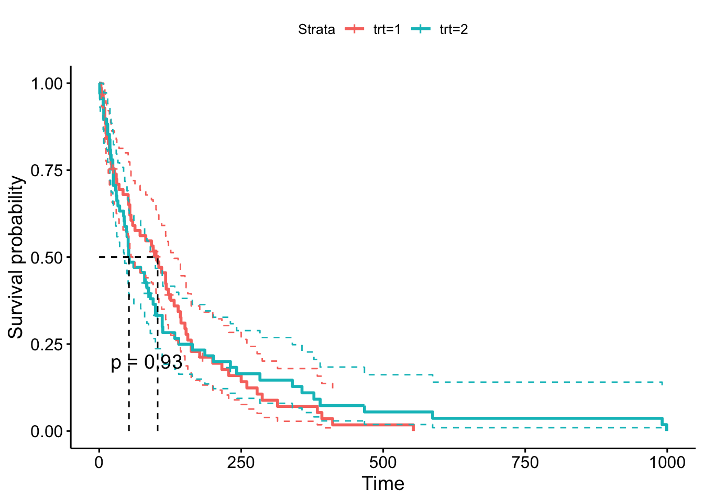

Podemos ver que no existen diferencias entre las curvas de supervivencia para los dos grupos considerados (p-valor superior a 0.05). Probamos ahora con la variable `celltype`. Como esta variable tiene cuatro grupos no representaremos los intervalos de confianza.


```r
# Estimación
fit <- survfit(Surv(time,status) ~ celltype, data = veteran)
fit
```

```
## Call: survfit(formula = Surv(time, status) ~ celltype, data = veteran)
## 
##                     n events median 0.95LCL 0.95UCL
## celltype=squamous  35     31    118      82     314
## celltype=smallcell 48     45     51      25      63
## celltype=adeno     27     26     51      35      92
## celltype=large     27     26    156     105     231
```

```r
# Gráfica de la función de supervivencia y mediana de supervivencia
ggsurvplot(fit, data = veteran, 
           surv.median.line = "hv", 
           pval = TRUE)
```


En este caso podemos ver que si existen diferencias entre las curvas de supervivencia (p-valor inferior a 0.05). AL menos existen dos funciones de supervivencia que pueden ser consideradas distintas. El problema es que el test no nos permite conocer que grupos son los que son diferentes.

### Cáncer de pulmón

Para este conjunto de datos obtenemos el resumen de la mediana de supervivencia para todo el conjunto de datos, y representamos la función de supervivencia y la mediana de supervivencia. En este caso la variable status no está codificado con 0-1 y debemos construir una nueva variable. Además añadimos las etiquetas de los factores presentes en el banco de datos.


```r
# Creamos la nueva varaible
lung <- lung %>% 
  mutate(censurado = status - 1,
         sex = fct_recode(as.factor(sex), "Male" = "1", "Female" = "2"))
```

Estimamos ahora la función de supervivencia

```r
# Estimación
fit <- survfit(Surv(time, censurado) ~ 1, data = lung)
fit
```

```
## Call: survfit(formula = Surv(time, censurado) ~ 1, data = lung)
## 
##        n events median 0.95LCL 0.95UCL
## [1,] 228    165    310     285     363
```

```r
# Gráfica de la función de supervivencia e IC
ggsurvplot(fit, data = lung, 
           palette = "blue", 
           conf.int = FALSE, 
           surv.median.line = "hv")
```

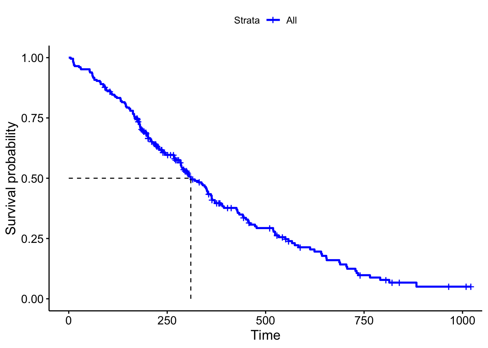

¿Cómo interpretamos esta función de supervivencia?

Utilizamos ahora la variable `sex`


```r
# Estimación
fit <- survfit(Surv(time, censurado) ~ sex, data = lung)
fit
```

```
## Call: survfit(formula = Surv(time, censurado) ~ sex, data = lung)
## 
##              n events median 0.95LCL 0.95UCL
## sex=Male   138    112    270     212     310
## sex=Female  90     53    426     348     550
```

```r
# Gráfica de la función de supervivencia e IC
ggsurvplot(fit, data = lung, 
           conf.int = TRUE, 
           conf.int.style = "step", 
           surv.median.line = "hv", 
           pval = TRUE)
```


¿Cómo interpretamos estos resultados? ¿Podemos considerar las curvas de supervivencia iguales o distintas?

## Modelos de supervivencia

En las situaciones experimentales en las que deseamos estudiar la supervivencia de un conjunto de sujetos en función de un conjunto $X = (X_1,...,X_p)$ de variables predictoras, es decir, variables que pueden afectar o caracterizar su supervivencia, es necesario establecer modelos estadísticos capaces de analizar dichas relaciones. La construcción de este tipo de modelos que depende del tiempo y de las predictoras se hace a través el análisis de las función hazard asociada $h(t;X)$. El modelo más habitual en esta situación es el **modelo hazard proporcional** que separa en dos componentes la función hazard, una correspondiente al tiempo de supervivencia y otra a las variables predictoras, de la forma siguiente: 
$$h(t;X) = h(t)exp(X\beta)$$

donde $h(t)$ es la función hazard base y describe el riesgo para individuos cuando las predictoras toman valor 0, es decir $x = O$; $exp(X\beta)$ es el riesgo relativo, y representa la reducción o incremento del riesgo asociada con el conjunto de características $X$, que es similar para todas las duraciones $t$. La exponencial está justificada por la necesidad de positivista y la hipótesis de un efecto multiplicativo de las covariables en los hazards. Este modelo implica que el cociente de hazards ($hr$) de dos individuos depende de la diferencia entre sus predictores lineales en cualquier instante t, es decir, si $x$ y $x^*$ denotan a los valores de las predictoras para ambos sujetos tendríamos que:
$$hr(x,x^*) = \frac{h(t)exp(x\beta)}{h(t)exp(x^*\beta)} = exp((x-x^*)\beta)$$
Si solo tenemos una variable predictora de tipo factor con posibles valores 0 o 1, tendríamos la expresión para la función hazard asociada a cada respuesta:
$$h(t;X = 0) = h(t); \text{ y } h(t;X = 1) = h(t)exp(\beta)$$
de forma que el el hazard rate viene dado por $hr(x = 1,x = 0) = exp(\beta)$. Esto implica que dicho coeficiente representa el incremento en el logaritmo del hazard rate, esto es:

$$log(hr(x = 1, x = 0)) = \beta$$
En este caso cuando $exp(\beta)>0$ tenemos que $hr > 1$ indicando que hay un incremento el riesgo, y por tanto una reducción de la supervivencia. Cuando $exp(\beta) < 0$ tenemos que $hr < 1$ indicando que hay un descenso en el riesgo, y por tanto un aumento de la supervivencia. 


Si la variable predictora es de tipo continuo de forma que $\delta = x -x^*$ es la diferencia entre los valores para dos sujetos, el logaritmo del hazard rate nos da:

$$log(hr(x,x^*)) = \delta\beta$$
Si el incremento entre los dos valores es de un unidad ($\delta = 1$), $\beta$ representa el incremento en el hazard rate por cada unidad que aumentamos el valor de la variable predictora. La interpretación del $hr$ es igual que el caso de un factor. Si $hr > 1$ aumenta el riesgo y si es menor que uno disminuye el riesgo 

Para facilitar la interpretación de los coeficientes se plantea la modelización del logaritmo del hazard mediante la expresión:

$$log(h(t;X)) = log(h(t)) + X\beta$$
donde queda claro que el efecto de las predictoras afecta de forma lineal a la función hazard. Esta formulación es muy similar a la de los modelos lineales generalizados con función de enlace $log()$ y con un offset dado por $log(h(t))$. EL problema es que en muchas ocasiones desconocemos la forma de la función $h$, y por tanto, no podemos determinar de forma exacta el offset asociado. Los modelos de regresión de Cox o de supervivencia no paramétrica no asumen una forma específica para $h$ al estilo de los modelos de suavizado.


La estimación de este tipo de modelos se hace mediante la función:

```r
modelo <- coxph(Surv(time,status) ~ predictoras, data = dataset)
```

Para el resumen del modelo utilizaremos las funciones `summary(modelo)` que nos proporciona el proceso de estimación del modelo, y `ggforest(modelo)` que nos proporciona un resumen gráfico del modelo ajustado (estimaciones del $hr$, intervalos de confianza y p-valores asociados para cada variable predictora presente en el modelo).

Para representar le modelo ajustado utilizaremos la función `ggcoxadjustedcurves(modelo, dataset, variable)` que permite representar la función de supervivencia asociada  con la variable de interés o con una factor creado a partir de una de las variables presente en el modelo ajustado.


### Hipótesis del modelo

Las hipótesis de este modelo son:

- Proporcionalidad en la función hazard
- El efecto de las predictoras es lineal sobre el logaritmo de la función hazard (asumiendo que no hay interacciones entre las predictoras)

Estas hipótesis deben verificarse una vez estimado el modelo de supervivencia a través de la obtención de los residuos del modelo. En este caso trabajamos con los residuos de Schoenfeld. El incumplimiento de alguna de estas hipótesis implicará el planteamiento de un nuevo modelo.

Para la verificación de las hipótesis utilizamos las funciones:

- `cox.zph(modelo)`  que permite verificar la hipótesis de hazards proporcionales mediante los residuos de Schoenfeld. La verificación gráfica se puede realizar mediante la función `ggcoxzph(modelo)` que representa para cada predictora el gráfico de residuos vs tiempo.
- `ggcoxdiagnostics(modelo)` que permite representar los residuos en función del tiempo, en función del predictor lineal o del tiempo para verificar la hipótesis de linealidad.


### Análisis Cáncer de pulmón


Procedemos en este punto a mostrar el análisis completo de los datos correspondientes al ejemplo de cáncer de pulmón. Realizaremos el análisis completo  mostrando el uso de todas las funciones tanto para la estimación y diagnóstico del modelo de regresión de Cox aplicado en este caso.

En primer lugar recodificamos la variable de status para que coincida con una variable 0-1.


```r
# Creamos la nueva varaible
lung <- lung %>% 
  mutate(censurado = status - 1,
         sex = fct_recode(as.factor(sex),"Male" = "1", "Female" = "2"))
```

#### Estimación del modelo

Por el momento plateamos un modelo en el que solo tenemos una variable predictora. Consideremos la variable `sex` dado que ya pudimos ver en el análisis preliminar que se apreciaban diferencias en la supervivencia por este factos. 


```r
# Ajuste del modelo
fit <- coxph(Surv(time, status) ~ sex, data = lung)
# Resumen del modelo ajustado
fit
```

```
## Call:
## coxph(formula = Surv(time, status) ~ sex, data = lung)
## 
##              coef exp(coef) se(coef)      z       p
## sexFemale -0.5310    0.5880   0.1672 -3.176 0.00149
## 
## Likelihood ratio test=10.63  on 1 df, p=0.001111
## n= 228, number of events= 165
```

El hazard rate asociado con le factor (columna exp(coef)) es menor que 1 lo que indica que las mujeres tienen más supervivencia que los hombres. Además el test de bondad de ajuste del modelo ("likelihood ratio test") resulta significativo indicando que el sexo contribuye claramente a explicar la supervivencia de los sujetos del estudio. A continuación se muestran gráficamente los intervalos de confianza y pvalores asociados con le modelo estimado.


```r
# Gráfico de la relevancia de los coeficientes
ggforest(fit)
```


Como podemos ver se usa la categoría "Male" como referencia para la estimación de efectos del modelo. El hazard ratio asociado con las mujeres se sitúa en 0.58, lo que indica una fuerte relación entre el sexo de los pacientes y la disminución del riesgo de muerte.Por tanto, ser mujer reduce el riesgo de muerte por un factor de 0,58 o equivalentemente un 42% (100*(1-0.58)). Concluimos que ser mujer se asocia con buen pronóstico. El intervalo de confianza para el hazard ratio en las mujeres se sitúa entre 0.42 y 0.82 indicando una reducción del riesgo de entre el 18% y el 58%.


```r
# Gráfico de supervivencia
ggadjustedcurves(fit, data =lung, 
                 variable = "sex", 
                 palette = "lancet")
```


```r
# Gráfico con intervalos de confianza
sex.df <- with(lung, data.frame(sex = c("Male", "Female")))
ggsurvplot(survfit(fit,newdata = sex.df), data = lung,
           palette = "lancet",
           conf.int = TRUE, 
           conf.int.style = "step",
           legend.labs=c("Male", "Female"))
```


A partir de la solución gráfica es posible obtener los datos de supervivencia para ambos grupos, así como la diferencia de supervivencia. El código necesario es


```r
# Guardamos la información del gráfico
datosgraf <- ggadjustedcurves(fit, data=lung, variable = "sex", palette = "lancet")$dat
datossurv <- spread(datosgraf, key = variable, value =surv)
datossurv <- datossurv %>% mutate(dif = Female - Male)
# Gráfico
ggplot(datossurv,aes(x = time, y = dif)) + geom_smooth() + theme_minimal()
```

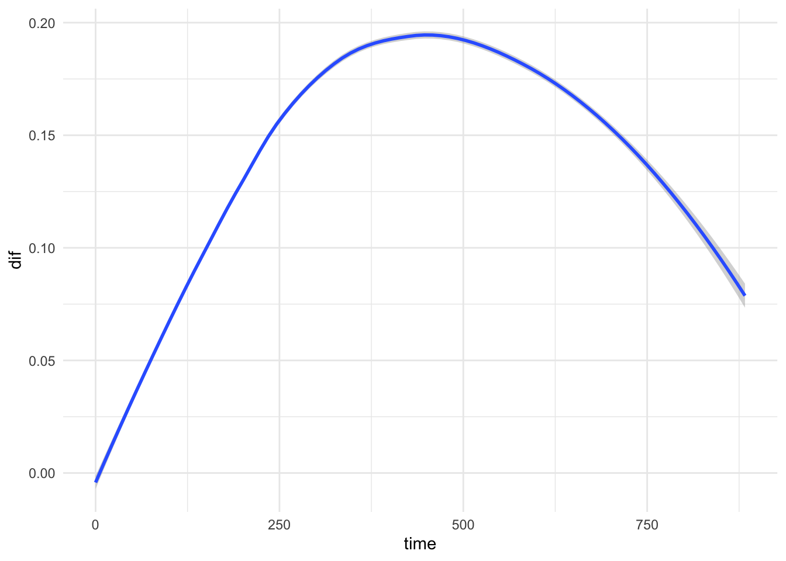

Se observa que entre los 375 y 500 días la probabilidad de supervivencia es aproximadamente 0.2 superior en las mujeres que en los hombres.
 
#### Diagnóstico del modelo

El modelo de Cox hace varias suposiciones. Por lo tanto, es importante evaluar si un modelo de regresión de Cox ajustado describe adecuadamente los datos. En concreto debemos comprobar:

- Suposición de riesgos proporcionales.
- Existen observaciones influyentes (o valores atípicos).
- Detectar la no linealidad de los efectos de las variables predictoras en la función hazard.

Para verificar estas suposiciones del modelo, se utilizan diferentes tipos de residuos. Los residuos a considerar son:

- Residuos de Schoenfeld vs time para verificar la suposición de riesgos proporcionales
- Residuos de Schoenfeld vs time para cada predictora para evaluar la no linealidad
- Desviación residual (transformación simétrica de los residuos de Martingale) para examinar observaciones influyentes
 
##### Riesgos porporcionales
 
Utilizamos la función `cox.zph()` para evaluar mediante tests estadísticos la hipótesis de riesgos proporcionales, y la función `ggcoxzph()` para el análisis gráfico.


```r
# Tests de riesgos proporcionales
ftest <- cox.zph(fit)
ftest
```

```
##        chisq df     p
## sex     2.86  1 0.091
## GLOBAL  2.86  1 0.091
```

Dado que el pvalor asociado del test resulta no significativo no podemos descartar la hipótesis de riesgos proporcionales asociados con la variable sexo.


```r
# Tests de riesgos proporcionales
ggcoxzph(ftest)
```

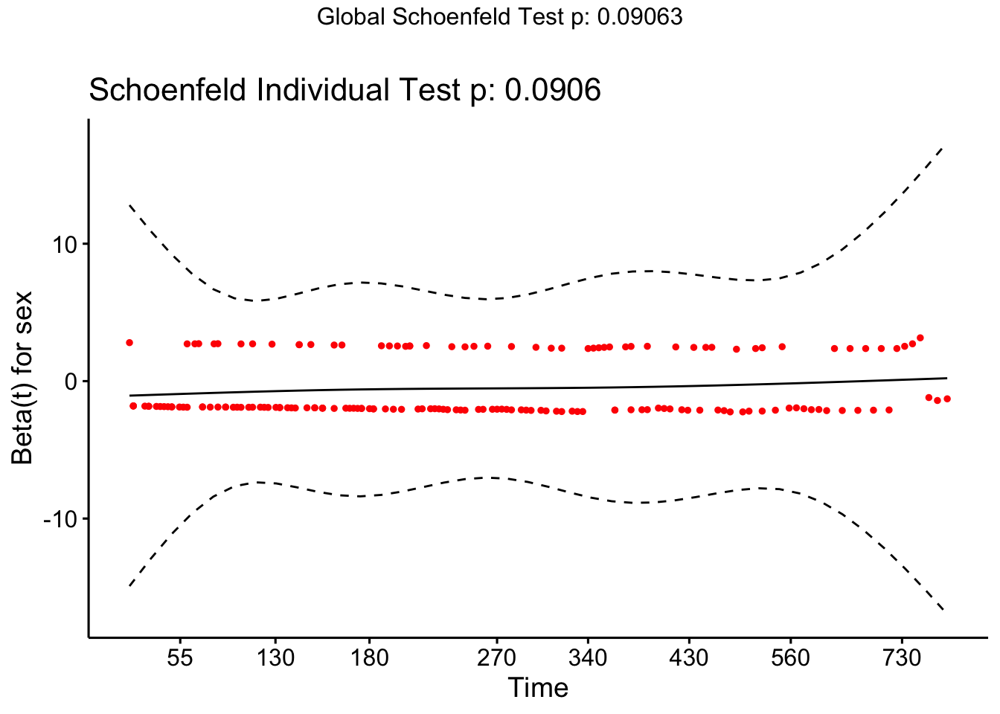

No se observa ningún tipo de tendencia en la curva ajustada (línea continua) entre tiempo y residuos, lo que da indicios de la verificación de la hipótesis de riesgos proporcionales.

##### Observaciones influyentes

La detección de observaciones influyentes se realiza mediante métodos gráficos

```r
# Observaciones influyentes
ggcoxdiagnostics(fit, type = "deviance",
                 linear.predictions = FALSE)
```

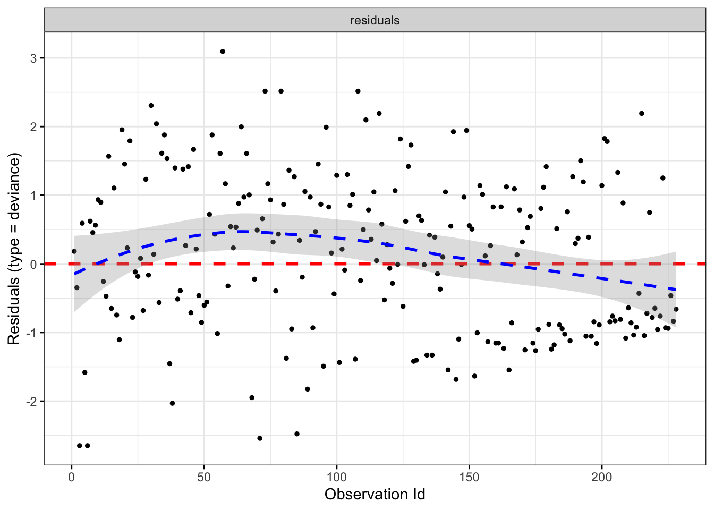

El patrón de residuos es bastante simétrico respecto de cero. Además no hay residuos con valores claramente fuera del rango (-3, 3), indicando que no hay ninguna observación que pueda identificarse como anómala. En caso de existir alguna deberíamos eliminarla y ajustar el nuevo modelo.

##### No linealidad

El test de no linealidad sólo se puede interpretar para variables de tipo numérico donde se pueden plantear diferentes tendencia en al respuesta en función de diferentes transformaciones numéricas de la predictora. En este caso realizamos el gráfico de análisis pero no lo interpretamos.


```r
# Observaciones influyentes
ggcoxdiagnostics(fit, type = "schoenfeld",
                 ox.scale = "time")
```


### Múltiples predictoras

Pasamos ahora a analizar el modelo con múltiples predictoras. En principio en este tipo de modelos no se consideran interacciones entre las predictoras para determinar el efecto individual que cada una de ellas puede tener en la supervivencia de los sujetos considerados. En nuestro caso consideramos las variables: `sex` (factor), `age` (numérica), y `wt.loss` (numérica). El modelo ajustado viene dado por:


```r
# Ajuste del modelo
fitcom <- coxph(Surv(time, status) ~ sex + age + wt.loss, data = lung)
# Resumen del modelo ajustado
fitcom
```

```
## Call:
## coxph(formula = Surv(time, status) ~ sex + age + wt.loss, data = lung)
## 
##                 coef  exp(coef)   se(coef)      z      p
## sexFemale -0.5210319  0.5939074  0.1743541 -2.988 0.0028
## age        0.0200882  1.0202913  0.0096644  2.079 0.0377
## wt.loss    0.0007596  1.0007599  0.0061934  0.123 0.9024
## 
## Likelihood ratio test=14.67  on 3 df, p=0.002122
## n= 214, number of events= 152 
##    (14 observations deleted due to missingness)
```

A la hora de interpretar los resultados de este modelo hay que tener en cuenta que las estimaciones proporcionadas corresponden al efecto de cada variable cuando el resto se mantienen constantes. Eso quiere decir que el riesgo de 0.59 para la variable sexo se obtiene fijando el resto de variables en su valor medio. En este caso tendríamos que la edad se fijaría en 62.47 y wt.loss en 9.8. Por tanto, el riesgo de muerte se reduce en las mujeres en un 43% (0.57) para una edad de 62 años y una pérdida de peso de 9.8 kg. En cuanto a los pvalores podemos ver que tanto la variable sex como age contribuyen significativamente la supervivencia de los sujetos, pero no así la variable wt.loss Por cada aumento de una unidad de edad el riesgo de morir aumenta en un 2% (1.02). El test global indica que el modelo construido es útil para explicar la supervivencia de los sujetos. Veamos el análisis gráfico de los coeficientes del modelo:


```r
# Gráfico de la relevancia de los coeficientes
ggforest(fitcom)
```


Representamos ahora las curvas de supervivencia ajustadas. Recordemos que sólo se representan la curvas de supervivencia comparando por variables de tipo factor. En este caso tenemos dos variables de tipo numérico, de forma que si queremos representar la supervivencia asociada con cada una de ellas las deberemos convertir en factores de una forma adecuada. Esta forma de proceder es muy habitual den los modelos de supervivencia donde siempre son preferibles variables de tipo factor a las numéricas. En este caso los gráficos son condicionales a los valores medios de las variables numéricas, tal y como hemos explicado en la interpretación de los parámetros del modelo.


```r
# Gráfico de supervivencia para sex
ggadjustedcurves(fitcom, data = lung, 
                 variable = "sex", 
                 palette = "lancet")
```


```r
# Gráfico con intervalos de confianza tomando los valores medios de las numéricas
sex.df <- with(lung, data.frame(sex = c("Male", "Female"),
                                age = rep(62.5,2),
                                wt.loss = rep(9.5,2)))
ggsurvplot(survfit(fit, newdata = sex.df), data = lung,
           palette = "lancet",
           conf.int = TRUE, 
           conf.int.style = "step",
           legend.labs=c("Male", "Female"))
```


Para representar las curvas de supervivencia para la variable numérica procedemos construyendo una nueva variable categórica artificial a partir de los cuantiles de la variable numérica, y sin necesitad de ajustar el modelo.


```r
# Edad
# Variable  artificial
lung$agenew <- cut(lung$age, quantile(lung$age, na.rm = TRUE))
lung$wtnew <- cut(lung$wt.loss, quantile(lung$wt.loss, na.rm = TRUE))
# Ajuste del modelo
fitcom <- coxph(Surv(time, status) ~ sex + agenew + wtnew, data = lung)
# Gráfico de supervivencia para edad
ggadjustedcurves(fitcom, data = lung, 
                 variable = "agenew", 
                 palette = "lancet")
```

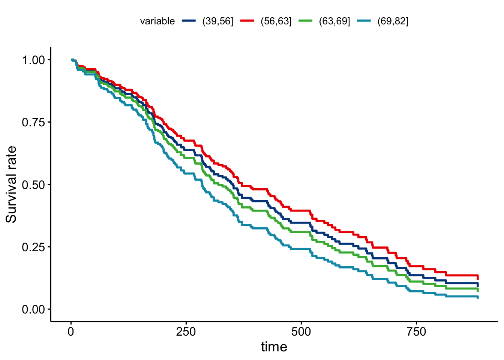

```r
# Pérdida de peso
# Gráfico de supervivencia para sex
ggadjustedcurves(fitcom, data = lung, 
                 variable = "wtnew", 
                 palette = "lancet")
```

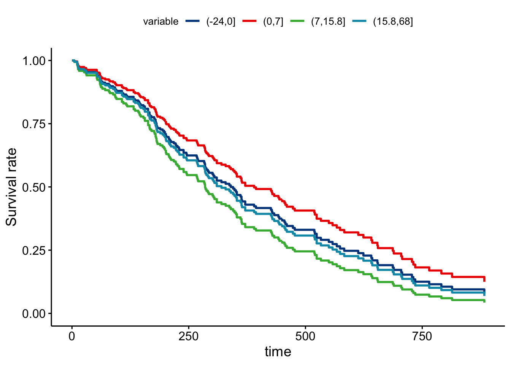

Podemos ver que los sujetos de mayor edad tienen una supervivencia menor, así como los que han perdido más peso en los último seis meses. Sin embargo, esta forma de proceder no es óptima ya que hay muchas curvas de supervivencia muy similares. Para evitar esto podemos buscar el punto de la variable numérica que separa a los sujeto en dos grupos que podemos considerar que tienen supervivencias distintas. Para realizar esto utilizamos la función `surv_cutpoint`.


```r
# Puntos de corte
corte <- surv_cutpoint(lung, time = "time", 
              event = "status", 
              variables = c("age", "wt.loss"))
corte
```

```
##         cutpoint statistic
## age           70  2.013619
## wt.loss        9  1.756750
```

El valor para edad se sitúa en los 70 años mientras que para la pérdida de peso es de 9kg. Veamos los gráfico con las variables artificiales


```r
# Variable  artificial edad
lung$agenew <- ifelse(lung$age >= corte$age$estimate,"+70","-70")
lung$wtnew <- ifelse(lung$wt.loss >= corte$wt.loss$estimate,"+9","-9")
# Ajuste del modelo
fitcom <- coxph(Surv(time, status) ~ sex + agenew + wtnew, data = lung)
# Gráfico de supervivencia para edad
ggadjustedcurves(fitcom, data = lung, 
                 variable = "agenew", 
                 palette = "lancet")
```

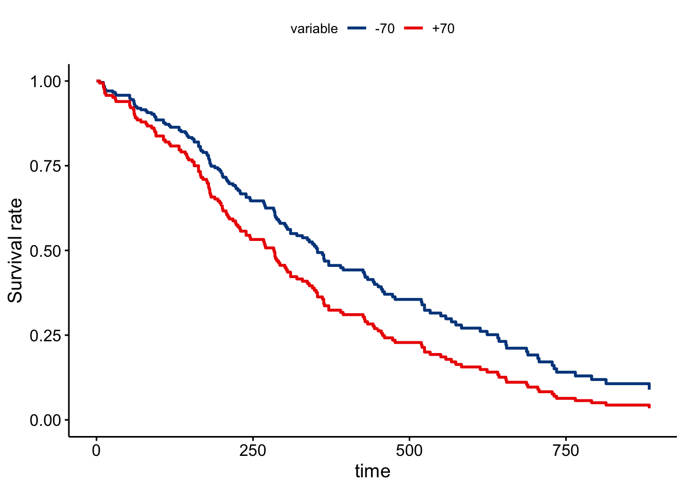

```r
# Gráfico de supervivencia para pérdida de peso
ggadjustedcurves(fitcom, data = lung, 
                 variable = "wtnew", 
                 palette = "lancet")
```

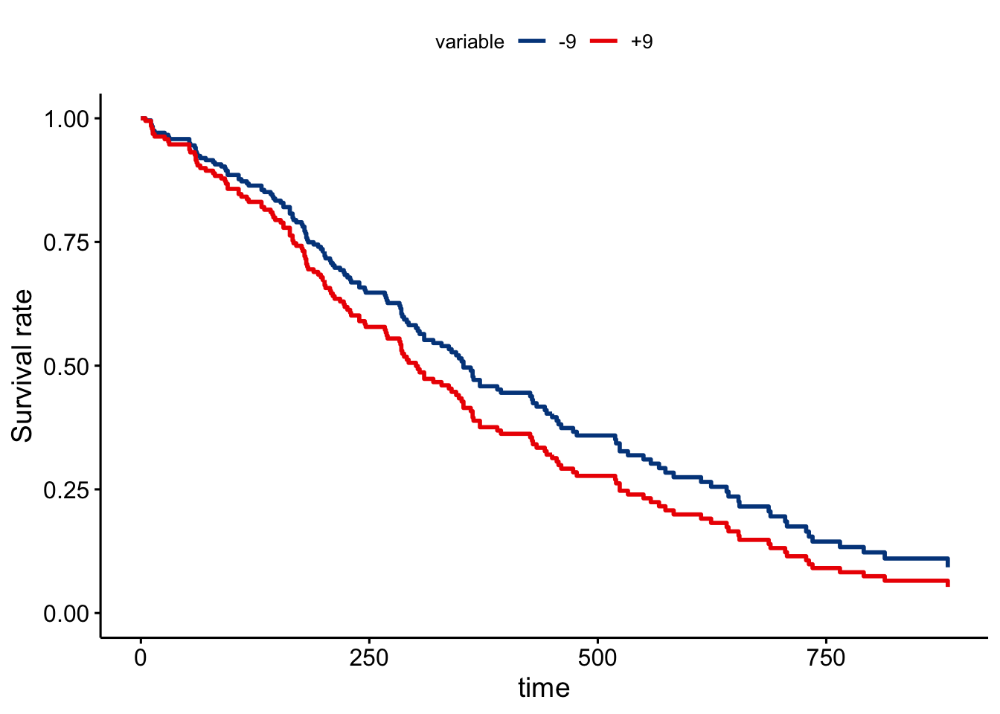

Para variables numéricas con pocos valores posibles resulta más útil introducir dicha variable en el modelo como un nivel de estratificación son necesidad de estimar el coeficiente asociado. En este caso las variables `ph.ecog` y `ph.karno` se pueden tomar como estratos, ya que se tratan de valoraciones sobre los sujetos que no tienen porque tener relación directa con la supervivencia. En este caso el modelo a ajustar viene dado por:


```r
# Ajuste del modelo
coxph(Surv(time, status) ~ sex + age + wt.loss + strata(ph.ecog) + strata(ph.karno), data = lung)
```

```
## Call:
## coxph(formula = Surv(time, status) ~ sex + age + wt.loss + strata(ph.ecog) + 
##     strata(ph.karno), data = lung)
## 
##                coef exp(coef)  se(coef)      z        p
## sexFemale -0.632793  0.531106  0.188563 -3.356 0.000791
## age        0.020913  1.021133  0.010562  1.980 0.047702
## wt.loss   -0.009286  0.990757  0.007059 -1.315 0.188359
## 
## Likelihood ratio test=17.16  on 3 df, p=0.0006537
## n= 213, number of events= 151 
##    (15 observations deleted due to missingness)
```

¿Cómo interpretaríamos este modelo?

También podríamos ajustar el modelo de supervivencia con los nuevos factores creados:


```r
# Ajuste del modelo
fitcomp2 <- coxph(Surv(time, status) ~ sex + agenew + wtnew, data = lung)
fitcomp2
```

```
## Call:
## coxph(formula = Surv(time, status) ~ sex + agenew + wtnew, data = lung)
## 
##              coef exp(coef) se(coef)      z       p
## sexFemale -0.5160    0.5969   0.1744 -2.960 0.00308
## agenew+70  0.3754    1.4555   0.1800  2.086 0.03702
## wtnew+9    0.2370    1.2675   0.1628  1.456 0.14549
## 
## Likelihood ratio test=16.34  on 3 df, p=0.0009675
## n= 214, number of events= 152 
##    (14 observations deleted due to missingness)
```

Se puede ver como el efecto de la edad es mucho más claro en este modelo. ¿Cuáles serían los riesgos asociados con cada una de las variables?

Procedemos con el gráfico de curvas de supervivencia estimadas:


```r
# Gráfico conjunto de todos los fatores
ggsurvplot_facet(fitcomp2, lung, facet.by = "wtnew",
                palette = "lancet", pval = TRUE)
```


Con este tipo de gráficos resulta posible estudiar como se modifica la supervivencia cuando tenemos variables que no están en el modelo. Partimos del modelo más simple donde sólo consideramos la variable sexo, y estudiamos las funciones de supervivencia si incluimos las variables edad y pérdida de peso en forma de factores:


```r
# Eliminamos valores pérdidos
lung <- na.omit(lung)
# Gráfico conjunto de todos los fatores
ggsurvplot_facet(fit, lung, facet.by = c("agenew","wtnew"),
                palette = "lancet", pval = TRUE)
```


Este gráfico nos permite comparar el efecto de las combinaciones de los nuevos factores teniendo en cuenta el modelo por sexo. Es casi como un estudio de la interacción o de la inclusión de un factor en el modelo.

### Diagnóstico del modelo

Comenzamos con el diagnóstico del modelo. En principio trabajamos con le modelo tomando las variables edad y peso perdido como numéricas.


```r
# Ajuste del modelo
fitcomp <- coxph(Surv(time, status) ~ sex + age + wt.loss, data = lung)
```

#### Riesgos porporcionales
 

```r
# Tests de riesgos proporcionales
ftest <- cox.zph(fitcomp)
ftest
```

```
##         chisq df    p
## sex     1.003  1 0.32
## age     0.668  1 0.41
## wt.loss 0.351  1 0.55
## GLOBAL  1.868  3 0.60
```

Todos los pvalores (tanto los individuales de cada variable como el global para el modelo) son superiores a 0.05 indicando que se verifica la hipótesis de riesgos proporcionales. Veamos el análisis gráfico:


```r
# Gráfico de riesgos proporcionales
ggcoxzph(ftest)
```


#### Observaciones influyentes


```r
# Observaciones influyentes
ggcoxdiagnostics(fitcomp, type = "deviance",
                 linear.predictions = FALSE)
```

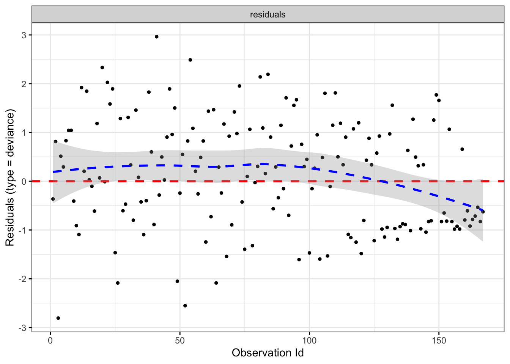

No se aprecian observaciones influyentes.


Podemos ver que se cumplen todas la hipótesis del modelo, pero ¿podemos considerar que los modelos ajustados son iguales en su capacidad explicativa? Para poder verificar esto realizamos el test de comparación de modelos basado en el test Ji-cuadrado. ¿Podríamos prescindir de alguna variable? Comparamos los siguientes modelos para obtener el modelo con menor número de predictoras pero con la misma capacidad explicativa. Construimos modelos anidados para favorecer la comparación:


```r
# Ajuste del modelos
fit1 <- coxph(Surv(time, status) ~ sex, data = lung)
fit2 <- coxph(Surv(time, status) ~ sex + agenew, data = lung)
fit3 <- coxph(Surv(time, status) ~ sex + agenew + wt.loss, data = lung)
# Comparación
summary(fit)
summary(fit2)
summary(fit3)
```

Puesto que no hay ningún pvalor significativo podríamos concluir que el mejor modelo es aquel que sólo contiene la variable sexo, pero podríamos llegar a modelos erróneos. En el caso de tener factores que no parecen aportar capacidad explicativa pero que si tienen sentido desde el punto de vista experimental, es necesario introducirlos en el modelo de alguna forma. En este caso utilizamos la denominada estratificación. Ajustamos los nuevos modelos considerando la edad como variable estratificada. Al considerarla de esta forma no podremos evaluar su riesgo de forma directa en la supervivencia, pero si en la supervivencia global.


En este caso podemos ver que el modelo 2 es claramente distinto del modelo 1, pero no es distinto del modelo 3. Por tanto, nuestro modelo para estos datos sería el 2.


```r
# Ajuste del modelo
fitcomp <- coxph(Surv(time, status) ~ sex + strata(agenew), data = lung)
fitcomp
```

```
## Call:
## coxph(formula = Surv(time, status) ~ sex + strata(agenew), data = lung)
## 
##              coef exp(coef) se(coef)      z      p
## sexFemale -0.4645    0.6285   0.1981 -2.344 0.0191
## 
## Likelihood ratio test=5.75  on 1 df, p=0.01645
## n= 167, number of events= 120
```

Veamos el diagnóstico


```r
# Tests de riesgos proporcionales
ftest <- cox.zph(fitcomp)
ftest
```

```
##        chisq df    p
## sex    0.944  1 0.33
## GLOBAL 0.944  1 0.33
```

```r
# Observaciones influyentes
ggcoxdiagnostics(fitcomp, type = "deviance",
                 linear.predictions = FALSE)
```


```r
# No linealidad
ggcoxdiagnostics(fitcomp, type = "schoenfeld",
                 ox.scale = "time")
```

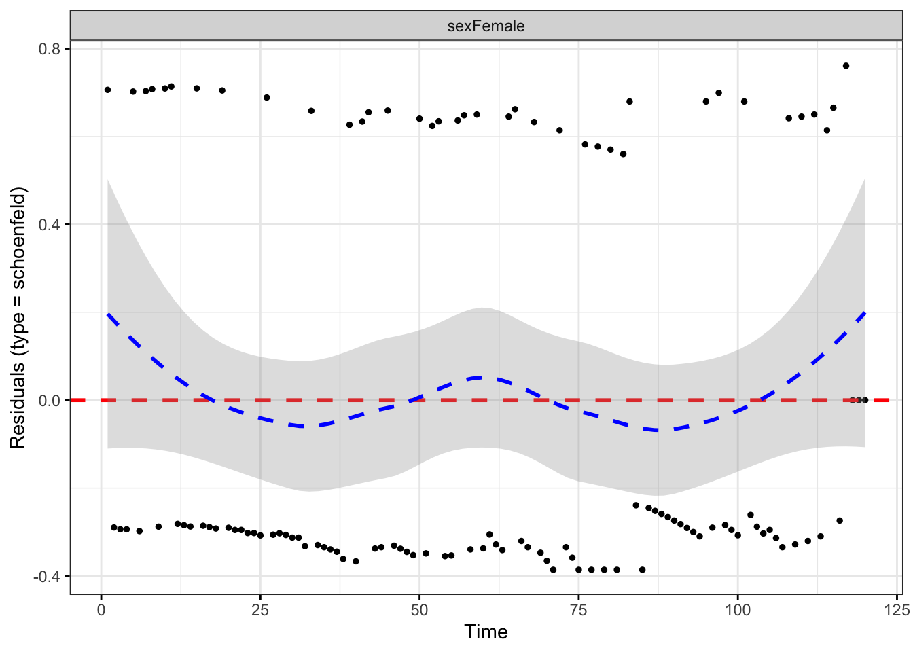


Se cumplen todas las hipótesis. Representamos las funciones de supervivencia para este modelo


```r
# Supervivencia para menores de 70 años
sex.df <- with(lung, data.frame(sex = c("Male", "Female"),
                                agenew = c("-70","-70")))
ggsurvplot(survfit(fitcomp,newdata = sex.df), data = lung,
           palette = "lancet",
           conf.int = TRUE, 
           conf.int.style = "step",
           legend.labs=c("Male", "Female"))
```

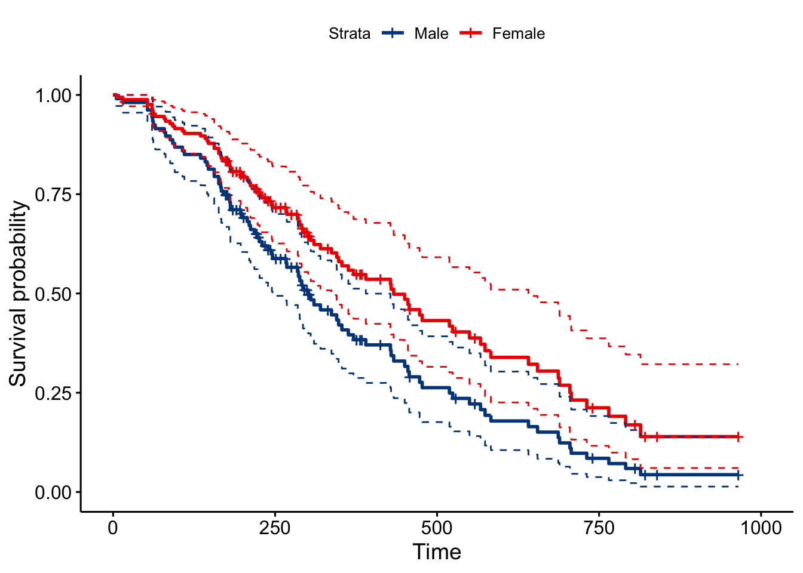

```r
# Supervivencia para mayores de 70 años
sex.df <- with(lung, data.frame(sex = c("Male", "Female"),
                                agenew = c("+70","+70")))
ggsurvplot(survfit(fitcomp,newdata = sex.df), data = lung,
           palette = "lancet",
           conf.int = TRUE, 
           conf.int.style = "step",
           legend.labs=c("Male", "Female"))
```


Se puede ver como si se aprecian diferencias por sexo para los menores de 70 años, pero no ocurre lo mismo para los mayores de 70 años (el intervalo de confianza de los hombres contiene a la estimación de supervivencia para las mujeres).

Existen más modificaciones de este tipo de modelos que por límite de tiempo no consideramos aquí como son: la posible inclusión de interacciones, modelos doble censurados, incorporación de efectos de grupos o sujetos (camadas, hospitales,...). parte de estas situaciones aparecen en los ejemplos planteados al inicio de este tema y se trataran con lago de detalle en las sesiones prácticas.

## Ejercicios

Colección de ejercicios sobre modelos de supervivencia. 

_No olvides cargar las librerías para realizar los ejercicios._

**Ejercicio 1.** Los datos siguientes corresponden a un pequeño experimento en el que 7 de un total de 16 ratones fueron aleatoriamente seleccionados para recibir un nuevo tratamiento médico. Los 9 ratones restantes fueron asignados a un grupo control en el que no se administró ningún tipo de tratamiento. El objetivo del tratamiento era prolongar el tiempo de supervivencia después de una operación quinírgica. El banco de datos contiene los tiempos de supervivencia (en días) tras la operación para los 16 ratones. El objetivo principal es saber si el tratamiento prolongaba la vida de los ratones tras la operación


```r
grupo <- c(rep("Tratado", 7), rep("Control", 9))
tiempo <- c(94, 38, 23, 19, 99, 16,141, 52, 104, 146, 10, 51, 30, 40, 27, 46)
```

**Ejercicio 2.** Los datos de la Tabla siguiente son: 'tiemsup', que es el tiempo hasta la muerte (en semanas) desde la diagnosis de leucemia, y 'logcel', igual al log 10 del número inicial de células blancas en la sangre. Se dispone de datos de diecisiete pacientes que sufrían de leucemia. ¿Cuáles son tus conclusiones sobre la utilidad de saber el número de células blancas en la sangre para predecir el tiempo de supervivencia? ¿Cuál es la probabilidad de sobrevivir de un paciente con 5000 células blancas en la sangre?


```r
tiemsup <- c(65, 156, 100, 134, 16, 108, 121, 5, 65, 4, 39, 143, 56, 26, 22, 1, 1)
logcel <- c(3.36, 2.88, 3.63, 3.41, 3.78, 4.02, 4.00, 4.72, 5.00, 4.23, 3.73, 3.85, 3.97, 4.51, 4.54, 5.00, 5.00)
```

**Ejercicio 3.** Un total de 90 pacientes que sufrían ele cancer gástrico fueron asignados aleatoriamente a dos grupos. Un gupo fue tratado con quimioterapia y radiación, mientras que el otro sólo recibió quimioterapia. Se recoge además el tiempo de superviviencia si dicho datos está censurado (0) o no (1). ¿Existe evidencia para concluir que la radiación prolonga el tiempo de supervivencia?


```r
group <- c(rep("Q+R", 45),rep("Q", 45))
censor <- c(rep(1, 36),rep(0, 9),rep(1, 36),rep(0, 9)) 
time <- c(17, 42, 44, 48, 60, 72, 74, 95, 103, 108, 122, 144, 167, 170, 183, 185, 193, 195, 197, 208, 234, 235, 254, 307, 315, 401, 445, 464, 484, 528, 542, 567, 577, 580, 795, 855, 1174, 1214, 1232, 1366, 1455, 1585, 1622, 1626, 1736, 1, 63, 105, 125, 182, 216, 250, 262, 301, 301, 342, 354, 356, 358, 380, 383, 383, 388, 394, 408, 460, 489, 499, 523, 524, 535, 562, 569, 675, 676, 748, 778, 786, 797, 955, 968, 977, 1245, 1271, 1420, 1460, 1516, 1551, 1690, 1694) 
```

**Ejercicio 4.** Los datos siguientes contienen los tiempos de remisión de pacientes con leucemia para dos grupos de pacientes ¿Existen diferencias en los tiempos de supervivencia para ambos grupos? Realiza un estudio completo del modelo de superviviencia asocaido con estos datos.


```r
glm_surv_01=read_csv("https://goo.gl/d4YI9g", col_types = "cid")
str(glm_surv_01)
```

```
## spec_tbl_df [42 × 3] (S3: spec_tbl_df/tbl_df/tbl/data.frame)
##  $ group : chr [1:42] "control" "control" "control" "control" ...
##  $ censor: int [1:42] 1 1 1 1 1 1 1 1 1 1 ...
##  $ time  : num [1:42] 1 1 2 2 3 4 4 5 5 8 ...
##  - attr(*, "spec")=
##   .. cols(
##   ..   group = col_character(),
##   ..   censor = col_integer(),
##   ..   time = col_double()
##   .. )
##  - attr(*, "problems")=<externalptr>
```

**Ejercicio 5.** El conjunto de datos siguiente contiene los datos de supervivencia (en meses) de pacientes hepatitis crónica activa y que son dividios en dos grupos. Al grupo tratado se le suministra Prednisona mientras que el otro grupo actúa como control. ¿Existen diferencias en los tiempos de supervivencia para ambos grupos? Realiza un estudio completo del modelo de superviviencia asocaido con estos datos.


```r
glm_surv_02=read_csv("https://goo.gl/Rzxo3o", col_types = "dcc")
str(glm_surv_02)
```

```
## spec_tbl_df [44 × 3] (S3: spec_tbl_df/tbl_df/tbl/data.frame)
##  $ stime : num [1:44] 2 6 12 54 56 68 89 96 96 125 ...
##  $ censor: chr [1:44] "died" "died" "died" "died" ...
##  $ group : chr [1:44] "prednisolone" "prednisolone" "prednisolone" "prednisolone" ...
##  - attr(*, "spec")=
##   .. cols(
##   ..   stime = col_double(),
##   ..   censor = col_character(),
##   ..   group = col_character()
##   .. )
##  - attr(*, "problems")=<externalptr>
```

**Ejercicio 6.** Los siguientes datos representan la supervivencia en días desde el ingreso al ensayo de pacientes con linfoma histiocítico difuso. Se comparan dos grupos diferentes de pacientes, aquellos con estadio III y aquellos con enfermedad en estadio IV. 


```r
group <- c(rep("SIII", 19),rep("SIV", 61))
censor <- c(1, 1, 1, 1, 1, 0, 1, 0, 0, 1, 0, 0, 1, 0, 0, 0, 0, 0, 0, 1, 1, 1, 1, 1, 1, 1, 1, 1, 1, 1, 1, 1, 1, 1, 1, 1, 1, 1, 1, 1, 1, 1, 0, 0, 1, 1, 1, 1, 0, 0, 1, 1, 1, 1, 1, 1, 1, 1, 1, 1, 1, 1, 0, 1, 1, 1, 1, 1, 1, 1, 0, 0, 0, 0, 0, 0, 0, 0, 0, 0) 
time <- c(6, 19, 32, 42, 42, 43, 94, 126, 169, 207, 211, 227, 253, 255, 270, 310, 316, 335, 346, 4, 6, 10, 11, 11, 11, 13, 17, 20, 20, 21, 22, 24, 24, 29, 30, 30, 31, 33, 34, 35, 39, 40, 41, 43, 45, 46, 50, 56, 61, 61, 63, 68, 82, 85, 88, 89, 90, 93, 104, 110, 134, 137, 160, 169, 171, 173, 175, 184, 201, 222, 235, 247, 260, 284, 290, 291, 302, 304, 341, 345) 
```

