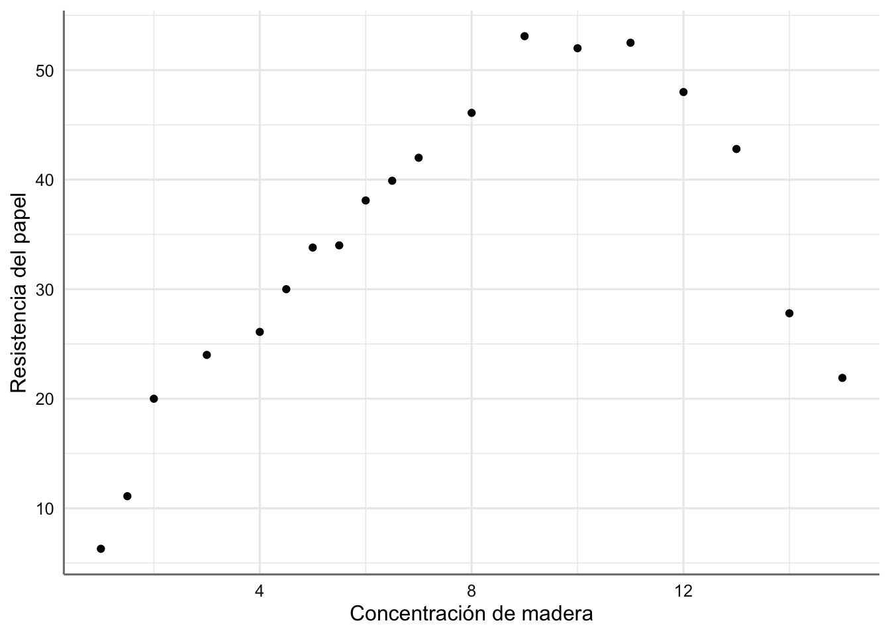

# Regresión Lineal Múltiple y Polinómica {#rlm}

Como extensión a los modelos de regresión lineal simple presentados en la Unidad \@ref(rls) estudiamos los **modelos de regresión lineal múltiple (RLM)** y los **modelos polinómicos (MP)**. La diferencia principal entre estos modelos y el de RLS es que estos involucran al menos dos variables predictoras de tipo numérico para tratar de explicar el comportamiento de la respuesta. Aunque la base de construcción del modelo es similar a lo tratado en la unidad anterior veremos y estudiaremos con detalle las particularidades de estos modelos. De hecho, veremos que todos los modelos se pueden expresar matemáticamente de una forma única lo que facilita su estudio, y nos permite considerar tanto modelos simples (con pocas predictoras) como los más complejos (con muchas predictoras).

Antes de pasar a la presentación de estos modelos vamos a ver los ejemplos que iremos trabajando a lo largo de esta unidad. Al igual que en el modelo RLS el primer paso es la representación de los datos recogidos y realizar un pequeño estudio descriptivo sobre la posible asociación entre la respuesta y cada una de las predictoras consideradas, dado que resulta imposible realizar gráficos multivariantes de la respuesta vs todas las predictoras.

Veamos los diferentes ejemplos con los que vamos a trabajar a lo largo de esta unidad.

**Ejemplo 1. Datos de Bosque.** Para estimar la producción en madera de un bosque se suele realizar un muestreo previo en el que se realizan una serie de medidas no destructivas. Disponemos de mediciones para 20 árboles, así como el volumen (VOL) de madera que producen una vez cortados. Las variables consideradas son: HT o altura en pies, DBH el diámetro del tronco a 4 píes de altura (en pulgadas), D16 el diámetro del tronco a 16 pies de altura (en pulgadas), y VOL el volumen de madera conseguida (en pies cúbicos). El objetivo del análisis es determinar cuál es la relación entre dichas medidas y el volumen de madera, con el fin de poder predecir este último en función de las primeras.


```r
dbh <- c(10.2, 13.72, 15.43, 14.37, 15, 15.02, 15.12, 15.24, 15.24, 15.28, 13.78, 
     15.67, 15.67, 15.98, 16.5, 16.87, 17.26, 17.28, 17.87, 19.13)
d16 <- c(9.3, 12.1, 13.3, 13.4, 14.2, 12.8, 14, 13.5, 14, 13.8, 13.6, 14, 
     13.7, 13.9, 14.9, 14.9, 14.3, 14.3, 16.9, 17.3)
ht <- c(89, 90.07, 95.08, 98.03, 99, 91.05, 105.6, 100.8, 94, 93.09, 89, 102, 
    99, 89.02, 95.09, 95.02, 91.02, 98.06, 96.01, 101)
vol <- c(25.93, 45.87, 56.2, 58.6, 63.36, 46.35, 68.99, 62.91, 58.13, 59.79, 
     56.2, 66.16, 62.18, 57.01, 65.62, 65.03, 66.74, 73.38, 82.87, 95.71)
bosque <- data.frame(vol, dbh, d16, ht)
# Gráficos parciales
datacomp = melt(bosque, id.vars = 'vol')
ggplot(datacomp) +
 geom_jitter(aes(value, vol, colour = variable)) + 
 facet_wrap(~variable, scales = "free_x") +
 labs(x = "", y = "Volumen") 
```

<div class="figure" style="text-align: center">

<p class="caption">(\#fig:rlm001)Gráfico de dispersión de Volumen respecto de cada predictora.</p>
</div>

A simple vista todas las predictoras tienen un efecto positivo en el volumen de madera obtenido, lo cual es bastante obvio, ya que cuanto más grande sea el árbol se espera que su volumen sea más grande. Sin embargo, parece que el efecto de los diámetros es superior al de la altura del árbol (pendientes más pronunciadas) aunque resulta difícil distinguir que diámetro puede ser más relevante ya que ambos se comportan de forma similar. Podemos confirmar este hecho realizando un análisis de correlación para este banco de datos.

**Ejemplo 2. Datos de Concentración.** Se ha llevado a cabo un experimento para estudiar la concentración presente de un fármaco en el hígado después de sufrir un tratamiento. Se piensa que las variables que pueden influir en la concentración son el peso del cuerpo, el peso del hígado y la dosis de fármaco administrada.


```r
p.cuerpo <- c(176, 176, 190, 176, 200, 167, 188, 195, 176, 165, 158, 148, 149, 163, 
              170, 186, 146, 181, 149)
p.higado <- c(6.5, 9.5, 9.0, 8.9, 7.2, 8.9, 8.0, 10.0, 8.0, 7.9, 6.9, 7.3, 5.2, 8.4, 
              7.2, 6.8, 7.3, 9.0, 6.4) 
dosis <- c(.88, .88, 1.0, .88, 1.0, .83, .94, .98, .88, .84, .80, .74, .75, .81, .85, 
           .94, .73, .90, .75)
concen <- c(.42, .25, .56, .23, .23, .32, .37, .41, .33, .38, .27, .36, .21, .28, .34, 
            .28, .30, .37, .46)
concentracion <- data.frame(p.cuerpo, p.higado, dosis, concen)
# Gráficos parciales
datacomp = melt(concentracion, id.vars = 'concen')
ggplot(datacomp) +
 geom_jitter(aes(value, concen, colour = variable)) + 
 facet_wrap(~variable, scales = "free_x") +
 labs(x = "", y = "Concentración del fármaco") 
```

<div class="figure" style="text-align: center">

<p class="caption">(\#fig:rlm002)Gráfico de dispersión de la concentración del fármaco respecto de cada predictora.</p>
</div>
En este caso ninguno de los gráficos parciales muestra una gran asociación entre la concentración del fármaco y cada una de las predictoras. En todos ellos se aprecia una observación un poco más alejada del resto (concentración > 0.6) que podría ser influyente en la obtención del modelo correspondiente.

**Ejemplo 3. Datos de Papel. ** Banco de datos de Papel de la unidad anterior, donde ya pudimos ver que la tendencia observada se comportaba más como una parábola (polinomio de grado 2) que como una recta. 

```r
madera <- c(1, 1.5, 2, 3, 4, 4.5, 5, 5.5, 6, 6.5, 7, 8, 9, 10, 11, 12, 13, 14, 15)
tension <- c(6.3, 11.1, 20.0, 24, 26.1, 30, 33.8, 34, 38.1, 39.9, 42, 46.1, 53.1, 
             52, 52.5, 48, 42.8, 27.8, 21.9)
papel <- data.frame(madera, tension)
ggplot(papel, aes(x = madera, y = tension)) +
 geom_point() +
 labs(x = "Concentración de madera", y = "Resistencia del papel") 
```

<div class="figure" style="text-align: center">

<p class="caption">(\#fig:rlm003)Gráfico de dispersión de resistencia del papel vs concentración de madera.</p>
</div>

## Tipos de modelos

Vemos las diferencias de expresión de cada uno de los modelos que trabajaremos en esta unidad.

### Modelos de RLM

Los modelos de regresión lineal múltiple surgen cuando tratamos de explicar el comportamiento de una variable predictora de tipo continuo a través de un conjunto de variables predictoras de tipo continuo mediante una función lineal. De hecho, se trata de describir dicha relación a través de una superficie, lineal en las variables explicativas, lo más próxima posible a los valores observados de la respuesta. Si $X_1, X_2, ..., X_p$ son las variables predictoras el modelo viene dado por:

\begin{equation}
Y = \beta_0 + \beta_1 X_1 + \beta_2 X_2 + ... + \beta_p X_p + \epsilon 
(\#eq:ecuacionRLM)
\end{equation}

Las hipótesis de este modelo es que los errores se distribuyen de forma independiente mediante una distribución Normal de media cero y varianza constante $\sigma^2$. 

Los parámetros desconocidos de este modelo son $(\beta_0, \beta_1, ... , \beta_p, \sigma^2)$ donde: 

* $\beta_0$ se conoce como interceptación y representa el valor de la respuesta cuando la variable predictora toma el valor cero, interpretándose como un efecto común en la relación entre la predictora y la respuesta.
* Los $\beta_i$ son las pendientes de la recta asociadas con cada predictora y representa el aumento o disminución del valor de la respuesta cuando aumentamos en una unidad el valor de la predictora. En este tipo de modelos dicho parámetro se conoce también como el efecto de la predictora sobre la respuesta.
* $\sigma^2$ es la varianza residual del modelo.

Dada un muestra de $n$ sujetos de la variable respuesta $(y_1, ..., y_n)$ y de las variables predictoras $(x_{11}, ..., x_{n1}), (x_{12}, ..., x_{n2}), ..., (x_{1p}, ..., x_{np})$, el modelo de regresión lineal múltiple se puede escribir como:

$$Y = \left(\begin{array}{c}
  y_1 \\
  y_2 \\
  ...\\
  y_n\\
 \end{array} \right) = 
 \left(\begin{array}{cccc}
  1 & x_{11} & ... & x_{1p}\\
  1 & x_{21} & ...& x_{2p}\\
  ...& ...  & ...& ...\\
  1 &  x_{n1}& ...& x_{np}\\
 \end{array} \right)
 \left(\begin{array}{c}
  \beta_0 \\
  \beta_1 \\
  ....\\
  \beta_p\\
 \end{array} \right) + 
 \left(\begin{array}{c}
  e_1 \\
  e_2 \\
  ...\\
  e_n
 \end{array} \right) = X \beta + \epsilon$$

donde $X$ se denomina matriz del diseño, representando el efecto común (columna de 1's) y el efecto de las predictoras (cada columna con los valores de la variable), y los $e_i$ representan los errores aleatorias para cada uno de los sujetos de la muestra.

Los bancos de datos de bosque y concentración quedarían englobados dentro de este conjunto de modelos con la siguiente propuesta:

* Datos de bosque

$$
\text{vol} = \beta_{0} + \beta_{1}\text{dbh} + \beta_{2}\text{d16} + \beta_{3}\text{ht} + \epsilon
$$

* Datos de concentración

$$
\text{concen} = \beta_{0} + \beta_{1}\text{p.cuerpo} + \beta_{2}\text{p.higado} + \beta_{3}\text{dosis} + \epsilon
$$

### Modelos de RP

Los modelos de regresión lineal múltiple surgen cuando tratamos de explicar el comportamiento de una variable predictora de tipo continuo a través de una variable predictora de tipo continuo mediante una función polinómica lineal. En general, los modelos polinómicos son útiles cuando se aprecia una tendencia curvilínea entre los predictores y la respuesta. Asimismo, a veces constituyen una aproximación sencilla (por serie de Taylor) a modelos complejos e incluso no-lineales. Si $X$ es la variable predictora y queremos un polinomio de grado $k$ el modelo viene dado por:

\begin{equation}
Y = \beta_0 + \beta_1 X + \beta_2 X^2 + ... + \beta_k X^k + \epsilon
(\#eq:ecuacionMP)
\end{equation}

Las hipótesis de este modelo es que los errores se distribuyen de forma independiente mediante una distribución Normal de media cero y varianza constante $\sigma^2$. 

Los parámetros desconocidos de este modelo son $(\beta_0, \beta_1, ... , \beta_k, \sigma^2)$ donde: 

* $\beta_0$ se conoce como interceptación y representa el valor de la respuesta cuando la variable predictora toma el valor cero, interpretándose como un efecto común en la relación entre la predictora y la respuesta.
* Los $\beta_i$ son las pendientes de la recta asociadas con cada predictora y representa el aumento o disminución del valor de la respuesta cuando aumentamos en una unidad el valor de la predictora. En este tipo de modelos dicho parámetro se conoce también como el efecto de la potencia de la predictora sobre la respuesta.
* $\sigma^2$ es la varianza residual del modelo.

Dada un muestra de $n$ sujetos de la variable respuesta $(y_1, ..., y_n)$ y de la variable predictora $(x_{11}, ..., x_{n1})$, el modelo de regresión polinómico se puede escribir como:

$$Y = \left(\begin{array}{c}
  y_1 \\
  y_2 \\
  ...\\
  y_n\\
 \end{array} \right) = 
 \left(\begin{array}{cccc}
  1 & x_{11} & ... & x^k_{11}\\
  1 & x_{21} & ...& x^k_{21}\\
  ...& ...  & ...& ...\\
  1 &  x_{n1}& ...& x^k_{n1}\\
 \end{array} \right)
 \left(\begin{array}{c}
  \beta_0 \\
  \beta_1 \\
  ....\\
  \beta_k\\
 \end{array} \right) + 
 \left(\begin{array}{c}
  e_1 \\
  e_2 \\
  ...\\
  e_n
 \end{array} \right) = X \beta + \epsilon$$

donde $X$ se denomina matriz del diseño, representando el efecto común (columna de 1's) y el efecto del grado del polinomio (cada columna con los valores de la variable), y los $e_i$ representan los errores aleatorias para cada uno de los sujetos de la muestra.

El banco de datos de papel quedaría englobado dentro de este conjunto de modelos con la siguiente propuesta:

$$
\text{tension} = \beta_{0} + \beta_{1}\text{madera} + \beta_{2}\text{madera}^2 + \epsilon
$$

Ambos tipos de modelos se pueden describir mediante una única formulación:
\begin{equation}
Y = X \beta + \epsilon
(\#eq:ecuacionML)
\end{equation}

### Expresión en R de los modelos

Antes de ver como afecta a la estimación del modelo la presencia de más de una predictora o posible efecto sobre la respuesta, vamos a ver como podemos expresar los modelos RLM y MP en `R`. 

El modelo RLM dado en \@ref(eq:ecuacionRLM) se expresa como:
$$Y \sim X_1 + X_2 + ... + X_p$$

El modelo RLM para una predictora $X$ dado en \@ref(eq:ecuacionMP) se expresa como:
$$Y \sim X + I(X^2) + ... + I(X^k)$$

Estas expresiones son una generalización directa del modelo RLS presentado en la unidad anterior.

### Modelo saturado y anidado

En modelos donde hay más de un efecto sobre la predictora, es decir, tenemos diferentes predictoras o un modelo polinómico, debemos introducir dos conceptos que resultan muy relevantes, y que utilizaremos de forma muy habitual en la selección del mejor modelo. 

El **modelo saturado** es aquel que contiene todos los efectos asociados con las diferentes predictoras consideradas. Para los tres ejemplos considerados tendríamos:

$$\left\{
 \begin{array}{lc}
  \text{Ejemplo 1}    & vol \sim dbh + d16 + ht\\
  \text{Ejemplo 2}    & concen \sim p.cuerpo + p.higado + dosis\\
  \text{Ejemplo 3}    & resistencia \sim madera + madera^2\\
 \end{array}
 \right. $$

Los **modelos anidados** son todos los modelos que podemos considerar y que no contienen todos los efectos asociados con las predictoras. Si tenemos un modelo con dos predictoras $X_1$, y $X_2$ lo modelos anidados del modelo saturado $$Y \sim X_1 +X_2$$ son:

$$\left\{
 \begin{array}{lc}
  \text{con } X_1     & Y \sim X_1\\
  \text{con } X_2     & Y \sim X_2\\
  \text{Sin ninguna}    & Y \sim 1\\
 \end{array}
 \right. $$

Todos ellos están "anidados" dentro del modelo saturado y reflejan diferente información. El primero refleja que la respuesta sólo está relacionada con $X_1$, el segundo que la respuesta está relacionada con $X_2$, y el último refleja que no hay ninguna predictora relacionada con la respuesta.

Debemos tener en cuenta que al incluir más de una predictora debemos decidir si todas ellas son relevantes para explicar el comportamiento de la respuesta, o bien si podemos prescindir de algunas de ellas.

La consideración de los diferentes modelos anidados varía en función del modelo con el que trabajemos. En el caso de los de RLM el orden de los modelos anidados no es relevante, pero sin embargo si lo es los modelos polinómicos. No tiene sentido considerar un modelo en el que sólo se incluya el efecto del polinomio de grado 2 pero que no se incluya el de grado 1. Por su propia construcción cuando consideramos un modelo polinómico de grado $k$ se deben considerar obligatoriamente todos los grados desde $1$ hasta $k-1$. Si consideramos un modelo polinómico de grado 4, el orden de los modelos anidados viene dado por:

$$\left\{
 \begin{array}{ll}
  \text{saturado }     & Y \sim X + X^2 + X^3 + X^4\\
  \text{grado 3 }      & Y \sim X + X^2 + X^3 \\
  \text{grado 2 }      & Y \sim X + X^2 \\
  \text{grado 1 }      & Y \sim X \\
  \text{sin efectos }      & Y \sim 1 \\
 \end{array}
 \right. $$

A la hora de ajustar un modelo polinómico, siempre serán preferibles modelos con órdenes pequeños antes que grandes (principio de parsimonia o simplicidad). Siempre trataremos de seleccionar le modelo con un orden más pequeño, es decir, con menos efectos pero con igual predictivo que el modelo saturado.


## Estimación e inferencia 

Los procesos de estimación e inferencia del RLM y MP se basan en los mismos principios que los del modelo RLS estudiados en la unidad anterior. De hecho, las hipótesis sobre los errores de incorrelación, varianza constante y media cero son suficientes para obtener el ajuste por mínimos cuadrados del modelo propuesto. La normalidad es necesaria para obtener las inferencias y concluir sobre su fiabilidad.

Sin embargo, este tipo de modelos de regresión que consideran más de una predictora adolecen de un problema que puede ser muy relevante en su análisis. Dado que todas las predictoras no vendrán medidas en la misma escala de medida, el modelo obtenido (más concretamente los coeficientes del modelo) exhibe una dependencia de dicha escala que puede provocar que una variable con una variabilidad pequeña aparezca con un coeficiente grande en el modelo estimado. Para evitar esa dependencia se suele trabajar con las variables estandarizadas, es decir, corregidas por su media y desviación típica para eliminar los efectos de escala. Aunque en el apartado teórico mostraremos la solución para las variables en escala original, en la parte práctica mostraremos los coeficientes para las variables estandarizadas y veremos los cambios entre ambos modelos. Para denotar las variables transformadas añadiremos el prefijo `Z` al nombre de la predictora a la hora de escribir los modelos obtenidos.


### Mínimos cuadrados 

Para estimar $\beta$ seguimos el criterio de minimizar la suma de cuadrados debida al error, esto es, 

$$
min_{\beta} \quad \epsilon'\epsilon = min_{\beta} \quad (Y-X \beta)'(Y-X \beta) = min_{\beta} \quad Y'Y -2 \beta'X'Y + \beta'X'X\beta.
$$

Tras derivar la expresión anterior respecto de $\beta$ e igualarlo a cero, se obtiene el estimador de mínimos cuadrados de $\beta$ para el modelo \@ref(eq:ecuacionML), $\hat{\beta}$, resolviendo las $p$ _ecuaciones normales_:

\begin{equation}
X'X \beta=X'Y.
(\#eq:ecuacionesnormales)
\end{equation}

A la hora de resolver \@ref(eq:ecuacionesnormales), se pueden presentar dos situaciones:

* Las $p$ ecuaciones normales que resultan de \@ref(eq:ecuacionesnormales) no son independientes y por lo tanto no existe la inversa de $X'X$. Esto ocurre cuando las variables explicativas no son independientes entre sí. Entonces el modelo ha de expresarse en términos de menos parámetros (modificarse) o han de incorporarse restricciones adicionales sobre los parámetros para dar una matriz no singular.

Cuando $(X'X)$ es singular, el estimador de $\beta$ se obtiene a partir de una matriz inversa generalizada $X'X$, $(X'X)^{-}$, como:

\begin{equation}
\hat{\beta}=(X'X)^{-} X'Y.
(\#eq:solinvgen)
\end{equation}

Así, diferentes elecciones de la inversa generalizada $(X'X)^{-}$ producen diferentes estimaciones de $\beta$. Sin embargo, el modelo ajustado es el mismo, esto es, $\hat{y}=X \hat{\beta}$ es invariante a la inversa generalizada elegida.

* Las $p$ ecuaciones normales son independientes, con lo que $X'X$ es no singular y existe su inversa. El estimador de mínimos cuadrados resulta:

\begin{equation}
\hat{\beta}=(X'X)^{-1} (X'Y).
(\#eq:solmincuad)
\end{equation}

### Propiedades 

Cuando prescindimos de la hipótesis de normalidad de los errores, obtenemos la estimación por mínimos cuadrados, que tiene las siguientes propiedades:

1. El estimador de mínimos cuadrados $\hat{\beta}$ minimiza $\epsilon'\epsilon$, independientemente de la distribución de los errores. La hipótesis de normalidad se añade para justificar las inferencias basadas en estadísticos $t$ o $F$.

2. Los elementos de $\hat{\beta}$ son funciones lineales de las observaciones $y_1, \ldots, y_n$ y son estimadores insesgados de mínima varianza, sea cual sea la distribución de los errores. Así tenemos:

$$
E(\hat{\beta})=\beta \ \quad \mbox{ y }\ \quad Var(\hat{\beta})=\sigma^2 (X'X)^{-1} .
$$

3. Las estimaciones/predicciones de la variable respuesta $y$ se obtienen con el modelo lineal ajustado:

$$
\hat{y}=X\hat{\beta}.
$$

4. Los residuos $e=y-X\hat{\beta}$ verifican:

  * $\sum_{i=1}^n e_i \hat{y}_i = 0 \ \Leftrightarrow \ e'\hat{y}=\hat{y}' e = 0$

  * La ortogonalidad entre los vectores de estimaciones y de residuos, $\hat{y}$ y $e$ respectivamente, implica el teorema de Pitágoras:

  $$
  |y|^2=|\hat{y}|^2+|e|^2 \ \Leftrightarrow \ \sum_{i=1}^n y_i^2= \sum_{i=1}^n \hat{y}_i^2 + \sum_{i=1}^n e_i^2.
  $$
  
  * $\sum_{i=1}^n e_i = 0 \ \Leftrightarrow \ e'\mathbf{1}=\mathbf{1}' e = 0$

### Máxima verosimilitud 

Como ocurría en el modelo RLS el estimador de mínimos cuadrados coincide con el máximo verosímil, ya que bajo la hipótesis de normalidad de los errores aleatorios, la verosimilitud conjunta tiene la forma:

$$
L(\beta;y) \propto f(y;\beta) \propto \left(\frac{1}{\sigma^2}\right)^{n/2} \quad exp\left\{-\frac{(y-X\beta)'(y-X\beta)}{2 \sigma^2}\right\}, 
$$

y maximizar la verosimilitud es equivalente a minimizar la log-verosimilitud cambiada de signo, que coincide con la suma de cuadrados del error para un valor fijo de $\sigma^2$.

De nuevo utilizaremos la hipótesis de normalidad para proceder con el proceso de inferencia sobre el modelo \@ref(eq:ecuacionML).

### Inferencia 

Para establecer los procedimientos de inferencia asociados con el modelo \@ref(eq:ecuacionML) es preciso incorporar la hipótesis de normalidad de los errores. A partir de ella podemos obtener la distribución de los estadísticos y estimadores involucrados en el proceso de inferencia con el modelo lineal ajustado.

#### Varianza del modelo

Podemos obtener un estimador de $\sigma^2$ basado en la variabilidad que ha quedado sin explicar por el modelo, cuantificada por lo que llamamos **suma de cuadrados residual SSE**:

$$
\begin{array}{ll}
SSE=\sum_{i=1}^n (y_i-\hat{y}_i)^2 &= e'e \\
&= y'y - 2 \hat{\beta}' X'y + \hat{\beta}'X'X \hat{\beta} \\
&= y'y - \hat{\beta}' X'y.
\end{array}
$$

Puesto que en el modelo lineal propuesto se estiman $p$ parámetros, la suma de cuadrados residual $SSE$ tiene asociados $n-p$ grados de libertad (el número de datos menos el de coeficientes del modelo). El cociente entre $SSE$ y sus grados de libertad, $n-p$, es el estimador de mínimos cuadrados de $\sigma^2$, y es además, un estimador insesgado:

$$
\hat{\sigma}^2=s^2 = MSE=\frac{SSE}{n-p}.
$$

Asumiendo que el modelo es cierto, la distribución de probabilidad de la varianza del modelo es proporcional a una $\chi^2$ con $n-p$ grados de libertad, 

$$
\frac{(n-p)s^2}{\sigma^2} \sim \chi^2_{n-p}.
$$

#### Coeficientes del modelo

Bajo la hipótesis de normalidad de los errores, tenemos que el estimador máximo-verosímil $\hat{\beta}$ tiene una distribución normal:

$$
\hat{\beta} \sim N(\beta, \sigma^2 (X'X)^{-1}).
$$

Esto implica que la distribución marginal de cada uno de los coeficientes de la regresión, $\hat{\beta}_i$, también es normal, 

$$
\hat{\beta}_i \sim N(\beta_i, \sigma^2 C^{X}_{ii}), \ \ i=0, \ldots, p-1, 
$$

con $C^{X}_{ii}$ el $i$-ésimo elemento de la diagonal de la matriz $(X'X)^{-1}$.

En consecuencia, para construir intervalos de confianza o resolver contrastes sobre cada uno de los coeficientes del modelo, individualmente, podemos utilizar estadísticos $t$ que se distribuyen con una distribución _t de Student_ con $n-p$ grados de libertad:

$$
\frac{\hat{\beta}_i-\beta_i}{\sqrt{s^2 C^X_{ii}}} \ \sim \ t_{n-p}, \ \ i=1, \ldots, n, 
$$

construidos a partir del estimador de $\sigma^2$, $s^2$.

Así, un intervalo de confianza para un coeficiente de interés $\beta_i$ al nivel $(1-\alpha)100\%$ viene dado por:

$$
\hat{\beta}_i \pm t_{(n-p, 1-\alpha/2)} \ \sqrt{s^2 \ C^X_{ii}}, 
$$

donde $t_{(n-p, 1-\alpha/2)}$ es el cuantil $1-\alpha/2$ de una distribución $t$ con $n-p$ grados de libertad.

El contraste $H_0:\beta_i=0$ se resolverá con el rechazo de $H_0$ a nivel $1-\alpha$ si

$$
|\hat{\beta}_i| > t_{(n-p, 1-\alpha/2)} \ \sqrt{s^2 \ C^X_{ii}}.
$$

Cuando se pretende obtener intervalos de confianza para varios coeficientes del modelo a la vez, es recomendable ser más conservador. Hay diversas soluciones propuestas para realizar "comparaciones múltiples", esto es, testar todos los coeficientes a la vez, y obtener regiones de confianza conjuntas. Quizá el más conocido es el ajuste de Bonferroni, basado en sustituir el cuantil $t_{(n-p, 1-\alpha/2)}$ en la expresión anterior, por $t_{(n-p, 1-\alpha/2q)}$, si $q$ es el número de coeficientes para los que se desea una estimación en intervalo. Se obtendrán entonces unos intervalos de confianza 'ensanchados' respecto a los intervalos de confianza individuales. Si no tenemos ninguna prioridad particular sobre determinados coeficientes, lo lógico será obtener conjuntamente los intervalos de confianza para todos los coeficientes del modelo, esto es, $q=p$.

Otra opción para la estimación en intervalo es construir una _región de confianza conjunta_ para todos los parámetros $\beta$ del modelo, determinando los puntos $\beta$ de la elipse definida por:

$$
(\beta-\hat{\beta})'X'X (\beta-\hat{\beta})= (p+1) \ s^2 \ F_{(p, n-p, 1-\alpha)}, 
$$

donde $F_{(p, n-p, 1-\alpha)}$ es el cuantil $1-\alpha$ de una distribución $F$ con $p$ y $n-p$ grados de libertad.

Es posible construir regiones de confianza conjuntas de este tipo para cualquier subconjunto de coeficientes del modelo. Bastará variar adecuadamente los grados de libertad $p$ y $n-p$. Estas regiones acaban siendo complicadas de interpretar, especialmente cuando la dimensión de $\beta$ es grande. Sin embargo, en la práctica no se suele hacer cuando el número de predictoras es elevado.

### Ejemplos

Realizamos el proceso de estimación e inferencia para los modelos saturados correspondientes a los ejemplos presentados al inicio de esta unidad. Obtendremos el modelo para las predictoras en escala original y estandarizadas, representaremos los intervalos de confianza de los coeficientes del modelo, y obtendremos el ajuste final del modelo. Utilizaremos la función `tab_model` de la libreria `sjplot` para el análisis de los coeficientes del modelo, ya que nos proporciona más información que la función `glm_coef`.


#### Datos de Bosque

Ajustamos un modelo RLM para el conjunto de datos bosque.


```r
# Ajuste del modelo
fit.bosque <- lm(vol ~ dbh + d16 + ht, data = bosque)
# Inferencia sobre los parámetros del modelo
glm_coef(fit.bosque)
```

```
##     Parameter              Coefficient Pr(>|t|)
## 1 (Intercept) -108.58 (-138.56, -78.6)  < 0.001
## 2         dbh        1.63 (-0.55, 3.8)    0.133
## 3         d16        5.67 (3.12, 8.22)  < 0.001
## 4          ht        0.69 (0.35, 1.04)  < 0.001
```
de forma que el ajuste obtenido viene dado por:
$$
\widehat{\text{vol}} = -108.58 + 1.63*\text{dbh} + 5.67*\text{d16} + 0.69*\text{ht} 
$$
La interpretación de los coeficientes nos indica que el valor predicho de volumen aumenta en 1.63 unidades por el aumenta de una unidad de DBH, en 5.67 unidades por cada unidad de D16, y 0.69 unidades por cada unidad de HT. A la vista de los contrastes individuales (p-valores) podemos concluir que los coeficientes asociados con D16 y HT son significativos, es decir, sus coeficientes si sólo esa variable estuviera presente en el modelo serían distintos de cero. Esta información se ve reforzada por los intervalos de confianza individuales, que además muestran que dichos coeficientes son positivos indicando que el VOL aumenta directamente al aumentar los valores de D16 y HT. Por tanto, el modelo anidado dado por:
$$vol \sim d16 + ht$$
podría ser igualmente válido que el que contiene todas las predictoras. A continuación, se presenta el ajuste obtenido para cada variable de forma marginal.

Representamos gráficamente la estimación e intervalo de confianza de los coeficientes del modelo para apreciar los efectos descritos:

```r
# Gráfico del ajuste
plot_model(fit.bosque, 
        show.values = TRUE, 
        vline.color = "yellow")
```


Comparamos los resultados con los del modelo estandarizado. La tabla proporciona las estimaciones e intervalo de confianza al 95% de los parámetros en la escala original (`Estimates` y `CI`), las estimaciones y CI de los coeficientes del modelo estandarizado (`std.Beta` y `standarized CI`), y el p-valor asociado a cada coeficiente

```r
# Inferencia sobre los parámetros del modelo
tab_model(fit.bosque, 
     show.std = TRUE, 
     show.r2 = FALSE)
```

<table style="border-collapse:collapse; border:none;">
<tr>
<th style="border-top: double; text-align:center; font-style:normal; font-weight:bold; padding:0.2cm;  text-align:left; ">&nbsp;</th>
<th colspan="5" style="border-top: double; text-align:center; font-style:normal; font-weight:bold; padding:0.2cm; ">vol</th>
</tr>
<tr>
<td style=" text-align:center; border-bottom:1px solid; font-style:italic; font-weight:normal;  text-align:left; ">Predictors</td>
<td style=" text-align:center; border-bottom:1px solid; font-style:italic; font-weight:normal;  ">Estimates</td>
<td style=" text-align:center; border-bottom:1px solid; font-style:italic; font-weight:normal;  ">std. Beta</td>
<td style=" text-align:center; border-bottom:1px solid; font-style:italic; font-weight:normal;  ">CI</td>
<td style=" text-align:center; border-bottom:1px solid; font-style:italic; font-weight:normal;  ">standardized CI</td>
<td style=" text-align:center; border-bottom:1px solid; font-style:italic; font-weight:normal;  ">p</td>
</tr>
<tr>
<td style=" padding:0.2cm; text-align:left; vertical-align:top; text-align:left; ">(Intercept)</td>
<td style=" padding:0.2cm; text-align:left; vertical-align:top; text-align:center;  ">&#45;108.58</td>
<td style=" padding:0.2cm; text-align:left; vertical-align:top; text-align:center;  ">0.00</td>
<td style=" padding:0.2cm; text-align:left; vertical-align:top; text-align:center;  ">&#45;138.56&nbsp;&ndash;&nbsp;-78.60</td>
<td style=" padding:0.2cm; text-align:left; vertical-align:top; text-align:center;  ">&#45;0.10&nbsp;&ndash;&nbsp;0.10</td>
<td style=" padding:0.2cm; text-align:left; vertical-align:top; text-align:center;  "><strong>&lt;0.001</strong></td>
</tr>
<tr>
<td style=" padding:0.2cm; text-align:left; vertical-align:top; text-align:left; ">dbh</td>
<td style=" padding:0.2cm; text-align:left; vertical-align:top; text-align:center;  ">1.63</td>
<td style=" padding:0.2cm; text-align:left; vertical-align:top; text-align:center;  ">0.21</td>
<td style=" padding:0.2cm; text-align:left; vertical-align:top; text-align:center;  ">&#45;0.55&nbsp;&ndash;&nbsp;3.80</td>
<td style=" padding:0.2cm; text-align:left; vertical-align:top; text-align:center;  ">&#45;0.07&nbsp;&ndash;&nbsp;0.50</td>
<td style=" padding:0.2cm; text-align:left; vertical-align:top; text-align:center;  ">0.133</td>
</tr>
<tr>
<td style=" padding:0.2cm; text-align:left; vertical-align:top; text-align:left; ">d16</td>
<td style=" padding:0.2cm; text-align:left; vertical-align:top; text-align:center;  ">5.67</td>
<td style=" padding:0.2cm; text-align:left; vertical-align:top; text-align:center;  ">0.65</td>
<td style=" padding:0.2cm; text-align:left; vertical-align:top; text-align:center;  ">3.12&nbsp;&ndash;&nbsp;8.22</td>
<td style=" padding:0.2cm; text-align:left; vertical-align:top; text-align:center;  ">0.36&nbsp;&ndash;&nbsp;0.95</td>
<td style=" padding:0.2cm; text-align:left; vertical-align:top; text-align:center;  "><strong>&lt;0.001</strong></td>
</tr>
<tr>
<td style=" padding:0.2cm; text-align:left; vertical-align:top; text-align:left; ">ht</td>
<td style=" padding:0.2cm; text-align:left; vertical-align:top; text-align:center;  ">0.69</td>
<td style=" padding:0.2cm; text-align:left; vertical-align:top; text-align:center;  ">0.24</td>
<td style=" padding:0.2cm; text-align:left; vertical-align:top; text-align:center;  ">0.35&nbsp;&ndash;&nbsp;1.04</td>
<td style=" padding:0.2cm; text-align:left; vertical-align:top; text-align:center;  ">0.12&nbsp;&ndash;&nbsp;0.36</td>
<td style=" padding:0.2cm; text-align:left; vertical-align:top; text-align:center;  "><strong>0.001</strong></td>
</tr>
<tr>
<td style=" padding:0.2cm; text-align:left; vertical-align:top; text-align:left; padding-top:0.1cm; padding-bottom:0.1cm; border-top:1px solid;">Observations</td>
<td style=" padding:0.2cm; text-align:left; vertical-align:top; padding-top:0.1cm; padding-bottom:0.1cm; text-align:left; border-top:1px solid;" colspan="5">20</td>
</tr>

</table>
Se aprecia como la variable más relevante para explicar el comportamiento del volumen de madera es el diámetro del tronco a 16 pies de altura con un coeficiente estandarizado de 0.65, que es tres veces superior a los coeficientes de las otras predictoras. Podemos ver el gráfico de las estimaciones para el modelo estandarizado:


```r
# Gráfico del ajuste
plot_model(fit.bosque, 
        show.values = TRUE, 
        vline.color = "yellow", 
        type = "std")
```


Por último, obtenemos los gráficos del modelo ajustado. Para obtener estos gráficos se asume como valor para la predictoras que no están en el gráfico igual a su media muestral Por ejemplo, para el gráfico de `vol` con respecto `dbh` utilizamos el modelo:
$$
\widehat{\text{vol}} = -108.58 + 1.63*\text{dbh} + 5.67*\overline{\text{d16}} + 0.69*\overline{\text{ht}}
$$
donde $\overline{\text{d16}}$ y $\overline{\text{ht}}$ son respectivamente las medias muestrales de `d16` y `ht`. Los gráficos para cada predictora son:

```r
# Gráfico del ajuste
plot_model(fit.bosque, "pred",  
        ci.lvl = NA, 
        show.data = TRUE, 
        title = "Modelo ajustado")
```

```
## $dbh
```


```
## 
## $d16
```


```
## 
## $ht
```


#### Datos de concentración

Ajustamos un modelo RLM para el conjunto de datos de concentración.


```r
# Ajuste del modelo
fit.concen <- lm(concen ~ p.cuerpo + p.higado + dosis, data = concentracion)
# Inferencia
tab_model(fit.concen, 
     show.std = TRUE, 
     show.r2 = FALSE)
```

<table style="border-collapse:collapse; border:none;">
<tr>
<th style="border-top: double; text-align:center; font-style:normal; font-weight:bold; padding:0.2cm;  text-align:left; ">&nbsp;</th>
<th colspan="5" style="border-top: double; text-align:center; font-style:normal; font-weight:bold; padding:0.2cm; ">concen</th>
</tr>
<tr>
<td style=" text-align:center; border-bottom:1px solid; font-style:italic; font-weight:normal;  text-align:left; ">Predictors</td>
<td style=" text-align:center; border-bottom:1px solid; font-style:italic; font-weight:normal;  ">Estimates</td>
<td style=" text-align:center; border-bottom:1px solid; font-style:italic; font-weight:normal;  ">std. Beta</td>
<td style=" text-align:center; border-bottom:1px solid; font-style:italic; font-weight:normal;  ">CI</td>
<td style=" text-align:center; border-bottom:1px solid; font-style:italic; font-weight:normal;  ">standardized CI</td>
<td style=" text-align:center; border-bottom:1px solid; font-style:italic; font-weight:normal;  ">p</td>
</tr>
<tr>
<td style=" padding:0.2cm; text-align:left; vertical-align:top; text-align:left; ">(Intercept)</td>
<td style=" padding:0.2cm; text-align:left; vertical-align:top; text-align:center;  ">0.27</td>
<td style=" padding:0.2cm; text-align:left; vertical-align:top; text-align:center;  ">0.00</td>
<td style=" padding:0.2cm; text-align:left; vertical-align:top; text-align:center;  ">&#45;0.15&nbsp;&ndash;&nbsp;0.68</td>
<td style=" padding:0.2cm; text-align:left; vertical-align:top; text-align:center;  ">&#45;0.43&nbsp;&ndash;&nbsp;0.43</td>
<td style=" padding:0.2cm; text-align:left; vertical-align:top; text-align:center;  ">0.192</td>
</tr>
<tr>
<td style=" padding:0.2cm; text-align:left; vertical-align:top; text-align:left; ">p cuerpo</td>
<td style=" padding:0.2cm; text-align:left; vertical-align:top; text-align:center;  ">&#45;0.02</td>
<td style=" padding:0.2cm; text-align:left; vertical-align:top; text-align:center;  ">&#45;3.96</td>
<td style=" padding:0.2cm; text-align:left; vertical-align:top; text-align:center;  ">&#45;0.04&nbsp;&ndash;&nbsp;-0.00</td>
<td style=" padding:0.2cm; text-align:left; vertical-align:top; text-align:center;  ">&#45;7.13&nbsp;&ndash;&nbsp;-0.79</td>
<td style=" padding:0.2cm; text-align:left; vertical-align:top; text-align:center;  "><strong>0.018</strong></td>
</tr>
<tr>
<td style=" padding:0.2cm; text-align:left; vertical-align:top; text-align:left; ">p higado</td>
<td style=" padding:0.2cm; text-align:left; vertical-align:top; text-align:center;  ">0.01</td>
<td style=" padding:0.2cm; text-align:left; vertical-align:top; text-align:center;  ">0.20</td>
<td style=" padding:0.2cm; text-align:left; vertical-align:top; text-align:center;  ">&#45;0.02&nbsp;&ndash;&nbsp;0.05</td>
<td style=" padding:0.2cm; text-align:left; vertical-align:top; text-align:center;  ">&#45;0.31&nbsp;&ndash;&nbsp;0.70</td>
<td style=" padding:0.2cm; text-align:left; vertical-align:top; text-align:center;  ">0.419</td>
</tr>
<tr>
<td style=" padding:0.2cm; text-align:left; vertical-align:top; text-align:left; ">dosis</td>
<td style=" padding:0.2cm; text-align:left; vertical-align:top; text-align:center;  ">4.18</td>
<td style=" padding:0.2cm; text-align:left; vertical-align:top; text-align:center;  ">4.05</td>
<td style=" padding:0.2cm; text-align:left; vertical-align:top; text-align:center;  ">0.93&nbsp;&ndash;&nbsp;7.42</td>
<td style=" padding:0.2cm; text-align:left; vertical-align:top; text-align:center;  ">0.90&nbsp;&ndash;&nbsp;7.20</td>
<td style=" padding:0.2cm; text-align:left; vertical-align:top; text-align:center;  "><strong>0.015</strong></td>
</tr>
<tr>
<td style=" padding:0.2cm; text-align:left; vertical-align:top; text-align:left; padding-top:0.1cm; padding-bottom:0.1cm; border-top:1px solid;">Observations</td>
<td style=" padding:0.2cm; text-align:left; vertical-align:top; padding-top:0.1cm; padding-bottom:0.1cm; text-align:left; border-top:1px solid;" colspan="5">19</td>
</tr>

</table>
de forma que el ajuste obtenido viene dado por:
$$
\widehat{\text{concen}} = 0.27 - 0.02*\text{p.cuerpo} + 0.01*\text{p.higado} + 4.18*\text{dosis} 
$$
La interpretación de los coeficientes nos indica que el valor predicho de la concentración aumenta con el peso del hígado y dosis suministrada, pero disminuye con el peso del cuerpo. Los valores tan pequeños de los coeficientes asociados a los pesos podrían indicar que dichas variables no tienen gran capacidad predictiva, pero hay que tener en cuenta que dichas variables están medidas en un escala distinta de la dosis, y que por tanto la estimación de los coeficientes se ve influenciada por dicha escala. Si nos fijamos en los coeficientes estandarizados apreciamos la misma tendencia en todas la preditoras (signo del coeficiente) pero vemos como tanto el `p.cuerpo` como la `dosis` tienen un peso similar para explicar el comportamiento de la concentración. 

Del análisis de los contrastes individuales podríamos descartar la variable peso del hígado (p-valor >0.05) para explicar el comportamiento de la concentración del compuesto (algo que deberemos comprobar posteriomente), y considerar el resto de predictoras en el modelo anidado:
$$concen \sim p.cuerpo + dosis$$
Los gráficos de los coeficientes del modelo (no estandarizados y estandarizados) nos permite ver gráficamente estas conclusiones:

```r
# Gráfico del ajuste sin estandarizar
plot_model(fit.concen, 
        show.values = TRUE, 
        vline.color = "yellow")
```


```r
# Gráfico del ajuste estandarizados
plot_model(fit.concen, 
        show.values = TRUE, 
        vline.color = "yellow", 
        type = "std")
```


En el gráfico de coeficientes sin estandarizar se aprecia el efecto de trabajar en la escala original, dado que el intervalo de confianza del peso del cuerpo es inapreciable y puede llegar a parecer que no tiene efecto sobre la concentración, lo que si queda más claro en el gráfico de los coeficientes estandarizados.

¿qué ocurre cuando realizamos el gráfico del ajuste para este conjunto de datos?

#### Datos de papel

Ajustamos un modelo MP de grado 2 para el conjunto de datos de papel presentados en la unidad anterior.


```r
# Ajuste del modelo
fit.papel <- lm(tension ~ madera + I(madera^2), data = papel)
# Inferencia
tab_model(fit.papel, 
     show.std = TRUE, 
     show.r2 = FALSE)
```

<table style="border-collapse:collapse; border:none;">
<tr>
<th style="border-top: double; text-align:center; font-style:normal; font-weight:bold; padding:0.2cm;  text-align:left; ">&nbsp;</th>
<th colspan="6" style="border-top: double; text-align:center; font-style:normal; font-weight:bold; padding:0.2cm; ">tension</th>
</tr>
<tr>
<td style=" text-align:center; border-bottom:1px solid; font-style:italic; font-weight:normal;  text-align:left; ">Predictors</td>
<td style=" text-align:center; border-bottom:1px solid; font-style:italic; font-weight:normal;  ">Estimates</td>
<td style=" text-align:center; border-bottom:1px solid; font-style:italic; font-weight:normal;  ">std. Beta</td>
<td style=" text-align:center; border-bottom:1px solid; font-style:italic; font-weight:normal;  ">CI</td>
<td style=" text-align:center; border-bottom:1px solid; font-style:italic; font-weight:normal;  ">standardized CI</td>
<td style=" text-align:center; border-bottom:1px solid; font-style:italic; font-weight:normal;  ">p</td>
<td style=" text-align:center; border-bottom:1px solid; font-style:italic; font-weight:normal;  col7">std. p</td>
</tr>
<tr>
<td style=" padding:0.2cm; text-align:left; vertical-align:top; text-align:left; ">(Intercept)</td>
<td style=" padding:0.2cm; text-align:left; vertical-align:top; text-align:center;  ">&#45;6.67</td>
<td style=" padding:0.2cm; text-align:left; vertical-align:top; text-align:center;  ">0.81</td>
<td style=" padding:0.2cm; text-align:left; vertical-align:top; text-align:center;  ">&#45;13.88&nbsp;&ndash;&nbsp;0.53</td>
<td style=" padding:0.2cm; text-align:left; vertical-align:top; text-align:center;  ">0.58&nbsp;&ndash;&nbsp;1.03</td>
<td style=" padding:0.2cm; text-align:left; vertical-align:top; text-align:center;  ">0.067</td>
<td style=" padding:0.2cm; text-align:left; vertical-align:top; text-align:center;  col7"><strong>&lt;0.001</strong></td>
</tr>
<tr>
<td style=" padding:0.2cm; text-align:left; vertical-align:top; text-align:left; ">madera</td>
<td style=" padding:0.2cm; text-align:left; vertical-align:top; text-align:center;  ">11.76</td>
<td style=" padding:0.2cm; text-align:left; vertical-align:top; text-align:center;  ">0.79</td>
<td style=" padding:0.2cm; text-align:left; vertical-align:top; text-align:center;  ">9.64&nbsp;&ndash;&nbsp;13.89</td>
<td style=" padding:0.2cm; text-align:left; vertical-align:top; text-align:center;  ">0.63&nbsp;&ndash;&nbsp;0.96</td>
<td style=" padding:0.2cm; text-align:left; vertical-align:top; text-align:center;  "><strong>&lt;0.001</strong></td>
<td style=" padding:0.2cm; text-align:left; vertical-align:top; text-align:center;  col7"><strong>&lt;0.001</strong></td>
</tr>
<tr>
<td style=" padding:0.2cm; text-align:left; vertical-align:top; text-align:left; ">madera^2</td>
<td style=" padding:0.2cm; text-align:left; vertical-align:top; text-align:center;  ">&#45;0.63</td>
<td style=" padding:0.2cm; text-align:left; vertical-align:top; text-align:center;  ">&#45;0.85</td>
<td style=" padding:0.2cm; text-align:left; vertical-align:top; text-align:center;  ">&#45;0.77&nbsp;&ndash;&nbsp;-0.50</td>
<td style=" padding:0.2cm; text-align:left; vertical-align:top; text-align:center;  ">&#45;1.03&nbsp;&ndash;&nbsp;-0.68</td>
<td style=" padding:0.2cm; text-align:left; vertical-align:top; text-align:center;  "><strong>&lt;0.001</strong></td>
<td style=" padding:0.2cm; text-align:left; vertical-align:top; text-align:center;  col7"><strong>&lt;0.001</strong></td>
</tr>
<tr>
<td style=" padding:0.2cm; text-align:left; vertical-align:top; text-align:left; padding-top:0.1cm; padding-bottom:0.1cm; border-top:1px solid;">Observations</td>
<td style=" padding:0.2cm; text-align:left; vertical-align:top; padding-top:0.1cm; padding-bottom:0.1cm; text-align:left; border-top:1px solid;" colspan="6">19</td>
</tr>

</table>

de forma que el ajuste obtenido viene dado por:
$$
\widehat{\text{tension}} = -6.67 + 11.76*\text{madera} - 0.63*\text{madera}^2
$$
El ajuste obtenido es una parábola invertida (coeficiente negativo en la potencia 2) tal y como se observaba en el gráfico de los datos (Figura \@ref(fig:rls002)). En este tipo de modelos el análisis inferencial se debe centrar en el estudio del orden más alto, para determinar si es adecuado o si podríamos construir un modelo de un orden más simple. La significatividad del coeficiente (p-valor < 0.05) indica que dicho grado es necesario en el modelo. De hecho, los coeficientes estandarizados muestran un efecto similar tanto en el grado 1 como en grado 2. Lo vemos gráficamente:

```r
# Gráfico del ajuste sin estandarizar
plot_model(fit.papel, 
        show.values = TRUE, 
        vline.color = "yellow")
```


```r
# Gráfico del ajuste estandarizados
plot_model(fit.papel, 
        show.values = TRUE, 
        vline.color = "yellow", 
        type = "std")
```


Vemos el gráfico del ajuste obtenido:

```r
# Gráfico del ajuste
plot_model(fit.papel, "pred",  
        ci.lvl = NA, 
        show.data = TRUE, 
        title = "Modelo ajustado")
```

```
## $madera
```


La tendencia ajustada se corresponde con la observada en los datos del experimento.


## Bondad del ajuste

En este punto presentamos los procedimientos de bondad de ajuste habituales en los modelos de regresión: Análisis de la tabla Anova, el coeficiente de determinación, y el coeficiente de determinación ajustado. Por el momento nos centraremos en el estudio de bondad de ajuste del modelo saturado. En las secciones siguientes veremos como determinar el conjunto de predictoras más relevantes para explicar el comportamiento de la respuesta, y utilizaremos de nuevo estos criterios para valorar el ajuste obtenido.

### Tabla ANOVA

Habitualmente, la primera forma de juzgar la calidad del ajuste obtenido consiste en valorar la variabilidad de la respuesta que se ha podido explicar con el modelo propuesto. En lo que sigue, asumiremos que el modelo ajustado es $\hat{y}=X\hat{\beta}$, donde la matriz de diseño $X$ tiene por columnas todas las variables explicativas consideradas, sean continuas o dummies definidas para representar algún factor. En todo caso, suponemos que hemos estimado $p$ coeficientes, esto es, $\hat{\beta} \in \mathbb{R}^p$.

Descomponemos pues la variabilidad de las observaciones $y$, en la parte explicada por el modelo ajustado y corregida por la media de los datos (suma de cuadrados de la regresión), $SSR$, y la parte residual (suma de cuadrados debida al error) que ha quedado sin explicar, $SSE$:

$$
\underbrace{(y-\bar{y}1)'(y-\bar{y}1)}_{S_{yy}}= \underbrace{(\hat{y}-\bar{y}1)'(\hat{y}-\bar{y}1)}_{SSR} +\underbrace{e'e}_{SSE}, 
$$

donde $\bar{y}=\sum_i y_i/n$.

Los grados de libertad asociados a $SSR$ son $p-1$, pues se pierde un parámetro al corregir la estimación $\hat{y}$ (obtenida a partir de $p$ parámetros) por la media $\bar{y}$. La suma de cuadrados del error $SSE$ tiene asociados $n-p$ grados de libertad, esto es, el número de datos menos el número de parámetros estimados en el modelo. Al dividir las sumas de cuadrados por sus grados de libertad respectivos, obtenemos los cuadrados medios correspondientes, $MSR=SSR/(p-1)$ y $MSE=SSE/(n-p)$, que nos resultan útiles para valorar la **bondad del ajuste**. El test de bondad de ajuste propone el contraste:

\begin{equation}
H_0: \beta_1=\beta_2=\ldots=\beta_{p-1}=0, \qquad H_1: \mbox{ algún } \beta_i \neq 0.
(\#eq:RLMtestReg)
\end{equation}

Cuando el modelo es bueno, $MSR$ y $MSE$ siguen sendas distribuciones proporcionales a chi-cuadrados independientes (con la misma constante de proporcionalidad $\sigma^2$), con $p-1$ y $n-p$ grados de libertad respectivamente; de ahí que su cociente (libre ya de la constante desconocida $\sigma^2$) resulta tener una distribución $F$ con $p-1$ y $n-p$ grados de libertad:

\begin{equation}
F=\frac{SSR/(p-1)}{SSE/(n-p)}=\frac{MSR}{MSE} \ \sim \ F_{(p-1, n-p)}.
(\#eq:RLMtestF)
\end{equation}

Así, con dicho estadístico $F$ contrastamos si la variabilidad explicada por el modelo ajustado es suficientemente grande comparada con la que queda sin explicar (la de los residuos); en otras palabras, si el modelo ajustado es significativo para explicar la variabilidad de los datos. Si el p-valor asociado al estadístico F es inferior a la significatividad considerada (generalmente 0.05), rechazamos que el modelo propuesto no explique conjuntamente la respuesta, y concluimos a favor de que algunas de las covariables contienen información significativa para predecir la respuesta, esto es, a favor de la bondad del ajuste. En otro caso, no podemos garantizar significativamente la bondad del modelo propuesto.

La Tabla de Anova es la forma habitual de presentar toda la información de las sumas, medias de cuadrados, estadísticos $F$ y p-valores asociados al contraste de bondad de ajuste del modelo. La salida de la Tabla Anova que proporciona `R` no es exactamente la habitual presentada en todos los libros. En dicha tabla, en lugar de contrastar globalmente el ajuste a través de la suma de cuadrados asociada a la regresión, se contrasta secuencialmente la significatividad de cada una de las covariables a la hora de explicar la variable respuesta en presencia de las variables que ya han sido incorporadas al modelo (las que quedan por encima en la salida). Sin embargo, con dicha salida es posible calcular el test F de bondad de ajuste.

Utilizaremos diferentes funciones para obtener el estadístico F y el p-valor asociado, y las funciones `anova()` para obtener la descomposición de la tabla ANOVA.

### Coeficiente determinación

El coeficiente de determinación, $R^2$, se define como la parte proporcional de la variabilidad de los datos que es explicada por el modelo ajustado:

\begin{equation}
R^2 = \frac{SSR}{S_{yy}} = 1 - \frac{SSE}{S_{yy}}
(\#eq:RLMR2)
\end{equation}

Por definición tenemos que $0 \leq R^2 \leq 1$. Un ajuste perfecto de los datos produciría $R^2=1$. Si ninguna de las variables predictoras $X_1, \ldots, X_{p-1}$ es útil para explicar la respuesta $Y$, entonces $R^2=0$.

Siempre es posible conseguir $R^2$ suficientemente grande, simplemente añadiendo más términos en el modelo. Por ejemplo, si hay más de un valor de $y$ para un mismo $x$ observado, un polinomio de grado $n-1$ proporcionará un ajuste "perfecto" ($R^2=1$) para $n$ datos. Cuando esto no ocurre y hay únicamente un valor de $y$ por cada $x$, $R^2$ nunca puede ser igual a 1 porque el modelo no puede explicar la variabilidad debida al _error puro_.

Aunque $R^2$ siempre aumenta cuando añadimos una variable explicativa al modelo, esto no significa necesariamente que el nuevo modelo sea superior al antiguo, es decir, que dicha variable sea útil para explicar mejor los datos. A pesar de que la suma de cuadrados residual $SSE$ del nuevo modelo se reduce por una cantidad igual al anterior $MSE$, el nuevo modelo tendrá un $MSE$ mayor debido a que pierde un grado de libertad. Por lo tanto, el nuevo modelo será de hecho, peor que el antiguo.

En consecuencia, algunos analistas prefieren utilizar una versión ajustada del estadístico $R^2$. El $R^2$ _ajustado_ penaliza los modelos que incorporan variables innecesarias dividiendo las sumas de cuadrados por sus grados de libertad, esto es, 

\begin{equation}
R^2_a=1-\frac{SSE/(n-p)}{S_{yy}/(n-1)}=1-(1-R^2)\left(\frac{n-1}{n-p}\right).
(\#eq:RLMR2a)
\end{equation}

$R^2_a$ es preferible a $R^2$ cuando sus valores difieren mucho. Su interpretación tiene algún problema debido a que puede tomar valores negativos; esto ocurre cuando el estadístico $F$ toma valores inferiores a 1 (o produce p-valores mayores que 0.05).

### Ejemplos

Analizamos los diferentes ejemplos con los que venimos trabajando a lo largo de la unidad.

#### Datos de Bosque

Bondad de ajuste para los datos bosque. 

```r
# Bondad del ajuste
glance(fit.bosque)
```

```
## # A tibble: 1 × 12
##   r.squared adj.r.squared sigma statistic  p.value    df logLik   AIC   BIC deviance df.residual
##       <dbl>         <dbl> <dbl>     <dbl>    <dbl> <dbl>  <dbl> <dbl> <dbl>    <dbl>       <int>
## 1     0.959         0.951  3.10      125. 2.59e-11     3  -48.7  107.  112.     153.          16
## # … with 1 more variable: nobs <int>
```

```r
# Tabla ANOVA
anova(fit.bosque)
```

```
## Analysis of Variance Table
## 
## Response: vol
##           Df  Sum Sq Mean Sq F value    Pr(>F)    
## dbh        1 3085.79 3085.79 322.064 5.051e-12 ***
## d16        1  331.85  331.85  34.635 2.303e-05 ***
## ht         1  173.42  173.42  18.100 0.0006056 ***
## Residuals 16  153.30    9.58                      
## ---
## Signif. codes:  0 '***' 0.001 '**' 0.01 '*' 0.05 '.' 0.1 ' ' 1
```

Tanto el $R^2$ como el $R^2$ ajustado muestran porcentajes del 95% indicando que el modelo ajustado tiene buena capacidad explicativa. Además, el test $F$ de la regresión resulta significativo (p-valor < 0.05) indicando que las predictoras consideradas pueden ser utilizadas para describir el comportamiento del volumen. Los tests individuales de la tabla ANOVA

#### Datos de Concentración

Bondad de ajuste para los datos de concentración 

```r
# Bondad del ajuste
glance(fit.concen)
```

```
## # A tibble: 1 × 12
##   r.squared adj.r.squared  sigma statistic p.value    df logLik   AIC   BIC deviance df.residual
##       <dbl>         <dbl>  <dbl>     <dbl>   <dbl> <dbl>  <dbl> <dbl> <dbl>    <dbl>       <int>
## 1     0.364         0.237 0.0773      2.86  0.0720     3   23.9 -37.9 -33.1   0.0896          15
## # … with 1 more variable: nobs <int>
```

```r
# Tabla ANOVA
anova(fit.concen)
```

```
## Analysis of Variance Table
## 
## Response: concen
##           Df   Sum Sq  Mean Sq F value  Pr(>F)  
## p.cuerpo   1 0.003216 0.003216  0.5383 0.47446  
## p.higado   1 0.003067 0.003067  0.5134 0.48467  
## dosis      1 0.044982 0.044982  7.5296 0.01507 *
## Residuals 15 0.089609 0.005974                  
## ---
## Signif. codes:  0 '***' 0.001 '**' 0.01 '*' 0.05 '.' 0.1 ' ' 1
```

El $R^2$ y el $R^2$ ajustado muestran valores bastante bajos indicando poco poder explicativo. Además, el p-valor del test $F$ resulta no significativo indicando que todos los coeficientes del modelo podrían ser considerados iguales a cero. Esto contradice lo visto durante el proceso de estimación de los parámetros del modelo y la tabla ANOVA obtenida donde se aprecia que el efecto asociado con dosis resulta significativo. Este comportamiento puede ser debido al considerar más predictoras de las necesarias o simplemente a que las predictoras no son adecuadas para explicar el comportamiento de la concentración. En el punto siguiente, donde se tratará la selección del mejor modelo, analizaremos este modelo con más detalle y podremos concluir sobre la validez de las predcitoras. 

#### Datos de Papel

Bondad de ajuste para los datos de papel 

```r
# Bondad del ajuste
glance(fit.papel)
```

```
## # A tibble: 1 × 12
##   r.squared adj.r.squared sigma statistic      p.value    df logLik   AIC   BIC deviance df.residual
##       <dbl>         <dbl> <dbl>     <dbl>        <dbl> <dbl>  <dbl> <dbl> <dbl>    <dbl>       <int>
## 1     0.909         0.897  4.42      79.4      4.91e-9     2  -53.6  115.  119.     313.          16
## # … with 1 more variable: nobs <int>
```

```r
# Tabla ANOVA
anova(fit.papel)
```

```
## Analysis of Variance Table
## 
## Response: tension
##             Df  Sum Sq Mean Sq F value    Pr(>F)    
## madera       1 1043.43 1043.43   53.40 1.758e-06 ***
## I(madera^2)  1 2060.82 2060.82  105.47 1.894e-08 ***
## Residuals   16  312.64   19.54                      
## ---
## Signif. codes:  0 '***' 0.001 '**' 0.01 '*' 0.05 '.' 0.1 ' ' 1
```

En términos de $R^2$ y $R^2$ ajustado el modelo tiene buena capacidad explicativa (porcentajes del 90%) y el test $F$ resulta significativo, indicando que alguno de los coeficientes del modelo debe ser considerado distinto de cero. Dado que se trata de un modelo polinómico nos debemos fijar de la significatividad del término de mayor orden en la tabla ANOVA. En este caso dicho efecto resulta significativo indicando que el modelo propuesto de grado 2 es necesario para explicar el comportamiento de la tensión del papel.

## Comparación y selección de modelos

La modelización de datos es siempre una faena tediosa debido a la innumerable cantidad de alternativas posibles. Está por determinar el tipo de modelo, las transformaciones más adecuadas, identificar las variables más relevantes, descartar las innecesarias, y posteriormente abordar la diagnosis y validación del modelo, que trataremos en las secciones siguientes. Si el modelo está mal especificado, las estimaciones de los coeficientes pueden resultar considerablemente sesgadas. Una buena especificación del modelo es un trabajo, en general, complicado de obtener.

Si se ha optado por la modelización lineal de una respuesta en función de una serie de posibles variables predictoras, y el objetivo es seleccionar el mejor subconjunto de predictores para explicar la respuesta, el planteamiento es siempre el de obtener "buenas" predicciones. Sin embargo, sabemos que cuantos más predictores incluyamos en el modelo, mejores predicciones tendremos (menos sesgo), pero a la vez menos precisión sobre ellas (ya que la varianza es proporcional al número de variables predictoras en el modelo). Para la selección del "mejor" modelo habremos de llegar a un compromiso entre estos dos propósitos. Tratamos pues la selección de variables como un problema de comparación y selección de modelos.

Vamos a presentar diversos criterios para comparar modelos y seleccionar el mejor modelo de entre dos alternativas. En ocasiones todos darían los mismos resultados, pero generalmente no, por lo que habrá de ser el analista el que decida qué criterio utilizar en función de sus intereses prioritarios. La selección del modelo se puede realizar con múltiples criterios pero aquí presentamos los más habituales basados en:

* la significatividad de los predictores que están presentes en el modelo y los que no;
* Los estadísticos $AIC$ (_Akaike Information Criteria_) y $BIC$ (_Bayesian Information Criteria_);

Una vez seleccionado el "mejor" modelo según el criterio elegido, habremos de proseguir la confirmación del mismo realizando la diagnosis y la validación del modelo, que puede fallar en algún paso, lo que nos conduciría de nuevo a la reformulación del modelo (y todos los pasos que le siguen), optando por aquellas correcciones y/o transformaciones de variables sugeridas en el diagnóstico. La consecución del _mejor modelo_ será pues, un procedimiento iterativo, basado en selección y valoración de la calidad del ajuste, diagnóstico y validación. En muchas situaciones prácticas nos conformaremos con encontrar el modelo que tenga un funcionamiento más adecuado aunque no sea prefecto.

### Significatividad de los predictores

Este procedimiento se basa en la comparación de modelos basada en las sumas de cuadrados y el test $F$ resultante de compararlas.

Supongamos que tenemos ajustado un modelo definido por $p$ coeficientes. Si queremos valorar la contribución que hacen al ajuste de los datos un subconjunto de $q$ variables predictoras adicionales, debemos plantear el contraste

\begin{equation}
H_0: y=X_p \beta_p + \epsilon, \ \ vs. \ \ H_1:y=X_{p+q} \beta_{p+q} + \epsilon.
(\#eq:contrasteparcial)
\end{equation}

Para resolver el contraste \@ref(eq:contrasteparcial) se utiliza una versión del test $F$ de regresión de la tabla ANOVA. Para resolverlo basta con ajustar los modelos con $p$ y $p+q$ predictoras, para obtener las sumas de cuadrados del error respectivas, $SSE(p)$ y $SSE(p+q)$. Su diferencia representa la reducción del error debida a la inclusión de los $q$ regresores adicionales, y bajo $H_0$ tienen una distribución chi-cuadrado, independiente de $SSE(p)$. Se puede definir entonces un estadístico $F$ para realizar la comparación de modelos y resolver el contraste \@ref(eq:contrasteparcial), dado por:

\begin{equation}
F_q=\frac{(SSE(p)-SSE(p+q))/q}{SSE(p)/(n-p)} \sim F_{q, n-p}.
(\#eq:testFparcial)
\end{equation}

Las $q$ variables adicionales se consideran relevantes (significativas) en la explicación de la respuesta, si $F_q$ tiene asociado un p-valor significativo. Un criterio para seleccionar el mejor modelo es quedarse con aquel menos complejo (en términos de predictoras presentes en el modelo) y que pueda considerarse con la misma capacidad predictiva (test $F$ parcial no significativo) que cualquier otro más complejo.

### Estadísticos AIC y BIC

El criterio de información de Akaike (Akaike, 1973) está basado en la función de verosimilitud e incluye una penalización que aumenta con el número de parámetros estimados en el modelo. Premia pues, los modelos que dan un buen ajuste en términos de verosimilitud y a la vez son parsimoniosos (tienen pocos parámetros).

Si $\hat{\beta}$ es el estimador máximo-verosímil del modelo de dimensión $p$, y $l(\theta)$ denota el logaritmo (neperiano) de la verosimilitud asociada con dicho modelo, el estadístico $AIC$ se define por:

\begin{equation}
AIC=-2\, l(\hat{\beta})+2p.
(\#eq:AIC)
\end{equation}

Una versión del $AIC$ que tiene en cuenta también el número de datos utilizados en el ajuste, es el _Schwarz's Bayesian criterion_ (Schwarz, 1978), conocido como $BIC$, y definido por:

\begin{equation}
BIC=-2\, l(\hat{\beta})+log(n)\, p.
(\#eq:BIC)
\end{equation}

Si queremos comparar dos modelos con estos criterios, se debe seleccionar el modelo con un menor valor en estos estadísticos. 

### Selección automática

Los criterios anteriores resultan de utilidad cunado queremos comparar dos modelos diferentes ("modelos en competencia"), pero pueden resultar poco prácticos si el número de modelos en competencia es muy elevado, es decir, tenemos muchas posibles variables predictoras. Por ese motivo se introducen los conocidos como procedimientos secuenciales que permiten la evaluación de muchos modelos en competencia en muy poco tiempo, utilizando cualquiera de los criterios anteriores. 

La idea básica es partir de un modelo con cierto número de regresores, y secuencialmente moverse hacia modelos mejores (según el criterio elegido) con más o menos regresores de entre todos los observados. Una vez elegido el criterio para la selección, distinguimos básicamente entre los siguientes procedimientos secuenciales, en función de cuál es el punto (modelo) de partida y la forma de ir considerando modelos alternativos:

* **hacia adelante, ** se parte del modelo más simple y se van incluyendo una a una las variables que satisfacen el criterio de inclusión;
* **hacia atrás, ** se parte del modelo más complejo y se van excluyendo una a una las variables que satisfacen el criterio de exclusión;
* **paso a paso, ** se suele partir de un modelo y en cada paso se incluye o excluye la variable que satisface el criterio de inclusión/exclusión.

Hay que tener en cuenta que dependiendo del tipo de modelo deberemos utilizar un tipo de procedimiento u otro. En el caso de los MRP no podemos utilizar el procedimiento hacia adelante, ya que se parte siempre del modelo con un mayor grado y se trata de identificar si dicho grado puede ser eliminado, dado que siempre tratamos de obtener el modelo más parsimonioso. En el caso de los modelos RLM no hay una preferencia con respecto al procedimiento secuencial.

Los procedimientos hacia adelante y hacia atrás los hemos de llevar a cabo en R de forma manual y generalmente se utiliza el test F asociado a cada paso para resolver si una variable o efecto debe entrar o salir del modelo. Para ello utilizaremos las funciones `drop1()` y `add1()`. El procedimiento paso a paso es automático y se realiza con la función `step()`.

### Funciones en R

En la librería `olsrr` dedicada exclusivamente al análisis de modelos de regresión (simple, múltiple y polinómica) se presentan diferentes funciones para los procesos de selección automática de variables utilizando el test $F$ parcial y el criterio AIC. Presentamos sólo aquellas funciones que utilizan como punto de partida el modelo saturado. Dichas funciones son:

* `ols_step_backward_p(model)`: selección desde el modelo saturado mediante el test $F$. Fijamos el parámetro `prem` igual a 0.05 para marcar el nivel de significatividad del contraste.
* `ols_step_backward_aic(model)`: selección desde el modelo saturado mediante AIC.

Aunque estas funciones pueden mostrar todo el desarrollo de selección (al igual que la función `step()`), la ventaja principal es que puede mostrar un resumen del proceso final para estudiar el modelo final obtenido. En los ejemplos mostraremos el uso de estas funciones.


### Ejemplos

A continuación, se muestra como utilizar los criterios de selección de variables y los procedimientos secuenciales de selección en los bancos de datos que venimos trabajando en esta unidad. 

#### Datos de Bosque

Veamos como seleccionar el mejor modelo para los datos de bosque. En puntos anteriores ya hemos obtenido el modelo saturado y pudimos ver como la variable `dbh` parecía no resultar relevante para explicar el comportamiento del volumen obtenido. Proponemos un nuevo modelo sin dicha variable y comparamos ambos modelos utilizando los criterios de comparación. 

_Para la comparación de modelos anidados siempre deberemos empezar desde el modelo más sencillo al más complejo._

Los modelos que deseamos comparar son:
$$\begin{array}{ll}
M_2: & vol \sim d16 + ht\\
M_1: & vol \sim dbh + d16 + ht
\end{array}$$


```r
# Modelo saturado
M1 <- lm(vol ~ dbh + d16 + ht, data = bosque)
# Construimos modelo sin dbh
M2 <- lm(vol ~ d16 + ht, data = bosque)
# Comparación mediante test F
anova(M2, M1)
```

```
## Analysis of Variance Table
## 
## Model 1: vol ~ d16 + ht
## Model 2: vol ~ dbh + d16 + ht
##   Res.Df    RSS Df Sum of Sq      F Pr(>F)
## 1     17 177.36                           
## 2     16 153.30  1     24.06 2.5111 0.1326
```

El test $F$ parcial resulta no significativo (p-valor = 0.1326) al comparar los modelos $M_1$ y $M_2$, lo que implica que ambos modelos pueden ser considerados iguales. Comparamos el proceso inferencial en cada modelo, dado que al considerar el modelo más simple estamos admitiendo que `dbh` no es relevante para explicar el comportamiento del volumen.


```r
# Comparativa de modelos
tab_model(M1, M2, show.ci = FALSE)
```

<table style="border-collapse:collapse; border:none;">
<tr>
<th style="border-top: double; text-align:center; font-style:normal; font-weight:bold; padding:0.2cm;  text-align:left; ">&nbsp;</th>
<th colspan="2" style="border-top: double; text-align:center; font-style:normal; font-weight:bold; padding:0.2cm; ">vol</th>
<th colspan="2" style="border-top: double; text-align:center; font-style:normal; font-weight:bold; padding:0.2cm; ">vol</th>
</tr>
<tr>
<td style=" text-align:center; border-bottom:1px solid; font-style:italic; font-weight:normal;  text-align:left; ">Predictors</td>
<td style=" text-align:center; border-bottom:1px solid; font-style:italic; font-weight:normal;  ">Estimates</td>
<td style=" text-align:center; border-bottom:1px solid; font-style:italic; font-weight:normal;  ">p</td>
<td style=" text-align:center; border-bottom:1px solid; font-style:italic; font-weight:normal;  ">Estimates</td>
<td style=" text-align:center; border-bottom:1px solid; font-style:italic; font-weight:normal;  ">p</td>
</tr>
<tr>
<td style=" padding:0.2cm; text-align:left; vertical-align:top; text-align:left; ">(Intercept)</td>
<td style=" padding:0.2cm; text-align:left; vertical-align:top; text-align:center;  ">&#45;108.58</td>
<td style=" padding:0.2cm; text-align:left; vertical-align:top; text-align:center;  "><strong>&lt;0.001</strong></td>
<td style=" padding:0.2cm; text-align:left; vertical-align:top; text-align:center;  ">&#45;105.90</td>
<td style=" padding:0.2cm; text-align:left; vertical-align:top; text-align:center;  "><strong>&lt;0.001</strong></td>
</tr>
<tr>
<td style=" padding:0.2cm; text-align:left; vertical-align:top; text-align:left; ">dbh</td>
<td style=" padding:0.2cm; text-align:left; vertical-align:top; text-align:center;  ">1.63</td>
<td style=" padding:0.2cm; text-align:left; vertical-align:top; text-align:center;  ">0.133</td>
<td style=" padding:0.2cm; text-align:left; vertical-align:top; text-align:center;  "></td>
<td style=" padding:0.2cm; text-align:left; vertical-align:top; text-align:center;  "></td>
</tr>
<tr>
<td style=" padding:0.2cm; text-align:left; vertical-align:top; text-align:left; ">d16</td>
<td style=" padding:0.2cm; text-align:left; vertical-align:top; text-align:center;  ">5.67</td>
<td style=" padding:0.2cm; text-align:left; vertical-align:top; text-align:center;  "><strong>&lt;0.001</strong></td>
<td style=" padding:0.2cm; text-align:left; vertical-align:top; text-align:center;  ">7.41</td>
<td style=" padding:0.2cm; text-align:left; vertical-align:top; text-align:center;  "><strong>&lt;0.001</strong></td>
</tr>
<tr>
<td style=" padding:0.2cm; text-align:left; vertical-align:top; text-align:left; ">ht</td>
<td style=" padding:0.2cm; text-align:left; vertical-align:top; text-align:center;  ">0.69</td>
<td style=" padding:0.2cm; text-align:left; vertical-align:top; text-align:center;  "><strong>0.001</strong></td>
<td style=" padding:0.2cm; text-align:left; vertical-align:top; text-align:center;  ">0.68</td>
<td style=" padding:0.2cm; text-align:left; vertical-align:top; text-align:center;  "><strong>0.001</strong></td>
</tr>
<tr>
<td style=" padding:0.2cm; text-align:left; vertical-align:top; text-align:left; padding-top:0.1cm; padding-bottom:0.1cm; border-top:1px solid;">Observations</td>
<td style=" padding:0.2cm; text-align:left; vertical-align:top; padding-top:0.1cm; padding-bottom:0.1cm; text-align:left; border-top:1px solid;" colspan="2">20</td>
<td style=" padding:0.2cm; text-align:left; vertical-align:top; padding-top:0.1cm; padding-bottom:0.1cm; text-align:left; border-top:1px solid;" colspan="2">20</td>
</tr>
<tr>
<td style=" padding:0.2cm; text-align:left; vertical-align:top; text-align:left; padding-top:0.1cm; padding-bottom:0.1cm;">R<sup>2</sup> / R<sup>2</sup> adjusted</td>
<td style=" padding:0.2cm; text-align:left; vertical-align:top; padding-top:0.1cm; padding-bottom:0.1cm; text-align:left;" colspan="2">0.959 / 0.951</td>
<td style=" padding:0.2cm; text-align:left; vertical-align:top; padding-top:0.1cm; padding-bottom:0.1cm; text-align:left;" colspan="2">0.953 / 0.947</td>
</tr>

</table>

Se puede ver que el $R^2$ ajustado para ambos modelos es prácticamente idéntico reflejando que poseen la misma capacidad explicativa. Los modelos obtenidos muestran estimaciones de los coeficientes muy parecidos para ambos modelos. Eliminar la variable `dbh` no afecta a la capacidad explicativa del modelo, y no altera la contribución de cada predictora a la explicación de la respuesta. El modelo resultante viene dado por:
$$
\widehat{\text{vol}} = -105.90 + 7.41*\text{d16} + 0.68*\text{ht} 
$$

Utilzamos ahora los criterios $AIC$ y $BIC$ para comparar ambos modelos:


```r
g2 <- glance(M2)
g1 <- glance(M1)
kable(rbind(g1, g2), digits = 2)
```

<table>
 <thead>
  <tr>
   <th style="text-align:right;"> r.squared </th>
   <th style="text-align:right;"> adj.r.squared </th>
   <th style="text-align:right;"> sigma </th>
   <th style="text-align:right;"> statistic </th>
   <th style="text-align:right;"> p.value </th>
   <th style="text-align:right;"> df </th>
   <th style="text-align:right;"> logLik </th>
   <th style="text-align:right;"> AIC </th>
   <th style="text-align:right;"> BIC </th>
   <th style="text-align:right;"> deviance </th>
   <th style="text-align:right;"> df.residual </th>
   <th style="text-align:right;"> nobs </th>
  </tr>
 </thead>
<tbody>
  <tr>
   <td style="text-align:right;"> 0.96 </td>
   <td style="text-align:right;"> 0.95 </td>
   <td style="text-align:right;"> 3.10 </td>
   <td style="text-align:right;"> 124.93 </td>
   <td style="text-align:right;"> 0 </td>
   <td style="text-align:right;"> 3 </td>
   <td style="text-align:right;"> -48.75 </td>
   <td style="text-align:right;"> 107.49 </td>
   <td style="text-align:right;"> 112.47 </td>
   <td style="text-align:right;"> 153.30 </td>
   <td style="text-align:right;"> 16 </td>
   <td style="text-align:right;"> 20 </td>
  </tr>
  <tr>
   <td style="text-align:right;"> 0.95 </td>
   <td style="text-align:right;"> 0.95 </td>
   <td style="text-align:right;"> 3.23 </td>
   <td style="text-align:right;"> 170.95 </td>
   <td style="text-align:right;"> 0 </td>
   <td style="text-align:right;"> 2 </td>
   <td style="text-align:right;"> -50.20 </td>
   <td style="text-align:right;"> 108.41 </td>
   <td style="text-align:right;"> 112.39 </td>
   <td style="text-align:right;"> 177.36 </td>
   <td style="text-align:right;"> 17 </td>
   <td style="text-align:right;"> 20 </td>
  </tr>
</tbody>
</table>

Si utilizamos el $AIC$ podemos concluir que el modelo preferido es $M_2$ dado que obtenemos un valor más pequeño, mientras que si usamos el $BIC$ el preferido es $M1$. Sin embargo, dado que en ambos casos las diferencias entre ambos modelos son excesivamente pequeñas concluir que uno es mejor que otro resulta complicado y utilizamos el criterio de simplicidad. Ante modelos parecidos elegimos el menos complejo que en este caso sería el que tiene menos predictoras (modelo $M2$).

Por último, veremos como utilizar el procedimiento secuencial automático por pasos para obtener el mejor modelo para este conjunto de datos. En este caso partimos del modelo saturado.


```r
stats::step(fit.bosque)
```

```
## Start:  AIC=48.73
## vol ~ dbh + d16 + ht
## 
##        Df Sum of Sq    RSS    AIC
## <none>              153.30 48.733
## - dbh   1     24.06 177.36 49.649
## - ht    1    173.42 326.72 61.867
## - d16   1    213.21 366.51 64.166
```

```
## 
## Call:
## lm(formula = vol ~ dbh + d16 + ht, data = bosque)
## 
## Coefficients:
## (Intercept)          dbh          d16           ht  
##   -108.5758       1.6258       5.6714       0.6938
```

El proceso de selección comienza a partir del moldeo saturado y determina para cada predictora cual sería el cambio en el $AIC$ (columna AIC) si dicha variable fuera eliminada del modelo. El modelo saturado tiene un $AIC$ de 48.733 (fila `<none>`), mientras que el modelo donde se elimina la variable `dbh` (fila `- dbh`) tiene un $AIC$ de 49.649. Atendiendo al criterio establecido de quedarnos con el modelo con un menor $AIC$ el modelo preferido sería el saturado. Esto contradice los resultados obtenidos con el test $F$ parcial pero es posible cuando tenemos pocos datos o los valores de $AIC$ están muy próximos. 


Repetimos el análisis de selección automática con las funciones de la libreria `olsrr`. 

```r
ols_step_backward_p(fit.bosque, prem = 0.05)
```

```
## 
## 
##                           Elimination Summary                            
## ------------------------------------------------------------------------
##         Variable                  Adj.                                      
## Step    Removed     R-Square    R-Square     C(p)       AIC        RMSE     
## ------------------------------------------------------------------------
##    1    dbh           0.9526      0.9471    4.5111    108.4066    3.2300    
## ------------------------------------------------------------------------
```

```r
ols_step_backward_aic(fit.bosque)
```

```
## [1] "No variables have been removed from the model."
```

Como se puede ver la solución es la misma que la obtenida con la función `step()`pero la forma de mostrar los resultados es mucho más simple.

En casos con muchas posibles predictoras puede resultar más útil compara solo los mejores modelos que podríamos obtener con todas las posibles combinaciones de predictoras. Para realizar esta tarea podemos utilizar la función `ols_step_best_subset()`. Veamos su funcionamiento con este ejemplo a pesar de que el número de predictoras es pequeño, y el número de posibles modelos es reducido.


```r
ols_step_best_subset(fit.bosque)
```

```
##  Best Subsets Regression 
## -------------------------
## Model Index    Predictors
## -------------------------
##      1         d16        
##      2         d16 ht     
##      3         dbh d16 ht 
## -------------------------
## 
##                                                     Subsets Regression Summary                                                    
## ----------------------------------------------------------------------------------------------------------------------------------
##                        Adj.        Pred                                                                                            
## Model    R-Square    R-Square    R-Square     C(p)        AIC        SBIC        SBC         MSEP        FPE       HSP       APC  
## ----------------------------------------------------------------------------------------------------------------------------------
##   1        0.9084      0.9033      0.8839    19.8001    119.5982    60.6857    122.5854    381.3477    20.9618    1.1210    0.1120 
##   2        0.9526      0.9471       0.933     4.5111    108.4066    52.1187    112.3895    209.5068    11.9979    0.6521    0.0641 
##   3        0.9591      0.9514      0.9242     4.0000    107.4909    52.6084    112.4696    193.1589    11.4976    0.6388    0.0614 
## ----------------------------------------------------------------------------------------------------------------------------------
## AIC: Akaike Information Criteria 
##  SBIC: Sawa's Bayesian Information Criteria 
##  SBC: Schwarz Bayesian Criteria 
##  MSEP: Estimated error of prediction, assuming multivariate normality 
##  FPE: Final Prediction Error 
##  HSP: Hocking's Sp 
##  APC: Amemiya Prediction Criteria
```
Se presentan diferentes criterios para valorar el mejor modelo de entre todas las combinaciones posibles. En este caso el analista debe decidir cual de los propuestos es más adecuado. El único criterio que no se encuentra disponible es el test $F$ parcial. 

Dado que la capacidad explicativa los dos modelos propuestos es muy similar será preferible el menos complejo. En la fase de diagnóstico ya comprobaremos si ese modelo más simple debe ser modificado o si por el contrario es adecuado para proceder con la fase de predicción.

Almacenamos el nuevo modelo: 

```r
# Modelo seleccionado
fit.bosque <- lm(vol ~ d16 + ht, data = bosque)
```

#### Datos de Concentración

Veamos como seleccionar el mejor modelo para los datos de concentración. En puntos anteriores ya hemos podido ver que el peso del hígado resultaba poco relevante, con lo que podríamos plantear un contraste para saber si podemos prescindir de dicha variable. Sin embargo, la forma habitual de proceder sería utilizar en primer lugar un procedimiento automático para seleccionar las predictoras y chequear posteriormente mediante un test $F$ parcial si el modelo obtenido posee la misma capacidad explicativa que el modelo saturado.

Planteamos el proceso secuencial:


```r
stats::step(fit.concen)
```

```
## Start:  AIC=-93.78
## concen ~ p.cuerpo + p.higado + dosis
## 
##            Df Sum of Sq      RSS     AIC
## - p.higado  1  0.004120 0.093729 -94.924
## <none>                  0.089609 -93.778
## - p.cuerpo  1  0.042408 0.132017 -88.416
## - dosis     1  0.044982 0.134591 -88.049
## 
## Step:  AIC=-94.92
## concen ~ p.cuerpo + dosis
## 
##            Df Sum of Sq      RSS     AIC
## <none>                  0.093729 -94.924
## - p.cuerpo  1  0.039851 0.133580 -90.192
## - dosis     1  0.043929 0.137658 -89.621
```

```
## 
## Call:
## lm(formula = concen ~ p.cuerpo + dosis, data = concentracion)
## 
## Coefficients:
## (Intercept)     p.cuerpo        dosis  
##     0.28552     -0.02044      4.12533
```

En la primera iteración el $AIC$ del modelo saturado es igual a -93.78 mientras que el del modelo que prescinde de `p.higado` es de -94.92. Por tanto, dicha variable se elimina del modelo que pasa a tener un $AIC$ de -94.92. En la segunda iteración la variable candidata a salir es `p.cuerpo`, pero su $AIC$ asociado es superior al del modelo actual y no se descarta. 

Verificamos mediante el test $F$ parcial:

```r
# Modelo saturado
M1 <- lm(concen ~ p.higado + p.cuerpo + dosis, data = concentracion)
# Construimos modelo sin dbh
M2 <- lm(concen ~ p.cuerpo + dosis, data = concentracion)
# Comparación mediante test F
anova(M2, M1)
```

```
## Analysis of Variance Table
## 
## Model 1: concen ~ p.cuerpo + dosis
## Model 2: concen ~ p.higado + p.cuerpo + dosis
##   Res.Df      RSS Df Sum of Sq      F Pr(>F)
## 1     16 0.093729                           
## 2     15 0.089609  1   0.00412 0.6897 0.4193
```

EL test $F$ resulta no significativo indicando que el modelo más simple tiene la misma capacidad explicativa que el más complejo. Estudiamos dicho modelo comparándolo con el saturado.


```r
# Comparativa de modelos
tab_model(M1, M2, show.ci = FALSE)
```

<table style="border-collapse:collapse; border:none;">
<tr>
<th style="border-top: double; text-align:center; font-style:normal; font-weight:bold; padding:0.2cm;  text-align:left; ">&nbsp;</th>
<th colspan="2" style="border-top: double; text-align:center; font-style:normal; font-weight:bold; padding:0.2cm; ">concen</th>
<th colspan="2" style="border-top: double; text-align:center; font-style:normal; font-weight:bold; padding:0.2cm; ">concen</th>
</tr>
<tr>
<td style=" text-align:center; border-bottom:1px solid; font-style:italic; font-weight:normal;  text-align:left; ">Predictors</td>
<td style=" text-align:center; border-bottom:1px solid; font-style:italic; font-weight:normal;  ">Estimates</td>
<td style=" text-align:center; border-bottom:1px solid; font-style:italic; font-weight:normal;  ">p</td>
<td style=" text-align:center; border-bottom:1px solid; font-style:italic; font-weight:normal;  ">Estimates</td>
<td style=" text-align:center; border-bottom:1px solid; font-style:italic; font-weight:normal;  ">p</td>
</tr>
<tr>
<td style=" padding:0.2cm; text-align:left; vertical-align:top; text-align:left; ">(Intercept)</td>
<td style=" padding:0.2cm; text-align:left; vertical-align:top; text-align:center;  ">0.27</td>
<td style=" padding:0.2cm; text-align:left; vertical-align:top; text-align:center;  ">0.192</td>
<td style=" padding:0.2cm; text-align:left; vertical-align:top; text-align:center;  ">0.29</td>
<td style=" padding:0.2cm; text-align:left; vertical-align:top; text-align:center;  ">0.155</td>
</tr>
<tr>
<td style=" padding:0.2cm; text-align:left; vertical-align:top; text-align:left; ">p higado</td>
<td style=" padding:0.2cm; text-align:left; vertical-align:top; text-align:center;  ">0.01</td>
<td style=" padding:0.2cm; text-align:left; vertical-align:top; text-align:center;  ">0.419</td>
<td style=" padding:0.2cm; text-align:left; vertical-align:top; text-align:center;  "></td>
<td style=" padding:0.2cm; text-align:left; vertical-align:top; text-align:center;  "></td>
</tr>
<tr>
<td style=" padding:0.2cm; text-align:left; vertical-align:top; text-align:left; ">p cuerpo</td>
<td style=" padding:0.2cm; text-align:left; vertical-align:top; text-align:center;  ">&#45;0.02</td>
<td style=" padding:0.2cm; text-align:left; vertical-align:top; text-align:center;  "><strong>0.018</strong></td>
<td style=" padding:0.2cm; text-align:left; vertical-align:top; text-align:center;  ">&#45;0.02</td>
<td style=" padding:0.2cm; text-align:left; vertical-align:top; text-align:center;  "><strong>0.019</strong></td>
</tr>
<tr>
<td style=" padding:0.2cm; text-align:left; vertical-align:top; text-align:left; ">dosis</td>
<td style=" padding:0.2cm; text-align:left; vertical-align:top; text-align:center;  ">4.18</td>
<td style=" padding:0.2cm; text-align:left; vertical-align:top; text-align:center;  "><strong>0.015</strong></td>
<td style=" padding:0.2cm; text-align:left; vertical-align:top; text-align:center;  ">4.13</td>
<td style=" padding:0.2cm; text-align:left; vertical-align:top; text-align:center;  "><strong>0.015</strong></td>
</tr>
<tr>
<td style=" padding:0.2cm; text-align:left; vertical-align:top; text-align:left; padding-top:0.1cm; padding-bottom:0.1cm; border-top:1px solid;">Observations</td>
<td style=" padding:0.2cm; text-align:left; vertical-align:top; padding-top:0.1cm; padding-bottom:0.1cm; text-align:left; border-top:1px solid;" colspan="2">19</td>
<td style=" padding:0.2cm; text-align:left; vertical-align:top; padding-top:0.1cm; padding-bottom:0.1cm; text-align:left; border-top:1px solid;" colspan="2">19</td>
</tr>
<tr>
<td style=" padding:0.2cm; text-align:left; vertical-align:top; text-align:left; padding-top:0.1cm; padding-bottom:0.1cm;">R<sup>2</sup> / R<sup>2</sup> adjusted</td>
<td style=" padding:0.2cm; text-align:left; vertical-align:top; padding-top:0.1cm; padding-bottom:0.1cm; text-align:left;" colspan="2">0.364 / 0.237</td>
<td style=" padding:0.2cm; text-align:left; vertical-align:top; padding-top:0.1cm; padding-bottom:0.1cm; text-align:left;" colspan="2">0.335 / 0.251</td>
</tr>

</table>

Podemos ver coo el $R^2$ ajustado mejora al eliminar `p.higado` y los coeficientes son prácticamente idénticos:

$$
\widehat{\text{concen}} = 0.29 - 0.02*\text{p.cuerpo} + 4.13*\text{dosis} 
$$

Utilizamos ahora las funciones específicas:

```r
ols_step_backward_p(fit.concen, prem = 0.05)
```

```
## 
## 
##                           Elimination Summary                            
## ------------------------------------------------------------------------
##         Variable                  Adj.                                      
## Step    Removed     R-Square    R-Square     C(p)       AIC        RMSE     
## ------------------------------------------------------------------------
##    1    p.higado      0.3347      0.2515    2.6897    -39.0043    0.0765    
## ------------------------------------------------------------------------
```

```r
ols_step_backward_aic(fit.concen)
```

```
## 
## 
##                    Backward Elimination Summary                   
## ----------------------------------------------------------------
## Variable        AIC       RSS     Sum Sq     R-Sq      Adj. R-Sq 
## ----------------------------------------------------------------
## Full Model    -37.858    0.090     0.051    0.36390      0.23668 
## p.higado      -39.004    0.094     0.047    0.33466      0.25149 
## ----------------------------------------------------------------
```


Almacenamos el modelo resultante para la fase de diagnóstico:

```r
fit.concen <- lm(concen ~ p.cuerpo + dosis, data = concentracion)
```

#### Datos de Papel

Para el bando de datos de Papel se ha propuesto como modelo uno del tipo polinómico de grado 2. El proceso de selección en este caso se basa en comparar el modelo cuadrático frente al lineal para saber si es posible prescindir del grado 2, o si por el contrario es necesario para explicar la tensión del papel.

Los modelos que deseamos comparar son:
$$\begin{array}{ll}
M_2: & tension \sim madera\\
M_1: & tension \sim madera + I(madera^2)
\end{array}$$


```r
# Modelo saturado
M1 <- lm(tension ~ madera + I(madera^2), data = papel)
# Construimos modelo sin dbh
M2 <- lm(tension ~ madera, data = papel)
# Comparación mediante test F
anova(M2, M1)
```

```
## Analysis of Variance Table
## 
## Model 1: tension ~ madera
## Model 2: tension ~ madera + I(madera^2)
##   Res.Df     RSS Df Sum of Sq      F    Pr(>F)    
## 1     17 2373.46                                  
## 2     16  312.64  1    2060.8 105.47 1.894e-08 ***
## ---
## Signif. codes:  0 '***' 0.001 '**' 0.01 '*' 0.05 '.' 0.1 ' ' 1
```

El test $F$ parcial resulta significativo indicando que los modelos considerados tienen capacidades explicativas estadísticamente distintas. No podemos rechazar el modelo cuadrático frente al modelo lineal. Veamos la tabla de estimación de ambos modelos:


```r
# Comparativa de modelos
tab_model(M1, M2, show.ci = FALSE)
```

<table style="border-collapse:collapse; border:none;">
<tr>
<th style="border-top: double; text-align:center; font-style:normal; font-weight:bold; padding:0.2cm;  text-align:left; ">&nbsp;</th>
<th colspan="2" style="border-top: double; text-align:center; font-style:normal; font-weight:bold; padding:0.2cm; ">tension</th>
<th colspan="2" style="border-top: double; text-align:center; font-style:normal; font-weight:bold; padding:0.2cm; ">tension</th>
</tr>
<tr>
<td style=" text-align:center; border-bottom:1px solid; font-style:italic; font-weight:normal;  text-align:left; ">Predictors</td>
<td style=" text-align:center; border-bottom:1px solid; font-style:italic; font-weight:normal;  ">Estimates</td>
<td style=" text-align:center; border-bottom:1px solid; font-style:italic; font-weight:normal;  ">p</td>
<td style=" text-align:center; border-bottom:1px solid; font-style:italic; font-weight:normal;  ">Estimates</td>
<td style=" text-align:center; border-bottom:1px solid; font-style:italic; font-weight:normal;  ">p</td>
</tr>
<tr>
<td style=" padding:0.2cm; text-align:left; vertical-align:top; text-align:left; ">(Intercept)</td>
<td style=" padding:0.2cm; text-align:left; vertical-align:top; text-align:center;  ">&#45;6.67</td>
<td style=" padding:0.2cm; text-align:left; vertical-align:top; text-align:center;  ">0.067</td>
<td style=" padding:0.2cm; text-align:left; vertical-align:top; text-align:center;  ">21.32</td>
<td style=" padding:0.2cm; text-align:left; vertical-align:top; text-align:center;  "><strong>0.001</strong></td>
</tr>
<tr>
<td style=" padding:0.2cm; text-align:left; vertical-align:top; text-align:left; ">madera</td>
<td style=" padding:0.2cm; text-align:left; vertical-align:top; text-align:center;  ">11.76</td>
<td style=" padding:0.2cm; text-align:left; vertical-align:top; text-align:center;  "><strong>&lt;0.001</strong></td>
<td style=" padding:0.2cm; text-align:left; vertical-align:top; text-align:center;  ">1.77</td>
<td style=" padding:0.2cm; text-align:left; vertical-align:top; text-align:center;  "><strong>0.014</strong></td>
</tr>
<tr>
<td style=" padding:0.2cm; text-align:left; vertical-align:top; text-align:left; ">madera^2</td>
<td style=" padding:0.2cm; text-align:left; vertical-align:top; text-align:center;  ">&#45;0.63</td>
<td style=" padding:0.2cm; text-align:left; vertical-align:top; text-align:center;  "><strong>&lt;0.001</strong></td>
<td style=" padding:0.2cm; text-align:left; vertical-align:top; text-align:center;  "></td>
<td style=" padding:0.2cm; text-align:left; vertical-align:top; text-align:center;  "></td>
</tr>
<tr>
<td style=" padding:0.2cm; text-align:left; vertical-align:top; text-align:left; padding-top:0.1cm; padding-bottom:0.1cm; border-top:1px solid;">Observations</td>
<td style=" padding:0.2cm; text-align:left; vertical-align:top; padding-top:0.1cm; padding-bottom:0.1cm; text-align:left; border-top:1px solid;" colspan="2">19</td>
<td style=" padding:0.2cm; text-align:left; vertical-align:top; padding-top:0.1cm; padding-bottom:0.1cm; text-align:left; border-top:1px solid;" colspan="2">19</td>
</tr>
<tr>
<td style=" padding:0.2cm; text-align:left; vertical-align:top; text-align:left; padding-top:0.1cm; padding-bottom:0.1cm;">R<sup>2</sup> / R<sup>2</sup> adjusted</td>
<td style=" padding:0.2cm; text-align:left; vertical-align:top; padding-top:0.1cm; padding-bottom:0.1cm; text-align:left;" colspan="2">0.909 / 0.897</td>
<td style=" padding:0.2cm; text-align:left; vertical-align:top; padding-top:0.1cm; padding-bottom:0.1cm; text-align:left;" colspan="2">0.305 / 0.265</td>
</tr>

</table>

El $R^2$ ajustado pasa del 26.5% en el modelo lineal al 89.7% en el modelo cuadrático indicando una gran mejora en la capacidad explicativa, y por tanto eligiendo este último como el modelo que debe pasar a la fase de diagnóstico.

Utilizamos las funciones resumen
Utilizamos ahora las funciones específicas:

```r
ols_step_backward_p(fit.papel, prem = 0.05)
```

```
## [1] "No variables have been removed from the model."
```

```r
ols_step_backward_aic(fit.papel)
```

```
## [1] "No variables have been removed from the model."
```


## Multicolinealidad

La **multicolinealidad** es un problema relativamente frecuente en regresión lineal múltiple, y en general en análisis con varias variables explicativas, entre cuyas soluciones se halla la selección de variables. Cuando los regresores no están relacionados linealmente entre sí, se dice que son _ortogonales_. Que exista multicolinealidad significa que las columnas de $X$ no son linealmente independientes. Si existiera una dependencia lineal total entre algunas de las columnas, tendríamos que el rango de la matriz $X'X$ sería menor a $p$ y $(X'X)^{-1}$ no existiría. El hecho de que haya multicolinealidad, esto es, una relación casi lineal entre algunos regresores, afecta a la estimación e interpretación de los coeficientes del modelo.

La multicolinealidad no es un problema de violación de hipótesis; simplemente es una situación que puede ocasionar problemas en las inferencias con el modelo de regresión. Nos ocupamos a continuación de examinar las causas de la multicolinealidad, algunos de los efectos que tiene en las inferencias, los métodos básicos para detectar el problema y algunas formas de tratarlo.

### Causas

Montgomery y Peck (1992) comentan que la colinealidad puede surgir por el método de recogida de datos, restricciones en el modelo o en la población, especificación y sobreformulación del modelo (consideración de más variables de las necesarias); en modelos polinómicos, por ejemplo, se pueden presentar problemas serios de multicolinealidad en la matriz de diseño $X$ cuando el rango de variación de los predictores es muy pequeño. Obviamente, modelos con más covariables son más propicios a padecer problemas de multicolinealidad.

### Efectos

Los principales efectos de la multicolinealidad son los siguientes:

* Una multicolinealidad fuerte produce varianzas y covarianzas grandes para los estimadores de mínimos cuadrados. Así, muestras con pequeñas diferencias podrían dar lugar a estimaciones muy diferentes de los coeficientes del modelo. Es decir, las estimaciones de los coeficientes resultan poco fiables cuando hay un problema de multicolinealidad. De hecho, dichos coeficientes vienen a explicar cómo varía la respuesta cuando varía la variable independiente en cuestión y todas las demás quedan fijas; si las variables predictoras están relacionadas entre sí, es inviable que al variar una no lo vayan a hacer las demás y en consecuencia puedan quedar fijas. La multicolinealidad reduce la efectividad del ajuste lineal si su propósito es determinar los efectos de las variables independientes.
* A consecuencia de la gran magnitud de los errores estándar de las estimaciones, muchas de éstas no resultarían significativamente distintas de cero: los intervalos de confianza serán 'grandes' y por tanto, con frecuencia contendrán al cero.
* La multicolinealidad tiende a producir estimaciones de mínimos cuadrados $\hat{\beta}_j$ muy grandes en valor absoluto.
* Los coeficientes del ajuste con todos los predictores difieren bastante de los que se obtendrían con una regresión simple entre la respuesta y cada variable explicativa.
* La multicolinealidad no afecta al ajuste global del modelo (medidas como la $R^2$, etc.) y por lo tanto no afecta a la habilidad del modelo para estimar puntualmente la respuesta o la varianza residual. Sin embargo, al aumentar los errores estándar de las estimaciones de los coeficientes del modelo, también lo hacen los errores estándar de las estimaciones de la respuesta media y de la predicción de nuevas observaciones, lo que afecta a la estimación en intervalo.

### Diagnósticos

Existen diversos diagnósticos propuestos para detectar problemas de multicolinealidad. Consideramos los más relevantes, que son:

* Los **gráficos entre variables explicativas** son útiles para estudiar la relación entre las variables explicativas y su disposición en el espacio, y con ello detectar correlaciones o identificar observaciones muy alejadas del resto de datos y que pueden influenciar notablemente la estimación. Consisten en gráficos de dispersión entre un par de covariables continuas o un par de factores (a través de sus códigos), y gráficos de cajas cuando se trata de investigar la relación entre un factor y una covariable.
* Una medida simple de multicolinealidad consiste en la inspección de los elementos fuera de la diagonal de la matriz $X'X$, es decir, las correlaciones simples $r_{ij}$ entre todos los regresores. Si dos regresores $x_i$ y $x_j$ son casi linealmente dependientes, entonces $|r_{ij}| \approx 1$. Sin embargo, cuando la multicolinealidad involucra a varias variables, no hay garantías de detectarla a través de las correlaciones bivariadas.
* Puesto que uno de los efectos principales de la multicolinealidad es la inflación de la varianza y covarianza de las estimaciones, es posible calcular unos **factores de inflación de la varianza**, **FIV**, que permiten apreciar tal efecto. En concreto, la varianza de $\hat{\beta}_j$ viene estimada por $Var(\hat{\beta}_j)=s^2 \, C_{jj}$, donde $C_{jj}^X$ son los elementos de la diagonal de la matriz $(X'X)^{-1}$, es decir, 

$$
C_{jj}^X=\frac{1}{(1-R_j^2) \, S_{x_j x_j}}, \ \ j=1, 2, \ldots, p, 
$$

con $R_j^2$ el coeficiente de determinación múltiple para la regresión de $x_j$ sobre las restantes $p-1$ covariables. Si hay una correlación muy alta entre $x_j$ y los restantes regresores, entonces $R_j^2 \approx 1$. En particular, puesto que $s^2$ no varía ante un problema de multicolinealidad, si ésta existe, la varianza de $\hat{\beta}_j$ aumenta por un factor igual a $1/(1-R_j^2)$, que se define como el FIV para $x_j$:

$$
FIV_j=1/(1-R_j^2).
$$

Generalmente, valores de un FIV superiores a 10 dan indicios de un problema de multicolinealidad, si bien su magnitud depende del modelo ajustado. Lo ideal es compararlo con su equivalente en el modelo ajustado, esto es, $1/(1-R^2)$, donde $R^2$ es el coeficiente de determinación del modelo. Los valores FIV mayores que esta cantidad implican que la relación entre las variables independientes es mayor que la que existe entre la respuesta y los predictores, y por tanto dan indicios de multicolinealidad.

* Dado que la multicolinealidad afecta a la singularidad (rango menor que $p$) de la matriz $X'X$, sus valores propios $\lambda_1, \lambda_2, \ldots, \lambda_p$ pueden revelar multicolinealidad en los datos. De hecho, si hay una o más dependencias casi lineales en los datos, entonces uno o más de los valores propios será pequeño.

* En lugar de buscar valores propios pequeños, se puede optar por calcular el **número de condición** de $X'X$, definido por:

$$
\kappa = \lambda_{max}/\lambda_{min}, 
$$

que es una medida de dispersión en el espectro de valores propios de $X'X$. Generalmente, si el número de condición es menor que 100, no hay problemas de multicolinealidad. Números de condición entre 100 y 1000 implican multicolinealidad moderada, y mayores que 1000 implican multicolinealidad severa.

* Los **índices de condición** de la matriz $X'X$ también son útiles para el diagnóstico de multicolinealidad y se definen por:

$$
\kappa_j = \lambda_{max}/\lambda_j, \ \ \ j=1, \ldots, p.
$$

El número de índices de condición que son grandes (por ejemplo, $\geq 1000$) es una medida útil del número de dependencias casi lineales en $X'X$.

* Otra posibilidad de diagnóstico es a través de un análisis de componentes principales. Este tipo de análisis multivariante se plantea sobre conjuntos de variables relacionadas linealmente entre sí y tiene como finalidad la de definir un conjunto menor de nuevas variables obtenidas como combinación lineal de las originales, y que a la vez resultan ortogonales entre sí. Si el análisis de componentes principales resulta significativo, estamos reconociendo multicolinealidad.

### Soluciones

Una vez detectado un problema de multicolinealidad, es recomendable intentar aliviarlo (por sus efectos). Para ello disponemos de diversos recursos, y en función del objetivo del análisis, será más aconsejable uno u otro. Básicamente podemos distinguir como objetivos esenciales:

* Estimar bien la respuesta media en función de un conjunto de variables explicativas, sin importar demasiado la contribución individual de cada una de esas variables.
* Hacer un **análisis de estructura**, esto es, describir el efecto de las variables explicativas en la predicción de la respuesta. Las magnitudes y significatividades de los coeficientes son entonces de interés. Así, en un análisis de estructura es importante conseguir un buen modelo de ajuste para cuantificar bien la información que aportan las variables explicativas sobre la respuesta.

Hay tres aproximaciones básicas como remedio a la multicolinealidad:

* **Selección de variables** (ver Sección **XX**). Respecto a la selección de variables, lo ideal ante un problema de multicolinealidad es seleccionar aquellas variables predictoras que son más significativas y contienen la mayor parte de la información sobre la respuesta. Sin embargo, hay que actuar con precaución, pues los métodos automáticos de selección de variables son bastante sensibles cuando existe relación entre los regresores y no está garantizado que el modelo resultante tenga menor multicolinealidad. Por otro lado, la capacidad predictiva del modelo puede verse seriamente menguada al reducir el número de covariables consideradas, de modo que este remedio iría más indicado cuando el objetivo del análisis es el 2.
* **Redefinición de variables.** Otra alternativa es transformar las covariables. Para ello es importante identificar entre qué covariables hay relación, con el fin de utilizar transformaciones apropiadas. Si varias variables están relacionadas linealmente, a veces funciona considerar la más completa de ellas tal y como es, y transformaciones de las otras con cocientes o diferencias respecto de la más completa. Es decir, si $x_i$ y $x_j$ están relacionadas y $x_i$ da una información más completa que $x_j$, se puede considerar un nuevo ajuste que involucre a las variables $x_i$ y $x_j/x_i$, o bien a $x_i$ y $x_j-x_i$.
Cuando la intuición o el conocimiento de las variables no sugiere ninguna transformación concreta, una opción es llevar a cabo un _análisis de componentes principales_ con el fin de obtener nuevas variables, expresables como combinación lineal de las originales, ortogonales entre sí y que contengan toda la información disponible en las primeras. En ocasiones, las componentes que resultan tienen un significado intuitivo por la forma de asimilar la información de las variables originales, y en ocasiones no, en cuyo caso se puede proceder a la realización de un análisis factorial y a la búsqueda de alguna rotación geométrica que permita llegar a variables "interpretables".
Una vez obtenidas las componentes $Z$, se pueden seguir dos alternativas: i) plantear una regresión de la respuesta explicada por todas las componentes principales obtenidas, o ii) ajustar un modelo de regresión sólo con las componentes más relevantes como variables predictoras (**componentes principales incompletas**). En el primer caso, a partir del modelo ajustado $y=Z\gamma+\epsilon$, es posible recuperar el efecto de las variables originales sobre la respuesta sin más que deshacer el cambio. Esto no es posible para la segunda alternativa, pues las estimaciones que se consiguen están sesgadas; sin embargo, esta opción reduce la varianza de las estimaciones respecto del modelo original.

* **Estimación sesgada.** Si uno de los efectos de la multicolinealidad es que aumenta el error estándar de las estimaciones por mínimos cuadrados de los coeficientes del modelo, cabe la posibilidad de utilizar estimadores que, aun sesgados, produzcan estimaciones con menor error estándar y un error cuadrático medio inferior al de los estimadores de mínimos cuadrados (que son, de los insesgados, los de mínima varianza).

Hay varios procedimientos de estimación sesgada. Las _componentes principales incompletas_ es uno de ellos. La _regresión Ridge_ es otro método interesante. La **regresión Ridge** consiste en utilizar como estimador de $\beta$, el siguiente:

$$
\hat{\beta}_k=(X'X+kI)^{-1} X'y, 
$$

donde $k$ es una constante pequeña arbitraria.

Cuando todos los predictores están estandarizados, tenemos que $X'X$ es la matriz de correlaciones, con unos en la diagonal. Así, la correlación "efectiva" que se consigue ahora entre $x_i$ y $x_j$ es $r_{ij}/(1+k)$. Es decir, todas las correlaciones se reducen artificialmente en un factor $1/(1+k)$, reduciendo entonces la multicolinealidad. Valores grandes de $k$ reducen la multicolinealidad pero, como contraprestación, aumentan el sesgo de las estimaciones. Para determinar el valor de $k$ a utilizar, se suelen considerar gráficos en los que se representa $k$ versus las estimaciones del modelo (_ridge plots_). Para valores pequeños de $k$, las estimaciones de los coeficientes cambian mucho, mientras que a medida que $k$ aumenta, las estimaciones parecen estabilizarse. Se dice que se consigue un valor óptimo para $k$ cuando se da dicha estabilización en las estimaciones. Este procedimiento resulta pues, algo subjetivo, pero sin embargo ha resultado efectivo en la práctica.

Hay otros procedimientos sesgados de estimación propuestos en la literatura que alivian el problema de la multicolinealidad.

### Ejemplos

A continuación, realizamos el estudio de multicolinealidad para los diferentes bancos de datos que hemos venido trabajando. Para el calculo de los factores de inflacción de la varianza y los números de condición utilizamos la función `ols_coll_diag()` de la librería `olsrr`. Con ella obtenemos el `VIF` asociado con cada variable, el índice de condición asociado con cada valor propio, y la matriz de correlaciones asociada al modelo ajustado. 

En caso de detectar multicolinealidad trataremos de corregirla con los procedimientos presentados.

#### Datos de bosque

Para el análisis de multicolinealidad tomamos el modelo obtenido después del proceso de selección de variables de la sección anterior. 

```r
# Modelos
fit.bosque<- lm(vol ~ d16 + ht, data = bosque)
# Análisis de multicolinealidad
ols_coll_diag(fit.bosque)
```

```
## Tolerance and Variance Inflation Factor
## ---------------------------------------
##   Variables Tolerance      VIF
## 1       d16  0.813726 1.228915
## 2        ht  0.813726 1.228915
## 
## 
## Eigenvalue and Condition Index
## ------------------------------
##    Eigenvalue Condition Index   intercept         d16           ht
## 1 2.991530311         1.00000 0.000270918 0.001143249 0.0002206333
## 2 0.007330472        20.20137 0.077611612 0.924370594 0.0288009800
## 3 0.001139217        51.24405 0.922117470 0.074486157 0.9709783867
```

Del análisis realizado no parece detectarse multicolinealidad a través de $VIF$, ni a través de los índices de condición. El valor de $1/(1-R^2)$ para dicho modelo es 21.28 que es superior a los valore de $VIF$ observados. Por tanto, no parece haber un problema de multicolinealidad con el modelo obtenido.

#### Datos de concentración

En este caso analizamos el modelo saturado en primer lugar.

```r
# Modelos
fit.concen<- lm(concen ~ p.cuerpo + p.higado + dosis, data = concentracion)
# Análisis de multicolinealidad
ols_coll_diag(fit.concen)
```

```
## Tolerance and Variance Inflation Factor
## ---------------------------------------
##   Variables  Tolerance       VIF
## 1  p.cuerpo 0.01919315 52.101917
## 2  p.higado 0.74868308  1.335679
## 3     dosis 0.01944498 51.427154
## 
## 
## Eigenvalue and Condition Index
## ------------------------------
##     Eigenvalue Condition Index    intercept     p.cuerpo    p.higado        dosis
## 1 3.980955e+00         1.00000 0.0005211255 1.049346e-05 0.001061756 1.138353e-05
## 2 1.307262e-02        17.45068 0.0912614776 7.180392e-04 0.963765107 8.095775e-04
## 3 5.885352e-03        26.00803 0.8549633200 4.879743e-03 0.028213823 6.508870e-03
## 4 8.720917e-05       213.65475 0.0532540769 9.943917e-01 0.006959314 9.926702e-01
```

Hay dos $VIF$ que indican multicolinealidad y un número de condición por encima de 100. Probamos con el modelo obtenido en el proceso de selección de variables:


```r
# Modelos
fit.concen<- lm(concen ~ p.cuerpo + dosis, data = concentracion)
# Análisis de multicolinealidad
ols_coll_diag(fit.concen)
```

```
## Tolerance and Variance Inflation Factor
## ---------------------------------------
##   Variables  Tolerance      VIF
## 1  p.cuerpo 0.01947892 51.33755
## 2     dosis 0.01947892 51.33755
## 
## 
## Eigenvalue and Condition Index
## ------------------------------
##     Eigenvalue Condition Index    intercept     p.cuerpo        dosis
## 1 2.993933e+00         1.00000 0.0009364888 1.884523e-05 2.017998e-05
## 2 5.978794e-03        22.37764 0.9398136118 4.217372e-03 5.578232e-03
## 3 8.781609e-05       184.64349 0.0592498994 9.957638e-01 9.944016e-01
```

Se siguen presentando problemas de multicolinealidad. Sin embargo, aunque esto puede parecer un problema muy grave no lo es dada la situación experimental dada. Es de esperar que la dosis suministrada este claramente asociada con el peso del sujeto, y por tanto dichas variables tienen que estar relacionadas. Aunque la multicolinealidad afecta a la precisión del modelo (en este caso es poco relevante porque nuestro ajuste es bastante malo) no es un problema con el diagnóstico del modelo. En la sección siguiente determinaremos si el modelo debe ser modificado o si por el contrario nos quedamos con el modelo obtenido tras la selección de variables. 

#### Datos de papel

Para este conjunto de datos es de esperar que los indicadores de multicolinealidad proporcionen resultados altos, ya que al tratarse de un MP la variable predictora es la misma.


```r
# Análisis de multicolinealidad
ols_coll_diag(fit.papel)
```

```
## Tolerance and Variance Inflation Factor
## ---------------------------------------
##     Variables  Tolerance      VIF
## 1      madera 0.05840859 17.12077
## 2 I(madera^2) 0.05840859 17.12077
## 
## 
## Eigenvalue and Condition Index
## ------------------------------
##   Eigenvalue Condition Index  intercept      madera I(madera^2)
## 1  2.7005883        1.000000 0.01001057 0.001973208 0.003447858
## 2  0.2904492        3.049257 0.18853949 0.001001403 0.035409847
## 3  0.0089625       17.358596 0.80144993 0.997025390 0.961142295
```

El resultado del $VIF$ muestra multicolinealidad pero como es el comportamiento natural para este tipo de modelos se decide no actuar.


## Diagnóstico

Estudiamos en este punto el proceso de diagnóstico de un modelo RLM o MP de los que hemos venido estudiando hasta ahora. El diagnóstico del modelo es realmente valioso por cuanto nos permite corroborar que se cumplen (o no) cada una de las hipótesis asumidas para el ajuste del modelo y que dan credibilidad a las conclusiones que obtenemos. Este diagnóstico suele sugerir con frecuencia alguna modificación correctora del modelo propuesto y nos obliga a repetir la dinámica de análisis (modelo alternativo y selección de variables) hasta dar con una solución satisfactoria.

La herramienta básica para el diagnóstico del modelo es el análisis de los residuos, tanto a través de gráficos, como de tests que verifican la validez de las hipótesis asumidas en el ajuste del modelo lineal: 

* $E(\epsilon_i)=0 , \ \forall i=1, \ldots, n \ \rightsquigarrow$ bondad del ajuste o linealidad.
* $Var(\epsilon_i)=\sigma^2, \ \forall i \ \rightsquigarrow$ Varianza constante (homocedasticidad).
* $\epsilon \sim N(0, \sigma^2I) \ \rightsquigarrow$ Normalidad de los errores.
* $Cov(\epsilon_i, \epsilon_j)=0, \forall \ i\neq j \ \rightsquigarrow$ Independencia de los errores.

Si encontramos indicios de violación de alguna de ellas, en ocasiones podremos resolverlas a través de las soluciones que proponemos a continuación. Tanto las herramientas de diagnóstico como las soluciones propuestas para cuando encontramos problemas, son una ampliación del análisis de residuos que ya estudiamos para el modelo de regresión lineal simple. Aunque se pueden definir diferentes tipos de residuos, aquí nos concentramos en los que son de uso habitual en el diagnóstico de modelos lineales.

### Tipos de Residuos

Presentamos diversos tipos de residuos, útiles tanto para la diagnosis del modelo como para el análisis de influencia (detección de observaciones influyentes y/o raras o anómalas). Generalmente, los procedimientos de diagnóstico del modelo basados en residuos son gráficos, si bien en ocasiones disponemos de algunos tests basados en ellos.

#### Residuos comunes

Los residuos comunes del modelo lineal $y=X\beta+\epsilon$ consisten simplemente en las desviaciones entre los datos observados $y_i$ y los predichos $\hat{y}_i$, esto es, los obtenidos de:

$$
\textbf{e}=\textbf{y}-\hat{\textbf{y}}=y-X\hat{\beta}=\textbf{y}-X\hat{\beta}=(I-X(X'X)^{-1}X')\textbf{y}
$$

cuando $X'X$ es no singular.

Surge así una matriz básica en la definición de los residuos, denominada matriz gorro y definida por:

$$
H=X(X'X)^{-1}X', 
$$

que tiene su importancia en la interpretación y redefinición de nuevos tipos de residuos, como veremos. A sus elementos nos referiremos como $h_{ij}$. Esta matriz $H$ es simétrica ($H'=H$) e idempotente ($HH=H$), de dimensión $n \times n$ y de rango $p=rang(X)$.

En términos de $H$, los residuos $\textbf{e}$ se pueden escribir como:

$$
\textbf{e} = \textbf{y}-\hat{\textbf{y}} = (I-H) \textbf{y}, 
$$

esto es, 

$$
e_i=(1-\sum_{j=1}^n h_{ij}) \, y_i=y_i-\hat{y}_i, \ \ \ i=1, \ldots, n.
$$

De esta forma se puede demostrar que la varianza de cada residuo viene dada por:
$$
Var(e_i)=(1-h_{ii})\sigma^2, \ \ i=1, \ldots, n, 
$$

y la correlación entre los residuos $e_i$ y $e_j$:

$$
Cor(e_i, e_j)=\frac{-h_{ij}}{\sqrt{(1-h_{ii})(1-h_{jj})}}.
$$

#### Residuos estandarizados.

Son residuos de media cero y varianza aproximadamente unidad, definidos por:

$$
r_i=\frac{e_i}{\sqrt{s^2}}, \qquad i=1, \ldots, n, 
$$

donde $s^2$ es la estimación habitual de $\sigma^2$ que da el cuadrado medio residual.
Una modificación de estos ´residuos son los denominados residuos estudentizados que se interpretan de forma similar a estos. En los ejemplos introduciremos los procedimientos gráficos que podemos utilizar con este tipo de residuos para el estudio de la linealidad y homocedasticidad.

**Dado que la verificación de hipótesis se basa en los residuos del modelo, los procedimientos que utilizamos para verificarlas son los mismos a los descritos para el modelo RLS en la unidad anterior. La única diferencia es la existencia de más de una predictora.** 


### Linealidad

Si hay alguna variable explicativa que no ha sido incluida en el ajuste del modelo, representarla versus los residuos ayuda a identificar algún tipo de tendencia que dicha variable pueda explicar. Si no se detecta ninguna tendencia en el gráfico de dispersión en principio no tenemos ninguna evidencia que nos sugiera incorporar dicha variable al modelo para predecir mejor la respuesta. Estos gráficos son útiles también para detectar outliers y heterocedasticidad.

### Homocedasticidad

La heterocedasticidad, que es como se denomina el problema de varianza no constante, aparece generalmente cuando el modelo está mal especificado, bien en la relación de la respuesta con los predictores, bien en la distribución de la respuesta, bien en ambas cuestiones. La violación de la hipótesis de varianza constante, $Var(\epsilon)=\sigma^2 I$, se detecta usualmente a través del análisis gráfico de los residuos:

* **Gráficos de residuos versus valores ajustados** $\hat{y}_i$.- Cuando aparece alguna tendencia como una forma de embudo o un abombamiento, etc., entonces decimos que podemos tener algún problema con la violación de la hipótesis de varianza constante para los errores.
* **Gráficos de residuos versus predictores $\textbf{x}_j$.-** Básicamente se interpretan como los gráficos de residuos versus valores ajustados $\hat{y}_i$. Es deseable que los residuos aparezcan representados en una banda horizontal sin tendencias alrededor del cero.

Hay numerosos tests en la literatura para reconocer heterocedasticidad. Unos están basados en considerar la variabilidad de los residuos que consiguen explicar las variables explicativas sospechosas de inducir heterocedasticidad. Otros tests están basados en diferenciar las observaciones en grupos de varianza constante y comparar los ajustes obtenidos respecto a la hipótesis de tener una misma varianza común:

* El **test de Breusch-Pagan**.
* El **test de Bartlett** o el **test de Levene**.

### Normalidad

La hipótesis de normalidad de los errores $\epsilon_i$ en el modelo lineal justifica la utilización de los tests $F$ y $t$ para realizar los contrastes habituales y obtener conclusiones confiables a cierto nivel de confianza $1-\alpha$ dado. En muestras pequeñas, la no normalidad de los errores es muy difícil de diagnosticar a través del análisis de los residuos, pues éstos pueden diferir notablemente de los errores aleatorios $\epsilon_i$.

En muestras grandes no se esperan demasiadas diferencias entre residuos y errores, y por lo tanto hacer un diagnóstico de normalidad sobre los residuos equivale prácticamente a hacerlo sobre los errores mismos. 

La forma habitual de diagnosticar no normalidad es a través de los **gráficos qq de normalidad** y de tests como el de **Shapiro-Wilks**, específico para normalidad, o el de bondad de ajuste de **Kolmogorov-Smirnov**.

### Incorrelación

Para los modelos RLM y MP asumimos que los errores observacionales están incorrelados dos a dos. Si esta hipótesis no es cierta, cabe esperar que un gráfico secuencial de los residuos manifieste alguna tendencia. Sin embargo, hay muchas formas en que los errores pueden estar correlados. De hecho, la independencia entre observaciones es una cuestión justificada básicamente por el muestreo realizado.

* Un gráfico de los residuos en función de la secuencia temporal en que se observaron los datos puede ayudar a apreciar un problema de correlación de los residuos.

* Los gráficos de autocorrelación ayudan a detectar correlación serial, es decir, que un residuo de pende de los residuos anteriores. Dichos gráficos consisten en representar cada residuo (excepto el primero) versus el residuo anterior en la secuencia temporal sospechosa de inducir la correlación.

Un test habitual para detectar cierto tipo de correlación serial es el **test de Durbin-Watson**. 

### Soluciones a problemas detectados en el diagnóstico del modelo

Las soluciones a los posibles problemas detectados en el diagnóstico son similares a las utilizadas para los modelos RLS:

* Propuesta de otros modelos adecuados a la distribución de la respuesta y su relación con los predictores (Modelos Lineales Generalizados que trataremos más adelante).
* Transformar la variable respuesta (Transformaciones de Box-Cox).
* Transformar las predictoras (Modelos de suavizado).

Algunas de las soluciones, como las de transformar las predictoras mediante modelos de suavizado, tendrán una unidad especial de tratamiento ya que se tratan de modelos más generalistas que permiten ajustar muchos tipos de tendencias entre respuesta y predictoras.

### Análisis de influencia

En ocasiones hay algún subconjunto de los datos que influencia desproporcionadamente el ajuste del modelo propuesto, con lo cual las estimaciones y predicciones dependen mucho de él. Es interesante siempre, localizar este tipo de datos, si existen, y evaluar su impacto en el modelo. Si estos datos influyentes son "malos" (provienen de errores en la medición, o de condiciones de experimentación diferentes, etc.) habrían de ser excluidos del ajuste; si son "buenos", esto es, efectivamente proceden de buenas mediciones aunque raras, contendrán información sobre ciertas características relevantes a considerar en el ajuste. En todo caso, es importante localizarlos, y para ello existen una serie de procedimientos basados en diversos estadísticos que presentamos a continuación.

Hay diversos criterios para valorar la influencia de las observaciones en el ajuste, y en base a los cuales se proponen diversos estadísticos. Vamos a considerar tres de ellos: i) contribución a la estimación de los coeficientes; ii) influencia en la predicción y iii) influencia sobre la precisión de las estimaciones.

#### Sobre los coeficientes del modelo

Se han construido diversas medidas para valorar la influencia de las observaciones en la estimación de los coeficientes del modelo. Entre ellas, las más habituales son:

**Distancia de Cook.** Medida de influencia para una observación $y_i$, basada en la distancia entre la estimación de mínimos cuadrados obtenida con las $n$ observaciones, $\hat{\textbf{y}}=X \hat{\beta}$, y la obtenida eliminando dicha observación, $\hat{\textbf{y}}^{(i)}$. Una formulación habitual del estadístico de Cook es:

$$
D_i=\frac{(\hat{\textbf{y}}-\hat{\textbf{y}}^{(i)})'(\hat{\textbf{y}}-\hat{\textbf{y}}^{(i)})}{p s^2}=\frac{(\hat{\beta}^{(i)}-\hat{\beta})' X'X (\hat{\beta}^{(i)}-\hat{\beta})}{p s^2}, \ \ i=1, \ldots, n, 
$$

donde $\hat{\beta}^{(i)}$ es el vector de parámetros estimados en la regresión $\hat{\textbf{y}}^{(i)}$.

Los puntos con un valor grande del estadístico $D_i$ identifican observaciones tales que el hecho de incluirlas o no en el ajuste dan lugar a diferencias considerables en las estimaciones de los coeficientes. Generalmente se consideran como influyentes aquellas observaciones con un valor del estadístico $D_i>1$, pero se identifican como potencialemnte influyentes todas aquellas con $D_i>4/n$, con $n$ el tamaño de la muestra.

**DFBETAS.** Estadístico que indica cuánto cambia el coeficiente estimado $\hat{\beta}_j$ en desviaciones estándar para un modelo dado cuando se excluye la $i$-ésima observación:

$$
DFBETAS_{j, i}=\frac{\hat{\beta}_j-\hat{\beta}^{(i)}_j}{s^2_{(i)} C_{jj}^X}, \quad j=0, 1, \ldots, p; \ i=1, \ldots, n
$$

donde $\hat{\beta}^{(i)}_j$ es la j-ésima componente del vector $\hat{\beta}_{(i)}$, y $C_{jj}^X$ es el elemento $j$ de la diagonal de $(X'X)^{-1}$.

De forma habitual se considera como potencialmente influyente una observación si $|DFBETAS_{j, i}|>2/\sqrt{n}$, con $n$ el tamaño muestral.

#### Influencia sobre las predicciones

Para investigar la influencia de la $i$-ésima observación sobre los valores predichos por el modelo utilizamos el estadístico **DFFITS**. Se define el estadístico DFFITS para la observación i-ésima como:

$$
DFFITS_i = \frac{\hat{y}_i-\hat{y}^{(i)}_i}{\sqrt{s^2_{(i)} h_{ii}}}, \ \ i=1, \ldots, n, 
$$

donde $\hat{y}^{(i)}_i$ es el valor predicho para $y_i$ por el modelo sin utilizar en la estimación la observación $i$. Así, $DFFITS_i$ se puede interpretar como el número de desviaciones estándar que cambia la predicción de la $i$-ésima respuesta cuando dicha observación es excluida del ajuste.

Generalmente, una observación para la que $|DFFITS_i|>2 \sqrt{p/n}$ merece ser tratada con atención.

#### Influencia sobre la precisión de las estimaciones

Los diagnósticos vistos hasta ahora cuantifican de algún modo el efecto de las observaciones en las estimaciones. Sin embargo, no proporcionan información alguna sobre la precisión conjunta del ajuste. La precisión de la estimación de $\hat{\beta}$ se puede medir en función del estadístico $\textsf{COVRATIO}$. Si $COVRATIO_i<1$, excluir la $i$-ésima observación proporciona un ajuste más preciso; si  $COVRATIO_i>1$, la $i$-ésima observación mejora la precisión de la estimación. En este manual no utilizaremos este criterio y nos centraremos en los puntos anteriores

### Funciones para diagnóstico e influencia

EN la unidad anterior mostramos como realizar los gráficos y test de diagnóstico para un modelo RLS. Esos gráficos se pueden utilizar también en los modelos tratados en esta unidad, pero además se muestran las funciones de la librería `olsrr` que pueden ser utilizadas para esta tarea. Concretamente:

* `ols_plot_resid_stand()`: gráfico secuencial de residuos estandarizados.
* `ols_plot_resid_stud()`: gráfico secuencial de residuos estudentizados.
* `ols_plot_resid_stud_fit()`: residuos estudentizados vs valores ajustados.
* `ols_plot_resid_qq()`: gráfico qq de normalidad.
* `ols_test_normality()`: tests de normalidad.
* `ols_test_breusch_pagan()`: Test de Bresuch-Pagan.

Aunque la función por excelencia para obtener las medidas de influencia es `influence.measures()`, la librería `olsrr` presenta diversas funciones para este análisis con la ventaja de proporcionar herramientas gráficas y valores de detección, que permiten visualizar de forma rápida las posibles observaciones influyentes. Dichas funciones son:

* `ols_plot_cooksd_chart()`: proporciona la distancia de Cook.
* `ols_plot_dfbetas()`: proporciona los $DFBETAS$.
* `ols_plot_dffits()`: proporciona $DFFITS$.

### Ejemplos

Realizamos el diagnóstico y análisis de influencia de los modelos ajustados, tras el proceso de selección de variables.

#### Datos de Bosque

En primer lugar, ajustamos el modelo correspondiente y obtenemos los valores de diagnóstico.


```r
# Modelos
fit.bosque <- lm(vol ~ d16 + ht, data = bosque)
# Valores de diagnóstico
diag.bosque <- fortify(fit.bosque)
```

Estudiamos los gráficos de diagnóstico para detectar residuos grandes (gráfico secuencial de residuos), linealidad y homocedasticidad (gráfico de residuos estandarizados versus valores ajustados), y normalidad (gráfico qq).


```r
ols_plot_resid_stand(fit.bosque)
```


```r
ggplot(diag.bosque, aes(x = .fitted, y = .stdresid)) + 
 geom_point() + 
 geom_smooth(method = "lm", se = FALSE)
```


```r
ols_plot_resid_qq(fit.bosque)
```


```r
acf(diag.bosque$.stdresid)
```


El gráfico de secuencia de los residuos indica que la observación 18 es potencialemente una observación anómala. Cuando realizamos el análisis de influencia deberemos verificar esta situación para considerar la posible eliminación de esta observación. 
El gráfico de residuos versus valores ajustados no muestra ningún tipo de tendencia (linealidad) ni comportamientos extraños que permitan pensar que se incumple la hipótesis de varianza constante.
El gráfico de normalidad también muestra un comportamiento adecuado teniendo en cuenta que el tamaño muestral es muy pequeño.
El gráfico de autocorelación no muestra dependencia entre los residuos, indicando que se cumple la hipótesis de independencia.

Dado que no se ha detectado falta de linealidad entre residuos y valores ajustados no es necesario realizar el gráfico de residuos versus predictoras. Sin embargo, los mostramos aquí para ver el código necesario. 


```r
ggplot(diag.bosque, aes(x = ht, y = .stdresid)) + 
 geom_point() + 
 geom_smooth(method = "lm", se = FALSE)
```


```r
ggplot(diag.bosque, aes(x = d16, y = .stdresid)) + 
 geom_point()+ 
 geom_smooth(method = "lm", se = FALSE)
```


Como era de esperar los gráficos no muestran ningún tipo de tendencia.

Realizamos ahora los tests necesarios para verificar las hipótesis de normalidad, homocedasticidad, e independencia.

```r
ols_test_normality(fit.bosque)
```

```
## -----------------------------------------------
##        Test             Statistic       pvalue  
## -----------------------------------------------
## Shapiro-Wilk              0.9281         0.1420 
## Kolmogorov-Smirnov        0.1544         0.6712 
## Cramer-von Mises          1.6812         0.0000 
## Anderson-Darling          0.5362         0.1485 
## -----------------------------------------------
```

```r
ols_test_breusch_pagan(fit.bosque)
```

```
## 
##  Breusch Pagan Test for Heteroskedasticity
##  -----------------------------------------
##  Ho: the variance is constant            
##  Ha: the variance is not constant        
## 
##              Data               
##  -------------------------------
##  Response : vol 
##  Variables: fitted values of vol 
## 
##         Test Summary         
##  ----------------------------
##  DF            =    1 
##  Chi2          =    0.8615473 
##  Prob > Chi2   =    0.353306
```

```r
car::durbinWatsonTest(fit.bosque)
```

```
##  lag Autocorrelation D-W Statistic p-value
##    1       0.1645488      1.487166   0.158
##  Alternative hypothesis: rho != 0
```

Todos los tests resultan no significativos indicando que se cumplen las hipótesis del modelo. Para la hipótesis de normalidad nos debemos fijar en los resultados de Kolmogorov-Smirnov que tiene un mejor comportamiento, desde el punto de vista estadístico, que Shapiro-Wilk. En caso de discrepancias entre ellos nos debemos quedar con Kolmmogorov-Smirnov. 

A pesar de que se cumplen las hipótesis del modelo, obtenemos las medidas de influencia asociadas con el modelo ajustado:


```r
ols_plot_cooksd_chart(fit.bosque)
```


```r
ols_plot_dfbetas(fit.bosque)
```


```r
ols_plot_dffits(fit.bosque)
```


La distancia de Cook muestra dos observaciones (1 y 20) como potencialmente influyentes utilizando el punto de corte más restrictivo. Si utilizamos el punto de corte estándar que determina como influyente a los que tienen una distancia de Cook mayor que 1, ninguna de ellas sería clasificada como influyente.

EL resto de medidas de influencia siguen mostrando a las observaciones 1 y 20 como potencialmente influyentes, pero dado que se cumplen las hipótesis del modelo no nos planteamos la eliminación de dichas observaciones. Además, con tamaños de muestras tan pequeños sólo nos planteamos su eliminación si es la única solución para que se cumplan las hipótesis del modelo. 

#### Datos de Concentración

Ajustamos el modelo y obtenemos los valores de diagnóstico.


```r
# Modelos
fit.concen <- lm(concen ~ p.cuerpo + dosis, data = concentracion)
# Valores de diagnóstico
diag.concen <- fortify(fit.concen)
```

Estudiamos los gráficos de diagnóstico para detectar residuos grandes (gráfico secuencial de residuos), linealidad y homocedasticidad (gráfico de residuos estandarizados versus valores ajustados), y normalidad (gráfico qq).

```r
ols_plot_resid_stand(fit.concen)
```


```r
ggplot(diag.concen, aes(x = .fitted, y = .stdresid)) + 
 geom_point() + 
 geom_smooth(method = "lm", se = FALSE)
```


```r
ols_plot_resid_qq(fit.concen)
```


```r
acf(diag.concen$.stdresid)
```


Aunque todos los gráficos parecen mostrar comportamientos adecuados, el gráfico de residuos versus ajustados muestra un punto alejado (valor ajustado alto) del resto lo que podría indicar que debemos tratar ese valor como anómalo y considerar su eliminación del banco de datos. Antes de tomar una decisión revisamos toda la batería de gráficos y tests de diagnóstico e influencia. 


```r
ggplot(diag.concen, aes(x = p.cuerpo, y = .stdresid)) + 
 geom_point() + 
 geom_smooth(method = "lm", se = FALSE)
```


```r
ggplot(diag.concen, aes(x = dosis, y = .stdresid)) + 
 geom_point()+ 
 geom_smooth(method = "lm", se = FALSE)
```


En los gráficos de residuos versus predictoras no se observan comportamientos anómalos. 

Realizamos ahora los tests necesarios para verificar las hipótesis de normalidad, homocedasticidad, e independencia.

```r
ols_test_normality(fit.concen)
```

```
## -----------------------------------------------
##        Test             Statistic       pvalue  
## -----------------------------------------------
## Shapiro-Wilk              0.9544         0.4672 
## Kolmogorov-Smirnov        0.1414         0.7919 
## Cramer-von Mises          5.4464         0.0000 
## Anderson-Darling          0.3769         0.3742 
## -----------------------------------------------
```

```r
ols_test_breusch_pagan(fit.concen)
```

```
## 
##  Breusch Pagan Test for Heteroskedasticity
##  -----------------------------------------
##  Ho: the variance is constant            
##  Ha: the variance is not constant        
## 
##                Data                
##  ----------------------------------
##  Response : concen 
##  Variables: fitted values of concen 
## 
##         Test Summary          
##  -----------------------------
##  DF            =    1 
##  Chi2          =    0.05255342 
##  Prob > Chi2   =    0.8186782
```

```r
car::durbinWatsonTest(fit.concen)
```

```
##  lag Autocorrelation D-W Statistic p-value
##    1      -0.0227244      1.762427   0.558
##  Alternative hypothesis: rho != 0
```

Todos los tests resultan no significativos indicando que se cumplen las hipótesis del modelo. 

En último lugar realizamos el análisis de influencia:


```r
ols_plot_cooksd_chart(fit.concen)
```


```r
ols_plot_dfbetas(fit.concen)
```


```r
ols_plot_dffits(fit.concen)
```


La distancia de Cook muestra que la observación en la posición 3 es claramente influyente. De hecho, también es influyente en los coeficientes del modelo, y en el valor ajustado. Pasamos a eliminar dicha observación y a ajustar un nuevo modelo. Comenzaremos con el modelo saturado e iremos completando todo el análisis.

Creamos el nuevo banco de datos y ajustamos el nuevo modelo:

```r
# Datos sin observación 3
concentracion <- concentracion[-3, ]
# Ajuste del modelo
fit.concen <- lm(concen ~ p.cuerpo + dosis, data = concentracion)
# Modelo ajustado
tab_model(fit.concen)
```

<table style="border-collapse:collapse; border:none;">
<tr>
<th style="border-top: double; text-align:center; font-style:normal; font-weight:bold; padding:0.2cm;  text-align:left; ">&nbsp;</th>
<th colspan="3" style="border-top: double; text-align:center; font-style:normal; font-weight:bold; padding:0.2cm; ">concen</th>
</tr>
<tr>
<td style=" text-align:center; border-bottom:1px solid; font-style:italic; font-weight:normal;  text-align:left; ">Predictors</td>
<td style=" text-align:center; border-bottom:1px solid; font-style:italic; font-weight:normal;  ">Estimates</td>
<td style=" text-align:center; border-bottom:1px solid; font-style:italic; font-weight:normal;  ">CI</td>
<td style=" text-align:center; border-bottom:1px solid; font-style:italic; font-weight:normal;  ">p</td>
</tr>
<tr>
<td style=" padding:0.2cm; text-align:left; vertical-align:top; text-align:left; ">(Intercept)</td>
<td style=" padding:0.2cm; text-align:left; vertical-align:top; text-align:center;  ">0.33</td>
<td style=" padding:0.2cm; text-align:left; vertical-align:top; text-align:center;  ">&#45;0.08&nbsp;&ndash;&nbsp;0.75</td>
<td style=" padding:0.2cm; text-align:left; vertical-align:top; text-align:center;  ">0.110</td>
</tr>
<tr>
<td style=" padding:0.2cm; text-align:left; vertical-align:top; text-align:left; ">p cuerpo</td>
<td style=" padding:0.2cm; text-align:left; vertical-align:top; text-align:center;  ">&#45;0.00</td>
<td style=" padding:0.2cm; text-align:left; vertical-align:top; text-align:center;  ">&#45;0.04&nbsp;&ndash;&nbsp;0.03</td>
<td style=" padding:0.2cm; text-align:left; vertical-align:top; text-align:center;  ">0.797</td>
</tr>
<tr>
<td style=" padding:0.2cm; text-align:left; vertical-align:top; text-align:left; ">dosis</td>
<td style=" padding:0.2cm; text-align:left; vertical-align:top; text-align:center;  ">0.88</td>
<td style=" padding:0.2cm; text-align:left; vertical-align:top; text-align:center;  ">&#45;6.37&nbsp;&ndash;&nbsp;8.12</td>
<td style=" padding:0.2cm; text-align:left; vertical-align:top; text-align:center;  ">0.800</td>
</tr>
<tr>
<td style=" padding:0.2cm; text-align:left; vertical-align:top; text-align:left; padding-top:0.1cm; padding-bottom:0.1cm; border-top:1px solid;">Observations</td>
<td style=" padding:0.2cm; text-align:left; vertical-align:top; padding-top:0.1cm; padding-bottom:0.1cm; text-align:left; border-top:1px solid;" colspan="3">18</td>
</tr>
<tr>
<td style=" padding:0.2cm; text-align:left; vertical-align:top; text-align:left; padding-top:0.1cm; padding-bottom:0.1cm;">R<sup>2</sup> / R<sup>2</sup> adjusted</td>
<td style=" padding:0.2cm; text-align:left; vertical-align:top; padding-top:0.1cm; padding-bottom:0.1cm; text-align:left;" colspan="3">0.005 / -0.128</td>
</tr>

</table>

```r
# Bondad del ajuste
glance(fit.concen)
```

```
## # A tibble: 1 × 12
##   r.squared adj.r.squared  sigma statistic p.value    df logLik   AIC   BIC deviance df.residual
##       <dbl>         <dbl>  <dbl>     <dbl>   <dbl> <dbl>  <dbl> <dbl> <dbl>    <dbl>       <int>
## 1   0.00483        -0.128 0.0762    0.0364   0.964     2   22.4 -36.9 -33.3   0.0871          15
## # … with 1 more variable: nobs <int>
```

EL test $F$ de la regresión nos indica que la variables predictoras no están relacionadas con la respuesta (p-valor > 0.05), con lo que no tendría sentido seguir trabajando con este modelo y la conclusión obtenida es que no hemos podido obtener una relación entre concentración y peso cuerpo, peso del hígado, y dosis.

El efecto de eliminar una observación (a pesar de que se cumplen las hipótesis del modelo), es que la débil relación que habíamos establecido entre concentración frente a peso del cuerpo y dosis resulta inexistente. En este caso debe ser el investigador el que decida entre las dos opciones:

* Quedarse con un modelo malo (sin quitar la observación influyente) que verifica las hipótesis.
* Concluir que no existe relación entre respuesta y predictoras, desechando el experimento realizado.

#### Datos de Papel

Ajustamos el modelo y obtenemos los valores de diagnóstico.


```r
# Modelos
fit.papel <- lm(tension ~ madera + I(madera^2), data = papel)
# Valores de diagnóstico
diag.papel <- fortify(fit.papel)
```

Estudiamos los gráficos de diagnóstico para detectar residuos grandes (gráfico secuencial de residuos), linealidad y homocedasticidad (gráfico de residuos estandarizados versus valores ajustados), y normalidad (gráfico qq).

```r
ols_plot_resid_stand(fit.papel)
```


```r
ggplot(diag.papel, aes(x = .fitted, y = .stdresid)) + 
 geom_point() + 
 geom_smooth(method = "lm", se = FALSE)
```


```r
ols_plot_resid_qq(fit.papel)
```


```r
acf(diag.papel$.stdresid)
```


No se observan residuos excesivamente grandes, ni comportamientos anómalos pero si cierta autocorrelación en los residuos debido a la propia estructura del modelo polinómico considerado. Realizamos los tests de diagnóstico:


```r
ols_test_normality(fit.papel)
```

```
## -----------------------------------------------
##        Test             Statistic       pvalue  
## -----------------------------------------------
## Shapiro-Wilk              0.9113         0.0783 
## Kolmogorov-Smirnov        0.198          0.3942 
## Cramer-von Mises          1.5965          1e-04 
## Anderson-Darling          0.6399         0.0806 
## -----------------------------------------------
```

```r
ols_test_breusch_pagan(fit.papel)
```

```
## 
##  Breusch Pagan Test for Heteroskedasticity
##  -----------------------------------------
##  Ho: the variance is constant            
##  Ha: the variance is not constant        
## 
##                Data                 
##  -----------------------------------
##  Response : tension 
##  Variables: fitted values of tension 
## 
##         Test Summary         
##  ----------------------------
##  DF            =    1 
##  Chi2          =    0.2755593 
##  Prob > Chi2   =    0.5996267
```

```r
car::durbinWatsonTest(fit.papel)
```

```
##  lag Autocorrelation D-W Statistic p-value
##    1       0.6040252     0.6974667       0
##  Alternative hypothesis: rho != 0
```

Se verifican las hipótesis de homocedasticidad y normalidad, y como era de espera no se cumple la hipótesis de incorrrelación. Dado que este incumplimiento se debe a la propia estructura del modelo no tendremos en cuenta este resultado par concluir sobre este modelo.

En último lugar realizamos el análisis de influencia:


```r
ols_plot_cooksd_chart(fit.papel)
```


```r
ols_plot_dfbetas(fit.papel)
```


```r
ols_plot_dffits(fit.papel)
```


Tenemos dos observaciones (18 y 19) que se detectan como potencialmente influyentes (distancia de Cook) y que podrían ser consideradas para su eliminación. Como el modelo tiene un buen ajuste y cumple con las hipótesis consideramos el modelo como válido.

## Predicción

El proceso de predicción en este tipo de modelos es similar al de los modelos de regresión lineal simple. Si $X_0 \in \mathbb{R}^p$ representa un vector fijo de valores de las variables explicativas contenidas en la matriz de diseño $X$, podemos predecir la respuesta $y$ en $X_0$ a través del modelo ajustado con

$$
\hat{y}=X_0 \hat{\beta}, 
$$
pero el error asociado a la estimación depende de la situación que estemos prediciendo:

### Estimación de la respuesta media.

La varianza asociada a dicha estimación viene dada por:
$$
Var[\hat{E}(y|X_0)]=\sigma^2 X_0(X'X)^{-1}X_0'.
$$

Un intervalo de confianza a nivel $1-\alpha$ está basado en la distribución $t-Student$:

$$
\hat{y}_{X_0} \pm
t_{(n-p, 1-\alpha/2)} \ \sqrt{s^2 X_0(X'X)^{-1}X_0'}, 
$$

siendo $t_{(n-p, 1-\alpha/2)}$ el cuantil $1-\alpha/2$ de una distribución $t-Student$ con $n-p$ grados de libertad, con $p$ el número de coeficientes en el modelo y $n$ el número de datos.

### Predicción de nuevas observaciones. 

La predicción de la respuesta $y$ para un determinado valor $X_0$ de las variables explicativas involucra más incertidumbre que la estimación de un promedio. En este caso, la varianza asociada a la predicción es:

$$
Var(\hat{y}|X_0)=\sigma^2 (1+ X_0(X'X)^{-1}X_0').
$$

Un intervalo de confianza a nivel $1-\alpha$ para dicha predicción viene dado por:

$$
\hat{y}_{X_0} \pm t_{(n-p, 1-\alpha/2)} \ \sqrt{s^2 \ (1+X_0'(X'X)^{-1}X_0)}.
$$

### Ejemplos

Obtenemos únicamente la predicción de la respuesta media para ciertos valores de las predictoras y los gráficos de predicción marginales.

#### Datos de bosque

Estamos interesados en conocer el volumen de madera que podemos obtener para las combinaciones de `d16` y `ht` dadas por (10, 90), (12, 95), (14, 100) y (16, 105).


```r
# cargamos datos de predicción
newpred <- data.frame(d16 = c(10, 12, 14, 16), 
                      ht = c(90, 95, 100, 105))
# Predicción para la media de la respuesta
# Opción interval = "confidence" 
newdata <- data.frame(newpred, 
           predict(fit.bosque, newpred, interval = "confidence")) 
round(newdata, 2)
```

```
##   d16  ht   fit   lwr   upr
## 1  10  90 29.11 25.03 33.20
## 2  12  95 47.32 44.83 49.82
## 3  14 100 65.53 63.35 67.71
## 4  16 105 83.74 80.24 87.24
```

Veamos ahora las predicciones marginales de cada variable:

```r
# Gráfico del ajuste
plot_model(fit.bosque, "pred", 
        ci.lvl = 0.95, 
        show.data = TRUE, 
        title = " ")
```

```
## $d16
```


```
## 
## $ht
```


#### Datos de papel

Estamos interesados en conocer la tensión del papel para los contenidos de madera dados por 4, 8, y 12.


```r
# cargamos datos de predicción
newpred <- data.frame(madera = c(4, 8, 12))
# Predicción para la media de la respuesta
# Opción interval = "confidence" 
newdata <- data.frame(newpred, 
           predict(fit.papel, newpred, interval = "confidence")) 
round(newdata, 2)
```

```
##   madera   fit   lwr   upr
## 1      4 30.23 27.48 32.98
## 2      8 46.83 43.63 50.03
## 3     12 43.12 39.87 46.37
```

Veamos ahora las predicciones marginales de cada variable:

```r
# Gráfico del ajuste
plot_model(fit.papel, "pred", 
        ci.lvl = 0.95, 
        show.data = TRUE, 
        axis.title = c("Contenido madera", "Tensión"), 
        title = " ")
```

```
## $madera
```


## Ejercicios 

A continuación, se presenta una colección de ejercicios referidos a los modelos de regresión. Los pasos a seguir para la obtención del modelo son los que hemos ido desarrollando: representación gráfica y propuesta de modelo, ajuste, bondad de ajuste, diagnóstico y predicción. En caso de encontrar problemas con el diagnóstico se deberá proponer un nuevo modelo alternativo.

**Ejercicio 1.** Se propone a una empresa que fabrica vasos de cristal un nuevo proceso de control de calidad. Hasta ahora la empresa seleccionaba una caja de vasos al final de la fabricación y observaba si había alguno roto. Esto provocaba un gran gasto ya que en caso de encontrar algún defecto la caja se desembala y los vasos vuelven a la cadena de embalaje. Ahora se propone seleccionar vasos antes de embalar y determinar así el porcentaje de defectos. Se desea saber si ambos porcentajes están relacionados. Los datos aparecen a continuación:

```r
# carga de datos
cajas <- c(3.0, 3.1, 3.0, 3.6, 3.8, 2.7, 3.1, 2.7, 2.7, 3.3, 3.2, 2.1, 3.0, 2.6)
vasos <- c(3.1, 3.9, 3.4, 4.0, 3.6, 3.6, 3.1, 3.6, 2.9, 3.6, 4.1, 2.6, 3.1, 2.8)
ejer01 <- data.frame(cajas, vasos)
```

**Ejercicio 2.** En 1929 Edwin Hubble investiga la relación entre la distancia (en megaparsecs. 1 parsec=3.26 años luz) de una galaxia a la tierra y la velocidad (en Km/sg) con la cual parece retroceder. Observo que las galaxias aparecen alejarse de nosotros no importa cual sea la dirección en que miremos. Se piensa de hecho que esto es el resultado del ”Big Bang”. Hubble esperaba aportar conocimiento sobre la formación del universo y sobre cual podría ser su evolución en el futuro. Los datos que recogió incluyen las distancias de la tierra a 24 galaxias, así como sus correspondientes velocidades de retroceso. El objetivo principal del estudio que Hubble llevo a cabo era determinar la edad del universo, y para ello establece lo que se conoce hasta ahora como la ley de Hubble: 
$$V = H_0*D$$
donde $V$ es la velocidad, $D$ es la distancia, y $H_0$ es la constante de Hubble.

```r
distancia <- c(.032, .034, .214, .263, .275, .275, .45, .5, .5, .63, .8, .9, .9, 
        .9, .9, 1.0, 1.1, 1.1, 1.4, 1.7, 2.0, 2.0, 2.0, 2.0)
velocidad <- c(170, 290, -130, -70, -185, -220, 200, 290, 270, 200, 300, -30, 650, 
        150, 500, 920, 450, 500, 500, 960, 500, 850, 800, 1090) 
ejer02 <- data.frame(distancia, velocidad)
```

(HINT: En primer lugar debes transformar el modelo teórico propuesto para expresarlo en términos de un modelo RLS. Recuerda almacenar las transformaciones en tu banco de datos para proceder con el ajuste del modelo.)

**Ejercicio 3.** Un grupo de ingenieros agrónomos esta estudiando la evolución de un proceso infeccioso sobre un conjunto de plantas. En concreto durante un período de días se calcula de forma aproximada la fracción de infección de dichas plantas. Por este motivo, dos días consecutivos pueden tener fracciones de infección inferiores. Para evitar esto se proponen dos modelos teóricos:
$$(I) \text{  } y = \beta_0 x^{\beta_1}$$
$$(II) \text{  } y = \beta_0 + \beta_1 log(x)$$

donde y es el grado de infección y x el número de días transcurridos 

```r
dia <- 1:200
infecc <- c(0.02063762, 0.05637206, 0.11889346, 0.11376972, 0.13772089, 0.19055130, 
      0.18509772, 0.16887353, 0.19753055, 0.21835949, 0.26677238, 0.26360653, 
      0.27772497, 0.28447172, 0.28300082, 0.34108177, 0.32594214, 0.28675461, 
      0.34971616, 0.33537176, 0.33217888, 0.35748261, 0.34925483, 0.36278067, 
      0.37211460, 0.35783240, 0.41498583, 0.40769174, 0.38800213, 0.44174297, 
      0.43087261, 0.42190606, 0.45097338, 0.45570700, 0.45946960, 0.46153400, 
      0.46340109, 0.45549254, 0.45487365, 0.45750686, 0.45521341, 0.46881463, 
      0.45141048, 0.52372846, 0.50803021, 0.46482596, 0.48254773, 0.48449405, 
      0.51255671, 0.49833262, 0.50802495, 0.50526564, 0.50777983, 0.53873568, 
      0.50950327, 0.54693458, 0.48815063, 0.53327501, 0.52645577, 0.53063462, 
      0.53618898, 0.52077545, 0.52633078, 0.51474555, 0.51575426, 0.54528626, 
      0.55015967, 0.54419107, 0.56346905, 0.58787669, 0.53886562, 0.50427534, 
      0.57230842, 0.53970820, 0.54179538, 0.57769618, 0.55308538, 0.53593047, 
      0.56550374, 0.56060245, 0.56496884, 0.57400395, 0.56030226, 0.58199322, 
      0.56606007, 0.57844415, 0.59505931, 0.58311616, 0.56916054, 0.59989923, 
      0.59801493, 0.59031303, 0.58529898, 0.56912505, 0.61003513, 0.57193641, 
      0.62878888, 0.61677661, 0.58247460, 0.56770688, 0.57505675, 0.59541545, 
      0.58634056, 0.58530427, 0.57418797, 0.59326985, 0.57940758, 0.56266765, 
      0.58932866, 0.61620602, 0.58719856, 0.61173102, 0.56806743, 0.60015458, 
      0.61248238, 0.60893367, 0.60582869, 0.59169408, 0.58829584, 0.58557803, 
      0.60917339, 0.58862023, 0.59849746, 0.60391548, 0.64663334, 0.59742612, 
      0.61587231, 0.61341390, 0.59329848, 0.61178139, 0.64276168, 0.62355522, 
      0.61599580, 0.60735889, 0.57537341, 0.63968664, 0.58846078, 0.63307852, 
      0.65706008, 0.59059116, 0.63408846, 0.61538542, 0.58975607, 0.59146830, 
      0.59028687, 0.61224876, 0.59417456, 0.63770437, 0.66647829, 0.59925939, 
      0.64127259, 0.64141050, 0.63317968, 0.60686830, 0.62514131, 0.62241142, 
      0.63976259, 0.62153212, 0.64899315, 0.62242964, 0.65143794, 0.60985758, 
      0.60609047, 0.69656194, 0.62384676, 0.63858650, 0.64578674, 0.62380855, 
      0.64424572, 0.64170765, 0.63043627, 0.63646096, 0.63488074, 0.67853395, 
      0.62153691, 0.61483840, 0.63790480, 0.64374543, 0.64664922, 0.62913057, 
      0.61740673, 0.66430865, 0.63241999, 0.62246721, 0.63541282, 0.63655235, 
      0.66304830, 0.64289529, 0.65662894, 0.63190605, 0.64652159, 0.63607656, 
      0.64479640, 0.62532881, 0.61734833, 0.68383389, 0.65622608, 0.61950582, 
      0.63262438, 0.62145169) 
ejer03 <- data.frame(dia, infecc)
```

Los modelos teóricos anteriores se pueden transformar a modelos de regresión lineal simple sin muchos problemas. Para el modelo (I) consideramos la transformación logarítmica:

$$log(y) = log(\beta_0) + \beta_1 log(x) \longrightarrow y' = \beta_0 + \beta_1 x'$$ 

donde el $'$ indica la nueva variable o parámetro. Podemos estudiar el comportamiento lineal obteniendo dichas variables, y volver al modelo original utilizando las transformaciones. 

Para el modelo (II) ya viene expresado como un modelo lineal donde únicamente tenemos que obtener la variable predictora transformada mediante la función logaritmo. 

**Ejercicio 4.** Se trata de determinar la pérdida de color sufrida por cierto compuesto cuando es sometido a altas temperaturas. Los datos recogidos son los siguientes:

```r
temperatura <- c(460, 450, 440, 430, 420, 410, 450, 440, 430, 420, 
         410, 400, 420, 410, 400)
perdida <- c(0.3, 0.3, 0.4, 0.4, 0.6, 0.5, 0.5, 0.6, 0.6, 0.6, 0.7, 
       0.6, 0.6, 0.6, 0.6)
ejer04 <- data.frame(temperatura, perdida)
```

**Ejercicio 5.** Karl Pearson recogió información sobre 1100 familias en Inglaterra en el periodo de 1893 a 1898. En particular este banco de datos contiene las alturas de las madres y las hijas de dichas familias. En concreto se registran las alturas de las hijas mayores de 18 años y las madres de menos de 65 años. Originalmente se estaba interesado en estudiar una posible asociación entre la altura de las madres y las hijas ¿Que podríamos concluir a la vista de los datos? las variables recogidas son: “Mheight” (altura de la madre) y “Dheight” (altura de la hija)


```r
data("heights")
ejer05 <-heights
```


**Ejercicio 6.** Se realiza un estudio de campo para conocer el desarrollo de cierta especie de pez del lago lakemary en EEUU. Para medir el desarrollo se establece la edad de cada pez capturado mediante un procedimiento proporcionado por los biólogos. Además se mide la longitud del pez para tratar de establecer el estado de maduración de cada ejemplar. La investigación trata de relacionar la longitud del pez con su edad para determinar el número de capturas permitidas. Las variables recogidas son: “Age” (edad del pez), y “Length” (longitud del pez en mm).

```r
data("lakemary")
ejer06 <-lakemary
```

**Ejercicio 7.** Se realiza un estudio para determinar el tiempo de erupción del geyser (Old Faithful Geyser, dentro del parque nacional de Yellowstone) a partir del tiempo de espera entre dos erupciones consecutivas. Se trata de analizar la información para determinar el periodo de visitas. Para ellos se recogieron datos durante un periodo determinado que se considera estándar para establecer la distribución de erupciones. Las variables consideradas son: “Duration” (duración de la erupción en segundos) y “Interval” (tiempo de espera entres dos erupciones consecutivas).

```r
data("geyser")
ejer07 <-geyser
```


**Ejercicio 8.** Los datos muestran el porcentaje de calorías totales obtenidas de carbohidratos complejos, para veinte diabéticos dependientes de insulina que habían seguido una dieta alta en carbohidratos durante seis meses. Se consideró que el cumplimiento del régimen estaba relacionado con la edad (en años), age, el peso corporal (relativo al peso “ideal” para la altura), weight, y otros componentes de la dieta como el porcentaje de proteínas ingeridas. Los datos corresponden con la tabla 6.3 de Dobson (2002).

```r
ejer08 <- read_csv("https://goo.gl/Grm8xM", col_types = "dddd")
```

**Ejercicio 9.** Es bien sabido que la concentración de colesterol en el suero sanguíneo aumenta con la edad, pero es menos claro si el nivel de colesterol también está asociado con el peso corporal. Los datos muestran para una treinta de mujeres el colesterol sérico (milimoles por litro), la edad (años) y el índice de masa corporal (peso dividido por la altura al cuadrado, donde el peso se midió en kilogramos y la altura en metros). Los datos corresponden con la tabla 6.17 de Dobson (2002).

```r
ejer09 <- read_csv("https://goo.gl/EKXWRc", col_types = "ddd")
```

**Ejercicio 10.** En un estudio sobre las diferentes clases de queso cheddar que se fabrican en LaTrobe Valley de Victoria, Australia, se analizaron muestras de queso por su composición química: concentración de ácido acético (escala logarítmica); concentración de sulfuro de hidrógeno (escala logarítmica); y la concentración de ácido láctico. Por otro lado, se paso una muestra de cada uno de ellos a un conjunto de catadores y se registro la puntuación obtenida por cada uno de ellos. Estamos interesados en relacionar la puntuación final de los catadores con los resultados del análisis químico.

```r
ejer10 <- read_csv("https://goo.gl/V4lDNs", col_types = "dddd")
```

**Ejercicio 11.** Los datos correspondientes a esta base de datos muestran la producción, Q, en toneladas, la mano de obra, L, en horas, y el capital, K, en horas máquina, de 14 empresas de un sector industrial. Se desea ajustar los datos a la función de producción Cobb-Douglas dada por:
$$Q = A L^l K^k e^{\epsilon}$$

* Identifica el objetivo u objetivos del problema propuesto. Describe el tipo de variables involucradas para el modelo propuesto. Escribe los modelos, identifica el tipo, e indica el número de parámetros involucrados.
* Ajusta los modelos mediante el proceso de selección de variables que consideres más adecuado. Describe los modelos obtenidos (ecuación del modelo) interpretando en términos económicos los coeficientes estimados de dicho modelo, y las medidas de bondad de ajuste de cada uno de ellos.
* Realiza el diagnóstico del modelo ajustado indicando los gráficos utilizados y las conclusiones obtenidas. Si el modelo debe ser mejorados indica como lo haces, y describe los resultados del nuevo modelo obtenido.
* ¿Cuál es la predicción de la producción media para una empresa con 1900 horas de trabajo y 475 de capital? ¿Cuál consideras que es la combinación óptima para determinar las empresas más eficientes en términos de productividad?.


```r
ejer11 <- read_csv("https://bit.ly/2UIq9F9", col_types = "dddd")
ejer11 <- ejer11 %>%
 mutate_if(sapply(ejer11, is.character), as.factor)
```

**Ejercicio 12.** La producción de cereales viene determinada principalmente por las condiciones climáticas previas a la recolección. En concreto se recogen las condiciones climáticas en diferentes años. Las características medidas son:

* anyo = año de la medición.
* preinv = precipitación de invierno.
* tempmay = temperatura de mayo.
* prejun = precipitación de junio.
* tempjun = temperatura de junio.
* prejul = precipitación de julio.
* tempjul = temperatura de julio.
* preago = precipitación de agosto.
* tempago = temperatura de agosto.
* produccion = producción de cereales.

Para el banco de datos correspondiente

* Propón el tipo de modelo a utilizar. Selecciona el mejor modelo basado en el AIC. Expresa el modelo obtenido y extrae todas las conclusiones que se deriven de él. ¿Crees que un procedimiento de selección basado en el test F proporcionaría el mismo modelo?
* Las variables no incluidas en dicho modelo puede considerarse que no contribuyen a explicar la producción de cereales. ¿Qué haces para comprobar esto? ¿Las variables incluidas contribuyen de forma significativa a explicar la producción de cereales?
* Realiza un análisis de influencia y comenta los resultados obtenidos. ¿Crees necesario plantear un nuevo modelo?
* Comprueba las hipótesis sobre el modelo ajustado y comenta los resultados. Si resulta necesario propón un modelo alternativo y analízalo de forma completa.


```r
lectura <- read.table("https://goo.gl/Yi5g6S", header = TRUE)
ejer12 <- as_tibble(lectura)
```

**Ejercicio 13.** En un estudio medio ambiental sobre la diversidad de especies de tortuga en las islas Galápagos se recogió información sobre el número de especies endémicas (Endemics), así como el área de la isla (área), la altura del pico más alto de a isla (Elevation), la distancia a la isla más cercana (Nearest), la distancia a la isla de Santa Cruz (Scruz), y el área de la isla más próxima (Adjacent).

El estudio está interesado las condiciones que pueden afectar a un mayor número de especies
endémicas de tortuga sin tener en cuenta el número total de especies presentes.

* Identifica la variable respuesta, las predictoras, y el tipo de cada una de ellas.
* Realiza e interpreta los gráficos individuales descriptivos entre la respuesta y cada predictora de forma individual.
* Para tratar de linealizar las relaciones entre respuesta y predictora se transforman tomas las variables con la función logaritmo neperiano. ¿Cómo se interpretan los gráficos individuales descriptivos entre las variables transformadas?
* ¿Qué tipo de modelo parece el más adecuado para esta situación experimental? Escribe la forma reducida de dicho modelo.
* Partiendo del modelo más complejo y utilizando el AIC como criterio de selección, escribe la ecuación del modelo resultante del proceso de selección. ¿Qué podemos decir de la bondad del ajuste del modelo obtenido?
* ¿Cómo interpretamos los gráficos y test de diagnóstico asociados con el modelo obtenido?
* Realiza un análisis de influencia y si lo consideras necesario ajusta un nuevo modelo y analízalo.
* En función del modelo obtenido, construye diferentes escenarios para predecir el número de especies en una isla en función de las variables predictoras presentes en él. ¿Cuáles son las condiciones óptimas para la determinación de especies endémicas?


```r
Endemics <- c(23, 21, 3, 9, 1, 11, 0, 7, 4, 2, 26, 35, 17, 4, 19, 89, 23, 
2, 37, 33, 9, 30, 65, 81, 95, 28, 73, 16, 8, 12)
Area <- c(25.09, 1.24, 0.21, 0.1, 0.05, 0.34, 0.08, 2.33, 0.03, 0.18, 
58.27, 634.49, 0.57, 0.78, 17.35, 4669.32, 129.49, 0.01, 59.56, 17.95, 
0.23, 4.89, 551.62, 572.33, 903.82, 24.08, 170.92, 1.84, 1.24, 2.85)
Elevation <- c(346, 109, 114, 46, 77, 119, 93, 168, 71, 112, 198, 1494, 
49, 227, 76, 1707, 343, 25, 777, 458, 94, 367, 716, 906, 864, 259, 640, 
147, 186, 253)
Nearest <- c(0.6, 0.6, 2.8, 1.9, 1.9, 8, 6, 34.1, 0.4, 2.6, 1.1, 4.3, 
1.1, 4.6, 47.4, 0.7, 29.1, 3.3, 29.1, 10.7, 0.5, 4.4, 45.2, 0.2, 0.6, 
16.5, 2.6, 0.6, 6.8, 34.1)
Scruz <- c(0.6, 26.3, 58.7, 47.4, 1.9, 8, 12, 290.2, 0.4, 50.2, 88.3, 
95.3, 93.1, 62.2, 92.2, 28.1, 85.9, 45.9, 119.6, 10.7, 0.6, 24.4, 66.6, 
19.8, 0, 16.5, 49.2, 9.6, 50.9, 254.7)
Adjacent <- c(1.84, 572.33, 0.78, 0.18, 903.82, 1.84, 0.34, 2.85, 17.95, 
0.1, 0.57, 4669.32, 58.27, 0.21, 129.49, 634.49, 59.56, 0.1, 129.49, 
0.03, 25.09, 572.33, 0.57, 4.89, 0.52, 0.52, 0.1, 25.09, 17.95, 2.33)
ejer13 <- data.frame(Endemics, Area, Elevation, Nearest, Scruz, Adjacent)
```


