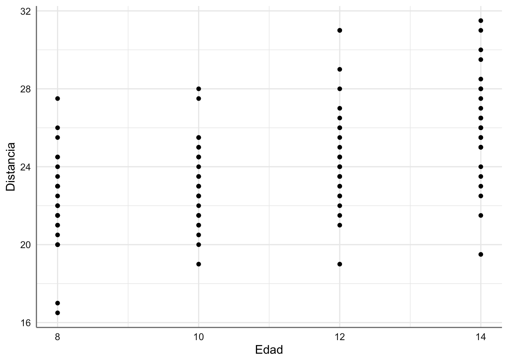
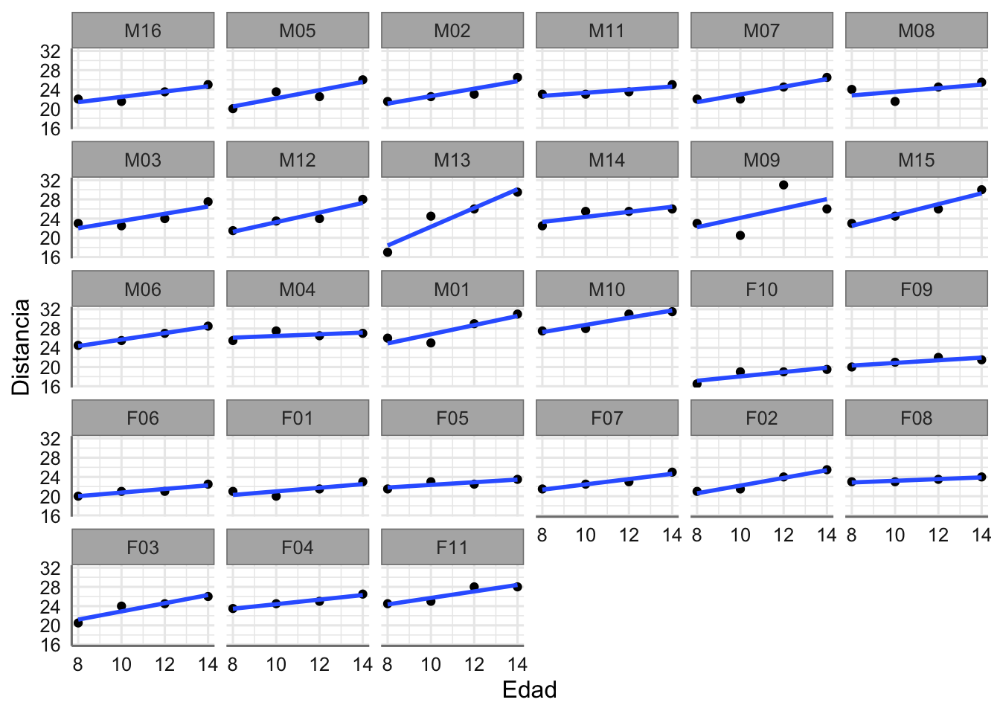
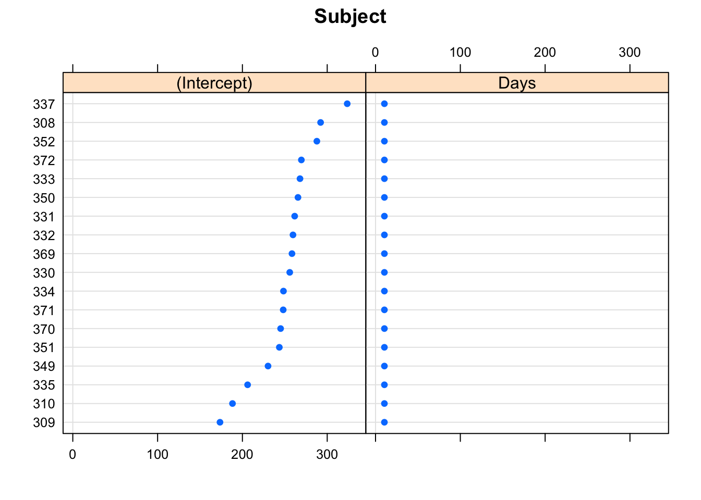
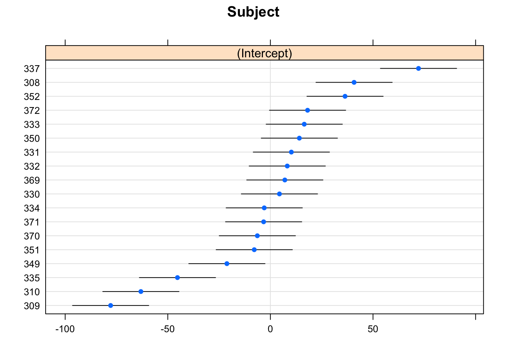
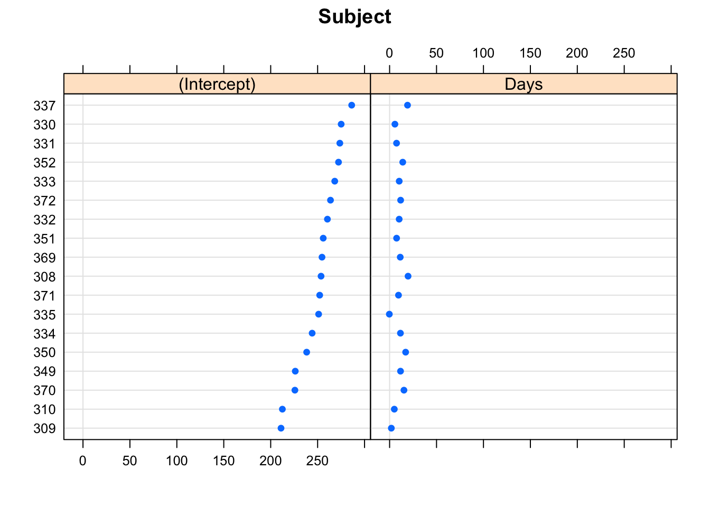
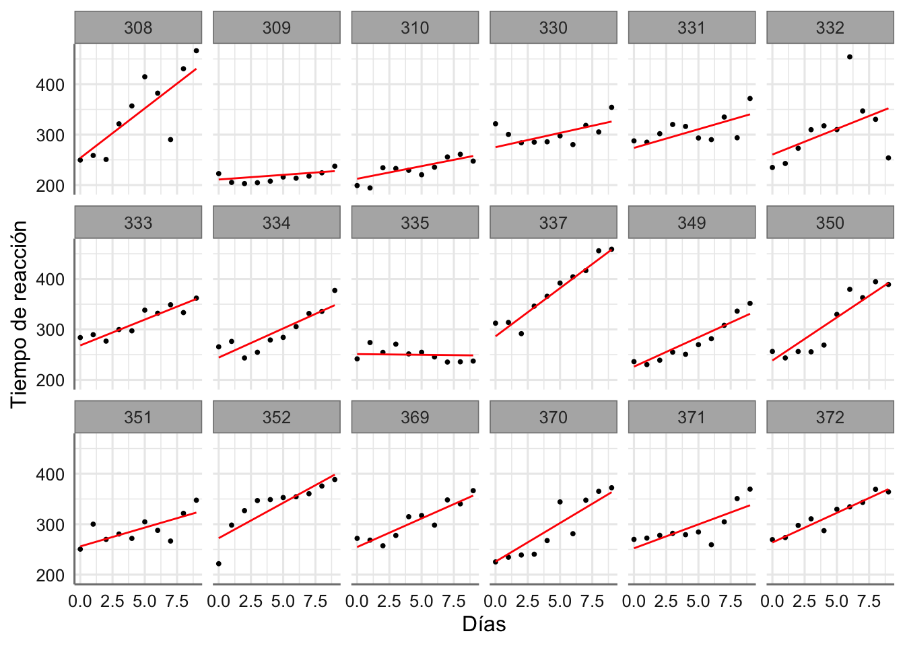
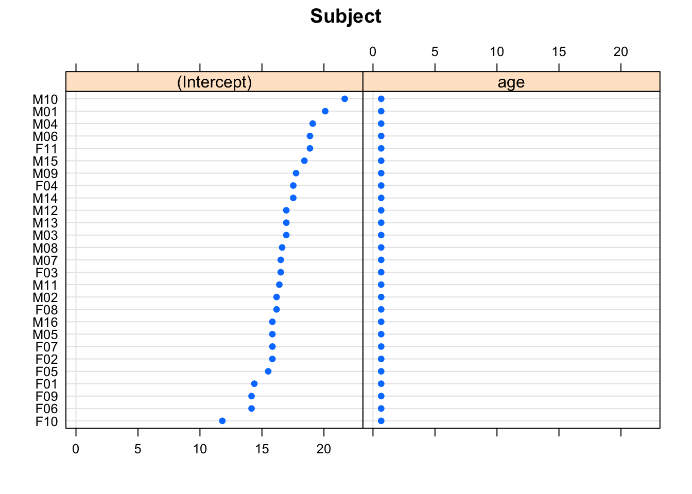
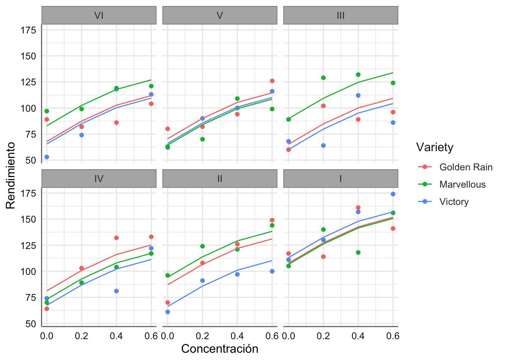
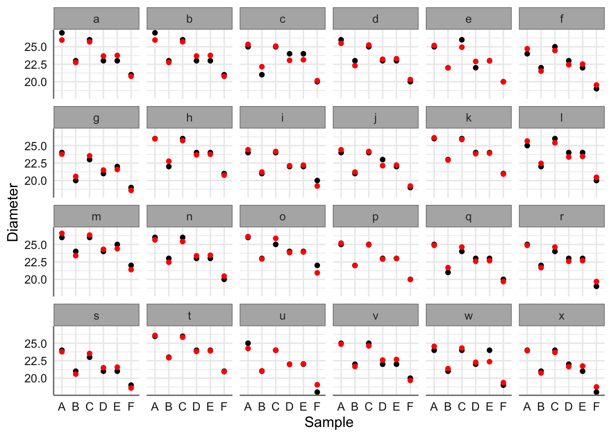
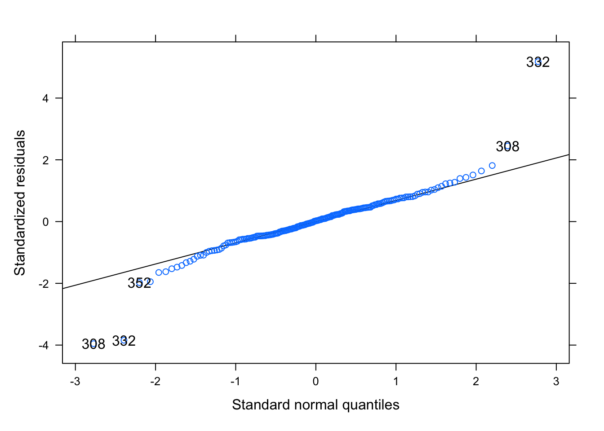

# Modelos Lineales Mixtos {#mmixed}

Los modelos mixtos lineales son los más generales de los vistos hasra ahora ya que permiten estudio de las diferentes componentes de variabilidad que determinan el comportamiento de una variable respuesta, es decir, nos permite tner en cuenta efectos intrínsecos del diseño experimental que no son de interés directo para el estudio del comportamiento de la respuesta. Aplicaciones de este tipo de modelos son:

-   Estructuras anidadas de datos.
-   Estructuras con medidas repetidas.
-   Otros modelos con diferentes fuentes de variabilidad.

Los modelos mixtos surgen por la necesidad de contemplar las diferentes fuentes de variabilidad presentes en un diseño experimental cuando las variables asociadas no son de interese principal para estudiara el comportamiento de la respuesta. También se utilizan para representar la estructura jerárquica inherente en muchos diseños experimentales.

Estos modelos parten de la idea que los coeficientes del modelo se pueden descomponer en una parte determinista (coeficiente del modelo) y una parte aleatoria, de forma que:

$$V_{Total} = V_{modelo} + V_{diseño} + V_{Residual},$$

que en términos del diseño se escribe como:

$$Y = X\beta + Zb + \epsilon$$ donde $Z$ es la matriz de efectos aleatorios asociados al diseño experimental y $b$ el conjunto de coeficientes asociado. De esta forma la variabilidad residual asociada al modelo con efectos fijos se descompone en varaibildiad deñ diseño y la varaibilidad que queda por explicar. Como ocurría en los modelos lineales se deben establecer las hipótesis sobre las componenetes aleatorias del modelo, en este caso:

$$b \sim N(0, H)$$

$$\epsilon \sim N(0, \sigma^2 I)$$

Para el análisis de estos modelos es necesario instalar las librerías `lme4`, `nlme`, y `lattice`.


```
## 
## Attaching package: 'lme4'
```

```
## The following object is masked from 'package:nlme':
## 
##     lmList
```

```
## The following object is masked from 'package:mosaic':
## 
##     factorize
```

Antes de presentar los modelos de efectos mixtos lineales más habituales vamos a proceer a presntar los diferentes ejemplos con los que trabajaremos.

## Ejemplos

Los ejemplos se han extraido de los disponibles en las linbrerías `lme4` y `nlme.`

### Estudio del sueño

Este ejmplo contiene los resultados sobre un estudio sobre el tiempo de reacción medio por día de un conjunto de sujetos sometidos a diferentes procesos de privación de sueño. En el día 0 los sujetos tuvieron su cantidad normal de sueño. A partir de esa noche se les restringió a 3 horas de sueño por noche. Las observaciones representan el tiempo de reacción medio en una serie de pruebas realizadas cada día a cada sujeto. Las variables consideradas son:

-   `Reaction`: tiempo medio de reacción de un sejeto en un día específico.
-   `Days`: dia del ensayo.
-   `Subject`: identificador del sujeto bajo estudio.


```r
data(sleepstudy)
str(sleepstudy)
```

```
## 'data.frame':	180 obs. of  3 variables:
##  $ Reaction: num  250 259 251 321 357 ...
##  $ Days    : num  0 1 2 3 4 5 6 7 8 9 ...
##  $ Subject : Factor w/ 18 levels "308","309","310",..: 1 1 1 1 1 1 1 1 1 1 ...
```

En estye caso existe un variable predictora (`Days`) que trata de explicar el comportamiento de la respuesta, pero el diseño experimental introduce una fuente de variabilidad asociada a cada uno de los sujetos considerados que debería ser tenida en cuenta. Dado que los sujetos son una muestra aleatoria deberíamos introducir ese efecto como aleatorio y no como fijo. Analizamos gráficamente el comportamiento de los datos del estudio. En primer lugar consideramos que cada observación recogida es independiente, es decir, nos olvidamos de la variable sujeto. Se puede ver como el tiempo de reacción aumneta con el paso de los días.


```r
ggplot(sleepstudy, aes(x = Days, y = Reaction)) +
  geom_point() +
  xlab("Días") +
  ylab("Tiempo de reacción") 
```


Veamos que pasa cuando consideramos el efecto aleatorio del sujeto;


```r
ggplot(sleepstudy, aes(x = Days, y = Reaction)) +
  geom_point() +
  xlab("Días") +
  ylab("Tiempo de reacción") +
  facet_wrap(~ Subject, ncol = 6)
```


Ahora se puede ver que todos los sujetos no se comportan de la misma forma, ya que hay algunos donde la evolución con los días es más pronunciada que en otros. Además se puede ver que al incio del estudio los tiempos de reacción también son diferentes entre los sujetos considerados. Por stos motivos es necesario contemplar la introducción de un efecto aleatorio que represente a los sujetos y permita estimar de forma correcta el comportamiento de cada uno de ellos.

### Estudio de ortodoncia

El conjunto de datos de Ortodoncia contiene 108 filas y 4 variables. El objetivo es estudair el cambio en una medida de ortodoncia a lo largo del tiempo para varios sujetos jóvenes. En concreto las variables consideradas son:

-   `distance`: distancia desde la pituitaria hasta la fisura pterigomaxilar (en mm). Estas distancias se miden en imágenes de rayos X del cráneo.
-   `age`: edad del sujeto ( en años). Tenemso cuatro mediciones por sujeto e las edades de 8, 10, 12 y 14 años.
-   `Subject`: factor ordenado indicando el sujeto en el que se realizó la medición. Los niveles están etiquetados de M01 a M16 para los hombres y de F01 a F13 para las mujeres. La ordenación es por distancia media creciente dentro del sexo.
-   `Sex`: un factor con niveles Masculino y Femenino

En este experimento tenemos de nuevo un posible efecto del sujeto considerado. Veamos a continuación los datos del experimento y su representación gráfica.


```r
data("Orthodont")
str(Orthodont)
```

```
## Classes 'nfnGroupedData', 'nfGroupedData', 'groupedData' and 'data.frame':	108 obs. of  4 variables:
##  $ distance: num  26 25 29 31 21.5 22.5 23 26.5 23 22.5 ...
##  $ age     : num  8 10 12 14 8 10 12 14 8 10 ...
##  $ Subject : Ord.factor w/ 27 levels "M16"<"M05"<"M02"<..: 15 15 15 15 3 3 3 3 7 7 ...
##  $ Sex     : Factor w/ 2 levels "Male","Female": 1 1 1 1 1 1 1 1 1 1 ...
##  - attr(*, "outer")=Class 'formula'  language ~Sex
##   .. ..- attr(*, ".Environment")=<environment: R_GlobalEnv> 
##  - attr(*, "formula")=Class 'formula'  language distance ~ age | Subject
##   .. ..- attr(*, ".Environment")=<environment: R_GlobalEnv> 
##  - attr(*, "labels")=List of 2
##   ..$ x: chr "Age"
##   ..$ y: chr "Distance from pituitary to pterygomaxillary fissure"
##  - attr(*, "units")=List of 2
##   ..$ x: chr "(yr)"
##   ..$ y: chr "(mm)"
##  - attr(*, "FUN")=function (x)  
##   ..- attr(*, "source")= chr "function (x) max(x, na.rm = TRUE)"
##  - attr(*, "order.groups")= logi TRUE
```


```r
ggplot(Orthodont, aes(x = age, y = distance)) +
  geom_point() +
  xlab("Edad") +
  ylab("Distancia") 
```



Se puede apreciar una tendencia creciente de la distancia con la edad considerando cada fila del banco de datos como independiente del resto. Podemos añadir el efecto del sexo:


```r
ggplot(Orthodont, aes(x = age, y = distance, color = Sex)) +
  geom_point() +
  xlab("Edad") +
  ylab("Distancia") 
```


Ahora además podemos apreciar un posible efecto del sexo. Procedemoe con el gráfico por sujeto. En este caso vamos a introducir una aproximación de lo que sería la tendencia para cada uno de los sujetos:


```r
ggplot(Orthodont, aes(x = age, y = distance)) +
  geom_point() +
  geom_smooth(method = gam, se = FALSE) +
  xlab("Edad") +
  ylab("Distancia") +
  facet_wrap(~ Subject, ncol = 6)
```

```
## `geom_smooth()` using formula 'y ~ x'
```



Como ocurría en el ejemplo anterior podemos observar que no todos los sujetos tienen un comportamiento similar, reforzando el hecho de que hay que tener en cuenta el efecto aleatorio del sujeto en el análisis de este modelo.

### Estudio de pixel

El conjunto de datos de `pixel` tiene 102 filas y 4 columnas donde la variable objetivo registra la intensidad de los píxeles de las tomografías de los perros a lo largo del tiempo. Las varaibles consideradas son:

-   `Dog`: un factor con niveles de 1 a 10 que designa el perro en el que se realizó la exploración.
-   `Side`: un factor con niveles L y R que designa el lado escaneado del perro.
-   `day`: un valor numérico que indica el día posterior a la inyección del contraste en el que se realizó la exploración.
-   `pixel`: un valor numérico que indica la intensidad del píxel.

En este caso tenemos dos fuentes de variabilidad aleatoria. La primera hace referencia al sujeto (perro en este caso), y la segunda al lado del perro escaneado. Este segundo efecto está anidado dentro del efecto perro y se deberá teenr en cuenta de esta forma en el modeelo. Veasmo los datos y su representación gráfica:


```r
data("Pixel")
str(Pixel)
```

```
## Classes 'nmGroupedData', 'groupedData' and 'data.frame':	102 obs. of  4 variables:
##  $ Dog  : Factor w/ 10 levels "1","10","2","3",..: 1 1 1 1 1 1 1 3 3 3 ...
##  $ Side : Factor w/ 2 levels "L","R": 2 2 2 2 2 2 2 2 2 2 ...
##  $ day  : num  0 1 2 4 6 10 14 0 1 2 ...
##  $ pixel: num  1046 1044 1043 1050 1045 ...
##  - attr(*, "formula")=Class 'formula'  language pixel ~ day | Dog/Side
##   .. ..- attr(*, ".Environment")=<environment: R_GlobalEnv> 
##  - attr(*, "formulaList")=List of 2
##   ..$ Dog :Class 'formula'  language ~Dog
##   .. .. ..- attr(*, ".Environment")=<environment: R_GlobalEnv> 
##   ..$ Side:Class 'formula'  language ~Side
##   .. .. ..- attr(*, ".Environment")=<environment: R_GlobalEnv> 
##  - attr(*, "labels")=List of 2
##   ..$ x: chr "Time post injection"
##   ..$ y: chr "Pixel intensity"
##  - attr(*, "units")=List of 1
##   ..$ x: chr "(days)"
##  - attr(*, "order.groups")=List of 2
##   ..$ Dog : logi TRUE
##   ..$ Side: logi TRUE
##  - attr(*, "FUN")=function (x)  
##   ..- attr(*, "source")= chr "function (x) max(x, na.rm = TRUE)"
```

En este caso realizamos únicamente el gráfico que considera todos los efectos.


```r
ggplot(Pixel, aes(x = day, y = pixel, col = Side)) +
  geom_point() +
  xlab("Día") +
  ylab("pixel") +
  facet_wrap(~ Dog, ncol = 5)
```


Podemos ver como existe un efecto asociado con e perro y con el lado escaneado. Por ejemplo los perros 7 y 9 tienen comportamiento muy diferente, y dicho comportamiento no está asociado únicamente con el día sino con el propio sujeto utilizado.

### Estudio Avena

Este conjunto de datos hace referencia a un estudio para analizar el redimiento de producción de diferentes varaiedades de avena sujetas a diferentes condiciones experimentales. El area de estudio se distribuyó en 6 bloques de 3 parcelas principales, cada una de ellas dividida en 4 subparcelas. Cada variedad se aplico en cada una de las parcelas pricipales , mientras que los tratamiento de abonos se aplicaron en cada una de las subparcelas definidas. El banco de datos contiene las siguientes columnas:

-   `Block`: Bloques considerados con niveles I, II, III, IV, V y VI.
-   `Variety`: Variedades de avena consideradas con 3 niveles.
-   `nitro`: Tratamiento de nitrógeno (manurial) con niveles 0.0cwt, 0.2cwt, 0.4cwt y 0.6cwt, mostrando la aplicación en cwt/acre.
-   `yield`: Rendimiento en 1/4lbs por subparcela, cada una de ellas con una superficie de 1/80 acres.

En este caso tenemos como fuentes de variabilidad extra el bloque y la variedad aplicada dentro de cada bloque, ya que el objetivo principal es la influencia del tratamiento en la producción final de cada subparcela.


```r
data("Oats")
str(Oats)
```

```
## Classes 'nfnGroupedData', 'nfGroupedData', 'groupedData' and 'data.frame':	72 obs. of  4 variables:
##  $ Block  : Ord.factor w/ 6 levels "VI"<"V"<"III"<..: 6 6 6 6 6 6 6 6 6 6 ...
##  $ Variety: Factor w/ 3 levels "Golden Rain",..: 3 3 3 3 1 1 1 1 2 2 ...
##  $ nitro  : num  0 0.2 0.4 0.6 0 0.2 0.4 0.6 0 0.2 ...
##  $ yield  : num  111 130 157 174 117 114 161 141 105 140 ...
##  - attr(*, "formula")=Class 'formula'  language yield ~ nitro | Block
##   .. ..- attr(*, ".Environment")=<environment: R_GlobalEnv> 
##  - attr(*, "labels")=List of 2
##   ..$ y: chr "Yield"
##   ..$ x: chr "Nitrogen concentration"
##  - attr(*, "units")=List of 2
##   ..$ y: chr "(bushels/acre)"
##   ..$ x: chr "(cwt/acre)"
##  - attr(*, "inner")=Class 'formula'  language ~Variety
##   .. ..- attr(*, ".Environment")=<environment: R_GlobalEnv>
```

Analizamos gráficamente los datos del experimento:


```r
ggplot(Oats, aes(x = nitro, y = yield, col = Variety)) +
  geom_point() +
  xlab("Concentración") +
  ylab("Rendimiento") +
  facet_wrap(~ Block, ncol = 3)
```


¿Qué comportamiento observamos dentro de cada bloque?

### Estudio Penicilina

Los datos se describen en Davies y Goldsmith (1972) como procedentes de una investigación para "evaluar la variabilidad entre muestras de penicilina por el método de B. subtilis. En este método de prueba se vierte un medio de agar nutritivo inoculado a granel en una placa de Petri de aproximadamente 90 mm. de diámetro, conocida como placa. Cuando el medio ha fraguado, se pegan en la superficie seis pequeños cilindros huecos o macetas (de unos 4 mm. de diámetro) a intervalos igualmente espaciados. Se colocan unas gotas de las soluciones de penicilina que se van a comparar en los respectivos cilindros, y toda la placa se coloca en una incubadora durante un tiempo determinado. La penicilina se difunde desde los botes al agar, y esto produce una clara zona circular de inhibición del crecimiento de los organismos, que puede medirse fácilmente. El diámetro de la zona está relacionado de forma conocida con la concentración de penicilina en la solución.

En concreto se probaron seis muestras de penicilina utilizando el método de la placa de B. subtilis en cada una de 24 placas. La respuesta es el diámetro (mm) de la zona de inhibición del crecimiento del organismo. El banco de datos contiene 144 filas y tres variables:

-   `diameter`: diámetro (en mm) de la zona de inhibición del crecimiento del organismo.
-   `plate`: placa de ensayo. Un factor con niveles de `a` hasta `x`.
-   `sample`: muestra de penicilina. Un factor con niveles de `A` hasta `F`.

En este caso no hay variables predictoras, ya que tanto la muestra y la placa deben ser considerados efectos aleatorios. Veamos los datos y su representación gráfica:


```r
data("Penicillin")
str(Penicillin)
```

```
## 'data.frame':	144 obs. of  3 variables:
##  $ diameter: num  27 23 26 23 23 21 27 23 26 23 ...
##  $ plate   : Factor w/ 24 levels "a","b","c","d",..: 1 1 1 1 1 1 2 2 2 2 ...
##  $ sample  : Factor w/ 6 levels "A","B","C","D",..: 1 2 3 4 5 6 1 2 3 4 ...
```

```r
ggplot(Penicillin, aes(x = diameter, y = plate, col = sample)) +
  geom_point() +
  xlab("Diameter") +
  ylab("Sample") 
```


## Modelos teóricos

En este punto mostramos los modelos lineales de efctos aletorios más extendidos en la literatura. Comenzamos con la situación más sencilla donde tenemos una única variable predictora y donde se integran diferentes efectos aleatorios. Para el ajuste de estos modelos usamos la función `lmer` de la librería `lme4`.

### Modelo con interceptación aleatoria

Los modelos de interceptación aleatoria son aquellos donde se considera que exite una relación lineal entre $Y$ y $X$ para cada una de las unidades experimentales, pero donde la recta asociada a cada sujeto parte de un punto diferente (interceptación aleatoria). En este caso consideramos como efecto aleatorio la variable `subject`. La expresión del modelo en `R` viene dada por:


```r
lmer(Y ~ X + (1 | subject), datos)
```

### Modelo con interceptación y pendiente aleatoria

Los modelos de interceptación y pendiente aleatoria son aquellos donde se considera que exite una relación lineal entre $Y$ y $X$ para cada una de las unidades experimentales, pero donde la recta asociada a cada sujeto parte de un punto diferente (interceptación aleatoria) y tiene una pendiente distinta (pendiente aleatoria). Consideramos de nuevo el efecto aleatorio `subject`. La expresión del modelo en `R` viene dada por:


```r
lmer(Y ~ X + (X | subject), datos)
```

### Modelo con interceptación aletaoria y efectos anidados

Los modelos de interceptación aleatoria y efectos anidados son aquellos donde se considera que exite una relación lineal entre $Y$ y $X$ para cada una de las unidades experimentales, pero donde la recta asociada a cada sujeto parte de un punto diferente (interceptación aleatoria) asociado un dos efectos aleatorios donde uno de ellos está anidado en el otro. En este caso consideramos como efecto aleatorio la variable `grupo` y dentro la variable `subject`, es decir los sujetos dentro de cada grupo pueden comportarse de forma diferente. La expresión del modelo en `R` viene dada por:


```r
lmer(Y ~ X + (1 | grupo/subject), datos)
```

### Modelo con interceptación, pendiente aleatoria y efectos anidados

Como el modelo anterior pero considerando que las pendientes también son aleatorias. La expresión del modelo en `R` viene dada por:


```r
lmer(Y ~ X + (X | grupo/subject), datos)
```

### Modelo con interceptación aletaoria y efectos aditivos

Los modelos de interceptación aleatoria y efectos aditivos son aquellos donde se considera que exite una relación lineal entre $Y$ y $X$ para cada una de las unidades experimentales, pero donde la recta asociada a cada sujeto parte de un punto diferente (interceptación aleatoria) asociado a la suma de varios efectos aletorios. En este caso consideramos como efectos aleatorios la variable `grupo` y la variable `muestra`, es decir se suma el efcto del grupo al efecto de la muestra. La expresión del modelo en `R` viene dada por:


```r
lmer(Y ~ X + (1 | grupo) + (1 | muestra), datos)
```

## Ajuste y comparación de modelos

En este apartado obtenemos el ajuste de los diferentes modelos que podemos plantear para cada uno de los ejemplos presentados en apartados anteriores. En concreto, veremos la estimación e interpretación de las componentes de cada uno de los modelos planteados y veremos como comparalos utilizando el test `F`.

### Estudio del sueño

Para los datos de estudio de sueño, y la vista de los gráficos realizados podemos plantear los modelos siguientes:

-   Modelo sin efecto aletorio (Reaction vs Days).
-   Modelo con interceptación aletoria por sujeto. Ajustamos una recta para cada sujeto donde partímos de interceptaciones diferentes.
-   Modelo con interceptación y pendientes aletorias por sujeto. Ajustamos una recta para cada sujeto donde partímos de interceptaciones diferentes y la evolución (pendiente) para cada uno de ellos puede ser diferente.


```r
fit1 <- lm(Reaction ~ Days, sleepstudy)
fit2 <- lmer(Reaction ~ Days + (1 | Subject), sleepstudy)
fit3 <- lmer(Reaction ~ Days + (Days | Subject), sleepstudy)
```

Analizamos individualmente cada uno de los modelos antes de proceder con una comparación formal.


```r
summary(fit1) 
```

```
## 
## Call:
## lm(formula = Reaction ~ Days, data = sleepstudy)
## 
## Residuals:
##      Min       1Q   Median       3Q      Max 
## -110.848  -27.483    1.546   26.142  139.953 
## 
## Coefficients:
##             Estimate Std. Error t value Pr(>|t|)    
## (Intercept)  251.405      6.610  38.033  < 2e-16 ***
## Days          10.467      1.238   8.454 9.89e-15 ***
## ---
## Signif. codes:  0 '***' 0.001 '**' 0.01 '*' 0.05 '.' 0.1 ' ' 1
## 
## Residual standard error: 47.71 on 178 degrees of freedom
## Multiple R-squared:  0.2865,	Adjusted R-squared:  0.2825 
## F-statistic: 71.46 on 1 and 178 DF,  p-value: 9.894e-15
```

El ajuste obtenido nos proporciona la recta:

$$\widehat{Reaction} = 251.41 + 10.47*Days$$

mostrando que el tiempo de reacción aumenta con el paso de los días y la reducción del número de horas de sueño, mientras que la desviación típica del error se sitúa en el valor 47.71, lo que indica que la parte sin explicar del modelo es muy superior a la parte explicada ($R^2$ pequeño). La solución gráfica de este modelo viene dada por:


```r
sleepstudy$predic1 <- predict(fit1)
ggplot(sleepstudy, aes(x = Days, y = Reaction)) +
  geom_point(cex = 0.7) +
  geom_line(aes(Days,predic1), col ="red") +
  xlab("Días") +
  ylab("Tiempo de reacción") 
```


Para el modelo con interceptación aleatoria (fit2) tenemos que:


```r
summary(fit2) 
```

```
## Linear mixed model fit by REML ['lmerMod']
## Formula: Reaction ~ Days + (1 | Subject)
##    Data: sleepstudy
## 
## REML criterion at convergence: 1786.5
## 
## Scaled residuals: 
##     Min      1Q  Median      3Q     Max 
## -3.2257 -0.5529  0.0109  0.5188  4.2506 
## 
## Random effects:
##  Groups   Name        Variance Std.Dev.
##  Subject  (Intercept) 1378.2   37.12   
##  Residual              960.5   30.99   
## Number of obs: 180, groups:  Subject, 18
## 
## Fixed effects:
##             Estimate Std. Error t value
## (Intercept) 251.4051     9.7467   25.79
## Days         10.4673     0.8042   13.02
## 
## Correlation of Fixed Effects:
##      (Intr)
## Days -0.371
```

En la parte de efectos fijos (comportamiento promedio de todos los sujetos) podemos ver que el modelo ajustado viene dado por la misma expresión que en el modelo anterior:

$$\widehat{Reaction} = 251.41 + 10.47*Days$$

mientras que con respecto a los efectos aleatorios podemos ver que la desviación típica residual del error se ha reducido hasta 30.99, y la desviación tipica asociada al efecto alaetorio de la interceptación es de 37.12, es decir, explicamos el 54.5% de la variabilidad total observada a través de la introducción del efecto aleatorio lo que redundará en mejores estimaciones y un modelo para cada sujeto.

Representamos loe efectos fijos y aleatorios asociados a cada sujeto (ahora tenemos un modelo individual por sujeto).


```r
# Efectos fijos
dotplot(coef(fit2))
```

```
## $Subject
```



```r
# Efectos aleatorios
dotplot(ranef(fit2))
```

```
## $Subject
```



En el gráfico de efectos fijos podemos ver que el coeficiente asociado a Days es constante, mientars que la interceptación es diferente por sujeto, dado que hemos introducido un efecto aleatorio sobre dicho coeficiente. Este efecto se ve claramente en el gráfico de efectos aleatorios donde podemos ver los cambios en la interceptación de cada uno de los sujetos, indicando que cada sujeto parte de un punto distinto.

Veamos ahora la predicción del modelo:


```r
sleepstudy$predic2 <- predict(fit2)
ggplot(sleepstudy, aes(x = Days, y = Reaction)) +
  geom_point(cex = 0.7) +
  geom_line(aes(Days,predic2), col ="red") +
  xlab("Días") +
  ylab("Tiempo de reacción") +
  facet_wrap(~ Subject, ncol = 6)
```


Podemos ver que todas las rectas de predicción tienen la misma pendiente pero parten de interceptaciones distintas.

Para el modelo con interceptación y pendiente aleatoria (fit3) tenemos que:


```r
summary(fit3) 
```

```
## Linear mixed model fit by REML ['lmerMod']
## Formula: Reaction ~ Days + (Days | Subject)
##    Data: sleepstudy
## 
## REML criterion at convergence: 1743.6
## 
## Scaled residuals: 
##     Min      1Q  Median      3Q     Max 
## -3.9536 -0.4634  0.0231  0.4634  5.1793 
## 
## Random effects:
##  Groups   Name        Variance Std.Dev. Corr
##  Subject  (Intercept) 612.10   24.741       
##           Days         35.07    5.922   0.07
##  Residual             654.94   25.592       
## Number of obs: 180, groups:  Subject, 18
## 
## Fixed effects:
##             Estimate Std. Error t value
## (Intercept)  251.405      6.825  36.838
## Days          10.467      1.546   6.771
## 
## Correlation of Fixed Effects:
##      (Intr)
## Days -0.138
```

De nuevo la ecaución asociada con los efectos fijos es la misama que en los modelos anteriores pero podemos ver que la descomposición de la variabilidad asociada con las componentes aleatorias nos indica que la variabilidad asociada con el error es 25.592, mientras que con respecto a la interceptación es de 24.741, y la pendiente de 5.922. Por tanto, la varaibildiad asociada con los efctos aletaorios reepresenta más del 50% de la varaibilidad observada, lo que indica que ambos efectos son necesarios, ya que mejoramos los resultados del modelo anterior. También podemos ver que los efectos aleatorios pueden considerarse independientes ya que su correlación es de 0.07.

Representamos loe efectos fijos y aleatorios asociados a cada sujeto (ahora tenemos un modelo individual por sujeto).


```r
# Efectos fijos
dotplot(coef(fit3))
```

```
## $Subject
```



```r
# Efectos aleatorios
dotplot(ranef(fit3))
```

```
## $Subject
```


Podemos ver como la introducción de ambos efectos aleatorios nos porporcionan interceptaciones y pendientes distintas para cada sujeto. De hecho, podemos ver que hay sujetos con pendientes que son prácticamente cero, y otros donde la pendiente es muy pronunciada (vinculada con los efectos aletorios postivos más grandes). El gráfico de predicción para este modelo viene dado por:


```r
sleepstudy$predic3 <- predict(fit3)
ggplot(sleepstudy, aes(x = Days, y = Reaction)) +
  geom_point(cex = 0.7) +
  geom_line(aes(Days,predic3), col ="red") +
  xlab("Días") +
  ylab("Tiempo de reacción") +
  facet_wrap(~ Subject, ncol = 6)
```



En el gráfico se aprecia claramente que las rectas estimadas por cada sujeto varían tanto en interceptación como en pendiente.

Podemos comparar los modelos obtenidos medainte el estadístico AIC, donde podremos ver que el mejor modelo es el fit3 (menor valor de AIC):


```r
AIC(fit1); AIC(fit2); AIC(fit3)
```

```
## [1] 1906.293
```

```
## [1] 1794.465
```

```
## [1] 1755.628
```

Por último, podemos comparar los modelos de efectos aleatorios para determinar estadísticamente si es preferible el modelo con pendeientes aleatorias frente al modelo sin pendientes aleatorias.


```r
anova(fit2, fit3)
```

```
## refitting model(s) with ML (instead of REML)
```

```
## Data: sleepstudy
## Models:
## fit2: Reaction ~ Days + (1 | Subject)
## fit3: Reaction ~ Days + (Days | Subject)
##      npar    AIC    BIC  logLik deviance  Chisq Df Pr(>Chisq)    
## fit2    4 1802.1 1814.8 -897.04   1794.1                         
## fit3    6 1763.9 1783.1 -875.97   1751.9 42.139  2  7.072e-10 ***
## ---
## Signif. codes:  0 '***' 0.001 '**' 0.01 '*' 0.05 '.' 0.1 ' ' 1
```

El p-valor obtenido muestra que es necesario considerar el modelo más complejo (interceptaciones y pendientes aleatorias).

### Estudio de ortodoncia

Para estos datos queremos explicar el comportamiento de la distancia en función de la edad, teniendo en cuenta que el crecimiento para cada sujeto puede ser diferente. Dicho efecto puede actuar sobre la interceptación, o sobre la interceptación y la pendiente. Consideramos los modelos:


```r
fit1 <- lmer(distance ~ age + (1 | Subject), Orthodont)
fit2 <- lmer(distance ~ age + (age | Subject), Orthodont)
```

Comparamos ambos modelos antes de proceder con su análisis


```r
anova(fit1, fit2)
```

```
## refitting model(s) with ML (instead of REML)
```

```
## Data: Orthodont
## Models:
## fit1: distance ~ age + (1 | Subject)
## fit2: distance ~ age + (age | Subject)
##      npar    AIC    BIC  logLik deviance  Chisq Df Pr(>Chisq)
## fit1    4 451.39 462.12 -221.69   443.39                     
## fit2    6 451.21 467.30 -219.61   439.21 4.1779  2     0.1238
```

Dado que el p-valor resulta no significativo podemos considerar que ambos modelos son iguales y optamos por quedarnos con el más sencillo, que sólo contempla un efecto aleatorio sobre la interceptación. Analizamos el modelo considerado:


```r
summary(fit1)
```

```
## Linear mixed model fit by REML ['lmerMod']
## Formula: distance ~ age + (1 | Subject)
##    Data: Orthodont
## 
## REML criterion at convergence: 447
## 
## Scaled residuals: 
##     Min      1Q  Median      3Q     Max 
## -3.6645 -0.5351 -0.0129  0.4874  3.7218 
## 
## Random effects:
##  Groups   Name        Variance Std.Dev.
##  Subject  (Intercept) 4.472    2.115   
##  Residual             2.049    1.432   
## Number of obs: 108, groups:  Subject, 27
## 
## Fixed effects:
##             Estimate Std. Error t value
## (Intercept) 16.76111    0.80240   20.89
## age          0.66019    0.06161   10.72
## 
## Correlation of Fixed Effects:
##     (Intr)
## age -0.845
```

El modelo para el comportamiento promedio (obtenido mediante los efectos fijos del modelo) viene dado por:

$$\widehat{distance} = 16.76 + 0.66*age$$ Por otro lado, la variabilidad asociada con el efecto aletorio considerado (2.12) es superior a la asociado con los residuos (1.43), con lo que la consideración del efecto aletorio es muy conveniente en este modelo, ya que reducimos sensiblemente el error aleatorio del modelo.

Representamos loe efectos fijos y aleatorios asociados a cada sujeto (ahora tenemos un modelo individual por sujeto).


```r
# Efectos fijos
dotplot(coef(fit1))
```

```
## $Subject
```



```r
# Efectos aleatorios
dotplot(ranef(fit1))
```

```
## $Subject
```


En los efectos aletorios obtenidos podemos ver las diferencias entre los diferentes sujetos del estudio, con sujetos con valores muy bajos y otros con valores muy altos.

El gráfico de predicción para este modelo viene dado por:


```r
Orthodont$predic <- predict(fit1)
ggplot(Orthodont, aes(x = age, y = distance)) +
  geom_point(cex = 0.7) +
  geom_line(aes(age,predic), col ="red") +
  xlab("Edad") +
  ylab("Distancia") +
  facet_wrap(~ Subject, ncol = 6)
```


Todas las rectas estimadas tienen la msima pendiente pero parten de puntos iniciales diferentes.

### Estudio de pixel

Para estos datos queremos explicar el comportamiento de la intensidad del pixel en función del día, y consideramos el efecto aletorio del perro y del lado del perro muestreado como un efectoa anidado dentro de él. Además como la tendencia media no se correspondía exactamente con una recta sino más bien como un polinomio en gtado dos para el día, consideraremos también la incorporación de este efecto. Los modelos considerados son:


```r
# Modelo lineal con interceptación aleatoria
fit1 <- lmer(pixel ~ day + (1 | Dog/Side), Pixel)
# Modelo lineal con interceptación y pendiente aleatoria
fit2 <- lmer(pixel ~ day + (day | Dog/Side), Pixel)
```

```
## boundary (singular) fit: see help('isSingular')
```

```r
# Modelo polinómico con interceptación aleatoria
fit3 <- lmer(pixel ~ day + I(day^2) + (1 | Dog/Side), Pixel)
# Modelo polinómico con interceptación y pendiente aleatoria
fit4 <- lmer(pixel ~ day + I(day^2) + (day | Dog/Side), Pixel)
```

```
## boundary (singular) fit: see help('isSingular')
```

En este caso no podemos comparar todos los modelos de golpe mediante el test F porque no están anidados entre ellos. Utilizamos el estadístico AIC para determinar el mejor de ellos:


```r
AIC(fit1);AIC(fit2);AIC(fit3);AIC(fit4)
```

```
## [1] 899.5381
```

```
## [1] 908.8714
```

```
## [1] 876.839
```

```
## [1] 842.0051
```

El valor más bajo se obtiene para el modelo polinómico con interceptación y pendiente aleatoria. Analizamos el modelo obtenido:


```r
summary(fit4)
```

```
## Linear mixed model fit by REML ['lmerMod']
## Formula: pixel ~ day + I(day^2) + (day | Dog/Side)
##    Data: Pixel
## 
## REML criterion at convergence: 822
## 
## Scaled residuals: 
##      Min       1Q   Median       3Q      Max 
## -2.95926 -0.52629 -0.00073  0.47547  2.87733 
## 
## Random effects:
##  Groups   Name        Variance Std.Dev. Corr 
##  Side:Dog (Intercept) 108.2123 10.4025       
##           day           0.9771  0.9885  1.00 
##  Dog      (Intercept) 894.1972 29.9031       
##           day           2.9232  1.7097  -0.67
##  Residual              75.7829  8.7053       
## Number of obs: 102, groups:  Side:Dog, 20; Dog, 10
## 
## Fixed effects:
##              Estimate Std. Error t value
## (Intercept) 1073.3610    10.1563 105.684
## day            6.1309     0.8652   7.086
## I(day^2)      -0.3679     0.0329 -11.182
## 
## Correlation of Fixed Effects:
##          (Intr) day   
## day      -0.516       
## I(day^2)  0.181 -0.657
## optimizer (nloptwrap) convergence code: 0 (OK)
## boundary (singular) fit: see help('isSingular')
```

El modelo para la pobalción media viene dado por:

$$\widehat{pixel} = 1073.36 + 6.13*Day - 0.37*Day^2$$

Mientars que podemos ver como la suma de las variabildiades asociadas a todos los efectos aleatorios es muy superior a la variabilidad residual. Las variabildiades más grandes corresponden a la interceptación en ambos efectos (Dog y Dog/Side), indicando que la mayor diferencia se da entre los diferentes perros, pero que también el lado escaneado es relevante. Los efectos sobre las pendientes son mucho más pequeños debido a que la consideración del polinomio sobre la tendencia media hace que dicho efecto sea mucho más pequeño.

Representamos los efectos aleatorios asociados a cada perro.


```r
# Efectos aleatorios
dotplot(ranef(fit4))
```

```
## $`Side:Dog`
```


```
## 
## $Dog
```


Por último vemos la predicción conseguida:


```r
Pixel$predic <- predict(fit4)
ggplot(Pixel, aes(x = day, y = pixel)) +
  geom_point(aes(col = Side)) +
  geom_line(aes(day, predic, col = Side)) +
  xlab("Día") +
  ylab("pixel") +
  facet_wrap(~ Dog, ncol = 5)
```


¿qué podemos decir sobre la predicción obtenida?

### Estudio de avena

Para estos datos queremos explicar el comportamiento del rendimiento en función de la concentración de nitrógeno y la variedad teniendo en cuenta el diseño experimental que establece un efecto aleatorio por Bloque y la variedad dentro del bloque. En la parte de eectos fijos debemos tener en cuenta que la concentración de Nitrógeno es una factor ordenado, y que debemos valorar la posible interacción entre la varaiedad y la concentración de nitrógeno. Para idicar que tenemos un factor ordenado utilizaremos la función `ordered`. Consideramos los modelo siguientes:


```r
# Modelo lineal sin interacción con interceptación aleatoria
fit1 <- lmer(yield ~ ordered(nitro) + Variety + (1 | Block/Variety), Oats)
# Modelo lineal con interacción con interceptación aleatoria
fit2 <- lmer(yield ~ ordered(nitro) * Variety + (1 | Block/Variety), Oats)
```

Valoramos con el test F ambos modelos:


```r
anova(fit1, fit2)
```

```
## refitting model(s) with ML (instead of REML)
```

```
## Data: Oats
## Models:
## fit1: yield ~ ordered(nitro) + Variety + (1 | Block/Variety)
## fit2: yield ~ ordered(nitro) * Variety + (1 | Block/Variety)
##      npar    AIC    BIC  logLik deviance  Chisq Df Pr(>Chisq)
## fit1    9 616.04 636.53 -299.02   598.04                     
## fit2   15 625.91 660.06 -297.95   595.91 2.1375  6     0.9066
```

Dado que el p-valor no resulta significativo nos quedamos con el modelo más simple que no considera el efecto de interacción. Analizamos el modelo obtenido:


```r
summary(fit1)
```

```
## Linear mixed model fit by REML ['lmerMod']
## Formula: yield ~ ordered(nitro) + Variety + (1 | Block/Variety)
##    Data: Oats
## 
## REML criterion at convergence: 569.5
## 
## Scaled residuals: 
##      Min       1Q   Median       3Q      Max 
## -1.84135 -0.66280 -0.06694  0.63822  1.66067 
## 
## Random effects:
##  Groups        Name        Variance Std.Dev.
##  Variety:Block (Intercept) 109.7    10.47   
##  Block         (Intercept) 214.5    14.65   
##  Residual                  162.6    12.75   
## Number of obs: 72, groups:  Variety:Block, 18; Block, 6
## 
## Fixed effects:
##                   Estimate Std. Error t value
## (Intercept)       104.5000     7.7975  13.402
## ordered(nitro).L   32.9447     3.0052  10.963
## ordered(nitro).Q   -5.1667     3.0052  -1.719
## ordered(nitro).C   -0.4472     3.0052  -0.149
## VarietyMarvellous   5.2917     7.0789   0.748
## VarietyVictory     -6.8750     7.0789  -0.971
## 
## Correlation of Fixed Effects:
##             (Intr) or().L or().Q or().C VrtyMr
## ordrd(nt).L  0.000                            
## ordrd(nt).Q  0.000  0.000                     
## ordrd(nt).C  0.000  0.000  0.000              
## VartyMrvlls -0.454  0.000  0.000  0.000       
## VarityVctry -0.454  0.000  0.000  0.000  0.500
```

Como tenemos cuatro dosis nitrógeno el modelo ajusta tres efectos polinómicos asociados con dicho efecto (L = lineal, Q = cuadrático, y C = cúbico). Además podemos ver las diferencias entre las tres variaedades consideradas. En cuanto a los efectos aletorios podemos ver que la varainza residual es la mitad de las varainzas que obtenemos al introducir los efectos aleatorios.

En este caso vamos a ver directamente la predicción del modelo obtenida:


```r
Oats$predic <- predict(fit1)
ggplot(Oats, aes(x = nitro, y = yield)) +
  geom_point(aes(col = Variety)) +
  geom_line(aes(nitro, predic, col = Variety)) +
  xlab("Concentración") +
  ylab("Rendimiento") +
  facet_wrap(~ Block, ncol = 3)
```



### Estudio de penicilina

Para estos datos no existe un variable predictora definida ya que tanto sample como plate corresponden al diseño experimental pero pensamos que incidan directamente en la respuesta. que trata d explicar el comportamiento de la respuesta. Las variabilidades consideradas son las asociadas con la estructura experimental y en este caso sólo piden influir en el efecto común dado que no hay variables predictora.


```r
fit1 <- lmer(diameter ~ 1 + (1 | plate) + (1 | sample), Penicillin)
summary(fit1)
```

```
## Linear mixed model fit by REML ['lmerMod']
## Formula: diameter ~ 1 + (1 | plate) + (1 | sample)
##    Data: Penicillin
## 
## REML criterion at convergence: 330.9
## 
## Scaled residuals: 
##      Min       1Q   Median       3Q      Max 
## -2.07923 -0.67140  0.06292  0.58377  2.97959 
## 
## Random effects:
##  Groups   Name        Variance Std.Dev.
##  plate    (Intercept) 0.7169   0.8467  
##  sample   (Intercept) 3.7311   1.9316  
##  Residual             0.3024   0.5499  
## Number of obs: 144, groups:  plate, 24; sample, 6
## 
## Fixed effects:
##             Estimate Std. Error t value
## (Intercept)  22.9722     0.8086   28.41
```

¿cómo analizamos los resultados de este modelo?


```r
# gráfico de predicción
Penicillin$predic <- predict(fit1)
ggplot(Penicillin, aes(x = sample, y = diameter)) +
  geom_point() +
  geom_point(aes(x = sample, y = predic), col = "red") +
  xlab("Sample") +
  ylab("Diameter") +
  facet_wrap(~ plate, ncol = 6)
```



## Diagnóstico

Las hipótesis sobre los residuos de este tipo d emodelos son las mismas que sobre el resto de modelos lineales (independencia, linealidad y normalidad). En este caso utilizamos procedimientos gráficos únicamente. Mostramos su uso mediante un ejemplo y dejamos el resto como ejercicios prácticos. Utilizamos los datos del sueño tomando el modelo obtenido en el punto anterior:


```r
fit <- lmer(Reaction ~ Days + (Days | Subject), sleepstudy)
```

Obtenemos los gráficos de linealidad y normalidad para determianr si se verifican las hipótesis del modelo:


```r
plot(fit, type = c("p", "smooth"))
```


```r
qqmath(fit, id = 0.05)
```



En el primer gráfico se aprecía gran aleatoriedad en los residuos pero con algunos valores bastante grandes. Se podría analizar de nuevo este modelo prescindiendo de esas observaciones. En el segundo gráfico vemos como la distribución de los puntos es alrededor de la hipótetica linea de normalidad. Parece que se verifican ambas hipótesis y por tanto el modelo considerado es válido.
